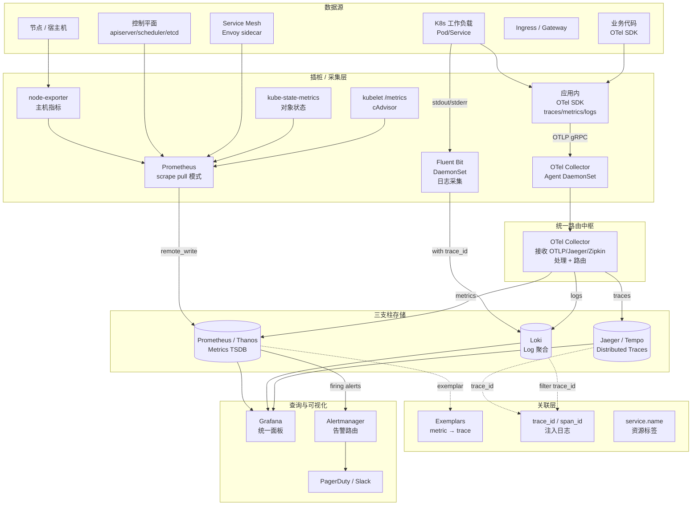

# 可观测性三支柱栈

## 统一架构图

## 三支柱定义与差异

可观测性（Observability）区别于"监控"：监控是预设问题的预定义回答；可观测性是让系统在**未知问题**出现时也能被探索。三支柱并非目的，而是探索不同维度的工具：

| 支柱 | 回答 | 粒度 | 成本 | 典型工具 |
|---|---|---|---|---|
| **Metrics** | 多少？趋势？阈值？ | 聚合数值 | 低（降采样） | Prometheus, Thanos, Mimir |
| **Logs** | 发生了什么？ | 离散事件 | 高（全文存储） | Loki, ELK |
| **Traces** | 一次请求怎么走？ | 单请求跨度 | 中（采样） | Jaeger, Tempo, Zipkin |

## OTel Collector 统一枢纽

**OpenTelemetry Collector**（CNCF 二代标准）是处理与路由中枢，三类组件：

- **Receivers**：OTLP、Jaeger、Zipkin、Prometheus scrape、filelog、k8sattributes。
- **Processors**：batch、memory_limiter、attributes、resource、filter、sampling、tail-based。
- **Exporters**：OTLP、Prometheus remote_write、Loki、Jaeger、Tempo、Datadog。

部署两种形态：**Agent（DaemonSet）** 在节点就近采集降低跨网络 RTT；**Gateway（多副本 Deployment + LB）** 做集中处理与多目的地路由。统一的 OTLP 协议让应用插桩无关后端，可平滑切换。

## 关联机制（核心价值）

支柱分离意义有限，**关联**才是可观测性价值所在：

- **Exemplars**：Prometheus 2.26+ 在直方图上挂载 trace_id，Grafana 一键从慢指标跳到具体 trace。
- **trace_id 注入日志**：应用从 span context 拿 `trace_id`/`span_id` 写入 log line，Loki 按此过滤。
- **资源属性一致**：`service.name`、`k8s.pod.name`、`k8s.namespace.name` 在三支柱保持同一组标签，Grafana 自动 join。

## 各支柱实践要点

**Metrics**：用 Prometheus client SDK 暴露 `/metrics`，Prometheus pull 模式 scrape；定义 RED（Rate/Errors/Duration）+ USE（Utilization/Saturation/Errors）黄金指标；使用 Histogram 而非 Summary；远程存储用 Thanos（对象存储 + 全局查询）或 Mimir。

**Logs**：结构化 JSON，必含 `ts/level/msg/trace_id`；DaemonSet 部署 Fluent Bit 或 Promtail，从 `/var/log/pods/*/*` tail；Loki 仅索引 label 而非全文，成本远低于 ES。

**Traces**：OTel SDK 自动插桩（HTTP/gRPC/DB driver）；采样策略：head-based（前置 1%）或 tail-based（按错误/延迟后置采样）；Jaeger/Tempo 存储，Tempo 用对象存储成本更低。

## SLO 与告警

最终用 SLI（指标）定义 SLO，基于 error budget 触发告警。Alertmanager 多受体（slack/email/pagerduty）+ 抑制/分组/静默。理想可观测栈：单一 Grafana 面板，三大支柱交叉跳转，无需登录多个工具。
