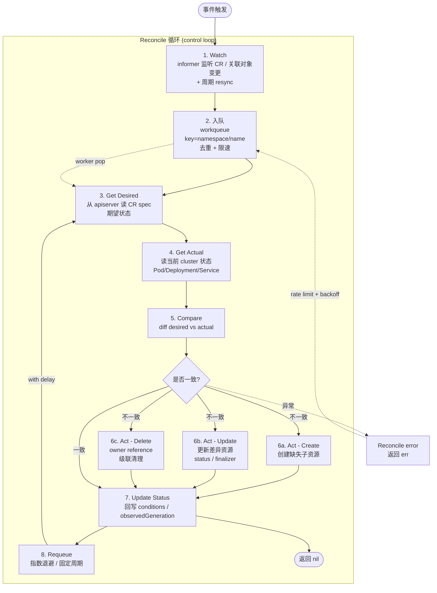

# Operator Reconcile Loop（调谐循环）

## 调谐循环流程图



## 三段式核心思想

Operator / Controller 本质是**"声明式 → 实际状态"的对齐器**。无论事件来自用户、其他 Controller 还是系统漂移，每个 Reconcile 函数都以"基于 key 重新求值"的方式工作：

```
Reconcile(key) -> (Result, error)
   1. 从 key 还原对象，读 spec（期望状态）
   2. 读 cluster 当前状态
   3. 比较两者
   4. 调整实际状态以匹配期望（创建/更新/删除）
   5. 更新 status，决定是否 requeue
```

关键设计原则：**Reconcile 必须幂等**。同一个 key 无论触发多少次，结果一致；不能依赖"上一次调用"的状态，每次都从 apiserver 重新拉取。这让 Operator 在重启、网络抖动、事件丢失后都能恢复。

## 详细阶段

### 1. Watch（监听）

通过 **client-go informer** 注册对 CR（如 `PostgresCluster`）及其关联资源（Pod、Service、Secret）的事件回调。informer 内部维护 **local cache + watch**，初次 List 全量建立 cache，后续 Watch 增量更新，避免每次 Reconcile 都打 apiserver。事件回调把对象的 `namespace/name` 写入 workqueue。`--default-resync=10m` 保证周期性重新求值（兜底丢失事件）。

### 2. Workqueue（限速队列）

**client-go workqueue**（或 controller-runtime 内部 queue）特性：去重（同 key 多事件合并）、限速（指数退避、令牌桶）、shutdown 协调。多个 worker goroutine 从 queue pop key 调用 Reconcile，处理完成标记 forget；失败则 requeue。

### 3-4. Get Desired & Actual

从 cache / apiserver 读 CR 拿期望状态（`spec`）；查关联子资源（按 label selector 或 ownerReference）拿当前状态。

### 5. Compare（diff）

声明式 diff：检查副本数、镜像 tag、配置 hash、版本、selector 等。controller-runtime 推荐用 `equality.Semantic.DeepEqual` 或 server-side apply；复杂情况用 patch（JSON merge / strategic merge / apply）。

### 6. Act（执行）

- **Create**：缺失子资源，用 ownerReference 关联实现级联删除。
- **Update**：差异字段 patch；优先用 server-side apply 避免冲突。
- **Delete**：用 **Finalizer** 模式确保外部资源（云卷、DNS 记录、第三方 API）清理完成才删除 CR。

### 7. Update Status

`status` 字段记录观察到的状态（conditions、phase、observedGeneration、子资源列表）。`observedGeneration == metadata.generation` 表示 spec 已被处理。写 status 时小心 **conflict**（用 retry-on-conflict）。

### 8. Requeue

返回 `Result{RequeueAfter: duration}` 决定下次同步（如证书续期检查每 1 小时；零表示依赖事件驱动）。出错返回 `error`，workqueue 自动指数退避（1s → 2s → 4s ... 上限 1000s）。

## 关键模式

- **Finalizer**：删除 CR 前阻止直接物理删除，让 Reconcile 有机会清理外部资源（"deletion_timestamp != nil" 时执行 cleanup，完成后移除 finalizer）。
- **Status Conditions**：用统一 conditions（type/status/reason/message/lastTransitionTime）描述状态，便于客户端查询。
- **Owner Reference**：子资源自动级联删除，避免孤儿。
- **Server-Side Apply**：多 Controller 共管同一对象字段无冲突，按 field ownership。
- **Leader Election**：用 Lease 多副本 Operator，仅一个活跃执行 Reconcile。
- **Event Broadcasting**：通过 `record.EventRecorder` 发送 Normal/Warning 事件，便于 `kubectl describe` 调试。

## 反模式

- ❌ **不幂等**：依赖闭包变量、上次结果，重启后失效。
- ❌ **多个 Reconcile 互相依赖隐式**：应通过 status / label 显式通信。
- ❌ **大循环做太多事**：单次 Reconcile 应快速（<10s），长操作用 Job / 子 CRD 分解。
- ❌ **忽略 error**：吞掉错误导致状态卡死。
- ❌ **直接 patch 不带 resourceVersion**：高并发覆盖丢失。
- ❌ **缓存之外做权威决策**：watch cache 可能滞后，写操作前重新 GET。

## 实现框架

- **kubebuilder / operator-sdk**：基于 controller-runtime，生成 boilerplate，提供 manager / cache / client 抽象。
- **Metacontroller**：声明式 lambda controller，适合简单 Operator。
- **KOPF（Python）/ operator-rs（Rust）/ java-operator-sdk**：非 Go 语言选择。

## 调试

`kubectl get <cr> -oyaml` 看 status.conditions；`kubectl describe` 看 events；Operator 日志按 key 过滤；调高日志级别观察每次 Reconcile 决策；用 `k9s` / `kd` 实时跟踪。
