# 平台工程 / 内部开发者平台（IDP）

## 分层架构图

```mermaid
graph TB
    subgraph DEV["开发者体验层"]
        PORTAL[开发者门户<br/>Backstage / Port / Humanitec<br/>软件目录 + 服务模板]
        CLI[平台 CLI<br/>score-compose / humanitec]
        IDE[IDE 集成<br/>VSCode 插件 / Copilot]
        DOC[文档站<br/>金路径指南 / API ref]
    end

    subgraph GOLDEN["金路径 / 抽象层"]
        SCORE[工作负载抽象<br/>Score / Helm / Kustomize]
        TEMPLATE[应用模板<br/>Backstage Scaffold<br/>cookiecutter]
        POLICY[策略即代码<br/>OPA / Kyverno]
        APPROVAL[审批工作流<br/>管理员 + 自动合规]
    end

    subgraph PLATFORM["平台服务层 (Platform as a Product)"]
        APPORCH[应用编排<br/>ArgoCD / Flux / Argo Rollouts]
        CONFIG[配置管理<br/>External Secrets / Kustomize]
        OBS[可观测<br/>Prometheus / Loki / Tempo]
        SEC[安全<br/>cosign / Trivy / Falco]
        NET[网络<br/>Ingress / Mesh / DNS]
        DATA[数据服务<br/>Postgres Operator / Kafka Operator]
        FINOPS[FinOps<br/>Kubecost / OpenCost]
    end

    subgraph RUNTIME["运行时抽象层"]
        K8S[Kubernetes 集群<br/>云上 / 自建 / 边缘]
        SERVERLESS[Serverless<br/>Knative / Fargate]
        FUNCTION[函数<br/>OpenFaaS / AWS Lambda]
        VM[容器化 VM<br/>KubeVirt]
    end

    subgraph INFRA["基础设施层"]
        CLOUD[公有云<br/>AWS / Azure / GCP]
        BAREMETAL[裸金属 / 自建]
        EDGE[边缘节点]
    end

    subgraph TEAM["平台团队职责"]
        BUILD[构建能力<br/>维护金路径]
        SUPPORT[开发者支持<br/>SLA / 工单]
        EVOLVE[演进路线图<br/>按用户反馈迭代]
    end

    DEV --> GOLDEN --> PLATFORM --> RUNTIME --> INFRA
    TEAM -.->|维护| GOLDEN
    TEAM -.->|维护| PLATFORM
    TEAM -.->|收集需求| DEV
```

## 平台工程核心理念

**Platform Engineering**（Gartner 2023 趋势）定义为："为软件交付和生命周期管理提供自助能力的一套方法和工具，作为产品交付给内部开发者"。关键特征：

1. **平台即产品**：内部平台有产品经理、用户（开发者）、路线图、版本管理、反馈循环，而不是临时拼装。
2. **金路径**（Paved Road / Golden Path）：提供经过验证、默认安全、自动化完整的标准交付路径，但允许开发者"off-road"。
3. **自助服务**：开发者点击模板即可获得环境、监控、CI/CD、密钥、网络，无需提工单。
4. **抽象层次**：把 K8s 复杂性藏在平台后，开发者面向"应用意图"（Score spec、Helm values）而非 YAML。

## 各层职责

### 开发者体验层

- **Backstage**（Spotify 开源，CNCF）作为开发者门户，提供软件目录（service inventory）、文档（TechDocs）、模板（Scaffolder）、插件生态。
- **Score**（Humanitec）/ **Application CRD** 提供工作负载声明，开发者声明意图，平台渲染为 Helm/Kustomize/云原生 manifest。
- **门户替代品**：Port、OpsLevel、Cortex、Humanitec。

### 金路径 / 抽象层

平台团队维护"路径模板"：服务骨架代码、CI/CD 流水线、监控仪表板、安全扫描配置、Secret 注入模板。开发者 `backstage create` 即获得"开箱即用"的合规应用。**策略即代码**（OPA/Kyverno）在路径上自动保障合规。

### 平台服务层（核心）

平台团队维护的能力（每个能力 = Operator + Controller + GitOps + 文档）：

- **应用编排**：ArgoCD/Flux GitOps + Argo Rollouts/Flagger 金丝雀。
- **配置管理**：External Secrets Operator + Vault/KMS，Kustomize 多环境 overlay。
- **可观测**：Prometheus + Grafana + Loki + Tempo 一体化，预设 dashboard 模板。
- **安全**：cosign 镜像签名、Trivy 扫描、Falco 运行时、Kyverno 准入。
- **网络**：Ingress（nginx/traefik）+ Gateway API + Service Mesh（Cilium/Istio）+ cert-manager。
- **数据服务**：CloudNativePG / Crunchy Postgres Operator、Strimzi Kafka、Zalando MySQL。
- **FinOps**：Kubecost 成本分配、showback/chargeback。

### 运行时抽象层

平台对外暴露"工作负载"概念，背后可路由到 Kubernetes（默认）、Serverless（Knative）、Function（OpenFaaS）、VM（KubeVirt）。开发者无需关心部署目标。

### 基础设施层

跨云、自建、边缘的统一抽象。Cluster API 管理集群生命周期；Crossplane 提供 Kubernetes-native 基础设施 CRD；Terraform/Bicep 处理集群外资源（VPC、数据库）。

## 成熟度模型

1. **Level 0** — 无平台：每个团队自己装 K8s、CI、监控。
2. **Level 1** — 共享集群：团队共用集群，配置手动复制。
3. **Level 2** — 工具集合：若干工具拼装（CI + ArgoCD + Prometheus），但无统一门户。
4. **Level 3** — 平台即产品：开发者门户 + 金路径 + 平台团队 SLA + 用户反馈。
5. **Level 4** — 自服务 + 自动化治理：路径自选，策略自动保障合规，平台 KPI 驱动迭代。

## 实施要点

- **平台团队**应包括产品经理（理解开发者痛点）、SRE、安全工程师，作为"内部创业团队"运作。
- **能力规划**按"服务最多次请求"优先（数据库、DNS、监控排前），避免大量工单。
- **避免 Big Bang**：从 1-2 条金路径起步（如 Java/Go web 服务），按反馈扩展。
- **指标**：MTTR、部署频率、开发到生产时间（DORA 指标）、开发者满意度（eNPS）。
- **避免**：把 K8s 直接暴露给开发者（YAML 海洋）；把"门户"当作终点（必须配套能力）。

## 反模式

- **门户但没有能力**：Backstage 装好但实际仍手填 YAML。
- **平台无产品经理**：按平台团队偏好而非用户需求演进。
- **过度抽象**：完全隐藏 K8s 让复杂场景无路可走，开发者"破窗"绕过。
- **每个能力重造**：不依赖开源 Operator，自研维护成本爆炸。

平台工程的最终目标是让开发者**像消费公有云一样消费内部能力**，把 K8s 复杂性转化为生产力。
