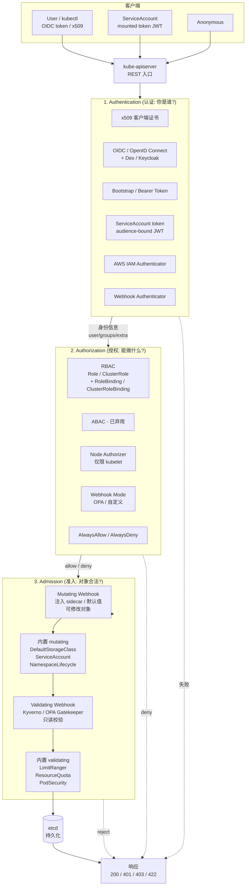

# Kubernetes RBAC 认证授权流程

## 请求生命周期

## 三阶段模型

每个 API 请求必经三个独立阶段，任何一阶段失败即被拒绝：

### 1. Authentication（认证）

回答"你是谁"。apiserver 串行尝试所有配置的认证插件，第一个成功即返回身份（`username / uid / groups / extra`）。常用认证方式：

- **x509 客户端证书**：CN=用户名，O=组，kubelet、admin 默认方式。
- **OIDC**：与 Dex/Keycloak/Azure AD 集成，Bearer JWT，`--oidc-issuer-url`。
- **ServiceAccount Token**：1.24+ 使用 bound token（含 audience、expiration），由 kubelet 自动挂载到 Pod。
- **Webhook / AWS IAM Authenticator**：企业 SSO 桥接。

### 2. Authorization（授权）

回答"你能做什么"。RBAC（Role-Based Access Control）是默认且推荐模式。RBAC 四个核心对象：

- **Role**：命名空间内权限集合（`rules: apiGroups/resources/verbs`）。
- **ClusterRole**：集群级权限集合，可被任意 namespace 引用。
- **RoleBinding**：把 Subject（User/Group/ServiceAccount）绑定到 Role。
- **ClusterRoleBinding**：把 Subject 绑定到 ClusterRole。

授权检查对所有 `verbs × resources × (namespaced?)` 元组求交，任一匹配则放行。`*` 作为通配，但需谨慎。聚合 ClusterRole（`aggregationRule`）通过 label selector 合并多个 ClusterRole。

替代模式：Node Authorizer（专门授权 kubelet）、ABAC（策略文件，已弃用）、Webhook（外部 OPA 等）。

### 3. Admission（准入）

回答"对象本身是否合法"。分两阶段，按注册顺序执行：

- **Mutating**（可修改对象）：ServiceAccount 自动注入、DefaultStorageClass 自动绑定、NamespaceDefaultLabel、PodPreset（已弃）、用户自定义 webhook（如 Istio sidecar 注入、Vault agent 注入）。可执行多次。
- **Validating**（只读校验）：LimitRanger、ResourceQuota、PodSecurity（1.25 替代 PSP）、RequiredNamespace、用户自定义 webhook（OPA Gatekeeper、Kyverno 策略）。任一失败整体回滚。

最终对象经准入层处理后才写入 etcd，返回响应。

## 安全建议

- 启用**审计日志**（audit policy）记录每阶段决策。
- 优先用 **OIDC + 组**做人员认证，避免直接发证书。
- ServiceAccount 用 **bound token + Workload Identity / IRSA** 替代长期 secret。
- RBAC 遵循**最小权限**：用 namespace Role 替代 ClusterRole，使用 `resourceNames` 缩窄。
- Validating Admission Policy（1.30+ GA）用 CEL 表达式替代部分 webhook，减少延迟。
- 生产环境关闭 anonymous-auth，开启 RBAC deny audit。
