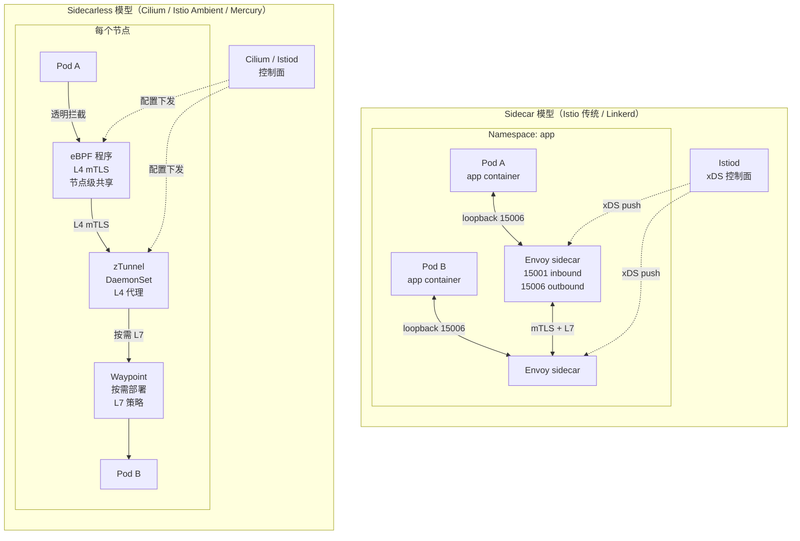

# Service Mesh 架构：Sidecar vs Sidecarless

## 双模型对比图

## Sidecar 模型详解

**Sidecar** 通过在每 Pod 注入一个代理容器（Istio 的 Envoy、Linkerd 的 linkerd2-proxy）劫持全部进出流量。应用无感知，重启 loopback 即可走 mTLS + 重试 + 熔断 + L7 路由 + 可观测。

**优点**：①每 Pod 隔离，故障半径小；②配置粒度细，可针对 Workload 独立策略；③生态成熟（Envoy xDS、Wasm 扩展）。

**痛点**：①资源开销 = N Pod × sidecar 内存（百万级 Pod 集群代价巨大）；②启动顺序依赖，Pod 启动初期流量可能绕过 sidecar；③升级 sidecar 需重启所有 Pod；④延迟叠加两次额外 hop（应用 ↔ sidecar）。

## Sidecarless 模型详解

**Sidecarless** 把代理逻辑下沉到节点级共享层，三种实现：

- **Cilium Service Mesh**：用 eBPF 在内核态完成 L4 mTLS、负载均衡、NetworkPolicy；L7 通过节点级 Envoy DaemonSet 按需启用。零 sidecar、零额外 hop。
- **Istio Ambient Mesh**（1.18+）：分层架构——**HBONE**（HTTP-Based Overlay Network）隧道 + **zTunnel**（节点级 DaemonSet，仅 L4 mTLS）+ **Waypoint**（按需 L7，按 Namespace/Service 部署的 Envoy）。L4 安全成为零成本基线，L7 仅在需要时启用。
- **Linkerd2-mini / Mercury**：实验性节点级代理。

**优点**：①资源固定（节点级，与 Pod 数无关）；②零启动延迟；③升级代理不重启 Pod；④L4 安全默认开启；⑤可观测性在数据面层。

**权衡**：①多 Pod 共享代理，故障半径扩大；②L7 策略需要额外的 waypoint，跨节点流量要二次跳转；③配置模型更复杂（区分 L4/L7 策略归属）。

## 选型矩阵

| 维度 | Sidecar | Sidecarless |
|---|---|---|
| 资源成本 | 高（N×sidecar） | 低（节点级） |
| L7 策略粒度 | Pod 级 | Namespace/Service 或按需 Pod |
| 启动延迟 | 有 | 无 |
| 故障隔离 | 强 | 弱（共享） |
| 升级影响 | 需重启 Pod | 滚动 DaemonSet |
| 可观测性 | Pod 内 tap | 节点级聚合 |
| 成熟度 | GA 多年 | 1.22+ Ambient GA / Cilium GA |

## 演进趋势

Service Mesh 正从"每 Pod 代理"走向"节点级数据面 + 按需 L7 代理"：Cilium eBPF 在内核态处理 L4，Istio Ambient 通过 zTunnel/Waypoint 解耦 L4 与 L7，Linkerd 探索 Rust 节点代理。最终形态可能统一为 **eBPF L4 + 共享 Envoy L7 + Gateway API 抽象**，让安全（mTLS）成为零成本默认，L7 策略成为增值能力。
