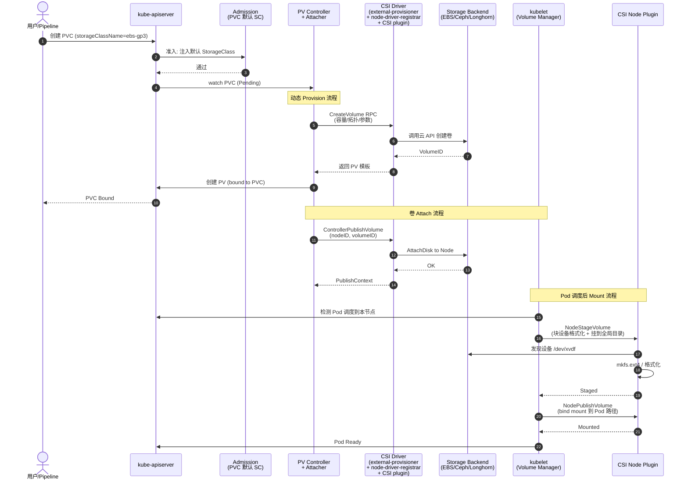

# K8s 存储栈架构：PV / PVC / CSI / 后端

## 挂载时序图

## 资源模型

K8s 存储采用"声明 / 配给 / 消费"三层解耦：

- **PersistentVolumeClaim (PVC)**：用户对存储的**需求声明**（容量、access mode、storageClass），与 Pod 生命周期解耦。
- **PersistentVolume (PV)**：集群管理员或 CSI **实际供给**的存储实例，与 PVC 1:1 Bound。
- **StorageClass (SC)**：动态供给**模板**，封装 CSI driver 名 + provisioner 参数（IOPS、加密、副本数等）。
- **CSI Driver**：标准接口（Container Storage Interface，gRPC），屏蔽后端差异。分为 **external-provisioner**（控制面 watch PVC）、**external-attacher**、**external-snapshotter**、**external-resizer**、**node-driver-registrar + plugin**（数据面）。

## CSI 三个 gRPC 服务

CSI 规范（spec v1.x）定义三组服务：

1. **Identity Service**：`GetPluginInfo`、`GetPluginCapabilities`、`Probe`——驱动自描述。
2. **Controller Service**：`CreateVolume`、`DeleteVolume`、`ControllerPublishVolume`(Attach)、`ControllerUnpublishVolume`(Detach)、`CreateSnapshot`、`ControllerExpandVolume`。运行在控制面 Pod，串行处理每节点 attach。
3. **Node Service**：`NodeStageVolume`（设备级格式化 + 挂到 `/var/lib/kubelet/plugins/.../staging`）、`NodePublishVolume`（bind mount 到 Pod 路径）、`NodeUnpublishVolume`、`NodeUnstageVolume`、`NodeExpandVolume`。以 DaemonSet 运行，kubelet 通过 `/var/lib/kubelet/plugins/<driver>/csi.sock` 调用。

## 关键设计点

- **Attach vs Mount 分离**：Attach 把卷连到节点（块设备出现），Mount 把卷挂到 Pod 路径。这使同节点多 Pod 共享块设备只需 attach 一次。
- **Access Modes**：RWO（单节点读写）、ROX（多节点只读）、RWX（多节点读写，需 NFS/共享存储）、RWOP（单 Pod 读写，1.27+）。
- **VolumeBindingMode**：`Immediate` 立即 provision，`WaitForFirstConsumer` 推迟 provision 直到 Pod 被调度（拓扑感知，避免跨 AZ 卷）。
- **VolumeSnapshot / VolumeSnapshotClass**：基于 CSI snapshot API，支持卷快照与恢复。
- **fsGroup / SELinux**：kubelet 通过 CSI `NodeStageVolume` 传入 fsGroup，由驱动 chown；SELinuxRelabelPoD 处理标签。

## 后端分类

- **块存储**：EBS、Azure Disk、Ceph RBD、Longhorn —— RWO 为主。
- **文件存储**：EFS、Azure File、NFS、CephFS —— RWX 共享。
- **对象存储**：S3、MinIO、OSS —— 通常不通过 CSI，应用直连 SDK。
- **本地存储**：local-path-provisioner、OpenEBS Hostpath —— 低延迟、无网络栈，但 Pod 迁移丢失。

## 失败与恢复

Attach 处于 `failed`、Mount 处于 `failed` 都会让 Pod 停在 ContainerCreating。节点 NotReady 后 PV Controller 在 `tolerate-seconds`（默认 300s）后 force detach，让卷能在新节点 attach，但需后端支持多节点 attach 或允许 stale attach。
