# Kubernetes 零信任分层安全模型

## 分层架构图

```mermaid
graph TB
    subgraph L1["L1 - 供应链安全"]
        direction LR
        SIGN[镜像签名<br/>cosign / Notation]
        SBOM[SBOM 生成<br/>Syft / CycloneDX]
        SCAN[镜像扫描<br/>Trivy / Grype]
        PROV[SLSA 来源<br/>构建 provenance]
    end

    subgraph L2["L2 - 准入控制"]
        POLICY[策略准入<br/>Kyverno / OPA Gatekeeper]
        VULN[运行时漏洞阻断<br/>Admission 扫描]
        IMGVERIFY[镜像签名验证<br/>cosign verifier]
    end

    subgraph L3["L3 - 身份与访问"]
        direction LR
        OIDC[OIDC / SSO<br/>Dex / Keycloak]
        RBAC[RBAC 最小权限<br/>namespace 隔离]
        SA[Bound Service Account<br/>Workload Identity / IRSA]
        SECRET[Secret 管理<br/>Vault / ESO / SOPS]
    end

    subgraph L4["L4 - 网络分段"]
        direction LR
        NPOLICY[NetworkPolicy<br/>L3/L4 ACL]
        MESHMTLS[Service Mesh<br/>mTLS 默认]
        INGSEC[Ingress / Gateway<br/>WAF / RateLimit]
        EGRESS[Egress 控制<br/>出口白名单]
    end

    subgraph L5["L5 - 工作负载运行时"]
        direction LR
        PS[Pod Security<br/>Admission restricted]
        SECCTX[SecurityContext<br/>runAsNonRoot / readOnly FS]
        CAP[Capabilities drop<br/>seccomp / AppArmor]
        ISOLATE[沙箱运行时<br/>Kata / gVisor]
    end

    subgraph L6["L6 - 数据与密钥"]
        direction LR
        ENCRYPT[etcd 静态加密<br/>KMS / aescbc]
        KMS[Cloud KMS / HSM]
        DYNAMIC[动态密钥<br/>CSI Secret Store]
    end

    subgraph L7["L7 - 可观测与响应"]
        direction LR
        AUDIT[Audit Log<br/>全量决策记录]
        SIEM[SIEM 集成<br/>Splunk / Elastic]
        RUNTIME[运行时检测<br/>Falco / Tracee]
        RESP[事件响应<br/>SOAR / 自动隔离]
    end

    ATTACK[攻击者路径<br/>恶意镜像/凭证窃取/横向移动/数据外泄]
    ATTACK --> L1
    L1 --> L2 --> L3 --> L4 --> L5 --> L6 --> L7
    L7 -.->|威胁情报/反馈| L1
```

## 零信任原则（NIST SP 800-207）

零信任的三大假设：①网络永远不可信；②设备 / 用户 / 工作负载均需验证；③权限最小化、动态、基于上下文。K8s 落地体现为"纵深防御 + 默认拒绝"：

- **永不信任，持续验证**：每个 Pod-to-Pod、User-to-API 调用都验证身份。
- **最小权限**：RBAC 收窄到 namespace 与 resourceNames；ServiceAccount 自动挂载关闭。
- **假定失陷**：每层都假设其他层已被攻破，独立提供保护。

## 各层职责详解

### L1 — 供应链（Supply Chain）

恶意镜像、被污染的 base 镜像、植入的后门是常见入侵起点。措施：①**镜像签名**（cosign / Notation v2）确保镜像未被篡改；②**SBOM**（CycloneDX / SPDX）记录依赖用于漏洞追踪；③**SLSA** 框架记录构建 provenance（构建机、源 commit、构建步骤）；④**镜像扫描**（Trivy / Grype）阻塞已知 CVE。供应链安全 = 防止"恶意内容进入集群"。

### L2 — 准入控制（Admission）

准入层是阻止恶意内容运行的最后一道闸门。**ValidatingAdmissionPolicy**（1.30+ GA, CEL 表达式）+ **Kyverno / OPA Gatekeeper** 强制镜像来自可信仓库、签名已验证、资源 quota 合规、PodSecurity 标准（restricted）。配合 **cosign verifier webhook** 阻止未签名镜像。

### L3 — 身份与访问（Identity）

人员使用 **OIDC + SSO**（Dex/Keycloak 桥接企业 IdP）替代 x509 证书直发；**RBAC** 严格按 namespace + 角色 + resourceNames 缩窄；**Workload Identity / IRSA / GKE WI** 让 Pod 通过短时 OIDC token 访问云服务，替代长期 Secret；**Vault + External Secrets Operator** 让密钥动态生成、定期轮转，避免 `kubectl get secret` 泄露。

### L4 — 网络分段（Network）

**NetworkPolicy** 默认拒绝、显式放行；**Service Mesh mTLS**（Istio / Cilium）让所有 Pod-to-Pod 加密 + 双向认证；**Egress 控制**（Cilium / Calico egress GW）限制出口 IP；**Ingress WAF + RateLimit**（ModSecurity / Coraza）阻 OWASP 攻击。这是 NIST 零信任的核心："网络无信任"。

### L5 — 工作负载运行时（Workload）

**Pod Security Admission**（restricted 级别）禁 root、禁 privilege escalation；**SecurityContext**：runAsNonRoot、readOnlyRootFilesystem、drop ALL capabilities；**seccomp / AppArmor / SELinux** 限制系统调用；**Kata Containers / gVisor** 提供硬件级隔离沙箱，运行不可信代码。

### L6 — 数据与密钥（Data）

**etcd 静态加密**（KMS driver / aescbc / secretbox）防止 etcd 泄露后明文读 Secret；**KMS / HSM** 托管根密钥；**CSI Secret Store** 把密钥挂载为 tmpfs 不落盘；**Vault transit** 让加密在 Vault 内完成，应用不见明文密钥。

### L7 — 可观测与响应（Detect & Respond）

**API Audit Log** 记录所有认证、授权、准入决策（按 verb/resource 分级）；**Falco / Tracee** 内核态检测异常 syscall（如 shell in container、密钥读取、crypto miner）；**SIEM 集成**（Splunk/Elastic）做关联分析；**SOAR** 自动响应（隔离 Pod、撤销 token、阻断 IP）。

## 闭环：Assume Breach

零信任不是单点，而是**每层独立提供保护、假定邻居失陷**的纵深。L7 的检测反馈到 L1（撤回恶意镜像签名、加入 deny list）、L3（撤销泄露 token）形成自适应闭环。完整零信任 K8s 实施通常 2-3 年成熟，建议从 L3（OIDC + RBAC）和 L4（NetworkPolicy + mTLS）切入，逐步扩展到供应链与运行时。
