> **生产环境安全提示**
>
> 本文档包含可直接执行的运维命令。执行前请确认：当前目标集群与 Namespace 是否正确；是否具备足够的 RBAC 权限；是否已在非生产环境验证。命令风险等级标注：🔴 高风险（可能造成数据丢失或服务中断）、🟡 中风险（会修改集群状态，但通常可回滚）、🟢 低风险/只读（信息收集，无副作用）。


title: 电商系统 [[Kubernetes|Kubernetes]] 生产架构设计
description: '# 电商系统 Kubernetes 生产架构设计'
category: application-architecture
tags:
- k8s
- architecture
- industry
- [[Prometheus|prometheus]]
- grafana
- [[Jaeger|jaeger]]
- [[Istio|istio]]
- envoy
- minio
- redis
last_updated: 2026-05-18
difficulty: advanced
reading_level: advanced
audience:
- 电商架构师
- 后端开发 TL
- SRE
- 云原生工程师
estimated_read_time: 5min
intent_queries:
- 电商系统 K8s生产架构 微服务拆分
- 电商订单链路 Kubernetes StatefulSet
- 秒杀系统 Redis Lua 库存扣减 K8s
- 电商搜索 Elasticsearch K8s部署
- 电商支付 PCI-DSS Kubernetes 安全
trigger_keywords:
- 电商架构
- 微服务
- 订单系统
- 库存扣减
- 秒杀
- Redis Cluster
- Elasticsearch
- StatefulSet
- HPA
- Karpenter
related_domains:
- domain-01-cluster-fundamentals
- domain-11-production-operations
- domain-03-networking-traffic
related_topics:
- 41-beauty-ecommerce
- 31-instant-retail
- 49-livestream-ecommerce
authors:
- name: KUDIG Team
  role: contributor
k8s_versions:
- '1.28'
- '1.29'
- '1.30'
- '1.31'
- '1.32'
---

# 电商系统 Kubernetes 生产架构设计

> **适用场景**: B2C / B2B / O2O / 直播电商 / 跨境电商  
> **适用版本**: Kubernetes v1.29 - v1.33  
> **最后更新**: 2026-04-24  
> **目标读者**: 电商架构师、SRE、后端开发 TL

---

<!-- chunk: 📋 目录 -->## 📋 目录

- [一、整体架构全景](#一整体架构全景)
- [二、微服务拆分架构](#二微服务拆分架构)
- [三、流量入口与网关架构](#三流量入口与网关架构)
- [四、订单核心链路架构](#四订单核心链路架构)
- [五、商品与搜索架构](#五商品与搜索架构)
- [六、支付与财务架构](#六支付与财务架构)
- [七、库存与供应链架构](#七库存与供应链架构)
- [八、营销与秒杀架构](#八营销与秒杀架构)
- [九、数据层架构](#九数据层架构)
- [十、K8s 部署架构](#十k8s-部署架构)
- [十一、高可用与灾备](#十一高可用与灾备)

---

<!-- chunk: 一、整体架构全景 -->## 一、整体架构全景

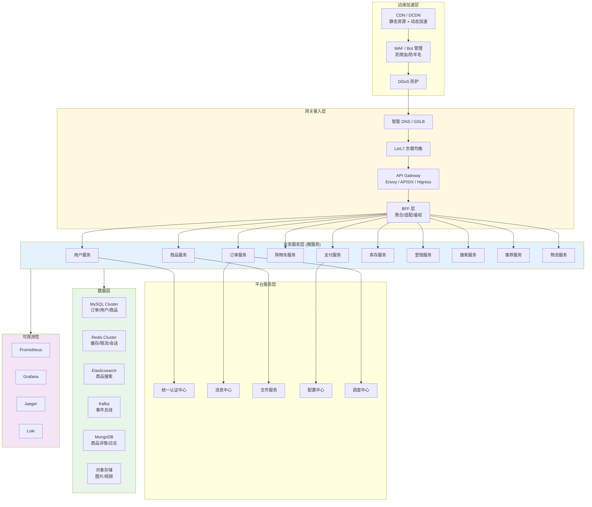

---

<!-- chunk: 二、微服务拆分架构 -->## 二、微服务拆分架构

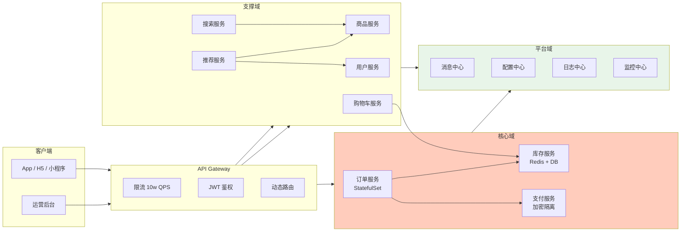

## 领域驱动设计 (DDD) 映射

| 领域 | 服务 | K8s 工作负载 | 数据库 | 关键特性 |
|:---|:---|:---|:---|:---|
| **核心域** | 订单、支付、库存 | StatefulSet / Deployment | MySQL + Redis | 强一致性、事务 |
| **支撑域** | 用户、商品、购物车 | Deployment | MySQL + ES | 最终一致性 |
| **通用域** | 消息、文件、配置 | Deployment | MongoDB + OSS | 高可用 |
| **平台域** | 监控、日志、链路 | DaemonSet / Deployment | Prometheus + Loki | 可观测性 |

---

<!-- chunk: 三、流量入口与网关架构 -->## 三、流量入口与网关架构

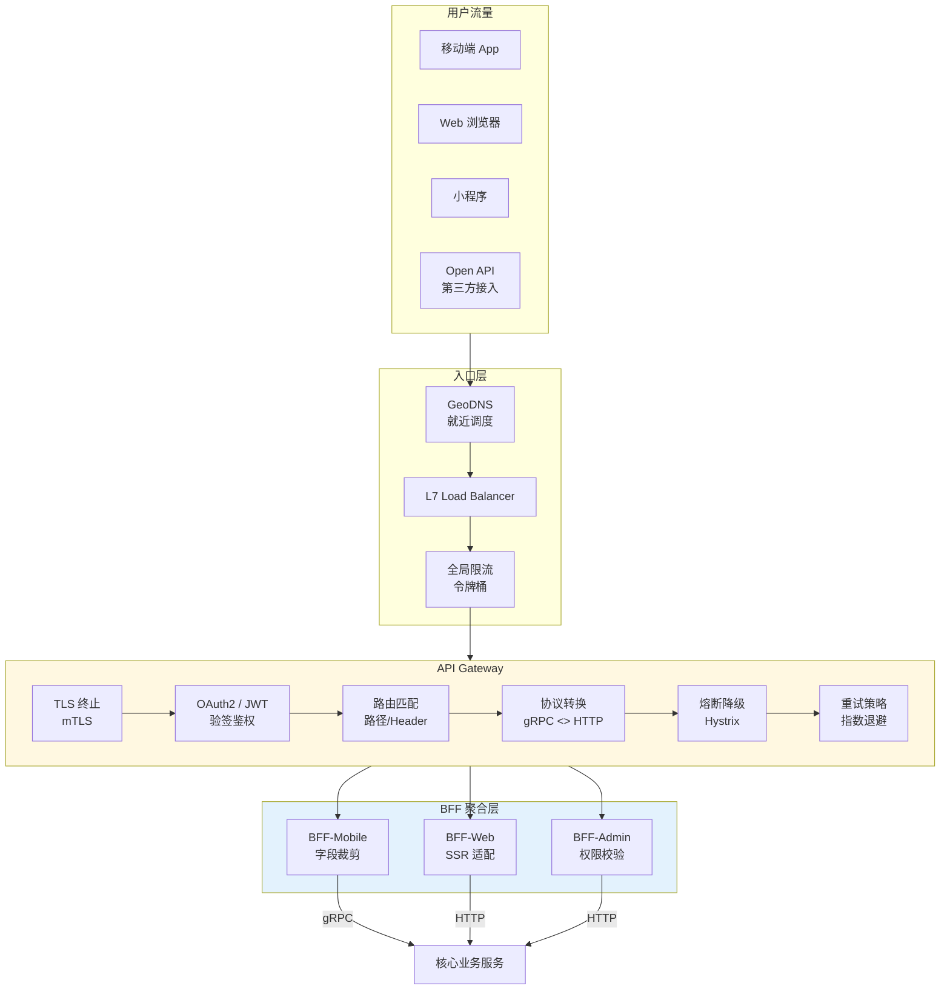

## Gateway 生产配置

```yaml
apiVersion: networking.istio.io/v1beta1
kind: Gateway
metadata:
  name: ecommerce-gateway
  namespace: ecommerce
spec:
  selector:
    istio: ingressgateway
  servers:
    - port:
        number: 443
        name: https
        protocol: HTTPS
      tls:
        mode: SIMPLE
        credentialName: ecommerce-tls-secret
      hosts:
        - "*.ecommerce.com"
        - "api.ecommerce.com"
---
apiVersion: networking.istio.io/v1beta1
kind: VirtualService
metadata:
  name: ecommerce-routes
  namespace: ecommerce
spec:
  hosts:
    - api.ecommerce.com
  gateways:
    - ecommerce-gateway
  http:
    - matchers:
      - - uri=""
      - prefix="/api/v1/order"
      - route=""
      - - destination=""
      - host="order-service"
      - port=""
      - number="8080"
      - timeout="3s"
      - retries=""
      - attempts="3"
      - perTryTimeout="1s"
      - retryOn="gateway-error,connect-failure,refused-stream"
      - fault=""
      - delay=""
      - percentage=""
      - value="0.1"
      - fixedDelay="5s"
    - matchers:
      - - uri=""
      - prefix="/api/v1/payment"
      - route=""
      - - destination=""
      - host="payment-service"
      - port=""
      - number="8080"
      - timeout="10s"
```

---

<!-- chunk: 四、订单核心链路架构 -->## 四、订单核心链路架构

## 下单链路时序

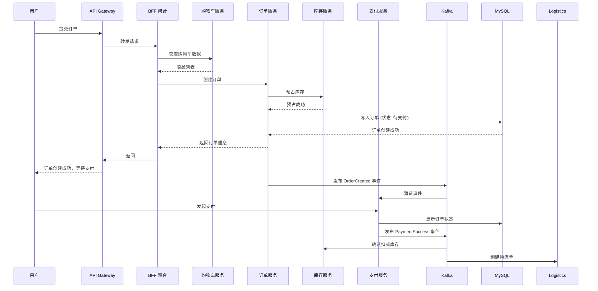

## 订单服务 K8s 部署

```yaml
apiVersion: apps/v1
kind: StatefulSet
metadata:
  name: order-service
  namespace: ecommerce
spec:
  serviceName: order-service
  replicas: 3
  selector:
    matchLabels:
      app: order-service
  template:
    metadata:
      labels:
        app: order-service
        version: v1.2.0
    spec:
      affinity:
        podAntiAffinity:
          requiredDuringSchedulingIgnoredDuringExecution:
            - labelSelector:
                matchExpressions:
                  - key: app
                    operator: In
                    values:
                      - order-service
              topologyKey: kubernetes.io/hostname
      containers:
        - name: order
          image: ecommerce/order-service:v1.2.0
          ports:
            - containerPort: 8080
              name: http
            - containerPort: 9090
              name: grpc
          env:
            - name: DB_HOST
              valueFrom:
                secretKeyRef:
                  name: order-db-secret
                  key: host
            - name: KAFKA_BROKERS
              value: "kafka-0.kafka:9092,kafka-1.kafka:9092"
          resources:
            requests:
              cpu: "500m"
              memory: "1Gi"
            limits:
              cpu: "2"
              memory: "4Gi"
          livenessProbe:
            httpGet:
              path: /health/live
              port: 8080
            initialDelaySeconds: 30
            periodSeconds: 10
          readinessProbe:
            httpGet:
              path: /health/ready
              port: 8080
            initialDelaySeconds: 5
            periodSeconds: 5
          volumeMounts:
            - name: order-logs
              mountPath: /app/logs
      volumes:
        - name: order-logs
          emptyDir: {}
---
apiVersion: v1
kind: Service
metadata:
  name: order-service
  namespace: ecommerce
  labels:
    app: order-service
spec:
  selector:
    app: order-service
  ports:
    - name: http
      port: 8080
      targetPort: 8080
    - name: grpc
      port: 9090
      targetPort: 9090
---
# HPA 配置
apiVersion: autoscaling/v2
kind: HorizontalPodAutoscaler
metadata:
  name: order-service-hpa
  namespace: ecommerce
spec:
  scaleTargetRef:
    apiVersion: apps/v1
    kind: StatefulSet
    name: order-service
  minReplicas: 3
  maxReplicas: 20
  metrics:
    - type: Resource
      resource:
        name: cpu
        target:
          type: Utilization
          averageUtilization: 70
    - type: Resource
      resource:
        name: memory
        target:
          type: Utilization
          averageUtilization: 80
  behavior:
    scaleUp:
      stabilizationWindowSeconds: 60
      policies:
        - type: Percent
          value: 100
          periodSeconds: 15
    scaleDown:
      stabilizationWindowSeconds: 300
      policies:
        - type: Percent
          value: 10
          periodSeconds: 60
```

---

<!-- chunk: 五、商品与搜索架构 -->## 五、商品与搜索架构

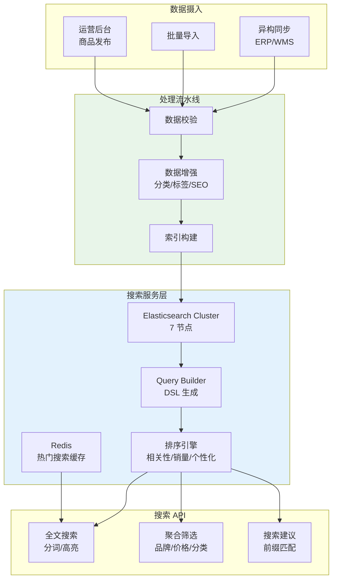

## Elasticsearch K8s 部署

```yaml
apiVersion: elasticsearch.k8s.elastic.co/v1
kind: Elasticsearch
metadata:
  name: product-search
  namespace: ecommerce
spec:
  version: 8.12.0
  nodeSets:
    - name: master
      count: 3
      config:
        node.roles: ["master"]
      podTemplate:
        spec:
          containers:
            - name: elasticsearch
              resources:
                requests:
                  memory: 4Gi
                  cpu: "1"
                limits:
                  memory: 4Gi
    - name: data-hot
      count: 3
      config:
        node.roles: ["data_hot", "data_content", "ingest"]
      podTemplate:
        spec:
          containers:
            - name: elasticsearch
              resources:
                requests:
                  memory: 16Gi
                  cpu: "4"
                limits:
                  memory: 16Gi
          affinity:
            podAntiAffinity:
              requiredDuringSchedulingIgnoredDuringExecution:
                - labelSelector:
                    matchLabels:
                      elasticsearch.k8s.elastic.co/cluster-name: product-search
                  topologyKey: kubernetes.io/hostname
      volumeClaimTemplates:
        - metadata:
            name: elasticsearch-data
          spec:
            storageClassName: fast-ssd
            accessModes: ["ReadWriteOnce"]
            resources:
              requests:
                storage: 500Gi
```

---

<!-- chunk: 六、支付与财务架构 -->## 六、支付与财务架构

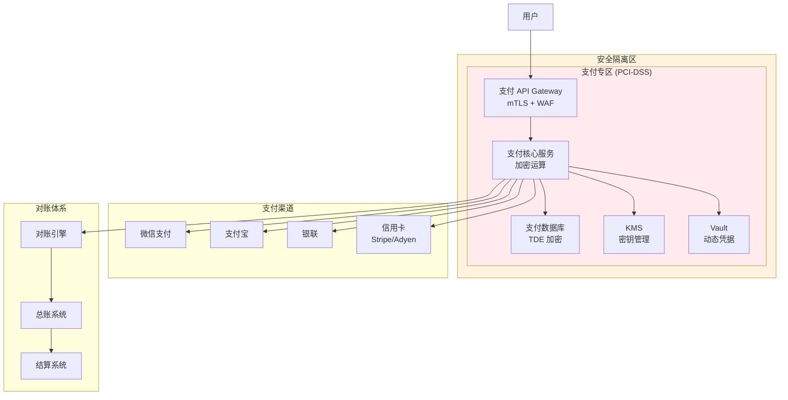

## 支付服务安全部署

```yaml
apiVersion: apps/v1
kind: Deployment
metadata:
  name: payment-service
  namespace: ecommerce-payment
spec:
  replicas: 3
  selector:
    matchLabels:
      app: payment-service
  template:
    metadata:
      labels:
        app: payment-service
        compliance-level: pci-dss
    spec:
      serviceAccountName: payment-sa
      securityContext:
        runAsNonRoot: true
        seccompProfile:
          type: RuntimeDefault
      nodeSelector:
        node-type: secure
      tolerations:
        - key: node-type
          operator: Equal
          value: secure
          effect: NoSchedule
      containers:
        - name: payment
          image: ecommerce/payment-service:v2.0.0
          securityContext:
            allowPrivilegeEscalation: false
            readOnlyRootFilesystem: true
            runAsUser: 1000
            capabilities:
              drop:
                - ALL
          ports:
            - containerPort: 8443
              name: https
          env:
            - name: HSM_ENABLED
              value: "true"
            - name: VAULT_ADDR
              value: "https://vault-internal:8200"
          resources:
            requests:
              cpu: "500m"
              memory: "1Gi"
            limits:
              cpu: "2"
              memory: "4Gi"
          volumeMounts:
            - name: tmp
              mountPath: /tmp
            - name: vault-token
              mountPath: /vault/secrets
              readOnly: true
      volumes:
        - name: tmp
          emptyDir: {}
        - name: vault-token
          csi:
            driver: secrets-store.csi.k8s.io
            readOnly: true
            volumeAttributes:
              secretProviderClass: vault-payment
```

---

<!-- chunk: 七、库存与供应链架构 -->## 七、库存与供应链架构

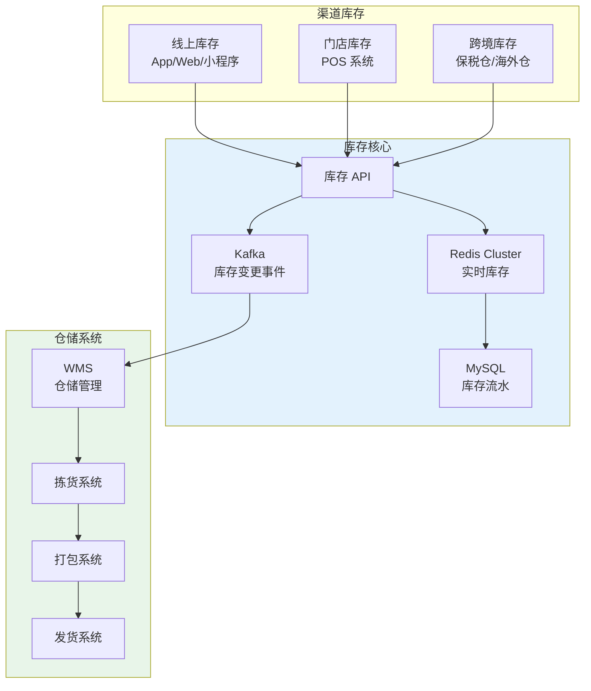

## 库存扣减策略

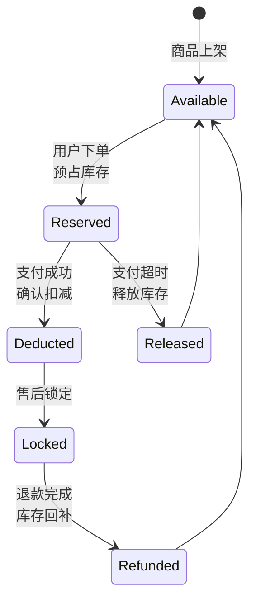

---

<!-- chunk: 八、营销与秒杀架构 -->## 八、营销与秒杀架构

## 秒杀系统架构

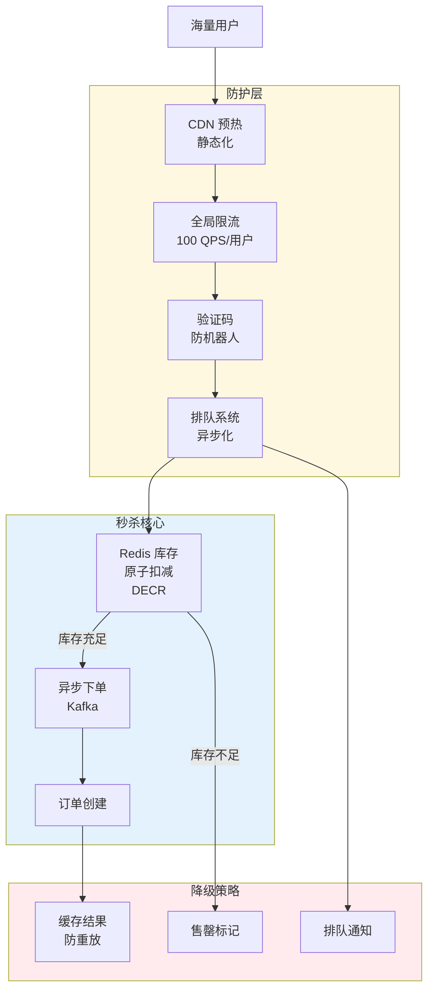

## 秒杀核心代码

```yaml
# Redis Lua 脚本：原子扣减库存
# 秒杀库存扣减 Lua 脚本（在 K8s ConfigMap 中管理）
apiVersion: v1
kind: ConfigMap
metadata:
  name: seckill-scripts
  namespace: ecommerce
data:
  deduct_stock.lua: |
    local stock_key = KEYS[1]
    local order_key = KEYS[2]
    local user_id = ARGV[1]
    local stock = redis.call('GET', stock_key)
    
    if tonumber(stock) <= 0 then
      return -1  -- 库存不足
    end
    
    -- 检查是否已购买（防重）
    local ordered = redis.call('SISMEMBER', order_key, user_id)
    if ordered == 1 then
      return -2  -- 已购买
    end
    
    -- 原子扣减 + 记录购买
    redis.call('DECR', stock_key)
    redis.call('SADD', order_key, user_id)
    return 1  -- 成功
---
# 秒杀服务 Deployment
apiVersion: apps/v1
kind: Deployment
metadata:
  name: seckill-service
  namespace: ecommerce
spec:
  replicas: 10
  selector:
    matchLabels:
      app: seckill-service
  template:
    metadata:
      labels:
        app: seckill-service
    spec:
      affinity:
        podAntiAffinity:
          preferredDuringSchedulingIgnoredDuringExecution:
            - weight: 100
              podAffinityTerm:
                labelSelector:
                  matchLabels:
                    app: seckill-service
                topologyKey: kubernetes.io/hostname
      containers:
        - name: seckill
          image: ecommerce/seckill-service:v1.0
          env:
            - name: REDIS_CLUSTER
              value: "redis-cluster:6379"
            - name: LUA_SCRIPT_PATH
              value: "/scripts/deduct_stock.lua"
          resources:
            requests:
              cpu: "1"
              memory: "2Gi"
            limits:
              cpu: "2"
              memory: "4Gi"
```

---

<!-- chunk: 九、数据层架构 -->## 九、数据层架构

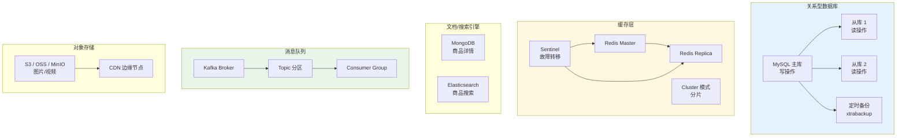

---

<!-- chunk: 十、K8s 部署架构 -->## 十、K8s 部署架构

## Namespace 组织

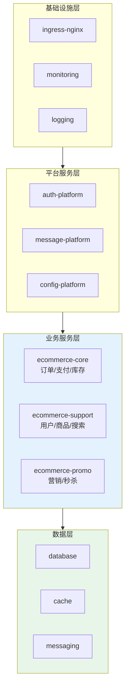

## 节点池规划

```yaml
apiVersion: karpenter.sh/v1
kind: NodePool
metadata:
  name: ecommerce-core
spec:
  template:
    spec:
      requirements:
        - key: node.kubernetes.io/instance-type
          operator: In
          values: ["c7.2xlarge", "c7.4xlarge"]
        - key: karpenter.sh/capacity-type
          operator: In
          values: ["on-demand"]
        - key: topology.kubernetes.io/zone
          operator: In
          values: ["cn-beijing-a", "cn-beijing-b", "cn-beijing-c"]
      taints:
        - key: workload-type
          value: core
          effect: NoSchedule
  limits:
    cpu: 500
    memory: 2000Gi
---
apiVersion: karpenter.sh/v1
kind: NodePool
metadata:
  name: ecommerce-spot
spec:
  template:
    spec:
      requirements:
        - key: node.kubernetes.io/instance-type
          operator: In
          values: ["c7.xlarge", "c7.2xlarge"]
        - key: karpenter.sh/capacity-type
          operator: In
          values: ["spot"]
      taints:
        - key: workload-type
          value: spot
          effect: NoSchedule
  limits:
    cpu: 1000
```

---

<!-- chunk: 十一、高可用与灾备 -->## 十一、高可用与灾备

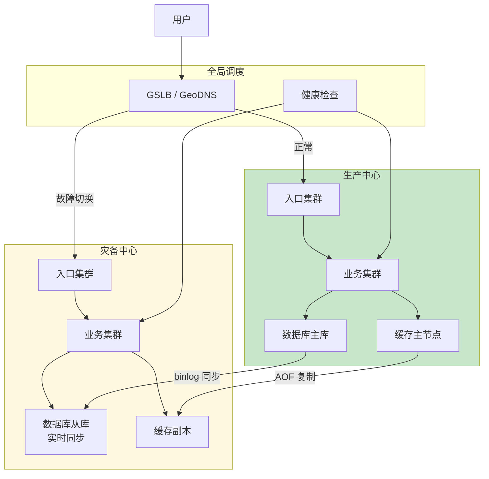

## 电商系统 SLA 矩阵

| 服务 | 可用性目标 | RTO | RPO | 策略 |
|:---|:---:|:---:|:---:|:---|
| 商品浏览 | 99.99% | 0 | 0 | 多活 + CDN |
| 购物车 | 99.95% | 5min | 0 | 同城双活 |
| 订单创建 | 99.99% | 1min | 0 | 强一致主从 |
| 支付 | 99.999% | 0 | 0 | 金融级多活 |
| 库存 | 99.99% | 30s | 0 | Redis Cluster |
| 搜索 | 99.9% | 10min | 5min | ES 快照 |
| 推荐 | 99.5% | 30min | 1h | 离线计算 |

---

<!-- chunk: 参考链接 -->## 参考链接

- [阿里巴巴电商系统架构演进](https://developer.aliyun.com/ebook/read/7556)
- [美团外卖系统架构](https://tech.meituan.com/)
- [Kubernetes 有状态应用管理](https://kubernetes.io/docs/concepts/workloads/controllers/statefulset/)

---

<!-- chunk: 多云部署方案对照 -->## 多云部署方案对照

## 阿里云服务 → 多云映射表

| 能力域 | 阿里云服务 | AWS 对应 | GCP 对应 | Azure 对应 |
|:---|:---|:---|:---|:---|
| 容器编排 | **ACK** (容器服务) | **EKS** | **GKE** | **AKS** |
| 对象存储 | **OSS** | **S3** | **GCS** | **Blob Storage** |
| CDN | **CDN / DCDN** | **CloudFront** | **Cloud CDN** | **Azure CDN** |
| Web 防火墙 | **WAF** | **AWS WAF** | **Cloud Armor** | **Azure WAF (Front Door)** |
| DDoS 防护 | **DDoS 防护** | **Shield** | **Cloud Armor** | **Azure DDoS Protection** |
| 密钥管理 | **KMS** | **KMS** | **Cloud KMS** | **Key Vault** |
| 负载均衡 | **ALB / SLB** | **ALB / NLB** | **Cloud Load Balancing** | **Azure Load Balancer / App GW** |
| 消息队列 | **RocketMQ** | **SQS / SNS** | **Pub/Sub** | **Service Bus** |
| 数据库 | **RDS MySQL / PolarDB** | **RDS MySQL / Aurora** | **Cloud SQL / AlloyDB** | **Azure MySQL / Cosmos DB** |
| 缓存 | **Redis 云版** | **ElastiCache** | **Memorystore** | **Azure Cache for Redis** |
| 搜索 | **Elasticsearch 云版** | **OpenSearch** | **Elastic Cloud on GCP** | **Azure Cognitive Search** |
| 容器镜像 | **ACR** | **ECR** | **Artifact Registry** | **ACR (Azure)** |
| 节点自动伸缩 | **ASK / Karpenter** | **Karpenter** | **GKE Autopilot** | **AKS Karpenter / Virtual Nodes** |
| DNS | **云解析 DNS** | **Route 53** | **Cloud DNS** | **Azure DNS** |
| 日志 | **SLS (日志服务)** | **CloudWatch Logs** | **Cloud Logging** | **Log Analytics** |
| 链路追踪 | **ARMS / 链路追踪** | **X-Ray** | **Cloud Trace** | **Application Insights** |

## 多云部署注意事项

1. **数据主权与合规**: 电商涉及支付数据需关注 PCI-DSS，不同云厂商的 PCI-DSS 认证范围不同，需确认目标 Region 的合规状态。
2. **网络互通**: 多云部署时需通过 VPN / 专线打通 VPC，注意跨云通信延迟对订单链路的影响（建议同城双活优先）。
3. **对象存储兼容**: 应用层使用 S3 兼容 API（如 MinIO / AWS SDK），可降低迁移成本；避免直接依赖 OSS SDK 的私有 API。
4. **K8s 版本对齐**: 各云 K8s 发行版（ACK / EKS / GKE / AKS）版本发布节奏不同，需统一升级窗口，避免 API 兼容性问题。
5. **节点池策略**: AWS 用 Karpenter、GCP 用 Autopilot、Azure 用 Virtual Nodes，HPA/VPA 行为有差异，需分别压测。
6. **支付通道隔离**: 支付 PCI-DSS 区域建议与业务区域在同一云内，避免跨云传输敏感数据。

## 云中立方案（开源替代）

| 能力域 | 开源方案 | 说明 |
|:---|:---|:---|
| 容器编排 | **Kubernetes** (原生) | 使用 kubeadm / Cluster API 自建，或 RKE2 / k3s |
| 对象存储 | **MinIO** | S3 兼容，可部署在任意 K8s 集群 |
| CDN / 边缘加速 | **Cloudflare** / **Fastly** | 独立 CDN 服务商，不绑定云 |
| WAF | **ModSecurity** + **OWASP CRS** | 开源 WAF，配合 Ingress Controller |
| 密钥管理 | **HashiCorp Vault** | 已在支付架构中使用，可替代云 KMS |
| 负载均衡 | **HAProxy** / **MetalLB** | K8s 原生 Service + MetalLB |
| 消息队列 | **Apache Kafka** / **RocketMQ** (开源版) | K8s Operator 部署 |
| 数据库 | **MySQL** (Operator) / **TiDB** | Vitess / TiDB Operator 分布式方案 |
| 缓存 | **Redis Cluster** | K8s StatefulSet 或 Redis Operator |
| 搜索 | **Elasticsearch** (ECK) / **OpenSearch** | Elastic Cloud on K8s Operator |
| 镜像仓库 | **Harbor** | 企业级开源镜像仓库 |
| 节点伸缩 | **Karpenter** (开源版) / **Cluster Autoscaler** | Karpenter 已支持多云 |
| 日志 | **Loki** + **Promtail** | 轻量级，已在架构图中使用 |
| 链路追踪 | **Jaeger** / **OpenTelemetry** | 已在架构图中使用 |
| DNS | **CoreDNS** + **ExternalDNS** | K8s 原生 DNS 管理 |

---

<!-- chunk: Obsidian 相关文档 -->## Obsidian 相关文档

- topic-application-architecture MOC
- [[domain-20-application-patterns/行业架构/README.md|Topic 应用层架构设计最佳实践]]
- [[domain-20-application-patterns/行业架构/02-mini-program-architecture.md|小程序平台架构设计]]
- [[domain-20-application-patterns/行业架构/03-cms-architecture.md|内容管理系统 CMS 架构设计]]
- [[domain-20-application-patterns/行业架构/04-im-rtc-architecture.md|实时通信 IM/RTC 架构设计]]
- [[domain-20-application-patterns/行业架构/05-online-education-architecture.md|在线教育平台 Kubernetes 生产架构设计]]
- [[domain-20-application-patterns/行业架构/06-fintech-architecture.md|金融科技FinTech Kubernetes生产架构设计]]
- [[domain-20-application-patterns/行业架构/07-iot-platform-architecture.md|物联网 IoT 平台架构设计]]
- [[domain-20-application-patterns/行业架构/08-ai-ml-inference-architecture.md|AI/ML 推理服务 Kubernetes 生产架构设计]]
- [[domain-20-application-patterns/行业架构/09-gaming-backend-architecture.md|游戏后端 Kubernetes 生产架构设计]]
- [[domain-20-application-patterns/行业架构/10-social-media-architecture.md|社交媒体平台Kubernetes生产架构设计]]
- [[domain-20-application-patterns/行业架构/11-smart-retail-architecture.md|智慧零售与新零售Kubernetes生产架构设计]]

## See Also

- 95-industrial-metaverse
- 96-carbon-capture
- 02-mini-program-architecture
- 03-cms-architecture


<!-- risk-assessed -->
