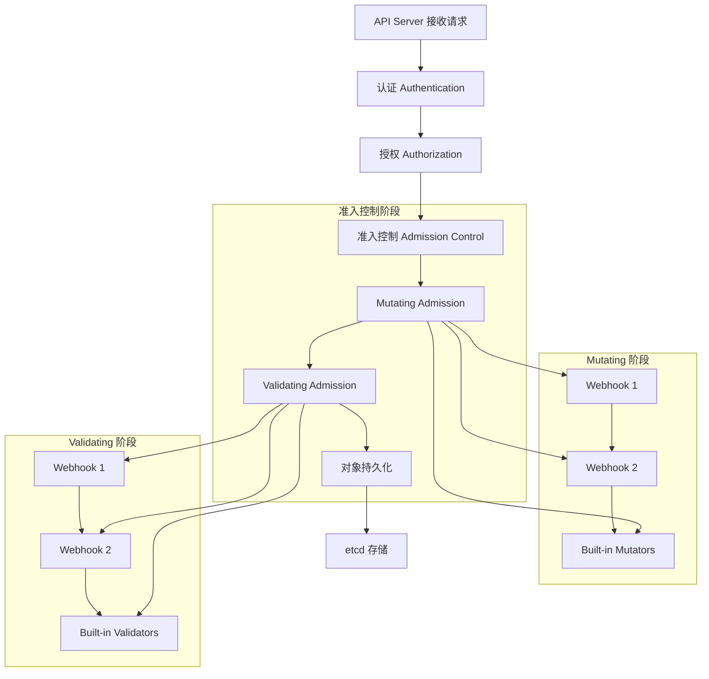
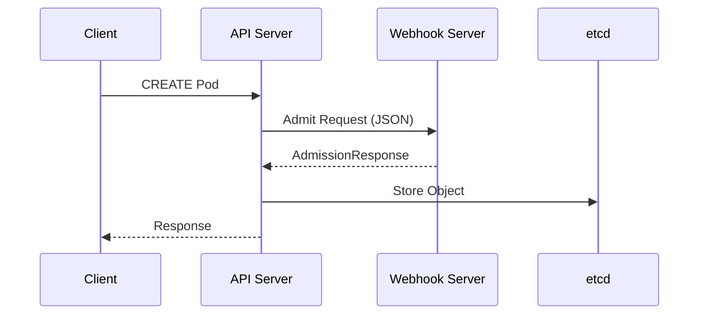

> **生产环境安全提示**
>
> 本文档包含可直接执行的运维命令。执行前请确认：当前目标集群与 Namespace 是否正确；是否具备足够的 RBAC 权限；是否已在非生产环境验证。命令风险等级标注：🔴 高风险（可能造成数据丢失或服务中断）、🟡 中风险（会修改集群状态，但通常可回滚）、🟢 低风险/只读（信息收集，无副作用）。


title: 13 - 准入控制与 Webhook 机制深度解析
description: '# 13 - 准入控制与 Webhook 机制深度解析'
category: design-principles
tags:
- k8s
- design
- principles
- [[etcd|etcd]]
- apiserver
- [[Prometheus|prometheus]]
- docker
- opa
- statefulset
- daemonset
last_updated: 2026-05
difficulty: advanced
reading_level: advanced
audience:
- 架构师
- SRE
estimated_read_time: 5min
intent_queries:
- 准入控制与 Webhook 机制深度解析 是什么
- 如何 准入控制与 Webhook 机制深度解析
- Kubernetes 2 design principles 最佳实践
trigger_keywords:
- 准入控制与
- Webhook
- 机制深度解析
- design
- principles
cross_refs:
- type: domain
  path: ../domain-01-cluster-fundamentals/
  label: '相关知识域: domain-01-cluster-fundamentals'
- type: domain
  path: ../domain-01-cluster-fundamentals/
  label: '相关知识域: domain-01-cluster-fundamentals'
authors:
- name: KUDIG Team
  role: contributor
k8s_versions:
- '1.28'
- '1.29'
- '1.30'
- '1.31'
- '1.32'
---

# 13 - 准入控制与 Webhook 机制深度解析

<!-- chunk: 资深视点：从 Webhook 到 CEL 的范式演进 -->
## 资深视点：从 Webhook 到 CEL 的范式演进

> **架构师洞察**：
> 长期以来，Webhook 是 K8s 扩展准入逻辑的唯一手段，但它引入了显著的运维复杂性（证书管理、网络连通性、延迟）。
> 1. **Webhook 的“性能税”**：在高负载集群中，Webhook 服务器的延迟会直接拉高 API Server 的 P99 响应时间，甚至因 Webhook 超时导致集群操作大面积失败。
> 2. **CEL (ValidatingAdmissionPolicy) 的革命性**：K8s 1.30 正式 GA 的 CEL 准入策略，将验证逻辑直接注入 API Server 进程内执行。这不仅消除了 RPC 开销，更重要的是它将“策略即代码”下放到了资源定义层面，极大降低了对第三方准入控制器（如 OPA/Gatekeeper）的依赖。
> 3. **生产避坑建议**：
>    - **失败策略 (failurePolicy)**：除非是核心安全拦截，否则建议优先使用 `Ignore`。如果是 `Fail`，必须确保护持 Webhook 自身的高可用。
>    - **监控死角**：务必监控 `apiserver_admission_webhook_admission_duration_seconds`，这是定位 API Server 变慢的第一现场。

<!-- chunk: 概述 -->
## 概述

本文档深入解析 Kubernetes 准入控制机制和 Webhook 实现原理，涵盖验证、变更、审计等核心功能，提供企业级准入控制策略设计和最佳实践。

---

---

> **交叉引用**：API Server 准入控制的详细实现请参考 [Domain-3: API Server 深度解析](../domain-01-cluster-fundamentals/12-apiserver-deep-dive.md) 和 [Domain-3: 认证授权深度解析](../domain-01-cluster-fundamentals/27-authz-authn-deep-dive.md)。

<!-- chunk: 一、准入控制架构全景 -->
## 一、准入控制架构全景

### 1.1 准入控制流程架构



### 1.2 准入控制器分类体系

```yaml
admission_controller_classification:
  mutating_controllers:
    purpose: "修改请求对象"
    execution_order: "串行执行"
    failure_behavior: "任何一个失败则拒绝"
    examples:
      - MutatingAdmissionWebhook
      - NamespaceAutoProvision
      - LimitRanger
      - ServiceAccount
      
  validating_controllers:
    purpose: "验证请求对象合法性"
    execution_order: "并行执行"
    failure_behavior: "任何一个失败则拒绝"
    examples:
      - ValidatingAdmissionWebhook
      - ResourceQuota

      - PodSecurity  # 替代已移除的 PodSecurityPolicy (v1.25+)
      - NamespaceLifecycle
      
  built_in_controllers:
    always_admit: "允许所有请求"
    always_deny: "拒绝所有请求"
    deny_service_external_names: "拒绝 ExternalName Services"
    event_rate_limit: "事件速率限制"
```

---

<!-- chunk: 二、Webhook 机制深度解析 -->
## 二、Webhook 机制深度解析

### 2.1 Webhook 架构设计

#### Webhook 调用流程


#### Webhook 请求响应结构
```go
// AdmissionRequest 结构
type AdmissionRequest struct {
    UID               types.UID       `json:"uid"`
    Kind              metav1.GroupVersionKind `json:"kind"`
    Resource          metav1.GroupVersionResource `json:"resource"`
    SubResource       string          `json:"subResource,omitempty"`
    RequestKind       *metav1.GroupVersionKind `json:"requestKind,omitempty"`
    RequestResource   *metav1.GroupVersionResource `json:"requestResource,omitempty"`
    RequestSubResource string          `json:"requestSubResource,omitempty"`
    Name              string          `json:"name,omitempty"`
    Namespace         string          `json:"namespace,omitempty"`
    Operation         Operation       `json:"operation"`
    UserInfo          authenticationv1.UserInfo `json:"userInfo"`
    Object            runtime.RawExtension `json:"object,omitempty"`
    OldObject         runtime.RawExtension `json:"oldObject,omitempty"`
    DryRun            *bool           `json:"dryRun,omitempty"`
    Options           runtime.RawExtension `json:"options,omitempty"`
}

// AdmissionResponse 结构
type AdmissionResponse struct {
    UID       types.UID `json:"uid"`
    Allowed   bool      `json:"allowed"`
    Result    *metav1.Status `json:"status,omitempty"`
    Patch     []byte    `json:"patch,omitempty"`
    PatchType *PatchType `json:"patchType,omitempty"`
    AuditAnnotations map[string]string `json:"auditAnnotations,omitempty"`
    Warnings  []string  `json:"warnings,omitempty"`
}
```

### 2.2 Webhook 配置详解

#### ValidatingWebhookConfiguration
```yaml
apiVersion: admissionregistration.k8s.io/v1
kind: ValidatingWebhookConfiguration
metadata:
  name: pod-validation-webhook
webhooks:
- name: validate-pod.example.com
  clientConfig:
    service:
      name: webhook-service
      namespace: webhook-system
      path: /validate-pods
      port: 443
    caBundle: {{ .Values.webhook.caBundle }}
  rules:
  - apiGroups: [""]
    apiVersions: ["v1"]
    operations: ["CREATE", "UPDATE"]
    resources: ["pods"]
    scope: "Namespaced"
  failurePolicy: Fail
  matchPolicy: Equivalent
  namespaceSelector:
    matchLabels:
      validation-enabled: "true"
  objectSelector:
    matchLabels:
      security-tier: "high"
  sideEffects: None
  timeoutSeconds: 10
  admissionReviewVersions: ["v1", "v1beta1"]
```

#### MutatingWebhookConfiguration
```yaml
apiVersion: admissionregistration.k8s.io/v1
kind: MutatingWebhookConfiguration
metadata:
  name: pod-mutation-webhook
webhooks:
- name: mutate-pod.example.com
  clientConfig:
    service:
      name: webhook-service
      namespace: webhook-system
      path: /mutate-pods
      port: 443
    caBundle: {{ .Values.webhook.caBundle }}
  rules:
  - apiGroups: [""]
    apiVersions: ["v1"]
    operations: ["CREATE", "UPDATE"]
    resources: ["pods"]
    scope: "Namespaced"
  failurePolicy: Ignore
  reinvocationPolicy: Never
  matchPolicy: Exact
  namespaceSelector:
    matchExpressions:
    - key: environment
      operator: NotIn
      values: ["production"]
  objectSelector:
    matchLabels:
      auto-inject: "enabled"
  sideEffects: NoneOnDryRun
  timeoutSeconds: 5
  admissionReviewVersions: ["v1"]
```

### 2.3 Webhook 安全配置

#### TLS 证书管理
```yaml
# Cert-Manager 集成配置
apiVersion: cert-manager.io/v1
kind: Certificate
metadata:
  name: webhook-cert
  namespace: webhook-system
spec:
  secretName: webhook-server-cert
  duration: 2160h  # 90天
  renewBefore: 360h  # 15天提前续签
  subject:
    organizations:
      - example.com
  commonName: webhook-service.webhook-system.svc
  dnsNames:
    - webhook-service.webhook-system.svc
    - webhook-service.webhook-system.svc.cluster.local
  issuerRef:
    name: ca-issuer
    kind: Issuer
```

#### 网络策略配置
```yaml
# Webhook 网络安全策略
apiVersion: networking.k8s.io/v1
kind: NetworkPolicy
metadata:
  name: webhook-allow-api-server
  namespace: webhook-system
spec:
  podSelector:
    matchLabels:
      app: webhook-server
  policyTypes:
  - Ingress
  ingress:
  - from:
    - namespaceSelector:
        matchLabels:
          name: kube-system
    ports:
    - protocol: TCP
      port: 443
  egress:
  - {}
```

---

<!-- chunk: 三、常见准入控制场景实现 -->
## 三、常见准入控制场景实现

### 3.1 资源配额与限制

#### LimitRange 自动注入
```go
// LimitRange 自动注入 Webhook
type LimitRangeInjector struct {
    client  client.Client
    decoder *admission.Decoder
}

func (i *LimitRangeInjector) Handle(ctx context.Context, req admission.Request) admission.Response {
    pod := &corev1.Pod{}
    if err := i.decoder.Decode(req, pod); err != nil {
        return admission.Errored(http.StatusBadRequest, err)
    }
    
    // 检查是否已有资源限制
    hasLimits := i.hasResourceLimits(pod)
    if hasLimits {
        return admission.Allowed("pod already has resource limits")
    }
    
    // 获取命名空间的 LimitRange
    limitRange, err := i.getLimitRange(ctx, pod.Namespace)
    if err != nil {
        return admission.Errored(http.StatusInternalServerError, err)
    }
    
    if limitRange == nil {
        return admission.Allowed("no LimitRange found")
    }
    
    // 应用默认限制
    patchedPod := i.applyDefaultLimits(pod, limitRange)
    
    // 生成补丁
    marshaledPod, err := json.Marshal(patchedPod)
    if err != nil {
        return admission.Errored(http.StatusInternalServerError, err)
    }
    
    return admission.PatchResponseFromRaw(req.Object.Raw, marshaledPod)
}

func (i *LimitRangeInjector) applyDefaultLimits(pod *corev1.Pod, lr *corev1.LimitRange) *corev1.Pod {
    patchedPod := pod.DeepCopy()
    
    for i, container := range patchedPod.Spec.Containers {
        // 应用默认请求
        if container.Resources.Requests == nil {
            container.Resources.Requests = corev1.ResourceList{}
        }
        for resourceName, defaultValue := range lr.Spec.Limits[0].DefaultRequest {
            if _, exists := container.Resources.Requests[resourceName]; !exists {
                container.Resources.Requests[resourceName] = defaultValue
            }
        }
        
        // 应用默认限制
        if container.Resources.Limits == nil {
            container.Resources.Limits = corev1.ResourceList{}
        }
        for resourceName, defaultValue := range lr.Spec.Limits[0].Default {
            if _, exists := container.Resources.Limits[resourceName]; !exists {
                container.Resources.Limits[resourceName] = defaultValue
            }
        }
        
        patchedPod.Spec.Containers[i] = container
    }
    
    return patchedPod
}
```

### 3.2 安全策略实施

#### Pod 安全策略验证
```go
// Pod 安全验证 (PSP 已在 v1.25 移除，此为等效的准入策略实现)
type SecurityPolicyValidator struct {
    allowedImages    []string
    disallowedImages []string
    requiredLabels   map[string]string
}

func (v *SecurityPolicyValidator) ValidatePod(pod *corev1.Pod) field.ErrorList {
    allErrs := field.ErrorList{}
    
    // 镜像白名单检查
    for _, container := range pod.Spec.Containers {
        if !v.isImageAllowed(container.Image) {
            allErrs = append(allErrs, field.Forbidden(
                field.NewPath("spec", "containers").Key(container.Name).Child("image"),
                fmt.Sprintf("image %s is not allowed", container.Image)))
        }
    }
    
    // 必需标签检查
    for key, value := range v.requiredLabels {
        if pod.Labels[key] != value {
            allErrs = append(allErrs, field.Required(
                field.NewPath("metadata", "labels").Key(key),
                fmt.Sprintf("required label %s=%s", key, value)))
        }
    }
    
    // 安全上下文检查
    allErrs = append(allErrs, v.validateSecurityContext(pod)...)
    
    return allErrs
}

func (v *SecurityPolicyValidator) validateSecurityContext(pod *corev1.Pod) field.ErrorList {
    allErrs := field.ErrorList{}
    
    // 检查是否以 root 运行
    if pod.Spec.SecurityContext != nil && 
       pod.Spec.SecurityContext.RunAsNonRoot != nil && 
       !*pod.Spec.SecurityContext.RunAsNonRoot {
        allErrs = append(allErrs, field.Invalid(
            field.NewPath("spec", "securityContext", "runAsNonRoot"),
            false,
            "running as root is not allowed"))
    }
    
    // 检查特权容器
    for _, container := range pod.Spec.Containers {
        if container.SecurityContext != nil && 
           container.SecurityContext.Privileged != nil && 
           *container.SecurityContext.Privileged {
            allErrs = append(allErrs, field.Forbidden(
                field.NewPath("spec", "containers").Key(container.Name).Child("securityContext", "privileged"),
                "privileged containers are not allowed"))
        }
    }
    
    return allErrs
}
```

### 3.3 标签与注解管理

#### 标签标准化 Webhook
```go
// 标签标准化和注入
type LabelStandardizer struct {
    requiredLabels map[string]*LabelRequirement
    defaultLabels  map[string]string
}

type LabelRequirement struct {
    Pattern     string   `json:"pattern,omitempty"`
    Enum        []string `json:"enum,omitempty"`
    Required    bool     `json:"required"`
    DefaultValue string  `json:"defaultValue,omitempty"`
}

func (ls *LabelStandardizer) MutateLabels(pod *corev1.Pod) *corev1.Pod {
    mutatedPod := pod.DeepCopy()
    
    if mutatedPod.Labels == nil {
        mutatedPod.Labels = make(map[string]string)
    }
    
    // 应用默认标签
    for key, value := range ls.defaultLabels {
        if _, exists := mutatedPod.Labels[key]; !exists {
            mutatedPod.Labels[key] = value
        }
    }
    
    // 验证必需标签
    for key, requirement := range ls.requiredLabels {
        value, exists := mutatedPod.Labels[key]
        
        if requirement.Required && !exists {
            if requirement.DefaultValue != "" {
                mutatedPod.Labels[key] = requirement.DefaultValue
            }
        } else if exists {
            // 验证标签值格式
            if requirement.Pattern != "" {
                matched, _ := regexp.MatchString(requirement.Pattern, value)
                if !matched {
                    // 可以选择拒绝或修正
                    if requirement.DefaultValue != "" {
                        mutatedPod.Labels[key] = requirement.DefaultValue
                    }
                }
            }
            
            if len(requirement.Enum) > 0 {
                found := false
                for _, allowedValue := range requirement.Enum {
                    if value == allowedValue {
                        found = true
                        break
                    }
                }
                if !found && requirement.DefaultValue != "" {
                    mutatedPod.Labels[key] = requirement.DefaultValue
                }
            }
        }
    }
    
    return mutatedPod
}
```

---

<!-- chunk: 四、CEL 准入策略 (ValidatingAdmissionPolicy) -->
## 四、CEL 准入策略 (ValidatingAdmissionPolicy)

> **K8s 1.30+ GA**：CEL (Common Expression Language) 准入策略将验证逻辑直接注入 API Server 进程内执行，消除了 RPC 开销，是 Webhook 的现代替代方案。

### 4.1 ValidatingAdmissionPolicy 核心概念

| 概念 | 说明 |
|------|------|
| ValidatingAdmissionPolicy | 策略定义，包含 CEL 表达式 |
| ValidatingAdmissionPolicyBinding | 将策略绑定到特定资源/命名空间 |
| CEL 表达式 | 内嵌在 Policy 中的验证逻辑 |
| auditAnnotations | 审计注解，记录验证决策原因 |
| variables | 可复用的 CEL 变量定义 |

### 4.2 基础策略示例：禁止以 root 运行

```yaml
apiVersion: admissionregistration.k8s.io/v1
kind: ValidatingAdmissionPolicy
metadata:
  name: "deny-run-as-root"
spec:
  failurePolicy: Fail
  matchConstraints:
    resourceRules:
      - apiGroups:   [""]
        apiVersions: ["v1"]
        operations:  ["CREATE", "UPDATE"]
        resources:   ["pods"]
  variables:
    - name: containers
      expression: "object.spec.containers"
    - name: initContainers
      expression: "object.spec.initContainers.orValue([])"
    - name: hasRunAsNonRoot
      expression: >-
        variables.containers.all(c, c.?securityContext.?runAsNonRoot.orValue(false) == true) &&
        variables.initContainers.all(c, c.?securityContext.?runAsNonRoot.orValue(false) == true)
  validations:
    - expression: "variables.hasRunAsNonRoot"
      message: "All containers must set runAsNonRoot=true"
      messageExpression: "'Found containers without runAsNonRoot: ' + variables.containers.filter(c, c.?securityContext.?runAsNonRoot.orValue(false) != true).map(c, c.name).join(', ')"
      reason: Forbidden
```

```yaml
apiVersion: admissionregistration.k8s.io/v1
kind: ValidatingAdmissionPolicyBinding
metadata:
  name: "deny-run-as-root-binding"
spec:
  policyName: "deny-run-as-root"
  validationActions: [Deny]
  matchResources:
    namespaceSelector:
      matchLabels:
        enforce-run-as-root: "true"
```

### 4.3 资源配额强制策略

```yaml
apiVersion: admissionregistration.k8s.io/v1
kind: ValidatingAdmissionPolicy
metadata:
  name: "require-resource-limits"
spec:
  failurePolicy: Fail
  matchConstraints:
    resourceRules:
      - apiGroups:   [""]
        apiVersions: ["v1"]
        operations:  ["CREATE", "UPDATE"]
        resources:   ["pods"]
      - apiGroups:   ["apps"]
        apiVersions: ["v1"]
        operations:  ["CREATE", "UPDATE"]
        resources:   ["deployments", "statefulsets", "daemonsets"]
  variables:
    - name: allContainers
      expression: >-
        object.spec.containers +
        (has(object.spec.initContainers) ? object.spec.initContainers : []) +
        (has(object.spec.ephemeralContainers) ? object.spec.ephemeralContainers : [])
  validations:
    - expression: >-
        variables.allContainers.all(c,
          has(c.resources) &&
          has(c.resources.limits) &&
          has(c.resources.limits.cpu) &&
          has(c.resources.limits.memory) &&
          has(c.resources.requests) &&
          has(c.resources.requests.cpu) &&
          has(c.resources.requests.memory))
      message: "All containers must define requests and limits for both CPU and memory"
      reason: Forbidden
    - expression: >-
        variables.allContainers.all(c,
          !c.resources.requests.cpu.isQuantity() ||
          !c.resources.limits.cpu.isQuantity() ||
          int(c.resources.limits.cpu) >= int(c.resources.requests.cpu))
      message: "Container CPU limits must be >= requests"
      reason: Forbidden
    - expression: >-
        variables.allContainers.all(c,
          int(c.resources.limits.memory) >= int(c.resources.requests.memory))
      message: "Container memory limits must be >= requests"
      reason: Forbidden
  auditAnnotations:
    - key: "containers-without-limits"
      valueExpression: >-
        variables.allContainers.filter(c, !has(c.resources) || !has(c.resources.limits)).map(c, c.name).join(', ')
```

```yaml
apiVersion: admissionregistration.k8s.io/v1
kind: ValidatingAdmissionPolicyBinding
metadata:
  name: "require-resource-limits-binding"
spec:
  policyName: "require-resource-limits"
  validationActions: [Deny, Audit]
  matchResources:
    namespaceSelector:
      matchExpressions:
        - key: environment
          operator: In
          values: ["production", "staging"]
```

### 4.4 镜像来源白名单策略

```yaml
apiVersion: admissionregistration.k8s.io/v1
kind: ValidatingAdmissionPolicy
metadata:
  name: "image-whitelist"
spec:
  failurePolicy: Fail
  matchConstraints:
    resourceRules:
      - apiGroups:   [""]
        apiVersions: ["v1"]
        operations:  ["CREATE", "UPDATE"]
        resources:   ["pods"]
  variables:
    - name: allowedRegistries
      expression: >-
        ['registry.example.com/', 'gcr.io/', 'docker.io/library/']
    - name: allImages
      expression: >-
        object.spec.containers.map(c, c.image) +
        (has(object.spec.initContainers) ? object.spec.initContainers.map(c, c.image) : [])
    - name: violatingImages
      expression: >-
        variables.allImages.filter(image,
          !variables.allowedRegistries.exists(reg, image.startsWith(reg)))
  validations:
    - expression: "size(variables.violatingImages) == 0"
      message: "Images must come from approved registries"
      messageExpression: >-
        'Unapproved image registries: ' + variables.violatingImages.join(', ')
      reason: Forbidden
  auditAnnotations:
    - key: "unapproved-images"
      valueExpression: "variables.violatingImages.join(', ')"
```

### 4.5 CEL vs Webhook 对比

| 维度 | ValidatingAdmissionPolicy (CEL) | ValidatingWebhook |
|------|--------------------------------|-------------------|
| 执行位置 | API Server 进程内 | 独立服务 |
| 延迟 | 微秒级 | 毫秒~秒级 (网络RTT) |
| 运维复杂度 | 无需额外部署 | 需维护 Webhook Server + 证书 |
| 适用场景 | 纯逻辑验证，不依赖外部数据 | 需访问外部数据源（数据库、策略引擎） |
| 可用性 | 随 API Server 高可用 | 需独立保证 HA |
| 配置方式 | 原生 K8s 资源 YAML | YAML + 独立服务代码 |
| 语言支持 | CEL 表达式 | 任意语言 (Go/Python/...) |

> **最佳实践**：新开发的准入策略应首选 CEL，仅在需要查询外部系统（如 CMDB、策略引擎 OPA）时才使用 Webhook。

---

<!-- chunk: 五、高级 Webhook 模式 -->
## 五、高级 Webhook 模式

### 5.1 多阶段准入控制

#### 渐进式验证策略
```go
// 多阶段验证控制器
type ProgressiveValidator struct {
    stage1Validators []Validator
    stage2Validators []Validator
    stage3Validators []Validator
}

type Validator interface {
    Validate(ctx context.Context, obj runtime.Object) ValidationResult
}

type ValidationResult struct {
    Allowed   bool
    Message   string
    Severity  ValidationSeverity
    Stage     ValidationStage
}

type ValidationStage string
const (
    StageSyntax     ValidationStage = "syntax"
    StageSemantics  ValidationStage = "semantics"
    StagePolicy     ValidationStage = "policy"
)

func (pv *ProgressiveValidator) Handle(ctx context.Context, req admission.Request) admission.Response {
    obj, err := pv.decodeObject(req)
    if err != nil {
        return admission.Errored(http.StatusBadRequest, err)
    }
    
    // 阶段1: 语法验证
    for _, validator := range pv.stage1Validators {
        result := validator.Validate(ctx, obj)
        if !result.Allowed {
            return admission.Denied(fmt.Sprintf("[Stage1] %s", result.Message))
        }
    }
    
    // 阶段2: 语义验证
    warnings := []string{}
    for _, validator := range pv.stage2Validators {
        result := validator.Validate(ctx, obj)
        if !result.Allowed {
            if result.Severity == SeverityWarning {
                warnings = append(warnings, result.Message)
            } else {
                return admission.Denied(fmt.Sprintf("[Stage2] %s", result.Message))
            }
        }
    }
    
    // 阶段3: 策略验证
    for _, validator := range pv.stage3Validators {
        result := validator.Validate(ctx, obj)
        if !result.Allowed {
            return admission.Denied(fmt.Sprintf("[Stage3] %s", result.Message))
        }
    }
    
    response := admission.Allowed("all validations passed")
    if len(warnings) > 0 {
        response.Warnings = warnings
    }
    
    return response
}
```

### 5.2 动态配置管理

#### 配置热更新机制
```go
// 动态配置管理器
type ConfigManager struct {
    configMapRef  types.NamespacedName
    config        atomic.Value // *WebhookConfig
    client        client.Client
    configWatcher chan struct{}
}

type WebhookConfig struct {
    ValidationRules []ValidationRule `json:"validationRules"`
    MutationRules   []MutationRule   `json:"mutationRules"`
    GlobalSettings  GlobalSettings   `json:"globalSettings"`
}

func (cm *ConfigManager) Start(ctx context.Context) error {
    // 启动配置监听
    go cm.watchConfigChanges(ctx)
    
    // 加载初始配置
    if err := cm.loadConfig(ctx); err != nil {
        return err
    }
    
    return nil
}

func (cm *ConfigManager) watchConfigChanges(ctx context.Context) {
    ticker := time.NewTicker(30 * time.Second)
    defer ticker.Stop()
    
    for {
        select {
        case <-ticker.C:
            if err := cm.loadConfig(ctx); err != nil {
                log.Error(err, "failed to reload config")
            }
        case <-ctx.Done():
            return
        }
    }
}

func (cm *ConfigManager) loadConfig(ctx context.Context) error {
    configMap := &corev1.ConfigMap{}
    if err := cm.client.Get(ctx, cm.configMapRef, configMap); err != nil {
        return fmt.Errorf("failed to get configmap: %w", err)
    }
    
    configData, ok := configMap.Data["config.yaml"]
    if !ok {
        return fmt.Errorf("config.yaml not found in configmap")
    }
    
    var config WebhookConfig
    if err := yaml.Unmarshal([]byte(configData), &config); err != nil {
        return fmt.Errorf("failed to parse config: %w", err)
    }
    
    cm.config.Store(&config)
    log.Info("configuration reloaded successfully")
    
    return nil
}
```

### 5.3 审计与合规集成

#### 审计日志增强
```go
// 审计增强 Webhook
type AuditEnricher struct {
    auditLogger AuditLogger
    complianceChecker ComplianceChecker
}

func (ae *AuditEnricher) Handle(ctx context.Context, req admission.Request) admission.Response {
    // 记录详细的审计信息
    auditEntry := &AuditEntry{
        RequestUID:    string(req.UID),
        User:          req.UserInfo.Username,
        Groups:        req.UserInfo.Groups,
        Operation:     string(req.Operation),
        Resource:      req.Resource.String(),
        Name:          req.Name,
        Namespace:     req.Namespace,
        Timestamp:     time.Now(),
        SourceIP:      ae.extractSourceIP(req),
        UserAgent:     ae.extractUserAgent(req),
        RequestObject: req.Object.Raw,
    }
    
    // 合规检查
    violations := ae.complianceChecker.CheckCompliance(req)
    if len(violations) > 0 {
        auditEntry.Violations = violations
        auditEntry.Result = "DENIED"
        
        ae.auditLogger.Log(auditEntry)
        
        violationMsg := strings.Join(violations, "; ")
        return admission.Denied(fmt.Sprintf("compliance violation: %s", violationMsg))
    }
    
    auditEntry.Result = "ALLOWED"
    ae.auditLogger.Log(auditEntry)
    
    return admission.Allowed("audit logged")
}

func (ae *AuditEnricher) extractSourceIP(req admission.Request) string {
    // 从请求上下文中提取源IP
    if req.DryRun != nil && *req.DryRun {
        return "dry-run"
    }
    return "unknown" // 实际实现需要从 HTTP 请求头中提取
}
```

---

<!-- chunk: 六、性能优化与高可用 -->
## 六、性能优化与高可用

### 6.1 Webhook 性能优化

#### 缓存与批处理
```go
// 高性能 Webhook 实现
type HighPerformanceWebhook struct {
    cache           *Cache
    batchProcessor  *BatchProcessor
    metricsRecorder MetricsRecorder
    timeout         time.Duration
}

type Cache struct {
    sync.RWMutex
    data map[string]interface{}
    ttl  time.Duration
}

func (hw *HighPerformanceWebhook) Handle(ctx context.Context, req admission.Request) admission.Response {
    startTime := time.Now()
    defer func() {
        hw.metricsRecorder.RecordLatency(time.Since(startTime))
    }()
    
    // 检查缓存
    cacheKey := hw.generateCacheKey(req)
    if cachedResp, ok := hw.cache.Get(cacheKey); ok {
        hw.metricsRecorder.RecordCacheHit()
        return cachedResp.(admission.Response)
    }
    
    // 设置超时
    ctx, cancel := context.WithTimeout(ctx, hw.timeout)
    defer cancel()
    
    // 批处理相似请求
    if batchResp, ok := hw.batchProcessor.Process(ctx, req); ok {
        hw.cache.Set(cacheKey, batchResp)
        return batchResp
    }
    
    // 执行实际验证逻辑
    resp := hw.executeValidation(ctx, req)
    
    // 缓存结果
    if resp.Allowed {
        hw.cache.Set(cacheKey, resp)
    }
    
    return resp
}
```

### 6.2 高可用部署策略

#### 多实例部署配置
```yaml
# 高可用 Webhook 部署
apiVersion: apps/v1
kind: Deployment
metadata:
  name: webhook-server
  namespace: webhook-system
spec:
  replicas: 3
  selector:
    matchLabels:
      app: webhook-server
  template:
    metadata:
      labels:
        app: webhook-server
    spec:
      containers:
      - name: webhook-server
        image: example/webhook-server:latest
        ports:
        - containerPort: 8443
        readinessProbe:
          httpGet:
            path: /healthz
            port: 8443
            scheme: HTTPS
          initialDelaySeconds: 5
          periodSeconds: 10
        livenessProbe:
          httpGet:
            path: /healthz
            port: 8443
            scheme: HTTPS
          initialDelaySeconds: 30
          periodSeconds: 30
        resources:
          requests:
            cpu: 100m
            memory: 128Mi
          limits:
            cpu: 500m
            memory: 512Mi
        env:
        - name: TLS_CERT_FILE
          value: /etc/webhook/certs/tls.crt
        - name: TLS_KEY_FILE
          value: /etc/webhook/certs/tls.key
        volumeMounts:
        - name: certs
          mountPath: /etc/webhook/certs
          readOnly: true
      volumes:
      - name: certs
        secret:
          secretName: webhook-server-cert
---
apiVersion: v1
kind: Service
metadata:
  name: webhook-service
  namespace: webhook-system
spec:
  selector:
    app: webhook-server
  ports:
  - port: 443
    targetPort: 8443
  type: ClusterIP
```

### 6.3 故障转移与降级

#### 智能故障处理
```go
// 故障转移 Webhook
type FailoverWebhook struct {
    primaryHandler   WebhookHandler
    fallbackHandler  WebhookHandler
    circuitBreaker   *CircuitBreaker
    failureThreshold int
    failureCount     int64
}

type CircuitBreaker struct {
    state          State
    failureCount   int64
    lastFailure    time.Time
    timeout        time.Duration
    mutex          sync.RWMutex
}

type State int
const (
    StateClosed State = iota
    StateOpen
    StateHalfOpen
)

func (fw *FailoverWebhook) Handle(ctx context.Context, req admission.Request) admission.Response {
    // 检查熔断器状态
    if fw.circuitBreaker.IsOpen() {
        log.Info("circuit breaker is open, using fallback handler")
        return fw.fallbackHandler.Handle(ctx, req)
    }
    
    // 尝试主处理器
    start := time.Now()
    resp := fw.primaryHandler.Handle(ctx, req)
    
    // 更新熔断器状态
    if resp.Result != nil && resp.Result.Code >= 500 {
        fw.circuitBreaker.RecordFailure()
        atomic.AddInt64(&fw.failureCount, 1)
        
        // 超过阈值时切换到备用处理器
        if atomic.LoadInt64(&fw.failureCount) >= int64(fw.failureThreshold) {
            log.Info("failure threshold reached, switching to fallback")
            return fw.fallbackHandler.Handle(ctx, req)
        }
    } else {
        fw.circuitBreaker.RecordSuccess()
        atomic.StoreInt64(&fw.failureCount, 0)
    }
    
    return resp
}
```

---

<!-- chunk: 七、监控与调试 -->
## 七、监控与调试

### 7.1 指标监控体系

#### 关键指标定义
```go
// Webhook 指标定义
var (
    requestsTotal = prometheus.NewCounterVec(
        prometheus.CounterOpts{
            Name: "webhook_requests_total",
            Help: "Total number of admission requests",
        },
        []string{"webhook", "operation", "resource", "result"},
    )
    
    requestDuration = prometheus.NewHistogramVec(
        prometheus.HistogramOpts{
            Name:    "webhook_request_duration_seconds",
            Help:    "Request duration in seconds",
            Buckets: prometheus.DefBuckets,
        },
        []string{"webhook", "operation", "resource"},
    )
    
    cacheHits = prometheus.NewCounterVec(
        prometheus.CounterOpts{
            Name: "webhook_cache_hits_total",
            Help: "Total number of cache hits",
        },
        []string{"webhook"},
    )
    
    circuitBreakerState = prometheus.NewGaugeVec(
        prometheus.GaugeOpts{
            Name: "webhook_circuit_breaker_state",
            Help: "Current state of circuit breaker (0=closed, 1=open, 2=half-open)",
        },
        []string{"webhook"},
    )
)

func init() {
    prometheus.MustRegister(requestsTotal, requestDuration, cacheHits, circuitBreakerState)
}
```

### 7.2 调试与测试工具

#### 本地测试环境
```bash
#!/bin/bash
# webhook-test.sh

WEBHOOK_URL="https://localhost:8443/validate-pods"
TEST_POD_FILE="test-pod.yaml"

echo "🧪 测试 Webhook 验证功能"

# 发送测试请求
curl -k -X POST \
  -H "Content-Type: application/json" \
  --data-binary @<(cat <<EOF
{
  "apiVersion": "admission.k8s.io/v1",
  "kind": "AdmissionReview",
  "request": {
    "uid": "test-uid-123",
    "kind": {"group":"","version":"v1","kind":"Pod"},
    "resource": {"group":"","version":"v1","resource":"pods"},
    "operation": "CREATE",
    "userInfo": {
      "username": "test-user",
      "groups": ["system:authenticated"]
    },
    "object": $(yq eval -o=json $TEST_POD_FILE)
  }
}
EOF
) \
  $WEBHOOK_URL | jq '.'

echo "✅ 测试完成"
```

#### 压力测试脚本
```python
#!/usr/bin/env python3
# webhook-load-test.py

import asyncio
import aiohttp
import json
import time
from typing import List

class WebhookLoadTester:
    def __init__(self, webhook_url: str, concurrency: int = 10):
        self.webhook_url = webhook_url
        self.concurrency = concurrency
        self.session = None
        
    async def __aenter__(self):
        self.session = aiohttp.ClientSession(connector=aiohttp.TCPConnector(ssl=False))
        return self
        
    async def __aexit__(self, exc_type, exc_val, exc_tb):
        await self.session.close()
        
    async def send_request(self, request_data: dict) -> dict:
        start_time = time.time()
        try:
            async with self.session.post(self.webhook_url, json=request_data) as response:
                response_data = await response.json()
                return {
                    'success': response.status == 200,
                    'duration': time.time() - start_time,
                    'status': response.status,
                    'response': response_data
                }
        except Exception as e:
            return {
                'success': False,
                'duration': time.time() - start_time,
                'error': str(e)
            }
    
    async def run_load_test(self, requests: List[dict], duration: int = 60):
        start_time = time.time()
        results = []
        
        async def worker():
            while time.time() - start_time < duration:
                for request in requests:
                    result = await self.send_request(request)
                    results.append(result)
                    await asyncio.sleep(0.1)  # 避免过于频繁的请求
                    
        # 启动并发工作者
        tasks = [asyncio.create_task(worker()) for _ in range(self.concurrency)]
        await asyncio.gather(*tasks)
        
        return self.analyze_results(results)
    
    def analyze_results(self, results: List[dict]) -> dict:
        total_requests = len(results)
        successful_requests = sum(1 for r in results if r['success'])
        failed_requests = total_requests - successful_requests
        
        durations = [r['duration'] for r in results if r['success']]
        avg_duration = sum(durations) / len(durations) if durations else 0
        p95_duration = sorted(durations)[int(len(durations) * 0.95)] if durations else 0
        p99_duration = sorted(durations)[int(len(durations) * 0.99)] if durations else 0
        
        return {
            'total_requests': total_requests,
            'successful_requests': successful_requests,
            'failed_requests': failed_requests,
            'success_rate': successful_requests / total_requests if total_requests > 0 else 0,
            'average_duration': avg_duration,
            'p95_duration': p95_duration,
            'p99_duration': p99_duration,
            'requests_per_second': total_requests / 60  # 假设测试持续60秒
        }

# 使用示例
async def main():
    webhook_url = "https://webhook-service.webhook-system.svc:443/validate-pods"
    
    test_requests = [
        {
            "apiVersion": "admission.k8s.io/v1",
            "kind": "AdmissionReview",
            "request": {
                "uid": f"test-{i}",
                "kind": {"group":"","version":"v1","kind":"Pod"},
                "resource": {"group":"","version":"v1","resource":"pods"},
                "operation": "CREATE",
                "object": {
                    "apiVersion": "v1",
                    "kind": "Pod",
                    "metadata": {"name": f"test-pod-{i}"},
                    "spec": {
                        "containers": [{
                            "name": "test-container",
                            "image": "nginx:latest"
                        }]
                    }
                }
            }
        }
        for i in range(100)
    ]
    
    async with WebhookLoadTester(webhook_url, concurrency=20) as tester:
        results = await tester.run_load_test(test_requests, duration=60)
        print(json.dumps(results, indent=2))

if __name__ == "__main__":
    asyncio.run(main())
```

---

<!-- chunk: 八、最佳实践与安全建议 -->
## 八、最佳实践与安全建议

### 8.1 安全配置基线

```yaml
security_best_practices:
  authentication:
    mutual_tls: true
    certificate_rotation: "720h"
    client_certificate_verification: required
    
  authorization:
    rbac_minimization: true
    service_account_isolation: true
    namespace_separation: true
    
  network_security:
    network_policies: enabled
    service_mesh_integration: recommended
    egress_filtering: required
    
  data_protection:
    request_response_encryption: required
    audit_logging: comprehensive
    pii_handling: according_to_policy
```

### 8.2 生产部署检查清单

```yaml
production_checklist:
  pre_deployment:
    - security_audit_completed: true
    - performance_benchmarking: passed
    - failure_mode_testing: completed
    - rollback_procedure: documented
    
  deployment:
    - high_availability_configured: true
    - monitoring_alerts: configured
    - logging_aggregation: enabled
    - backup_restore: tested
    
  post_deployment:
    - canary_deployment: successful
    - gradual_rollout: completed
    - performance_monitoring: stable
    - incident_response: ready
```

---
**表格底部标记**: Kusheet Project, 作者 Allen Galler (allengaller@gmail.com)

---

<!-- chunk: Obsidian 相关文档 -->
## Obsidian 相关文档

- domain-01-cluster-fundamentals MOC
- [[domain-01-cluster-fundamentals/README.md|Domain-2: Kubernetes 设计原则与核心机制]]
- Domain-2 设计原则 — 开源项目索引
- Kubernetes 设计原则与哲学
- 声明式 API 与面向终态设计
- 控制器模式与调谐循环
- 04 - List-Watch 机制深度解析 (List-Watch)
- 05 - Informer 架构与工作队列 (Informer & Workqueue)
- 06 - 资源版本与并发控制 (Concurrency Control)
- 07 - 分布式共识与 etcd 原理 (etcd & Raft)
- 08 - 高可用架构模式 (HA Patterns)
- 09 - Kubernetes 源码结构与阅读指南 (Source Code)

## See Also

- 11-extensibility-design-patterns
- 12-operator-development-guide
- 14-service-mesh-architecture
- 15-chaos-engineering


<!-- risk-assessed -->
