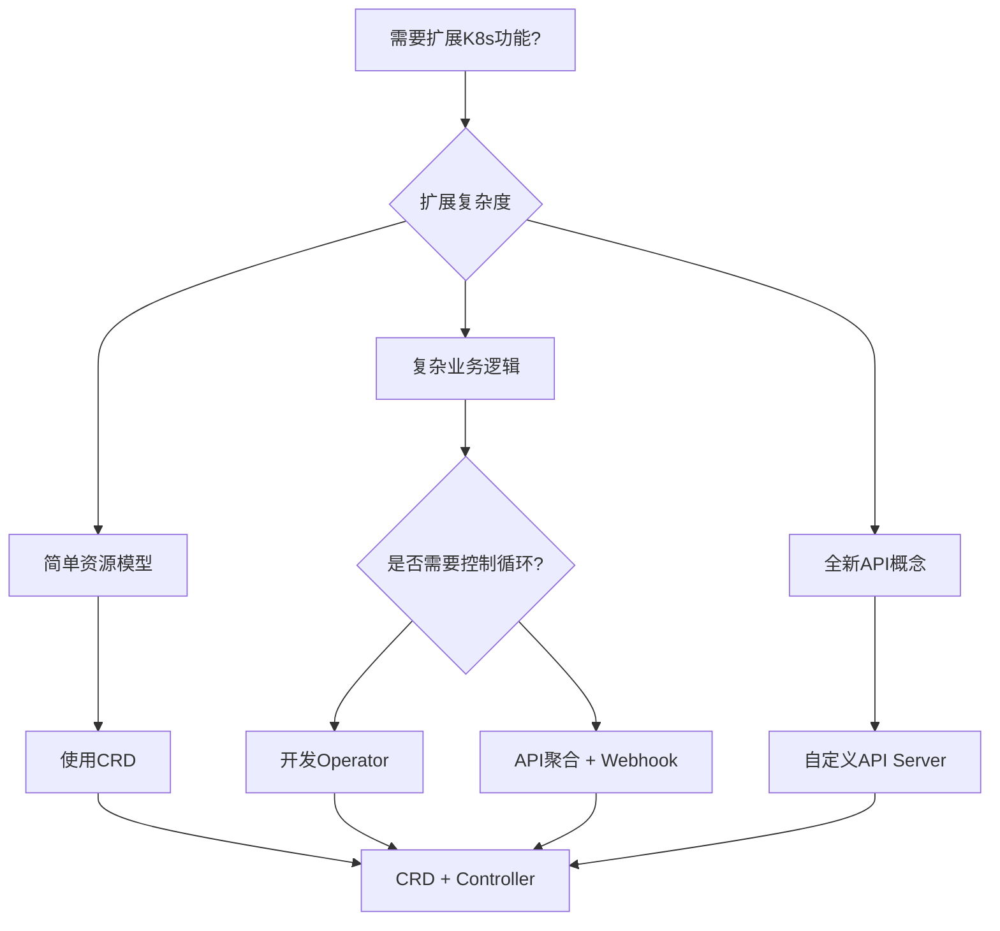

> **生产环境安全提示**
>
> 本文档包含可直接执行的运维命令。执行前请确认：当前目标集群与 Namespace 是否正确；是否具备足够的 RBAC 权限；是否已在非生产环境验证。命令风险等级标注：🔴 高风险（可能造成数据丢失或服务中断）、🟡 中风险（会修改集群状态，但通常可回滚）、🟢 低风险/只读（信息收集，无副作用）。


# [[Kubernetes|Kubernetes]] API扩展深度解析 (API Extensions Deep Dive)

> **适用版本**: Kubernetes v1.25 - v1.32 | **最后更新**: 2026-02 | **文档类型**: API扩展文档

---

<!-- chunk: 目录 -->
## 目录

1. [API扩展概述](#1-api扩展概述)
2. [Custom Resource Definitions (CRD)](#2-custom-resource-definitions-crd)
3. [API聚合层](#3-api聚合层)
4. [自定义API服务器](#4-自定义api服务器)
5. [Webhook扩展机制](#5-webhook扩展机制)
6. [Operator模式实践](#6-operator模式实践)
7. [API版本管理](#7-api版本管理)
8. [扩展开发最佳实践](#8-扩展开发最佳实践)

---

<!-- chunk: 1. API扩展概述 -->
## 1. API扩展概述

### 1.1 扩展机制全景图

Kubernetes提供了多层次的API扩展能力，满足不同场景的定制需求。

```
┌─────────────────────────────────────────────────────────────────────────────────┐
│                         API Extension Architecture                              │
├─────────────────────────────────────────────────────────────────────────────────┤
│                                                                                  │
│  ┌─────────────────────────────────────────────────────────────────────────┐    │
│  │                        Extension Levels                                 │    │
│  │  ┌─────────────┐ ┌─────────────┐ ┌─────────────┐ ┌─────────────────────┐│    │
│  │  │ Level 1     │ │ Level 2     │ │ Level 3     │ │ Level 4             ││    │
│  │  │ CRD         │ │ API聚合     │ │ 自定义API   │ │ 核心修改            ││    │
│  │  │ (简单)      │ │ (中等)      │ │ Server      │ │ (复杂)              ││    │
│  │  └─────────────┘ └─────────────┘ └─────────────┘ └─────────────────────┘│    │
│  └─────────────────────────────────────────────────────────────────────────┘    │
│                                                                                  │
│  Complexity: Low ←──────────────────────────────────────────────────→ High      │
│  Maintenance: Easy ←────────────────────────────────────────────────→ Hard      │
│                                                                                  │
└─────────────────────────────────────────────────────────────────────────────────┘
```

### 1.2 扩展选择决策树



<!-- chunk: 2. Custom Resource Definitions (CRD) -->
## 2. Custom Resource Definitions (CRD)

### 2.1 CRD基础概念

CRD允许用户定义自己的资源类型，无需修改Kubernetes核心代码。

#### CRD基本结构

```yaml
# myresource-crd.yaml
apiVersion: apiextensions.k8s.io/v1
kind: CustomResourceDefinition
metadata:
  name: myresources.example.com
spec:
  group: example.com
  versions:
  - name: v1
    served: true
    storage: true
    schema:
      openAPIV3Schema:
        type: object
        properties:
          spec:
            type: object
            properties:
              replicas:
                type: integer
                minimum: 1
            # 使用 CEL 进行直接验证 (v1.25+)
            x-kubernetes-validations:
              - rule: "self.replicas <= 100"
                message: "Replicas cannot exceed 100"
              - rule: "self.image.startsWith('registry.example.com/')"
                message: "Only images from registry.example.com are allowed"
          status:
            type: object
            properties:
              readyReplicas:
                type: integer
              conditions:
                type: array
                items:
                  type: object
                  properties:
                    type:
                      type: string
                    status:
                      type: string
                    reason:
                      type: string
                    message:
                      type: string
  scope: Namespaced
  names:
    plural: myresources
    singular: myresource
    kind: MyResource
    listKind: MyResourceList
    shortNames:
    - mr
```

### 2.2 CRD版本管理

```yaml
# 多版本CRD示例
apiVersion: apiextensions.k8s.io/v1
kind: CustomResourceDefinition
metadata:
  name: databases.database.example.com
spec:
  group: database.example.com
  versions:
  - name: v1alpha1
    served: true
    storage: false
    schema:
      openAPIV3Schema:
        type: object
        properties:
          spec:
            type: object
            properties:
              size:
                type: string
  - name: v1beta1
    served: true
    storage: false
    schema:
      openAPIV3Schema:
        type: object
        properties:
          spec:
            type: object
            properties:
              storageSize:
                type: string
              replicas:
                type: integer
  - name: v1
    served: true
    storage: true
    schema:
      openAPIV3Schema:
        type: object
        properties:
          spec:
            type: object
            properties:
              storageGB:
                type: integer
              replicaCount:
                type: integer
    # 版本转换配置
    subresources:
      status: {}
    additionalPrinterColumns:
    - name: Storage
      type: integer
      jsonPath: .spec.storageGB
    - name: Replicas
      type: integer
      jsonPath: .spec.replicaCount
    - name: Age
      type: date
      jsonPath: .metadata.creationTimestamp
```

### 2.3 CRD控制器实现

```go
// controller.go - CRD控制器示例
package main

import (
    "context"
    "fmt"
    "time"
    
    "k8s.io/apimachinery/pkg/api/errors"
    metav1 "k8s.io/apimachinery/pkg/apis/meta/v1"
    "k8s.io/apimachinery/pkg/runtime"
    "k8s.io/apimachinery/pkg/types"
    ctrl "sigs.k8s.io/controller-runtime"
    "sigs.k8s.io/controller-runtime/pkg/client"
    "sigs.k8s.io/controller-runtime/pkg/log"
    
    examplev1 "github.com/example/myoperator/api/v1"
)

// MyResourceReconciler reconciles a MyResource object
type MyResourceReconciler struct {
    client.Client
    Scheme *runtime.Scheme
}

//+kubebuilder:rbac:groups=example.com,resources=myresources,verbs=get;list;watch;create;update;patch;delete
//+kubebuilder:rbac:groups=example.com,resources=myresources/status,verbs=get;update;patch
//+kubebuilder:rbac:groups=example.com,resources=myresources/finalizers,verbs=update

func (r *MyResourceReconciler) Reconcile(ctx context.Context, req ctrl.Request) (ctrl.Result, error) {
    log := log.FromContext(ctx)
    
    // 获取CR实例
    myResource := &examplev1.MyResource{}
    if err := r.Get(ctx, req.NamespacedName, myResource); err != nil {
        if errors.IsNotFound(err) {
            return ctrl.Result{}, nil
        }
        return ctrl.Result{}, err
    }
    
    // 检查删除时间戳
    if myResource.DeletionTimestamp != nil {
        return r.handleDeletion(ctx, myResource)
    }
    
    // 添加Finalizer
    if !containsString(myResource.GetFinalizers(), "myresource.finalizer.example.com") {
        myResource.SetFinalizers(append(myResource.GetFinalizers(), "myresource.finalizer.example.com"))
        if err := r.Update(ctx, myResource); err != nil {
            return ctrl.Result{}, err
        }
    }
    
    // 业务逻辑处理
    result, err := r.reconcileBusinessLogic(ctx, myResource)
    if err != nil {
        // 更新状态
        myResource.Status.Conditions = append(myResource.Status.Conditions, examplev1.Condition{
            Type:    "ReconcileFailed",
            Status:  "True",
            Reason:  "ReconcileError",
            Message: err.Error(),
        })
        if updateErr := r.Status().Update(ctx, myResource); updateErr != nil {
            return ctrl.Result{}, fmt.Errorf("update status failed: %v, original error: %v", updateErr, err)
        }
        return result, err
    }
    
    // 更新成功状态
    myResource.Status.ReadyReplicas = myResource.Spec.Replicas
    myResource.Status.Conditions = []examplev1.Condition{
        {
            Type:   "Ready",
            Status: "True",
            Reason: "ReconcileSuccess",
        },
    }
    
    if err := r.Status().Update(ctx, myResource); err != nil {
        return ctrl.Result{}, err
    }
    
    return ctrl.Result{RequeueAfter: time.Minute * 5}, nil
}

func (r *MyResourceReconciler) reconcileBusinessLogic(ctx context.Context, myResource *examplev1.MyResource) (ctrl.Result, error) {
    // 实际的业务逻辑实现
    log := log.FromContext(ctx)
    log.Info("Reconciling MyResource", "name", myResource.Name)
    
    // 创建Deployment
    deployment := &appsv1.Deployment{
        ObjectMeta: metav1.ObjectMeta{
            Name:      myResource.Name,
            Namespace: myResource.Namespace,
            OwnerReferences: []metav1.OwnerReference{
                *metav1.NewControllerRef(myResource, examplev1.GroupVersion.WithKind("MyResource")),
            },
        },
        Spec: appsv1.DeploymentSpec{
            Replicas: &myResource.Spec.Replicas,
            Selector: &metav1.LabelSelector{
                MatchLabels: map[string]string{
                    "app": myResource.Name,
                },
            },
            Template: corev1.PodTemplateSpec{
                ObjectMeta: metav1.ObjectMeta{
                    Labels: map[string]string{
                        "app": myResource.Name,
                    },
                },
                Spec: corev1.PodSpec{
                    Containers: []corev1.Container{
                        {
                            Name:  "main",
                            Image: myResource.Spec.Image,
                            Ports: []corev1.ContainerPort{
                                {
                                    ContainerPort: myResource.Spec.Ports[0],
                                },
                            },
                        },
                    },
                },
            },
        },
    }
    
    // 创建或更新Deployment
    if err := ctrl.SetControllerReference(myResource, deployment, r.Scheme); err != nil {
        return ctrl.Result{}, err
    }
    
    found := &appsv1.Deployment{}
    err := r.Get(ctx, types.NamespacedName{Name: deployment.Name, Namespace: deployment.Namespace}, found)
    if err != nil && errors.IsNotFound(err) {
        log.Info("Creating Deployment", "name", deployment.Name)
        if err := r.Create(ctx, deployment); err != nil {
            return ctrl.Result{}, err
        }
    } else if err != nil {
        return ctrl.Result{}, err
    } else {
        // 更新现有Deployment
        if !reflect.DeepEqual(deployment.Spec, found.Spec) {
            found.Spec = deployment.Spec
            log.Info("Updating Deployment", "name", deployment.Name)
            if err := r.Update(ctx, found); err != nil {
                return ctrl.Result{}, err
            }
        }
    }
    
    return ctrl.Result{}, nil
}

// SetupWithManager sets up the controller with the Manager.
func (r *MyResourceReconciler) SetupWithManager(mgr ctrl.Manager) error {
    return ctrl.NewControllerManagedBy(mgr).
        For(&examplev1.MyResource{}).
        Owns(&appsv1.Deployment{}).
        Complete(r)
}
```

<!-- chunk: 3. API聚合层 -->
## 3. API聚合层

### 3.1 API聚合概述

API聚合允许将自定义API服务器注册到主API服务器，提供原生的kubectl体验。

#### 聚合架构

```
# 🟢 低风险：只读/信息收集，通常无副作用
┌─────────────────────────────────────────────────────────────────────────────────┐
│                           API Aggregation Flow                                  │
├─────────────────────────────────────────────────────────────────────────────────┤
│                                                                                  │
│  kubectl get myresources.example.com                                             │
│        ↓                                                                         │
│  ┌─────────────────────────────────────────────────────────────────────────┐    │
│  │                    kube-apiserver                                       │    │
│  │  ┌─────────────┐ ┌─────────────┐ ┌─────────────┐                       │    │
│  │  │ Core APIs   │ │ Extensions  │ │ Aggregated  │                       │    │
│  │  │ (/api/v1)   │ │ (/apis)     │ │ APIs        │                       │    │
│  │  └─────────────┘ └─────────────┘ └─────────────┘                       │    │
│  └─────────────────────────────────────────────────────────────────────────┘    │
│        ↓                                                                         │
│  APIService Registration                                                         │
│        ↓                                                                         │
│  ┌─────────────────────────────────────────────────────────────────────────┐    │
│  │                 Custom API Server                                       │    │
│  │  ┌─────────────┐ ┌─────────────┐ ┌─────────────┐                       │    │
│  │  │ MyResource  │ │ Handler     │ │ Storage     │                       │    │
│  │  │ Controller  │ │ Logic       │ │ Backend     │                       │    │
│  │  └─────────────┘ └─────────────┘ └─────────────┘                       │    │
│  └─────────────────────────────────────────────────────────────────────────┘    │
│                                                                                  │
└─────────────────────────────────────────────────────────────────────────────────┘
```
### 3.2 APIService配置

```yaml
# apiservice.yaml
apiVersion: apiregistration.k8s.io/v1
kind: APIService
metadata:
  name: v1alpha1.database.example.com
spec:
  group: database.example.com
  version: v1alpha1
  groupPriorityMinimum: 2000
  versionPriority: 100
  service:
    name: database-apiserver
    namespace: database-system
  caBundle: <base64-encoded-ca-cert>
  insecureSkipTLSVerify: false
```

### 3.3 自定义API服务器实现

```go
// main.go - 自定义API服务器示例
package main

import (
    "flag"
    "net/http"
    "os"
    
    "k8s.io/apimachinery/pkg/runtime"
    "k8s.io/apimachinery/pkg/runtime/schema"
    "k8s.io/apimachinery/pkg/runtime/serializer"
    "k8s.io/apiserver/pkg/endpoints/discovery"
    genericapiserver "k8s.io/apiserver/pkg/server"
    "k8s.io/apiserver/pkg/server/options"
    "k8s.io/klog/v2"
    
    // 自定义API组
    databaseinstall "github.com/example/database-apiserver/pkg/apis/database/install"
    databasev1alpha1 "github.com/example/database-apiserver/pkg/apis/database/v1alpha1"
    databasev1alpha1storage "github.com/example/database-apiserver/pkg/registry/database/v1alpha1"
)

func main() {
    stopCh := genericapiserver.SetupSignalHandler()
    
    // 解析命令行参数
    opts := options.NewServerRunOptions()
    opts.AddFlags(flag.CommandLine)
    flag.Parse()
    
    // 创建服务器配置
    serverConfig := genericapiserver.NewRecommendedConfig(serializer.NewCodecFactory(runtime.NewScheme()))
    if err := opts.ApplyTo(serverConfig); err != nil {
        klog.Fatalf("Failed to apply options: %v", err)
    }
    
    // 安装自定义API组
    databaseinstall.Install(serverConfig.Scheme)
    
    // 配置API组信息
    apiGroupInfo := genericapiserver.NewDefaultAPIGroupInfo(
        databasev1alpha1.GroupName,
        serverConfig.Scheme,
        metav1.ParameterCodec,
        serializer.NewCodecFactory(serverConfig.Scheme),
    )
    
    // 注册存储
    v1alpha1storage := map[string]rest.Storage{}
    v1alpha1storage["databases"] = databasev1alpha1storage.NewREST(Scheme, c.GenericConfig.RESTOptionsGetter)
    apiGroupInfo.VersionedResourcesStorageMap["v1alpha1"] = v1alpha1storage
    
    // 创建服务器
    server, err := serverConfig.Complete().New("database-apiserver", genericapiserver.NewEmptyDelegate())
    if err != nil {
        klog.Fatalf("Failed to create server: %v", err)
    }
    
    // 安装API组
    if err := server.InstallAPIGroup(&apiGroupInfo); err != nil {
        klog.Fatalf("Failed to install API group: %v", err)
    }
    
    // 启动服务器
    if err := server.PrepareRun().Run(stopCh); err != nil {
        klog.Fatalf("Failed to run server: %v", err)
    }
}
```

<!-- chunk: 4. 自定义API服务器 -->
## 4. 自定义API服务器

### 4.1 完整实现示例

```yaml
# custom-apiserver-deployment.yaml
apiVersion: apps/v1
kind: Deployment
metadata:
  name: custom-apiserver
  namespace: custom-apisystem
spec:
  replicas: 2
  selector:
    matchLabels:
      app: custom-apiserver
  template:
    metadata:
      labels:
        app: custom-apiserver
    spec:
      containers:
      - name: apiserver
        image: example/custom-apiserver:v1.0.0
        args:
        - --secure-port=443
        - --etcd-servers=https://etcd-client:2379
        - --etcd-cafile=/etc/etcd/ca.crt
        - --etcd-certfile=/etc/etcd/client.crt
        - --etcd-keyfile=/etc/etcd/client.key
        - --tls-cert-file=/etc/apiserver/tls.crt
        - --tls-private-key-file=/etc/apiserver/tls.key
        - --client-ca-file=/etc/apiserver/ca.crt
        - --authorization-mode=RBAC
        ports:
        - containerPort: 443
          protocol: TCP
        volumeMounts:
        - name: etcd-certs
          mountPath: /etc/etcd
          readOnly: true
        - name: apiserver-certs
          mountPath: /etc/apiserver
          readOnly: true
        livenessProbe:
          httpGet:
            scheme: HTTPS
            path: /healthz
            port: 443
          initialDelaySeconds: 30
          periodSeconds: 10
        readinessProbe:
          httpGet:
            scheme: HTTPS
            path: /readyz
            port: 443
          initialDelaySeconds: 5
          periodSeconds: 5
      volumes:
      - name: etcd-certs
        secret:
          secretName: etcd-client-certs
      - name: apiserver-certs
        secret:
          secretName: custom-apiserver-certs
---
apiVersion: v1
kind: Service
metadata:
  name: custom-apiserver
  namespace: custom-apisystem
spec:
  selector:
    app: custom-apiserver
  ports:
  - port: 443
    targetPort: 443
    protocol: TCP
```

<!-- chunk: 5. Webhook扩展机制 -->
## 5. Webhook扩展机制

### 5.1 准入Webhook配置

```yaml
# webhook-deployment.yaml
apiVersion: apps/v1
kind: Deployment
metadata:
  name: validation-webhook
  namespace: webhook-system
spec:
  replicas: 2
  selector:
    matchLabels:
      app: validation-webhook
  template:
    metadata:
      labels:
        app: validation-webhook
    spec:
      containers:
      - name: webhook
        image: example/validation-webhook:v1.0.0
        ports:
        - containerPort: 8443
        env:
        - name: TLS_CERT_FILE
          value: /etc/webhook/certs/tls.crt
        - name: TLS_KEY_FILE
          value: /etc/webhook/certs/tls.key
        volumeMounts:
        - name: webhook-certs
          mountPath: /etc/webhook/certs
          readOnly: true
      volumes:
      - name: webhook-certs
        secret:
          secretName: webhook-certs
---
apiVersion: v1
kind: Service
metadata:
  name: validation-webhook-service
  namespace: webhook-system
spec:
  selector:
    app: validation-webhook
  ports:
  - port: 443
    targetPort: 8443
```

### 5.2 Webhook处理逻辑

```go
// webhook.go - Webhook处理器示例
package main

import (
    "context"
    "encoding/json"
    "net/http"
    
    admissionv1 "k8s.io/api/admission/v1"
    metav1 "k8s.io/apimachinery/pkg/apis/meta/v1"
    "k8s.io/apimachinery/pkg/runtime"
    "k8s.io/apimachinery/pkg/runtime/serializer"
    "k8s.io/klog/v2"
)

var (
    scheme = runtime.NewScheme()
    codecs = serializer.NewCodecFactory(scheme)
)

type webhookServer struct {
    server *http.Server
}

func (wh *webhookServer) validate(ar *admissionv1.AdmissionReview) *admissionv1.AdmissionResponse {
    req := ar.Request
    var result *metav1.Status
    var msg string
    
    klog.Infof("AdmissionReview for Kind=%v, Namespace=%v Name=%v UID=%v Operation=%v",
        req.Kind, req.Namespace, req.Name, req.UID, req.Operation)
    
    switch req.Kind.Kind {
    case "MyResource":
        if req.Operation == admissionv1.Create || req.Operation == admissionv1.Update {
            // 验证自定义资源
            if err := wh.validateMyResource(req.Object.Raw); err != nil {
                result = &metav1.Status{
                    Message: err.Error(),
                }
                msg = err.Error()
                return &admissionv1.AdmissionResponse{
                    Allowed: false,
                    Result:  result,
                }
            }
        }
    }
    
    return &admissionv1.AdmissionResponse{
        Allowed: true,
        Result:  result,
    }
}

func (wh *webhookServer) serve(w http.ResponseWriter, r *http.Request) {
    var body []byte
    if r.Body != nil {
        if data, err := io.ReadAll(r.Body); err == nil {
            body = data
        }
    }
    
    if len(body) == 0 {
        klog.Error("empty body")
        http.Error(w, "empty body", http.StatusBadRequest)
        return
    }
    
    // 验证Content-Type
    contentType := r.Header.Get("Content-Type")
    if contentType != "application/json" {
        klog.Errorf("Content-Type=%s, expect application/json", contentType)
        http.Error(w, "invalid Content-Type, expect `application/json`", http.StatusUnsupportedMediaType)
        return
    }
    
    // 解析AdmissionReview
    obj, gvk, err := codecs.UniversalDeserializer().Decode(body, nil, nil)
    if err != nil {
        msg := fmt.Sprintf("Request could not be decoded: %v", err)
        klog.Error(msg)
        http.Error(w, msg, http.StatusBadRequest)
        return
    }
    
    var responseObj runtime.Object
    switch *gvk {
    case admissionv1.SchemeGroupVersion.WithKind("AdmissionReview"):
        requestAdmissionReview, ok := obj.(*admissionv1.AdmissionReview)
        if !ok {
            klog.Errorf("Expected v1.AdmissionReview but got: %T", obj)
            return
        }
        responseAdmissionReview := &admissionv1.AdmissionReview{}
        responseAdmissionReview.SetGroupVersionKind(*gvk)
        responseAdmissionReview.Response = wh.validate(requestAdmissionReview)
        responseAdmissionReview.Response.UID = requestAdmissionReview.Request.UID
        responseObj = responseAdmissionReview
    default:
        msg := fmt.Sprintf("Unsupported group version kind: %v", gvk)
        klog.Error(msg)
        http.Error(w, msg, http.StatusBadRequest)
        return
    }
    
    respBytes, err := json.Marshal(responseObj)
    if err != nil {
        klog.Error(err)
        http.Error(w, err.Error(), http.StatusInternalServerError)
        return
    }
    
    klog.Info(fmt.Sprintf("sending response: %v", responseObj))
    w.Header().Set("Content-Type", "application/json")
    w.WriteHeader(http.StatusOK)
    w.Write(respBytes)
}

func main() {
    klog.InitFlags(nil)
    flag.Parse()
    
    certFile := os.Getenv("TLS_CERT_FILE")
    keyFile := os.Getenv("TLS_KEY_FILE")
    
    wh := &webhookServer{
        server: &http.Server{
            Addr: ":8443",
            TLSConfig: &tls.Config{
                ClientAuth: tls.NoClientCert,
            },
        },
    }
    
    http.HandleFunc("/validate", wh.serve)
    
    klog.Info("Starting webhook server...")
    if err := wh.server.ListenAndServeTLS(certFile, keyFile); err != nil {
        klog.Fatalf("Failed to listen and serve webhook server: %v", err)
    }
}
```

<!-- chunk: 6. Operator模式实践 -->
## 6. Operator模式实践

### 6.1 Operator SDK项目结构

``` bash
# 🟢 低风险：只读/信息收集，通常无副作用
# 初始化Operator项目
mkdir my-operator && cd my-operator
operator-sdk init --domain=example.com --repo=github.com/example/my-operator

# 创建API
operator-sdk create api --group=apps --version=v1alpha1 --kind=MyApp --resource=true --controller=true

# 生成CRD manifests
make manifests

# 生成代码
make generate

# 构建镜像
make docker-build IMG=example/my-operator:v0.0.1

# 部署
make deploy IMG=example/my-operator:v0.0.1
```
### 6.2 完整Operator示例

```yaml
# config/samples/apps_v1alpha1_myapp.yaml
apiVersion: apps.example.com/v1alpha1
kind: MyApp
metadata:
  name: myapp-sample
spec:
  size: 3
  image: nginx:latest
  ports:
  - containerPort: 80
  resources:
    requests:
      memory: "64Mi"
      cpu: "250m"
    limits:
      memory: "128Mi"
      cpu: "500m"
```

<!-- chunk: 7. Reconciler架构深度解析 -->
## 7. Reconciler架构深度解析

### 7.1 Reconciler内部工作机制

controller-runtime的Reconciler是Operator的核心引擎。理解其内部机制是构建可靠控制器的基础。

```
┌──────────────────────────────────────────────────────────────────────────────┐
│                     Controller-Runtime Architecture                          │
├──────────────────────────────────────────────────────────────────────────────┤
│                                                                              │
│  ┌─────────────┐     ┌─────────────┐     ┌─────────────────────────┐  │
│  │ Informer    │     │ Event       │     │ Work Queue              │  │
│  │ (Watch +   │───→│ Handler     │───→│ (RateLimited)           │  │
│  │  Cache)     │     │ (Enqueue)   │     │                         │  │
│  └─────────────┘     └─────────────┘     └─────────┬───────────────┘  │
│       │                                             │                    │
│       │         ┌────────────────────┐            │                    │
│       └────────┤ Shared Cache      │────────────┘                    │
│                 │ (Indexed)          │                                       │
│                 └────────────────────┘                                       │
│                        │                                                      │
│  ┌───────────────────┬─────────────────────┬─────────────────────┐  │
│  │ Reconciler Worker 1 │ Reconciler Worker 2 │ Reconciler Worker N │  │
│  │ (goroutine)         │ (goroutine)         │ (goroutine)         │  │
│  └───────────────────┴─────────────────────┴─────────────────────┘  │
│                           MaxConcurrentReconciles = N                        │
└──────────────────────────────────────────────────────────────────────────────┘
```

### 7.2 生产级Manager配置

```go
// main.go - 企业级Operator启动配置
package main

import (
    "crypto/tls"
    "flag"
    "os"
    "time"

    "k8s.io/apimachinery/pkg/runtime"
    utilruntime "k8s.io/apimachinery/pkg/util/runtime"
    clientgoscheme "k8s.io/client-go/kubernetes/scheme"
    ctrl "sigs.k8s.io/controller-runtime"
    "sigs.k8s.io/controller-runtime/pkg/cache"
    "sigs.k8s.io/controller-runtime/pkg/client"
    "sigs.k8s.io/controller-runtime/pkg/healthz"
    "sigs.k8s.io/controller-runtime/pkg/metrics/server"
    "sigs.k8s.io/controller-runtime/pkg/webhook"

    appv1 "github.com/example/app-operator/api/v1"
    "github.com/example/app-operator/internal/controller"
)

var scheme = runtime.NewScheme()

func init() {
    utilruntime.Must(clientgoscheme.AddToScheme(scheme))
    utilruntime.Must(appv1.AddToScheme(scheme))
}

func main() {
    var (
        metricsAddr          string
        probeAddr            string
        enableLeaderElection bool
        leaderElectionID     string
        syncPeriod           time.Duration
        maxConcurrent        int
    )
    flag.StringVar(&metricsAddr, "metrics-bind-address", ":8080", "Metrics endpoint")
    flag.StringVar(&probeAddr, "health-probe-bind-address", ":8081", "Health probe endpoint")
    flag.BoolVar(&enableLeaderElection, "leader-elect", true, "Enable leader election")
    flag.StringVar(&leaderElectionID, "leader-election-id", "app-operator.example.com", "Leader election ID")
    flag.DurationVar(&syncPeriod, "sync-period", 10*time.Minute, "Informer cache resync period")
    flag.IntVar(&maxConcurrent, "max-concurrent-reconciles", 5, "Max concurrent reconciles")
    flag.Parse()

    mgr, err := ctrl.NewManager(ctrl.GetConfigOrDie(), ctrl.Options{
        Scheme: scheme,
        
        // 监控配置
        Metrics: server.Options{BindAddress: metricsAddr},
        
        // Webhook配置
        WebhookServer: webhook.NewServer(webhook.Options{
            Port: 9443,
            TLSOpts: []func(config *tls.Config){
                func(config *tls.Config) {
                    config.MinVersion = tls.VersionTLS13
                },
            },
        }),
        
        // 健康检查
        HealthProbeBindAddress: probeAddr,
        
        // Leader选举配置
        LeaderElection:          enableLeaderElection,
        LeaderElectionID:        leaderElectionID,
        LeaderElectionNamespace: "operator-system",
        LeaseDuration:           &[]time.Duration{15 * time.Second}[0],
        RenewDeadline:           &[]time.Duration{10 * time.Second}[0],
        RetryPeriod:             &[]time.Duration{2 * time.Second}[0],
        
        // 缓存配置: 仅缓存需要的资源和字段
        Cache: cache.Options{
            SyncPeriod: &syncPeriod,
            ByObject: map[client.Object]cache.ByObject{
                &appv1.Application{}: {},
                &appsv1.Deployment{}: {
                    // 仅缓存特定命名空间
                    Namespaces: map[string]cache.Config{
                        "production": {},
                        "staging":    {},
                    },
                },
            },
        },
        
        // 客户端配置: 启用缓存读取
        Client: client.Options{
            Cache: &client.CacheOptions{
                DisableFor: []client.Object{
                    &corev1.Secret{}, // Secret不缓存，始终直读
                },
            },
        },
    })
    if err != nil {
        setupLog.Error(err, "unable to start manager")
        os.Exit(1)
    }

    // 注册控制器
    if err := (&controller.ApplicationReconciler{
        Client:   mgr.GetClient(),
        Scheme:   mgr.GetScheme(),
        Recorder: mgr.GetEventRecorderFor("application-controller"),
    }).SetupWithManager(mgr, maxConcurrent); err != nil {
        setupLog.Error(err, "unable to create controller", "controller", "Application")
        os.Exit(1)
    }

    // 注册健康检查
    if err := mgr.AddHealthzCheck("healthz", healthz.Ping); err != nil {
        setupLog.Error(err, "unable to set up health check")
        os.Exit(1)
    }
    if err := mgr.AddReadyzCheck("readyz", healthz.Ping); err != nil {
        setupLog.Error(err, "unable to set up ready check")
        os.Exit(1)
    }

    setupLog.Info("starting manager")
    if err := mgr.Start(ctrl.SetupSignalHandler()); err != nil {
        setupLog.Error(err, "problem running manager")
        os.Exit(1)
    }
}
```

### 7.3 高可用Leader选举机制

```
┌───────────────────── Leader Election Flow ────────────────────┐
│                                                                    │
│  Pod-1 (Leader)         Pod-2 (Standby)        Pod-3 (Standby)    │
│  ┌─────────────┐       ┌─────────────┐      ┌─────────────┐  │
│  │ Reconciling │       │  Waiting    │      │  Waiting    │  │
│  │ (Active)    │       │  for Lease  │      │  for Lease  │  │
│  └─────┬───────┘       └─────┬───────┘      └─────┬───────┘  │
│        │  ↑ 续期         │  ↑ 尝试获取        │  ↑ 尝试获取   │
│        └──┬─┘             └──┬─┘             └──┬─┘          │
│           │                   │                   │               │
│           └─────────┬───────┴───────┬─────────┘               │
│                     │               │                              │
│              ┌─────┴───────┴────────┐                         │
│              │  Lease Object (etcd)   │                         │
│              │  coordination.k8s.io   │                         │
│              └───────────────────────┘                         │
│                                                                    │
│  LeaseDuration = 15s  (租约时长)                                    │
│  RenewDeadline = 10s  (续期截止)                                    │
│  RetryPeriod   = 2s   (重试间隔)                                    │
│                                                                    │
│  Leader问题时, Standby在 LeaseDuration 后自动接管                 │
└────────────────────────────────────────────────────────────────────┘
```

### 7.4 缓存优化与内存管理

| 优化策略 | 说明 | 效果 |
|---------|------|------|
| 按Namespace过滤 | 仅缓存目标命名空间资源 | 内存减少~70% |
| 按Label过滤 | 仅缓存匹配标签的对象 | 内存减少~50% |
| 禁用特定资源缓存 | Secret等敏感资源直读 | 安全+省内存 |
| 索引字段 | 为常用查询字段建索引 | 查询性能提升~10x |
| 调整ResyncPeriod | 根据场景调整全量重同步周期 | 减少API压力 |

```go
// 缓存索引配置示例
func setupIndexes(mgr ctrl.Manager) error {
    // 为Deployment按OwnerReference建索引
    if err := mgr.GetFieldIndexer().IndexField(
        context.Background(),
        &appsv1.Deployment{},
        ".metadata.controller",
        func(obj client.Object) []string {
            owner := metav1.GetControllerOf(obj)
            if owner == nil {
                return nil
            }
            if owner.APIVersion != appv1.GroupVersion.String() || owner.Kind != "Application" {
                return nil
            }
            return []string{owner.Name}
        },
    ); err != nil {
        return err
    }
    return nil
}

// 利用索引高效查询
func (r *ApplicationReconciler) getOwnedDeployments(
    ctx context.Context, app *appv1.Application,
) (*appsv1.DeploymentList, error) {
    var deploymentList appsv1.DeploymentList
    err := r.List(ctx, &deploymentList,
        client.InNamespace(app.Namespace),
        client.MatchingFields{".metadata.controller": app.Name},
    )
    return &deploymentList, err
}
```

### 7.5 Reconciler性能调优参数

| 参数 | 默认值 | 生产建议 | 说明 |
|------|---------|---------|------|
| MaxConcurrentReconciles | 1 | 3-10 | 并发Reconcile数，根据CR数量调整 |
| CacheSyncTimeout | 2m | 5m | 大集群缓存同步超时时间 |
| SyncPeriod | 10h | 10m-1h | Informer重同步周期 |
| RateLimiter.BaseDelay | 5ms | 200ms | 指数退避基础延迟 |
| RateLimiter.MaxDelay | 1000s | 300-1000s | 最大重试延迟 |
| BucketRateLimiter.QPS | 10 | 10-50 | 全局速率限制 |
| BucketRateLimiter.Burst | 100 | 100-500 | 突发允许量 |
| LeaseDuration | 15s | 15s | Leader选举租约时长 |
| RenewDeadline | 10s | 10s | Leader续期截止时间 |
| RetryPeriod | 2s | 2s | Leader选举重试间隔 |

<!-- chunk: 8. API版本管理 -->
## 8. API版本管理

### 8.1 版本转换策略

```go
// conversion.go - 版本转换示例
package v1alpha1

import (
    "github.com/example/my-operator/api/v1beta1"
    ctrl "sigs.k8s.io/controller-runtime"
    "sigs.k8s.io/controller-runtime/pkg/conversion"
)

// ConvertTo converts this MyApp to the Hub version (v1beta1).
func (src *MyApp) ConvertTo(dstRaw conversion.Hub) error {
    dst := dstRaw.(*v1beta1.MyApp)
    
    // 复制基础字段
    dst.ObjectMeta = src.ObjectMeta
    
    // 转换Spec字段
    dst.Spec.Replicas = src.Spec.Size
    dst.Spec.Image = src.Spec.Image
    dst.Spec.ContainerPorts = src.Spec.Ports
    
    // 设置默认值
    if dst.Spec.Replicas == 0 {
        dst.Spec.Replicas = 1
    }
    
    return nil
}

// ConvertFrom converts from the Hub version (v1beta1) to this version.
func (dst *MyApp) ConvertFrom(srcRaw conversion.Hub) error {
    src := srcRaw.(*v1beta1.MyApp)
    
    // 复制基础字段
    dst.ObjectMeta = src.ObjectMeta
    
    // 转换Spec字段
    dst.Spec.Size = src.Spec.Replicas
    dst.Spec.Image = src.Spec.Image
    
    // 转换端口格式
    dst.Spec.Ports = make([]int32, len(src.Spec.ContainerPorts))
    for i, port := range src.Spec.ContainerPorts {
        dst.Spec.Ports[i] = port.ContainerPort
    }
    
    return nil
}
```

<!-- chunk: 9. 扩展开发最佳实践 -->
## 9. 扩展开发最佳实践

### 9.1 开发与运维最佳实践

- **CEL 优先原则**: 对于简单的字段验证，优先使用 CRD 内置的 `x-kubernetes-validations` 或 `ValidatingAdmissionPolicy`。
- **Finalizer 安全**: 务必在控制器中正确处理 Finalizer，防止资源由于外部依赖未清理而处于 Terminating 状态无法删除。
- **Status 子资源**: 始终启用 `/status` 子资源，并在控制器中通过 `r.Status().Update()` 更新，以避免不必要的 Spec 变更触发 Reconcile。
- **存储迁移**: 在变更 CRD 版本时，务必考虑存量数据的转换（Conversion Webhook）。

### 9.2 安全最佳实践

```yaml
# 安全的RBAC配置
apiVersion: rbac.authorization.k8s.io/v1
kind: ClusterRole
metadata:
  name: my-operator-role
rules:
# 最小必要权限
- apiGroups:
  - apps.example.com
  resources:
  - myapps
  - myapps/status
  - myapps/finalizers
  verbs:
  - get
  - list
  - watch
  - create
  - update
  - patch
  - delete
# 仅需要的核心资源权限
- apiGroups:
  - apps
  resources:
  - deployments
  verbs:
  - get
  - list
  - watch
  - create
  - update
  - patch
  - delete
- apiGroups:
  - ""
  resources:
  - services
  - configmaps
  - secrets
  verbs:
  - get
  - list
  - watch
  - create
  - update
  - patch
  - delete
```

### 9.3 监控和日志

```yaml
# Prometheus监控配置
apiVersion: monitoring.coreos.com/v1
kind: ServiceMonitor
metadata:
  name: my-operator-metrics
  namespace: monitoring
spec:
  selector:
    matchLabels:
      app: my-operator
  endpoints:
  - port: metrics
    interval: 30s
---
# Grafana仪表板配置
apiVersion: v1
kind: ConfigMap
metadata:
  name: my-operator-dashboard
  namespace: monitoring
  labels:
    grafana_dashboard: "1"
data:
  my-operator.json: |
    {
      "dashboard": {
        "title": "My Operator Metrics",
        "panels": [
          {
            "title": "Reconciliation Rate",
            "type": "graph",
            "targets": [
              {
                "expr": "rate(controller_runtime_reconcile_total[5m])",
                "legendFormat": "{{controller}}"
              }
            ]
          }
        ]
      }
    }
```

### 9.4 部署和升级策略

```yaml
# Helm Chart结构
my-operator/
├── Chart.yaml
├── values.yaml
├── templates/
│   ├── deployment.yaml
│   ├── rbac.yaml
│   ├── crds/
│   │   └── apps.example.com_myapps.yaml
│   └── _helpers.tpl
└── crds/
    └── apps.example.com_myapps.yaml
```

---
**文档维护**: Kusheet API Extensions Team | **最后审查**: 2026-02 | **复杂度**: ★★★★☆

---

<!-- chunk: 10. Reconciler故障排查与运维实践 -->
## 10. Reconciler故障排查与运维实践

### 10.1 常见问题诊断

| 问题现象 | 可能原因 | 排查方法 | 解决方案 |
|---------|---------|---------|----------|
| CR删除卡在Terminating | Finalizer未正确移除 | `kubectl get <cr> -o yaml` 查看finalizers | 修复controller清理逻辑，紧急时可patch移除finalizer |
| Reconcile持续失败重试 | 外部依赖不可用/RBAC权限不足 | 查看controller日志和事件 | 修复外部依赖/补充RBAC权限 |
| CR状态不更新 | Status子资源未启用/更新失败 | 检查CRD subresources配置 | 启用status子资源，检查RBAC |
| 内存持续增长(OOM) | 缓存未优化/资源泄漏 | pprof分析内存 | 按Namespace过滤缓存/排查泄漏 |
| 双 Leader同时运行 | Leader选举配置不当 | 检查Lease对象状态 | 调整LeaseDuration/RenewDeadline |
| Reconcile延迟高 | 并发不足/API调用过多 | 查看reconcile_duration指标 | 提高并发数/使用缓存查询 |
| 子资源未被级联删除 | OwnerReference未正确设置 | 检查子资源ownerReferences | 确保SetControllerReference |
| Watch事件丢失 | Informer断连/网络问题 | 检查controller日志中的watch错误 | 确保ResyncPeriod合理 |

### 10.2 运维诊断命令

> ⚠️ **🟡 中危变更** — 变更集群资源状态，建议先 --dry-run 或 diff 确认
> - `kubectl edit/patch`：修改运行中的资源

``` bash
# 🟡 中风险：会修改集群/资源状态，执行前请确认目标、影响范围与授权
# 1. 查看控制器日志
kubectl logs -n operator-system deploy/app-operator-controller-manager -c manager -f

# 2. 查看CR事件
kubectl describe application my-app -n production

# 3. 查看Leader选举状态
kubectl get lease -n operator-system
kubectl describe lease app-operator.example.com -n operator-system

# 4. 查看Reconcile指标
curl -s http://localhost:8080/metrics | grep controller_runtime_reconcile
# controller_runtime_reconcile_total{controller="application",result="success"}
# controller_runtime_reconcile_total{controller="application",result="error"}
# controller_runtime_reconcile_errors_total{controller="application"}
# controller_runtime_reconcile_time_seconds_bucket{controller="application"}

# 5. 检查卡在Terminating状态的资源
kubectl get application --all-namespaces -o json | \
  jq '.items[] | select(.metadata.deletionTimestamp != null) | .metadata.name'

# 6. 紧急移除卡住Finalizer (谨慎使用)
kubectl patch application my-app -n production \
  --type=json -p='[{"op": "remove", "path": "/metadata/finalizers"}]'

# 7. 查看控制器pprof内存分析
kubectl port-forward -n operator-system deploy/app-operator-controller-manager 8080:8080
go tool pprof http://localhost:8080/debug/pprof/heap

# 8. 查看工作队列深度
curl -s http://localhost:8080/metrics | grep workqueue_depth
# workqueue_depth{name="application"} — 如果持续增长说明处理速度跟不上
```
### 10.3 Reconciler性能调优检查清单

| 检查项 | 命令/方法 | 期望结果 |
|---------|---------|----------|
| Reconcile平均耗时 | `controller_runtime_reconcile_time_seconds` | P99 < 5s |
| 队列深度 | `workqueue_depth` | 稳定且不持续增长 |
| 重试率 | `workqueue_retries_total` | 错误重试比侎于10% |
| 内存使用 | `go_memstats_alloc_bytes` | 稳定无泄漏 |
| Goroutine数 | `go_goroutines` | 稳定且合理 |
| API请求延迟 | `rest_client_request_duration_seconds` | P99 < 1s |
| 缓存命中率 | cache hit vs API call ratio | > 95% |

### 10.4 资源泄漏防护

```go
// 资源泄漏防护: 孤儿资源检测与清理
func (r *ApplicationReconciler) cleanupOrphanedResources(
    ctx context.Context, app *appv1.Application,
) error {
    logger := log.FromContext(ctx)
    
    // 查找所有带有owner标签但已无对应CR的Deployment
    var deployments appsv1.DeploymentList
    if err := r.List(ctx, &deployments,
        client.InNamespace(app.Namespace),
        client.MatchingLabels{"app.example.com/managed-by": "application-controller"},
    ); err != nil {
        return err
    }
    
    for _, dep := range deployments.Items {
        ownerRef := metav1.GetControllerOf(&dep)
        if ownerRef == nil {
            continue
        }
        // 检查owner是否仍然存在
        ownerApp := &appv1.Application{}
        err := r.Get(ctx, types.NamespacedName{
            Name: ownerRef.Name, Namespace: dep.Namespace,
        }, ownerApp)
        if errors.IsNotFound(err) {
            logger.Info("Cleaning up orphaned Deployment",
                "deployment", dep.Name, "orphan-owner", ownerRef.Name)
            if err := r.Delete(ctx, &dep); err != nil {
                return fmt.Errorf("delete orphaned deployment %s: %w", dep.Name, err)
            }
            r.Recorder.Eventf(app, corev1.EventTypeWarning,
                "OrphanCleanup", "Cleaned up orphaned Deployment %s", dep.Name)
        }
    }
    return nil
}
```

### 10.5 企业级部署模板

```yaml
# operator-deployment.yaml - 生产级部署配置
apiVersion: apps/v1
kind: Deployment
metadata:
  name: app-operator-controller-manager
  namespace: operator-system
spec:
  replicas: 2  # 高可用: 至少2个副本
  selector:
    matchLabels:
      control-plane: controller-manager
  template:
    metadata:
      labels:
        control-plane: controller-manager
      annotations:
        prometheus.io/scrape: "true"
        prometheus.io/port: "8080"
    spec:
      serviceAccountName: app-operator-controller-manager
      terminationGracePeriodSeconds: 30
      # 反亲和性: 确保副本分布在不同节点
      affinity:
        podAntiAffinity:
          preferredDuringSchedulingIgnoredDuringExecution:
          - weight: 100
            podAffinityTerm:
              labelSelector:
                matchExpressions:
                - key: control-plane
                  operator: In
                  values: [controller-manager]
              topologyKey: kubernetes.io/hostname
      containers:
      - name: manager
        image: example.com/app-operator:v1.0.0
        args:
        - --leader-elect=true
        - --leader-election-id=app-operator.example.com
        - --metrics-bind-address=:8080
        - --health-probe-bind-address=:8081
        - --max-concurrent-reconciles=5
        - --sync-period=10m
        ports:
        - containerPort: 8080
          name: metrics
        - containerPort: 8081
          name: health
        resources:
          requests:
            cpu: 100m
            memory: 256Mi
          limits:
            cpu: 500m
            memory: 512Mi
        livenessProbe:
          httpGet:
            path: /healthz
            port: 8081
          initialDelaySeconds: 15
          periodSeconds: 20
        readinessProbe:
          httpGet:
            path: /readyz
            port: 8081
          initialDelaySeconds: 5
          periodSeconds: 10
        securityContext:
          allowPrivilegeEscalation: false
          readOnlyRootFilesystem: true
          runAsNonRoot: true
          capabilities:
            drop: [ALL]
          seccompProfile:
            type: RuntimeDefault
      # PodDisruptionBudget
---
apiVersion: policy/v1
kind: PodDisruptionBudget
metadata:
  name: app-operator-pdb
  namespace: operator-system
spec:
  minAvailable: 1
  selector:
    matchLabels:
      control-plane: controller-manager
```

### 10.6 Prometheus告警规则

```yaml
# 控制器告警规则
groups:
- name: operator.reconciler.rules
  rules:
  - alert: ReconcileErrorRateHigh
    expr: |
      rate(controller_runtime_reconcile_total{result="error"}[5m])
      / rate(controller_runtime_reconcile_total[5m]) > 0.1
    for: 10m
    labels:
      severity: warning
    annotations:
      summary: "Reconcile错误率超过10%"
      description: "{{ $labels.controller }}控制器错误率: {{ $value | humanizePercentage }}"
      
  - alert: ReconcileLatencyHigh
    expr: |
      histogram_quantile(0.99,
        rate(controller_runtime_reconcile_time_seconds_bucket[5m])) > 10
    for: 10m
    labels:
      severity: warning
    annotations:
      summary: "Reconcile P99延迟超过10秒"
      
  - alert: WorkQueueBacklogGrowing
    expr: workqueue_depth{name=~".*"} > 100
    for: 5m
    labels:
      severity: warning
    annotations:
      summary: "工作队列积压超过100"
      
  - alert: OperatorLeaderElectionLost
    expr: |
      changes(leader_election_master_status[5m]) > 2
    for: 5m
    labels:
      severity: critical
    annotations:
      summary: "Leader选举频繁切换，可能存在网络/资源问题"
---

**表格底部标记**: Kusheet Project, 作者 Allen Galler (allengaller@gmail.com)

---

<!-- chunk: Obsidian 相关文档 -->
## Obsidian 相关文档

- domain-01-cluster-fundamentals MOC
- [[domain-01-cluster-fundamentals/README.md|Domain-3: Kubernetes控制平面]]
- Domain-3 控制平面 — 开源项目索引
- Kubernetes 控制平面架构总览 (Control Plane Architecture Overview)
- 控制平面组件交互详解 (Control Plane Components Interaction Deep Dive)
- 控制平面高可用部署模式 (Control Plane High Availability Deployment Patt...
- 控制平面安全加固指南 (Control Plane Security Hardening Guide)
- 控制平面监控与可观测性 (Control Plane Monitoring & Observability)
- 控制平面故障排查手册 (Control Plane Troubleshooting Handbook)
- 控制平面升级与迁移策略 (Control Plane Upgrade & Migration Strategy)
- 控制平面性能基准测试 (Control Plane Performance Benchmarking)
- 控制平面扩缩容指南 (Control Plane Scalability Guide)

## See Also

- 26-gitops-automation-operations
- 27-authz-authn-deep-dive
- 29-in-place-pod-resize
- 30-dynamic-resource-allocation


<!-- risk-assessed -->
