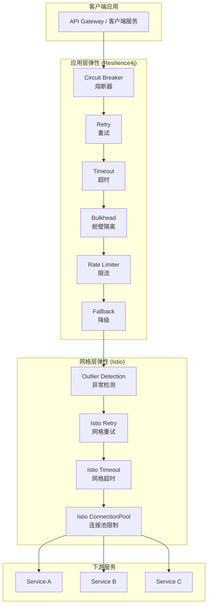
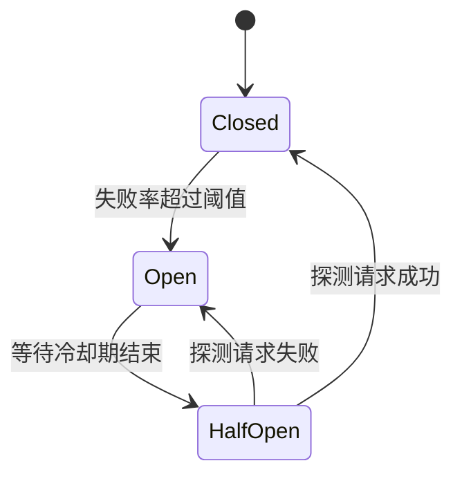

> **生产环境安全提示**
>
> 本文档包含可直接执行的运维命令。执行前请确认：当前目标集群与 Namespace 是否正确；是否具备足够的 RBAC 权限；是否已在非生产环境验证。命令风险等级标注：🔴 高风险（可能造成数据丢失或服务中断）、🟡 中风险（会修改集群状态，但通常可回滚）、🟢 低风险/只读（信息收集，无副作用）。


# 微服务弹性模式深度实践 — Circuit Breaker, Retry, Timeout, Bulkhead, Rate Limiting

> **最后更新**: 2026-04-24
> **适用版本**: Resilience4j 2.x / [[Istio|Istio]] v1.29 / Spring Boot 3.4+
> **难度**: 高级

---

<!-- chunk: 概述 -->## 概述

在分布式微服务系统中，问题是不可避免的常态而非例外。网络分区、服务过载、依赖不可用、级联问题等问题随时可能发生。弹性模式（Resilience Patterns）通过在系统层面引入防御性编程机制，使得单个组件的问题不会蔓延为系统级的灾难。本文档从理论与实践两个维度，全面覆盖 [[Kubernetes|Kubernetes]] 环境下微服务弹性模式的实现，包括应用层的 Resilience4j 配置和服务网格层的 Istio 弹性策略，以及两者的协同与冲突避免策略。

弹性模式的核心目标不是消除问题，而是控制问题的影响范围和恢复时间。一个设计良好的弹性系统应当能够优雅降级而非完全失效，并在问题条件消除后快速恢复到正常状态。本文档覆盖五种核心弹性模式：熔断器（Circuit Breaker）、重试（Retry）、超时（Timeout）、舱壁隔离（Bulkhead）和限流（Rate Limiting），以及它们在 Kubernetes + Istio 环境下的生产级配置实践。

## 弹性模式架构全景



---

<!-- chunk: 一、熔断器 (Circuit Breaker) -->## 一、熔断器 (Circuit Breaker)

## 1.1 熔断器原理

熔断器是微服务弹性模式中最核心的机制。它的工作原理类似于电路中的保险丝：当下游服务的错误率超过阈值时，熔断器"跳闸"，后续请求不再发送到已问题的下游服务，而是快速失败或执行降级逻辑。经过一段冷却期后，熔断器进入"半开"状态，允许少量探测请求通过，如果探测成功则恢复，否则继续断开。



## 1.2 Resilience4j 熔断器配置

```yaml
resilience4j:
  circuitbreaker:
    configs:
      default:
        slidingWindowType: COUNT_BASED
        slidingWindowSize: 10
        minimumNumberOfCalls: 5
        failureRateThreshold: 50
        slowCallDurationThreshold: 3s
        slowCallRateThreshold: 80
        waitDurationInOpenState: 30s
        permittedNumberOfCallsInHalfOpenState: 3
        automaticTransitionFromOpenToHalfOpenEnabled: true
        recordExceptions:
          - java.io.IOException
          - java.util.concurrent.TimeoutException
          - org.springframework.web.client.ResourceAccessException
        ignoreExceptions:
          - com.example.BusinessException
    instances:
      user-service:
        baseConfig: default
        failureRateThreshold: 40
        waitDurationInOpenState: 60s
      order-service:
        baseConfig: default
        slidingWindowSize: 20
        failureRateThreshold: 30
        slowCallDurationThreshold: 5s
      payment-service:
        baseConfig: default
        failureRateThreshold: 20
        waitDurationInOpenState: 120s
        slidingWindowSize: 5
        minimumNumberOfCalls: 3
```

## 1.3 Java 实战代码

```java
@Service
@Slf4j
public class OrderService {

    private final UserClient userClient;
    private final InventoryClient inventoryClient;
    private final PaymentClient paymentClient;

    @CircuitBreaker(name = "user-service", fallbackMethod = "getUserFallback")
    @TimeLimiter(name = "user-service")
    public CompletableFuture<UserDto> getUser(Long userId) {
        return CompletableFuture.supplyAsync(() -> userClient.getUser(userId));
    }

    private CompletableFuture<UserDto> getUserFallback(Long userId, Exception e) {
        log.warn("Circuit breaker triggered for user-service, userId: {}, error: {}",
                 userId, e.getMessage());
        return CompletableFuture.completedFuture(
            UserDto.builder()
                .id(userId)
                .name("Service Unavailable")
                .source("fallback")
                .build()
        );
    }

    @CircuitBreaker(name = "payment-service", fallbackMethod = "processPaymentFallback")
    @Retry(name = "payment-service")
    @RateLimiter(name = "payment-service")
    @TimeLimiter(name = "payment-service")
    public CompletableFuture<PaymentResult> processPayment(PaymentRequest request) {
        return CompletableFuture.supplyAsync(
            () -> paymentClient.process(request)
        );
    }

    private CompletableFuture<PaymentResult> processPaymentFallback(
            PaymentRequest request, Exception e) {
        log.error("Payment service circuit breaker open, order: {}", request.getOrderId());
        return CompletableFuture.completedFuture(
            PaymentResult.builder()
                .status("PENDING")
                .message("Payment processing delayed, will retry later")
                .build()
        );
    }
}
```

## 1.4 Istio 熔断器 (Outlier Detection)

```yaml
apiVersion: networking.istio.io/v1
kind: DestinationRule
metadata:
  name: user-service-circuit-breaker
  namespace: production
spec:
  host: user-service
  trafficPolicy:
    connectionPool:
      tcp:
        maxConnections: 100
      http:
        http1MaxPendingRequests: 1000
        http2MaxRequests: 1000
        maxRequestsPerConnection: 10
        maxRetries: 3
    outlierDetection:
      consecutive5xxErrors: 5
      interval: 30s
      baseEjectionTime: 60s
      maxEjectionPercent: 50
      minHealthPercent: 25
```

---

<!-- chunk: 二、重试 (Retry) -->## 二、重试 (Retry)

## 2.1 重试策略设计

重试是处理瞬时问题最直接的机制。但不当的重试配置（如无限重试、不区分错误类型）反而会加重系统负载，甚至引发重试风暴。合理的重试策略需要考虑：哪些错误可重试、重试次数、重试间隔、退避策略。

## 2.2 Resilience4j 重试配置

```yaml
resilience4j:
  retry:
    configs:
      default:
        maxAttempts: 3
        waitDuration: 1s
        retryExceptions:
          - java.io.IOException
          - java.util.concurrent.TimeoutException
          - org.springframework.web.client.HttpServerErrorException
          - org.springframework.web.client.ResourceAccessException
        ignoreExceptions:
          - com.example.BusinessException
          - org.springframework.web.client.HttpClientErrorException
    instances:
      user-service:
        baseConfig: default
        maxAttempts: 3
        waitDuration: 500ms
        enableExponentialBackoff: true
        exponentialBackoffMultiplier: 2
        exponentialMaxWaitDuration: 10s
      payment-service:
        baseConfig: default
        maxAttempts: 5
        waitDuration: 2s
        enableExponentialBackoff: true
        exponentialBackoffMultiplier: 2
        exponentialMaxWaitDuration: 30s
      idempotent-service:
        baseConfig: default
        maxAttempts: 5
        waitDuration: 100ms
```

## 2.3 Istio 重试配置

```yaml
apiVersion: networking.istio.io/v1
kind: VirtualService
metadata:
  name: user-service-retry
  namespace: production
spec:
  hosts:
    - user-service
  http:
    - route:
        - destination:
            host: user-service
      retries:
        attempts: 3
        perTryTimeout: 2s
        retryOn: 5xx,reset,connect-failure,refused-stream
      timeout: 10s
```

## 2.4 避免双重重试

```yaml
问题:
  Resilience4j (3次) + Istio (3次) = 最多9次请求
  可能导致下游雪崩

方案一 (推荐): Istio 管理重试, 应用层不重试
  resilience4j:
    retry:
      instances:
        user-service:
          max-attempts: 1

  Istio:
    retries:
      attempts: 3
      perTryTimeout: 2s

方案二: 应用层管理重试, Istio 不重试
  Istio VirtualService 不配置 retries
  Resilience4j 正常配置重试

方案三: 分层策略
  应用层: 仅对幂等操作重试 (POST 需幂等键)
  Istio: 对 GET 请求重试, POST 不重试
```

---

<!-- chunk: 三、超时 (Timeout) -->## 三、超时 (Timeout)

## 3.1 超时层级设计

```yaml
超时层级 (由外到内):
  1. 客户端超时 (浏览器/App): 30s
  2. API Gateway 超时: 15s
  3. 服务网格 (Istio) 超时: 10s
  4. 应用层 (Resilience4j) 超时: 8s
  5. HTTP Client 超时: 5s (连接) + 5s (读取)
  6. 数据库查询超时: 3s

原则: 外层超时 > 内层超时
  - 留出足够的余量避免超时穿透
  - 最内层超时最严格 (快速失败)
  - 最外层超时最宽松 (用户体验)
```

## 3.2 Resilience4j 超时配置

```yaml
resilience4j:
  timelimiter:
    configs:
      default:
        timeoutDuration: 5s
        cancelRunningFuture: true
    instances:
      user-service:
        timeoutDuration: 3s
      order-service:
        timeoutDuration: 8s
      payment-service:
        timeoutDuration: 10s
```

## 3.3 Istio 超时配置

```yaml
apiVersion: networking.istio.io/v1
kind: VirtualService
metadata:
  name: service-timeouts
  namespace: production
spec:
  hosts:
    - user-service
  http:
    - matchers:
      - - uri=""
      - prefix="/api/users"
      - timeout="8s"
      - route=""
      - - destination=""
      - host="user-service"
---
apiVersion: networking.istio.io/v1
kind: DestinationRule
metadata:
  name: user-service-timeout
  namespace: production
spec:
  host: user-service
  trafficPolicy:
    connectionPool:
      http:
        maxRequestsPerConnection: 10
    outlierDetection:
      consecutive5xxErrors: 3
      interval: 10s
      baseEjectionTime: 30s
```

---

<!-- chunk: 四、舱壁隔离 (Bulkhead) -->## 四、舱壁隔离 (Bulkhead)

## 4.1 舱壁隔离原理

舱壁隔离模式源自船舶设计：将船体分隔为多个密封舱室，一个舱室进水不会导致整船沉没。在微服务中，这意味着为不同的下游服务或操作分配独立的资源池（线程池或信号量），防止一个慢速下游耗尽所有资源。

## 4.2 Resilience4j Bulkhead 配置

```yaml
resilience4j:
  bulkhead:
    configs:
      default:
        maxConcurrentCalls: 20
        maxWaitDuration: 5s
    instances:
      user-service:
        maxConcurrentCalls: 10
        maxWaitDuration: 3s
      order-service:
        maxConcurrentCalls: 30
        maxWaitDuration: 5s
      payment-service:
        maxConcurrentCalls: 5
        maxWaitDuration: 10s
  thread-pool-bulkhead:
    configs:
      default:
        maxThreadPoolSize: 20
        coreThreadPoolSize: 10
        queueCapacity: 50
        keepAliveDuration: 20s
    instances:
      payment-service:
        maxThreadPoolSize: 10
        coreThreadPoolSize: 5
        queueCapacity: 20
        keepAliveDuration: 30s
```

## 4.3 Java 舱壁隔离实现

```java
@Service
public class ResilientService {

    @Bulkhead(name = "user-service", fallbackMethod = "getUserBulkheadFallback")
    @CircuitBreaker(name = "user-service")
    @TimeLimiter(name = "user-service")
    public CompletableFuture<UserDto> getUser(Long userId) {
        return CompletableFuture.supplyAsync(() -> userClient.getUser(userId));
    }

    private CompletableFuture<UserDto> getUserBulkheadFallback(Long userId, Exception e) {
        log.warn("Bulkhead full for user-service: {}", e.getMessage());
        return CompletableFuture.completedFuture(
            UserDto.builder().id(userId).name("Service Busy").source("bulkhead-fallback").build()
        );
    }

    @ThreadPoolBulkhead(name = "payment-service", fallbackMethod = "processPaymentFallback")
    @CircuitBreaker(name = "payment-service")
    @TimeLimiter(name = "payment-service")
    public CompletableFuture<PaymentResult> processPayment(PaymentRequest request) {
        return CompletableFuture.supplyAsync(() -> paymentClient.process(request));
    }
}
```

## 4.4 Istio 连接池 (等效舱壁)

```yaml
apiVersion: networking.istio.io/v1
kind: DestinationRule
metadata:
  name: service-bulkhead
  namespace: production
spec:
  host: user-service
  trafficPolicy:
    connectionPool:
      tcp:
        maxConnections: 50
      http:
        http1MaxPendingRequests: 50
        http2MaxRequests: 50
        maxRequestsPerConnection: 10
        maxRetries: 2
        h2UpgradePolicy: UPGRADE
```

---

<!-- chunk: 五、限流 (Rate Limiting) -->## 五、限流 (Rate Limiting)

## 5.1 Resilience4j 限流配置

```yaml
resilience4j:
  ratelimiter:
    configs:
      default:
        limitForPeriod: 100
        limitRefreshPeriod: 1s
        timeoutDuration: 5s
        registerHealthIndicator: true
    instances:
      user-service:
        limitForPeriod: 200
        limitRefreshPeriod: 1s
        timeoutDuration: 3s
      payment-service:
        limitForPeriod: 50
        limitRefreshPeriod: 1s
        timeoutDuration: 10s
      external-api:
        limitForPeriod: 10
        limitRefreshPeriod: 1s
        timeoutDuration: 0s
```

## 5.2 Java 限流实现

```java
@Service
public class RateLimitedService {

    @RateLimiter(name = "external-api", fallbackMethod = "rateLimitFallback")
    public ExternalApiResponse callExternalApi(String request) {
        return externalClient.call(request);
    }

    private ExternalApiResponse rateLimitFallback(String request, Exception e) {
        log.warn("Rate limit exceeded for external-api");
        return ExternalApiResponse.builder()
            .status("RATE_LIMITED")
            .message("Please retry after a moment")
            .build();
    }
}
```

## 5.3 Istio 速率限制

```yaml
apiVersion: networking.istio.io/v1
kind: EnvoyFilter
metadata:
  name: ratelimit-filter
  namespace: istio-system
spec:
  configPatches:
    - applyTo: HTTP_FILTER
      match:
        context: SIDECAR_INBOUND
      patch:
        operation: INSERT_BEFORE
        value:
          name: envoy.filters.http.ratelimit
          typed_config:
            "@type": type.googleapis.com/envoy.extensions.filters.http.ratelimit.v3.RateLimit
            domain: "production-ratelimit"
            rate_limit_service:
              grpc_service:
                envoy_grpc:
                  cluster_name: rate_limit_cluster
              transport_api_version: V3
---
apiVersion: networking.istio.io/v1
kind: VirtualService
metadata:
  name: user-service-ratelimit
  namespace: production
spec:
  hosts:
    - user-service
  http:
    - route:
        - destination:
            host: user-service
      headers:
        request:
          set:
            x-envoy-ratelimited: "true"
```

---

<!-- chunk: 六、降级 (Fallback) 模式 -->## 六、降级 (Fallback) 模式

## 6.1 降级策略设计

```yaml
降级策略分层:
  Level 1 - 缓存降级:
    - 请求失败时返回缓存数据
    - 适合读密集型场景
    - 缓存可以是本地缓存或 Redis

  Level 2 - 默认值降级:
    - 返回安全的默认值
    - 适合非关键数据
    - 如用户头像返回默认图标

  Level 3 - 功能降级:
    - 禁用非核心功能
    - 如推荐系统降级为热门列表
    - 搜索降级为简单匹配

  Level 4 - 服务降级:
    - 核心流程简化
    - 如支付降级为记录待处理
    - 通知降级为异步处理
```

## 6.2 降级实现

```java
@Service
@Slf4j
public class FallbackService {

    private final RedisTemplate<String, Object> redisTemplate;

    @CircuitBreaker(name = "recommendation", fallbackMethod = "getRecommendationFallback")
    public List<Product> getRecommendations(Long userId) {
        return recommendationClient.getForUser(userId);
    }

    private List<Product> getRecommendationFallback(Long userId, Exception e) {
        log.warn("Recommendation service unavailable, returning hot products");
        Object cached = redisTemplate.opsForValue().get("hot-products");
        if (cached != null) {
            return (List<Product>) cached;
        }
        return List.of(
            Product.builder().id(1L).name("Popular Item 1").build(),
            Product.builder().id(2L).name("Popular Item 2").build()
        );
    }
}
```

---

<!-- chunk: 七、弹性模式组合策略 -->## 七、弹性模式组合策略

## 7.1 完整弹性配置

```yaml
resilience4j:
  circuitbreaker:
    instances:
      user-service:
        slidingWindowSize: 10
        failureRateThreshold: 50
        waitDurationInOpenState: 30s
        permittedNumberOfCallsInHalfOpenState: 3

  retry:
    instances:
      user-service:
        maxAttempts: 3
        waitDuration: 500ms
        enableExponentialBackoff: true
        exponentialBackoffMultiplier: 2

  timelimiter:
    instances:
      user-service:
        timeoutDuration: 5s

  bulkhead:
    instances:
      user-service:
        maxConcurrentCalls: 20
        maxWaitDuration: 3s

  ratelimiter:
    instances:
      user-service:
        limitForPeriod: 100
        limitRefreshPeriod: 1s
        timeoutDuration: 5s
```

## 7.2 Istio 与 Resilience4j 协同策略

```yaml
分层策略 (推荐):
  Istio 层:
    - mTLS: 服务间加密 (透明)
    - Outlier Detection: 节点级熔断
    - Connection Pool: 连接池限制
    - 全局重试: 仅 GET 请求, 最多 2 次
    - 全局超时: 10s 兜底

  Resilience4j 层:
    - Circuit Breaker: 应用级熔断 (更精细)
    - Retry: 幂等操作重试 (业务感知)
    - Timeout: 方法级超时
    - Bulkhead: 线程隔离
    - Rate Limiter: 业务级限流
    - Fallback: 业务降级

避免冲突:
  - 重试: 只在一层配置 (推荐 Istio for GET, Resilience4j for POST)
  - 超时: Istio > Resilience4j > HTTP Client
  - 熔断: Istio (节点级) + Resilience4j (应用级) 互补
```

---

<!-- chunk: 八、监控与告警 -->## 八、监控与告警

## 8.1 Resilience4j Prometheus 指标

```yaml
management:
  endpoints:
    web:
      exposure:
        include: health,info,prometheus,metrics
  metrics:
    tags:
      application: ${spring.application.name}
    export:
      prometheus:
        enabled: true
  health:
    circuitbreakers:
      enabled: true
    ratelimiters:
      enabled: true
```

```promql
resilience4j_circuitbreaker_state{state="closed"}
resilience4j_circuitbreaker_state{state="open"}
resilience4j_circuitbreaker_failure_rate
resilience4j_circuitbreaker_slow_call_rate
resilience4j_retry_calls_total{kind="successful_with_retry"}
resilience4j_retry_calls_total{kind="successful_without_retry"}
resilience4j_retry_calls_total{kind="failed_with_retry"}
resilience4j_bulkhead_available_concurrent_calls
resilience4j_ratelimiter_available_permissions
```

## 8.2 告警规则

```yaml
apiVersion: monitoring.coreos.com/v1
kind: PrometheusRule
metadata:
  name: resilience-alerts
  namespace: production
spec:
  groups:
    - name: resilience.rules
      rules:
        - alert: CircuitBreakerOpen
          expr: resilience4j_circuitbreaker_state{state="open"} == 1
          for: 1m
          labels:
            severity: critical
          annotations:
            summary: "Circuit breaker {{ $labels.name }} is open"
            description: "Service {{ $labels.name }} circuit breaker has been open for more than 1 minute. Check downstream service health."

        - alert: HighRetryRate
          expr: rate(resilience4j_retry_calls_total{kind="successful_with_retry"}[5m]) /
                rate(resilience4j_retry_calls_total[5m]) > 0.3
          for: 5m
          labels:
            severity: warning
          annotations:
            summary: "High retry rate for {{ $labels.name }}"
            description: "More than 30% of requests require retries for service {{ $labels.name }}. This indicates intermittent failures."

        - alert: BulkheadFull
          expr: resilience4j_bulkhead_available_concurrent_calls == 0
          for: 2m
          labels:
            severity: warning
          annotations:
            summary: "Bulkhead {{ $labels.name }} is full"
            description: "No available concurrent calls in bulkhead {{ $labels.name }}. Requests are being rejected."

        - alert: RateLimiterBlocked
          expr: rate(resilience4j_ratelimiter_available_permissions{available_permissions="0"}[5m]) > 0
          for: 5m
          labels:
            severity: warning
          annotations:
            summary: "Rate limiter {{ $labels.name }} is blocking requests"
            description: "The rate limiter for {{ $labels.name }} has been blocking requests for more than 5 minutes."

        - alert: CircuitBreakerHighFailureRate
          expr: resilience4j_circuitbreaker_failure_rate > 30
          for: 3m
          labels:
            severity: warning
          annotations:
            summary: "Circuit breaker {{ $labels.name }} failure rate is high"
            description: "The failure rate for circuit breaker {{ $labels.name }} is above 30%. This may trigger circuit open state soon."

        - alert: BulkheadNearCapacity
          expr: resilience4j_bulkhead_available_concurrent_calls < 5
          for: 5m
          labels:
            severity: info
          annotations:
            summary: "Bulkhead {{ $labels.name }} is near capacity"
            description: "Bulkhead {{ $labels.name }} has fewer than 5 available concurrent calls remaining."
```

---

<!-- chunk: 弹性模式参数参考 -->## 弹性模式参数参考

## Resilience4j CircuitBreaker 参数

| 参数 | 默认值 | 说明 | 推荐值 (生产) |
|:---|:---|:---|:---|
| slidingWindowType | COUNT_BASED | 滑动窗口类型 (COUNT_BASED/TIME_BASED) | COUNT_BASED |
| slidingWindowSize | 100 | 滑动窗口大小 | 10-20 |
| minimumNumberOfCalls | 100 | 最小调用次数 (评估前) | 5-10 |
| failureRateThreshold | 50 | 失败率阈值 (%) | 30-50 |
| slowCallDurationThreshold | 60s | 慢调用判定阈值 | 3s-5s |
| slowCallRateThreshold | 100 | 慢调用率阈值 (%) | 80-90 |
| waitDurationInOpenState | 60s | 熔断开启等待时间 | 30s-120s |
| permittedNumberOfCallsInHalfOpenState | 10 | 半开状态允许的探测请求数 | 3-5 |
| automaticTransitionFromOpenToHalfOpenEnabled | false | 自动从开启转半开 | true |

## Resilience4j Retry 参数

| 参数 | 默认值 | 说明 | 推荐值 (生产) |
|:---|:---|:---|:---|
| maxAttempts | 3 | 最大尝试次数 (含首次) | 3 |
| waitDuration | 500ms | 重试等待时间 | 500ms-2s |
| enableExponentialBackoff | false | 启用指数退避 | true |
| exponentialBackoffMultiplier | 2 | 指数退避乘数 | 2 |
| exponentialMaxWaitDuration | 120s | 最大退避等待时间 | 10s-30s |
| retryExceptions | - | 可重试的异常类型 | IOException, TimeoutException |
| ignoreExceptions | - | 忽略的异常类型 | BusinessException |

## Istio OutlierDetection 参数

| 参数 | 默认值 | 说明 | 推荐值 (生产) |
|:---|:---|:---|:---|
| consecutive5xxErrors | 5 | 连续 5xx 触发驱逐 | 5 |
| interval | 10s | 异常检测扫描间隔 | 30s |
| baseEjectionTime | 30s | 基础驱逐时间 | 60s |
| maxEjectionPercent | 10 | 最大驱逐百分比 | 50 |
| minHealthPercent | 0 | 最小健康主机百分比 | 25 |
| consecutiveGatewayErrors | 0 | 连续网关错误触发驱逐 | 3 |

---

<!-- chunk: 九、最佳实践 -->## 九、最佳实践

## 9.1 弹性设计原则

```yaml
核心原则:
  1. 快速失败优于缓慢等待
  2. 降级优于完全不可用
  3. 重试需要退避和上限
  4. 熔断保护下游也保护自身
  5. 超时是最后一道防线
  6. 限流是善待下游的表现
  7. 舱壁隔离防止资源耗尽
  8. 监控告警是弹性的眼睛

反模式:
  - 无限重试 (导致重试风暴)
  - 超时过长 (占用连接资源)
  - 忽略降级 (用户体验差)
  - 双重重试 (放大流量)
  - 过度熔断 (正常服务被误杀)
  - 无监控 (弹性成为黑盒)
```

## 9.2 故障排查

> ⚠️ **🟡 中危变更** — 变更集群资源状态，建议先 --dry-run 或 diff 确认
> - `kubectl exec`：进入容器执行命令，可能改变容器状态

``` bash
# 🟡 中风险：会修改集群/资源状态，执行前请确认目标、影响范围与授权
#!/bin/bash

echo "=== Resilience4j 端点检查 ==="
curl -s http://localhost:8080/actuator/health | jq '.components.circuitBreakers'
curl -s http://localhost:8080/actuator/metrics/resilience4j.circuitbreaker.state
curl -s http://localhost:8080/actuator/prometheus | grep resilience4j

echo "=== Istio 弹性检查 ==="
kubectl get virtualservices -n production -o yaml | grep -A5 retries
kubectl get destinationrules -n production -o yaml | grep -A10 outlierDetection

echo "=== Prometheus 指标查询 ==="
kubectl exec -n monitoring deploy/prometheus -- \
  promtool query instant 'http://localhost:9090' \
  'resilience4j_circuitbreaker_state{state="open"}'
```
## 9.3 Actuator 健康检查输出示例

```bash
$ curl -s http://localhost:8080/actuator/health | jq '.components.circuitBreakers'
{
  "status": "UP",
  "details": {
    "circuitBreakers": [
      {
        "name": "user-service",
        "status": "CLOSED",
        "failureRate": "12.5%",
        "slowCallRate": "5.0%",
        "bufferedCalls": 8,
        "failedCalls": 1,
        "slowCalls": 0
      },
      {
        "name": "order-service",
        "status": "CLOSED",
        "failureRate": "2.1%",
        "slowCallRate": "0.0%",
        "bufferedCalls": 10,
        "failedCalls": 0,
        "slowCalls": 0
      },
      {
        "name": "payment-service",
        "status": "OPEN",
        "failureRate": "80.0%",
        "slowCallRate": "40.0%",
        "bufferedCalls": 5,
        "failedCalls": 4,
        "slowCalls": 2
      }
    ]
  }
}
```

---

<!-- chunk: 十、弹性模式端到端验证 -->## 十、弹性模式端到端验证

## 10.1 弹性验证测试脚本

在生产环境中验证弹性模式的有效性是确保系统可靠性的关键步骤。以下脚本通过模拟各种问题场景（服务不可用、高延迟、连接超时），验证熔断器、重试、超时和降级策略是否按预期工作。建议在非业务高峰期执行此测试脚本，并确保监控告警已正确配置，以便在测试过程中观察告警触发情况。

```bash
#!/bin/bash
echo "=== 微服务弹性模式端到端验证 ==="

echo "--- Test 1: 正常请求验证 ---"
for i in $(seq 1 10); do
  STATUS=$(curl -s -o /dev/null -w "%{http_code}" http://localhost:8080/api/users/1)
  echo "Request $i: HTTP $STATUS"
done

echo "--- Test 2: 超时验证 (期望 5s 超时后降级) ---"
START=$(date +%s%N)
STATUS=$(curl -s -o /dev/null -w "%{http_code}" http://localhost:8080/api/users/slow)
END=$(date +%s%N)
ELAPSED=$(( (END - START) / 1000000 ))
echo "Timeout test: HTTP $STATUS, elapsed ${ELAPSED}ms (expected < 6000ms with fallback)"

echo "--- Test 3: 熔断器验证 (连续触发失败) ---"
echo "Triggering failures to open circuit breaker..."
for i in $(seq 1 15); do
  STATUS=$(curl -s -o /dev/null -w "%{http_code}" http://localhost:8080/api/users/error)
  echo "Failure $i: HTTP $STATUS"
done

echo "--- Test 4: 验证熔断器已打开 (期望快速降级) ---"
START=$(date +%s%N)
STATUS=$(curl -s -o /dev/null -w "%{http_code}" http://localhost:8080/api/users/1)
END=$(date +%s%N)
ELAPSED=$(( (END - START) / 1000000 ))
echo "Post-circuit-breaker test: HTTP $STATUS, elapsed ${ELAPSED}ms (expected fast fallback < 100ms)"

echo "--- Test 5: 限流验证 ---"
echo "Sending 150 rapid requests (limit is 100/s)..."
SUCCESS=0
REJECTED=0
for i in $(seq 1 150); do
  STATUS=$(curl -s -o /dev/null -w "%{http_code}" http://localhost:8080/api/external/test)
  if [ "$STATUS" = "200" ]; then
    SUCCESS=$((SUCCESS + 1))
  elif [ "$STATUS" = "429" ]; then
    REJECTED=$((REJECTED + 1))
  fi
done
echo "Rate limit test: $SUCCESS accepted, $REJECTED rejected (expected ~100 accepted, ~50 rejected)"

echo "--- Test 6: 舱壁验证 ---"
echo "Sending 25 concurrent requests (bulkhead limit is 20)..."
for i in $(seq 1 25); do
  curl -s -o /dev/null -w "Request $i: HTTP %{http_code}\n" http://localhost:8080/api/users/1 &
done
wait
echo "Bulkhead test completed (some requests should receive fallback responses)"

echo "--- Test 7: Resilience4j 指标检查 ---"
echo "Circuit Breaker states:"
curl -s http://localhost:8080/actuator/metrics/resilience4j.circuitbreaker.state | python3 -m json.tool | head -20

echo "Retry metrics:"
curl -s http://localhost:8080/actuator/metrics/resilience4j.retry.calls | python3 -m json.tool | head -20

echo ""
echo "=== 弹性验证完成 ==="
```

## 10.2 Istio 弹性验证

> ⚠️ **🟡 中危变更** — 变更集群资源状态，建议先 --dry-run 或 diff 确认
> - `kubectl apply/create/replace`：创建/变更集群资源
> - `kubectl delete`：删除资源（可由声明式清单重建）
> - `kubectl exec`：进入容器执行命令，可能改变容器状态

``` bash
# 🟡 中风险：会修改集群/资源状态，执行前请确认目标、影响范围与授权
echo "=== Istio 网格层弹性验证 ==="

echo "--- Step 1: 注入 503 问题 (通过 VirtualService) ---"
kubectl apply -f - <<EOF
apiVersion: networking.istio.io/v1
kind: VirtualService
metadata:
  name: user-service-fault-test
  namespace: production
spec:
  hosts:
    - user-service
  http:
    - fault:
        abort:
          percentage:
            value: 50
          httpStatus: 503
      route:
        - destination:
            host: user-service
EOF

echo "Waiting 30 seconds for fault injection to take effect..."
sleep 30

echo "--- Step 2: 检查 Outlier Detection 是否驱逐端点 ---"
istioctl proxy-config endpoint deploy/order-service -n production | grep user-service

echo "--- Step 3: 检查重试是否生效 ---"
kubectl exec -n production deploy/order-service -c istio-proxy -- \
  curl -s http://localhost:15000/stats/prometheus | grep "cluster.*user-service.*upstream_rq_retry"

echo "--- Step 4: 清理故障注入 ---"
kubectl delete virtualservice user-service-fault-test -n production

echo "Istio resilience verification completed"
```
---

<!-- chunk: 参考链接 -->## 参考链接

- [Resilience4j 官方文档](https://resilience4j.readme.io/)
- [Istio 弹性配置](https://istio.io/latest/docs/concepts/traffic-management/#handling-failures)
- [Circuit Breaker Pattern (Martin Fowler)](https://martinfowler.com/bliki/CircuitBreaker.html)
- [Release It! (Michael Nygard)](https://pragprog.com/titles/mnee2/release-it-second-edition/)

---

<!-- chunk: 十一、弹性模式设计决策树 -->## 十一、弹性模式设计决策树

## 选择正确的弹性模式

在面对微服务弹性设计时，选择正确的模式组合是关键。并非每个服务都需要全部五种弹性模式，过度配置会导致系统复杂度增加而收益递减。以下决策树帮助团队根据服务特征选择最合适的弹性策略。核心原则是：对外部依赖（第三方 API、数据库）使用最严格的弹性配置；对内部关键服务使用中等弹性配置；对内部非关键服务使用轻量弹性配置。

```yaml
弹性模式选择决策树:
  问题: 下游服务不可用时应该怎么办?
    选项_A_可以快速失败并降级:
      使用: CircuitBreaker + Fallback
      配置: failureRateThreshold=50, waitDurationInOpenState=30s
      适用: 推荐系统、搜索服务、通知服务

    选项_B_短暂等待后可能恢复:
      使用: Retry + Timeout
      配置: maxAttempts=3, exponentialBackoff, timeout=5s
      适用: 数据库查询、缓存访问、内部API调用

    选项_C_不能影响其他服务的资源:
      使用: Bulkhead
      配置: maxConcurrentCalls=20, maxWaitDuration=5s
      适用: 外部API调用、大数据处理、文件上传

    选项_D_需要保护下游不被过多请求压垮:
      使用: RateLimiter
      配置: limitForPeriod=100, limitRefreshPeriod=1s
      适用: 外部第三方API、支付接口、消息发送

  服务级别与弹性配置:
    关键服务_Level_1_支付_订单_用户:
      - CircuitBreaker (threshold=20%, wait=120s)
      - Retry (maxAttempts=5, exponentialBackoff)
      - Timeout (3s)
      - Bulkhead (maxConcurrent=5)
      - RateLimiter (50/s)
      - Fallback (业务降级逻辑)

    重要服务_Level_2_搜索_推荐_分析:
      - CircuitBreaker (threshold=50%, wait=30s)
      - Retry (maxAttempts=3, exponentialBackoff)
      - Timeout (5s)
      - Bulkhead (maxConcurrent=20)
      - Fallback (缓存降级)

    一般服务_Level_3_通知_日志_监控:
      - CircuitBreaker (threshold=80%, wait=10s)
      - Retry (maxAttempts=2, fixedInterval)
      - Timeout (10s)
      - Fallback (静默降级)
```

---

<!-- chunk: 十二、Istio 与 Resilience4j 协同部署配置 -->## 十二、Istio 与 Resilience4j 协同部署配置

## 完整的分层弹性配置

以下配置展示了 Istio 和 Resilience4j 在生产环境中如何协同工作。Istio 层负责节点级熔断（Outlier Detection）、全局重试（仅 GET 请求）和全局超时兜底（10 秒）。Resilience4j 层负责应用级熔断（更精细的阈值控制）、幂等操作重试（POST 请求的幂等键重试）、方法级超时、线程隔离和业务级限流。两层通过明确的职责划分避免冲突：重试只在一层配置（GET 由 Istio 处理，POST 由 Resilience4j 处理），超时遵循外大内小原则（Istio 10s > Resilience4j 5s > HTTP Client 3s）。

```yaml
apiVersion: networking.istio.io/v1
kind: VirtualService
metadata:
  name: user-service-elastic
  namespace: production
spec:
  hosts:
    - user-service
  http:
    - matchers:
      - - uri=""
      - prefix="/api/users"
      - - method=""
      - exact="GET"
      - route=""
      - - destination=""
      - host="user-service"
      - retries=""
      - attempts="2"
      - perTryTimeout="3s"
      - retryOn="5xx,reset,connect-failure"
      - timeout="10s"
    - matchers:
      - - method=""
      - exact="POST"
      - route=""
      - - destination=""
      - host="user-service"
      - timeout="10s"
---
apiVersion: networking.istio.io/v1
kind: DestinationRule
metadata:
  name: user-service-elastic-dr
  namespace: production
spec:
  host: user-service
  trafficPolicy:
    connectionPool:
      tcp:
        maxConnections: 200
      http:
        http1MaxPendingRequests: 1000
        http2MaxRequests: 1000
        maxRequestsPerConnection: 10
        maxRetries: 3
        idleTimeout: 60s
    outlierDetection:
      consecutive5xxErrors: 5
      interval: 30s
      baseEjectionTime: 60s
      maxEjectionPercent: 50
      minHealthPercent: 25
```

---

<!-- chunk: Obsidian 相关文档 -->## Obsidian 相关文档

- domain-03-networking-traffic KUDIG Database — Global MOC
- [[domain-03-networking-traffic/README.md|Domain 03: 企业级服务网格与微服务治理 (Enterprise Service Mesh & Microser...]]
- Domain-26 服务网格与微服务 — 开源项目索引
- Istio 企业级服务网格架构与实践
- Linkerd 企业级服务网格深度实践
- Consul Connect 企业级服务网格管理
- Envoy Proxy 企业级服务网格数据平面深度实践
- Dapr (Distributed Application Runtime) Enterprise 深度实践
- Traefik Mesh Enterprise Service Mesh 深度实践
- 服务网格对比与选型决策指南
- Istio Ambient Mesh 与 L7 策略深度实践
- API 网关与服务网格集成深度实践

## See Also

- 07-service-mesh-comparison-selection
- 08-ambient-mesh-l7-policy
- 10-api-gateway-service-mesh-integration
- 99-istio-service-mesh-guide


<!-- risk-assessed -->
