> **生产环境安全提示**
>
> 本文档包含可直接执行的运维命令。执行前请确认：当前目标集群与 Namespace 是否正确；是否具备足够的 RBAC 权限；是否已在非生产环境验证。命令风险等级标注：🔴 高风险（可能造成数据丢失或服务中断）、🟡 中风险（会修改集群状态，但通常可回滚）、🟢 低风险/只读（信息收集，无副作用）。


# 平台工程概述与成熟度模型
# [[concepts/platform-engineering-sre.md|Platform Engineering]] Overview and Maturity Model

> **领域**: 平台工程 | Platform Engineering  
> **难度**: 入门到中级 | Beginner to Intermediate  
> **阅读时间**: 约 60 分钟 | ~60 min read  
> **最后更新**: 2026-03-04

---

<!-- chunk: 目录 | Table of Contents -->## 目录 | Table of Contents

1. [平台工程定义与起源](#1-平台工程定义与起源)
2. [Gartner 技术趋势分析](#2-gartner-技术趋势分析)
3. [平台工程 vs DevOps vs SRE](#3-平台工程-vs-devops-vs-sre)
4. [内部开发者平台 (IDP) 核心概念](#4-内部开发者平台-idp-核心概念)
5. [平台成熟度模型 L1-L4](#5-平台成熟度模型-l1-l4)
6. [组织结构与团队拓扑](#6-组织结构与团队拓扑)
7. [平台产品化思维](#7-平台产品化思维)
8. [成功指标与 KPI 体系](#8-成功指标与-kpi-体系)
9. [平台工程工具链全景](#9-平台工程工具链全景)
10. [实施路线图与最佳实践](#10-实施路线图与最佳实践)
11. [常见反模式与规避策略](#11-常见反模式与规避策略)
12. [案例研究：Netflix、Spotify、Airbnb](#12-案例研究)
13. [未来趋势：AI 辅助平台工程](#13-未来趋势)

---

<!-- chunk: 1. 平台工程定义与起源 -->## 1. 平台工程定义与起源

## 1.1 什么是平台工程？

**平台工程 (Platform Engineering)** 是一门工程学科，专注于设计、构建和维护自助式内部开发者平台 (Internal Developer Platform, IDP)，以加速软件交付、降低认知负载，并在整个组织中标准化最佳实践。

> **官方定义** (Gartner, 2023):  
> "Platform engineering is the discipline of designing and building toolchains and workflows that enable self-[[Service|service]] capabilities for software engineering organizations in the cloud-native era."

```
传统模式 (Traditional Mode)
┌─────────────────────────────────────────────────────────────┐
│  开发团队 → 提交工单 → 运维团队 → 手动配置 → 等待 2-3 天     │
│  Developer → Ticket  → Ops Team  → Manual Config → Wait     │
└─────────────────────────────────────────────────────────────┘

平台工程模式 (Platform Engineering Mode)
┌─────────────────────────────────────────────────────────────┐
│  开发团队 → 内部开发者平台 → 自动化 → 即时获得所需资源        │
│  Developer → IDP Portal   → Automation → Instant Resources  │
└─────────────────────────────────────────────────────────────┘
```

## 1.2 平台工程的起源与演进

平台工程的兴起有其深刻的历史背景：

**阶段一：单体时代 (2000年代初)**
- 简单的单体应用架构
- 开发与运维严格分离（"扔过墙"模式）
- 部署周期以月计算

**阶段二：DevOps 革命 (2009-2015)**
- DevOps 运动兴起，强调 Dev 与 Ops 协作
- CI/CD 工具链爆发（Jenkins、GitLab CI、GitHub Actions）
- 容器化技术兴起（Docker, 2013）

**阶段三：云原生与 [[Kubernetes|Kubernetes]] (2015-2020)**
- Kubernetes 成为容器编排标准
- 微服务架构大规模落地
- 基础设施即代码 (IaC) 普及
- **认知负载危机**：开发者需要掌握 Kubernetes、Terraform、监控、安全等大量技能

**阶段四：平台工程兴起 (2020-至今)**
- 认识到"每个团队都做 DevOps"的不可持续性
- 平台团队作为内部服务提供者出现
- IDP 作为"黄金路径"(Golden Path) 抽象层
- Gartner 将平台工程列为十大战略技术趋势

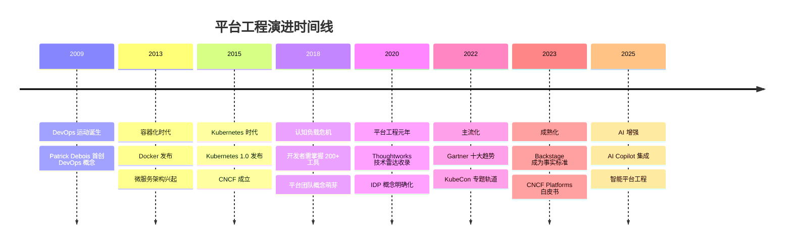

## 1.3 核心驱动力

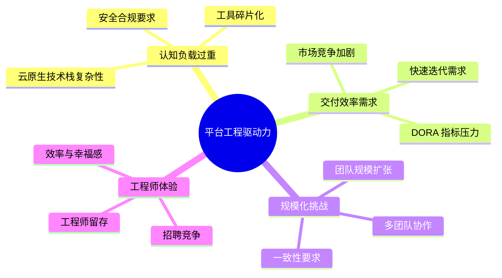

---

<!-- chunk: 2. Gartner 技术趋势分析 -->## 2. Gartner 技术趋势分析

## 2.1 Gartner 平台工程预测

Gartner 在其重要报告中对平台工程做出了多项关键预测：

| 年份 | 预测内容 | 状态 |
|------|----------|------|
| 2023 | 80% 的大型软件工程组织将建立平台工程团队 (预测至2026) | 进行中 |
| 2023 | 平台工程将提高开发者生产力 75% | 部分验证 |
| 2024 | 60% 的企业将构建正式的内部开发者平台 | 进行中 |
| 2025 | AI 辅助平台工程将成为主流实践 | 新兴趋势 |

## 2.2 Gartner 技术成熟度曲线位置

```
期望膨胀 ↑
         |                    ★ 平台工程 (2024)
         |                  /
         |                /
         |              /
         |    ★(2022) /
         |           /\
         |          /  \
期望值   |         /    \        /‾‾‾‾‾‾‾‾‾‾‾‾
         |        /      \      /
         |       /        \    /
         |      /          \  /
─────────┼─────────────────────────────────────→ 时间
         萌芽期  期望膨胀期  幻灭期  复苏期  成熟期
```

## 2.3 市场数据与投资趋势

**2024 年平台工程市场报告关键数据**：

```yaml
# 市场规模
market_size_2024: "$8.2B USD"
market_size_2028_forecast: "$18.5B USD"
cagr: "22.5%"

# 采用率
enterprises_with_platform_team: "45%"
enterprises_planning_platform_team: "32%"
no_plans: "23%"

# ROI 数据
average_deployment_frequency_improvement: "73%"
lead_time_reduction: "60%"
incident_recovery_improvement: "55%"
developer_satisfaction_increase: "40%"

# 工具采用率
backstage: "35%"
custom_built: "28%"
port: "12%"
cortex: "8%"
other: "17%"
```

---

<!-- chunk: 3. 平台工程 vs DevOps vs SRE -->## 3. 平台工程 vs DevOps vs SRE

## 3.1 三者关系辨析

这三个概念经常被混淆，但它们各有侧重：

```mermaid
venn
    title 平台工程、DevOps、SRE 关系图
    "DevOps" : 文化与实践
    "SRE" : 可靠性工程
    "Platform Engineering" : 产品化平台
    "DevOps & Platform" : 自动化流水线
    "SRE & Platform" : 可观测性工具
    "All" : 持续改进
```

| 维度 | DevOps | SRE | 平台工程 |
|------|--------|-----|----------|
| **本质** | 文化运动与实践 | 工程化运维方法 | 产品化内部平台 |
| **起源** | 2009年，社区驱动 | Google 内部实践 | 2019年后，工业界 |
| **核心关注** | 协作与沟通 | 系统可靠性 | 开发者体验 |
| **主要输出** | CI/CD 流水线 | SLO/SLA/SLI | 内部开发者平台 |
| **客户** | 整个组织 | 服务用户 | 内部开发团队 |
| **成功指标** | DORA 四关键指标 | 错误预算 | SPACE 指标 |
| **思维方式** | 文化变革 | 软件工程解决运维 | 产品思维 |

## 3.2 DORA 四关键指标

DevOps Research and Assessment (DORA) 定义了衡量软件交付性能的四个核心指标：

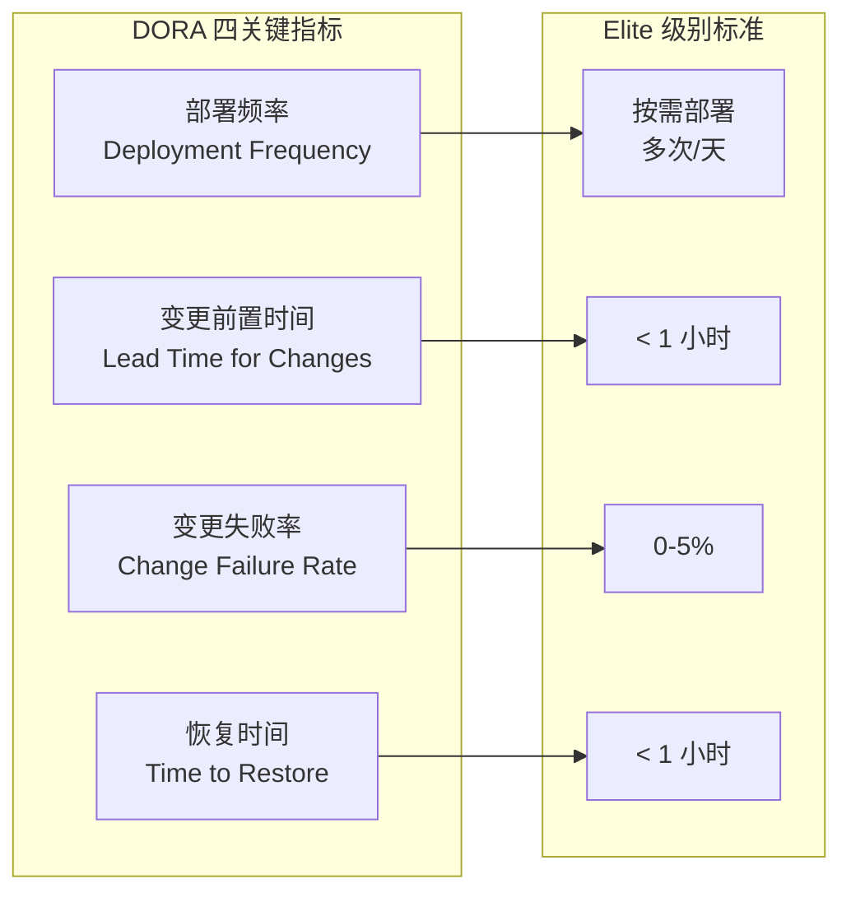

**平台工程对 DORA 指标的影响**：

```
指标改善对比（有平台 vs 无平台）
                    
部署频率    ████████████████████ 5x提升
变更前置时间 ████████████ 60%缩短
变更失败率  ██████████ 40%降低
恢复时间    ████████████████ 55%缩短
```

## 3.3 平台工程与 DevOps 的互补关系

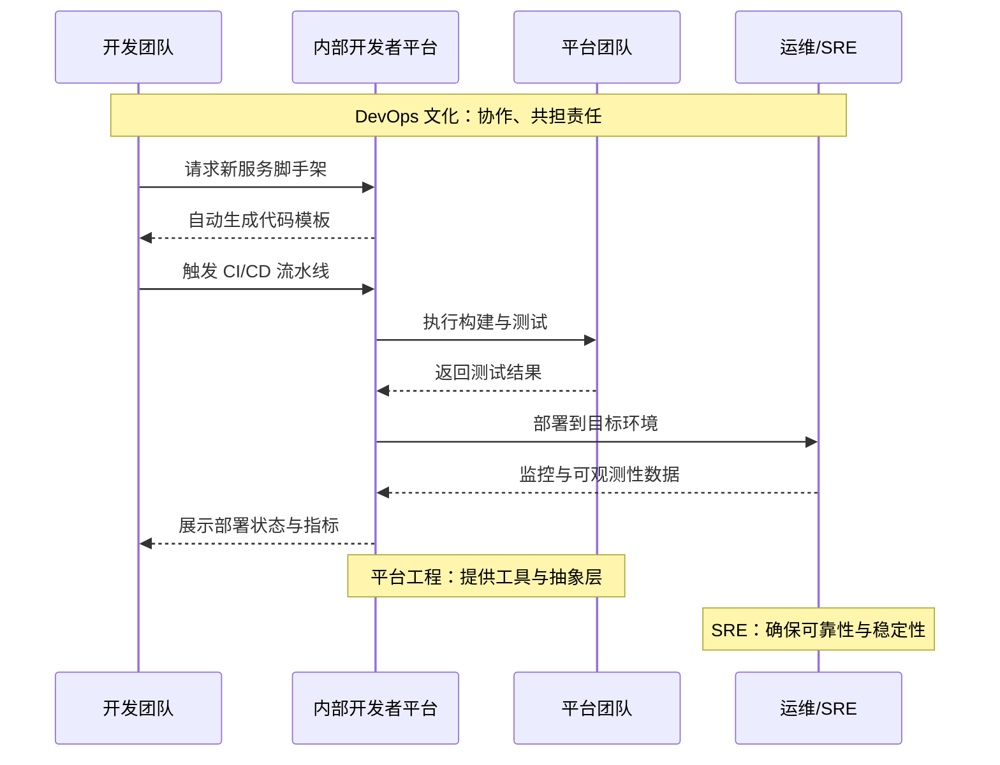

---

<!-- chunk: 4. 内部开发者平台 (IDP) 核心概念 -->## 4. 内部开发者平台 (IDP) 核心概念

## 4.1 IDP 定义

**内部开发者平台 (Internal Developer Platform, IDP)** 是由平台工程团队构建并运营的一套自助式工具集合，使开发团队能够在不需要运维专家介入的情况下，独立完成应用全生命周期管理。

> **重要区分**：
> - **IDP** (Internal Developer Platform) = 技术平台本身
> - **IDP Portal** (Internal Developer Portal) = 面向开发者的 UI 入口（如 Backstage）
> - 两者常被混淆，但含义不同

## 4.2 IDP 五大核心组件

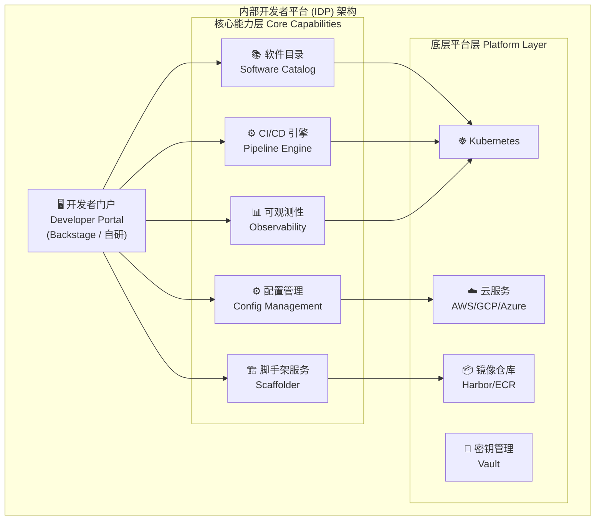

## 4.3 IDP 核心能力矩阵

| 能力域 | 功能描述 | 典型工具 | 自助化程度 |
|--------|----------|----------|-----------|
| **应用脚手架** | 新服务/项目模板生成 | Backstage Scaffolder | 100% 自助 |
| **CI/CD 流水线** | 构建、测试、部署自动化 | GitHub Actions, Tekton | 80% 自助 |
| **环境管理** | Dev/Staging/Prod 环境配置 | [[Crossplane|Crossplane]], Terraform | 70% 自助 |
| **服务目录** | 服务注册、发现、文档 | Backstage Catalog | 100% 自助 |
| **监控告警** | 指标、日志、追踪 | Prometheus, Grafana | 90% 自助 |
| **密钥管理** | 证书、密码、API Key | Vault, External Secrets | 85% 自助 |
| **合规安全** | 镜像扫描、策略执行 | OPA, Trivy | 自动化 |
| **成本管理** | 资源用量、成本分摊 | Kubecost, CloudHealth | 90% 可见 |

## 4.4 黄金路径 (Golden Path) 概念

**黄金路径**是由平台团队预先设计、经过验证的最优实践路径，开发者通过遵循黄金路径可以快速、安全地完成常见任务。

```
黄金路径 vs 自由路径

黄金路径 (Golden Path)                自由路径 (Paved Road)
─────────────────────                ──────────────────────
✅ 预置安全配置                        ⚠️  需要手动配置安全
✅ 内置合规检查                        ⚠️  自行确保合规
✅ 集成监控告警                        ⚠️  自行集成监控
✅ 标准化部署流程                       ⚠️  自定义部署流程
✅ 开箱即用文档                        ⚠️  自行编写文档
✅ 30 分钟上线新服务                   ⏰ 2-3 天上线新服务

推荐使用场景: 标准微服务、API 服务      适用场景: 特殊业务需求
```

---

<!-- chunk: 5. 平台成熟度模型 L1-L4 -->## 5. 平台成熟度模型 L1-L4

## 5.1 成熟度模型概览

平台工程成熟度模型 (Platform Engineering Maturity Model) 将组织的平台能力分为四个级别：

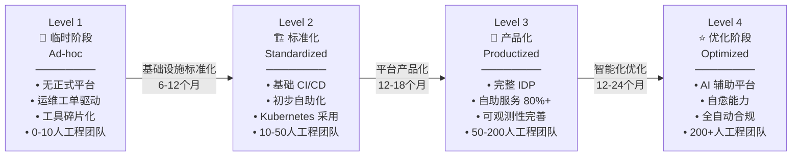

## 5.2 Level 1：临时阶段 (Ad-hoc)

**特征描述**：
- 没有专门的平台团队
- 开发者直接操作基础设施
- 每个项目有自己的工具链和部署方式
- 大量手动操作，容易出错
- 知识孤岛严重

**典型痛点**：
```yaml
# Level 1 组织的典型状态
pain_points:
  - "部署一个新服务需要 3-5 天，涉及 5-8 个团队协作"
  - "没有统一的监控，问题发现依赖用户反馈"
  - "每个团队 Dockerfile 写法不同，安全漏洞频发"
  - "环境配置靠口口相传，无文档"
  - "新员工 onboarding 需要 2-4 周才能独立部署"

metrics:
  deployment_frequency: "每月 1-2 次"
  lead_time: "1-4 周"
  change_failure_rate: "> 30%"
  mttr: "> 1 天"
  developer_satisfaction: "低"
```

**改进行动**：
1. 成立虚拟平台工作组（兼职）
2. 标准化基础工具选择（代码仓库、CI/CD）
3. 文档化现有流程
4. 识别最高价值自动化机会

## 5.3 Level 2：标准化阶段 (Standardized)

**特征描述**：
- 建立了基础的 CI/CD 流水线
- Kubernetes 开始被采用
- 有初步的平台意识但尚未正式化
- 部分自助化能力
- 工具选型开始统一

**典型技术栈**：
```yaml
# Level 2 典型技术栈
infrastructure:
  container_platform: "Kubernetes (单集群)"
  ci_cd: "GitLab CI 或 GitHub Actions"
  container_registry: "Harbor 或 ECR"
  
observability:
  metrics: "Prometheus + Grafana (基础)"
  logging: "EFK Stack (基础)"
  alerting: "AlertManager"

developer_experience:
  onboarding_time: "1-2 周"
  self_service_rate: "20-40%"
  documentation: "Wiki (部分过时)"
  
metrics:
  deployment_frequency: "每周 1-2 次"
  lead_time: "1-5 天"
  change_failure_rate: "15-25%"
  mttr: "2-8 小时"
```

**Level 2 → Level 3 跃升要素**：
- 成立专职平台团队
- 将 IDP 作为内部产品运营
- 建立开发者反馈机制
- 统一技术标准

## 5.4 Level 3：产品化阶段 (Productized)

**特征描述**：
- 专职平台团队（平台即产品）
- 完整的 IDP 门户（通常基于 Backstage）
- 80%+ 操作可以自助完成
- 完善的可观测性体系
- 标准化的黄金路径

**Level 3 能力全景**：

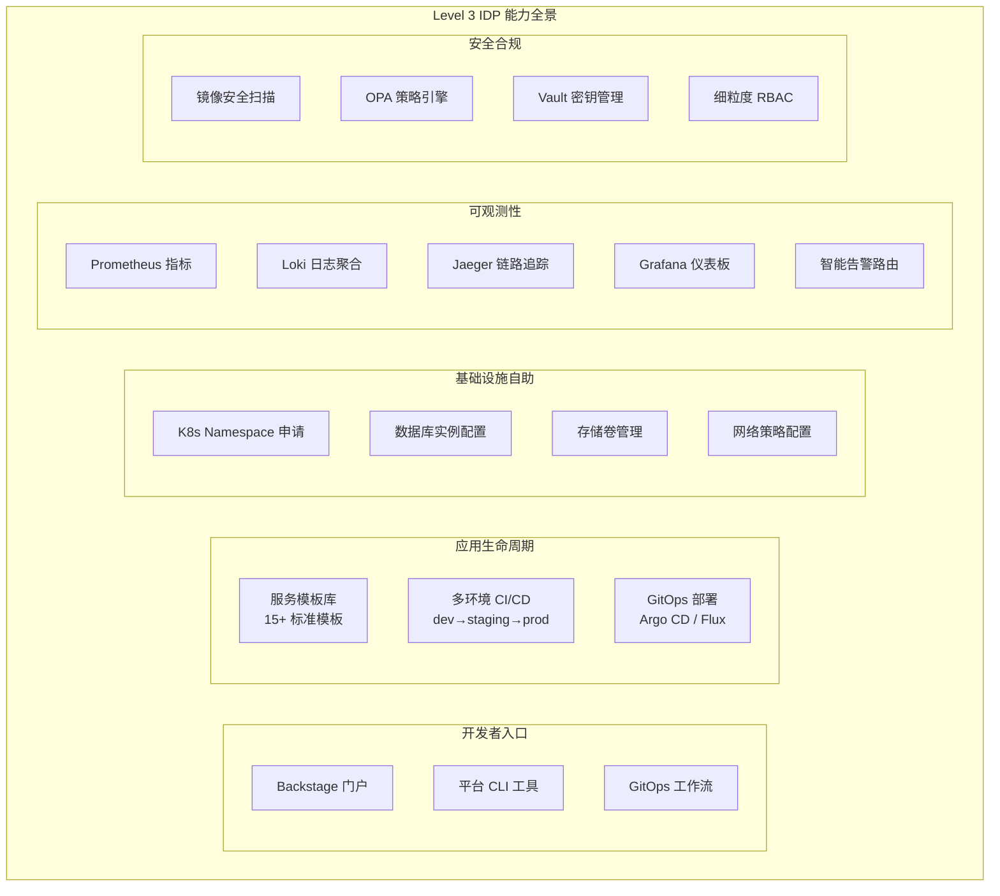

**典型指标**：
```yaml
metrics:
  deployment_frequency: "每天多次"
  lead_time: "< 1 小时"
  change_failure_rate: "5-10%"
  mttr: "< 30 分钟"
  developer_satisfaction: "4.2/5.0"
  self_service_rate: "80-90%"
  new_service_onboarding: "< 30 分钟"
  platform_team_to_dev_ratio: "1:15 到 1:25"
```

## 5.5 Level 4：优化阶段 (Optimized)

**特征描述**：
- AI 辅助的平台能力
- 自愈和自优化系统
- 全自动合规即代码
- 预测性扩缩容
- 成本智能优化

**Level 4 创新能力**：

```yaml
# Level 4 标志性能力
ai_capabilities:
  - "AI 代码审查集成到 PR 流程"
  - "自然语言创建基础设施资源"
  - "AI 根因分析与自动修复"
  - "智能容量规划预测"

self_healing:
  - "自动检测和修复配置漂移"
  - "智能金丝雀发布决策"
  - "自动回滚机制"
  - "混沌工程自动注入与验证"

compliance_automation:
  - "策略即代码覆盖率 > 95%"
  - "自动化合规报告生成"
  - "零信任安全自动化"
  - "供应链安全 SBOM 自动化"

metrics:
  deployment_frequency: "按需，多次/小时"
  lead_time: "< 15 分钟"
  change_failure_rate: "< 2%"
  mttr: "< 5 分钟（自愈）"
  developer_satisfaction: "4.7/5.0+"
  platform_roi: "> 500%"
```

## 5.6 成熟度自评工具

使用以下评分卡评估您组织的平台成熟度：

```
平台工程成熟度自评卡 (1-4分制)

维度                        1分        2分        3分        4分
────────────────────────────────────────────────────────────────
1. 平台团队建设
   - 是否有专职平台团队      ○无       ○兼职      ○专职小团队  ○完整产品团队
   
2. 自助化程度
   - 开发者自助操作比例      ○<20%     ○20-50%    ○50-80%    ○>80%

3. CI/CD 标准化
   - 流水线标准化程度        ○各自为政  ○部分统一   ○基本统一   ○完全标准化

4. 可观测性完善度
   - 监控覆盖与告警质量      ○基本没有  ○基础监控   ○完善体系   ○AI增强

5. 安全合规自动化
   - 安全策略自动化程度      ○手动检查  ○部分自动   ○大部分自动  ○全自动

6. 开发者体验
   - 新服务上线时间          ○>1周     ○1-3天     ○<1天      ○<1小时

7. 文档与知识管理
   - 文档完整性与可用性      ○严重缺乏  ○部分存在   ○较完整     ○持续更新

8. 成本可见性
   - 资源成本可见与优化      ○不可见    ○部分可见   ○完全可见   ○自动优化

评分解读:
8-12分  → Level 1 (临时阶段)
13-19分 → Level 2 (标准化阶段)
20-26分 → Level 3 (产品化阶段)
27-32分 → Level 4 (优化阶段)
```

---

<!-- chunk: 6. 组织结构与团队拓扑 -->## 6. 组织结构与团队拓扑

## 6.1 团队拓扑模型

Matthew Skelton 和 Manuel Pais 在《Team Topologies》中提出的四种团队类型对平台工程有重要指导意义：

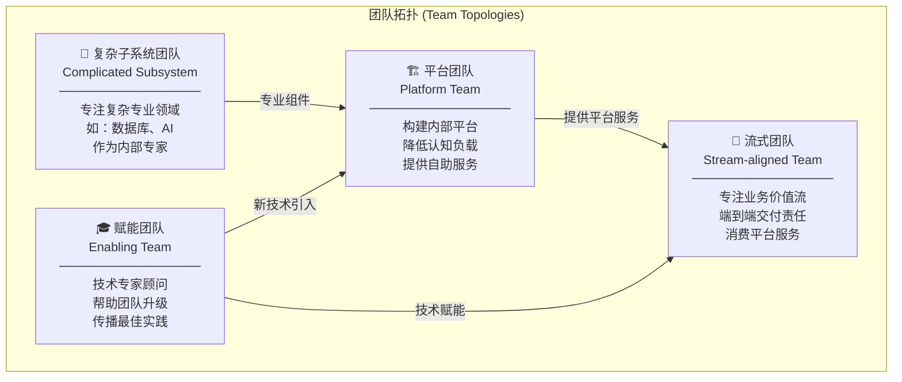

## 6.2 平台团队内部结构

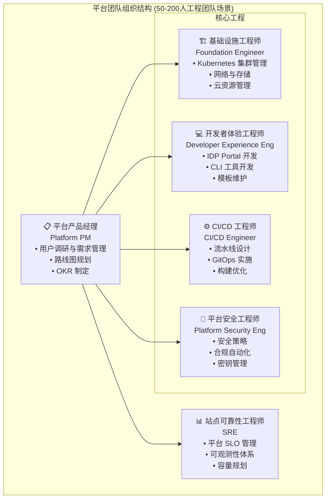

## 6.3 平台团队规模参考

| 工程师总数 | 平台团队规模 | 团队比例 | 重点 |
|-----------|------------|---------|------|
| < 20 人 | 0-1 人 (兼职) | 5% | 基础 CI/CD 标准化 |
| 20-50 人 | 2-4 人 | 8-10% | 建立核心 IDP |
| 50-150 人 | 5-10 人 | 7-8% | 完整 IDP + 自助化 |
| 150-500 人 | 10-20 人 | 5-6% | 平台产品化 |
| > 500 人 | 20-50 人 | 4-5% | 多产品线平台 |

## 6.4 平台团队与开发团队协作模式

**协作契约 (Platform Contract)**：

```yaml
# platform-contract.yaml
# 平台团队与业务团队的服务契约

platform_team_responsibilities:
  提供:
    - "Kubernetes 集群：99.95% SLA"
    - "CI/CD 流水线：构建时间 < 10 分钟"
    - "监控告警：告警响应 < 5 分钟"
    - "密钥管理：99.99% 可用性"
    - "新服务模板：覆盖 90% 常见场景"
  
  不承担:
    - "业务逻辑代码质量"
    - "应用级别的 SLA"
    - "业务特定的自动化需求"

developer_team_responsibilities:
  负责:
    - "遵循平台标准（使用 Golden Path）"
    - "维护应用级别 Dockerfile 和 K8s 配置"
    - "参与平台反馈（季度调研）"
    - "及时升级平台推荐版本"
  
  有权:
    - "提出平台功能需求"
    - "偏离标准路径（需申请豁免）"
    - "参与平台架构设计评审"

escalation_process:
  - level: "L1"
    owner: "开发团队自助处理"
    sla: "自助解决"
  - level: "L2"
    owner: "平台团队 oncall"
    sla: "< 4 小时响应"
  - level: "L3"
    owner: "平台团队 + 管理层"
    sla: "< 1 小时响应"
```

## 6.5 认知负载管理

平台工程的核心价值之一是**降低开发者认知负载**：

```
# 🟢 低风险：只读/信息收集，通常无副作用
认知负载类型 (John Sweller 认知负载理论)

内在认知负载 (Intrinsic Load)     - 任务本身的复杂性（业务逻辑）
                                    平台无法减少，需要开发者掌握

外在认知负载 (Extraneous Load)    - 非必要的复杂性（工具、流程）
                                    ✅ 平台工程的主要优化目标！

关联认知负载 (Germane Load)       - 建立新知识的努力（学习新技能）
                                    平台提供良好的学习路径

典型外在认知负载项目 (平台工程优化前后对比):
───────────────────────────────────────────────
优化前 (每个开发者需要掌握):
  ❌ Dockerfile 最佳实践
  ❌ Kubernetes YAML 编写
  ❌ Helm Chart 开发
  ❌ Terraform 模块开发
  ❌ Prometheus 指标配置
  ❌ AlertManager 规则编写
  ❌ CI/CD 流水线脚本
  ❌ Vault 密钥注入配置
  认知负载: 极高 ████████████████████

优化后 (开发者只需关注):
  ✅ 选择正确的服务模板
  ✅ 配置业务相关参数
  ✅ 编写业务逻辑代码
  认知负载: 正常 ██████
```
---

<!-- chunk: 7. 平台产品化思维 -->## 7. 平台产品化思维

## 7.1 为什么要将平台视为产品？

传统的平台团队往往将自己定位为"内部 IT 团队"，提供的是**服务**而非**产品**。这两种定位有本质区别：

| 维度 | 平台作为服务 | 平台作为产品 |
|------|------------|------------|
| **用户关系** | 内部客户，被动响应 | 用户，主动关注体验 |
| **需求来源** | 工单/会议 | 用户研究、数据分析 |
| **交付方式** | 项目制，有始有终 | 持续迭代，版本化 |
| **成功衡量** | 任务完成 | 用户满意度、采用率 |
| **路线图** | 无或不透明 | 公开、透明、可预期 |
| **反馈机制** | 被动收集 | 主动建立反馈循环 |

## 7.2 平台产品管理框架

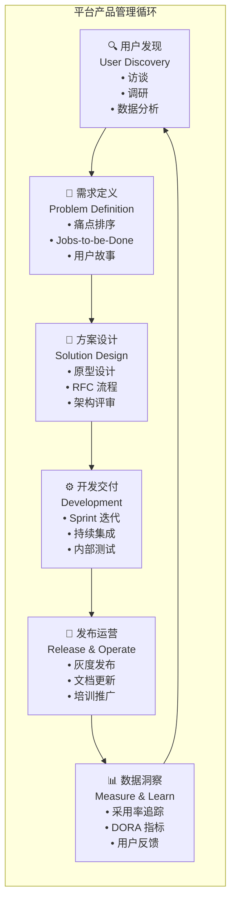

## 7.3 用户研究方法论

**平台工程师必须成为用户研究者**：

```python
# 平台用户研究框架示例

user_research_methods = {
    "定量研究": {
        "平台使用数据": [
            "Portal 页面访问量",
            "自助操作完成率",
            "模板使用频率",
            "流水线成功率"
        ],
        "效率指标": [
            "新服务上线时间",
            "部署频率",
            "MTTR",
            "变更前置时间"
        ]
    },
    "定性研究": {
        "用户访谈": "每季度，样本量 10-15 人",
        "焦点小组": "每半年，新功能评估",
        "影子研究": "观察开发者实际使用场景",
        "NPS 调研": "每季度发送净推荐分调研"
    },
    "反馈渠道": {
        "Slack 频道": "#platform-feedback",
        "GitHub Issues": "公开需求追踪",
        "季度满意度调研": "标准化问卷",
        "Platform Office Hours": "每周一小时开放答疑"
    }
}
```

## 7.4 平台产品路线图示例

```
平台工程产品路线图 (示例: 12个月)
══════════════════════════════════════════════════════════════

Q1 2026: 基础夯实
├── ✅ 统一 CI/CD 流水线标准 (完成)
├── 🔄 Backstage 门户 v1.0 上线 (进行中)
└── 📅 服务模板库：10 个核心模板 (计划)

Q2 2026: 自助化提升
├── 📅 环境自助申请功能
├── 📅 数据库实例自助配置
├── 📅 密钥管理 UI 集成
└── 📅 成本可见性仪表板

Q3 2026: 智能化提升
├── 📅 AI 辅助 Code Review
├── 📅 智能告警降噪
├── 📅 自动化安全扫描与修复建议
└── 📅 容量预测与成本优化

Q4 2026: 平台成熟化
├── 📅 多集群/多云支持
├── 📅 平台 API 开放接口
├── 📅 第三方工具集成生态
└── 📅 平台文档中心 2.0
```

---

<!-- chunk: 8. 成功指标与 KPI 体系 -->## 8. 成功指标与 KPI 体系

## 8.1 SPACE 指标框架

SPACE 是专为开发者生产力设计的指标框架，比单纯追踪代码产出更全面：

```
SPACE 框架
══════════

S - Satisfaction & Wellbeing (满意度与幸福感)
    衡量: NPS 分数, 调研满意度
    目标: NPS > 40, 满意度 > 4.0/5.0

P - Performance (性能与结果)
    衡量: 交付质量、系统可靠性
    目标: 变更失败率 < 5%, P99 响应时间达标

A - Activity (活动与产出)
    衡量: 部署次数, PR 合并数
    目标: 部署频率 > 每天 1 次/团队

C - Communication & Collaboration (沟通与协作)
    衡量: 跨团队依赖, PR 审查周期
    目标: PR 平均审查时间 < 4 小时

E - Efficiency & Flow (效率与心流)
    衡量: 流程中断次数, 等待时间
    目标: 无障碍工作时间 > 70%
```

## 8.2 平台 KPI 仪表板

```yaml
# platform-kpis.yaml
# 平台工程团队核心 KPI 体系

platform_health_kpis:
  availability:
    - name: "平台 Portal 可用性"
      target: "> 99.9%"
      current: "99.95%"
      trend: "稳定"
    - name: "CI/CD 平台可用性"
      target: "> 99.5%"
      current: "99.7%"
      trend: "改善"
  
  performance:
    - name: "平均构建时间"
      target: "< 8 分钟"
      current: "6.5 分钟"
      trend: "改善"
    - name: "流水线成功率"
      target: "> 90%"
      current: "87%"
      trend: "需关注"

developer_experience_kpis:
  adoption:
    - name: "IDP 月活跃用户"
      target: "> 80% 工程师"
      current: "72%"
      trend: "增长"
    - name: "黄金路径采用率"
      target: "> 70% 新服务"
      current: "65%"
      trend: "增长"
  
  efficiency:
    - name: "新服务上线时间"
      target: "< 30 分钟"
      current: "45 分钟"
      trend: "改善中"
    - name: "开发者等待时间"
      target: "< 10 分钟/天"
      current: "25 分钟/天"
      trend: "需优化"

delivery_kpis:
  dora_metrics:
    - name: "部署频率"
      target: "每天多次"
      current: "每天 2-3 次"
      trend: "达标"
    - name: "变更前置时间"
      target: "< 1 小时"
      current: "2.5 小时"
      trend: "改善中"
    - name: "变更失败率"
      target: "< 5%"
      current: "8%"
      trend: "需改善"
    - name: "MTTR"
      target: "< 30 分钟"
      current: "45 分钟"
      trend: "改善中"

business_kpis:
  - name: "平台 ROI"
    calculation: "(节省时间 × 工程师时薪) / 平台投入"
    target: "> 300%"
    current: "420%"
  - name: "工程师满意度"
    target: "NPS > 40"
    current: "NPS = 38"
    trend: "接近达标"
```

## 8.3 ROI 计算模型

```
平台工程 ROI 计算示例

假设条件:
- 工程师总数: 100 人
- 平均时薪: $80/小时
- 平台团队规模: 6 人
- 平台团队年成本: $900,000

节省时间估算 (年):
┌──────────────────────────────────────────────────────────┐
│ 节省项目              每人/周节省   年节省总时间   节省价值  │
│──────────────────────────────────────────────────────────│
│ 减少环境配置等待      3 小时       15,600h       $1.25M   │
│ 标准化 CI/CD         1.5 小时     7,800h        $624K    │
│ 自动化文档           1 小时       5,200h        $416K    │
│ 减少生产问题修复      2 小时       10,400h       $832K    │
│ 减少 onboarding 时间 4 小时/新人  2,000h        $160K    │
│──────────────────────────────────────────────────────────│
│ 总节省                            41,000h       $3.28M   │
└──────────────────────────────────────────────────────────┘

ROI = ($3.28M - $0.9M) / $0.9M × 100% = 264%

注: 未计算因质量提升、安全加固带来的额外价值
```

---

<!-- chunk: 9. 平台工程工具链全景 -->## 9. 平台工程工具链全景

## 9.1 CNCF 平台工程工具全景

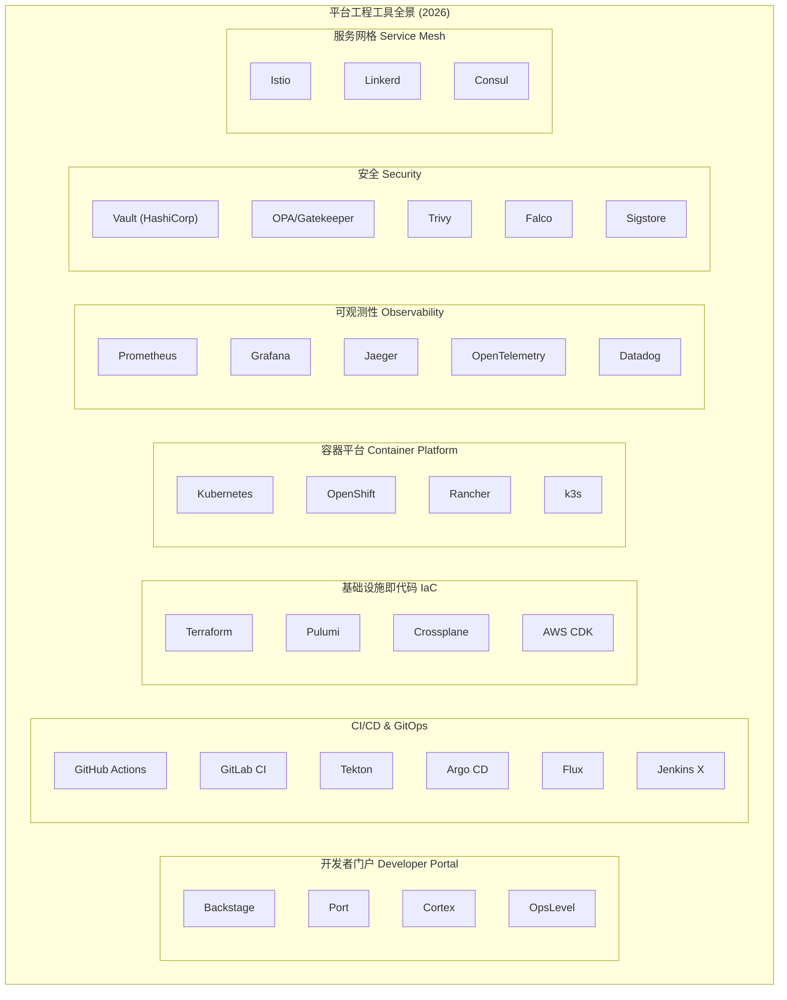

## 9.2 工具选型决策矩阵

```yaml
# 平台工具选型指南

developer_portal:
  backstage:
    pros: "开源、插件生态丰富、Spotify 出品、CNCF 毕业项目"
    cons: "需要自己运营、前期配置复杂"
    best_for: "有工程能力的中大型团队"
    cost: "免费 (开源)"
  port:
    pros: "SaaS 产品、快速上手、无运维负担"
    cons: "收费、定制化受限"
    best_for: "快速启动、小型团队"
    cost: "$500-2000/月"

cicd_platform:
  github_actions:
    pros: "与 GitHub 无缝集成、生态丰富、按需付费"
    cons: "厂商锁定、私有 Runner 成本"
    best_for: "使用 GitHub 的团队"
  tekton:
    pros: "云原生、Kubernetes 原生、开源"
    cons: "学习曲线陡峭、UI 较弱"
    best_for: "需要完全控制的团队"
  gitlab_ci:
    pros: "与 GitLab 深度集成、功能全面"
    cons: "厂商绑定"
    best_for: "使用 GitLab 的团队"

gitops:
  argocd:
    pros: "UI 友好、功能丰富、社区活跃"
    cons: "资源占用较大"
    best_for: "需要可视化的团队"
  flux:
    pros: "轻量级、GitOps Toolkit 灵活"
    cons: "UI 较弱"
    best_for: "偏好 CLI 的团队"

iac:
  terraform:
    pros: "成熟稳定、provider 生态庞大"
    cons: "HCL 语言、状态管理复杂"
    best_for: "传统云资源管理"
  crossplane:
    pros: "Kubernetes 原生、控制循环模型"
    cons: "学习曲线、社区相对小"
    best_for: "纯 Kubernetes 环境"
  pulumi:
    pros: "使用通用编程语言（Python/TypeScript）"
    cons: "相对新、社区小"
    best_for: "开发者友好的 IaC"
```

---

<!-- chunk: 10. 实施路线图与最佳实践 -->## 10. 实施路线图与最佳实践

## 10.1 90 天快速启动计划

```
平台工程 90 天快速启动

Day 1-30: 基础建设
─────────────────
Week 1: 现状评估
  □ 工程调研（访谈 10+ 开发者）
  □ 识别最大痛点（Top 5 列表）
  □ 评估现有工具栈
  □ 确定平台团队成员

Week 2-3: 核心基础
  □ 统一代码仓库（GitHub/GitLab）
  □ 建立基础 CI/CD 模板
  □ 标准化 Dockerfile 模板
  □ 搭建基础监控（Prometheus + Grafana）

Week 4: 反馈与调整
  □ Demo Day: 展示已有改进
  □ 收集反馈
  □ 调整优先级

Day 31-60: 平台核心
─────────────────
Week 5-6: IDP 骨架
  □ 部署 Backstage（基础版）
  □ 导入现有服务到软件目录
  □ 创建第一个服务模板

Week 7-8: 自动化提升
  □ 接入 GitOps (Argo CD)
  □ 实现环境自助申请
  □ 集成密钥管理 (Vault)

Day 61-90: 体验打磨
─────────────────
Week 9-10: 开发者体验
  □ 完善 Backstage 文档集成
  □ 添加 3-5 个常用模板
  □ 培训推广（Lunch & Learn）

Week 11-12: 度量与优化
  □ 建立 DORA 指标仪表板
  □ 第一次 NPS 调研
  □ 发布 90 天总结报告
  □ 制定下一阶段路线图
```

## 10.2 平台工程十大最佳实践

```
01. 从用户研究开始，不要假设需求
    ─────────────────────────────
    ✅ 访谈开发者，了解真实痛点
    ❌ 直接开始构建酷炫技术

02. 小步快跑，频繁交付价值
    ─────────────────────────
    ✅ 2 周 Sprint，每次交付可用功能
    ❌ 3 个月大项目，一次性上线

03. 黄金路径要足够简单
    ────────────────────
    ✅ 5 分钟能完成新服务创建
    ❌ 需要看 50 页文档才能开始

04. 不强制，提供激励
    ──────────────────
    ✅ 让黄金路径成为最省力的选择
    ❌ 通过规定强制要求使用平台

05. 度量开发者体验，不只度量技术指标
    ──────────────────────────────────
    ✅ NPS + DORA + SPACE 综合衡量
    ❌ 只关注集群健康和流水线速度

06. 文档是平台的一等公民
    ──────────────────────
    ✅ 文档与代码同步更新
    ❌ "我们之后会补文档的"

07. 建立明确的支持渠道
    ────────────────────
    ✅ Slack + Office Hours + Issue Tracker
    ❌ 开发者找不到地方寻求帮助

08. 版本化平台组件
    ────────────────
    ✅ 语义化版本 + 变更日志 + 迁移指南
    ❌ 悄悄更新，让开发者踩雷

09. 安全左移，内置而非外加
    ──────────────────────
    ✅ 安全扫描集成到 CI 流水线
    ❌ 生产前最后一步检查安全

10. 庆祝并宣传平台的影响
    ──────────────────────
    ✅ 量化节省时间，在全员会议分享
    ❌ 默默工作，没人知道价值
```

---

<!-- chunk: 11. 常见反模式与规避策略 -->## 11. 常见反模式与规避策略

## 11.1 平台工程反模式汇总

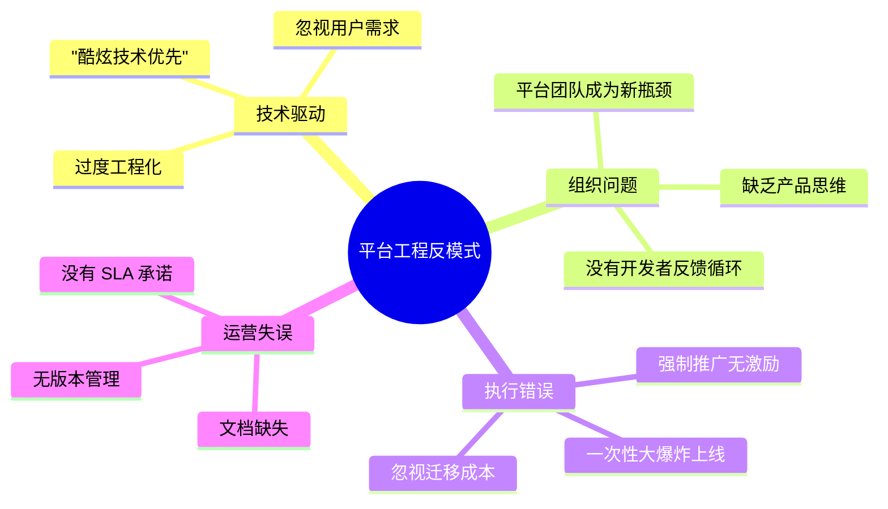

## 11.2 关键反模式详解

**反模式 1：平台工程师的"象牙塔"**

```
问题描述:
  平台团队与开发团队脱节，构建"完美"的技术方案
  但开发者不愿使用，因为太复杂或不符合实际需求。

典型症状:
  - "我们花了 6 个月构建，但只有 20% 的团队在用"
  - 开发者绕过平台，自己搭解决方案
  - 平台迭代不考虑用户反馈

规避策略:
  ✅ 每个功能发布前做用户测试
  ✅ 平台工程师定期嵌入开发团队（每季度 1-2 周）
  ✅ 建立外部使用指标，追踪真实采用情况
```

**反模式 2：平台成为新的"批准门"**

```
问题描述:
  原本通过工单向运维申请资源，现在变成通过平台等待审批。
  工单系统换了个名字，但本质没变。

典型症状:
  - 申请新环境仍需等待 1-2 天
  - 平台每个操作都需要人工审核
  - "自助化"实际上是"先自助提交申请"

规避策略:
  ✅ 默认允许（Default Allow），只在边界做控制
  ✅ 自助操作 < 5 分钟，无需人工介入
  ✅ 审批流仅用于高风险操作（如生产配置变更）
```

**反模式 3：一次性大爆炸发布**

```
问题描述:
  平台团队工作 6 个月，发布一个"完整"的 IDP v1.0
  但上线后发现很多假设是错误的，需要大量重构。

典型症状:
  - 开发了很多功能但使用率低
  - 上线后大量 Bug 和体验问题
  - 开发者第一印象不好，形成负面认知

规避策略:
  ✅ MVP (最小可行产品) 思维，3-4 周上线核心功能
  ✅ 每 2 周发布一个小版本
  ✅ 内部 Beta 用户计划，提前找 3-5 个团队试用
```

**反模式 4：度量产出，忽视结果**

```
问题描述:
  平台团队的 KPI 是"发布了多少功能"、"修复了多少 Bug"
  而不是"开发者体验是否改善"、"交付效率是否提升"

典型症状:
  - 功能越来越多，开发者反而更困惑
  - DORA 指标没有改善
  - 开发者调研分数持续下降

规避策略:
  ✅ 以 DORA 指标和开发者 NPS 为北极星指标
  ✅ 功能发布前定义成功标准和度量方式
  ✅ 定期 OKR 回顾，关注结果而非输出
```

---

<!-- chunk: 12. 案例研究 -->## 12. 案例研究

## 12.1 Netflix：Paved Road 先驱

Netflix 是最早系统实践平台工程理念的公司之一：

**背景**：
- 2012 年开始大规模迁移到 AWS
- 数百个微服务，数千名工程师
- 需要在自由与标准之间找平衡

**核心理念："Freedom and Responsibility"**：
```
Netflix 的平台工程哲学:
  
  "我们不强制使用标准工具，但我们让最佳实践
   成为最简单的路径。"
                    — Netflix 工程博客
  
核心实践:
  ✅ Paved Road: 推荐路径，不强制
  ✅ Hystrix (断路器): 内建弹性
  ✅ Spinnaker: 自研多云 CD 平台
  ✅ Conductor: 工作流编排平台
  
成果:
  - 数千次/天的部署频率
  - 99.99% 的可用性
  - 工程师可以专注于业务创新
```

## 12.2 Spotify：Backstage 的诞生

Spotify 开源了 Backstage，彻底改变了开发者门户领域：

**诞生背景（2016-2020）**：
```
Spotify 的痛点 (2016):
  ❌ 2000+ 服务，没有统一目录
  ❌ 每个团队自己维护文档（或不维护）
  ❌ 新员工需要 2-3 周才能找到所有相关服务
  ❌ 技术债务不可见

Backstage 的解决方案:
  ✅ 统一的软件目录：所有服务一处可见
  ✅ TechDocs：文档与代码同存储
  ✅ 插件生态：可扩展的工具集成
  ✅ Scaffolder：标准化新服务创建

2020 年开源后的影响:
  - 2000+ GitHub Stars 第一周
  - 现在有 100+ 社区插件
  - CNCF 毕业项目
  - 全球 2000+ 公司使用
```

## 12.3 Airbnb：基础设施产品化

```
Airbnb 平台工程演进:

2014-2018: 混沌期
  ❌ 200+ 内部服务，无统一管理
  ❌ 每个团队自建监控
  ❌ 部署流程多种多样

2019-2022: 标准化期
  ✅ OneClick: 统一部署平台
  ✅ Spade: 数据工具平台
  ✅ 统一可观测性栈

2022-至今: 产品化期
  ✅ 开发者 NPS: 从 28 提升到 52
  ✅ 部署频率: 3x 提升
  ✅ 平台投入 ROI: 350%+

关键经验:
  1. "开发者是我们的第一客户"成为团队 OKR
  2. 每季度举办 Developer Experience Week
  3. 平台 PM 职位与业务 PM 同等重要
```

---

<!-- chunk: 13. 未来趋势 -->## 13. 未来趋势

## 13.1 AI 辅助平台工程

2025-2026 年，AI 正在深刻改变平台工程的实践：

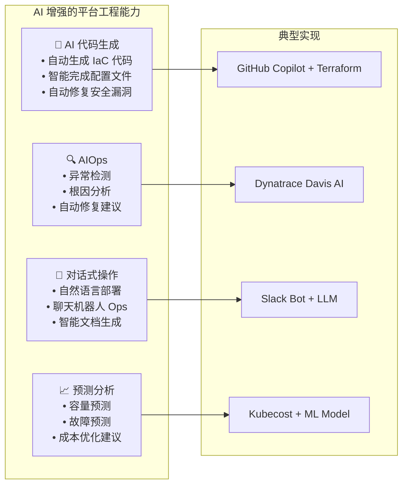

## 13.2 平台工程 2030 展望

```
未来 5 年平台工程演进预测

2026: AI Copilot 成为标配
  - 所有 CI/CD 流水线集成 AI 代码审查
  - 自然语言基础设施配置
  - 智能故障诊断

2027: 自主平台 (Autonomous Platform)
  - AI 自主优化部署策略
  - 预测性扩缩容
  - 零人工干预的安全合规

2028: 意图驱动平台 (Intent-Driven)
  - 开发者只需描述业务目标
  - 平台自动选择技术方案
  - 全自动 SLO 管理

2029-2030: 平台智能体 (Platform Agent)
  - AI 平台工程师自主工作
  - 人类平台工程师专注战略
  - 平台自我进化能力
```

## 13.3 平台工程师职业发展路径

```
平台工程师职业成长路径

Junior Platform Engineer (0-2年)
  └── 技能: K8s基础、CI/CD配置、脚本编写
  └── 专注: 维护现有平台、处理支持请求

Platform Engineer (2-4年)
  └── 技能: IaC、可观测性、安全实践
  └── 专注: 新功能开发、性能优化

Senior Platform Engineer (4-7年)
  └── 技能: 平台架构设计、跨团队协作
  └── 专注: 技术决策、标准制定

Staff/Principal Platform Engineer (7+年)
  └── 技能: 组织变革、产品思维
  └── 专注: 公司级平台战略

Engineering Manager / Director (管理路径)
  └── 技能: 团队管理、预算规划
  └── 专注: 团队建设、跨部门对齐
```

---

<!-- chunk: 总结 | Summary -->## 总结 | Summary

平台工程是现代软件工程组织应对规模化挑战的战略性答案。通过将内部开发者平台作为产品来运营，平台团队能够：

1. **降低认知负载**：让开发者专注于业务逻辑，而非基础设施细节
2. **提升交付效率**：通过标准化黄金路径，实现快速、安全的软件交付
3. **规模化最佳实践**：将安全、合规、可观测性内置到平台中
4. **改善工程师体验**：提高满意度，降低流失率，吸引优秀人才

**成熟度模型总结**：
- **L1 临时阶段**：识别痛点，成立虚拟工作组
- **L2 标准化阶段**：统一 CI/CD，引入 Kubernetes
- **L3 产品化阶段**：完整 IDP，80%+ 自助化
- **L4 优化阶段**：AI 辅助，自愈能力，全自动合规

---

<!-- chunk: 参考资料 | References -->## 参考资料 | References

1. [CNCF Platform Engineering White Paper](https://tag-app-delivery.cncf.io/whitepapers/platforms/)
2. [Gartner Top Strategic Technology Trends 2024](https://www.gartner.com/en/articles/gartner-top-10-strategic-technology-trends-for-2024)
3. [DORA State of DevOps Report 2024](https://dora.dev/research/)
4. [Team Topologies - Matthew Skelton & Manuel Pais](https://teamtopologies.com/)
5. [Backstage Documentation](https://backstage.io/docs)
6. [Internal Developer Platform Community](https://internaldeveloperplatform.org/)
7. [Platform Engineering Community](https://platformengineering.org/)
8. [SPACE Framework for Developer Productivity](https://queue.acm.org/detail.cfm?id=3454124)

---

*文档版本: v1.0 | 最后更新: 2026-03-04 | 作者: Platform Engineering Team*

---

<!-- chunk: Obsidian 相关文档 -->## Obsidian 相关文档

- domain-07-platform-engineering MOC
- [[domain-07-platform-engineering/README.md|Domain 07: 平台工程 (Platform Engineering)]]
- Domain-36 平台工程 — 开源项目索引
- 内部开发者平台设计原则
- Backstage 部署与配置
- Backstage 软件目录与 TechDocs
- Backstage 脚手架与模板系统
- Kratix 平台即代码 (Kratix Platform as Code)
- Crossplane 平台组合 (Crossplane Platform Composition)
- Golden Paths 黄金路径设计 (Golden Paths Design Patterns)
- 开发者体验度量 (Developer Experience Metrics)
- 平台团队拓扑与运营 (Platform Team Topology and Operations)

## See Also

- 11-vercel-frontend-deployment-platform
- 99-backstage-idp-guide
- 02-idp-design-principles
- 03-backstage-deployment


<!-- risk-assessed -->
