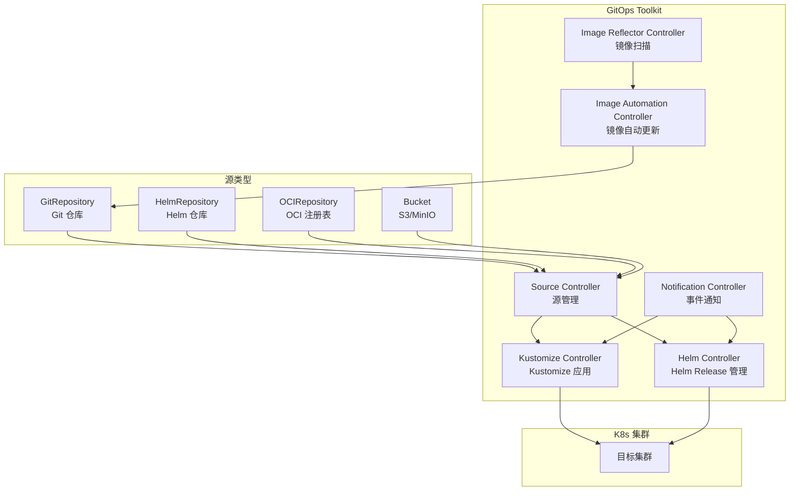

> **生产环境安全提示**
>
> 本文档包含可直接执行的运维命令。执行前请确认：当前目标集群与 Namespace 是否正确；是否具备足够的 RBAC 权限；是否已在非生产环境验证。命令风险等级标注：🔴 高风险（可能造成数据丢失或服务中断）、🟡 中风险（会修改集群状态，但通常可回滚）、🟢 低风险/只读（信息收集，无副作用）。


# [[Flux|Flux]] GitOps 实践指南

> **适用版本**: Flux v2.5 (Flux CD)
> **最后更新**: 2026-04-24
> **难度**: 中级 → 高级

---

<!-- chunk: 📋 目录 -->## 📋 目录

- [一、概述](#一概述)
- [二、架构设计](#二架构设计)
- [三、Bootstrap 部署](#三bootstrap-部署)
- [四、核心配置](#四核心配置)
- [五、安全与合规](#五安全与合规)
- [六、多环境管理策略](#六多环境管理策略)
- [七、监控与回滚](#七监控与回滚)
- [八、最佳实践](#八最佳实践)
- [九、故障排查](#九故障排查)

---

<!-- chunk: 一、概述 -->## 一、概述

Flux v2 是 CNCF 毕业的 GitOps 持续交付工具，基于 GitOps Toolkit 构建。与 [[Argo|Argo]] CD 的集中式管理架构不同，Flux 采用分布式设计——每个 [[Kubernetes|Kubernetes]] 集群运行自己的 Flux 实例，Git 仓库就是唯一的控制平面。这种设计理念使得 Flux 更轻量、更适合"每集群自治"的多集群策略，也是 Kubernetes 原生 GitOps 的典范实现。

Flux 的核心优势包括：内置镜像自动更新（Image Automation）无需额外工具；原生支持 SOPS 加密文件解密；Notification Controller 提供灵活的事件通知；与 Terraform 的深度集成（tf-controller）；支持 OCI Registry 作为源；Helm Controller 原生管理 Helm Release 生命周期。

Weaveworks（Flux 创始公司）于 2024 年初倒闭后，Flux 已由 CNCF 社区接管维护。主要维护者来自 Akuity、ControlPlane、Microsoft 等公司，v2.5 为最新稳定版，路线图正常推进。社区建立了完善的治理模型（Steering Committee + Maintainer Team），CNCF 提供基础设施支持。

本指南覆盖 Flux 的安装部署、核心配置、多租户管理、镜像自动更新、通知告警、以及与 Terraform/Crossplane 的集成，帮助企业在 Kubernetes 生态中实施轻量级、声明式的 GitOps 交付流程。

---

<!-- chunk: 二、架构设计 -->## 二、架构设计

## 2.1 Flux 核心组件



## 2.2 组件职责

```
# 🟢 低风险：只读/信息收集，通常无副作用
Flux 核心组件
├── Source Controller
│   ├── GitRepository     ← 从 Git 拉取清单
│   ├── HelmRepository    ← 从 Helm repo 拉取 chart
│   ├── OCIRepository     ← 从 OCI registry 拉取
│   └── Bucket            ← 从 S3/MinIO 拉取
│
├── Kustomize Controller  ← 执行 kustomize build + apply
├── Helm Controller       ← 管理 HelmRelease 生命周期
├── Image Automation
│   ├── ImageRepository   ← 扫描镜像仓库 tag
│   ├── ImagePolicy       ← 定义更新策略 (semver)
│   └── ImageUpdateAutomation ← 自动提交 Git 更新
│
├── Notification Controller ← 事件 Webhook 通知
└── RBAC / ServiceAccount   ← 多租户权限隔离
```
---

<!-- chunk: 三、Bootstrap 部署 -->## 三、Bootstrap 部署

## 3.1 CLI 安装与初始化

```bash
# 安装 flux CLI
curl -s https://fluxcd.io/install.sh | sudo bash

# 验证集群兼容性
flux check --pre

# Bootstrap (GitHub 示例)
export GITHUB_TOKEN=<your-token>
export GITHUB_USER=<your-username>

flux bootstrap github \
  --owner=$GITHUB_USER \
  --repository=flux-gitops \
  --branch=main \
  --path=clusters/production \
  --personal \
  --components-extra=image-reflector-controller,image-automation-controller

# Bootstrap (GitLab 示例)
flux bootstrap gitlab \
  --owner=$GITLAB_GROUP \
  --repository=flux-gitops \
  --branch=main \
  --path=clusters/production \
  --token-auth

# 验证
flux check
flux get all -A
```

## 3.2 目录结构约定

```
flux-gitops/
├── clusters/
│   ├── production/
│   │   ├── flux-system/          # Flux 自身配置 (bootstrap 生成)
│   │   ├── infrastructure.yaml   # 基础设施 Kustomization
│   │   └── apps.yaml             # 应用 Kustomization
│   └── staging/
│       └── ...
├── infrastructure/
│   ├── base/
│   │   ├── ingress-nginx/
│   │   ├── cert-manager/
│   │   ├── monitoring/
│   │   └── kyverno/
│   └── production/
│       ├── kustomization.yaml
│       └── patches/
└── apps/
    ├── base/
    │   ├── frontend/
    │   └── backend/
    └── production/
        ├── kustomization.yaml
        └── patches/
```

---

<!-- chunk: 四、核心配置 -->## 四、核心配置

## 4.1 GitRepository

```yaml
apiVersion: source.toolkit.fluxcd.io/v1
kind: GitRepository
metadata:
  name: app-source
  namespace: flux-system
spec:
  interval: 1m
  url: https://github.com/org/app-manifests
  ref:
    branch: main
  secretRef:
    name: github-token
  ignore: |
    /docs/
    /tests/
```

## 4.2 Kustomization

```yaml
apiVersion: kustomize.toolkit.fluxcd.io/v1
kind: Kustomization
metadata:
  name: infrastructure
  namespace: flux-system
spec:
  interval: 10m
  path: ./infrastructure/production
  prune: true
  sourceRef:
    kind: GitRepository
    name: flux-system
  healthChecks:
    - apiVersion: apps/v1
      kind: Deployment
      name: ingress-nginx-controller
      namespace: ingress-nginx
  timeout: 5m
  retryInterval: 2m
  serviceAccountName: flux-infra
  dependsOn:
    - name: cert-manager
```

## 4.3 HelmRelease

```yaml
apiVersion: source.toolkit.fluxcd.io/v1
kind: HelmRepository
metadata:
  name: prometheus-community
  namespace: flux-system
spec:
  interval: 1h
  url: https://prometheus-community.github.io/helm-charts
---
apiVersion: helm.toolkit.fluxcd.io/v2
kind: HelmRelease
metadata:
  name: kube-prometheus-stack
  namespace: monitoring
spec:
  interval: 30m
  chart:
    spec:
      chart: kube-prometheus-stack
      version: "70.x"
      sourceRef:
        kind: HelmRepository
        name: prometheus-community
        namespace: flux-system
  install:
    remediation:
      retries: 3
  upgrade:
    remediation:
      retries: 3
      remediateLastFailure: true
    cleanupOnFail: true
  values:
    prometheus:
      prometheusSpec:
        retention: 30d
        storageSpec:
          volumeClaimTemplate:
            spec:
              storageClassName: gp3
              resources:
                requests:
                  storage: 50Gi
```

## 4.4 镜像自动更新

```yaml
# 扫描镜像仓库
apiVersion: image.toolkit.fluxcd.io/v1beta2
kind: ImageRepository
metadata:
  name: myapp
  namespace: flux-system
spec:
  image: ghcr.io/org/myapp
  interval: 1m
  exclusionList:
    - "^.*-rc\\..*$"
    - "^.*-alpha\\..*$"
---
# 定义更新策略
apiVersion: image.toolkit.fluxcd.io/v1beta2
kind: ImagePolicy
metadata:
  name: myapp
  namespace: flux-system
spec:
  imageRepositoryRef:
    name: myapp
  policy:
    semver:
      range: "1.x.x"
  filterTags:
    pattern: '^v(?P<version>.*)$'
    extract: '$version'
---
# 自动提交更新
apiVersion: image.toolkit.fluxcd.io/v1beta1
kind: ImageUpdateAutomation
metadata:
  name: flux-system
  namespace: flux-system
spec:
  interval: 1m
  sourceRef:
    kind: GitRepository
    name: flux-system
  git:
    checkout:
      ref:
        branch: main
    commit:
      author:
        name: Flux Bot
        email: flux@example.com
      messageTemplate: |
        Automated image update

        Images:
        {{ range .Updated.Images -}}
        - {{.}}
        {{ end }}
      signingKey:
        secretRef:
          name: flux-gpg-signing-key
    push:
      branch: main
```

---

<!-- chunk: 五、安全与合规 -->## 五、安全与合规

## 5.1 SOPS 密钥加密

``` bash
# 🟢 低风险：只读/信息收集，通常无副作用
# 使用 SOPS 加密 Secret
sops --encrypt --kms arn:aws:kms:us-east-1:123456789012:key/xxx \
  secret.yaml > secret.enc.yaml

# Flux 原生解密配置
# 在 Kustomization 中启用解密
```
```yaml
apiVersion: kustomize.toolkit.fluxcd.io/v1
kind: Kustomization
metadata:
  name: apps
  namespace: flux-system
spec:
  interval: 5m
  path: ./apps/production
  prune: true
  sourceRef:
    kind: GitRepository
    name: flux-system
  decryption:
    provider: sops
    secretRef:
      name: sops-gpg
```

## 5.2 多租户 RBAC

```yaml
apiVersion: v1
kind: ServiceAccount
metadata:
  name: flux-team-backend
  namespace: flux-system
---
apiVersion: rbac.authorization.k8s.io/v1
kind: RoleBinding
metadata:
  name: flux-team-backend
  namespace: backend
subjects:
  - kind: ServiceAccount
    name: flux-team-backend
    namespace: flux-system
roleRef:
  kind: ClusterRole
  name: cluster-admin
  apiGroup: rbac.authorization.k8s.io
---
apiVersion: kustomize.toolkit.fluxcd.io/v1
kind: Kustomization
metadata:
  name: backend-apps
  namespace: flux-system
spec:
  serviceAccountName: flux-team-backend
  path: ./apps/backend
  prune: true
```

---

<!-- chunk: 六、多环境管理策略 -->## 六、多环境管理策略

## 6.1 多集群架构

```
Git Repo: flux-gitops/
├── clusters/
│   ├── production/      # 生产集群
│   │   └── flux-system/ # 独立的 Flux 实例
│   └── staging/         # 预发布集群
│       └── flux-system/ # 独立的 Flux 实例
├── infrastructure/
│   ├── base/            # 共享基础设施配置
│   ├── production/      # 生产覆盖
│   └── staging/         # 预发布覆盖
└── apps/
    ├── base/            # 共享应用配置
    ├── production/      # 生产覆盖
    └── staging/         # 预发布覆盖
```

## 6.2 环境差异化

```yaml
# staging 环境 Kustomization
apiVersion: kustomize.toolkit.fluxcd.io/v1
kind: Kustomization
metadata:
  name: apps-staging
  namespace: flux-system
spec:
  interval: 5m
  path: ./apps/staging
  prune: true
  sourceRef:
    kind: GitRepository
    name: flux-system
  postBuild:
    substitute:
      ENVIRONMENT: staging
      REPLICAS: "1"
      DOMAIN: staging.example.com
```

---

<!-- chunk: 七、监控与回滚 -->## 七、监控与回滚

## 7.1 通知配置

```yaml
apiVersion: notification.toolkit.fluxcd.io/v1beta3
kind: Provider
metadata:
  name: slack
  namespace: flux-system
spec:
  type: slack
  channel: k8s-alerts
  secretRef:
    name: slack-webhook-url
---
apiVersion: notification.toolkit.fluxcd.io/v1beta3
kind: Alert
metadata:
  name: flux-alerts
  namespace: flux-system
spec:
  summary: "Production Cluster"
  providerRef:
    name: slack
  eventSeverity: error
  eventSources:
    - kind: Kustomization
      name: "*"
    - kind: HelmRelease
      name: "*"
  inclusionList:
    - "Kustomization.*reconciliation failed"
    - "HelmRelease.*install retries exhausted"
```

## 7.2 Prometheus Metrics

```yaml
apiVersion: monitoring.coreos.com/v1
kind: ServiceMonitor
metadata:
  name: flux-system
  namespace: monitoring
spec:
  namespaceSelector:
    matchNames:
      - flux-system
  selector:
    matchLabels:
      app.kubernetes.io/part-of: flux
  endpoints:
    - port: http-prom
      interval: 30s
```

| 关键指标 | PromQL |
|:---|:---|
| 同步失败 | `gotk_reconcile_condition{status="False",type="Ready"} == 1` |
| 同步耗时 | `histogram_quantile(0.95, rate(gotk_reconcile_duration_seconds_bucket[5m]))` |
| 源同步状态 | `gotk_resource_info{kind="GitRepository"}` |

## 7.3 回滚

```bash
# Flux 回滚 - Git revert
git revert <commit-hash>
git push origin main
# Flux 自动检测并同步回滚

# 强制重新同步
flux reconcile kustomization <name> --force

# 回滚 HelmRelease
flux reconcile helmrelease <name> --rollback
```

---

<!-- chunk: 八、最佳实践 -->## 八、最佳实践

## 8.1 Flux vs Argo CD 选型

| 维度 | Flux | Argo CD |
|:---|:---|:---|
| **架构** | 纯 GitOps (无 UI 必需) | GitOps + UI |
| **多集群** | 每个集群独立实例 | 单实例管理多集群 |
| **镜像自动更新** | 内置 (成熟) | 需 Argo Image Updater |
| **UI** | 可选 Weave GitOps | 内置丰富 UI |
| **规模** | <100 apps/集群 | 1000+ apps/实例 |
| **学习曲线** | 低 | 中 |

```
选择 Flux 如果:
  ✅ 偏好纯 GitOps，不依赖 UI
  ✅ 需要内置镜像自动更新
  ✅ 每集群自治的多集群策略
  ✅ 团队规模较小

选择 Argo CD 如果:
  ✅ 需要集中式多集群管理
  ✅ 需要丰富 UI 和可视化
  ✅ 应用规模 > 100
  ✅ 需要 ApplicationSet 和 Generators
```

## 8.2 与 Terraform 集成

```yaml
apiVersion: infra.contrib.fluxcd.io/v1alpha2
kind: Terraform
metadata:
  name: aws-vpc
  namespace: flux-system
spec:
  interval: 1h
  path: ./terraform/vpc
  sourceRef:
    kind: GitRepository
    name: flux-system
  approvePlan: auto
  vars:
    - name: region
      value: us-east-1
  writeOutputsToSecret:
    name: vpc-outputs
```

---

<!-- chunk: 九、故障排查 -->## 九、故障排查

``` bash
# 🟢 低风险：只读/信息收集，通常无副作用
# Flux 全局状态检查
flux check
flux get all -A

# 查看 Kustomization 状态
flux get kustomizations -A
flux logs --level=error

# 查看特定资源状态
flux reconcile kustomization <name> --verbose
kubectl describe kustomization <name> -n flux-system

# 查看源状态
flux get sources -A
flux get sources git -A

# 强制重新同步
flux reconcile kustomization <name> --force
flux reconcile helmrelease <name> --force

# 查看通知
flux get alerts -A
flux get providers -A
```
```yaml
常见问题:
  Kustomization 同步失败:
    - 检查 GitRepository 是否正常拉取
    - 检查 Kustomize 构建是否有错误
    - 查看 kustomize-controller 日志
    - 使用 --verbose 获取详细信息

  镜像不更新:
    - flux get image repository
    - flux get image policy
    - 检查 semver range 是否匹配
    - 检查 Git 推送权限和签名密钥

  HelmRelease 失败:
    - flux get helmreleases -A
    - 检查 HelmRepository 连接
    - 查看 helm-controller 日志
    - 验证 values 配置

  SOPS 解密失败:
    - 检查解密密钥是否已配置
    - 验证 SOPS 配置 (provider + secretRef)
    - 确保 age/GPG/KMS 密钥可用
```

---

<!-- chunk: 十、Flux 企业级实践 -->## 十、Flux 企业级实践

## 10.1 OCI Registry 作为 Helm Chart 源

Flux 原生支持 OCI Registry 作为 Helm Chart 的来源，这使得企业可以利用现有的容器镜像仓库（如 GHCR、ECR、Harbor）来存储和分发 Helm Chart。与传统的 HTTP Helm Repository 相比，OCI Registry 提供了更好的安全性和性能。

```yaml
apiVersion: source.toolkit.fluxcd.io/v1
kind: OCIRepository
metadata:
  name: myapp-chart
  namespace: flux-system
spec:
  interval: 5m
  url: oci://ghcr.io/org/charts/myapp
  ref:
    semver: ">=1.0.0 <2.0.0"
  verify:
    provider: cosign
  certSecretRef:
    name: registry-certs
```

## 10.2 通知高级配置

Flux 的 Notification Controller 支持多种通知渠道和灵活的事件过滤。通过配置 Provider 和 Alert 资源，可以将 Flux 的协调事件发送到 Slack、Microsoft Teams、Discord、Webhook 等渠道。事件过滤支持正则表达式匹配，可以精确控制哪些事件触发通知。

```yaml
# Microsoft Teams 通知
apiVersion: notification.toolkit.fluxcd.io/v1beta3
kind: Provider
metadata:
  name: teams
  namespace: flux-system
spec:
  type: msteams
  secretRef:
    name: teams-webhook-url
---
# 多级别告警
apiVersion: notification.toolkit.fluxcd.io/v1beta3
kind: Alert
metadata:
  name: critical-alerts
  namespace: flux-system
spec:
  summary: "Critical production alerts"
  providerRef:
    name: slack
  eventSeverity: error
  eventSources:
    - kind: Kustomization
      name: "infrastructure"
    - kind: HelmRelease
      name: "nginx-ingress"
      namespace: "ingress-nginx"
  exclusionList:
    - "Kustomization.*dependency.*not ready"
```

## 10.3 与 Crossplane 协作

Flux 可以与 Crossplane 协作，实现基础设施和应用的统一 GitOps 管理。Flux 负责管理 Crossplane 的 Provider 和 Composition 配置，Crossplane 负责管理云资源（如 VPC、RDS、S3）。

```
Git Repo
  ├── infrastructure/        ← Flux 管理
  │   ├── crossplane/
  │   │   ├── providers/      ← Crossplane Provider 配置
  │   │   └── compositions/   ← 复合资源定义
  │   └── flux-system/
  └── platform/              ← Crossplane 管理
      ├── claims/             ← 云资源声明
      └── xrd/                ← 自定义资源定义
```

---

<!-- chunk: 十一、Flux 故障排查与调试 -->## 十一、Flux 故障排查与调试

## 11.1 常见问题诊断

Flux 的故障排查遵循分层诊断原则：首先检查 Git 仓库连接和凭证，然后检查 Source Controller 的资源状态，最后检查 Kustomize/Helm Controller 的协调日志。Flux 提供了 `flux check` 命令快速检查所有组件的健康状态。

```bash
# 全面健康检查
flux check --pre
flux check

# 查看所有 Flux 资源状态
flux get all -A

# 查看特定资源状态
flux get kustomization -A
flux get helmrelease -A
flux get source git -A

# 强制重新协调
flux reconcile kustomization flux-system --with-source
flux reconcile helmrelease myapp -n myapp

# 查看详细日志
flux logs --level=error -A
flux logs --kind=kustomization --name=myapp

# 暂停和恢复
flux suspend kustomization myapp
flux resume kustomization myapp
```

## 11.2 性能调优

当管理大量资源时，Flux 的性能调优包括：调整协调间隔（interval）、启用服务端应用（server-side apply）、配置资源排除规则和优化 Git 仓库结构。合理的间隔配置可以平衡及时性和 API Server 负载。

```yaml
# Flux 性能调优配置
apiVersion: kustomize.toolkit.fluxcd.io/v1
kind: Kustomization
metadata:
  name: large-app
  namespace: flux-system
spec:
  interval: 10m
  retryInterval: 2m
  timeout: 5m
  force: false
  prune: true
  wait: true
  healthChecks:
    - apiVersion: apps/v1
      kind: Deployment
      name: myapp
      namespace: myapp
  patches:
    - target: "`kind: Deployment`"
      patch: |
        apiVersion: apps/v1
        kind: Deployment
        metadata:
          name: dummy
        spec:
          template:
            metadata:
              annotations:
                kubectl.kubernetes.io/restartedAt: null
```

## 11.3 灾难恢复

Flux 的灾难恢复策略以 Git 仓库为核心。只要 Git 仓库存在，就可以在任何新的 Kubernetes 集群上重新引导 Flux 并恢复所有配置。建议定期备份 Flux 的 CRD 和 Secret，并将 Flux 自身的配置也纳入 GitOps 管理。

``` bash
# 🟢 低风险：只读/信息收集，通常无副作用
# Flux 灾难恢复步骤
# 1. 在新集群上引导 Flux
flux bootstrap github \
  --owner=org \
  --repository=fleet-infra \
  --branch=main \
  --path=clusters/production

# 2. 验证所有组件状态
flux check
flux get all -A

# 3. 检查同步状态
flux reconcile kustomization flux-system --with-source

# 4. 验证应用健康
kubectl get all -A | grep -E "Running|Completed"
```
---

<!-- chunk: 十二、Flux 与 Terraform 集成 -->## 十二、Flux 与 Terraform 集成

## 12.1 tf-controller 深度集成

tf-controller 是 Flux 生态中管理 Terraform 基础设施的核心组件。它将 Terraform 的状态管理纳入 GitOps 工作流，实现了基础设施即代码的自动化管理。tf-controller 支持 Terraform Plan 审批、自动 Apply、状态锁定和漂移检测。

```yaml
# tf-controller 基础设施管理
apiVersion: infra.contrib.fluxcd.io/v1alpha2
kind: Terraform
metadata:
  name: database-infra
  namespace: flux-system
spec:
  interval: 10m
  approvePlan: auto
  path: ./infrastructure/database
  sourceRef:
    kind: GitRepository
    name: fleet-infra
  writeOutputsToSecret:
    name: database-outputs
  varsFrom:
    - kind: ConfigMap
      name: database-config
    - kind: Secret
      name: database-secrets
  runnerPodTemplate:
    spec:
      envFrom:
        - secretRef:
            name: aws-credentials
```

## 12.2 基础设施与应用协同

在 GitOps 工作流中，基础设施和应用的部署顺序至关重要。例如，应用需要等待数据库创建完成后才能启动。Flux 通过 Kustomization 的 `dependsOn` 字段实现依赖关系管理，确保基础设施先于应用部署。

```yaml
# 依赖关系管理
apiVersion: kustomize.toolkit.fluxcd.io/v1
kind: Kustomization
metadata:
  name: infrastructure
  namespace: flux-system
spec:
  interval: 10m
  path: ./infrastructure/base
  sourceRef:
    kind: GitRepository
    name: fleet-infra
---
apiVersion: kustomize.toolkit.fluxcd.io/v1
kind: Kustomization
metadata:
  name: applications
  namespace: flux-system
spec:
  interval: 5m
  dependsOn:
    - name: infrastructure
  path: ./apps/overlays/production
  sourceRef:
    kind: GitRepository
    name: fleet-infra
```

---

<!-- chunk: 十三、Flux 与 Service Mesh 集成 -->## 十三、Flux 与 Service Mesh 集成

Flux 生态中的 Flagger 组件可以与多种 Service Mesh 和 Ingress Controller 集成，实现自动化渐进式交付。Flagger 支持 Istio、Linkerd、App Mesh、Contour、NGINX Ingress、Gloo 和 Traefik 等多种流量管理工具。每种集成都提供了基于流量百分比的精确金丝雀控制，结合 Prometheus 指标自动分析发布质量。

## 13.1 Flagger + Istio 金丝雀发布

Flagger 与 Istio 的深度集成可以实现全自动的金丝雀发布。Flagger 自动创建 Canary Deployment、修改 Istio VirtualService 的流量权重、执行分析检查并根据指标自动决定继续发布或回滚。整个发布过程无需人工干预。

```yaml
# Flagger + Istio 金丝雀发布
apiVersion: flagger.app/v1beta1
kind: Canary
metadata:
  name: myapp
  namespace: myapp
spec:
  targetRef:
    apiVersion: apps/v1
    kind: Deployment
    name: myapp
  service:
    port: 8080
    targetPort: 8080
    gateways:
      - istio-system/myapp-gateway
    hosts:
      - myapp.example.com
  analysis:
    interval: 30s
    threshold: 10
    maxWeight: 50
    stepWeight: 5
    metrics:
      - name: request-success-rate
        thresholdRange:
          min: 99
        interval: 1m
      - name: request-duration
        thresholdRange:
          max: 500
        interval: 30s
    webhooks:
      - name: conformance-test
        type: pre-rollout
        url: http://flagger-loadtester.myapp/
        timeout: 10s
        metadata:
          type: bash
          cmd: "curl -sf http://myapp-canary:8080/health"
```

## 13.2 自定义 Prometheus 指标分析

Flagger 的核心能力之一是基于 Prometheus 指标的自动化分析。通过 MetricTemplate，可以定义自定义的 Prometheus 查询来衡量发布质量。常用的指标包括请求成功率、请求延迟和自定义业务指标（如订单成功率、支付延迟等）。

```yaml
# 自定义 Prometheus 指标模板
apiVersion: flagger.app/v1beta1
kind: MetricTemplate
metadata:
  name: order-success-rate
  namespace: flagger-system
spec:
  provider:
    type: prometheus
    address: http://prometheus.monitoring:9090
  query: |
    sum(rate(http_requests_total{job="myapp",status!~"5..",canary="true"}[1m]))
    /
    sum(rate(http_requests_total{job="myapp",canary="true"}[1m]))
```

---

<!-- chunk: 十四、Flux 最佳实践总结 -->## 十四、Flux 最佳实践总结

## 14.1 生产环境 Checklist

```yaml
Flux 生产环境部署检查清单:
  
  基础架构:
    - 使用 Helm Chart 部署 Flux (支持自定义配置)
    - 配置合理的 Source GC (避免过期资源堆积)
    - 启用一致性检查 (flux check)
    - 配置多副本 Controller
  
  安全配置:
    - SOPS 加密所有敏感数据
    - 使用 SSH Key 或 Token 认证 Git 仓库
    - 配置 NetworkPolicy 限制 Flux 组件间通信
    - 定期轮换 Git 凭证和 SOPS 密钥
  
  运维配置:
    - 合理设置 Sync Interval (5-10 分钟)
    - 配置 dependsOn 确保部署顺序
    - 启用健康检查 (healthChecks)
    - 配置通知 (Slack/Teams/Email)
    - 定期清理过期资源 (flux suspend/resume)
```

## 14.2 常见错误与解决方案

```yaml
常见问题:
  Source 同步失败:
    原因: Git 凭证过期、仓库不存在、网络问题
    解决: 检查 Secret 中的凭证、验证仓库 URL、检查网络策略
  
  Kustomization 构建失败:
    原因: Kustomize 版本不兼容、资源名称冲突
    解决: 检查 kustomization.yaml、验证资源引用、使用 flux build 本地调试
    
  HelmRelease 安装失败:
    原因: Values 格式错误、Chart 依赖缺失
    解决: 使用 helm template 本地验证、检查 Chart 依赖
```

---

<!-- chunk: 参考链接 -->## 参考链接

- [Flux 官方文档](https://fluxcd.io/flux/)
- [Flux GitHub](https://github.com/fluxcd/flux2)
- [Weave GitOps (UI)](https://docs.gitops.weave.works/)
- [Image Automation Guide](https://fluxcd.io/flux/guides/image-update/)
- [tf-controller](https://github.com/weaveworks/tf-controller)
- [Flux 社区治理](https://fluxcd.io/community/)
- [Flux FAQ](https://fluxcd.io/flux/faq/)
- [Flux Adoption Stories](https://fluxcd.io/end-users/)
- [Flux Roadmap](https://fluxcd.io/roadmap/)
- [Weave GitOps Enterprise](https://docs.gitops.weave.works/)
- [Flux Helm Controller](https://fluxcd.io/flux/components/helm/)
- [Flux Kustomize Controller](https://fluxcd.io/flux/components/kustomize/)
- [Flux Source Controller API Reference](https://fluxcd.io/flux/components/source/api/)
- [Flux Notifications API](https://fluxcd.io/flux/components/notification/)
- [Flux Bootstrap Guide](https://fluxcd.io/flux/installation/bootstrap/)
- [Flux CVE Feed](https://fluxcd.io/flux/security/feed/)

---

<!-- chunk: Obsidian 相关文档 -->## Obsidian 相关文档

- domain-08-release-change-management MOC
- [[domain-08-release-change-management/README.md|Domain 08: GitOps与CI/CD (GitOps & CI/CD)]]
- Domain-23 GitOps & CI/CD — 开源项目索引
- Argo CD企业级GitOps实践指南
- Jenkins企业级CI/CD流水线深度实践
- GitLab CI/CD 企业级流水线自动化平台
- GitHub Actions Enterprise CI/CD Platform 深度实践
- Tekton 云原生 CI/CD 深度实践
- Flux v2 GitOps 持续交付深度实践
- GitOps 安全与合规深度实践
- CI/CD 流水线模式与渐进式交付深度实践
- Argo CD 企业级 GitOps 实践指南

## See Also

- 08-cicd-pipeline-patterns
- 99-argo-cd-gitops-guide
- 99-tekton-cicd-guide
- 99-tekton-java-cicd-guide

## Related

- [[domain-19-landscape-references/领域索引/gitops-cicd-index.md|GitOps / CI-CD 全局索引]]


<!-- risk-assessed -->
