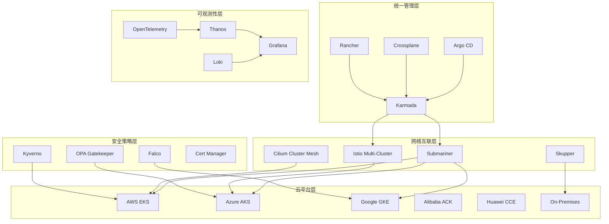

> **生产环境安全提示**
>
> 本文档包含可直接执行的运维命令。执行前请确认：当前目标集群与 Namespace 是否正确；是否具备足够的 RBAC 权限；是否已在非生产环境验证。命令风险等级标注：🔴 高风险（可能造成数据丢失或服务中断）、🟡 中风险（会修改集群状态，但通常可回滚）、🟢 低风险/只读（信息收集，无副作用）。


---
tags:
- cloud
- hybrid
intent_queries:
- open-source-projects-index是什么？
- open-source-projects-index的使用方法
- open-source-projects-index的最佳实践

tier: peripheral---
title: Domain-27 多云与混合云 — 开源项目索引
description: '<!-- chunk: 概述' -->## 概述'
category: multi-cloud-hybrid
tags:
- k8s
- multi-cloud
- hybrid-cloud
- etcd
- apiserver
- kubelet
- scheduler
- controller-manager
- prometheus
- grafana
last_updated: 2026-05
difficulty: advanced
reading_level: advanced
audience:
- 云架构师
- SRE
- 平台工程师
estimated_read_time: 10min
intent_queries:
- Domain-27 多云与混合云 — 开源项目索引 是什么
- 如何 Domain-27 多云与混合云 — 开源项目索引
- Kubernetes 27 multi cloud hybrid 最佳实践
trigger_keywords:
- Domain-27
- 多云与混合云
- 开源项目索引
- multi
- cloud
- hybrid
authors:
- name: KUDIG Team
  role: contributor
k8s_versions:
- '1.28'
- '1.29'
- '1.30'
- '1.31'
- '1.32'
---

# Domain-27 多云与混合云 — 开源项目索引

> **最后更新**: 2026-05-17

---

<!-- chunk: 概述 -->## 概述

多云与混合云架构是当今企业IT基础设施演进的核心方向。随着业务规模扩大和合规要求的不断提升，单一云平台已难以满足企业全部需求。多云策略能够有效避免厂商锁定、提升业务连续性、优化成本结构，并为全球化业务部署提供灵活的基础设施支撑。根据 Flexera 2026 云状态报告，89% 的企业已经采用多云策略，平均使用 2.6 个公有云和 1.2 个私有云平台。

在多云与混合云领域，开源生态提供了丰富的工具和平台，涵盖多集群管理、跨云调度、网络互联、服务网格、安全治理等多个维度。CNCF（Cloud Native Computing Foundation）生态中的多个毕业和孵化项目已经成为多云管理的核心组件。Karmada 提供多云多集群调度，Submariner 实现跨集群网络直通，Crossplane 通过 Kubernetes API 管理多云基础设施，Argo CD 和 Flux 提供 GitOps 驱动的多集群持续交付。

本文档索引了该领域最具影响力和生产就绪能力的开源项目，为企业技术选型提供全面的参考依据。每个项目都附有详细的评估维度：CNCF 状态、版本信息、社区活跃度、生产案例和推荐使用场景。通过系统性的选型矩阵和场景化推荐，帮助企业快速找到适合自身需求的多云开源工具组合。

## 开源生态全景

```mermaid
graph TB
    subgraph "多云管理生态"
        direction TB
        ORCHESTRATION[编排调度层]
        NETWORK[网络互联层]
        PLATFORM[管理平台层]
        OBSERVABILITY[可观测性层]
        SECURITY[安全策略层]
        DISASTER[灾备恢复层]
        INFRA[基础设施层]
        GITOPS[GitOps 层]
    end

    ORCHESTRATION --> KARMADA[Karmada]
    ORCHESTRATION --> CAPI[Cluster API]
    ORCHESTRATION --> ADMIRALTY[Admiralty]
    ORCHESTRATION --> LIQO[Liqo]

    NETWORK --> SUBMARINER[Submariner]
    NETWORK --> SKUPPER[Skupper]
    NETWORK --> CILIUM[Cilium Mesh]
    NETWORK --> ISTIO[Istio]

    PLATFORM --> RANCHER[Rancher]
    PLATFORM --> OCM[OCM]
    PLATFORM --> CLUSTERNET[Clusternet]
    PLATFORM --> VCLUSTER[vCluster]

    OBSERVABILITY --> THANOS[Thanos]
    OBSERVABILITY --> LOKI[Loki]
    OBSERVABILITY --> OTEL[OpenTelemetry]
    OBSERVABILITY --> MIMIR[Grafana Mimir]

    SECURITY --> KYVERNO[Kyverno]
    SECURITY --> OPA[OPA Gatekeeper]
    SECURITY --> FALCO[Falco]
    SECURITY --> EXTS[External Secrets]

    DISASTER --> VELERO[Velero]
    DISASTER --> K8SSANDRA[K8ssandra]

    INFRA --> CROSSPLANE[Crossplane]
    INFRA --> TERRAFORM[Terraform]
    INFRA --> PULUMI[Pulumi]

    GITOPS --> ARGOCD[Argo CD]
    GITOPS --> FLUX[Flux]
    GITOPS --> FLEET[Fleet]
```



---

<!-- chunk: 核心项目 -->## 核心项目

## 多集群编排与调度

| 项目 | 作用 | CNCF 状态 | 最新版本 | Stars | License |
|:---|:---|:---|:---|:---|:---|
| **Karmada** | 多云多集群调度与资源分发 | Incubating | v1.13.0 | 4.5k+ | Apache-2.0 |
| **Cluster API** | 声明式集群生命周期管理 | K8s SIG | v1.9.0 | 3.5k+ | Apache-2.0 |
| **Admiralty** | 多集群调度联邦（虚拟 Kubelet 模式） | 非 CNCF | v0.15.0 | 500+ | Apache-2.0 |
| **KubeFed (已归档)** | K8s 集群联邦（历史参考） | K8s SIG | 已归档 | 3k+ | Apache-2.0 |
| **Liqo** | 多集群资源动态共享与卸载 | CNCF Sandbox | v0.10.0 | 3k+ | Apache-2.0 |
| **KubeVela** | 多集群应用交付平台 | CNCF Incubating | v1.10.0 | 6k+ | Apache-2.0 |

## Karmada 深度解析

Karmada（Kubernetes Armada）是华为云开源并捐赠给 CNCF 的多云多集群 Kubernetes 编排引擎，目前处于 CNCF Incubating 阶段。Karmada 的核心设计理念是"Kubernetes Native"，通过 CRD 和 Aggregated API Server 扩展 Kubernetes API，用户无需学习新的 API 概念即可管理多云环境。

```yaml
apiVersion: policy.karmada.io/v1alpha1
kind: PropagationPolicy
metadata:
  name: example-propagation
  namespace: production
spec:
  resourceSelectors:
  - apiVersion: apps/v1
    kind: Deployment
    name: web-app
  - apiVersion: v1
    kind: Service
    name: web-app-svc
  - apiVersion: networking.k8s.io/v1
    kind: Ingress
    name: web-app-ingress
  placement:
    clusterAffinity:
      clusterNames:
      - aws-cluster
      - azure-cluster
      - gke-cluster
      labelSelector:
        matchLabels:
          environment: production
          region: global
    clusterTolerations:
    - key: "cluster.karmada.io/not-ready"
      operator: "Exists"
      effect: "NoExecute"
      tolerationSeconds: 300
    replicaScheduling:
      replicaDivisionPreference: Weighted
      replicaSchedulingType: Divided
      weightPreference:
        staticWeightList:
        - targetCluster:
            clusterNames: [aws-cluster]
          weight: 2
        - targetCluster:
            clusterNames: [azure-cluster]
          weight: 1
        - targetCluster:
            clusterNames: [gke-cluster]
          weight: 1
        dynamicWeight: AvailableReplicas
    spreadConstraints:
    - spreadByField: cluster
      maxGroups: 3
      minGroups: 2
    - spreadByField: region
      maxGroups: 3
      minGroups: 2
  dependentOverrides:
  - web-app-override
---
apiVersion: policy.karmada.io/v1alpha1
kind: OverridePolicy
metadata:
  name: web-app-override
  namespace: production
spec:
  resourceSelectors:
  - apiVersion: apps/v1
    kind: Deployment
    name: web-app
  overrideRules:
  - targetCluster:
      clusterNames: [aws-cluster]
    overriders:
      plaintext:
      - path: "/spec/template/spec/containers/0/image"
        operation: replace
        value: "123456789012.dkr.ecr.us-west-2.amazonaws.com/web-app:v2.0"
      - path: "/spec/replicas"
        operation: replace
        value: 6
  - targetCluster:
      clusterNames: [azure-cluster]
    overriders:
      plaintext:
      - path: "/spec/template/spec/containers/0/image"
        operation: replace
        value: "myacr.azurecr.io/web-app:v2.0"
      - path: "/spec/replicas"
        operation: replace
        value: 3
```

## 多集群管理平台

| 项目 | 作用 | CNCF 状态 | 最新版本 | Stars | License |
|:---|:---|:---|:---|:---|:---|
| **Rancher** | 多集群管理平台（UI + RBAC + GitOps） | SUSE | v2.10.0 | 23k+ | Apache-2.0 |
| **OCM** | Open Cluster Management（大规模集群管理） | 非 CNCF | v0.16.0 | 1k+ | Apache-2.0 |
| **Clusternet** | 大规模集群管理（>1000 集群） | 非 CNCF | v0.20.0 | 1k+ | Apache-2.0 |
| **Fleet** | Rancher GitOps 多集群分发 | Rancher | v0.12.0 | 1.5k+ | Apache-2.0 |

## Rancher 多集群管理配置

```yaml
apiVersion: management.cattle.io/v3
kind: ClusterRegistrationToken
metadata:
  name: default-token
  namespace: c-m-aws-production
spec:
  clusterName: c-m-aws-production
---
apiVersion: management.cattle.io/v3
kind: ClusterRoleTemplateBinding
metadata:
  name: platform-team-admin
  namespace: c-m-aws-production
userName: "activedirectory_user://platform-admin"
roleTemplateId: "cluster-owner"
---
apiVersion: fleet.cattle.io/v1alpha1
kind: GitRepo
metadata:
  name: production-apps
  namespace: fleet-default
spec:
  repo: https://github.com/company/gitops-manifests
  branch: main
  paths:
  - clusters/aws-production
  - clusters/shared
  targets:
  - clusterSelector:
      matchLabels:
        environment: production
        provider: aws
  - clusterSelector:
      matchLabels:
        environment: production
        provider: azure
  pollingInterval: 30s
  correctDrift:
    enabled: true
```

## 虚拟化与控制平面

| 项目 | 作用 | CNCF 状态 | 最新版本 | Stars | License |
|:---|:---|:---|:---|:---|:---|
| **vCluster** | 命名空间级虚拟集群 | Loft | v0.24.0 | 7k+ | Apache-2.0 |
| **Kamaji** | 托管 K8s 控制平面（多租户隔离） | Clastix | v1.0.0 | 1k+ | Apache-2.0 |
| **kcp** | 多租户 Kubernetes 控制平面 | 非 CNCF | v0.9.0 | 2k+ | Apache-2.0 |

## vCluster 虚拟集群配置

```yaml
apiVersion: v1
kind: Namespace
metadata:
  name: vcluster-tenant-a
---
apiVersion: v1
kind: ConfigMap
metadata:
  name: vcluster-config-tenant-a
  namespace: vcluster-tenant-a
data:
  config.yaml: |
    controlPlane:
      distro:
        k8s:
          enabled: true
          version: v1.30.0
      backingStore:
        etcd:
          deployed: true
          persistence:
            enabled: true
            size: 5Gi
      apiServer:
        extraArgs:
          - --audit-log-maxage=30
          - --audit-log-maxbackup=10
          - --audit-log-maxsize=100
          - --audit-log-path=/var/log/audit/audit.log
          - --audit-policy-file=/etc/kubernetes/audit-policy.yaml
    networking:
      proxy:
        enabled: true
    rbac:
      enabled: true
    storage:
      persistence: true
      size: 5Gi
    security:
      podSecurityStandard: restricted
      podSecurityEnforce: true
    telemetry:
      enabled: false
    isolation:
      enabled: true
      resourceQuota:
        hard:
          requests.cpu: "16"
          requests.memory: "32Gi"
          limits.cpu: "32"
          limits.memory: "64Gi"
          pods: "100"
          services: "50"
          persistentvolumeclaims: "30"
      networkPolicy:
        enabled: true
        outgoingConnections:
          - cidr: 10.0.0.0/8
            ports:
            - protocol: TCP
              port: 443
---
apiVersion: apps/v1
kind: StatefulSet
metadata:
  name: vcluster-tenant-a
  namespace: vcluster-tenant-a
spec:
  replicas: 1
  selector:
    matchLabels:
      app: vcluster-tenant-a
  template:
    metadata:
      labels:
        app: vcluster-tenant-a
    spec:
      containers:
      - name: vcluster
        image: loftsh/vcluster:0.24.0
        args:
        - start
        - --config=/etc/vcluster/config.yaml
        - --name=tenant-a
        - --namespace=vcluster-tenant-a
        - --kube-config-context=tenant-a
        volumeMounts:
        - name: config
          mountPath: /etc/vcluster
        resources:
          requests:
            cpu: "200m"
            memory: "256Mi"
          limits:
            cpu: "1"
            memory: "1Gi"
      volumes:
      - name: config
        configMap:
          name: vcluster-config-tenant-a
```

## 跨云网络互联

| 项目 | 作用 | CNCF 状态 | 最新版本 | Stars | License |
|:---|:---|:---|:---|:---|:---|
| **Submariner** | 多集群 Pod/Service IP 跨集群路由 | CNCF Sandbox | v0.19.0 | 3k+ | Apache-2.0 |
| **Skupper** | 应用级安全网络（无需 CNI 改动） | Red Hat | v2.0.0 | 1k+ | Apache-2.0 |
| **Cilium Cluster Mesh** | 基于 eBPF 的跨集群服务发现与路由 | CNCF Graduated | v1.16.0 | 20k+ | Apache-2.0 |
| **Liqo** | 多集群资源动态共享与卸载 | CNCF Sandbox | v0.10.0 | 3k+ | Apache-2.0 |

## Submariner 跨集群网络部署配置

```yaml
apiVersion: submariner.io/v1alpha1
kind: Broker
metadata:
  name: submariner-broker
  namespace: submariner-k8s-broker
spec:
  defaultGlobalnetCIDR: "242.0.0.0/8"
  components:
    serviceDiscovery: true
    globalnet: true
---
apiVersion: submariner.io/v1alpha1
kind: Submariner
metadata:
  name: submariner-aws
  namespace: submariner-operator
spec:
  broker:
    namespace: submariner-k8s-broker
    globalnetCIDR: "242.0.0.0/16"
  cableDriver: wireguard
  clusterID: aws-cluster
  clusterCIDR: "10.0.0.0/16"
  serviceCIDR: "172.20.0.0/16"
  globalCIDR: "242.0.0.0/16"
  debug: false
  natEnabled: false
  healthCheck:
    enabled: true
    intervalSeconds: 5
    maxPacketLossCount: 5
  networkPlugin: cni
  imageOverrides: {}
  repository: quay.io/submariner
  version: v0.19.0
---
apiVersion: submariner.io/v1alpha1
kind: ServiceExport
metadata:
  name: backend-service
  namespace: production
spec: {}
---
apiVersion: submariner.io/v1alpha1
kind: GlobalnetConfig
metadata:
  name: default
  namespace: submariner-operator
spec:
  globalCIDR: "242.0.0.0/8"
  enableGlobalnet: true
  cableDriver: wireguard
  natEnabled: false
```

## Cilium Cluster Mesh 配置

```yaml
apiVersion: v1
kind: ConfigMap
metadata:
  name: cilium-clustermesh-config
  namespace: kube-system
data:
  clustermesh-config.yaml: |
    clusters:
    - name: aws-cluster
      id: 1
      ipv4CIDR: 10.0.0.0/16
      serviceIPv4CIDR: 172.20.0.0/16
      nodes:
      - address: 10.0.1.10
        name: mesh-core-1
      - address: 10.0.2.10
        name: mesh-core-2
    - name: azure-cluster
      id: 2
      ipv4CIDR: 10.1.0.0/16
      serviceIPv4CIDR: 172.21.0.0/16
      nodes:
      - address: 10.1.1.10
        name: mesh-core-1
      - address: 10.1.2.10
        name: mesh-core-2
    - name: gke-cluster
      id: 3
      ipv4CIDR: 10.2.0.0/16
      serviceIPv4CIDR: 172.22.0.0/16
      nodes:
      - address: 10.2.1.10
        name: mesh-core-1
    tunnel: vxlan
    encryption:
      enabled: true
      type: wireguard
---
apiVersion: v1
kind: Service
metadata:
  name: global-backend
  namespace: production
  annotations:
    service.cilium.io/global: "true"
spec:
  type: ClusterIP
  ports:
  - port: 80
    targetPort: 8080
  selector:
    app: backend
```

## 多云基础设施编排

| 项目 | 作用 | CNCF 状态 | 最新版本 | Stars | License |
|:---|:---|:---|:---|:---|:---|
| **Crossplane** | 多云基础设施编排（Kubernetes 原生） | CNCF Incubating | v1.17.0 | 10k+ | Apache-2.0 |
| **Terraform** | 多云基础设施即代码 | HashiCorp | v1.10.0 | 43k+ | BSL-1.1 |
| **Pulumi** | 多语言基础设施即代码 | Pulumi | v3.140.0 | 22k+ | Apache-2.0 |
| **Cluster API Provider AWS** | AWS 集群生命周期 | K8s SIG | v2.7.0 | 1k+ | Apache-2.0 |
| **Cluster API Provider Azure** | Azure 集群生命周期 | K8s SIG | v1.17.0 | 300+ | Apache-2.0 |
| **Cluster API Provider GCP** | GCP 集群生命周期 | K8s SIG | v1.6.0 | 200+ | Apache-2.0 |

## Crossplane 多云资源编排配置

```yaml
apiVersion: pkg.crossplane.io/v1
kind: Provider
metadata:
  name: provider-aws
spec:
  package: xpkg.upbound.io/crossplane-contrib/provider-aws:v0.47.0
---
apiVersion: pkg.crossplane.io/v1
kind: Provider
metadata:
  name: provider-azure
spec:
  package: xpkg.upbound.io/crossplane-contrib/provider-azure:v0.39.0
---
apiVersion: pkg.crossplane.io/v1
kind: Provider
metadata:
  name: provider-gcp
spec:
  package: xpkg.upbound.io/crossplane-contrib/provider-gcp:v0.37.0
---
apiVersion: aws.upbound.io/v1beta1
kind: ProviderConfig
metadata:
  name: aws-production
spec:
  credentials:
    source: Secret
    secretRef:
      namespace: crossplane-system
      name: aws-credentials
      key: credentials
  assumeRoleARN: arn:aws:iam::123456789012:role/crossplane-role
---
apiVersion: azure.upbound.io/v1beta1
kind: ProviderConfig
metadata:
  name: azure-production
spec:
  credentials:
    source: Secret
    secretRef:
      namespace: crossplane-system
      name: azure-credentials
      key: credentials
  subscriptionID: xxxxxxxx-xxxx-xxxx-xxxx-xxxxxxxxxxxx
  tenantID: xxxxxxxx-xxxx-xxxx-xxxx-xxxxxxxxxxxx
---
apiVersion: apiextensions.crossplane.io/v1
kind: Composition
metadata:
  name: multicloud-database
  labels:
    dbtype: postgresql
    provider: multicloud
spec:
  compositeTypeRef:
    apiVersion: database.example.com/v1alpha1
    kind: MultiCloudDatabase
  resources:
  - name: aws-rds
    base:
      apiVersion: rds.aws.upbound.io/v1beta1
      kind: Instance
      spec:
        forProvider:
          region: us-west-2
          engine: postgres
          engineVersion: "16.1"
          instanceClass: db.t3.medium
          allocatedStorage: 100
          storageType: gp3
          storageEncrypted: true
          multiAz: true
          publiclyAccessible: false
          databaseName: production
          username: dbadmin
          passwordSecretRef:
            namespace: crossplane-system
            name: db-password
            key: password
    patches:
    - fromFieldPath: spec.awsRegion
      toFieldPath: spec.forProvider.region
    - fromFieldPath: spec.instanceSize
      toFieldPath: spec.forProvider.instanceClass
      transforms:
      - type: map
        map:
          small: db.t3.small
          medium: db.t3.medium
          large: db.r5.large
  - name: azure-sql
    base:
      apiVersion: dbforpostgresql.azure.upbound.io/v1beta1
      kind: FlexibleServer
      spec:
        forProvider:
          location: East US
          version: "16"
          skuName: GP_Standard_D2s_v3
          storageMb: 102400
          administratorLogin: dbadmin
          administratorLoginPasswordSecretRef:
            namespace: crossplane-system
            name: db-password
            key: password
    patches:
    - fromFieldPath: spec.azureRegion
      toFieldPath: spec.forProvider.location
---
apiVersion: database.example.com/v1alpha1
kind: MultiCloudDatabase
metadata:
  name: production-db
  namespace: production
spec:
  awsRegion: us-west-2
  azureRegion: East US
  instanceSize: medium
  replicationEnabled: true
  backupRetention: 7
```

## 多云 GitOps 与配置管理

| 项目 | 作用 | CNCF 状态 | 最新版本 | Stars | License |
|:---|:---|:---|:---|:---|:---|
| **Argo CD** | 声明式 GitOps 持续交付 | CNCF Graduated | v2.13.0 | 18k+ | Apache-2.0 |
| **Flux** | Kubernetes 原生 GitOps | CNCF Graduated | v2.4.0 | 16k+ | Apache-2.0 |
| **Config Sync** | 多集群配置同步（GKE Anthos 组件） | Google | v1.16.0 | 200+ | Apache-2.0 |

## Argo CD ApplicationSet 多集群配置

```yaml
apiVersion: argoproj.io/v1alpha1
kind: ApplicationSet
metadata:
  name: production-apps
  namespace: argocd
spec:
  generators:
  - clusters:
      selector:
        matchLabels:
          environment: production
      values:
        revision: main
  - clusters:
      selector:
        matchLabels:
          environment: staging
      values:
        revision: develop
  template:
    metadata:
      name: '{{name}}-web-application'
    spec:
      project: production
      source:
        repoURL: https://github.com/company/gitops-manifests
        targetRevision: '{{values.revision}}'
        path: charts/web-application
        helm:
          valueFiles:
          - values.yaml
          - values-{{name}}.yaml
          parameters:
          - name: image.repository
            value: '{{metadata.annotations.registry}}/web-application'
          - name: replicaCount
            value: '3'
      destination:
        server: '{{server}}'
        namespace: production
      syncPolicy:
        automated:
          prune: true
          selfHeal: true
          allowEmpty: false
        syncOptions:
        - CreateNamespace=true
        - PrunePropagationPolicy=foreground
        - PruneLast=true
        retry:
          limit: 5
          backoff:
            duration: 5s
            factor: 2
            maxDuration: 3m
```

## 多云服务网格

| 项目 | 作用 | CNCF 状态 | 最新版本 | Stars | License |
|:---|:---|:---|:---|:---|:---|
| **Istio** | 多集群服务网格 | CNCF Graduated | v1.23.0 | 36k+ | Apache-2.0 |
| **Linkerd** | 轻量级多集群服务网格 | CNCF Graduated | v2.16.0 | 10k+ | Apache-2.0 |

## Istio 多集群服务网格配置

```yaml
apiVersion: install.istio.io/v1alpha1
kind: IstioOperator
metadata:
  name: istio-multicluster
  namespace: istio-system
spec:
  profile: default
  meshConfig:
    accessLogFile: /dev/stdout
    accessLogEncoding: JSON
    defaultConfig:
      tracing:
        zipkin:
          address: zipkin.istio-system:9411
      outboundTrafficPolicy:
        mode: REGISTRY_ONLY
    trustDomain: cluster.local
  values:
    global:
      meshID: production-mesh
      multiCluster:
        clusterName: aws-cluster
      network: aws-network
      mtls:
        enabled: true
      controlPlaneSecurityEnabled: true
    pilot:
      enabled: true
      mtls: true
    cni:
      enabled: true
  components:
    pilot:
      enabled: true
      k8s:
        resources:
          requests:
            cpu: 500m
            memory: 512Mi
        hpaSpec:
          minReplicas: 2
          maxReplicas: 5
    ingressGateways:
    - name: istio-ingressgateway
      enabled: true
      k8s:
        service:
          type: LoadBalancer
          annotations:
            service.beta.kubernetes.io/aws-load-balancer-type: nlb
        hpaSpec:
          minReplicas: 2
          maxReplicas: 10
---
apiVersion: networking.istio.io/v1beta1
kind: ServiceEntry
metadata:
  name: azure-cluster-services
  namespace: production
spec:
  hosts:
  - "*.azure.cluster.local"
  location: MESH_INTERNAL
  ports:
  - name: http
    number: 80
    protocol: HTTP
  - name: grpc
    number: 9090
    protocol: GRPC
  resolution: DNS
  endpoints:
  - address: azure-ingress.example.com
    ports:
      http: 15443
      grpc: 15443
    network: azure-network
    locality: eastus/azure-zone1
```

## 多云可观测性

| 项目 | 作用 | CNCF 状态 | 最新版本 | Stars | License |
|:---|:---|:---|:---|:---|:---|
| **Thanos** | 跨集群 Prometheus 长期存储与全局查询 | CNCF Incubating | v0.36.0 | 13k+ | Apache-2.0 |
| **Cortex** | 可扩展 Prometheus 长期存储 | CNCF Incubating | v1.18.0 | 6k+ | Apache-2.0 |
| **OpenTelemetry** | 统一可观测性采集框架 | CNCF Incubating | v0.110.0 | 5k+ | Apache-2.0 |
| **Grafana Mimir** | 可扩展 Prometheus 兼容 TSDB | Grafana Labs | v2.13.0 | 4k+ | AGPL-3.0 |
| **Loki** | 多集群日志聚合 | Grafana Labs | v3.2.0 | 23k+ | AGPL-3.0 |

## Thanos 全局监控配置

```yaml
apiVersion: v1
kind: ConfigMap
metadata:
  name: thanos-store-config
  namespace: monitoring
data:
  thanos.yaml: |
    type: S3
    config:
      bucket: thanos-storage
      endpoint: s3.us-west-2.amazonaws.com
      region: us-west-2
      access_key: ${AWS_ACCESS_KEY}
      secret_key: ${AWS_SECRET_KEY}
      http_config:
        idle_conn_timeout: 150s
        response_header_timeout: 150s
      trace:
        enable: true
      part_size: 134217728
---
apiVersion: apps/v1
kind: Deployment
metadata:
  name: thanos-query
  namespace: monitoring
spec:
  replicas: 2
  selector:
    matchLabels:
      app: thanos-query
  template:
    metadata:
      labels:
        app: thanos-query
    spec:
      containers:
      - name: thanos-query
        image: thanosio/thanos:v0.36.0
        args:
        - query
        - --http-address=0.0.0.0:19192
        - --store=thanos-store.monitoring:10901
        - --store=thanos-sidecar-aws.monitoring:10901
        - --store=thanos-sidecar-azure.monitoring:10901
        - --store=thanos-sidecar-gke.monitoring:10901
        - --query.replica-label=replica
        - --query.timeout=2m
        - --query.max-concurrent=20
        - --query.lookback-delta=5m
        - --store.response-timeout=10s
        - --tracing.config-type=JAEGER
        ports:
        - containerPort: 19192
        resources:
          requests:
            cpu: "500m"
            memory: "1Gi"
          limits:
            cpu: "2"
            memory: "4Gi"
        livenessProbe:
          httpGet:
            path: /-/healthy
            port: 19192
          initialDelaySeconds: 30
          periodSeconds: 10
        readinessProbe:
          httpGet:
            path: /-/ready
            port: 19192
          initialDelaySeconds: 10
          periodSeconds: 5
---
apiVersion: v1
kind: Service
metadata:
  name: thanos-query
  namespace: monitoring
spec:
  selector:
    app: thanos-query
  ports:
  - name: http
    port: 19192
    targetPort: 19192
  - name: grpc
    port: 10901
    targetPort: 10901
  type: ClusterIP
```

## 多云安全与策略

| 项目 | 作用 | CNCF 状态 | 最新版本 | Stars | License |
|:---|:---|:---|:---|:---|:---|
| **OPA/Gatekeeper** | Kubernetes 策略引擎 | CNCF Graduated | v3.17.0 | 5k+ | Apache-2.0 |
| **Kyverno** | Kubernetes 原生策略管理 | CNCF Incubating | v1.12.0 | 6k+ | Apache-2.0 |
| **Falco** | 运行时安全监控 | CNCF Graduated | v0.38.0 | 7k+ | Apache-2.0 |
| **Cert Manager** | 多集群证书管理 | CNCF Incubating | v1.16.0 | 12k+ | Apache-2.0 |
| **External Secrets** | 多集群外部密钥同步 | 非 CNCF | v0.10.0 | 4k+ | Apache-2.0 |

## Kyverno 多集群策略配置

```yaml
apiVersion: kyverno.io/v1
kind: ClusterPolicy
metadata:
  name: multicloud-security-baseline
  annotations:
    policies.kyverno.io/title: 多云安全基线策略
    policies.kyverno.io/category: Security
    policies.kyverno.io/severity: high
spec:
  validationFailureAction: Enforce
  background: true
  rules:
  - name: require-resource-limits
    match:
      any:
      - resources:
          kinds:
          - Deployment
          - StatefulSet
          - DaemonSet
    validate:
      message: "所有容器必须设置 CPU 和内存 limits"
      pattern:
        spec:
          template:
            spec:
              containers:
              - resources:
                  limits:
                    memory: "?*"
                    cpu: "?*"
  - name: disallow-privileged-containers
    match:
      any:
      - resources:
          kinds:
          - Deployment
          - StatefulSet
          - Pod
    validate:
      message: "禁止使用特权容器"
      pattern:
        spec:
          template:
            spec:
              containers:
              - securityContext:
                  privileged: false
  - name: require-non-root
    match:
      any:
      - resources:
          kinds:
          - Deployment
          - StatefulSet
    validate:
      message: "容器必须以非 root 用户运行"
      pattern:
        spec:
          template:
            spec:
              (initContainers):
              - securityContext:
                  runAsNonRoot: true
              containers:
              - securityContext:
                  runAsNonRoot: true
  - name: disallow-latest-tag
    match:
      any:
      - resources:
          kinds:
          - Deployment
          - StatefulSet
    validate:
      message: "禁止使用 :latest 镜像标签"
      pattern:
        spec:
          template:
            spec:
              containers:
              - image: "!*:latest"
  - name: require-network-policy
    match:
      any:
      - resources:
          kinds:
          - Namespace
    generate:
      apiVersion: networking.k8s.io/v1
      kind: NetworkPolicy
      name: default-deny-all
      namespace: "{{request.object.metadata.name}}"
      data:
        spec:
          podSelector: {}
          policyTypes:
          - Ingress
          - Egress
```

## 多云灾备与迁移

| 项目 | 作用 | CNCF 状态 | 最新版本 | Stars | License |
|:---|:---|:---|:---|:---|:---|
| **Velero** | Kubernetes 集群备份与迁移 | VMware | v1.15.0 | 9k+ | Apache-2.0 |
| **KubeVela** | 多集群应用交付平台 | CNCF Incubating | v1.10.0 | 6k+ | Apache-2.0 |
| **K8ssandra** | 多集群 Cassandra 数据库 | 非 CNCF | v1.6.0 | 1k+ | Apache-2.0 |

---

<!-- chunk: 架构总览 -->## 架构总览



---

<!-- chunk: 多集群管理选型矩阵 -->## 多集群管理选型矩阵

## 按功能需求选型

| 需求 | 推荐方案 | 说明 |
|:---|:---|:---|
| 应用级多集群分发 | Karmada | PropagationPolicy + OverridePolicy 精细控制 |
| 集群生命周期自动化 | Cluster API | 声明式创建/升级/销毁，支持 AWS/Azure/GCP |
| 统一运维平面 | Rancher | UI + 监控 + GitOps + 用户管理 |
| 多租户虚拟集群 | vCluster | 命名空间内虚拟控制平面，轻量级隔离 |
| 托管 K8s 服务化 | Kamaji | 多租户控制平面隔离，适合平台运营商 |
| 跨集群网络直通 | Submariner | Pod IP 跨集群路由，L3 网络互联 |
| 应用级安全连接 | Skupper | 无需 CNI 改动，HTTP/AMQP 协议层互联 |
| eBPF 跨集群通信 | Cilium Cluster Mesh | 高性能，基于 eBPF 的服务发现与路由 |
| 大规模 (>1000) 集群 | OCM / Clusternet | 专为超大规模设计 |
| 多云基础设施编排 | Crossplane | Kubernetes 原生多云资源管理 |
| 多集群 GitOps | Argo CD + ApplicationSet | 声明式多集群应用交付 |
| 多集群服务网格 | Istio Multi-Cluster | 跨集群 mTLS 与流量管理 |

## 按场景选型

| 场景 | 推荐组合 | 说明 |
|:---|:---|:---|
| 中小企业多云 | Karmada + Argo CD + Submariner | 轻量级多云管理组合 |
| 大型企业多云 | Rancher + Karmada + Istio + Thanos | 全功能多云平台 |
| 金融行业多云 | OCM + Kyverno + Submariner + Velero | 强合规、强安全 |
| 互联网公司多云 | Karmada + Cilium + Prometheus + Flux | 高性能、云原生 |
| 边缘计算混合云 | K3s + KubeEdge + Skupper | 轻量级边缘管理 |
| 数据密集型多云 | Karmada + Thanos + Loki + OpenTelemetry | 可观测性优先 |

---

<!-- chunk: 项目成熟度评估 -->## 项目成熟度评估

## 生产就绪能力评估

| 项目 | 稳定性 | 社区活跃度 | 文档完善度 | 生产案例 | 企业支持 |
|:---|:---|:---|:---|:---|:---|
| Karmada | ⭐⭐⭐⭐ | ⭐⭐⭐⭐⭐ | ⭐⭐⭐⭐ | 华为、vivo、美团 | 华为云 |
| Cluster API | ⭐⭐⭐⭐⭐ | ⭐⭐⭐⭐⭐ | ⭐⭐⭐⭐⭐ | 大量企业 | VMware |
| Rancher | ⭐⭐⭐⭐⭐ | ⭐⭐⭐⭐⭐ | ⭐⭐⭐⭐⭐ | 全球大量企业 | SUSE |
| vCluster | ⭐⭐⭐⭐ | ⭐⭐⭐⭐ | ⭐⭐⭐⭐ | 多家企业 | Loft |
| Submariner | ⭐⭐⭐ | ⭐⭐⭐ | ⭐⭐⭐ | 中等规模 | Red Hat |
| Skupper | ⭐⭐⭐ | ⭐⭐⭐ | ⭐⭐⭐⭐ | 多家企业 | Red Hat |
| Crossplane | ⭐⭐⭐⭐ | ⭐⭐⭐⭐⭐ | ⭐⭐⭐⭐ | 大量企业 | Upbound |
| Argo CD | ⭐⭐⭐⭐⭐ | ⭐⭐⭐⭐⭐ | ⭐⭐⭐⭐⭐ | 全球大量企业 | Akuity |
| Istio | ⭐⭐⭐⭐⭐ | ⭐⭐⭐⭐⭐ | ⭐⭐⭐⭐⭐ | 全球大量企业 | Google/IBM |
| Thanos | ⭐⭐⭐⭐⭐ | ⭐⭐⭐⭐ | ⭐⭐⭐⭐ | 大量企业 | 多家厂商 |

---

<!-- chunk: 版本兼容性矩阵 -->## 版本兼容性矩阵

## Kubernetes 版本支持

| 项目 | K8s 1.26 | K8s 1.27 | K8s 1.28 | K8s 1.29 | K8s 1.30 |
|:---|:---|:---|:---|:---|:---|
| Karmada v1.13 | ✅ | ✅ | ✅ | ✅ | ✅ |
| Cluster API v1.9 | ✅ | ✅ | ✅ | ✅ | ✅ |
| Rancher v2.10 | ✅ | ✅ | ✅ | ✅ | ⚠️ |
| vCluster v0.24 | ✅ | ✅ | ✅ | ✅ | ✅ |
| Submariner v0.19 | ✅ | ✅ | ✅ | ✅ | ⚠️ |
| Crossplane v1.17 | ✅ | ✅ | ✅ | ✅ | ✅ |
| Argo CD v2.13 | ✅ | ✅ | ✅ | ✅ | ✅ |
| Istio v1.23 | ✅ | ✅ | ✅ | ✅ | ✅ |
| Thanos v0.36 | ✅ | ✅ | ✅ | ✅ | ✅ |
| Kyverno v1.12 | ✅ | ✅ | ✅ | ✅ | ✅ |
| Velero v1.15 | ✅ | ✅ | ✅ | ✅ | ✅ |

---

<!-- chunk: 快速入门指南 -->## 快速入门指南

## Karmada 多集群管理

> ⚠️ **🟡 中危变更** — 变更集群资源状态，建议先 --dry-run 或 diff 确认
> - `helm upgrade/install`：部署/升级 release

``` bash
# 🟡 中风险：会修改集群/资源状态，执行前请确认目标、影响范围与授权
#!/bin/bash
set -euo pipefail

echo "=== Karmada 多集群管理快速入门 ==="

echo "[1] 安装 Karmada 控制平面"
helm repo add karmada https://raw.githubusercontent.com/karmada-io/karmada/main/charts
helm repo update
helm install karmada karmada/karmada \
  --namespace karmada-system \
  --create-namespace \
  --set components["etcd"].replicaCount=3 \
  --set components["karmada-apiserver"].replicaCount=2 \
  --set components["karmada-controller-manager"].replicaCount=2 \
  --set components["karmada-scheduler"].replicaCount=2 \
  --set components["karmada-descheduler"].enabled=true

echo "[2] 获取 Karmada kubeconfig"
karmadactl kubeconfig --namespace karmada-system > /etc/karmada/karmada-apiserver.config

echo "[3] 将成员集群加入 Karmada"
karmadactl join aws-cluster \
  --kubeconfig /etc/karmada/karmada-apiserver.config \
  --cluster-kubeconfig /path/to/aws-cluster.kubeconfig

karmadactl join azure-cluster \
  --kubeconfig /etc/karmada/karmada-apiserver.config \
  --cluster-kubeconfig /path/to/azure-cluster.kubeconfig

karmadactl join gke-cluster \
  --kubeconfig /etc/karmada/karmada-apiserver.config \
  --cluster-kubeconfig /path/to/gke-cluster.kubeconfig

echo "[4] 验证集群注册"
karmadactl get clusters --kubeconfig /etc/karmada/karmada-apiserver.config

echo "[5] 创建跨集群部署策略"
kubectl --kubeconfig /etc/karmada/karmada-apiserver.config apply -f - <<'EOF'
apiVersion: policy.karmada.io/v1alpha1
kind: PropagationPolicy
metadata:
  name: nginx-propagation
spec:
  resourceSelectors:
    - apiVersion: apps/v1
      kind: Deployment
      name: nginx
  placement:
    clusterAffinity:
      clusterNames:
        - aws-cluster
        - azure-cluster
        - gke-cluster
    replicaScheduling:
      replicaDivisionPreference: Weighted
      replicaSchedulingType: Divided
      weightPreference:
        staticWeightList:
          - targetCluster:
              clusterNames: [aws-cluster]
            weight: 2
          - targetCluster:
              clusterNames: [azure-cluster]
            weight: 1
          - targetCluster:
              clusterNames: [gke-cluster]
            weight: 1
        dynamicWeight: AvailableReplicas
---
apiVersion: apps/v1
kind: Deployment
metadata:
  name: nginx
spec:
  replicas: 12
  selector:
    matchLabels:
      app: nginx
  template:
    metadata:
      labels:
        app: nginx
    spec:
      containers:
      - name: nginx
        image: nginx:1.25
        ports:
        - containerPort: 80
        resources:
          requests:
            cpu: "100m"
            memory: "128Mi"
          limits:
            cpu: "500m"
            memory: "512Mi"
EOF

echo "[6] 验证部署"
karmadactl get pods --kubeconfig /etc/karmada/karmada-apiserver.config

echo "=== 快速入门完成 ==="
```
## Submariner 跨集群网络

``` bash
# 🟢 低风险：只读/信息收集，通常无副作用
#!/bin/bash
set -euo pipefail

echo "=== Submariner 跨集群网络 ==="

echo "[1] 安装 Submariner Broker"
subctl deploy-broker --kubeconfig /path/to/broker-cluster.kubeconfig

echo "[2] 将集群加入 Submariner"
subctl join --kubeconfig /path/to/aws-cluster.kubeconfig \
  --broker-kubeconfig /path/to/broker-cluster.kubeconfig \
  --clusterid aws-cluster \
  --clustercidr 10.0.0.0/16 \
  --servicecidr 172.20.0.0/16 \
  --natt=false \
  --cable-driver wireguard

subctl join --kubeconfig /path/to/azure-cluster.kubeconfig \
  --broker-kubeconfig /path/to/broker-cluster.kubeconfig \
  --clusterid azure-cluster \
  --clustercidr 10.1.0.0/16 \
  --servicecidr 172.21.0.0/16 \
  --natt=false \
  --cable-driver wireguard

echo "[3] 验证跨集群连通性"
subctl verify --kubeconfig /path/to/aws-cluster.kubeconfig \
  --kubeconfig2 /path/to/azure-cluster.kubeconfig \
  --operation connectivity

echo "[4] 验证服务发现"
subctl verify --kubeconfig /path/to/aws-cluster.kubeconfig \
  --kubeconfig2 /path/to/azure-cluster.kubeconfig \
  --operation service-discovery

echo "=== Submariner 部署完成 ==="
```
## Crossplane 多云资源编排

> ⚠️ **🟡 中危变更** — 变更集群资源状态，建议先 --dry-run 或 diff 确认
> - `helm upgrade/install`：部署/升级 release
> - `kubectl apply/create/replace`：创建/变更集群资源

``` bash
# 🟡 中风险：会修改集群/资源状态，执行前请确认目标、影响范围与授权
#!/bin/bash
set -euo pipefail

echo "=== Crossplane 多云资源编排 ==="

echo "[1] 安装 Crossplane"
helm repo add crossplane-stable https://charts.crossplane.io/stable
helm install crossplane crossplane-stable/crossplane \
  --namespace crossplane-system \
  --create-namespace

echo "[2] 配置 AWS Provider"
kubectl apply -f - <<EOF
apiVersion: pkg.crossplane.io/v1
kind: Provider
metadata:
  name: provider-aws
spec:
  package: xpkg.upbound.io/crossplane-contrib/provider-aws:v0.47.0
EOF

echo "[3] 等待 Provider 就绪"
kubectl wait --for=condition=Healthy provider/provider-aws --timeout=120s

echo "[4] 创建多云资源"
kubectl apply -f - <<EOF
apiVersion: aws.platformref.crossplane.io/v1alpha1
kind: Cluster
metadata:
  name: production-aws
spec:
  compositionSelector:
    matchLabels:
      provider: aws
  parameters:
    nodeSize: small
    minNodeCount: 3
    region: us-west-2
EOF

echo "[5] 查看资源状态"
kubectl get managed

echo "=== Crossplane 部署完成 ==="
```
---

<!-- chunk: 参考链接 -->## 参考链接

## 项目官方文档
- [Karmada 文档](https://karmada.io/docs/)
- [Cluster API 文档](https://cluster-api.sigs.k8s.io/)
- [Rancher 文档](https://ranchermanager.docs.rancher.com/)
- [vCluster 文档](https://www.vcluster.com/docs/)
- [Submariner 文档](https://submariner.io/)
- [Skupper 文档](https://skupper.io/docs/)
- [Crossplane 文档](https://docs.crossplane.io/)
- [Argo CD 文档](https://argo-cd.readthedocs.io/)
- [Istio 多集群文档](https://istio.io/latest/docs/setup/install/multicluster/)
- [Thanos 文档](https://thanos.io/)
- [Velero 文档](https://velero.io/docs/)
- [Kyverno 文档](https://kyverno.io/docs/)
- [Cilium Cluster Mesh 文档](https://docs.cilium.io/en/latest/network/clustermesh/)

## 社区资源
- [CNCF 多云白皮书](https://www.cncf.io/reports/)
- [Kubernetes 多集群 SIG](https://github.com/kubernetes/community/tree/master/sig-multicluster)
- [多云最佳实践指南](https://github.com/cncf/tag-app-delivery)

---

**文档版本**: v2.0
**最后更新**: 2026年5月17日
**维护者**: 多云与混合云架构团队

---

<!-- chunk: Obsidian 相关文档 -->## Obsidian 相关文档

- domain-27-multi-cloud-hybrid MOC
- [[domain-12-cloud-providers/README.md|Domain 12: 多云与混合云架构管理]]
- AWS EKS 企业级多云管理平台
- Azure AKS 企业级多云管理平台
- 企业级多云治理与成本优化深度实践
- Google GKE 企业级多云管理深度实践
- IBM Cloud Kubernetes Service (IKS) 企业级深度实践
- Alibaba Cloud ACK 企业级混合云深度实践
- 华为云 CCE 企业级容器平台深度实践
- Karmada 多集群联邦深度实践
- 多云网络互联深度实践
- 多云灾备深度实践


<!-- risk-assessed -->
