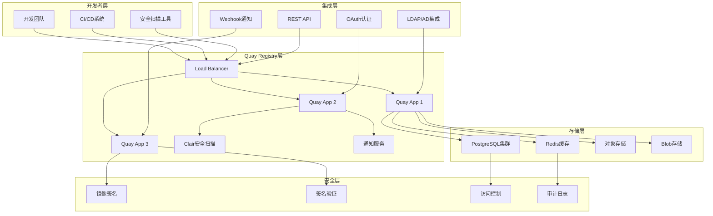

> **生产环境安全提示**
>
> 本文档包含可直接执行的运维命令。执行前请确认：当前目标集群与 Namespace 是否正确；是否具备足够的 RBAC 权限；是否已在非生产环境验证。命令风险等级标注：🔴 高风险（可能造成数据丢失或服务中断）、🟡 中风险（会修改集群状态，但通常可回滚）、🟢 低风险/只读（信息收集，无副作用）。


# Quay Container Registry 企业级镜像管理深度实践

<!-- chunk: 概述 (Overview) -->## 概述 (Overview)

Quay Container Registry是由Red Hat开发的企业级容器镜像仓库，提供安全的镜像存储、漏洞扫描、签名验证和团队协作功能。本文档从企业级DevOps专家角度，深入探讨Quay的架构设计、安全特性、CI/CD集成和最佳实践。

Quay Container Registry is an enterprise container image registry developed by Red Hat that provides secure image storage, vulnerability scanning, signature verification, and team collaboration features. This document explores Quay's architecture design, security features, CI/CD integration, and best practices from an enterprise DevOps expert perspective.

<!-- chunk: 架构设计 (Architecture Design) -->## 架构设计 (Architecture Design)

## Quay 企业级架构 (Enterprise Quay Architecture)

```yaml
# Quay 集群部署配置
quay_enterprise:
  version: "3.8"
  deployment:
    architecture: "highly_available"
    nodes:
      app_nodes:
        - node_id: "quay-app-1"
          role: "application"
          replicas: 3
          resources:
            cpu: "2"
            memory: "4Gi"
            
        - node_id: "quay-app-2"
          role: "application"
          replicas: 3
          resources:
            cpu: "2"
            memory: "4Gi"
            
        - node_id: "quay-app-3"
          role: "application"
          replicas: 3
          resources:
            cpu: "2"
            memory: "4Gi"
            
      database_nodes:
        - node_id: "quay-db-1"
          role: "database_primary"
          resources:
            cpu: "4"
            memory: "8Gi"
            
        - node_id: "quay-db-2"
          role: "database_replica"
          resources:
            cpu: "4"
            memory: "8Gi"
            
        - node_id: "quay-db-3"
          role: "database_replica"
          resources:
            cpu: "4"
            memory: "8Gi"
          
    storage:
      type: "ceph_rgw"
      bucket_name: "quay-registry"
      region: "us-east-1"
      encryption: "AES256"
      
    load_balancer:
      type: "haproxy"
      ssl_termination: true
      health_checks:
        interval: "30s"
        timeout: "5s"
```

## 架构图 (Architecture Diagram)



<!-- chunk: 核心功能配置 (Core Functionality Configuration) -->## 核心功能配置 (Core Functionality Configuration)

## 镜像仓库配置 (Registry Configuration)

```yaml
# Quay 核心配置
quay_configuration:
  # 基础配置
  server:
    hostname: "quay.company.com"
    tls:
      enabled: true
      certificate: "/etc/quay/certs/tls.crt"
      key: "/etc/quay/certs/tls.key"
      
  # 数据库存储配置
  database:
    type: "postgresql"
    host: "quay-db-cluster"
    port: 5432
    name: "quay"
    username: "quay_user"
    password: "${QUAY_DB_PASSWORD}"
    ssl_mode: "require"
    
  # Redis缓存配置
  redis:
    host: "quay-redis-cluster"
    port: 6379
    password: "${QUAY_REDIS_PASSWORD}"
    ssl: true
    
  # 对象存储配置
  storage:
    type: "s3"
    s3_bucket: "quay-registry-storage"
    s3_region: "us-east-1"
    s3_access_key: "${AWS_ACCESS_KEY_ID}"
    s3_secret_key: "${AWS_SECRET_ACCESS_KEY}"
    storage_path: "/datastorage/registry"
    
  # 镜像存储配置
  blob_storage:
    type: "s3"
    s3_bucket: "quay-blob-storage"
    s3_region: "us-east-1"
    s3_access_key: "${AWS_ACCESS_KEY_ID}"
    s3_secret_key: "${AWS_SECRET_ACCESS_KEY}"
    
  # 安全扫描配置
  security_scanner:
    enabled: true
    scanner_type: "clair"
    clair_endpoint: "http://clair:6060"
    periodic_scanning: true
    scan_on_push: true
```

## 组织和仓库配置 (Organization and Repository Configuration)

```json
{
  "organization_config": {
    "engineering": {
      "name": "Engineering Organization",
      "description": "Engineering team container images",
      "visibility": "private",
      "members": [
        {
          "username": "dev-team",
          "role": "admin"
        },
        {
          "username": "qa-team",
          "role": "write"
        },
        {
          "username": "ops-team",
          "role": "read"
        }
      ],
      "teams": {
        "developers": {
          "description": "Application developers",
          "members": ["alice", "bob", "charlie"],
          "permissions": ["push", "pull"]
        },
        "operators": {
          "description": "Platform operators",
          "members": ["dave", "eve"],
          "permissions": ["pull"]
        }
      },
      "repositories": {
        "web-app": {
          "description": "Main web application",
          "visibility": "private",
          "mutable_tags": false,
          "trust_enabled": true,
          "security_scan_enabled": true,
          "notifications": {
            "vulnerability_found": {
              "enabled": true,
              "severity_threshold": "high",
              "channels": ["slack", "email"]
            },
            "image_pushed": {
              "enabled": true,
              "channels": ["webhook"]
            }
          }
        },
        "api-service": {
          "description": "Backend API service",
          "visibility": "private",
          "mutable_tags": true,
          "trust_enabled": true,
          "security_scan_enabled": true
        }
      }
    },
    
    "data-science": {
      "name": "Data Science Organization",
      "description": "ML and data science images",
      "visibility": "protected",
      "members": [
        {
          "username": "ml-team",
          "role": "admin"
        }
      ],
      "repositories": {
        "ml-models": {
          "description": "Machine learning models",
          "visibility": "protected",
          "mutable_tags": false,
          "trust_enabled": true,
          "security_scan_enabled": true
        },
        "jupyter-notebooks": {
          "description": "Jupyter notebook environments",
          "visibility": "protected",
          "mutable_tags": true,
          "trust_enabled": false,
          "security_scan_enabled": true
        }
      }
    }
  }
}
```

<!-- chunk: 安全特性 (Security Features) -->## 安全特性 (Security Features)

## 镜像签名和验证 (Image Signing and Verification)

```yaml
# 镜像签名配置
image_signing:
  # Cosign 签名配置
  cosign:
    enabled: true
    key_management:
      type: "kms"
      provider: "aws"
      key_id: "arn:aws:kms:us-east-1:123456789:key/quay-signing-key"
      
    signing_policy:
      - name: "production_images"
        repositories: ["engineering/web-app", "engineering/api-service"]
        required_signatures: 2
        trusted_keys:
          - "cosign.pub"
          - "security-team.pub"
          
      - name: "ml_images"
        repositories: ["data-science/*"]
        required_signatures: 1
        trusted_keys:
          - "ml-team.pub"
          
  # Notary V2 签名配置
  notary_v2:
    enabled: true
    server_url: "https://notary.quay.company.com"
    trust_pinning:
      certs:
        "quay.company.com": 
          - "notary-ca.crt"
```

## 漏洞扫描配置 (Vulnerability Scanning Configuration)

```json
{
  "vulnerability_scanning": {
    "clair_configuration": {
      "scanner": {
        "updater": {
          "interval": "2h",
          "enabled_updaters": [
            "alpine",
            "aws",
            "debian",
            "oracle",
            "photon",
            "pyupio",
            "rhel",
            "suse",
            "ubuntu"
          ]
        },
        "matcher": {
          "namespaces": [
            "alpine:*",
            "amazon:*",
            "debian:*",
            "oracle:*",
            "photon:*",
            "rhel:*",
            "suse:*",
            "ubuntu:*"
          ]
        }
      },
      
      "policy": {
        "prevent_vulnerable_images": {
          "enabled": true,
          "severity_threshold": "high",
          "action": "reject_pull"
        },
        
        "scan_on_push": {
          "enabled": true,
          "timeout": "30m"
        },
        
        "periodic_rescan": {
          "enabled": true,
          "interval": "24h",
          "max_concurrent_scans": 5
        }
      },
      
      "notifications": {
        "vulnerability_found": {
          "enabled": true,
          "severity_levels": ["critical", "high"],
          "channels": ["email", "slack", "webhook"],
          "template": {
            "subject": "Vulnerability Alert: {{.Repository}}:{{.Tag}}",
            "body": "High severity vulnerability found in {{.Repository}}:{{.Tag}}\nCVE: {{.CVE}}\nSeverity: {{.Severity}}\nFixed in: {{.FixedIn}}"
          }
        }
      }
    }
  }
}
```

## 访问控制配置 (Access Control Configuration)

```yaml
# 访问控制和权限管理
access_control:
  # LDAP/AD 集成配置
  ldap:
    enabled: true
    server_uri: "ldaps://ldap.company.com:636"
    bind_dn: "cn=admin,dc=company,dc=com"
    bind_password: "${LDAP_BIND_PASSWORD}"
    
    base_dn: "ou=people,dc=company,dc=com"
    user_filter: "(&(objectClass=person)(uid={username}))"
    group_base_dn: "ou=groups,dc=company,dc=com"
    group_filter: "(&(objectClass=groupOfNames)(member={userdn}))"
    
    # 用户属性映射
    user_attributes:
      username: "uid"
      email: "mail"
      full_name: "cn"
      
  # OAuth 集成配置
  oauth:
    google:
      enabled: true
      client_id: "${GOOGLE_CLIENT_ID}"
      client_secret: "${GOOGLE_CLIENT_SECRET}"
      redirect_uri: "https://quay.company.com/oauth2/google/callback"
      
    github:
      enabled: true
      client_id: "${GITHUB_CLIENT_ID}"
      client_secret: "${GITHUB_CLIENT_SECRET}"
      redirect_uri: "https://quay.company.com/oauth2/github/callback"
      organization: "company-org"
      
  # 角色基础访问控制
  rbac:
    roles:
      - name: "registry_admin"
        permissions:
          - "super_user"
          - "administer_organization"
          - "manage_users"
          
      - name: "org_admin"
        permissions:
          - "administer_organization"
          - "create_repository"
          - "manage_team"
          
      - name: "developer"
        permissions:
          - "push_repository"
          - "pull_repository"
          - "change_visibility"
          
      - name: "reader"
        permissions:
          - "pull_repository"
          
    default_permissions:
      anonymous_access: false
      guest_access: false
```

<!-- chunk: CI/CD 集成 (CI/CD Integration) -->## CI/CD 集成 (CI/CD Integration)

## Jenkins 集成配置 (Jenkins Integration Configuration)

```groovy
// Jenkins Pipeline 集成脚本
pipeline {
    agent any
    
    environment {
        QUAY_REGISTRY = 'quay.company.com'
        QUAY_USERNAME = credentials('quay-username')
        QUAY_PASSWORD = credentials('quay-password')
        IMAGE_NAME = "${QUAY_REGISTRY}/engineering/web-app"
    }
    
    stages {
        stage('Build') {
            steps {
                script {
                    // 构建 Docker 镜像
                    sh '''
                        docker build -t ${IMAGE_NAME}:${BUILD_NUMBER} .
                        docker tag ${IMAGE_NAME}:${BUILD_NUMBER} ${IMAGE_NAME}:latest
                    '''
                }
            }
        }
        
        stage('Security Scan') {
            steps {
                script {
                    // 运行安全扫描
                    sh '''
                        # 使用 Trivy 进行安全扫描
                        trivy image --exit-code 1 --severity HIGH,CRITICAL ${IMAGE_NAME}:${BUILD_NUMBER}
                        
                        # 如果扫描通过，则推送到 Quay
                        docker push ${IMAGE_NAME}:${BUILD_NUMBER}
                        docker push ${IMAGE_NAME}:latest
                    '''
                }
            }
        }
        
        stage('Sign Image') {
            steps {
                script {
                    // 使用 Cosign 对镜像进行签名
                    sh '''
                        cosign sign --key env://COSIGN_PRIVATE_KEY \
                            ${IMAGE_NAME}:${BUILD_NUMBER}
                            
                        cosign sign --key env://COSIGN_PRIVATE_KEY \
                            ${IMAGE_NAME}:latest
                    '''
                }
            }
        }
        
        stage('Notify Quay') {
            steps {
                script {
                    // 通知 Quay 新镜像推送
                    sh '''
                        curl -X POST \
                            -H "Authorization: Bearer ${QUAY_API_TOKEN}" \
                            -H "Content-Type: application/json" \
                            -d '{
                                "repository": "engineering/web-app",
                                "tag": "${BUILD_NUMBER}",
                                "docker_url": "${IMAGE_NAME}:${BUILD_NUMBER}"
                            }' \
                            https://${QUAY_REGISTRY}/api/v1/repository/engineering/web-app/tag/${BUILD_NUMBER}
                    '''
                }
            }
        }
    }
    
    post {
        success {
            slackSend channel: '#ci-cd', 
                     color: 'good', 
                     message: "✅ Build ${BUILD_NUMBER} completed successfully. Image pushed to ${IMAGE_NAME}:${BUILD_NUMBER}"
        }
        failure {
            slackSend channel: '#ci-cd',
                     color: 'danger',
                     message: "❌ Build ${BUILD_NUMBER} failed"
        }
    }
}
```

## GitLab CI 集成配置 (GitLab CI Integration Configuration)

```yaml
# .gitlab-ci.yml - GitLab CI 集成配置
stages:
  - build
  - scan
  - sign
  - deploy

variables:
  QUAY_REGISTRY: quay.company.com
  IMAGE_NAME: $QUAY_REGISTRY/engineering/web-app
  COSIGN_EXPERIMENTAL: "1"

before_script:
  - docker login -u $QUAY_USERNAME -p $QUAY_PASSWORD $QUAY_REGISTRY

build_image:
  stage: build
  image: docker:20.10.16
  services:
    - docker:20.10.16-dind
  script:
    - |
      docker build -t $IMAGE_NAME:$CI_COMMIT_SHA .
      docker tag $IMAGE_NAME:$CI_COMMIT_SHA $IMAGE_NAME:latest
      docker push $IMAGE_NAME:$CI_COMMIT_SHA
      docker push $IMAGE_NAME:latest
  only:
    - main
    - develop

security_scan:
  stage: scan
  image: aquasec/trivy:latest
  script:
    - |
      trivy image --exit-code 1 --severity HIGH,CRITICAL $IMAGE_NAME:$CI_COMMIT_SHA
  only:
    - main
    - develop

sign_image:
  stage: sign
  image: bitnami/cosign:latest
  script:
    - |
      cosign sign --key env://COSIGN_PRIVATE_KEY $IMAGE_NAME:$CI_COMMIT_SHA
      cosign sign --key env://COSIGN_PRIVATE_KEY $IMAGE_NAME:latest
  only:
    - main

deploy_to_staging:
  stage: deploy
  script:
    - |
      # 部署到预发布环境
      kubectl set image deployment/web-app web-app=$IMAGE_NAME:$CI_COMMIT_SHA -n staging
  only:
    - develop

deploy_to_production:
  stage: deploy
  when: manual
  script:
    - |
      # 部署到生产环境
      kubectl set image deployment/web-app web-app=$IMAGE_NAME:$CI_COMMIT_SHA -n production
  only:
    - main
```

<!-- chunk: 监控和告警 (Monitoring and Alerting) -->## 监控和告警 (Monitoring and Alerting)

## Prometheus 监控配置 (Prometheus Monitoring Configuration)

```yaml
# Prometheus 监控配置
prometheus_config:
  scrape_configs:
    - job_name: 'quay-metrics'
      static_configs:
        - targets: ['quay-app-1:9091', 'quay-app-2:9091', 'quay-app-3:9091']
      metrics_path: '/metrics'
      scrape_interval: 30s
      
    - job_name: 'quay-health'
      static_configs:
        - targets: ['quay-app-1:8082', 'quay-app-2:8082', 'quay-app-3:8082']
      metrics_path: '/health/instance'
      scrape_interval: 10s
      
  alerting:
    alertmanagers:
      - static_configs:
          - targets: ['alertmanager:9093']

# 关键监控指标
key_metrics:
  # 镜像相关指标
  - name: "quay_registry_image_push_total"
    description: "Total number of image pushes"
    type: "counter"
    
  - name: "quay_registry_image_pull_total"
    description: "Total number of image pulls"
    type: "counter"
    
  - name: "quay_registry_vulnerable_images"
    description: "Number of images with vulnerabilities"
    type: "gauge"
    
  # 性能指标
  - name: "quay_registry_request_duration_seconds"
    description: "Request duration in seconds"
    type: "histogram"
    
  - name: "quay_registry_concurrent_requests"
    description: "Number of concurrent requests"
    type: "gauge"
    
  # 存储指标
  - name: "quay_registry_storage_used_bytes"
    description: "Storage space used in bytes"
    type: "gauge"
    
  - name: "quay_registry_blob_count"
    description: "Number of blobs stored"
    type: "gauge"
```

## 告警规则配置 (Alert Rules Configuration)

```yaml
# Prometheus 告警规则
alert_rules:
  # 镜像安全告警
  - alert: HighVulnerabilityImages
    expr: quay_registry_vulnerable_images{severity="high"} > 0
    for: 5m
    labels:
      severity: critical
    annotations:
      summary: "High vulnerability images detected"
      description: "{{ $value }} images with high severity vulnerabilities in registry"
      
  - alert: CriticalVulnerabilityImages
    expr: quay_registry_vulnerable_images{severity="critical"} > 0
    for: 1m
    labels:
      severity: critical
    annotations:
      summary: "Critical vulnerability images detected"
      description: "{{ $value }} images with critical vulnerabilities in registry"
      
  # 性能告警
  - alert: HighRequestLatency
    expr: histogram_quantile(0.95, rate(quay_registry_request_duration_seconds_bucket[5m])) > 2
    for: 5m
    labels:
      severity: warning
    annotations:
      summary: "High request latency"
      description: "95th percentile request latency above 2 seconds"
      
  - alert: HighErrorRate
    expr: rate(quay_registry_http_requests_total{status=~"5.."}[5m]) / rate(quay_registry_http_requests_total[5m]) > 0.05
    for: 5m
    labels:
      severity: warning
    annotations:
      summary: "High error rate"
      description: "Error rate above 5%"
      
  # 存储告警
  - alert: LowStorageSpace
    expr: quay_registry_storage_used_bytes / quay_registry_storage_total_bytes * 100 > 85
    for: 10m
    labels:
      severity: warning
    annotations:
      summary: "Low storage space"
      description: "Storage usage above 85%"
      
  - alert: RegistryUnavailable
    expr: up{job="quay-health"} == 0
    for: 2m
    labels:
      severity: critical
    annotations:
      summary: "Registry unavailable"
      description: "Quay registry is not responding"
```

<!-- chunk: 运维管理 (Operational Management) -->## 运维管理 (Operational Management)

## 日常维护脚本 (Daily Maintenance Scripts)

```bash
#!/bin/bash
# Quay Registry 日常运维脚本

# 环境变量配置
QUAY_HOST="quay.company.com"
QUAY_ADMIN_USER="admin"
QUAY_ADMIN_PASS="${QUAY_ADMIN_PASSWORD}"
API_TOKEN="${QUAY_API_TOKEN}"

# 健康检查
check_health() {
    echo "=== Quay Registry Health Check ==="
    
    # 检查服务状态
    health_status=$(curl -s -k -u "${QUAY_ADMIN_USER}:${QUAY_ADMIN_PASS}" \
        "https://${QUAY_HOST}/health/instance")
    
    if echo "$health_status" | grep -q "true"; then
        echo "✅ Quay registry is healthy"
    else
        echo "❌ Quay registry health check failed"
        echo "$health_status"
        return 1
    fi
    
    # 检查组件状态
    component_status=$(curl -s -k -u "${QUAY_ADMIN_USER}:${QUAY_ADMIN_PASS}" \
        "https://${QUAY_HOST}/health/endtoend")
    
    echo "Component Status:"
    echo "$component_status" | jq -r 'to_entries[] | "  \(.key): \(.value.status)"'
}

# 镜像清理
cleanup_images() {
    echo "=== Image Cleanup ==="
    
    # 获取未标记的镜像
    untagged_images=$(curl -s -H "Authorization: Bearer ${API_TOKEN}" \
        "https://${QUAY_HOST}/api/v1/repository?last_modified=false&popularity=false&public=false&starred=false")
    
    echo "Untagged images found:"
    echo "$untagged_images" | jq -r '.repositories[] | select(.tag == null) | "\(.namespace)/\(.name)"'
    
    # 删除超过30天的未标记镜像
    cutoff_date=$(date -d "30 days ago" +%s)
    
    echo "$untagged_images" | jq -r --arg cutoff "$cutoff_date" \
        '.repositories[] | select(.last_modified < ($cutoff | tonumber)) | "\(.namespace)/\(.name):\(.tag)"' | \
        while read image; do
            echo "Deleting old untagged image: $image"
            # 实际删除逻辑需要根据API调整
        done
}

# 安全扫描状态检查
check_security_scans() {
    echo "=== Security Scan Status ==="
    
    # 获取有漏洞的镜像
    vulnerable_images=$(curl -s -H "Authorization: Bearer ${API_TOKEN}" \
        "https://${QUAY_HOST}/api/v1/repository?last_modified=true")
    
    echo "Vulnerable images:"
    echo "$vulnerable_images" | jq -r '.repositories[] | select(.vulnerabilities.high > 0 or .vulnerabilities.critical > 0) | 
        "\(.namespace)/\(.name):\(.tag) - High: \(.vulnerabilities.high), Critical: \(.vulnerabilities.critical)"'
}

# 备份管理
manage_backups() {
    echo "=== Backup Management ==="
    
    backup_dir="/backup/quay/$(date +%Y%m%d_%H%M%S)"
    mkdir -p "$backup_dir"
    
    # 备份数据库
    echo "Backing up database..."
    pg_dump -h quay-db-cluster -U quay_user -d quay > "${backup_dir}/quay_database.sql"
    
    # 备份配置
    echo "Backing up configuration..."
    curl -s -k -u "${QUAY_ADMIN_USER}:${QUAY_ADMIN_PASS}" \
        "https://${QUAY_HOST}/api/v1/superuser/config" \
        > "${backup_dir}/quay_config.json"
    
    # 备份用户数据
    echo "Backing up user data..."
    curl -s -k -u "${QUAY_ADMIN_USER}:${QUAY_ADMIN_PASS}" \
        "https://${QUAY_HOST}/api/v1/superuser/users" \
        > "${backup_dir}/quay_users.json"
    
    echo "Backup completed: $backup_dir"
}

# 性能监控
monitor_performance() {
    echo "=== Performance Monitoring ==="
    
    # 获取性能指标
    metrics=$(curl -s "https://${QUAY_HOST}/metrics")
    
    # 分析关键指标
    echo "Request rates:"
    echo "$metrics" | grep "quay_registry_http_requests_total" | tail -5
    
    echo "Storage usage:"
    echo "$metrics" | grep "quay_registry_storage_used_bytes"
    
    echo "Concurrent connections:"
    echo "$metrics" | grep "quay_registry_concurrent_requests"
}

# 主执行函数
main() {
    echo "🚀 Starting Quay Registry Operations Management"
    echo "Timestamp: $(date)"
    echo "========================================"
    
    check_health
    echo
    cleanup_images
    echo
    check_security_scans
    echo
    manage_backups
    echo
    monitor_performance
    
    echo "========================================"
    echo "✅ Quay Registry Operations Management Completed"
}

# 执行主函数
main
```

<!-- chunk: 最佳实践 (Best Practices) -->## 最佳实践 (Best Practices)

## 镜像管理最佳实践 (Image Management Best Practices)

1. **镜像标签策略**
   ```yaml
   # 标准化镜像标签
   image_tagging_strategy:
     development:
       format: "dev-{branch}-{sha}"
       retention: "7 days"
       
     staging:
       format: "staging-{version}-{timestamp}"
       retention: "30 days"
       
     production:
       format: "v{major}.{minor}.{patch}"
       retention: "indefinite"
       signing_required: true
   ```

2. **安全扫描策略**
   ```yaml
   # 安全扫描策略
   security_scanning_policy:
     scan_on_push: true
     periodic_rescan: "24h"
     vulnerability_threshold:
       critical: "reject"
       high: "warn_and_notify"
       medium: "log_only"
     base_image_updates: true
   ```

3. **访问控制最佳实践**
   ```yaml
   # 最小权限原则
   access_control_best_practices:
     principle_of_least_privilege: true
     role_based_access: true
     temporary_access: true
     audit_logging: true
     
     team_structure:
       admins: ["platform-team"]
       developers: ["app-teams"]
       readers: ["auditors", "qa-team"]
   ```

## 运维最佳实践 (Operations Best Practices)

1. **高可用部署**
   ```yaml
   # HA 部署配置
   high_availability:
     minimum_nodes: 3
     load_balancing: "round_robin"
     database_replication: "postgresql_streaming"
     storage_redundancy: "multi_az"
     backup_frequency: "hourly"
   ```

2. **监控告警策略**
   ```yaml
   # 分层监控策略
   monitoring_strategy:
     infrastructure:
       metrics: ["cpu", "memory", "disk", "network"]
       alert_threshold: "80%"
       
     application:
       metrics: ["response_time", "error_rate", "throughput"]
       alert_threshold: "95th_percentile"
       
     business:
       metrics: ["image_pull_success", "vulnerability_count"]
       alert_threshold: "sla_based"
   ```

3. **灾难恢复计划**
   ```yaml
   # 灾难恢复配置
   disaster_recovery:
     backup_frequency: "hourly_database, daily_full"
     recovery_point_objective: "1h"
     recovery_time_objective: "4h"
     cross_region_replication: true
     failover_testing: "monthly"
   ```

---

**文档版本**: v1.0  
**最后更新**: 2024年2月7日  
**适用版本**: Quay Container Registry 3.8+

---

<!-- chunk: Obsidian 相关文档 -->## Obsidian 相关文档

- domain-22-container-image-management KUDIG Database — Global MOC
- [[domain-13-container-runtime/README.md|Domain 13: 容器镜像管理 (Container Image Management)]]
- Domain-22 容器镜像管理 — 开源项目索引
- Harbor企业级容器镜像仓库深度实践
- Docker Registry企业级镜像分发深度实践
- JFrog Artifactory Enterprise Container Registry Platform
- Harbor企业级镜像安全扫描深度实践
- GitLab Container Registry Enterprise 深度实践
- Amazon ECR (Elastic Container Registry) Enterprise 深度实践
- Harbor 企业级镜像仓库部署指南

## See Also

- 03-jfrog-artifactory-enterprise
- 04-harbor-enterprise-security-scanning
- 05-gitlab-container-registry-enterprise
- 06-amazon-ecr-enterprise


<!-- risk-assessed -->
