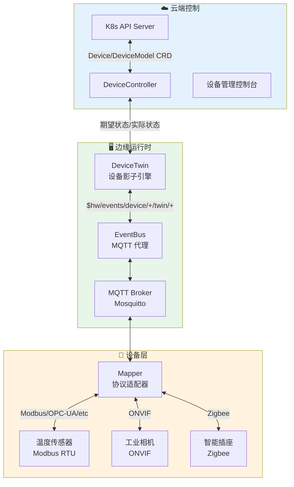
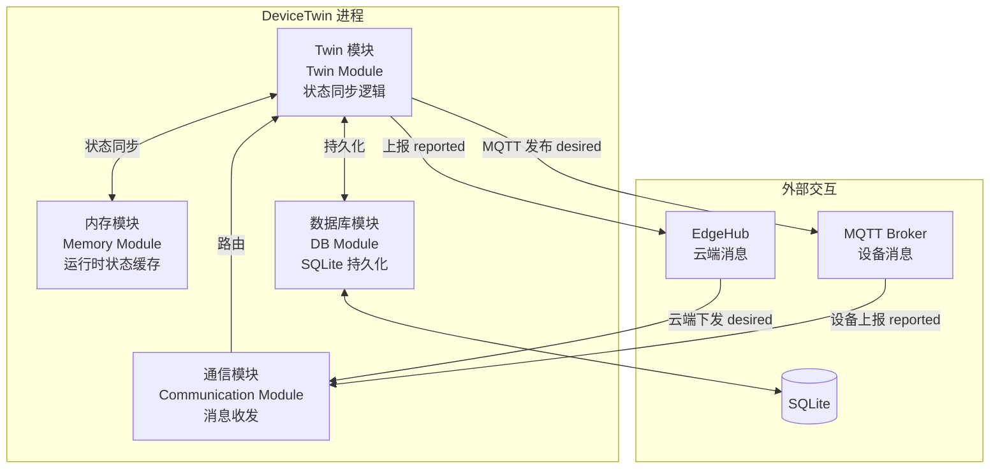
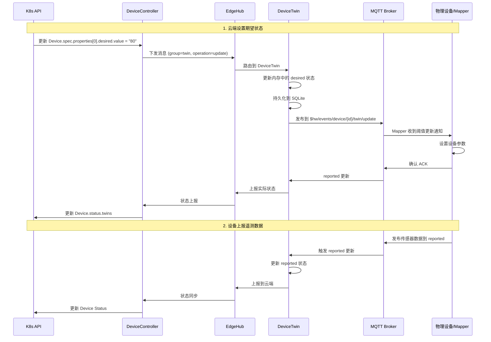
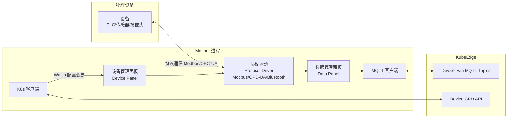
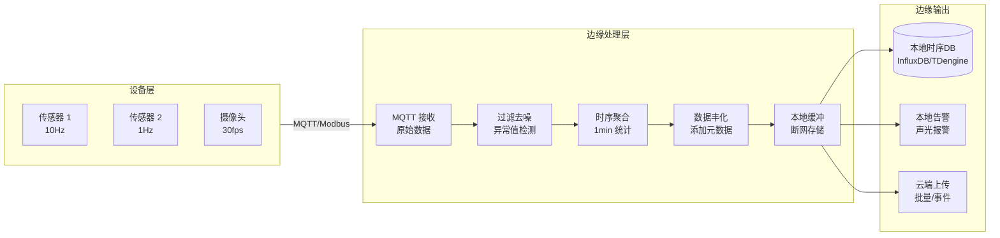
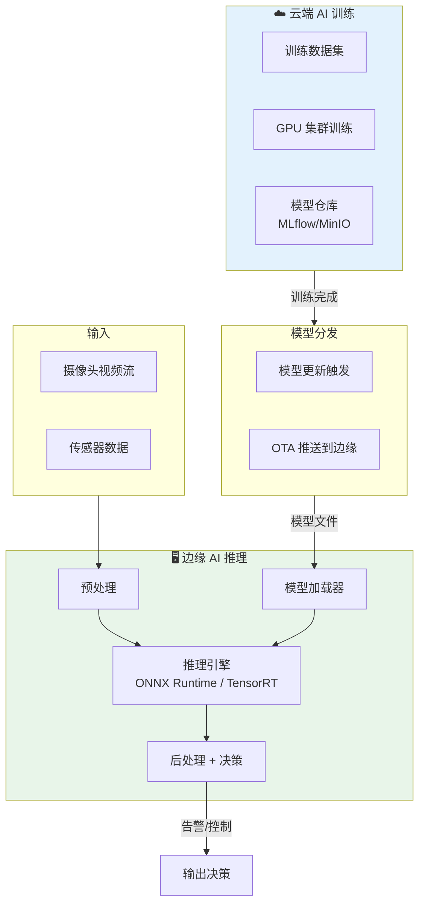

> **生产环境安全提示**
>
> 本文档包含可直接执行的运维命令。执行前请确认：当前目标集群与 Namespace 是否正确；是否具备足够的 RBAC 权限；是否已在非生产环境验证。命令风险等级标注：🔴 高风险（可能造成数据丢失或服务中断）、🟡 中风险（会修改集群状态，但通常可回滚）、🟢 低风险/只读（信息收集，无副作用）。


# [[KubeEdge|KubeEdge]] 设备管理与边缘应用 (KubeEdge Device Management and Edge Applications)

<!-- chunk: 目录 (Table of Contents) -->## 目录 (Table of Contents)

1. [设备管理概述](#1-设备管理概述)
2. [DeviceModel 设备模型](#2-devicemodel-设备模型)
3. [Device CRD 设备实例](#3-device-crd-设备实例)
4. [DeviceTwin 机制详解](#4-devicetwin-机制详解)
5. [MQTT 协议与集成](#5-mqtt-协议与集成)
6. [Mapper 框架](#6-mapper-框架)
7. [边缘应用部署](#7-边缘应用部署)
8. [数据采集与处理](#8-数据采集与处理)
9. [消息路由规则](#9-消息路由规则)
10. [边缘 AI 推理](#10-边缘-ai-推理)
11. [实践案例](#11-实践案例)
12. [故障排查](#12-故障排查)

---

<!-- chunk: 1. 设备管理概述 -->## 1. 设备管理概述

## 1.1 KubeEdge 设备管理架构 (Device Management Architecture)

KubeEdge 通过扩展 [[Kubernetes|Kubernetes]] CRD 机制，将 IoT 设备作为 Kubernetes 的一等公民进行管理，实现了云端统一管控物理设备的能力。



## 1.2 核心概念 (Core Concepts)

```
KubeEdge 设备管理核心概念:

┌─────────────────────────────────────────────────────┐
│ DeviceModel (设备模型)                               │
│   - 定义设备类型的属性模板                            │
│   - 类似 K8s 的 CRD 模板                            │
│   - 例: "温度传感器模型" 包含 temperature/humidity    │
├─────────────────────────────────────────────────────┤
│ Device (设备实例)                                    │
│   - 基于 DeviceModel 的具体设备                      │
│   - 包含期望状态 (desired) 和实际状态 (reported)     │
│   - 例: "工厂A 1号温度传感器"                         │
├─────────────────────────────────────────────────────┤
│ DeviceTwin (设备影子)                                │
│   - 设备数字孪生                                     │
│   - 存储 desired/reported 状态                      │
│   - 实现云边状态同步                                  │
├─────────────────────────────────────────────────────┤
│ Mapper (映射器)                                      │
│   - 协议适配层                                       │
│   - 连接物理设备和 DeviceTwin                        │
│   - 支持: Modbus, OPC-UA, Bluetooth, HTTP 等        │
└─────────────────────────────────────────────────────┘
```

---

<!-- chunk: 2. DeviceModel 设备模型 -->## 2. DeviceModel 设备模型

## 2.1 DeviceModel 结构 (DeviceModel Structure)

```yaml
# DeviceModel 定义 - 温湿度传感器模型
apiVersion: devices.kubeedge.io/v1beta1
kind: DeviceModel
metadata:
  name: temperature-humidity-sensor
  namespace: default
  labels:
    description: "DHT22 温湿度传感器模型"
    manufacturer: "Generic"
    model: "DHT22"
spec:
  # 属性定义 - 传感器可读/可写的数据点
  properties:
    # 温度属性
    - name: temperature
      description: "环境温度"
      type:
        float:
          accessMode: ReadOnly    # 只读
          defaultValue: 0.0
          unit: "摄氏度 (°C)"
          minimum: -40.0
          maximum: 80.0
          
    # 湿度属性
    - name: humidity
      description: "相对湿度"
      type:
        float:
          accessMode: ReadOnly
          defaultValue: 0.0
          unit: "百分比 (%RH)"
          minimum: 0.0
          maximum: 100.0
          
    # 报警阈值 (可写配置)
    - name: temperature-alarm-threshold
      description: "温度告警阈值"
      type:
        float:
          accessMode: ReadWrite   # 可读写
          defaultValue: 85.0
          unit: "摄氏度 (°C)"
          
    # 采样间隔 (可写配置)
    - name: sampling-interval
      description: "数据采样间隔"
      type:
        int:
          accessMode: ReadWrite
          defaultValue: 5000    # 毫秒
          unit: "ms"
          minimum: 1000
          maximum: 60000
```

## 2.2 工业设备模型示例 (Industrial Device Model)

```yaml
# DeviceModel - 西门子 S7 PLC 模型
apiVersion: devices.kubeedge.io/v1beta1
kind: DeviceModel
metadata:
  name: siemens-s7-plc
  namespace: industrial
spec:
  properties:
    # DB 块读取 - 生产计数
    - name: production-count
      description: "当前班次生产数量"
      type:
        int:
          accessMode: ReadOnly
          unit: "件"
          
    # 设备状态
    - name: machine-status
      description: "机器运行状态"
      type:
        string:
          accessMode: ReadOnly
          # 枚举值
      # 可能值: "running", "idle", "error", "maintenance"
      
    # 转速控制 (可写)
    - name: motor-speed-setpoint
      description: "电机转速设定值"
      type:
        int:
          accessMode: ReadWrite
          unit: "RPM"
          minimum: 0
          maximum: 3000
          
    # 急停控制
    - name: emergency-stop
      description: "急停信号"
      type:
        boolean:
          accessMode: ReadWrite
          defaultValue: false
          
    # 问题代码
    - name: fault-code
      description: "当前问题代码"
      type:
        int:
          accessMode: ReadOnly
          defaultValue: 0
```

## 2.3 属性数据类型 (Property Data Types)

```yaml
# KubeEdge 支持的属性类型
property_types:
  int:
    accessMode: ReadOnly | ReadWrite
    defaultValue: 0
    minimum: -2147483648
    maximum: 2147483647
    unit: "string"
    
  float:
    accessMode: ReadOnly | ReadWrite
    defaultValue: 0.0
    minimum: -3.4e38
    maximum: 3.4e38
    unit: "string"
    
  double:
    accessMode: ReadOnly | ReadWrite
    defaultValue: 0.0
    unit: "string"
    
  boolean:
    accessMode: ReadOnly | ReadWrite
    defaultValue: false
    
  string:
    accessMode: ReadOnly | ReadWrite
    defaultValue: ""
    
  bytes:
    accessMode: ReadOnly
    # 用于二进制数据
```

---

<!-- chunk: 3. Device CRD 设备实例 -->## 3. Device CRD 设备实例

## 3.1 Device 完整定义 (Complete Device Definition)

```yaml
# Device 实例 - 工厂 A 1号温湿度传感器
apiVersion: devices.kubeedge.io/v1beta1
kind: Device
metadata:
  name: factory-a-temp-sensor-001
  namespace: default
  labels:
    location: factory-a
    zone: production-line-1
    type: temperature-sensor
spec:
  # 引用 DeviceModel
  deviceModelRef:
    name: temperature-humidity-sensor
    
  # 节点选择 - 指定运行在哪个边缘节点
  nodeName: edge-node-factory-a
  
  # 协议配置 - 如何连接设备
  protocol:
    # Modbus RTU 协议
    modbus:
      slaveID: 1
    serialPort:
      port: "/dev/ttyS0"
      baudRate: 9600
      dataBits: 8
      parity: "N"
      stopBits: 1
      
  # 属性访问配置 - 如何读写具体属性
  properties:
    # 温度属性配置
    - name: temperature
      desired:
        metadata:
          type: float
      visitors:
        modbus:
          register: HoldingRegister
          offset: 0          # 寄存器偏移
          limit: 1           # 读取寄存器数量
          scale: 0.1         # 缩放系数 (原始值 * 0.1 = 实际值)
          isSwap: false
          isRegisterSwap: false
      collectCycle: 5000     # 采集间隔 ms
      reportCycle: 5000      # 上报间隔 ms
      reportToCloud: true    # 是否上报云端
      
    # 湿度属性配置
    - name: humidity
      desired:
        metadata:
          type: float
      visitors:
        modbus:
          register: HoldingRegister
          offset: 1
          limit: 1
          scale: 0.1
      collectCycle: 5000
      reportCycle: 5000
      reportToCloud: true
      
    # 报警阈值配置
    - name: temperature-alarm-threshold
      desired:
        value: "85.0"
        metadata:
          type: float
          timestamp: "1704067200000"
      visitors:
        modbus:
          register: HoldingRegister
          offset: 10
          limit: 1
          scale: 1.0
      collectCycle: 60000
      reportCycle: 60000
      
status:
  # 设备实际状态 (由 Mapper 更新)
  twins:
    - propertyName: temperature
      reported:
        value: "23.5"
        metadata:
          type: float
          timestamp: "1704067195000"
    - propertyName: humidity
      reported:
        value: "65.2"
        metadata:
          type: float
          timestamp: "1704067195000"
```

## 3.2 MQTT 设备定义 (MQTT Device)

```yaml
# Device - 通过 MQTT 连接的智能设备
apiVersion: devices.kubeedge.io/v1beta1
kind: Device
metadata:
  name: smart-meter-001
  namespace: default
spec:
  deviceModelRef:
    name: smart-energy-meter
    
  nodeName: edge-node-001
  
  protocol:
    # MQTT 协议配置
    opcua:
      url: "opc.tcp://192.168.1.100:4840"
      userName: "admin"
      password: "password123"
      securityPolicy: "None"
      securityMode: "None"
      certificate: ""
      privateKey: ""
      timeout: 5000
      
  properties:
    - name: power-consumption
      visitors:
        opcua:
          nodeID: "ns=1;i=1001"  # OPC-UA 节点 ID
      collectCycle: 1000
      reportCycle: 5000
      reportToCloud: true
      
    - name: voltage
      visitors:
        opcua:
          nodeID: "ns=1;i=1002"
      collectCycle: 1000
      reportCycle: 10000
      reportToCloud: true
```

## 3.3 Bluetooth 设备定义 (Bluetooth Device)

```yaml
# Device - 蓝牙 BLE 传感器
apiVersion: devices.kubeedge.io/v1beta1
kind: Device
metadata:
  name: ble-sensor-001
  namespace: default
spec:
  deviceModelRef:
    name: ble-temperature-model
    
  nodeName: edge-node-001
  
  protocol:
    bluetooth:
      macAddress: "AA:BB:CC:DD:EE:FF"
      
  properties:
    - name: temperature
      visitors:
        bluetooth:
          characteristicUUID: "00002a6e-0000-1000-8000-00805f9b34fb"
          dataConverter:
            startIndex: 0
            endIndex: 2
            shiftRight: 0
            orderOfResult: "LittleEndian"
            operationsBeforeConvert:
              - type: "Divide"
                value: "100"
      collectCycle: 10000
      reportCycle: 30000
```

## 3.4 批量设备管理 (Bulk Device Management)

```python
# Python 脚本: 批量创建设备实例
import yaml
from kubernetes import client, config

def create_bulk_devices(device_list):
    """
    批量创建 KubeEdge 设备实例
    
    device_list: [
        {"name": "sensor-001", "node": "edge-a", "slave_id": 1, "port": "/dev/ttyS0"},
        ...
    ]
    """
    # 加载 K8s 配置
    config.load_kube_config()
    custom_api = client.CustomObjectsApi()
    
    for device_config in device_list:
        device_manifest = {
            "apiVersion": "devices.kubeedge.io/v1beta1",
            "kind": "Device",
            "metadata": {
                "name": device_config["name"],
                "namespace": "default",
                "labels": {
                    "location": device_config.get("location", "unknown"),
                    "type": "modbus-sensor"
                }
            },
            "spec": {
                "deviceModelRef": {
                    "name": "temperature-humidity-sensor"
                },
                "nodeName": device_config["node"],
                "protocol": {
                    "modbus": {
                        "slaveID": device_config["slave_id"]
                    },
                    "serialPort": {
                        "port": device_config["port"],
                        "baudRate": 9600,
                        "dataBits": 8,
                        "parity": "N",
                        "stopBits": 1
                    }
                },
                "properties": [
                    {
                        "name": "temperature",
                        "visitors": {
                            "modbus": {
                                "register": "HoldingRegister",
                                "offset": 0,
                                "limit": 1,
                                "scale": 0.1
                            }
                        },
                        "collectCycle": 5000,
                        "reportCycle": 5000,
                        "reportToCloud": True
                    }
                ]
            }
        }
        
        try:
            custom_api.create_namespaced_custom_object(
                group="devices.kubeedge.io",
                version="v1beta1",
                namespace="default",
                plural="devices",
                body=device_manifest
            )
            print(f"✅ 创建设备: {device_config['name']}")
        except Exception as e:
            print(f"❌ 创建失败 {device_config['name']}: {e}")

# 使用示例
devices = [
    {"name": f"sensor-{i:03d}", "node": f"edge-node-{(i//10)+1:02d}", 
     "slave_id": i % 10 + 1, "port": f"/dev/ttyS{i % 4}", 
     "location": f"zone-{chr(65+i//10)}"}
    for i in range(100)
]

create_bulk_devices(devices)
```

---

<!-- chunk: 4. DeviceTwin 机制详解 -->## 4. DeviceTwin 机制详解

## 4.1 DeviceTwin 内部架构 (DeviceTwin Internal Architecture)



## 4.2 DeviceTwin MQTT 主题规范 (MQTT Topic Specification)

```
KubeEdge DeviceTwin MQTT 主题规范:

# 1. 云端下发期望状态
$hw/events/device/{deviceID}/twin/update
消息体: {"event_id": "xxx", "timestamp": 1234567890, "twin": {"property": {"expected": {"value": "85"}}}}

# 2. 边缘回复期望状态同步结果
$hw/events/device/{deviceID}/twin/update/result
消息体: {"event_id": "xxx", "timestamp": 1234567890, "twin": {...}, "code": 200, "reason": ""}

# 3. 获取设备 Twin 状态
$hw/events/device/{deviceID}/twin/get
消息体: {"event_id": "xxx"}

# 4. 获取响应
$hw/events/device/{deviceID}/twin/get/result
消息体: {"event_id": "xxx", "timestamp": 1234567890, "twin": {...}}

# 5. 设备上报状态
$hw/events/node/{nodeID}/membership/updated
消息体: {"event_id": "xxx", "added_devices": [...], "removed_devices": [...]}
```

## 4.3 DeviceTwin 状态同步流程



## 4.4 DeviceTwin SQLite 存储

```sql
-- DeviceTwin 存储结构
CREATE TABLE device_twin (
    id          INTEGER PRIMARY KEY AUTOINCREMENT,
    deviceid    TEXT NOT NULL,      -- 设备 ID
    name        TEXT NOT NULL,      -- 属性名
    description TEXT,               -- 属性描述
    expected    TEXT,               -- 期望值 (JSON)
    actual      TEXT,               -- 实际值 (JSON)
    attr_type   TEXT,               -- 属性类型
    metadata    TEXT,               -- 元数据 (JSON)
    version     BIGINT DEFAULT 0,  -- 版本号
    attr_exist  BOOLEAN DEFAULT 1,
    UNIQUE(deviceid, name)
);

-- 查询设备当前状态
SELECT deviceid, name, expected, actual, version 
FROM device_twin 
WHERE deviceid = 'factory-a-temp-sensor-001';

-- 查询所有设备
SELECT DISTINCT deviceid FROM device_twin;
```

---

<!-- chunk: 5. MQTT 协议与集成 -->## 5. MQTT 协议与集成

## 5.1 MQTT Broker 部署 (MQTT Broker Deployment)

```yaml
# Mosquitto MQTT Broker 部署 (边缘 Pod)
apiVersion: apps/v1
kind: Deployment
metadata:
  name: mosquitto-broker
  namespace: edge-system
spec:
  replicas: 1
  selector:
    matchLabels:
      app: mosquitto
  template:
    metadata:
      labels:
        app: mosquitto
    spec:
      nodeSelector:
        node-role.kubernetes.io/edge: ""
      tolerations:
      - key: "node-role.kubernetes.io/edge"
        operator: "Exists"
        effect: "NoSchedule"
      containers:
      - name: mosquitto
        image: eclipse-mosquitto:2.0
        ports:
        - containerPort: 1883
          name: mqtt
        - containerPort: 8883
          name: mqtts
        - containerPort: 9001
          name: websocket
        resources:
          requests:
            cpu: "100m"
            memory: "128Mi"
          limits:
            cpu: "500m"
            memory: "512Mi"
        volumeMounts:
        - name: config
          mountPath: /mosquitto/config
        - name: data
          mountPath: /mosquitto/data
        - name: certs
          mountPath: /mosquitto/certs
      volumes:
      - name: config
        configMap:
          name: mosquitto-config
      - name: data
        hostPath:
          path: /var/mosquitto/data
          type: DirectoryOrCreate
      - name: certs
        secret:
          secretName: mosquitto-tls
          
---
apiVersion: v1
kind: Service
metadata:
  name: mosquitto
  namespace: edge-system
spec:
  selector:
    app: mosquitto
  ports:
  - name: mqtt
    port: 1883
    targetPort: 1883
  - name: mqtts
    port: 8883
    targetPort: 8883
  clusterIP: None  # Headless Service (DNS 直连)
  
---
# Mosquitto 配置
apiVersion: v1
kind: ConfigMap
metadata:
  name: mosquitto-config
  namespace: edge-system
data:
  mosquitto.conf: |
    # 监听配置
    listener 1883 0.0.0.0
    protocol mqtt
    
    listener 8883 0.0.0.0
    protocol mqtt
    cafile /mosquitto/certs/ca.crt
    certfile /mosquitto/certs/server.crt
    keyfile /mosquitto/certs/server.key
    require_certificate true
    
    listener 9001 0.0.0.0
    protocol websockets
    
    # 认证 (生产建议启用)
    allow_anonymous true
    # password_file /mosquitto/config/passwd
    
    # 持久化
    persistence true
    persistence_location /mosquitto/data/
    
    # 日志
    log_dest stdout
    log_type all
    
    # 保留消息
    max_queued_messages 1000
    max_inflight_messages 20
```

## 5.2 MQTT 消息格式 (MQTT Message Format)

```python
# 设备遥测数据上报格式
import json
import time
import paho.mqtt.client as mqtt

class DeviceTwinClient:
    def __init__(self, broker_host, broker_port, device_id):
        self.device_id = device_id
        self.client = mqtt.Client()
        self.client.connect(broker_host, broker_port)
        
    def report_twin_update(self, property_name, value, value_type="float"):
        """上报设备属性实际值到 DeviceTwin"""
        topic = f"$hw/events/device/{self.device_id}/twin/update"
        
        payload = {
            "event_id": f"evt-{int(time.time()*1000)}",
            "timestamp": int(time.time() * 1000),
            "twin": {
                property_name: {
                    "actual": {
                        "value": str(value),
                        "metadata": {
                            "type": value_type,
                            "timestamp": int(time.time() * 1000)
                        }
                    },
                    "metadata": {
                        "type": value_type
                    }
                }
            }
        }
        
        self.client.publish(
            topic, 
            json.dumps(payload), 
            qos=1,
            retain=False
        )
        
    def get_twin(self):
        """查询设备当前 Twin 状态"""
        topic = f"$hw/events/device/{self.device_id}/twin/get"
        result_topic = f"$hw/events/device/{self.device_id}/twin/get/result"
        
        # 订阅结果主题
        result = {}
        def on_message(client, userdata, msg):
            result['data'] = json.loads(msg.payload)
            
        self.client.message_callback_add(result_topic, on_message)
        self.client.subscribe(result_topic)
        
        # 发送查询
        payload = {"event_id": f"get-{int(time.time()*1000)}"}
        self.client.publish(topic, json.dumps(payload), qos=0)
        
        # 等待响应
        import time as t
        t.sleep(1)
        return result.get('data', {})
    
    def subscribe_desired_changes(self, callback):
        """订阅云端下发的期望值变更"""
        topic = f"$hw/events/device/{self.device_id}/twin/update"
        
        def on_desired(client, userdata, msg):
            data = json.loads(msg.payload)
            if 'twin' in data:
                for prop_name, prop_data in data['twin'].items():
                    if 'expected' in prop_data:
                        desired_value = prop_data['expected']['value']
                        callback(prop_name, desired_value)
                        
        self.client.message_callback_add(topic, on_desired)
        self.client.subscribe(topic)

# 使用示例
client = DeviceTwinClient("localhost", 1883, "factory-a-temp-sensor-001")
client.report_twin_update("temperature", 23.5, "float")
client.report_twin_update("humidity", 65.2, "float")

# 订阅阈值变更
def on_threshold_change(prop, value):
    print(f"收到阈值更新: {prop} = {value}")
    # 应用到实际设备
    
client.subscribe_desired_changes(on_threshold_change)
```

## 5.3 EMQ X 边缘版配置 (EMQ X Edge Configuration)

```yaml
# EMQ X Edge - 生产级 MQTT Broker (边缘部署)
apiVersion: apps/v1
kind: Deployment
metadata:
  name: emqx-edge
  namespace: edge-system
spec:
  replicas: 1
  selector:
    matchLabels:
      app: emqx-edge
  template:
    metadata:
      labels:
        app: emqx-edge
    spec:
      nodeSelector:
        node-role.kubernetes.io/edge: ""
      tolerations:
      - key: "node-role.kubernetes.io/edge"
        operator: "Exists"
        effect: "NoSchedule"
      containers:
      - name: emqx
        image: emqx/emqx:5.3.0
        env:
        - name: EMQX_NAME
          value: "edge-broker"
        - name: EMQX_CLUSTER__DISCOVERY_STRATEGY
          value: "manual"
        - name: EMQX_LOG__CONSOLE__LEVEL
          value: "warning"
        - name: EMQX_MQTT__MAX_CONNECTIONS
          value: "10000"
        - name: EMQX_MQTT__MAX_TOPIC_LEVELS
          value: "10"
        ports:
        - name: mqtt
          containerPort: 1883
        - name: mqtts
          containerPort: 8883
        - name: dashboard
          containerPort: 18083
        resources:
          requests:
            cpu: "200m"
            memory: "256Mi"
          limits:
            cpu: "1000m"
            memory: "1Gi"
        livenessProbe:
          httpGet:
            path: /api/v5/status
            port: 18083
          initialDelaySeconds: 30
          periodSeconds: 10
```

---

<!-- chunk: 6. Mapper 框架 -->## 6. Mapper 框架

## 6.1 Mapper 架构 (Mapper Architecture)

Mapper 是连接物理设备和 KubeEdge DeviceTwin 的协议适配器：



## 6.2 内置 Mapper 列表

```
KubeEdge 官方 Mapper:

┌─────────────────────────────────────────────────────────┐
│ Mapper          │ 协议       │ 典型设备               │
├─────────────────┼────────────┼────────────────────────┤
│ modbus-mapper   │ Modbus RTU/TCP│ PLC, 传感器, 仪表   │
├─────────────────┼────────────┼────────────────────────┤
│ opcua-mapper    │ OPC-UA     │ 工业控制系统           │
├─────────────────┼────────────┼────────────────────────┤
│ bluetooth-mapper│ BLE        │ 低功耗蓝牙传感器       │
├─────────────────┼────────────┼────────────────────────┤
│ gpio-mapper     │ GPIO       │ 树莓派 GPIO 设备       │
├─────────────────┼────────────┼────────────────────────┤
│ dragonboard-mapper│ I2C/SPI  │ 高通 DragonBoard       │
├─────────────────┼────────────┼────────────────────────┤
│ onvif-mapper    │ ONVIF/RTSP │ IP 摄像头             │
├─────────────────┼────────────┼────────────────────────┤
│ s7-mapper       │ S7Comm     │ 西门子 S7 PLC          │
└─────────────────┴────────────┴────────────────────────┘
```

## 6.3 Modbus Mapper 部署

```yaml
# Modbus Mapper 部署
apiVersion: apps/v1
kind: Deployment
metadata:
  name: modbus-mapper
  namespace: default
spec:
  replicas: 1
  selector:
    matchLabels:
      app: modbus-mapper
  template:
    metadata:
      labels:
        app: modbus-mapper
    spec:
      nodeSelector:
        node-role.kubernetes.io/edge: ""
        location: "factory-a"
      tolerations:
      - key: "node-role.kubernetes.io/edge"
        operator: "Exists"
        effect: "NoSchedule"
      
      hostNetwork: true  # 访问宿主机串口
      
      containers:
      - name: modbus-mapper
        image: kubeedge/mapper-modbus:v1.15.0
        
        env:
        - name: MQTT_MODE
          value: "external"           # 使用外部 MQTT
        - name: MQTT_SERVER_ADDRESS
          value: "tcp://127.0.0.1:1883"
        - name: NODE_NAME
          valueFrom:
            fieldRef:
              fieldPath: spec.nodeName
              
        resources:
          requests:
            cpu: "100m"
            memory: "64Mi"
          limits:
            cpu: "500m"
            memory: "256Mi"
            
        # 挂载串口设备
        securityContext:
          privileged: true
          
        volumeMounts:
        - name: dev
          mountPath: /dev
          
      volumes:
      - name: dev
        hostPath:
          path: /dev
```

## 6.4 自定义 Mapper 开发 (Custom Mapper Development)

```go
// 使用 KubeEdge Mapper Framework 开发自定义 Mapper
package main

import (
    "github.com/kubeedge/kubeedge/pkg/apis/devices/v1beta1"
    "github.com/kubeedge/mapper-framework/pkg/common"
    "github.com/kubeedge/mapper-framework/pkg/grpcclient"
)

// 1. 实现 PanelDriver 接口
type CustomProtocolDriver struct {
    // 你的协议连接
    connection *YourProtocolConnection
}

// 初始化设备连接
func (d *CustomProtocolDriver) InitDevice(instance *v1beta1.Device) error {
    // 从 Device CRD 读取连接参数
    protocol := instance.Spec.Protocol
    
    // 建立协议连接
    d.connection = &YourProtocolConnection{
        Host: protocol.CustomizedProtocol.ConfigData["host"],
        Port: protocol.CustomizedProtocol.ConfigData["port"],
    }
    return d.connection.Connect()
}

// 读取设备属性
func (d *CustomProtocolDriver) ReadDeviceData(
    instance *v1beta1.Device, 
    property *v1beta1.DeviceProperty,
    visitor *v1beta1.VisitorConfig,
) (interface{}, error) {
    // 从设备读取数据
    address := visitor.CustomizedProtocol.ConfigData["address"]
    value, err := d.connection.Read(address)
    if err != nil {
        return nil, err
    }
    return value, nil
}

// 写入设备属性 (可选)
func (d *CustomProtocolDriver) WriteDeviceData(
    instance *v1beta1.Device,
    property *v1beta1.DeviceProperty,
    visitor *v1beta1.VisitorConfig,
    data interface{},
) error {
    address := visitor.CustomizedProtocol.ConfigData["address"]
    return d.connection.Write(address, data)
}

// 停止设备
func (d *CustomProtocolDriver) StopDevice(instance *v1beta1.Device) error {
    return d.connection.Close()
}

// 2. 主函数
func main() {
    driver := &CustomProtocolDriver{}
    
    // 创建 Mapper 实例
    mapper, err := grpcclient.NewMapperClient(driver,
        grpcclient.WithNodeName("edge-node-001"),
        grpcclient.WithMQTTAddress("tcp://localhost:1883"),
    )
    if err != nil {
        panic(err)
    }
    
    // 启动 Mapper
    mapper.Start()
}
```

---

<!-- chunk: 7. 边缘应用部署 -->## 7. 边缘应用部署

## 7.1 边缘应用调度 (Edge Application Scheduling)

```yaml
# 部署边缘应用 - 使用 nodeSelector 和 tolerations
apiVersion: apps/v1
kind: Deployment
metadata:
  name: edge-data-collector
  namespace: edge-production
spec:
  replicas: 1
  selector:
    matchLabels:
      app: edge-data-collector
  template:
    metadata:
      labels:
        app: edge-data-collector
    spec:
      # 1. 选择边缘节点
      nodeSelector:
        node-role.kubernetes.io/edge: ""
        location: "factory-a"    # 指定工厂
        
      # 2. 容忍边缘节点的 Taint
      tolerations:
      - key: "node-role.kubernetes.io/edge"
        operator: "Exists"
        effect: "NoSchedule"
        
      # 3. 容忍节点可能的不可达 (离线场景)
      - key: "node.kubernetes.io/unreachable"
        operator: "Exists"
        effect: "NoExecute"
        tolerationSeconds: 1000000  # 很大的值 = 不驱逐
      - key: "node.kubernetes.io/not-ready"
        operator: "Exists"
        effect: "NoExecute"
        tolerationSeconds: 1000000  # 不驱逐
        
      containers:
      - name: data-collector
        image: registry.company.com/edge/data-collector:v2.1.0
        
        env:
        - name: NODE_NAME
          valueFrom:
            fieldRef:
              fieldPath: spec.nodeName
        - name: MQTT_BROKER
          value: "tcp://mosquitto.edge-system.svc:1883"
        - name: CLOUD_ENDPOINT
          value: "https://cloud-api.company.com"
          
        resources:
          requests:
            cpu: "200m"
            memory: "256Mi"
          limits:
            cpu: "1000m"
            memory: "1Gi"
            
        livenessProbe:
          httpGet:
            path: /healthz
            port: 8080
          initialDelaySeconds: 30
          periodSeconds: 15
          
        volumeMounts:
        - name: local-data
          mountPath: /var/data
        - name: app-config
          mountPath: /etc/config
          
      volumes:
      - name: local-data
        hostPath:
          path: /var/edge-data/collector
          type: DirectoryOrCreate
      - name: app-config
        configMap:
          name: data-collector-config
```

## 7.2 NodeGroup 应用批量部署 (NodeGroup Batch Deployment)

KubeEdge v1.14+ 支持 NodeGroup，可以将应用批量部署到一组边缘节点：

```yaml
# 创建 NodeGroup - 所有工厂边缘节点
apiVersion: apps.kubeedge.io/v1alpha1
kind: NodeGroup
metadata:
  name: factory-nodes
spec:
  nodes:
    - edge-node-factory-a
    - edge-node-factory-b
    - edge-node-factory-c
  matchLabels:
    type: factory-edge

---
# EdgeApplication - 批量部署到 NodeGroup
apiVersion: apps.kubeedge.io/v1alpha1
kind: EdgeApplication
metadata:
  name: factory-monitoring-app
spec:
  workloadScope:
    targetNodeGroups:
      - name: factory-nodes
        overrides:
          # 每个节点组可以有不同配置
          - scope:
              nodeSelectorTerm:
                matchLabels:
                  location: "factory-a"
            imageOverrides:
              - image: "registry.company.com/app:v1.0"
                component: "data-collector"
            replicas: 2
            envOverrides:
              - name: "SITE_ID"
                value: "factory-a"
                
  workloadTemplate:
    manifests:
      - apiVersion: apps/v1
        kind: Deployment
        metadata:
          name: factory-monitor
          namespace: default
        spec:
          replicas: 1
          selector:
            matchLabels:
              app: factory-monitor
          template:
            metadata:
              labels:
                app: factory-monitor
            spec:
              nodeSelector:
                node-role.kubernetes.io/edge: ""
              containers:
              - name: monitor
                image: "registry.company.com/edge/monitor:v1.0"
```

## 7.3 边缘 Job (Edge Batch Jobs)

```yaml
# 边缘批量作业 - 定期数据清理
apiVersion: batch/v1
kind: CronJob
metadata:
  name: edge-data-cleanup
  namespace: edge-production
spec:
  schedule: "0 2 * * *"  # 每天凌晨2点
  jobTemplate:
    spec:
      template:
        spec:
          nodeSelector:
            node-role.kubernetes.io/edge: ""
          tolerations:
          - key: "node-role.kubernetes.io/edge"
            operator: "Exists"
            effect: "NoSchedule"
          restartPolicy: OnFailure
          containers:
          - name: cleanup
            image: registry.company.com/edge/cleanup:v1.0
            command:
            - /bin/sh
            - -c
            - |
              # 删除7天前的数据
              find /var/edge-data -mtime +7 -type f -delete
              # 压缩5天前的数据
              find /var/edge-data -mtime +5 -name "*.json" -exec gzip {} \;
              echo "清理完成"
            volumeMounts:
            - name: data
              mountPath: /var/edge-data
          volumes:
          - name: data
            hostPath:
              path: /var/edge-data
              type: Directory
```

## 7.4 镜像预拉取 (Image Pre-pulling)

```yaml
# KubeEdge v1.14+ 支持镜像预拉取
apiVersion: operations.kubeedge.io/v1alpha1
kind: ImagePrePullJob
metadata:
  name: prepull-edge-apps
spec:
  # 目标节点
  nodeNames:
    - edge-node-001
    - edge-node-002
  # 或者用 LabelSelector
  labelSelector:
    matchLabels:
      node-role.kubernetes.io/edge: ""
      
  # 预拉取的镜像列表
  imagePrePullTemplate:
    images:
      - "registry.company.com/edge/data-collector:v2.1.0"
      - "registry.company.com/edge/ml-inference:v1.5.0"
      - "kubeedge/pause:3.6"
    
    # 镜像拉取凭证
    imagePullSecrets:
      - registryPullSecret
    
    # 并发数
    concurrency: 3
    
    # 超时
    timeoutSeconds: 300
    
    # 失败重试
    retryTimes: 3
```

---

<!-- chunk: 8. 数据采集与处理 -->## 8. 数据采集与处理

## 8.1 数据采集流水线 (Data Collection Pipeline)



## 8.2 边缘流处理 (Edge Stream Processing)

```python
# 使用 Apache Flink 轻量版在边缘做流处理
# 或使用 Python 实现简单的流处理管道

import asyncio
import json
from collections import deque
from datetime import datetime, timedelta
import paho.mqtt.client as mqtt

class EdgeStreamProcessor:
    """边缘轻量级流处理引擎"""
    
    def __init__(self):
        self.windows = {}  # 时间窗口数据
        self.rules = []    # 处理规则
        self.mqtt_client = mqtt.Client()
        self.output_queue = asyncio.Queue()
        
    def add_rule(self, rule):
        self.rules.append(rule)
        
    def process_message(self, topic: str, payload: dict):
        """处理单条 MQTT 消息"""
        device_id = self.extract_device_id(topic)
        
        # 1. 应用过滤规则
        for rule in self.rules:
            if rule.type == "filter":
                if not rule.evaluate(payload):
                    return  # 过滤掉
                    
        # 2. 维护时间窗口
        if device_id not in self.windows:
            self.windows[device_id] = deque(maxlen=1000)
        self.windows[device_id].append({
            "timestamp": datetime.now(),
            "data": payload
        })
        
        # 3. 应用聚合规则
        for rule in self.rules:
            if rule.type == "aggregate":
                result = rule.aggregate(self.windows[device_id])
                if result:
                    asyncio.create_task(self.emit(device_id, result))
                    
        # 4. 应用告警规则
        for rule in self.rules:
            if rule.type == "alert":
                alert = rule.check(payload)
                if alert:
                    asyncio.create_task(self.handle_alert(device_id, alert))

class TumblingWindowAggregator:
    """滚动时间窗口聚合器"""
    
    def __init__(self, window_size_seconds: int, properties: list):
        self.type = "aggregate"
        self.window_size = timedelta(seconds=window_size_seconds)
        self.properties = properties
        self.last_emit = datetime.now()
        
    def aggregate(self, window_data: deque) -> dict:
        now = datetime.now()
        if now - self.last_emit < self.window_size:
            return None
            
        # 计算窗口内统计值
        cutoff = now - self.window_size
        relevant = [d for d in window_data if d['timestamp'] > cutoff]
        
        if not relevant:
            return None
            
        result = {"timestamp": now.isoformat(), "count": len(relevant)}
        
        for prop in self.properties:
            values = [d['data'].get(prop) for d in relevant if prop in d['data']]
            if values:
                result[f"{prop}_avg"] = sum(values) / len(values)
                result[f"{prop}_max"] = max(values)
                result[f"{prop}_min"] = min(values)
                result[f"{prop}_last"] = values[-1]
                
        self.last_emit = now
        return result

class ThresholdAlertRule:
    """阈值告警规则"""
    
    def __init__(self, property_name: str, threshold: float, operator: str):
        self.type = "alert"
        self.property = property_name
        self.threshold = threshold
        self.operator = operator  # ">", "<", ">=", "<="
        self.state = {}  # device_id -> last_alert_time
        self.cooldown = timedelta(minutes=5)  # 告警冷却时间
        
    def check(self, payload: dict) -> dict:
        value = payload.get(self.property)
        if value is None:
            return None
            
        triggered = False
        if self.operator == ">" and value > self.threshold:
            triggered = True
        elif self.operator == "<" and value < self.threshold:
            triggered = True
            
        if triggered:
            return {
                "type": "threshold_alert",
                "property": self.property,
                "value": value,
                "threshold": self.threshold,
                "operator": self.operator,
                "severity": "warning" if abs(value - self.threshold) / self.threshold < 0.2 else "critical"
            }
        return None

# 使用示例
processor = EdgeStreamProcessor()

# 添加规则
processor.add_rule(TumblingWindowAggregator(
    window_size_seconds=60,
    properties=["temperature", "humidity"]
))

processor.add_rule(ThresholdAlertRule("temperature", 85.0, ">"))
processor.add_rule(ThresholdAlertRule("temperature", -10.0, "<"))
```

## 8.3 时序数据库集成 (Time-Series DB Integration)

```yaml
# TDengine 边缘部署 (轻量级时序数据库)
apiVersion: apps/v1
kind: Deployment
metadata:
  name: tdengine-edge
  namespace: edge-system
spec:
  replicas: 1
  selector:
    matchLabels:
      app: tdengine-edge
  template:
    metadata:
      labels:
        app: tdengine-edge
    spec:
      nodeSelector:
        node-role.kubernetes.io/edge: ""
      tolerations:
      - key: "node-role.kubernetes.io/edge"
        operator: "Exists"
        effect: "NoSchedule"
      containers:
      - name: tdengine
        image: tdengine/tdengine:3.0.6.0
        env:
        - name: TAOS_FQDN
          value: "tdengine-edge.edge-system.svc"
        ports:
        - containerPort: 6030
          name: tcp
        - containerPort: 6041
          name: http
        resources:
          requests:
            cpu: "500m"
            memory: "512Mi"
          limits:
            cpu: "2000m"
            memory: "4Gi"
        volumeMounts:
        - name: data
          mountPath: /var/lib/taos
      volumes:
      - name: data
        hostPath:
          path: /var/tdengine/data
          type: DirectoryOrCreate
```

```python
# TDengine 数据写入示例
import taos

class EdgeTDengineClient:
    def __init__(self, host="localhost", port=6030):
        self.conn = taos.connect(host=host, port=port)
        self.cursor = self.conn.cursor()
        self._init_schema()
        
    def _init_schema(self):
        """初始化数据库和超级表"""
        self.cursor.execute("CREATE DATABASE IF NOT EXISTS edge_metrics PRECISION 'ms'")
        self.cursor.execute("USE edge_metrics")
        
        # 创建传感器超级表
        self.cursor.execute("""
            CREATE STABLE IF NOT EXISTS sensor_data (
                ts          TIMESTAMP,
                temperature FLOAT,
                humidity    FLOAT,
                battery     FLOAT
            ) TAGS (
                device_id   BINARY(64),
                location    BINARY(64),
                device_type BINARY(32)
            )
        """)
        
    def write_sensor_data(self, device_id: str, location: str, data: dict):
        """写入传感器数据"""
        table_name = f"sensor_{device_id.replace('-', '_')}"
        
        # 创建设备子表 (如果不存在)
        self.cursor.execute(f"""
            CREATE TABLE IF NOT EXISTS {table_name} 
            USING sensor_data 
            TAGS ('{device_id}', '{location}', 'temperature-sensor')
        """)
        
        # 插入数据 (批量)
        ts = int(data.get('timestamp', time.time() * 1000))
        self.cursor.execute(f"""
            INSERT INTO {table_name} VALUES (
                {ts},
                {data.get('temperature', 'NULL')},
                {data.get('humidity', 'NULL')},
                {data.get('battery', 'NULL')}
            )
        """)
        
    def query_recent(self, device_id: str, minutes: int = 10) -> list:
        """查询最近数据"""
        table_name = f"sensor_{device_id.replace('-', '_')}"
        self.cursor.execute(f"""
            SELECT ts, temperature, humidity 
            FROM {table_name} 
            WHERE ts > NOW() - {minutes}m 
            ORDER BY ts DESC 
            LIMIT 100
        """)
        return self.cursor.fetchall()
```

---

<!-- chunk: 9. 消息路由规则 -->## 9. 消息路由规则

## 9.1 Rule 和 RuleEndpoint CRD (Message Routing Rules)

KubeEdge 支持灵活的消息路由规则，将消息从一个源路由到另一个目的地：

```yaml
# RuleEndpoint - 定义消息端点
# 1. EventBus 端点 (MQTT)
apiVersion: rules.kubeedge.io/v1
kind: RuleEndpoint
metadata:
  name: edge-mqtt-endpoint
  namespace: default
spec:
  ruleEndpointType: "eventbus"
  properties:
    topic: "edge/data/temperature"

---
# 2. REST API 端点
apiVersion: rules.kubeedge.io/v1
kind: RuleEndpoint
metadata:
  name: cloud-rest-endpoint
  namespace: default
spec:
  ruleEndpointType: "rest"
  properties:
    address: "https://cloud-api.company.com/data"

---
# 3. ServiceBus 端点 (调用边缘应用 HTTP API)
apiVersion: rules.kubeedge.io/v1
kind: RuleEndpoint
metadata:
  name: edge-app-servicebus
  namespace: default
spec:
  ruleEndpointType: "servicebus"
  properties:
    service-port: "8080"

---
# Rule - 消息路由规则
# 将边缘 MQTT 消息路由到云端 REST API
apiVersion: rules.kubeedge.io/v1
kind: Rule
metadata:
  name: temperature-to-cloud
  namespace: default
spec:
  source: "edge-mqtt-endpoint"
  sourceResource:
    topic: "edge/data/temperature"
    node_name: "edge-node-001"
  target: "cloud-rest-endpoint"
  targetResource:
    resource: "https://cloud-api.company.com/api/v1/temperature"
```

## 9.2 规则链配置 (Rule Chain)

```yaml
# 复杂路由: MQTT → 边缘应用处理 → 云端上报
# Step 1: MQTT → EdgeApp
apiVersion: rules.kubeedge.io/v1
kind: Rule
metadata:
  name: raw-data-to-processor
spec:
  source: "edge-mqtt-raw"
  sourceResource:
    topic: "sensors/+/raw"
  target: "edge-processor-servicebus"
  targetResource:
    resource: "/process/sensor-data"

---
# Step 2: EdgeApp 处理后 → 云端
apiVersion: rules.kubeedge.io/v1
kind: Rule
metadata:
  name: processed-data-to-cloud
spec:
  source: "edge-mqtt-processed"
  sourceResource:
    topic: "sensors/+/processed"
  target: "cloud-kafka-endpoint"
  targetResource:
    resource: "topic:edge-sensor-data"
```

---

<!-- chunk: 10. 边缘 AI 推理 -->## 10. 边缘 AI 推理

## 10.1 边缘 AI 推理架构 (Edge AI Inference Architecture)



## 10.2 边缘 AI 推理应用部署

```yaml
# 边缘 AI 推理 Pod - 视觉检测
apiVersion: apps/v1
kind: Deployment
metadata:
  name: edge-vision-inference
  namespace: edge-ai
spec:
  replicas: 1
  selector:
    matchLabels:
      app: edge-vision-inference
  template:
    metadata:
      labels:
        app: edge-vision-inference
    spec:
      nodeSelector:
        node-role.kubernetes.io/edge: ""
        hardware.kubeedge.io/gpu: "nvidia"  # 选择有 GPU 的节点
        
      tolerations:
      - key: "node-role.kubernetes.io/edge"
        operator: "Exists"
        effect: "NoSchedule"
        
      initContainers:
      # 从 MinIO 下载最新模型
      - name: model-downloader
        image: minio/mc:latest
        command:
        - sh
        - -c
        - |
          mc config host add minio https://minio.cloud.company.com $MINIO_ACCESS_KEY $MINIO_SECRET_KEY
          mc cp minio/models/defect-detection/latest.onnx /models/model.onnx
          echo "模型下载完成"
        env:
        - name: MINIO_ACCESS_KEY
          valueFrom:
            secretKeyRef:
              name: minio-credentials
              key: access-key
        - name: MINIO_SECRET_KEY
          valueFrom:
            secretKeyRef:
              name: minio-credentials
              key: secret-key
        volumeMounts:
        - name: models
          mountPath: /models
          
      containers:
      - name: inference-server
        image: registry.company.com/edge/vision-inference:v1.0
        
        env:
        - name: MODEL_PATH
          value: "/models/model.onnx"
        - name: DEVICE
          value: "cuda"  # 或 "cpu"
        - name: BATCH_SIZE
          value: "1"
        - name: CONFIDENCE_THRESHOLD
          value: "0.85"
        - name: MQTT_BROKER
          value: "tcp://mosquitto.edge-system.svc:1883"
          
        resources:
          requests:
            cpu: "500m"
            memory: "1Gi"
          limits:
            cpu: "4000m"
            memory: "4Gi"
            nvidia.com/gpu: "1"
            
        ports:
        - containerPort: 8080
          name: http
        - containerPort: 8001
          name: grpc
          
        volumeMounts:
        - name: models
          mountPath: /models
        - name: video-input
          mountPath: /dev/video0
          
      volumes:
      - name: models
        emptyDir: {}  # 由 initContainer 填充
      - name: video-input
        hostPath:
          path: /dev/video0
          type: CharDevice
```

## 10.3 推理结果处理 (Inference Result Handling)

```python
# 边缘推理结果处理器
import numpy as np
import onnxruntime as ort
import cv2
import json
import paho.mqtt.client as mqtt
from dataclasses import dataclass, asdict
from typing import List

@dataclass
class DefectDetectionResult:
    timestamp: int
    device_id: str
    frame_id: int
    defects: List[dict]
    confidence: float
    inference_time_ms: float
    action: str  # "pass", "reject", "manual_review"

class EdgeVisionInference:
    def __init__(self, model_path: str, device: str = "cpu"):
        # 加载 ONNX 模型
        providers = ["CUDAExecutionProvider"] if device == "cuda" else ["CPUExecutionProvider"]
        self.session = ort.InferenceSession(model_path, providers=providers)
        self.input_name = self.session.get_inputs()[0].name
        
        # MQTT 客户端
        self.mqtt_client = mqtt.Client()
        self.mqtt_client.connect("localhost", 1883)
        
        # 结果计数器
        self.total_count = 0
        self.defect_count = 0
        
    def preprocess(self, frame: np.ndarray) -> np.ndarray:
        """图像预处理"""
        # 调整大小
        frame = cv2.resize(frame, (640, 640))
        # BGR → RGB
        frame = cv2.cvtColor(frame, cv2.COLOR_BGR2RGB)
        # 归一化
        frame = frame.astype(np.float32) / 255.0
        # HWC → NCHW
        frame = np.transpose(frame, (2, 0, 1))
        frame = np.expand_dims(frame, axis=0)
        return frame
        
    def infer(self, frame: np.ndarray) -> dict:
        """执行推理"""
        import time
        start = time.time()
        
        input_data = self.preprocess(frame)
        outputs = self.session.run(None, {self.input_name: input_data})
        
        inference_time = (time.time() - start) * 1000
        return self.postprocess(outputs, inference_time)
        
    def postprocess(self, outputs, inference_time: float) -> DefectDetectionResult:
        """后处理: 解析检测结果"""
        # 解析 YOLO 输出
        predictions = outputs[0][0]  # [num_detections, 6] = [x,y,w,h,conf,class]
        
        defects = []
        for pred in predictions:
            conf = pred[4]
            if conf > 0.85:  # 置信度阈值
                defect = {
                    "class": int(pred[5]),
                    "confidence": float(conf),
                    "bbox": pred[:4].tolist(),
                    "class_name": self.class_names[int(pred[5])]
                }
                defects.append(defect)
                
        # 决策逻辑
        if not defects:
            action = "pass"
        elif any(d["confidence"] > 0.95 for d in defects):
            action = "reject"  # 高置信度缺陷 → 直接拒绝
        else:
            action = "manual_review"  # 低置信度 → 人工复核
            
        self.total_count += 1
        if action != "pass":
            self.defect_count += 1
            
        return DefectDetectionResult(
            timestamp=int(time.time() * 1000),
            device_id="vision-sensor-001",
            frame_id=self.total_count,
            defects=defects,
            confidence=max((d["confidence"] for d in defects), default=0),
            inference_time_ms=inference_time,
            action=action
        )
        
    def publish_result(self, result: DefectDetectionResult):
        """发布推理结果到 MQTT"""
        # 缺陷检测结果
        topic = f"inference/defect-detection/{result.device_id}"
        self.mqtt_client.publish(
            topic, 
            json.dumps(asdict(result)), 
            qos=1
        )
        
        # 生产统计
        if result.frame_id % 100 == 0:
            stats = {
                "total": self.total_count,
                "defects": self.defect_count,
                "defect_rate": self.defect_count / self.total_count
            }
            self.mqtt_client.publish("stats/production", json.dumps(stats))
```

---

<!-- chunk: 11. 实践案例 -->## 11. 实践案例

## 11.1 工业质检系统 (Industrial Quality Inspection)

```
场景描述:
- 汽车零件生产线质量检测
- 每分钟检测 100 个零件
- 检测精度要求 > 99%
- 响应时间 < 500ms

架构设计:
┌─────────────────────────────────────────────────────┐
│ 设备层: 工业相机 × 4 (ONVIF/GigE Vision)           │
│         传送带速度传感器 (Modbus)                    │
├─────────────────────────────────────────────────────┤
│ 边缘层: KubeEdge EdgeCore                           │
│   - ONVIF Mapper: 相机图像采集                      │
│   - AI 推理 Pod: YOLO v8 缺陷检测 (NVIDIA Jetson)  │
│   - PLC Mapper: 传送带控制                          │
│   - 结果 DB: TDengine 质检记录                      │
├─────────────────────────────────────────────────────┤
│ 云端: 管控平台                                       │
│   - 质检报告生成                                    │
│   - 模型迭代训练                                    │
│   - 跨产线数据分析                                  │
└─────────────────────────────────────────────────────┘
```

```yaml
# 完整部署配置
# 1. DeviceModel - 工业相机
apiVersion: devices.kubeedge.io/v1beta1
kind: DeviceModel
metadata:
  name: gigev-camera
  namespace: production
spec:
  properties:
    - name: trigger-mode
      type:
        string:
          accessMode: ReadWrite
          # "software", "hardware", "continuous"
    - name: exposure-time
      type:
        int:
          accessMode: ReadWrite
          unit: "microseconds"
    - name: gain
      type:
        float:
          accessMode: ReadWrite
    - name: frame-rate
      type:
        float:
          accessMode: ReadOnly
          unit: "fps"

---
# 2. 传送带控制设备
apiVersion: devices.kubeedge.io/v1beta1
kind: DeviceModel
metadata:
  name: conveyor-belt
  namespace: production
spec:
  properties:
    - name: speed
      type:
        float:
          accessMode: ReadWrite
          unit: "m/min"
          minimum: 0.0
          maximum: 60.0
    - name: status
      type:
        string:
          accessMode: ReadOnly
    - name: emergency-stop
      type:
        boolean:
          accessMode: ReadWrite

---
# 3. 质检应用 Deployment
apiVersion: apps/v1
kind: Deployment
metadata:
  name: quality-inspection
  namespace: production
spec:
  replicas: 1
  template:
    spec:
      nodeSelector:
        node-role.kubernetes.io/edge: ""
        production-line: "line-1"
      tolerations:
      - key: "node-role.kubernetes.io/edge"
        operator: "Exists"
        effect: "NoSchedule"
      containers:
      - name: qc-system
        image: registry.company.com/production/qc-system:v3.0
        env:
        - name: DEFECT_THRESHOLD
          value: "0.90"
        - name: AUTO_REJECT
          value: "true"
        - name: NOTIFY_WEBHOOK
          value: "https://alert.company.com/webhook"
        resources:
          limits:
            nvidia.com/gpu: "1"
            cpu: "4"
            memory: "8Gi"
```

## 11.2 智能仓储 RFID 系统

```python
# RFID 仓储边缘应用
import asyncio
from typing import Optional

class RFIDWarehouseEdgeApp:
    """智能仓储 RFID 边缘应用"""
    
    def __init__(self, device_twin_client, local_db, cloud_sync):
        self.twin = device_twin_client
        self.db = local_db
        self.cloud = cloud_sync
        self.inventory = {}  # 本地库存缓存
        
    async def on_rfid_scan(self, reader_id: str, tag_id: str, signal_strength: float):
        """RFID 扫描事件处理"""
        timestamp = int(time.time() * 1000)
        
        # 1. 本地立即记录
        scan_event = {
            "reader_id": reader_id,
            "tag_id": tag_id,
            "signal": signal_strength,
            "timestamp": timestamp,
            "location": self.get_location(reader_id)
        }
        await self.db.insert("rfid_scans", scan_event)
        
        # 2. 更新本地库存状态
        await self.update_inventory(tag_id, scan_event)
        
        # 3. 异步上报云端
        asyncio.create_task(
            self.cloud.sync_event("inventory_scan", scan_event)
        )
        
    async def update_inventory(self, tag_id: str, scan: dict):
        """更新本地库存状态"""
        # 查询标签对应的货物信息
        item = await self.db.query_one(
            "SELECT * FROM items WHERE rfid_tag = ?", [tag_id]
        )
        
        if not item:
            # 未知标签，可能是新商品或错误
            await self.alert("unknown_rfid", {"tag_id": tag_id})
            return
            
        # 判断入库/出库
        zone = self.classify_zone(scan['location'])
        
        if zone == "INBOUND":
            await self.db.execute(
                "UPDATE inventory SET location = ?, last_seen = ? WHERE item_id = ?",
                [scan['location'], scan['timestamp'], item['id']]
            )
        elif zone == "OUTBOUND":
            await self.record_outbound(item, scan)
            
        # 更新 DeviceTwin (让云端知道库存变化)
        await self.twin.report_twin_update(
            property_name=f"item_{item['id']}_location",
            value=scan['location']
        )
        
    async def check_inventory(self, item_id: str) -> Optional[dict]:
        """查询商品库位 (支持离线查询)"""
        # 优先查本地数据库
        result = await self.db.query_one(
            "SELECT * FROM inventory WHERE item_id = ?", [item_id]
        )
        
        if result:
            return result
            
        # 本地没有，尝试查云端
        try:
            cloud_result = await self.cloud.query_inventory(item_id)
            # 缓存到本地
            if cloud_result:
                await self.db.insert("inventory", cloud_result)
            return cloud_result
        except Exception:
            return None  # 离线时返回 None
```

---

<!-- chunk: 12. 故障排查 -->## 12. 故障排查

## 12.1 设备连接问题排查 (Device Connection Troubleshooting)

``` bash
# 🟢 低风险：只读/信息收集，通常无副作用
# ====== 设备连接排查 ======

# 1. 检查 Device 状态
kubectl get device -A
kubectl describe device factory-a-temp-sensor-001

# 输出应包含:
# Status:
#   Twins:
#     - PropertyName: temperature
#       Reported:
#         Metadata:
#           Timestamp: "1704067200000"  ← 时间戳持续更新说明正常
#         Value: "23.5"

# 2. 检查 Mapper Pod 日志
kubectl logs -n default -l app=modbus-mapper -f

# 常见错误:
# "failed to connect to device: connection refused" → 设备地址/端口错误
# "timeout reading register" → Modbus 超时，检查波特率/从站ID
# "invalid CRC" → 串口参数错误

# 3. 检查 MQTT 消息 (在边缘节点上)
# 安装 mosquitto_sub 工具
apt-get install -y mosquitto-clients

# 订阅 DeviceTwin 主题
mosquitto_sub -h localhost -p 1883 -t '$hw/events/device/+/twin/#' -v

# 手动发送测试消息
mosquitto_pub -h localhost -p 1883 \
  -t '$hw/events/device/factory-a-temp-sensor-001/twin/update' \
  -m '{"event_id":"test-001","timestamp":1704067200000,"twin":{"temperature":{"actual":{"value":"23.5","metadata":{"type":"float","timestamp":"1704067200000"}}}}}'

# 4. 检查 DeviceTwin 数据库
sqlite3 /var/lib/kubeedge/edgecore.db
.tables
SELECT * FROM device_twin WHERE deviceid = 'factory-a-temp-sensor-001';
.quit

# 5. 检查 Mapper 配置
kubectl get device factory-a-temp-sensor-001 -o yaml | grep -A 20 "protocol:"
```
## 12.2 边缘应用问题排查

> ⚠️ **🟡 中危变更** — 变更集群资源状态，建议先 --dry-run 或 diff 确认
> - `kubectl exec`：进入容器执行命令，可能改变容器状态

``` bash
# 🟡 中风险：会修改集群/资源状态，执行前请确认目标、影响范围与授权
# ====== 边缘应用排查 ======

# 1. 查看边缘节点上运行的 Pod
kubectl get pods -A --field-selector spec.nodeName=edge-node-001

# 2. 检查 Pod 调度问题
kubectl describe pod edge-data-collector-xxx

# 常见问题:
# "0/1 nodes are available: 1 node(s) didn't match node selector"
#   → 检查 nodeSelector 标签是否正确
# "1 node(s) had taint {node-role.kubernetes.io/edge: }, that the pod didn't tolerate"
#   → 添加 toleration

# 3. 查看 Pod 日志
kubectl logs -n edge-production pod/edge-data-collector-xxx -f
kubectl logs -n edge-production pod/edge-data-collector-xxx --previous  # 上次重启的日志

# 4. 进入 Pod 调试 (需要 CloudStream 启用)
kubectl exec -n edge-production -it edge-data-collector-xxx -- bash

# 5. 检查边缘节点资源
kubectl describe node edge-node-001 | grep -A 10 "Allocated resources"
kubectl top node edge-node-001
kubectl top pods -A --field-selector spec.nodeName=edge-node-001

# 6. 检查本地存储
ls -la /var/edge-data/
df -h /var/edge-data/

# 7. EdgeCore 状态检查
systemctl status edgecore
journalctl -u edgecore --since "30 minutes ago" | grep -E "ERROR|WARN"

# 检查 MetaManager 缓存
sqlite3 /var/lib/kubeedge/edgecore.db "SELECT key, type FROM meta WHERE type='pod';"
```
## 12.3 网络问题排查

> ⚠️ **🟡 中危变更** — 变更集群资源状态，建议先 --dry-run 或 diff 确认
> - `kubectl exec`：进入容器执行命令，可能改变容器状态

``` bash
# 🟡 中风险：会修改集群/资源状态，执行前请确认目标、影响范围与授权
# ====== 网络连接排查 ======

# 1. 检查 EdgeCore 到 CloudCore 连接
# 在边缘节点
curl -k https://CLOUD_IP:10002/ca.crt
# 能获取到 CA 证书说明 HTTPS 通道正常

# 检查 WebSocket 连接
# 查看 EdgeHub 连接状态日志
journalctl -u edgecore | grep -E "connected|disconnected|websocket"

# 2. 检查 Pod 间网络
kubectl exec -n edge-production -it pod-a -- ping pod-b-ip

# 3. 检查 Service DNS 解析
kubectl exec -n edge-production -it pod -- nslookup mosquitto.edge-system.svc.cluster.local

# 4. 检查 NetworkPolicy
kubectl get networkpolicy -A
kubectl describe networkpolicy -n edge-production

# 5. EdgeMesh 网络排查 (如果使用)
kubectl get pods -n kubeedge -l app=edgemesh-agent
kubectl logs -n kubeedge -l app=edgemesh-agent | grep ERROR
```
## 12.4 常见错误码 (Common Error Codes)

> ⚠️ **🟠 高危操作** — 影响业务流量或节点状态，需变更工单+影响评估+计划回滚
> - `systemctl stop/restart`：停止/重启系统服务，影响节点上所有容器
> - `kubectl apply/create/replace`：创建/变更集群资源

```
# 🟡 中风险：会修改集群/资源状态，执行前请确认目标、影响范围与授权
KubeEdge 常见错误及解决方案:

Error: "edge node xxx not found"
原因: 边缘节点未正确注册
解决: 
  1. 检查 Token 是否过期: keadm gettoken
  2. 重新执行 keadm join
  
Error: "failed to get device twin from database"
原因: SQLite 数据库损坏
解决:
  1. 停止 EdgeCore: systemctl stop edgecore
  2. 备份并删除 DB: mv /var/lib/kubeedge/edgecore.db ~/backup/
  3. 重启 EdgeCore: systemctl start edgecore

Error: "certificate has expired"
原因: 证书过期
解决:
  1. 在云端重新生成证书
  2. 在边缘节点: keadm join --force

Error: "failed to pull image: context deadline exceeded"
原因: 镜像拉取超时
解决:
  1. 检查边缘节点到镜像仓库的网络
  2. 使用镜像预拉取: kubectl apply -f imageprepulljob.yaml
  3. 配置私有镜像仓库镜像

Error: "pod stuck in Pending state"
原因1: 节点资源不足 → kubectl describe pod 查看 Events
原因2: 节点 Taint 未容忍 → 添加 tolerations
原因3: nodeSelector 不匹配 → 检查节点标签
```
---

<!-- chunk: 总结 (Summary) -->## 总结 (Summary)

```
KubeEdge 设备管理与边缘应用核心要点:

设备管理:
✅ DeviceModel 定义设备类型属性模板
✅ Device CRD 创建具体设备实例
✅ DeviceTwin 实现云边状态双向同步
✅ Mapper 适配各种工业/IoT 协议
✅ MQTT 作为设备数据通道

边缘应用:
✅ nodeSelector + tolerations 正确调度到边缘
✅ 容忍 not-ready/unreachable 防止离线驱逐
✅ NodeGroup/EdgeApplication 批量管理
✅ 资源限制保护边缘节点稳定

数据处理:
✅ 本地流处理 + 时序数据库
✅ 数据分级上报 (实时告警 → 批量历史)
✅ 离线缓冲防止数据丢失

AI 推理:
✅ 模型从云端分发到边缘
✅ ONNX Runtime / TensorRT 本地推理
✅ 推理结果本地处理 + 摘要上云
```

---

<!-- chunk: 参考资料 (References) -->## 参考资料 (References)

- [KubeEdge 设备管理文档](https://kubeedge.io/docs/advanced/device-management/)
- [KubeEdge Mapper Framework](https://github.com/kubeedge/mapper-framework)
- [DeviceModel/Device API 参考](https://kubeedge.io/docs/reference/device/)
- [KubeEdge 消息路由](https://kubeedge.io/docs/advanced/message-routing/)
- [EdgeX Foundry 集成](https://github.com/kubeedge/examples/tree/master/edgex-counter-demo)
- [MQTT 最佳实践](https://www.hivemq.com/mqtt-essentials/)
- [ONNX Runtime 边缘部署](https://onnxruntime.ai/docs/reference/edge-deployment.html)

---

<!-- chunk: Obsidian 相关文档 -->## Obsidian 相关文档

- domain-37-edge-computing MOC
- [[domain-15-specialized-tech/README.md|Domain 15: 边缘计算 (Edge Computing)]]
- Domain-37 边缘计算 — 开源项目索引
- 边缘计算架构概述 (Edge Computing Architecture Overview)
- 云边协同设计模式 (Cloud-Edge Collaboration Design Patterns)
- KubeEdge 架构与部署 (KubeEdge Architecture and Deployment)
- OpenYurt 边缘方案 (OpenYurt Edge Solution)
- SuperEdge 架构实践 (SuperEdge Architecture Practice)
- 边缘 AI 推理与联邦学习 (Edge AI Inference and Federated Learning)
- 边缘存储与网络 (Edge Storage and Network)
- 边缘安全架构 (Edge Security Architecture)
- 边缘场景案例 (Edge Computing Use Cases)

## See Also

- 02-cloud-edge-collaboration
- 03-kubeedge-architecture-deployment
- 05-openyurt-architecture
- 06-superedge-architecture


<!-- risk-assessed -->
