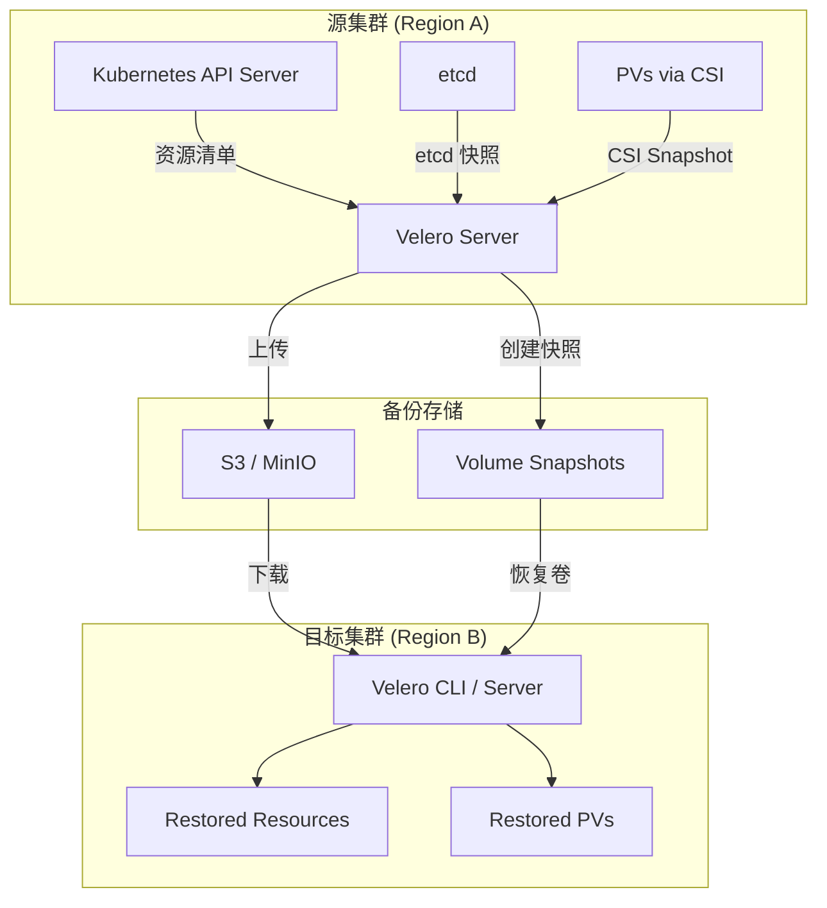
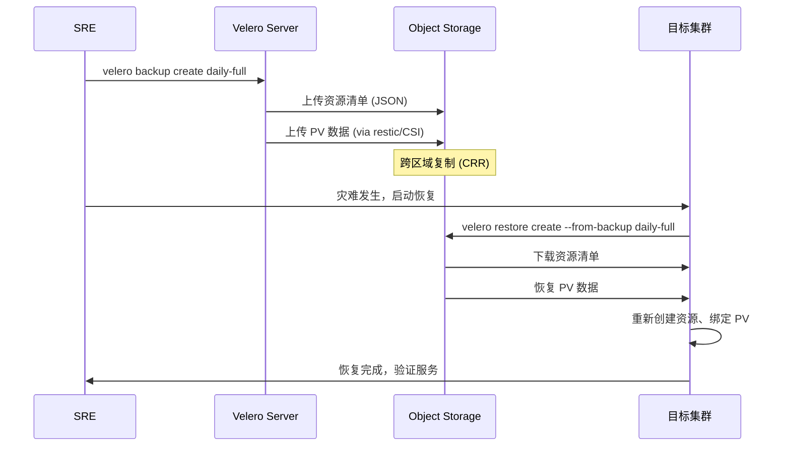

> **生产环境安全提示**
>
> 本文档包含可直接执行的运维命令。执行前请确认：当前目标集群与 Namespace 是否正确；是否具备足够的 RBAC 权限；是否已在非生产环境验证。命令风险等级标注：🔴 高风险（可能造成数据丢失或服务中断）、🟡 中风险（会修改集群状态，但通常可回滚）、🟢 低风险/只读（信息收集，无副作用）。


# Velero 灾难恢复策略

## 概述

Velero 是 [[entities/kubernetes.md|Kubernetes]] 生态中事实标准的备份与灾难恢复工具。它将集群状态的持久化（[[entities/etcd.md|etcd]] 快照 + PV 快照）与灾难恢复流程（跨区域恢复、命名空间级恢复）结合，填补了"有备份"和"能恢复"之间的关键鸿沟。本页连接 domain-04-storage-data 的存储备份技术与 domain-09-reliability-engineering 的灾备方法论，展示 Velero 如何在生产环境中构建可验证的恢复能力。

## 核心连接

| 域 | 核心能力 | Velero 的桥接作用 |
|---|---|---|
| **Storage (domain-04)** | PV 快照、存储类迁移、CSI 驱动 | Velero 通过 CSI 快照或 restic 文件级备份捕获有状态数据 |
| **Reliability (domain-09)** | RTO/RPO 定义、灾难恢复演练、故障切换 | Velero 提供命名空间级/集群级恢复，支撑 RTO 目标 |

**关键洞察：备份 ≠ 灾难恢复。** 许多团队配置了 Velero 定时备份就认为完成了灾备，实际上从未验证过恢复流程。Velero 的真正价值在于它将备份数据转化为可执行的恢复剧本。

## 架构图



### 跨区域恢复架构



## 核心机制

### 备份策略矩阵

| 策略 | 适用场景 | RPO | 存储成本 | 恢复复杂度 |
|---|---|---|---|---|
| **每日全量 + CSI 快照** | 中型集群 (<1000 PV) | 24h | 中 | 低 |
| **每小时增量 + restic** | 变更频繁的有状态应用 | 1h | 高 | 中 |
| **命名空间级备份** | 多租户环境，按团队隔离 |  varies | 低 | 低 |
| **集群级 etcd + PV 全量** | 核心业务系统 | 4h | 很高 | 中 |

### Velero 备份内容

```yaml
# 备份资源配置示例
apiVersion: velero.io/v1
kind: Backup
metadata:
  name: production-critical
  namespace: velero
spec:
  includedNamespaces:
    - payment-service
    - order-service
  includedResources:
    - deployments
    - services
    - configmaps
    - secrets
    - persistentvolumeclaims
  excludedResources:
    - events
    - pods  # 通常排除 Pod，由 Deployment 重建
  snapshotVolumes: true
  storageLocation: aws-primary
  volumeSnapshotLocations:
    - aws-east
  ttl: 720h0m0s  # 30 天保留期
```

### 跨区域恢复关键步骤

1. **前置条件检查**
   - 目标集群 Velero 已安装并配置相同 StorageClass
   - 备份存储桶已跨区域复制到目标区域
   - 目标集群有权限访问备份存储

2. **恢复执行**
   ```bash
   # 1. 列出可用备份
   velero backup get --storage-location aws-dr

   # 2. 执行恢复（命名空间级）
   velero restore create payment-restore \
     --from-backup production-critical \
     --include-namespaces payment-service \
     --namespace-mappings payment-service:payment-service-dr

   # 3. 验证恢复状态
   velero restore get
   kubectl get pods -n payment-service-dr
   ```

3. **恢复后验证清单**
   - [ ] Pod 全部 Running 且 Ready
   - [ ] Service Endpoint 可访问
   - [ ] PVC 已正确绑定到新 PV
   - [ ] ConfigMap/Secret 数据完整
   - [ ] 应用数据一致性检查（如数据库 checksum）

## 最佳实践

### 1. 备份策略设计

```
三层备份体系:
┌─────────────────────────────────────────┐
│  层1: 实时同步 (同步复制 / 数据库主从)     │  RPO ≈ 0
├─────────────────────────────────────────┤
│  层2: 增量快照 (Velero + CSI 每小时)      │  RPO = 1h
├─────────────────────────────────────────┤
│  层3: 每日全量 (Velero + S3 跨区域)       │  RPO = 24h
└─────────────────────────────────────────┘
```

### 2. 存储后端选择

| 环境 | 推荐后端 | 理由 |
|---|---|---|
| AWS EKS | S3 + EBS CSI | 原生集成，跨区域复制成熟 |
| GCP GKE | GCS + PD CSI | 快照链优化，成本低 |
| 裸金属 / 私有云 | MinIO + NFS/SAN | 自托管对象存储，灵活 |
| 混合云 | MinIO 网关 + 多云 S3 | 统一接口，避免厂商锁定 |

### 3. 灾难恢复演练 (Chaos + Velero)

将 Velero 恢复纳入混沌工程演练：

```bash
# 混沌场景：模拟命名空间级灾难
chaosblade create k8s namespace-delete \
  --namespace payment-service \
  --timeout 300

# 恢复验证：使用 Velero 恢复
velero restore create chaos-test-restore \
  --from-backup production-critical

# 验证 SLO 恢复时间
# 目标: 恢复后 5 分钟内 P99 延迟 < 200ms
```

### 4. etcd 与 PV 的一致性

**关键风险：etcd 快照与 PV 恢复的时间差。**

Velero 备份资源清单（来自 etcd）和 PV 快照（来自 CSI）不是原子操作。如果应用在两次快照之间发生了写操作，恢复后可能出现数据不一致。

**缓解方案：**
- 对有状态应用使用预备份 Hook 暂停写入：
  ```yaml
  annotations:
    pre.hook.backup.velero.io/container: postgres
    pre.hook.backup.velero.io/command: '["pg_dump", "-Fc", "/backup/pre.dump"]'
    post.hook.backup.velero.io/command: '["rm", "/backup/pre.dump"]'
  ```
- 数据库类应用优先使用原生复制（如 PostgreSQL streaming replication）而非 Velero 作为 RPO≈0 的方案

### 5. 备份验证与可恢复性测试

**备份不验证等于没有备份。** Velero 提供 `backup describe` 和 `restore --verify` 来验证备份完整性，但真正的验证是执行完整的恢复演练。

> ⚠️ **🟡 中危变更** — 变更集群资源状态，建议先 --dry-run 或 diff 确认
> - `kubectl exec`：进入容器执行命令，可能改变容器状态

``` bash
# 🟡 中风险：会修改集群/资源状态，执行前请确认目标、影响范围与授权
# 备份验证流程
velero backup describe production-critical --details
# 检查: Phase: Completed, Items Backed Up: expected count

# 自动验证 Job
velero backup logs production-critical | grep -E "(error|fail|warning)"

# 定期恢复演练（建议每月）
velero restore create drill-$(date +%Y%m%d) \
  --from-backup production-critical \
  --namespace-mappings payment-service:payment-drill \
  --include-namespaces payment-service \
  --wait

# 验证恢复后数据一致性
kubectl exec -n payment-drill deploy/payment-service -- \
  psql -c "SELECT COUNT(*) FROM transactions;"
```
### 6. 成本优化

| 优化手段 | 效果 | 实现方式 |
|---|---|---|
| 增量备份 (restic) | 减少 60-80% 存储 | 仅传输变更块 |
| 生命周期策略 | 自动清理旧备份 | S3 Lifecycle → Glacier |
| 选择性备份 | 减少 50% 备份大小 | 排除临时 Pod、事件日志 |
| 跨区域存储类 | 降低复制成本 | 使用 S3 Standard-IA |

```yaml
# Velero 定时备份 Schedule
apiVersion: velero.io/v1
kind: Schedule
metadata:
  name: daily-critical
  namespace: velero
spec:
  schedule: "0 2 * * *"  # 每天凌晨 2 点
  template:
    includedNamespaces:
      - payment-service
      - order-service
      - user-service
    snapshotVolumes: true
    storageLocation: aws-primary
    ttl: 720h0m0s
    volumeSnapshotLocations:
      - aws-east
    # 排除不需要备份的资源
    excludedResources:
      - events
      - controllerrevisions
      - pods
```

## 工具推荐

| 工具 | 角色 | 与 Velero 的集成 |
|---|---|---|
| **Velero** | 备份/恢复核心 | 主工具，负责资源清单 + PV 备份 |
| **Restic** | 文件级备份 | Velero 内置集成，无 CSI 时的 fallback |
| **CSI Snapshotter** | 存储快照 | 推荐方案，原生支持增量快照 |
| **Kopia** | 现代备份引擎 | Velero 1.12+ 可选替代 restic，性能更优 |
| **Stash** | 替代方案 | 由 AppsCode 提供，支持更多数据库原生备份 |
| **[[entities/longhorn.md|Longhorn]]** | 分布式存储 | 内置快照与跨区域复制，可与 Velero 互补 |
| **OpenEBS** | 容器化存储 | Velero 支持 OpenEBS CStor 卷备份 |

## 张力与权衡

| 张力 | 详情 |
|---|---|
| **CSI 快照 vs restic** | CSI 快照速度快、原生集成，但依赖存储厂商支持；restic 通用但逐文件备份慢，大规模 PV 恢复时间长。混合使用（CSI 为主，restic 为 fallback）是最佳实践。 |
| **备份频率 vs 成本** | 每小时增量备份的存储成本可能是每日全量的 3-5 倍。需要根据 RPO 要求和数据变更率权衡。 |
| **集群级 vs 命名空间级** | 集群级备份覆盖完整，但恢复时间长、存储大；命名空间级备份灵活，但跨命名空间依赖（如全局 RBAC、CRD）可能丢失。 |
| **自动化恢复 vs 人工审批** | 全自动故障切换减少 RTO，但误触发风险高。生产环境通常采用"半自动"——告警触发 + SRE 一键确认。 |

## 开放问题

- **多集群备份联邦：** 在 10+ 集群环境中，如何统一管理 Velero 备份策略、监控备份健康度、跨集群协调恢复？
- **Velero 与 GitOps 的冲突：** Velero 恢复的资源与 ArgoCD/Flux 管理的资源可能产生冲突。恢复后 GitOps 是否会覆盖 Velero 恢复的状态？
- **容器镜像的灾备：** Velero 不备份容器镜像。如果镜像仓库在灾难中不可用，恢复的应用无法启动。需要配合镜像仓库的跨区域复制策略。

## 相关 Domain

- domain-04-storage-data/01-k8s-storage
- domain-04-storage-data/03-distributed-storage
- domain-09-reliability-engineering/01-backup-recovery
- domain-09-reliability-engineering/02-disaster-recovery
- domain-09-reliability-engineering/09-disaster-recovery-playbooks

> *This page synthesizes patterns across multiple sources and domains.* ^[inferred]
## Related

- [[domain-17-system-foundation/速查卡/k8s.md|Kubernetes 生产环境速查卡]]
- [[domain-17-system-foundation/知识字典/security/multi-tenancy.md|多租户]]


<!-- risk-assessed -->
