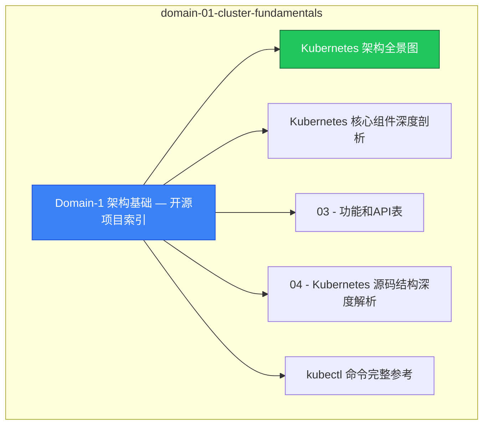

> **生产环境安全提示**
>
> 本文档包含可直接执行的运维命令。执行前请确认：当前目标集群与 Namespace 是否正确；是否具备足够的 RBAC 权限；是否已在非生产环境验证。命令风险等级标注：🔴 高风险（可能造成数据丢失或服务中断）、🟡 中风险（会修改集群状态，但通常可回滚）、🟢 低风险/只读（信息收集，无副作用）。

# domain-01-cluster-fundamentals MOC

> **MOC 版本**: 1.0
> **知识域**: domain-01-cluster-fundamentals
> **文档数量**: 33 篇
> **最后更新**: 2026-05-21
> **用途**: 本知识域的导航入口，汇总所有相关文档、关联领域、和场景入口

---

## 领域概述

Kubernetes 架构基础 — 系统整体设计、核心组件、API 版本、源码结构、集群部署

### 知识域定位

| 维度 | 说明 |
|---|---|
| **知识域** | domain-01-cluster-fundamentals |
| **文档数量** | 33 篇 |
| **难度分布** | 入门 1 / 进阶 1 / 高级 1 / 专家 0 |

---

## 文档清单

| # | 文档 | 难度 | 标签 | 估计阅读时间 |
|---|---|---|---|---|
| 1 | Domain-1 架构基础 — 开源项目索引 |  | k8s, architecture, deep-dive |  |
| 2 | Kubernetes 架构全景图 | 进阶 | k8s, architecture, kubernetes | 10min |
| 3 | Kubernetes 核心组件深度剖析 | 高级 | k8s, components, api-server | 15min |
| 4 | 03 - 功能和API表 |  | k8s, architecture, deep-dive |  |
| 5 | 04 - Kubernetes 源码结构深度解析 |  | k8s, architecture, deep-dive |  |
| 6 | kubectl 命令完整参考 | 入门 | k8s, kubectl, cli | 10min |
| 7 | 06 - 集群配置参数完全参考 |  | k8s, architecture, deep-dive |  |
| 8 | 07 - 升级路径与策略指南 |  | k8s, architecture, deep-dive |  |
| 9 | 08 - 多租户架构设计 (Multi-Tenancy Architecture) |  | k8s, architecture, deep-dive |  |
| 10 | 09 - 边缘计算集成架构 (KubeEdge/OpenYurt) |  | k8s, architecture, deep-dive |  |
| 11 | 10 - Windows 容器支持与集成指南 |  | k8s, architecture, deep-dive |  |
| 12 | 11 - Kubernetes 源码架构深度分析 |  | k8s, architecture, deep-dive |  |
| 13 | 12 - Kubernetes 集群部署架构模式指南 |  | k8s, architecture, deep-dive |  |
| 14 | 13 - Kubernetes 性能调优专项指南 |  | k8s, architecture, deep-dive |  |
| 15 | 14 - Kubernetes 安全架构深度分析 |  | k8s, architecture, deep-dive |  |
| 16 | 15 - Kubernetes 可观测性架构体系 |  | k8s, architecture, deep-dive |  |
| 17 | 16 - Kubernetes 故障排查专家级指南 |  | k8s, architecture, deep-dive |  |
| 18 | 17 - 生产环境运维最佳实践 (Production Operations Best Practices) |  | k8s, architecture, deep-dive |  |
| 19 | 18 - Kubernetes 升级和迁移策略指南 |  | k8s, architecture, deep-dive |  |
| 20 | Kubectl v1.29 - v1.33 新命令与用法速查 |  | k8s, architecture, deep-dive |  |
| 21 | Kubernetes 版本 API 兼容矩阵 (1.28 → 1.33) |  | k8s, architecture, deep-dive |  |
| 22 | Kubernetes 核心组件 v1.29 - v1.33 新特性速查 |  | k8s, architecture, deep-dive |  |
| 23 | Kubernetes v1.29-v1.33 核心特性架构图集 |  | k8s, architecture, deep-dive |  |
| 24 | Kubernetes v1.25 - v1.33 特性对比总表 |  | k8s, architecture, deep-dive |  |
| 25 | Kubernetes v1.29 - v1.33 完整 Feature Gate 与特性参考手册 |  | k8s, architecture, deep-dive |  |
| 26 | Kubernetes v1.29 - v1.33 版本特性深度指南 |  | k8s, architecture, deep-dive |  |
| 27 | Kubernetes v1.33 弃用功能与迁移指南 |  | k8s, architecture, deep-dive |  |
| 28 | Kubernetes v1.33 生态系统兼容性矩阵 |  | k8s, architecture, deep-dive |  |
| 29 | Kubernetes v1.33 实战案例集 |  | k8s, architecture, deep-dive |  |
| 30 | Kubernetes v1.33 生产环境最佳实践 |  | k8s, architecture, deep-dive |  |
| 31 | Kubernetes v1.33 速查卡 |  | k8s, architecture, deep-dive |  |
| 32 | Kubernetes v1.33 升级实操指南 |  | k8s, architecture, deep-dive |  |
| 33 | Kubernetes 版本生命周期与支持策略 |  | k8s, architecture, deep-dive |  |

---

## 知识图谱

---

## 关联入口

| 入口 | 说明 |
|---|---|
| FTA 故障树 | domain-01-cluster-fundamentals 相关故障树分析 |
| Skills 技能 | domain-01-cluster-fundamentals 相关操作技能 |
| 深度研究入口 | 语料库索引与向量检索 |

---

## 统计信息

| 指标 | 数值 |
|---|---|
| 文档总数 | 33 |
| 覆盖 K8s 版本 | v1.25 - v1.32 |

---

*本文档由 scripts/generate-mocs.py 自动生成，最后更新 2026-05-21。*

<!-- risk-assessed -->
