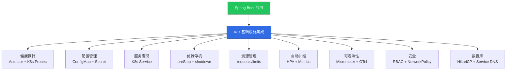
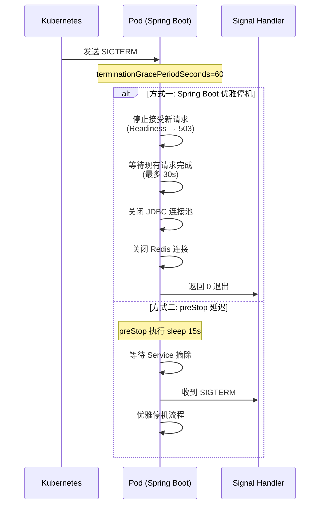

> **生产环境安全提示**
>
> 本文档包含可直接执行的运维命令。执行前请确认：当前目标集群与 Namespace 是否正确；是否具备足够的 RBAC 权限；是否已在非生产环境验证。命令风险等级标注：🔴 高风险（可能造成数据丢失或服务中断）、🟡 中风险（会修改集群状态，但通常可回滚）、🟢 低风险/只读（信息收集，无副作用）。


# Spring Boot on [[Kubernetes|Kubernetes]] 生产实践指南

> **适用版本**: Spring Boot 3.4+ / Kubernetes v1.29-v1.33  
> **最后更新**: 2026-04-30  
> **难度**: 中级

---

<!-- chunk: 📋 目录 -->
## 📋 目录

- [一、Spring Boot on K8s 架构全景](#一spring-boot-on-k8s-架构全景)
- [二、健康检查与探针配置](#二健康检查与探针配置)
- [三、配置管理与外部化](#三配置管理与外部化)
- [四、优雅上下线](#四优雅上下线)
- [五、资源管理与自动扩缩](#五资源管理与自动扩缩)
- [六、数据库连接池最佳实践](#六数据库连接池最佳实践)
- [七、Spring Boot Admin 与管理端口](#七spring-boot-admin-与管理端口)
- [八、Init Container 启动任务](#八init-container-启动任务)
- [九、多环境 Profile 管理](#九多环境-profile-管理)
- [十、生产级 Deployment 模板](#十生产级-deployment-模板)

---

<!-- chunk: 一、Spring Boot on K8s 架构全景 -->
## 一、Spring Boot on K8s 架构全景



### 1.1 Spring Boot K8s 化检查清单

| 检查项 | 配置位置 | 优先级 |
|--------|---------|--------|
| Actuator 探针映射 | `application.yml` | P0 |
| 优雅停机 | `server.shutdown=graceful` | P0 |
| JVM 容器感知 | `-XX:+UseContainerSupport` | P0 |
| 资源 requests/limits | Deployment YAML | P0 |
| ConfigMap 配置注入 | Deployment `envFrom` | P1 |
| HPA 指标暴露 | Micrometer + [[Prometheus|Prometheus]] | P1 |
| 健康检查端点安全 | `management.endpoints` | P1 |
| 日志 JSON 格式 | Logback/Log4j2 配置 | P1 |
| 非 root 运行 | SecurityContext | P2 |
| 分布式追踪 | OTel Java Agent | P2 |

---

<!-- chunk: 二、健康检查与探针配置 -->
## 二、健康检查与探针配置

### 2.1 Actuator 端点映射

```mermaid
graph LR
    subgraph Kubernetes Probes
        SP[Startup Probe<br/>启动探针]
        LP[Liveness Probe<br/>存活探针]
        RP[Readiness Probe<br/>就绪探针]
    end

    subgraph Spring Boot Actuator
        AH1[/actuator/health/liveness]
        AH2[/actuator/health/readiness]
    end

    SP -->|initialDelaySeconds=0| AH2
    LP -->|periodSeconds=10| AH1
    RP -->|periodSeconds=5| AH2

    style SP fill:#f59e0b,stroke:#b45309,color:#fff
    style LP fill:#ef4444,stroke:#b91c1c,color:#fff
    style RP fill:#22c55e,stroke:#166534,color:#fff
```

### 2.2 Spring Boot 配置

```yaml
# application.yml
management:
  endpoints:
    web:
      exposure:
        include: health,info,prometheus,metrics
  endpoint:
    health:
      show-details: when-authorized
      show-components: when-authorized
      probes:
        enabled: true
      group:
        liveness:
          include: livenessState,diskSpace,ping
        readiness:
          include: readinessState,db,redis,rabbit,diskSpace
  health:
    livenessstate:
      enabled: true
    readinessstate:
      enabled: true
    defaults:
      enabled: true
  server:
    port: 8081

spring:
  main:
    lazy-initialization: false
  lifecycle:
    timeout-per-shutdown-phase: 30s
  docker:
    compose:
      enabled: false
```

### 2.3 K8s 探针配置

```yaml
apiVersion: apps/v1
kind: Deployment
metadata:
  name: spring-app
spec:
  template:
    spec:
      containers:
        - name: app
          image: registry.example.com/spring-app:v1.0.0
          ports:
            - containerPort: 8080
              name: http
              protocol: TCP
            - containerPort: 8081
              name: management
              protocol: TCP
          startupProbe:
            httpGet:
              path: /actuator/health/readiness
              port: management
            initialDelaySeconds: 0
            periodSeconds: 2
            failureThreshold: 30
            successThreshold: 1
            timeoutSeconds: 3
          livenessProbe:
            httpGet:
              path: /actuator/health/liveness
              port: management
            periodSeconds: 10
            failureThreshold: 3
            successThreshold: 1
            timeoutSeconds: 3
          readinessProbe:
            httpGet:
              path: /actuator/health/readiness
              port: management
            periodSeconds: 5
            failureThreshold: 3
            successThreshold: 1
            timeoutSeconds: 3
```

### 2.4 自定义健康指标

```java
@Component
public class ExternalServiceHealthIndicator implements HealthIndicator {
    private final ExternalServiceClient client;

    @Override
    public Health health() {
        try {
            if (client.ping()) {
                return Health.up()
                    .withDetail("service", "external-api")
                    .withDetail("latency", client.getLastLatency())
                    .build();
            }
            return Health.down()
                .withDetail("service", "external-api")
                .withDetail("reason", "ping failed")
                .build();
        } catch (Exception e) {
            return Health.down(e)
                .withDetail("service", "external-api")
                .build();
        }
    }
}
```

---

<!-- chunk: 三、配置管理与外部化 -->
## 三、配置管理与外部化

### 3.1 ConfigMap 配置注入

```yaml
# ConfigMap
apiVersion: v1
kind: ConfigMap
metadata:
  name: spring-app-config
data:
  application.yml: |
    server:
      tomcat:
        max-threads: 200
        accept-count: 100
    spring:
      datasource:
        hikari:
          maximum-pool-size: 20
          minimum-idle: 5
          connection-timeout: 30000
          idle-timeout: 600000
          max-lifetime: 1800000
    logging:
      level:
        root: INFO
        com.example: DEBUG
  SPRING_PROFILES_ACTIVE: "production"
  JAVA_OPTS: "-XX:+UseContainerSupport -XX:MaxRAMPercentage=75.0 -XX:+UseG1GC"
---
# Deployment
apiVersion: apps/v1
kind: Deployment
metadata:
  name: spring-app
spec:
  template:
    spec:
      containers:
        - name: app
          image: registry.example.com/spring-app:v1.0.0
          envFrom:
            - configMapRef:
                name: spring-app-config
          env:
            - name: SPRING_DATASOURCE_URL
              value: "jdbc:postgresql://postgres-service:5432/mydb"
            - name: SPRING_DATASOURCE_USERNAME
              valueFrom:
                secretKeyRef:
                  name: db-credentials
                  key: username
            - name: SPRING_DATASOURCE_PASSWORD
              valueFrom:
                secretKeyRef:
                  name: db-credentials
                  key: password
          volumeMounts:
            - name: config
              mountPath: /config
              readOnly: true
      volumes:
        - name: config
          configMap:
            name: spring-app-config
            items:
              - key: application.yml
                path: application.yml
```

### 3.2 Spring Boot 属性优先级

```
优先级从高到低:
1. K8s Secret (环境变量)                      ← 敏感配置
2. K8s ConfigMap (环境变量)                    ← 环境特定配置
3. ConfigMap Volume (application.yml)          ← 共享配置
4. JAR 内 application-production.yml           ← Profile 配置
5. JAR 内 application.yml                      ← 默认配置
```

### 3.3 配置热更新 (Spring Cloud Kubernetes)

```yaml
# 依赖
# pom.xml: spring-cloud-starter-kubernetes-fabric8-config

# application.yml
spring:
  cloud:
    kubernetes:
      config:
        enabled: true
        name: spring-app-config
        namespace: default
      secrets:
        enabled: true
        name: db-credentials
      reload:
        enabled: true
        mode: event
        strategy: refresh
```

---

<!-- chunk: 四、优雅上下线 -->
## 四、优雅上下线

### 4.1 优雅停机配置

```yaml
# application.yml
server:
  shutdown: graceful

spring:
  lifecycle:
    timeout-per-shutdown-phase: 30s
```

### 4.2 K8s 优雅终止流程



### 4.3 生产级优雅终止配置

```yaml
apiVersion: apps/v1
kind: Deployment
metadata:
  name: spring-app
spec:
  template:
    spec:
      terminationGracePeriodSeconds: 60
      containers:
        - name: app
          lifecycle:
            preStop:
              exec:
                command:
                  - sh
                  - -c
                  - |
                    echo "preStop: marking as not ready"
                    curl -s -X POST http://localhost:8081/actuator/shutdown || true
                    sleep 15
```

---

<!-- chunk: 五、资源管理与自动扩缩 -->
## 五、资源管理与自动扩缩

### 5.1 Java 应用资源 Sizing 公式

```
Container Memory Limit = JVM Heap + Metaspace + Native Memory + Overhead
                       ≈ JVM Heap × 1.5 ~ 2.0

Container Memory Request = Container Memory Limit × 0.75

CPU Request = 所需并发线程数 × 每线程 CPU 估算
CPU Limit = CPU Request × 2 ~ 3 (允许突发)
```

### 5.2 生产级资源配置

```yaml
resources:
  requests:
    memory: "768Mi"
    cpu: "250m"
  limits:
    memory: "1Gi"
    cpu: "1000m"

env:
  - name: JAVA_OPTS
    value: >-
      -XX:+UseContainerSupport
      -XX:MaxRAMPercentage=75.0
      -XX:InitialRAMPercentage=50.0
      -XX:+UseG1GC
      -XX:MaxGCPauseMillis=200
      -XX:+HeapDumpOnOutOfMemoryError
      -XX:HeapDumpPath=/tmp/heapdump.hprof
```

### 5.3 HPA 配置

```yaml
apiVersion: autoscaling/v2
kind: HorizontalPodAutoscaler
metadata:
  name: spring-app-hpa
spec:
  scaleTargetRef:
    apiVersion: apps/v1
    kind: Deployment
    name: spring-app
  minReplicas: 3
  maxReplicas: 20
  metrics:
    - type: Resource
      resource:
        name: cpu
        target:
          type: Utilization
          averageUtilization: 70
    - type: Pods
      pods:
        metric:
          name: http_server_requests_seconds_count
        target:
          type: AverageValue
          averageValue: "100"
  behavior:
    scaleDown:
      stabilizationWindowSeconds: 300
      policies:
        - type: Percent
          value: 10
          periodSeconds: 60
    scaleUp:
      stabilizationWindowSeconds: 0
      policies:
        - type: Percent
          value: 100
          periodSeconds: 15
        - type: Pods
          value: 4
          periodSeconds: 15
      selectPolicy: Max
```

---

<!-- chunk: 六、数据库连接池最佳实践 -->
## 六、数据库连接池最佳实践

### 6.1 HikariCP 配置

```yaml
# application.yml
spring:
  datasource:
    url: jdbc:postgresql://postgres-service.production.svc.cluster.local:5432/mydb
    hikari:
      maximum-pool-size: 20
      minimum-idle: 5
      connection-timeout: 30000
      idle-timeout: 600000
      max-lifetime: 1800000
      connection-test-query: SELECT 1
      leak-detection-threshold: 60000
      pool-name: spring-app-hikari
```

### 6.2 连接池 Sizing 公式

```
connections = ((core_count * 2) + effective_spindle_count)

以 4 核 CPU + 1 个数据库磁盘为例:
connections = (4 * 2) + 1 = 9 → 向上取整为 10

K8s 场景修正:
- 每个 Pod 独立连接池
- maximum-pool-size = CPU_limit / 1000m * 3
  (如 cpu limit=500m → pool_size ≈ 2)
- 总连接数 = pods × pool_size ≤ 数据库最大连接数

示例:
  5 Pods × pool_size=10 = 50 总连接
  PostgreSQL 默认 max_connections=100 → 安全
```

### 6.3 Flyway 数据库迁移

```yaml
# application.yml
spring:
  flyway:
    enabled: true
    locations: classpath:db/migration
    baseline-on-migrate: true
    validate-on-migrate: true
```

```yaml
# K8s: 使用 Init Container 确保迁移先完成
apiVersion: apps/v1
kind: Deployment
metadata:
  name: spring-app
spec:
  template:
    spec:
      initContainers:
        - name: db-migrate
          image: registry.example.com/spring-app:v1.0.0
          command: ["java", "-jar", "/app/app.jar", "--spring.flyway.enabled=true", "--spring.main.web-application-type=none"]
          env:
            - name: SPRING_DATASOURCE_URL
              valueFrom:
                secretKeyRef:
                  name: db-credentials
                  key: url
            - name: SPRING_DATASOURCE_USERNAME
              valueFrom:
                secretKeyRef:
                  name: db-credentials
                  key: username
            - name: SPRING_DATASOURCE_PASSWORD
              valueFrom:
                secretKeyRef:
                  name: db-credentials
                  key: password
```

---

<!-- chunk: 七、Spring Boot Admin 与管理端口 -->
## 七、Spring Boot Admin 与管理端口

### 7.1 管理端口分离

```yaml
# application.yml
server:
  port: 8080

management:
  server:
    port: 8081
    address: 0.0.0.0
  endpoints:
    web:
      exposure:
        include: health,info,prometheus,metrics,env,beans,loggers
      base-path: /actuator
  prometheus:
    metrics:
      export:
        enabled: true
  metrics:
    tags:
      application: ${spring.application.name}
      namespace: ${KUBERNETES_NAMESPACE:default}
      pod: ${HOSTNAME:unknown}
    distribution:
      percentiles-histogram:
        http.server.requests: true
      slo:
        http.server.requests: 50ms,100ms,200ms,500ms,1s
```

### 7.2 管理端口网络隔离

```yaml
# 仅允许集群内 Prometheus 访问管理端口
apiVersion: v1
kind: Service
metadata:
  name: spring-app-metrics
  labels:
    app: spring-app
spec:
  selector:
    app: spring-app
  ports:
    - name: management
      port: 8081
      targetPort: 8081
  type: ClusterIP
---
# 业务端口 Service
apiVersion: v1
kind: Service
metadata:
  name: spring-app
spec:
  selector:
    app: spring-app
  ports:
    - name: http
      port: 80
      targetPort: 8080
```

---

<!-- chunk: 八、Init Container 启动任务 -->
## 八、Init Container 启动任务

### 8.1 等待依赖服务就绪

```yaml
initContainers:
  - name: wait-for-db
    image: busybox:1.36
    command:
      - sh
      - -c
      - |
        until nc -z postgres-service 5432; do
          echo "Waiting for postgres..."
          sleep 2
        done
        echo "PostgreSQL is ready"
  - name: wait-for-redis
    image: busybox:1.36
    command:
      - sh
      - -c
      - |
        until nc -z redis-service 6379; do
          echo "Waiting for redis..."
          sleep 2
        done
        echo "Redis is ready"
```

---

<!-- chunk: 九、多环境 Profile 管理 -->
## 九、多环境 Profile 管理

### 9.1 Profile 策略

```yaml
# application.yml (默认)
server:
  port: 8080

spring:
  profiles:
    active: ${SPRING_PROFILES_ACTIVE:default}
---
# application-development.yml
spring:
  datasource:
    url: jdbc:postgresql://localhost:5432/mydb_dev
  jpa:
    show-sql: true
logging:
  level:
    root: DEBUG
---
# application-staging.yml
spring:
  datasource:
    url: jdbc:postgresql://postgres-staging:5432/mydb
    hikari:
      maximum-pool-size: 10
logging:
  level:
    root: INFO
---
# application-production.yml
spring:
  datasource:
    url: ${SPRING_DATASOURCE_URL}
    hikari:
      maximum-pool-size: 20
      minimum-idle: 5
logging:
  level:
    root: WARN
    com.example: INFO
server:
  tomcat:
    max-threads: 200
    accept-count: 100
    connection-timeout: 5000
```

### 9.2 K8s 多环境 Deployment

```yaml
# Kustomize 结构
# base/deployment.yaml
# overlays/
#   development/kustomization.yaml  → SPRING_PROFILES_ACTIVE=development
#   staging/kustomization.yaml      → SPRING_PROFILES_ACTIVE=staging
#   production/kustomization.yaml   → SPRING_PROFILES_ACTIVE=production

# overlays/production/kustomization.yaml
apiVersion: kustomize.config.k8s.io/v1beta1
kind: Kustomization
resources:
  - ../../base
patches:
  - target: "`kind: Deployment`"
    patch: |
      apiVersion: apps/v1
      kind: Deployment
      metadata:
        name: spring-app
      spec:
        replicas: 5
        template:
          spec:
            containers:
              - name: app
                env:
                  - name: SPRING_PROFILES_ACTIVE
                    value: "production"
                resources:
                  requests:
                    memory: "768Mi"
                    cpu: "250m"
                  limits:
                    memory: "1Gi"
                    cpu: "1000m"
```

---

<!-- chunk: 十、生产级 Deployment 模板 -->
## 十、生产级 Deployment 模板

```yaml
apiVersion: apps/v1
kind: Deployment
metadata:
  name: spring-app
  labels:
    app: spring-app
    version: v1.0.0
    framework: spring-boot
spec:
  replicas: 3
  strategy:
    type: RollingUpdate
    rollingUpdate:
      maxSurge: 1
      maxUnavailable: 0
  selector:
    matchLabels:
      app: spring-app
  template:
    metadata:
      labels:
        app: spring-app
        version: v1.0.0
      annotations:
        prometheus.io/scrape: "true"
        prometheus.io/port: "8081"
        prometheus.io/path: "/actuator/prometheus"
    spec:
      terminationGracePeriodSeconds: 60
      serviceAccountName: spring-app
      securityContext:
        runAsNonRoot: true
        runAsUser: 1001
        runAsGroup: 1001
        fsGroup: 1001
        seccompProfile:
          type: RuntimeDefault
      initContainers:
        - name: wait-for-db
          image: busybox:1.36
          command: ["sh", "-c", "until nc -z $(SPRING_DATASOURCE_HOST) 5432; do sleep 2; done"]
          env:
            - name: SPRING_DATASOURCE_HOST
              valueFrom:
                configMapKeyRef:
                  name: spring-app-config
                  key: DB_HOST
      containers:
        - name: app
          image: registry.example.com/spring-app:v1.0.0
          ports:
            - name: http
              containerPort: 8080
              protocol: TCP
            - name: management
              containerPort: 8081
              protocol: TCP
          env:
            - name: SPRING_PROFILES_ACTIVE
              value: "production"
            - name: JAVA_OPTS
              value: >-
                -XX:+UseContainerSupport
                -XX:MaxRAMPercentage=75.0
                -XX:InitialRAMPercentage=50.0
                -XX:+UseG1GC
                -XX:MaxGCPauseMillis=200
                -XX:+HeapDumpOnOutOfMemoryError
                -XX:HeapDumpPath=/tmp/heapdump.hprof
                -XX:+CrashOnOutOfMemoryError
                -Djava.security.egd=file:/dev/./urandom
                -Dfile.encoding=UTF-8
                -Duser.timezone=Asia/Shanghai
            - name: SPRING_DATASOURCE_URL
              value: "jdbc:postgresql://postgres-service:5432/mydb"
            - name: SPRING_DATASOURCE_USERNAME
              valueFrom:
                secretKeyRef:
                  name: db-credentials
                  key: username
            - name: SPRING_DATASOURCE_PASSWORD
              valueFrom:
                secretKeyRef:
                  name: db-credentials
                  key: password
          resources:
            requests:
              memory: "768Mi"
              cpu: "250m"
            limits:
              memory: "1Gi"
              cpu: "1000m"
          startupProbe:
            httpGet:
              path: /actuator/health/readiness
              port: management
            initialDelaySeconds: 0
            periodSeconds: 2
            failureThreshold: 30
          livenessProbe:
            httpGet:
              path: /actuator/health/liveness
              port: management
            periodSeconds: 10
            failureThreshold: 3
            timeoutSeconds: 3
          readinessProbe:
            httpGet:
              path: /actuator/health/readiness
              port: management
            periodSeconds: 5
            failureThreshold: 3
            timeoutSeconds: 3
          lifecycle:
            preStop:
              exec:
                command: ["sh", "-c", "sleep 15"]
          securityContext:
            allowPrivilegeEscalation: false
            readOnlyRootFilesystem: true
            capabilities:
              drop:
                - ALL
          volumeMounts:
            - name: tmp
              mountPath: /tmp
            - name: config
              mountPath: /config
              readOnly: true
      volumes:
        - name: tmp
          emptyDir: {}
        - name: config
          configMap:
            name: spring-app-config
            optional: true
      topologySpreadConstraints:
        - maxSkew: 1
          topologyKey: topology.kubernetes.io/zone
          whenUnsatisfiable: DoNotSchedule
          labelSelector:
            matchLabels:
              app: spring-app
```

---

<!-- chunk: 🔗 相关文档 -->
## 🔗 相关文档

- [Java 容器化最佳实践](32-发布/package/2026-07-02_18-29/corpus/peripheral/domain-13-container-runtime/01-docker/10-java-containerization-guide.md) — Dockerfile 与镜像优化
- [JVM GC 容器调优](32-发布/package/2026-07-02_18-29/corpus/supporting/domain-10-troubleshooting-diagnostics/04-jvm-tuning/03-jvm-gc-container-tuning-guide.md) — GC 算法选择
- [Java 可观测性](32-发布/package/2026-07-02_18-29/corpus/supporting/domain-06-observability/01-overview/12-java-observability-kubernetes-guide.md) — Micrometer + OTel
- [Java 安全加固](32-发布/package/2026-07-02_18-29/corpus/supporting/domain-05-security-compliance/06-compliance/13-java-security-kubernetes-guide.md) — 安全最佳实践
- [Spring Cloud K8s 集成](32-发布/package/2026-07-02_18-29/corpus/peripheral/domain-03-networking-traffic/02-service-mesh/12-spring-cloud-kubernetes-service-mesh-guide.md) — 服务网格
- [GraalVM Native Image](32-发布/package/2026-07-02_18-29/corpus/peripheral/domain-15-specialized-tech/03-extensions/16-graalvm-native-image-guide.md) — 原生编译

---

<!-- chunk: Obsidian 相关文档 -->
## Obsidian 相关文档

- domain-02-workloads-applications MOC
- [[domain-02-workloads-applications/README.md|Domain-4: Kubernetes工作负载管理]]
- Domain-4 工作负载 — 开源项目索引
- 01 - Kubernetes 工作负载架构概览 (Workload Architecture Overview)
- 02 - Deployment 生产模式与最佳实践 (Deployment Production Patterns)
- 03 - StatefulSet 高级运维指南 (StatefulSet Advanced Operations)
- 04 - DaemonSet 管理策略与最佳实践 (DaemonSet Management Strategies)
- 05 - Job 与 CronJob 高级用法 (Job & CronJob Advanced Usage)
- 06 - 工作负载监控与告警体系 (Workload Monitoring & Alerting System)
- 07 - 工作负载故障排查与应急响应手册 (Workload Troubleshooting & Incident Re...
- 08 - 多云混合部署工作负载管理策略 (Multi-Cloud Hybrid Deployment Workload ...
- 09 - 边缘计算工作负载部署模式 (Edge Computing Workload Deployment Patter...

## See Also

- 23-resource-management
- 99-kubernetes-v1.33-workloads-guide
- QUALITY_REPORT
- README-old


<!-- risk-assessed -->
