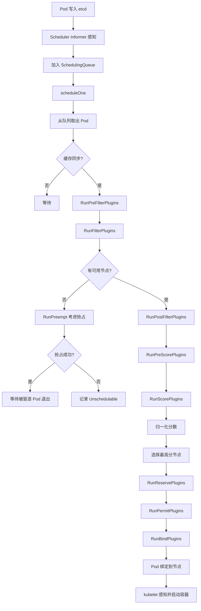
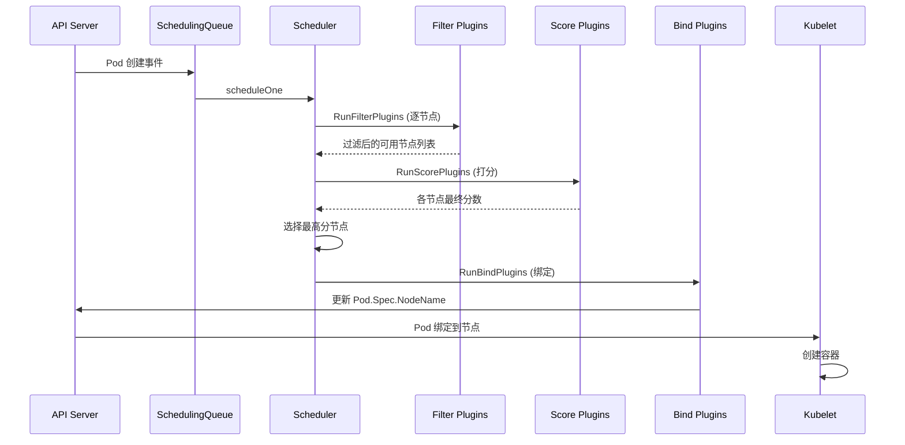

> **生产环境安全提示**
>
> 本文档包含可直接执行的运维命令。执行前请确认：当前目标集群与 Namespace 是否正确；是否具备足够的 RBAC 权限；是否已在非生产环境验证。命令风险等级标注：🔴 高风险（可能造成数据丢失或服务中断）、🟡 中风险（会修改集群状态，但通常可回滚）、🟢 低风险/只读（信息收集，无副作用）。


title: kube-scheduler 调度详解
description: '# kube-scheduler 调度详解'
category: functions
tags:
- k8s
- operations
- cluster-management
- etcd
- kubelet
- scheduler
- gpu
- rag
last_updated: '2026-05-18'
difficulty: advanced
reading_level: advanced
audience:
- Kubernetes开发者
- DevOps工程师
- 应用开发者
estimated_read_time: 5min
intent_queries:
- Kubernetes scheduler scheduling framework plugins
- kube-scheduler prefilter filter score bind phases
- Kubernetes Pod scheduling node affinity taint toleration
- scheduler preemption priority PodTopologySpread
- KubeSchedulerConfiguration scheduler profile
trigger_keywords:
- scheduler
- scheduling
- filter
- score
- preemption
- priority
- affinity
- taint
- topology
- PodTopologySpread
- node selector
- resource fit
related_domains:
- domain-01-cluster-fundamentals
- domain-6-scheduling
related_topics:
- Pod
- node
- affinity
- taint
- resource management
- HPA
authors:
- name: KUDIG Team
  role: contributor
k8s_versions:
- '1.28'
- '1.29'
- '1.30'
- '1.31'
- '1.32'
---

# kube-scheduler 调度详解

## 函数签名

```go
func NewScheduler(
    ctx context.Context,
    recorderFactory profile.RecorderFactory,
    stopCh <-chan struct{},
    registry frameworkruntime.Registry,
    componentConfig *kubeschedulerconfig.KubeSchedulerConfiguration,
    ...) (*Scheduler, error)

func (sched *Scheduler) Run(ctx context.Context)

func (sched *Scheduler) scheduleOne(ctx context.Context)

func (sched *Scheduler) SchedulingCycle(ctx context.Context, state *framework.CycleState, pod *v1.Pod) (result ScheduleResult, err error)

func (f *frameworkImpl) RunFilterPlugins(ctx context.Context, state *framework.CycleState, pod *v1.Pod, nodeInfo *framework.NodeInfo) *framework.Status

func (f *frameworkImpl) RunScorePlugins(ctx context.Context, state *framework.CycleState, pod *v1.Pod, nodes []*framework.NodeInfo) (framework.PluginToNodeScores, *framework.Status)

func (f *frameworkImpl) RunReservePluginsReserve(ctx context.Context, state *framework.CycleState, pod *v1.Pod, nodeName string) *framework.Status

func (f *frameworkImpl) RunBindPlugins(ctx context.Context, state *framework.CycleState, pod *v1.Pod, nodeName string) *framework.Status
```

## 源码位置

| 组件 | 源码路径 | 说明 |
|------|---------|------|
| 调度器入口 | `pkg/scheduler/scheduler.go` | NewScheduler、Run、scheduleOne |
| 调度框架 | `pkg/scheduler/framework/` | Plugin 接口、CycleState |
| 默认插件 | `pkg/scheduler/framework/plugins/` | NodeResourcesFit、InterPodAffinity 等 |
| 调度队列 | `pkg/scheduler/internal/queue/` | SchedulingQueue、PriorityQueue |
| 调度算法 | `pkg/scheduler/internal/algorithm.go` | 预选和打分调度 |
| 抢占调度 | `pkg/scheduler/framework/plugins/defaultpreemption/` | Preempt 逻辑 |
| scheduler manifest | `cmd/kubeadm/app/phases/controlplane/` | 静态 Pod 生成 |
| 优先级排序 | `pkg/scheduler/framework/plugins/queuesort/` | PrioritySort 插件 |

## 参数说明

### kube-scheduler 启动参数

| 参数 | 默认值 | 说明 |
|------|--------|------|
| `--kubeconfig` | `/etc/kubernetes/scheduler.conf` | kubeconfig 路径 |
| `--authentication-kubeconfig` | 同上 | 认证用 kubeconfig |
| `--authorization-kubeconfig` | 同上 | 授权用 kubeconfig |
| `--leader-elect` | `true` | 启用 Leader Election |
| `--profiling` | `false` | 启用 profiling 端点 |
| `--scheduler-name` | `default-scheduler` | 调度器名称 |
| `--config` | 无 | KubeSchedulerConfiguration 文件路径 |
| `--bind-address` | `0.0.0.0` | metrics 监听地址 |
| `--secure-port` | `10259` | HTTPS 端口 |

### KubeSchedulerConfiguration 关键字段

| 字段 | 类型 | 说明 |
|------|------|------|
| `profiles` | `[]KubeSchedulerProfile` | 调度器配置文件列表 |
| `profiles[].plugins` | `Plugins` | 启用/禁用的插件配置 |
| `profiles[].pluginConfig` | `[]PluginConfig` | 插件特定配置 |
| `parallelism` | `int32` | 并行调度数，默认 16 |

### Pod 资源字段

| 字段 | 说明 | 调度依据 |
|------|------|---------|
| `spec.containers[].resources.requests.cpu` | CPU 请求 | 调度依据（必须满足） |
| `spec.containers[].resources.requests.memory` | 内存请求 | 调度依据（必须满足） |
| `spec.containers[].resources.limits.cpu` | CPU 上限 | 不影响调度 |
| `spec.containers[].resources.limits.memory` | 内存上限 | 不影响调度 |

### 内置预选插件 (Filter)

| 插件 | 说明 |
|------|------|
| `NodeName` | 检查 Pod 的 spec.nodeName |
| `NodeResourcesFit` | 节点资源是否满足 Pod requests |
| `NodeSelector` | 匹配 spec.nodeSelector |
| `NodeAffinity` | 匹配 spec.affinity.nodeAffinity |
| `PodToleratesNodeTaints` | Pod 容忍节点污点 |
| `TaintToleration` | 污点容忍检查 |
| `InterPodAffinity` | Pod 亲和性/反亲和性 |
| `VolumeBinding` | PVC 能否在节点上绑定 |
| `NodePorts` | 端口冲突检查 |
| `VolumeZone` | 存储区域限制 |

### 内置打分插件 (Score)

| 插件 | 说明 | 默认权重 |
|------|------|---------|
| `NodeResourcesFit` | 资源分配率 | 1 |
| `NodeResourcesBalancedAllocation` | CPU/内存均衡分配 | 1 |
| `ImageLocality` | 节点已有镜像 | 1 |
| `InterPodAffinity` | Pod 亲和性匹配 | 1 |
| `NodeAffinity` | 节点亲和性 | 1 |
| `PodTopologySpread` | Pod 拓扑分布 | 2 |
| `TaintToleration` | 容忍度匹配 | 1 |

## 返回值

| 函数 | 返回值 | 说明 |
|------|--------|------|
| `NewScheduler` | `(*Scheduler, error)` | 调度器实例 |
| `SchedulingCycle` | `(ScheduleResult, error)` | 调度结果含建议节点名 |
| `RunFilterPlugins` | `*framework.Status` | 过滤结果，失败时含原因 |
| `RunScorePlugins` | `(PluginToNodeScores, *framework.Status)` | 各插件的节点评分 |
| `RunBindPlugins` | `*framework.Status` | 绑定结果 |

### ScheduleResult 结构

```go
type ScheduleResult struct {
    SuggestedHost  string
    EvaluatedNodes int
    FeasibleNodes  int
}
```

## 调用链



## 源码分析

### 概述

kube-scheduler 是 Kubernetes 的核心组件之一，负责将 Pod 调度到合适的节点上。自 v1.22 起，scheduler 完全采用插件化框架（Scheduling Framework），所有调度逻辑通过插件实现。调度过程分为预选（Filter）、打分（Score）、绑定（Bind）三个主要阶段，每个阶段都可以通过自定义插件扩展。

### 调度器主循环

```go
// pkg/scheduler/scheduler.go
func (sched *Scheduler) Run(ctx context.Context) {
    sched.SchedulingQueue.Run()

    go func() {
        <-ctx.Done()
        sched.SchedulingQueue.Close()
    }()

    if !cache.WaitForCacheSync(ctx.Done(), sched.scheduledPodsHasSynced) {
        return
    }

    for i := 0; i < sched.MaxSchedulerParallelism; i++ {
        go sched.scheduleOne(ctx)
    }
}

func (sched *Scheduler) scheduleOne(ctx context.Context) {
    podInfo := sched.NextPod()
    pod := podInfo.Pod

    scheduleResult, err := sched.SchedulingCycle(ctx, state, pod)
    if err != nil {
        if fitError, ok := err.(*framework.FitError); ok {
            if sched.NextStartPodToReevaluate(pod) {
                sched.SchedulingQueue.AddUnschedulableIfNotPresent(podInfo, sched.SchedulingQueue.SchedulingCycle())
            }
            if !sched.DisablePreemption {
                preemptionResult, err := sched.Preemption(ctx, state, pod, fitError)
                if err == nil && preemptionResult != nil {
                    sched.SchedulingQueue.AddUnschedulableIfNotPresent(podInfo, sched.SchedulingQueue.SchedulingCycle())
                }
            }
        }
        return
    }

    assumedPodInfo := podInfo.DeepCopy()
    assumedPod := assumedPodInfo.Pod

    allBound, err := sched.BindingCycle(ctx, state, assumedPod, scheduleResult.SuggestedHost)
    if err != nil {
        sched.SchedulingQueue.AddUnschedulableIfNotPresent(podInfo, sched.SchedulingQueue.SchedulingCycle())
        sched.Failure(ctx, assumedPodInfo, err)
        return
    }

    sched.SchedulingQueue.AddUnschedulableIfNotPresent(podInfo, sched.SchedulingQueue.SchedulingCycle())
}
```

### 预选阶段源码

```go
// pkg/scheduler/framework/runtime/framework.go
func (f *frameworkImpl) RunFilterPlugins(ctx context.Context, state *framework.CycleState, pod *v1.Pod, nodeInfo *framework.NodeInfo) *framework.Status {
    for _, pl := range f.filterPlugins {
        status := pl.Filter(ctx, state, pod, nodeInfo)
        if !status.IsSuccess() {
            if !state.SkipFilterPlugins.Has(pl.Name()) {
                return status
            }
        }
    }
    return nil
}
```

### NodeResourcesFit 插件

```go
// pkg/scheduler/framework/plugins/noderesources/fit.go
func (f *Fit) Filter(ctx context.Context, state *framework.CycleState, pod *v1.Pod, nodeInfo *framework.NodeInfo) *framework.Status {
    insufficientResources := fitsRequest(pod, nodeInfo, f.allowedPodNumber)

    if len(insufficientResources) != 0 {
        failureReasons := make([]string, 0, len(insufficientResources))
        for _, r := range insufficientResources {
            failureReasons = append(failureReasons, r.Reason)
        }
        return framework.NewStatus(framework.Unschedulable, failureReasons...)
    }
    return nil
}

func fitsRequest(pod *v1.Pod, nodeInfo *framework.NodeInfo, allowedPodNumber int) []InsufficientResource {
    podRequests := resource.PodRequests(pod, resource.Requests())
    insufficientResources := []InsufficientResource{}

    allocatable := nodeInfo.Allocatable

    if len(nodeInfo.Pods)+1 > allowedPodNumber {
        insufficientResources = append(insufficientResources, InsufficientResource{
            Resource: "pods",
            Reason:   "Insufficient pods",
        })
    }

    for resourceName, quantity := range podRequests {
        if allocatable[resourceName].Sub(quantity) < nodeInfo.Requested[resourceName] {
            insufficientResources = append(insufficientResources, InsufficientResource{
                Resource: string(resourceName),
                Reason:   fmt.Sprintf("Insufficient %s", resourceName),
            })
        }
    }

    return insufficientResources
}
```

### 打分阶段源码

```go
func (f *frameworkImpl) RunScorePlugins(ctx context.Context, state *framework.CycleState, pod *v1.Pod, nodes []*framework.NodeInfo) (framework.PluginToNodeScores, *framework.Status) {
    allScores := make(framework.PluginToNodeScores, len(f.scorePlugins))
    for _, pl := range f.scorePlugins {
        allScores[pl.Name()] = make(framework.NodeScoreList, len(nodes))
    }

    for _, pl := range f.scorePlugins {
        pluginNodeScores, status := pl.Score(ctx, state, pod, nodes)
        if !status.IsSuccess() {
            return nil, status
        }

        for i, nodeScore := range pluginNodeScores {
            allScores[pl.Name()][i] = framework.NodeScore{
                Name:  nodes[i].Node().Name,
                Score: nodeScore * f.scorePluginWeight[pl.Name()],
            }
        }
    }

    return allScores, nil
}
```

### 污点与容忍

```go
// pkg/scheduler/framework/plugins/tainttoleration/taint_toleration.go
func (pl *TaintToleration) Filter(ctx context.Context, state *framework.CycleState, pod *v1.Pod, nodeInfo *framework.NodeInfo) *framework.Status {
    node := nodeInfo.Node()
    taints, err := nodeTaints(node)
    if err != nil {
        return framework.NewStatus(framework.Error, err.Error())
    }

    filterPredicate := func(t *v1.Taint) bool {
        if t.Effect == v1.TaintEffectNoExecute {
            return true
        }
        return !tolerationsTolerateTaint(pod.Spec.Tolerations, t)
    }

    if _, isUntolerated := v1helper.FindMatchingUntoleratedTaint(taints, filterPredicate, ""); isUntolerated {
        return framework.NewStatus(framework.UnschedulableAndUnresolvable, ErrReasonNotMatch)
    }

    return nil
}
```

### 亲和性与反亲和性

```go
// pkg/scheduler/framework/plugins/interpodaffinity/filtering.go
func (pl *InterPodAffinity) Filter(ctx context.Context, state *framework.CycleState, pod *v1.Pod, nodeInfo *framework.NodeInfo) *framework.Status {
    node := nodeInfo.Node()

    if pl.hasRequiredAntiAffinity(pod) {
        existingPods := nodeInfo.Pods
        for _, existingPod := range existingPods {
            if pl.matchAntiAffinity(pod, existingPod) {
                return framework.NewStatus(framework.Unschedulable, ErrReasonAntiAffinityConflict)
            }
        }
    }

    return nil
}
```

### 抢占调度

```go
// pkg/scheduler/framework/plugins/defaultpreemption/preemption.go
func (pl *DefaultPreemption) Preempt(ctx context.Context, state *framework.CycleState, pod *v1.Pod, m framework.NodeToStatusMap) (*v1.Node, []framework.PreemptionCandidate, *framework.Status) {
    nodeLister := pl.fh.SnapshotSharedLister().NodeInfos()

    allNodes, err := nodeLister.List()
    if err != nil {
        return nil, nil, framework.NewStatus(framework.Error, err.Error())
    }

    candidates, err := pl.findCandidates(ctx, state, pod, allNodes, m)
    if err != nil {
        return nil, nil, framework.NewStatus(framework.Error, err.Error())
    }

    bestCandidate := pl.SelectCandidate(ctx, state, pod, candidates)
    if bestCandidate != nil {
        return bestCandidate.Node(), bestCandidate.Victims(), nil
    }

    return nil, nil, framework.NewStatus(framework.Unschedulable, "no candidate node")
}
```

## 执行流程



## 使用场景

1. **默认调度**：使用内置插件进行标准调度
2. **自定义调度器**：通过 KubeSchedulerConfiguration 自定义插件
3. **GPU 调度**：通过 NodeResourcesFit 扩展 GPU 资源调度
4. **拓扑感知调度**：使用 PodTopologySpread 实现 zone 级别分布
5. **批处理调度**：使用 Volcano/YuniKorn 替代默认调度器

## 配置示例

```yaml
apiVersion: kubescheduler.config.k8s.io/v1
kind: KubeSchedulerConfiguration
profiles:
- schedulerName: default-scheduler
  plugins:
    queueSort:
      enabled:
      - name: PrioritySort
    preFilter:
      enabled:
      - name: NodeResourcesFit
      - name: NodePorts
      - name: PodTopologySpread
    filter:
      enabled:
      - name: NodeUnschedulable
      - name: NodeName
      - name: NodePorts
      - name: NodeAffinity
      - name: TaintToleration
      - name: NodeResourcesFit
      - name: PodTopologySpread
    score:
      enabled:
      - name: NodeResourcesFit
        weight: 1
      - name: NodeResourcesBalancedAllocation
        weight: 1
      - name: ImageLocality
        weight: 1
      - name: InterPodAffinity
        weight: 1
      - name: NodeAffinity
        weight: 1
      - name: PodTopologySpread
        weight: 2
    reserve:
      enabled:
      - name: VolumeBinding
    bind:
      enabled:
      - name: DefaultBinder
  pluginConfig:
  - name: NodeResourcesFit
    args:
      scoringStrategy:
        resources:
        - name: cpu
          weight: 1
        - name: memory
          weight: 1
        type: LeastAllocated
```

## 实战示例

### 查看调度失败原因

``` bash
# 🟢 低风险：只读/信息收集，通常无副作用
kubectl describe pod <pod-name> | grep -A 10 "Events"
# Events:
#   Type     Reason            From                  Message
#   ----     ------            ----                  -------
#   Warning  FailedScheduling  default-scheduler     0/3 nodes are available:
#     1 Insufficient cpu, 1 node(s) had taints that the pod didn't tolerate,
#     1 node(s) didn't match Pod's node affinity/selector.
```
### Pod 优先级与抢占

> ⚠️ **🟡 中危变更** — 变更集群资源状态，建议先 --dry-run 或 diff 确认
> - `kubectl apply/create/replace`：创建/变更集群资源

``` bash
# 🟡 中风险：会修改集群/资源状态，执行前请确认目标、影响范围与授权
# 创建 PriorityClass
kubectl apply -f - <<EOF
apiVersion: scheduling.k8s.io/v1
kind: PriorityClass
metadata:
  name: high-priority
value: 1000000
globalDefault: false
description: "High priority class for critical workloads"
preemptionPolicy: PreemptLowerPriority
EOF

# 在 Pod 中使用
kubectl run critical-app --image=nginx --overrides='{"spec":{"priorityClassName":"high-priority"}}'
```
### 拓扑分布约束

```yaml
apiVersion: apps/v1
kind: Deployment
metadata:
  name: web-app
spec:
  replicas: 6
  selector:
    matchLabels:
      app: web-app
  template:
    metadata:
      labels:
        app: web-app
    spec:
      topologySpreadConstraints:
      - maxSkew: 1
        topologyKey: topology.kubernetes.io/zone
        whenUnsatisfiable: DoNotSchedule
        labelSelector:
          matchLabels:
            app: web-app
      containers:
      - name: web
        image: nginx:1.25
```

### kubectl 输出

``` bash
# 🟢 低风险：只读/信息收集，通常无副作用
kubectl get pods -o wide -l app=web-app
# NAME                       READY   STATUS    RESTARTS   AGE   IP            NODE       ZONE
# web-app-7b9d6c8f5d-abcde   1/1     Running   0          1m    10.244.0.10   worker-1   us-east-1a
# web-app-7b9d6c8f5d-fghij   1/1     Running   0          1m    10.244.1.10   worker-2   us-east-1b
# web-app-7b9d6c8f5d-klmno   1/1     Running   0          1m    10.244.2.10   worker-3   us-east-1a
# web-app-7b9d6c8f5d-pqrst   1/1     Running   0          1m    10.244.3.10   worker-4   us-east-1b
# web-app-7b9d6c8f5d-uvwxy   1/1     Running   0          1m    10.244.4.10   worker-5   us-east-1a
# web-app-7b9d6c8f5d-z1234   1/1     Running   0          1m    10.244.5.10   worker-6   us-east-1b
```
## 常见错误

| 错误 | 现象 | 原因 | 解决方案 |
|------|------|------|----------|
| 资源不足 | `Insufficient cpu/memory` | 节点资源不满足 Pod requests | 增加 nodes 或降低 requests |
| 污点阻止 | `had taints that the pod didn't tolerate` | Pod 未容忍节点污点 | 添加 tolerations |
| 亲和性不匹配 | `didn't match node affinity` | 无节点满足 nodeAffinity | 检查节点 labels |
| PVC 无法绑定 | `persistentvolumeclaim not bound` | 无合适 PV | 检查 StorageClass 和 PV |
| 端口冲突 | `node(s) didn't have enough free ports` | HostPort 冲突 | 避免使用 HostPort |
| 抢占循环 | Pod 不断被抢占 | 优先级设置不当 | 配置 PodDisruptionBudget |
| 调度器未就绪 | 所有 Pod Pending | scheduler 未运行 | `kubectl get pods -n kube-system -l component=kube-scheduler` |

## 相关函数

- [`kubeadm init phase control-plane`](05-control-plane.md) — scheduler 静态 Pod 创建
- [`kubelet syncPod`](../node-create/01-overview.md) — Pod 绑定后的容器创建
- [`Node Lifecycle Controller`](../node-create/01-overview.md) — 节点状态监控影响调度
- [`Pod 拓扑分布`](README.md) — PodTopologySpread 策略

## Related

- [[reference|#reference Hub]] — tag hub

- [[README|README]]
- [[log|log]]
- [[domain-17-system-foundation/速查卡/go.md|go]]
- [[domain-17-system-foundation/速查卡/k8s.md|k8s]]
- [[entities/kubernetes.md|kubernetes]]


<!-- risk-assessed -->
