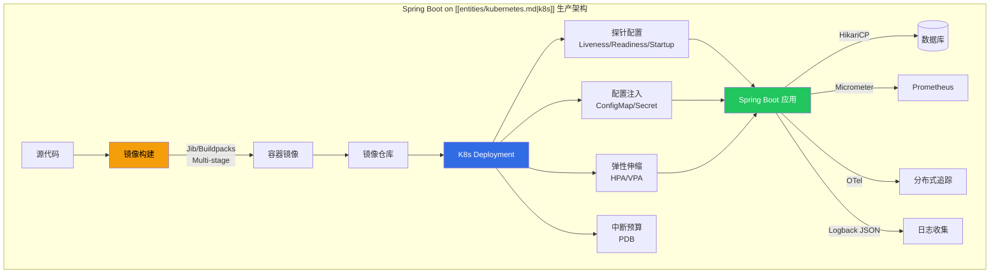
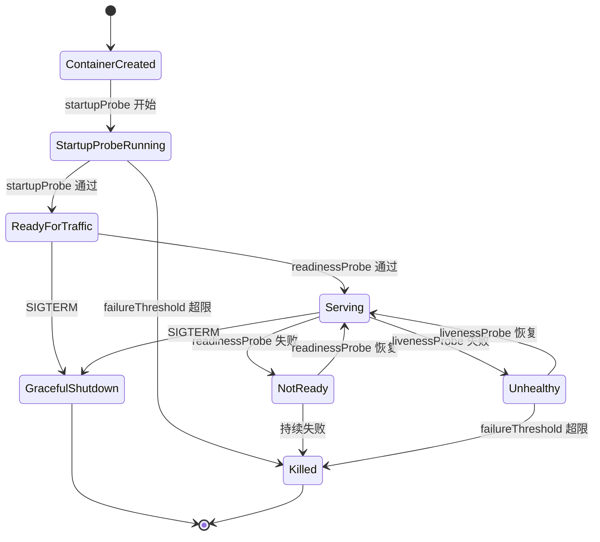

> **生产环境安全提示**
>
> 本文档包含可直接执行的运维命令。执行前请确认：当前目标集群与 Namespace 是否正确；是否具备足够的 RBAC 权限；是否已在非生产环境验证。命令风险等级标注：🔴 高风险（可能造成数据丢失或服务中断）、🟡 中风险（会修改集群状态，但通常可回滚）、🟢 低风险/只读（信息收集，无副作用）。


# Spring Boot on [[Kubernetes|Kubernetes]] 生产实践指南

> **适用版本**: JDK 17+ / Spring Boot 3.x / Kubernetes v1.28+
> **最后更新**: 2026-04-30

---

## 一、概述

Spring Boot 是目前 Java 微服务领域使用最广泛的框架，而 Kubernetes 已成为事实上的容器编排标准。将 Spring Boot 应用**生产级别**地运行在 Kubernetes 上，远不止写一个 Dockerfile 那么简单——它涉及容器镜像构建优化、健康探针精确配置、优雅停机保障、配置与密钥管理、弹性伸缩策略、连接池调优以及分布式追踪集成等多个维度。

本指南从**生产环境实战角度**出发，覆盖 Spring Boot 应用在 Kubernetes 上运行的完整生命周期，每个配置项都经过大规模集群验证。



---

## 二、架构设计

### 2.1 容器镜像构建策略

生产环境中，镜像构建是整个流水线的起点。Spring Boot 应用有三种主流构建方式：

#### Multi-Stage Dockerfile（推荐通用场景）

```dockerfile
# ===== 构建阶段 =====
FROM eclipse-temurin:17-jdk-jammy AS builder

WORKDIR /build

# 先复制依赖文件，利用 Docker 层缓存
COPY gradle/ gradle/
COPY gradlew build.gradle settings.gradle ./
RUN chmod +x gradlew && ./gradlew dependencies --no-daemon --parallel

# 再复制源码（变更频率最高，放最后）
COPY src/ src/
RUN ./gradlew bootJar --no-daemon -x test \
    && java -Djarmode=layertools -jar build/libs/*.jar extract --destination extracted

# ===== 运行阶段 =====
FROM eclipse-temurin:17-jre-jammy

# 安装必要工具（curl 用于健康检查）
RUN apt-get update && apt-get install -y --no-install-recommends curl=7.88.* \
    && rm -rf /var/lib/apt/lists/*

# 创建非 root 用户
RUN groupadd -g 1001 appgroup && useradd -u 1001 -g appgroup -m appuser

WORKDIR /app

# 分层复制（变更频率从低到高）
COPY --from=builder /build/extracted/dependencies/ ./
COPY --from=builder /build/extracted/spring-boot-loader/ ./
COPY --from=builder /build/extracted/snapshot-dependencies/ ./
COPY --from=builder /build/extracted/application/ ./

# 创建日志和临时文件目录
RUN mkdir -p /app/logs /tmp/app && chown -R appuser:appgroup /app /tmp/app

USER appuser

EXPOSE 8080 8081

ENV JAVA_OPTS="-XX:+UseContainerSupport \
    -XX:MaxRAMPercentage=75.0 \
    -XX:InitialRAMPercentage=50.0 \
    -XX:+UseG1GC \
    -XX:+HeapDumpOnOutOfMemoryError \
    -XX:HeapDumpPath=/app/logs/ \
    -Djava.security.egd=file:/dev/./urandom \
    -Djava.io.tmpdir=/tmp/app" \
    SERVER_PORT=8080 \
    MANAGEMENT_SERVER_PORT=8081

ENTRYPOINT ["sh", "-c", "exec java ${JAVA_OPTS} org.springframework.boot.loader.launch.JarLauncher"]
```

#### Jib Maven 插件（推荐 CI/CD 自动化场景）

```xml
<plugin>
    <groupId>com.google.cloud.tools</groupId>
    <artifactId>jib-maven-plugin</artifactId>
    <version>3.4.4</version>
    <configuration>
        <from>
            <image>eclipse-temurin:17-jre-jammy</image>
            <platforms>
                <platform>
                    <architecture>amd64</architecture>
                    <os>linux</os>
                </platform>
                <platform>
                    <architecture>arm64</architecture>
                    <os>linux</os>
                </platform>
            </platforms>
        </from>
        <to>
            <image>registry.example.com/${project.artifactId}</image>
            <tags>
                <tag>${project.version}</tag>
                <tag>latest</tag>
            </tags>
        </to>
        <container>
            <creationTime>USE_CURRENT_TIMESTAMP</creationTime>
            <jvmFlags>
                <jvmFlag>-XX:+UseContainerSupport</jvmFlag>
                <jvmFlag>-XX:MaxRAMPercentage=75.0</jvmFlag>
                <jvmFlag>-XX:+UseG1GC</jvmFlag>
                <jvmFlag>-XX:+HeapDumpOnOutOfMemoryError</jvmFlag>
            </jvmFlags>
            <ports>
                <port>8080</port>
                <port>8081</port>
            </ports>
            <user>1001:1001</user>
            <files>
                <paths>
                    <path>src/main/jib/logs</path>
                    <excludes>
                        <exclude>src/main/jib/logs/.gitkeep</exclude>
                    </excludes>
                </paths>
            </files>
        </container>
    </configuration>
</plugin>
```

``` bash
# 🟢 低风险：只读/信息收集，通常无副作用
# 无需 Docker daemon，直接推送到远程仓库
mvn compile jib:build -Djib.to.auth.username=$REGISTRY_USER -Djib.to.auth.password=$REGISTRY_PASS

# 本地构建调试
mvn compile jib:dockerBuild
```
#### [[Buildpacks|Buildpacks]]（Spring Boot 官方推荐）

```bash
# Spring Boot 3.x 内置 Buildpacks 支持
./gradlew bootBuildImage \
    --imageName registry.example.com/myapp:latest \
    --builder paketobuildpacks/builder-jammy-base-tiny \
    --runImage paketobuildpacks/run-jammy-base-tiny

# 自定义 JVM 参数
./gradlew bootBuildImage \
    --dockerenv BPE_DELIM_JAVA_TOOL_OPTIONS=" " \
    --dockerenv BPE_APPEND_JAVA_TOOL_OPTIONS="-XX:MaxRAMPercentage=75.0 -XX:+UseG1GC"
```

三种方式对比：

| 特性 | Multi-Stage Dockerfile | Jib | Buildpacks |
|------|----------------------|-----|-----------|
| 需要 Docker daemon | 是 | 否 | 是 |
| 镜像层缓存 | 手动优化 | 自动分层 | 自动分层 |
| 多架构支持 | 需要 buildx | 原生支持 | 需要 platform |
| 自定义灵活度 | 最高 | 中等 | 中等 |
| 学习成本 | 低 | 低 | 中等 |
| 安全漏洞修复 | 需更新基础镜像 | 騱更新基础镜像 | 自动 rebasing |
| CI/CD 友好度 | 中等 | 最高 | 高 |

### 2.2 健康探针架构

Spring Boot Actuator 在 3.x 版本中提供了精细化的健康端点，配合 Kubernetes 的三种探针实现全生命周期管理：



---

## 三、核心配置

### 3.1 Actuator 探针配置

Spring Boot 3.x 的 `application.yml` 配置：

```yaml
server:
  port: 8080

management:
  server:
    port: 8081
  endpoint:
    health:
      show-details: when-authorized
      show-components: always
      probes:
        enabled: true
      group:
        liveness:
          include:
            - livenessState
            - diskSpace
        readiness:
          include:
            - readinessState
            - db
            - redis
            - kafka
            - rabbit
  endpoints:
    web:
      exposure:
        include: health,info,prometheus,metrics
      base-path: /actuator
  metrics:
    tags:
      application: ${spring.application.name}
      namespace: ${KUBERNETES_NAMESPACE:default}
    export:
      prometheus:
        enabled: true
        step: 30s
  health:
    defaults:
      enabled: true
    db:
      enabled: true
    redis:
      enabled: true
    diskspace:
      enabled: true
      threshold: 10MB

spring:
  main:
    lazy-initialization: false
  lifecycle:
    timeout-per-shutdown-phase: 30s
```

Kubernetes Deployment 探针配置：

```yaml
apiVersion: apps/v1
kind: Deployment
metadata:
  name: myapp
  labels:
    app: myapp
spec:
  replicas: 3
  minReadySeconds: 10
  strategy:
    type: RollingUpdate
    rollingUpdate:
      maxSurge: 1
      maxUnavailable: 0
  selector:
    matchLabels:
      app: myapp
  template:
    metadata:
      labels:
        app: myapp
      annotations:
        prometheus.io/scrape: "true"
        prometheus.io/port: "8081"
        prometheus.io/path: "/actuator/prometheus"
    spec:
      terminationGracePeriodSeconds: 60
      shareProcessNamespace: false
      containers:
        - name: myapp
          image: registry.example.com/myapp:1.0.0
          ports:
            - name: http
              containerPort: 8080
              protocol: TCP
            - name: management
              containerPort: 8081
              protocol: TCP
          env:
            - name: SPRING_PROFILES_ACTIVE
              value: "production"
            - name: JAVA_OPTS
              value: >-
                -XX:+UseContainerSupport
                -XX:MaxRAMPercentage=75.0
                -XX:InitialRAMPercentage=50.0
                -XX:+UseG1GC
                -XX:MaxGCPauseMillis=200
                -XX:+HeapDumpOnOutOfMemoryError
                -XX:HeapDumpPath=/app/logs/
                -Djava.security.egd=file:/dev/./urandom
          startupProbe:
            httpGet:
              path: /actuator/health/liveness
              port: management
              scheme: HTTP
            initialDelaySeconds: 0
            periodSeconds: 2
            failureThreshold: 60
            successThreshold: 1
            timeoutSeconds: 3
          livenessProbe:
            httpGet:
              path: /actuator/health/liveness
              port: management
              scheme: HTTP
            periodSeconds: 10
            failureThreshold: 3
            successThreshold: 1
            timeoutSeconds: 5
          readinessProbe:
            httpGet:
              path: /actuator/health/readiness
              port: management
              scheme: HTTP
            initialDelaySeconds: 5
            periodSeconds: 5
            failureThreshold: 3
            successThreshold: 1
            timeoutSeconds: 3
          lifecycle:
            preStop:
              exec:
                command: ["/bin/sh", "-c", "sleep 10"]
          resources:
            requests:
              memory: "768Mi"
              cpu: "250m"
            limits:
              memory: "1Gi"
              cpu: "1000m"
          volumeMounts:
            - name: logs
              mountPath: /app/logs
            - name: tmp
              mountPath: /tmp
      volumes:
        - name: logs
          emptyDir:
            sizeLimit: "100Mi"
        - name: tmp
          emptyDir:
            sizeLimit: "50Mi"
```

**探针参数计算公式**：

```
startupProbe 总等待时间 = periodSeconds × failureThreshold
  例: 2s × 60 = 120s（给 JVM 足够启动时间）

livenessProbe 失败容忍时间 = periodSeconds × failureThreshold
  例: 10s × 3 = 30s（超过 30s 不健康则重启）

readinessProbe 恢复检测时间 = periodSeconds
  例: 5s（每 5s 检查一次，流量恢复速度）
```

### 3.2 优雅停机配置

Spring Boot 3.x 优雅停机需要多个组件协同配合：

```java
@Configuration
public class GracefulShutdownConfig {

    @Bean
    public TomcatConnectorCustomizer gracefulShutdownConnectorCustomizer(
            GracefulShutdownTomcat gracefulShutdownTomcat) {
        return connector -> {
            ProtocolHandler handler = connector.getProtocolHandler();
            if (handler instanceof AbstractProtocol<?> protocol) {
                protocol.setConnectionTimeout(5000);
            }
            connector.addLifecycleListener(gracefulShutdownTomcat);
        };
    }

    @Bean
    public GracefulShutdownTomcat gracefulShutdownTomcat() {
        return new GracefulShutdownTomcat();
    }

    public static class GracefulShutdownTomcat implements LifecycleListener {
        private volatile Connector connector;

        @Override
        public void lifecycleEvent(LifecycleEvent event) {
            if (Lifecycle.STOP_EVENT.equals(event.getType())) {
                if (connector != null) {
                    connector.pause();
                }
            }
        }
    }
}
```

优雅停机时间线：

> **🔴 高风险操作警告**
>
> 下方命令属于不可逆或高影响操作，执行前请确认：
> - 已备份关键数据与配置
> - 处于批准的变更窗口期
> - 已获得相关责任人授权
> - 已准备回滚或恢复方案
> - 目标集群、Namespace、节点/资源名称正确无误

```
# 🔴 高风险：可能造成数据丢失或服务中断，执行前需备份、变更审批与回滚方案
时间 0s    : K8s 发送 SIGTERM 信号
时间 0s    : preStop hook 执行 sleep 10（等待 Service 端点摘除）
时间 10s   : Spring Boot 开始 graceful shutdown
时间 10-40s: 等待活跃请求完成（spring.lifecycle.timeout-per-shutdown-phase=30s）
时间 40s   : 关闭连接池、释放资源
时间 41s   : JVM 退出
时间 60s   : terminationGracePeriodSeconds 到期，若进程仍存在则 SIGKILL
```
### 3.3 ConfigMap 和 Secret 注入

#### 方式一：环境变量注入

```yaml
apiVersion: v1
kind: ConfigMap
metadata:
  name: myapp-config
  namespace: production
data:
  SPRING_DATASOURCE_URL: "jdbc:postgresql://postgres-ha:5432/mydb?sslmode=require"
  SPRING_DATASOURCE_HIKARI_MAXIMUM_POOL_SIZE: "20"
  SPRING_DATASOURCE_HIKARI_MINIMUM_IDLE: "5"
  SPRING_JPA_PROPERTIES_HIBERNATE_DIALECT: "org.hibernate.dialect.PostgreSQLDialect"
  LOGGING_LEVEL_ROOT: "INFO"
  LOGGING_LEVEL_COM_MYCOMPANY: "DEBUG"
  MANAGEMENT_ENDPOINTS_WEB_EXPOSURE_INCLUDE: "health,info,prometheus"
---
apiVersion: v1
kind: Secret
metadata:
  name: myapp-secrets
  namespace: production
type: Opaque
stringData:
  SPRING_DATASOURCE_USERNAME: "app_user"
  SPRING_DATASOURCE_PASSWORD: "changeme-use-vault-in-production"
  SPRING_SECURITY_OAUTH2_CLIENT_REGISTRATION_OIDC_CLIENTSECRET: "oidc-secret"
```

Deployment 中引用：

```yaml
spec:
  template:
    spec:
      containers:
        - name: myapp
          envFrom:
            - configMapRef:
                name: myapp-config
            - secretRef:
                name: myapp-secrets
          env:
            - name: POD_NAME
              valueFrom:
                fieldRef:
                  fieldPath: metadata.name
            - name: POD_NAMESPACE
              valueFrom:
                fieldRef:
                  fieldPath: metadata.namespace
            - name: NODE_NAME
              valueFrom:
                fieldRef:
                  fieldPath: spec.nodeName
```

#### 方式二：Volume 挂载（推荐配置文件热更新场景）

```yaml
apiVersion: v1
kind: ConfigMap
metadata:
  name: myapp-application-config
  namespace: production
data:
  application.yml: |
    spring:
      datasource:
        url: ${SPRING_DATASOURCE_URL}
        hikari:
          maximum-pool-size: ${HIKARI_MAX_POOL:20}
          minimum-idle: ${HIKARI_MIN_IDLE:5}
          idle-timeout: 300000
          max-lifetime: 1800000
          connection-timeout: 30000
          leak-detection-threshold: 60000
      kafka:
        bootstrap-servers: ${KAFKA_BOOTSTRAP_SERVERS}
        consumer:
          group-id: ${spring.application.name}-${POD_NAMESPACE}
          auto-offset-reset: earliest
          enable-auto-commit: false
          max-poll-records: 500
          properties:
            max.poll.interval.ms: 300000
            session.timeout.ms: 30000
---
# Deployment volume 挂载
spec:
  template:
    spec:
      containers:
        - name: myapp
          volumeMounts:
            - name: config
              mountPath: /config/application.yml
              subPath: application.yml
              readOnly: true
      volumes:
        - name: config
          configMap:
            name: myapp-application-config
            items:
              - key: application.yml
                path: application.yml
```

#### 方式三：Spring Cloud Kubernetes Config（适合多 ConfigMap 合并场景）

```xml
<dependency>
    <groupId>org.springframework.cloud</groupId>
    <artifactId>spring-cloud-starter-kubernetes-fabric8-config</artifactId>
    <version>3.1.5</version>
</dependency>
```

```yaml
spring:
  application:
    name: myapp
  config:
    import: "kubernetes:"
  cloud:
    kubernetes:
      config:
        name: ${spring.application.name}
        namespace: ${POD_NAMESPACE:default}
        sources:
          - name: ${spring.application.name}-db
          - name: ${spring.application.name}-cache
          - name: ${spring.application.name}-messaging
        enable-api: true
        fail-fast: true
      secrets:
        name: ${spring.application.name}-secrets
        namespace: ${POD_NAMESPACE:default}
        enable-api: true
```

### 3.4 HPA / VPA 弹性伸缩

#### HPA（Horizontal Pod Autoscaler）配置

```yaml
apiVersion: autoscaling/v2
kind: HorizontalPodAutoscaler
metadata:
  name: myapp-hpa
  namespace: production
spec:
  scaleTargetRef:
    apiVersion: apps/v1
    kind: Deployment
    name: myapp
  minReplicas: 3
  maxReplicas: 20
  behavior:
    scaleUp:
      stabilizationWindowSeconds: 60
      policies:
        - type: Pods
          value: 2
          periodSeconds: 60
        - type: Percent
          value: 50
          periodSeconds: 120
      selectPolicy: Max
    scaleDown:
      stabilizationWindowSeconds: 300
      policies:
        - type: Pods
          value: 1
          periodSeconds: 120
      selectPolicy: Min
  metrics:
    - type: Resource
      resource:
        name: cpu
        target:
          type: Utilization
          averageUtilization: 70
    - type: Resource
      resource:
        name: memory
        target:
          type: Utilization
          averageUtilization: 80
    - type: Pods
      pods:
        metric:
          name: http_server_requests_seconds_count
        target:
          type: AverageValue
          averageValue: "100"
```

#### HPA sizing 计算

```
HPA 触发条件:
  - CPU: 当前平均 CPU 使用率 > request × 70%
  - Memory: 当前平均内存使用率 > request × 80%

扩容延迟:
  - scaleUp.stabilizationWindowSeconds: 60s（观察 60s 后才扩容）
  - scaleDown.stabilizationWindowSeconds: 300s（观察 5min 后才缩容）

所需副本数 = ceil(当前指标值 / 目标指标值)
  例: CPU 使用率 87% / 70% 目标 = ceil(1.24) = 2 倍 → 从 3 扩到 6
```

#### VPA（Vertical Pod Autoscaler）辅助建议

```yaml
apiVersion: autoscaling.k8s.io/v1
kind: VerticalPodAutoscaler
metadata:
  name: myapp-vpa
  namespace: production
spec:
  targetRef:
    apiVersion: apps/v1
    kind: Deployment
    name: myapp
  updatePolicy:
    updateMode: "Off"
  resourcePolicy:
    containerPolicies:
      - containerName: myapp
        minAllowed:
          cpu: 250m
          memory: 512Mi
        maxAllowed:
          cpu: "2"
          memory: 2Gi
        controlledResources:
          - cpu
          - memory
```

> **注意**: VPA 设置为 `Off` 模式仅提供建议，不自动调整。生产环境建议先观察 VPA 建议值，再手动调整 requests/limits。

### 3.5 PodDisruptionBudget 配置

```yaml
apiVersion: policy/v1
kind: PodDisruptionBudget
metadata:
  name: myapp-pdb
  namespace: production
spec:
  minAvailable: "66%"
  selector:
    matchLabels:
      app: myapp
---
# 或者使用 maxUnavailable（推荐与 HPA 配合使用）
apiVersion: policy/v1
kind: PodDisruptionBudget
metadata:
  name: myapp-pdb
  namespace: production
spec:
  maxUnavailable: 1
  selector:
    matchLabels:
      app: myapp
```

### 3.6 HikariCP 连接池调优

```java
@Configuration
public class DataSourceConfig {

    @Bean
    @ConfigurationProperties(prefix = "spring.datasource.hikari")
    public HikariDataSource dataSource(DataSourceProperties properties) {
        return properties.initializeDataSourceBuilder()
                .type(HikariDataSource.class)
                .build();
    }

    @Bean
    public HikariConfigMeterBinder hikariMetricsBinder(HikariDataSource dataSource) {
        return new HikariConfigMeterBinder(dataSource, Collections.emptyList());
    }
}
```

```yaml
spring:
  datasource:
    url: jdbc:postgresql://postgres-ha:5432/mydb?sslmode=require&tcpKeepAlive=true
    hikari:
      pool-name: ${spring.application.name}-pool
      maximum-pool-size: ${HIKARI_MAX_POOL:20}
      minimum-idle: ${HIKARI_MIN_IDLE:5}
      idle-timeout: 300000
      max-lifetime: 1800000
      connection-timeout: 30000
      leak-detection-threshold: 60000
      validation-timeout: 5000
      connection-test-query: "SELECT 1"
      initialization-fail-timeout: 60
      data-source-properties:
        prepStmtCacheSize: 250
        prepStmtCacheSqlLimit: 2048
        cachePrepStmts: true
        useServerPrepStmts: true
        useLocalSessionState: true
        rewriteBatchedStatements: true
        cacheResultSetMetadata: true
        cacheServerConfiguration: true
        elideSetAutoCommits: true
        maintainTimeStats: false
        netTimeoutForStreamingResults: 0
```

**HikariCP 连接池 sizing 公式**：

```
推荐公式:
  maximum-pool-size = (core_count * 2) + effective_spindle_count

容器化环境推荐:
  maximum-pool-size = ceil(CPU_limit_in_cores * 2) + 1

  例: cpu limit = 1000m (1 core)
      maximum-pool-size = ceil(1 * 2) + 1 = 3 → 但实际建议按并发量调整

按并发量计算:
  maximum-pool-size = ceil(平均并发请求数 × 平均查询时间(秒)) + 缓冲

  例: 平均并发 50 请求，平均查询 100ms
      maximum-pool-size = ceil(50 × 0.1) + 5 = 10

minimum-idle 建议 = maximum-pool-size × 25% ~ 50%
  例: maximum-pool-size = 20, minimum-idle = 5 ~ 10
```

---

## 四、最佳实践

### 4.1 分布式追踪集成（Micrometer Tracing + [[OpenTelemetry|OpenTelemetry]]）

```xml
<dependencyManagement>
    <dependencies>
        <dependency>
            <groupId>io.micrometer</groupId>
            <artifactId>micrometer-tracing-bom</artifactId>
            <version>1.4.5</version>
            <type>pom</type>
            <scope>import</scope>
        </dependency>
    </dependencies>
</dependencyManagement>

<dependencies>
    <dependency>
        <groupId>io.micrometer</groupId>
        <artifactId>micrometer-tracing-bridge-otel</artifactId>
    </dependency>
    <dependency>
        <groupId>io.opentelemetry</groupId>
        <artifactId>opentelemetry-exporter-otlp</artifactId>
    </dependency>
    <dependency>
        <groupId>io.micrometer</groupId>
        <artifactId>micrometer-registry-prometheus</artifactId>
    </dependency>
</dependencies>
```

```yaml
management:
  tracing:
    sampling:
      probability: 1.0
    propagation:
      type: w3c
    enabled: true
  otlp:
    metrics:
      export:
        url: http://otel-collector.observability:4318/v1/metrics
        step: 30s
    tracing:
      endpoint: http://otel-collector.observability:4318/v1/traces
```

### 4.2 生产级 Deployment 完整模板

```yaml
apiVersion: apps/v1
kind: Deployment
metadata:
  name: myapp
  namespace: production
  labels:
    app: myapp
    version: v1
    team: backend
  annotations:
    reloader.stakater.com/auto: "true"
spec:
  replicas: 3
  revisionHistoryLimit: 5
  progressDeadlineSeconds: 300
  minReadySeconds: 10
  strategy:
    type: RollingUpdate
    rollingUpdate:
      maxSurge: 1
      maxUnavailable: 0
  selector:
    matchLabels:
      app: myapp
  template:
    metadata:
      labels:
        app: myapp
        version: v1
      annotations:
        prometheus.io/scrape: "true"
        prometheus.io/port: "8081"
        prometheus.io/path: "/actuator/prometheus"
    spec:
      serviceAccountName: myapp-sa
      terminationGracePeriodSeconds: 60
      topologySpreadConstraints:
        - maxSkew: 1
          topologyKey: topology.kubernetes.io/zone
          whenUnsatisfiable: DoNotSchedule
          labelSelector:
            matchLabels:
              app: myapp
        - maxSkew: 1
          topologyKey: kubernetes.io/hostname
          whenUnsatisfiable: ScheduleAnyway
          labelSelector:
            matchLabels:
              app: myapp
      affinity:
        podAntiAffinity:
          preferredDuringSchedulingIgnoredDuringExecution:
            - weight: 100
              podAffinityTerm:
                labelSelector:
                  matchLabels:
                    app: myapp
                topologyKey: kubernetes.io/hostname
      securityContext:
        runAsNonRoot: true
        runAsUser: 1001
        runAsGroup: 1001
        fsGroup: 1001
        seccompProfile:
          type: RuntimeDefault
      initContainers:
        - name: wait-for-db
          image: postgres:16-alpine
          command:
            - sh
            - -c
            - |
              until pg_isready -h postgres-ha -p 5432 -U app_user; do
                echo "Waiting for database..."
                sleep 2
              done
      containers:
        - name: myapp
          image: registry.example.com/myapp:1.0.0
          imagePullPolicy: IfNotPresent
          ports:
            - name: http
              containerPort: 8080
            - name: management
              containerPort: 8081
          env:
            - name: SPRING_PROFILES_ACTIVE
              value: "production"
            - name: POD_NAME
              valueFrom:
                fieldRef:
                  fieldPath: metadata.name
            - name: POD_NAMESPACE
              valueFrom:
                fieldRef:
                  fieldPath: metadata.namespace
            - name: POD_IP
              valueFrom:
                fieldRef:
                  fieldPath: status.podIP
            - name: NODE_NAME
              valueFrom:
                fieldRef:
                  fieldPath: spec.nodeName
          envFrom:
            - configMapRef:
                name: myapp-config
            - secretRef:
                name: myapp-secrets
          startupProbe:
            httpGet:
              path: /actuator/health/liveness
              port: management
            periodSeconds: 2
            failureThreshold: 60
            timeoutSeconds: 3
          livenessProbe:
            httpGet:
              path: /actuator/health/liveness
              port: management
            periodSeconds: 10
            failureThreshold: 3
            timeoutSeconds: 5
          readinessProbe:
            httpGet:
              path: /actuator/health/readiness
              port: management
            periodSeconds: 5
            failureThreshold: 3
            timeoutSeconds: 3
          lifecycle:
            preStop:
              exec:
                command: ["/bin/sh", "-c", "sleep 10"]
          resources:
            requests:
              memory: "768Mi"
              cpu: "250m"
            limits:
              memory: "1Gi"
              cpu: "1000m"
          securityContext:
            allowPrivilegeEscalation: false
            readOnlyRootFilesystem: true
            capabilities:
              drop:
                - ALL
          volumeMounts:
            - name: logs
              mountPath: /app/logs
            - name: tmp
              mountPath: /tmp
            - name: config-volume
              mountPath: /config
              readOnly: true
      volumes:
        - name: logs
          emptyDir:
            sizeLimit: "100Mi"
        - name: tmp
          emptyDir:
            sizeLimit: "50Mi"
        - name: config-volume
          configMap:
            name: myapp-application-config
---
apiVersion: v1
kind: Service
metadata:
  name: myapp
  namespace: production
  labels:
    app: myapp
spec:
  type: ClusterIP
  ports:
    - name: http
      port: 8080
      targetPort: http
      protocol: TCP
  selector:
    app: myapp
---
apiVersion: v1
kind: ServiceAccount
metadata:
  name: myapp-sa
  namespace: production
automountServiceAccountToken: false

```

### 4.3 资源 Sizing 经验值

| 应用类型 | CPU Request | CPU Limit | Memory Request | Memory Limit | HikariCP Pool |
|---------|-------------|-----------|----------------|-------------|---------------|
| 轻量 API 服务 | 100m | 500m | 384Mi | 512Mi | 5 |
| 普通 CRUD 服务 | 250m | 1000m | 768Mi | 1Gi | 10-20 |
| 数据密集服务 | 500m | 2000m | 1Gi | 2Gi | 20-40 |
| 批处理任务 | 1000m | 4000m | 2Gi | 4Gi | 10 |

---

## 五、故障排查

### 5.1 常见问题诊断表

| 症状 | 可能原因 | 诊断命令 | 解决方案 |
|------|---------|---------|---------|
| `OOMKilled` | 堆内存超出容器限制 | `kubectl describe pod <pod>` 查看 Last State | 增大 memory limit 或降低 `MaxRAMPercentage` |
| `CrashLoopBackOff` | 启动失败/探针配置不当 | `kubectl logs <pod> --previous` | 检查 startupProbe 的 failureThreshold |
| 启动慢被杀 | startupProbe 超时 | `kubectl get events --sort-by=.metadata.creationTimestamp` | 增大 startupProbe 等待时间 |
| 流量中断 | preStop 时间不足 | `kubectl describe endpoints <svc>` | 增大 preStop sleep 时间 |
| 连接池耗尽 | HikariCP 配置过小 | 查看 Actuator `/actuator/metrics/hikaricp.connections.active` | 增大 maximum-pool-size |
| ConfigMap 不更新 | Volume 挂载需重启 | `kubectl rollout restart deployment <deploy>` | 使用 spring-cloud-kubernetes 动态刷新 |
| 读到旧配置 | 环境变量缓存 | `kubectl exec <pod> -- env | grep KEY` | 确保 ConfigMap 在 Pod 启动前更新 |
| HPA 不触发 | metrics-server 未安装 | `kubectl get deployment metrics-server -n kube-system` | 安装 metrics-server |
| 滚动更新卡住 | PDB 限制过严 | `kubectl get pdb` | 调整 minAvailable 或 maxUnavailable |
| GC 暂停过长 | 内存不足/GC 选择不当 | 查看 Prometheus GC 指标 | 切换 ZGC 或增大内存 |

### 5.2 诊断脚本

> ⚠️ **🟡 中危变更** — 变更集群资源状态，建议先 --dry-run 或 diff 确认
> - `kubectl exec`：进入容器执行命令，可能改变容器状态

``` bash
# 🟡 中风险：会修改集群/资源状态，执行前请确认目标、影响范围与授权
#!/bin/bash
POD_NAME=$1
NAMESPACE=${2:-default}

echo "=== Pod 信息 ==="
kubectl get pod "$POD_NAME" -n "$NAMESPACE" -o wide

echo -e "\n=== 最近事件 ==="
kubectl get events -n "$NAMESPACE" --field-selector involvedObject.name="$POD_NAME" --sort-by='.lastTimestamp'

echo -e "\n=== 上一次终止日志 ==="
kubectl logs "$POD_NAME" -n "$NAMESPACE" --previous --tail=100 2>/dev/null || echo "无上次日志"

echo -e "\n=== 当前日志 (最后50行) ==="
kubectl logs "$POD_NAME" -n "$NAMESPACE" --tail=50

echo -e "\n=== 资源使用 ==="
kubectl top pod "$POD_NAME" -n "$NAMESPACE" 2>/dev/null || echo "metrics-server 未就绪"

echo -e "\n=== 探针状态 ==="
kubectl describe pod "$POD_NAME" -n "$NAMESPACE" | grep -A5 "Liveness|Readiness|Startup"

echo -e "\n=== 健康检查 ==="
kubectl exec "$POD_NAME" -n "$NAMESPACE" -- curl -s http://localhost:8081/actuator/health 2>/dev/null || echo "健康检查失败"
```
### 5.3 优雅停机问题排查

> ⚠️ **🟡 中危变更** — 变更集群资源状态，建议先 --dry-run 或 diff 确认
> - `kubectl exec`：进入容器执行命令，可能改变容器状态

> **🔴 高风险操作警告**
>
> 下方命令属于不可逆或高影响操作，执行前请确认：
> - 已备份关键数据与配置
> - 处于批准的变更窗口期
> - 已获得相关责任人授权
> - 已准备回滚或恢复方案
> - 目标集群、Namespace、节点/资源名称正确无误

```
# 🔴 高风险：可能造成数据丢失或服务中断，执行前需备份、变更审批与回滚方案
问题: Pod 收到 SIGTERM 后仍有请求失败
排查步骤:
  1. 检查 terminationGracePeriodSeconds 是否 >= preStop + shutdown timeout
     kubectl get deploy myapp -o jsonpath='{.spec.template.spec.terminationGracePeriodSeconds}'
  
  2. 检查 preStop hook 是否正确配置
     kubectl get deploy myapp -o jsonpath='{.spec.template.spec.containers[0].lifecycle.preStop}'
  
  3. 检查 Service 端点摘除延迟（kube-proxy iptables 模式最大 30s）
     kubectl get endpoints myapp
  
  4. 检查 spring.lifecycle.timeout-per-shutdown-phase 设置
     kubectl exec <pod> -- env | grep SPRING
  
  5. 确认 readinessProbe 在停机时变为 NotReady
     kubectl describe pod <pod> | grep -A3 Readiness
```
---

## 六、参考资源

- [Spring Boot 3.x Deployment Documentation](https://docs.spring.io/spring-boot/docs/current/reference/html/deployment.html)
- [Spring Boot Actuator API](https://docs.spring.io/spring-boot/docs/current/reference/html/actuator.html)
- [Kubernetes Probes Best Practices](https://kubernetes.io/docs/concepts/configuration/liveness-readiness-startup-probes/)
- [HikariCP Configuration Guide](https://github.com/brettwooldridge/HikariCP/wiki/Configuration)
- [Jib Maven Plugin](https://github.com/GoogleContainerTools/jib/tree/master/jib-maven-plugin)
- [Spring Cloud Kubernetes](https://spring.io/projects/spring-cloud-kubernetes)
- [Micrometer Tracing Documentation](https://docs.micrometer.io/tracing/reference/)
- [Kubernetes HPA Documentation](https://kubernetes.io/docs/tasks/run-application/horizontal-pod-autoscale/)

```

<!-- risk-assessed -->
