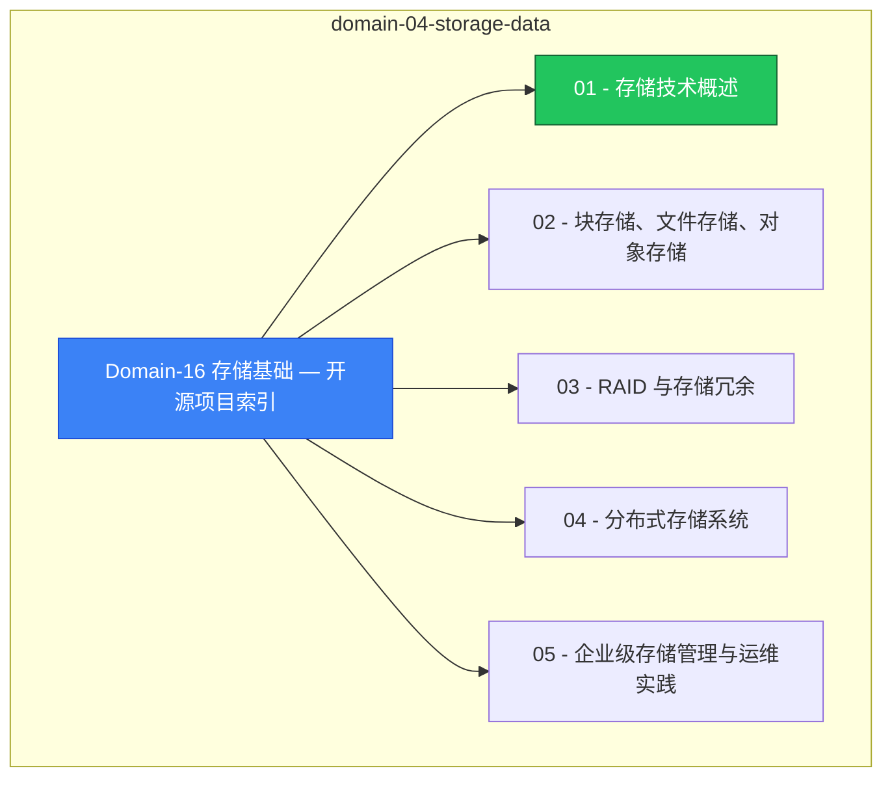

> **生产环境安全提示**
>
> 本文档包含可直接执行的运维命令。执行前请确认：当前目标集群与 Namespace 是否正确；是否具备足够的 RBAC 权限；是否已在非生产环境验证。命令风险等级标注：🔴 高风险（可能造成数据丢失或服务中断）、🟡 中风险（会修改集群状态，但通常可回滚）、🟢 低风险/只读（信息收集，无副作用）。

# domain-04-storage-data MOC

> **MOC 版本**: 1.0
> **知识域**: domain-04-storage-data
> **文档数量**: 7 篇
> **最后更新**: 2026-05-21
> **用途**: 本知识域的导航入口，汇总所有相关文档、关联领域、和场景入口

---

## 领域概述

存储基础 — 文件系统、块存储、对象存储原理

### 知识域定位

| 维度 | 说明 |
|---|---|
| **知识域** | domain-04-storage-data |
| **文档数量** | 7 篇 |
| **难度分布** | 入门 0 / 进阶 0 / 高级 0 / 专家 0 |

---

## 文档清单

| # | 文档 | 难度 | 标签 | 估计阅读时间 |
|---|---|---|---|---|
| 1 | Domain-16 存储基础 — 开源项目索引 |  | storage, fundamentals |  |
| 2 | 01 - 存储技术概述 |  | storage, fundamentals, deep-dive |  |
| 3 | 02 - 块存储、文件存储、对象存储 |  | storage, fundamentals |  |
| 4 | 03 - RAID 与存储冗余 |  | storage, fundamentals |  |
| 5 | 04 - 分布式存储系统 |  | storage, fundamentals |  |
| 6 | 05 - 企业级存储管理与运维实践 |  | storage, fundamentals |  |
| 7 | 06 - 存储性能与 IOPS |  | storage, fundamentals, performance |  |

---

## 知识图谱

---

## 关联入口

| 入口 | 说明 |
|---|---|
| FTA 故障树 | domain-04-storage-data 相关故障树分析 |
| Skills 技能 | domain-04-storage-data 相关操作技能 |
| 深度研究入口 | 语料库索引与向量检索 |

---

## 统计信息

| 指标 | 数值 |
|---|---|
| 文档总数 | 7 |
| 覆盖 K8s 版本 | v1.25 - v1.32 |

---

*本文档由 scripts/generate-mocs.py 自动生成，最后更新 2026-05-21。*

<!-- risk-assessed -->
