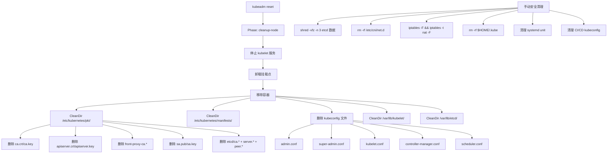
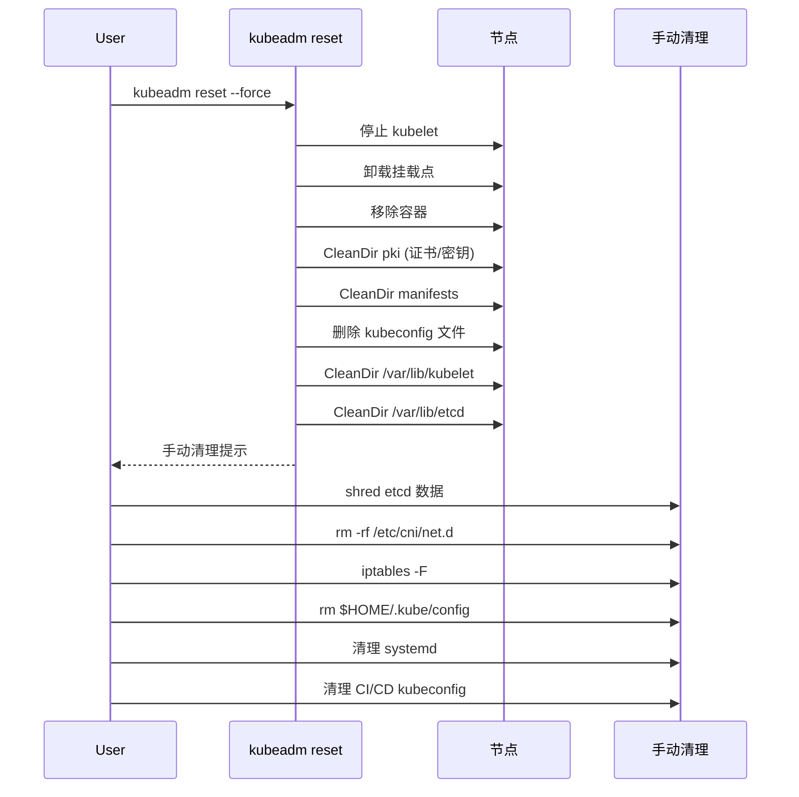

> **生产环境安全提示**
>
> 本文档包含可直接执行的运维命令。执行前请确认：当前目标集群与 Namespace 是否正确；是否具备足够的 RBAC 权限；是否已在非生产环境验证。命令风险等级标注：🔴 高风险（可能造成数据丢失或服务中断）、🟡 中风险（会修改集群状态，但通常可回滚）、🟢 低风险/只读（信息收集，无副作用）。


title: 删除时的安全清理
category: cluster-delete
tags:
- security
- certificate
- pki
- shred
- etcd-data
- kubeconfig
- systemd
- cleanup
last_updated: 2026-05-18
description: 深入分析 Kubernetes 集群删除时的安全清理机制，涵盖证书/密钥完整删除、etcd 数据安全擦除、RBAC 残留清理、systemd
  配置移除以及 CI/CD kubeconfig 清理等关键安全考量。
difficulty: advanced
intent_queries:
- kubernetes cluster deletion security cleanup
- kubeadm reset certificate cleanup security
- etcd data secure wipe kubernetes
- kubernetes security cleanup before cluster delete
- shred etcd data kubernetes cluster
trigger_keywords:
- security cleanup
- certificate deletion
- shred -vfz
- etcd data wipe
- kubeconfig cleanup
- systemd cleanup
- RBAC cleanup
- admin.conf
- super-admin.conf
- bootstrap-token
reading_level: advanced
audience:
- platform-engineer
- security-engineer
- sre
estimated_read_time: 5min
related_domains:
- domain-01-cluster-fundamentals
- domain-01-cluster-fundamentals
related_topics:
- cluster-delete
- cleanup
- etcd-cleanup
- network-cleanup
- reset-phase-commands
domain_link: '[Installation](../domain-01-cluster-fundamentals/README.md)'
topic_link: '[Cluster Delete Overview](./01-overview.md)'
authors:
- name: KUDIG Team
  role: contributor
k8s_versions:
- '1.28'
- '1.29'
- '1.30'
- '1.31'
- '1.32'
---

# 删除时的安全清理

## 函数签名

```go
func runCleanupNode(c workflow.RunData) error
func CleanDir(targetPath string) error
func RemoveStackedEtcdMember(client clientset.Interface, cfg *kubeadmapi.InitConfiguration, timeout time.Duration) error
func CleanupTmpDir(tmpDir string) error

// 安全擦除（外部工具）
// shred -vfz -n 3 <file>
// dd if=/dev/urandom of=/dev/sdX bs=1M

```

## 源码位置

| 组件 | 源码路径 | 说明 |
|------|---------|------|
| 节点清理 | `cmd/kubeadm/app/cmd/phases/reset/cleanupnode.go` | 清理证书/容器/目录 |
| etcd 移除 | `cmd/kubeadm/app/phases/etcd/local.go` | RemoveStackedEtcdMember |
| 垃圾回收 | `pkg/controller/garbagecollector/` | 级联删除 |
| Secret 控制器 | `pkg/controller/secret/` | SA Token 管理 |
| RBAC 注册 | `cmd/kubeadm/app/phases/markcontrolplane/` | kubeadm RBAC 资源 |

## 参数说明

### 自动清理的证书文件

| 路径 | 清理方式 | 说明 |
|------|---------|------|
| `/etc/kubernetes/pki/*.crt` | CleanDir 内容 | 所有证书 |
| `/etc/kubernetes/pki/*.key` | CleanDir 内容 | 所有私钥 |
| `/etc/kubernetes/pki/etcd/` | CleanDir 内容 | etcd 证书子目录 |
| `/var/lib/kubelet/pki/` | CleanDir | kubelet 证书 |
| `/var/lib/etcd/member/` | CleanDir | etcd 数据（含 WAL） |

### 自动清理的 kubeconfig 文件

| 文件 | 说明 |
|------|------|
| `/etc/kubernetes/admin.conf` | 管理员 kubeconfig |
| `/etc/kubernetes/super-admin.conf` | 超级管理员 kubeconfig (v1.29+) |
| `/etc/kubernetes/kubelet.conf` | kubelet kubeconfig |
| `/etc/kubernetes/bootstrap-kubelet.conf` | Bootstrap kubeconfig |
| `/etc/kubernetes/controller-manager.conf` | CM kubeconfig |
| `/etc/kubernetes/scheduler.conf` | Scheduler kubeconfig |

### 需要手动清理的内容

| 内容 | 路径/命令 | 安全风险 |
|------|---------|---------|
| CNI 配置 | `/etc/cni/net.d/` | 低 |
| iptables 规则 | `iptables -F && iptables -t nat -F` | 中 |
| IPVS 规则 | `ipvsadm -C` | 中 |
| 用户 kubeconfig | `$HOME/.kube/config` | 高（含管理员凭证） |
| CI/CD kubeconfig | GitLab/Jenkins Secret Store | 高 |
| etcd 快照 | `snapshot*.db` | 高（含所有 Secret） |
| 加密配置 | `encryption-config.yaml` | 高 |
| 审计日志 | `/var/log/kubernetes/audit.log` | 中 |

### 安全清理检查清单

```
□ /etc/kubernetes/pki/ 内容已清除
□ /var/lib/kubelet/pki/ 已清除
□ /var/lib/etcd/ 已安全擦除
□ /etc/kubernetes/*.conf 已删除
□ $HOME/.kube/config 已删除
□ etcd 快照备份已安全擦除
□ 加密配置文件已安全擦除
□ 审计日志已安全擦除
□ systemd 服务配置已清理
□ CI/CD 中的 kubeconfig 已轮换/删除
□ Bootstrap Token 已过期/删除
□ RBAC 绑定已清理
□ cloud IAM Role/Policy 已分离
```

## 返回值

| 函数 | 返回值 | 说明 |
|------|--------|------|
| `runCleanupNode` | `error` | 清理成功或失败 |
| `CleanDir` | `error` | 目录清理成功或失败 |
| `RemoveStackedEtcdMember` | `error` | etcd 移除成功或失败 |

## 调用链



## 源码分析

### 概述

集群删除时的安全清理涵盖证书/密钥/凭证的完整删除、etcd 数据的安全擦除、RBAC 残留清理和 systemd 配置移除。`kubeadm reset` 的 `cleanup-node` 阶段自动清理标准路径下的证书和配置文件，但管理员 kubeconfig、CNI 配置、iptables 规则等需要手动处理。

### 证书清理详情

```
/etc/kubernetes/pki/                    ← 目录保留，内容清除
├── ca.crt                              ✅ 已清理
├── ca.key                              ✅ 已清理
├── apiserver.crt                       ✅ 已清理
├── apiserver.key                       ✅ 已清理
├── apiserver-kubelet-client.crt        ✅ 已清理
├── apiserver-kubelet-client.key        ✅ 已清理
├── front-proxy-ca.crt                  ✅ 已清理
├── front-proxy-ca.key                  ✅ 已清理
├── front-proxy-client.crt              ✅ 已清理
├── front-proxy-client.key              ✅ 已清理
├── sa.pub                              ✅ 已清理
├── sa.key                              ✅ 已清理
└── etcd/
    ├── ca.crt                          ✅ 已清理
    ├── ca.key                          ✅ 已清理
    ├── server.crt                      ✅ 已清理
    ├── server.key                      ✅ 已清理
    ├── peer.crt                        ✅ 已清理
    ├── peer.key                        ✅ 已清理
    ├── healthcheck-client.crt          ✅ 已清理
    └── healthcheck-client.key          ✅ 已清理
```

### admin.conf vs super-admin.conf

```
┌──────────────────────────────────────────────────────────────┐
│  admin.conf                                                  │
│  ├─ CN: kubernetes-admin                                     │
│  ├─ O: system:masters                                        │
│  └─ 权限: cluster-admin（通过 RBAC 绑定）                     │
│                                                                │
│  super-admin.conf (v1.29+)                                    │
│  ├─ CN: kubernetes-super-admin                                │
│  ├─ O: system:masters                                         │
│  └─ 权限: 绕过 RBAC（通过 --super-admin-group 标志）          │
│                                                                │
│  ⚠️ 两者都具有完全集群控制权，必须全部清理                     │
└──────────────────────────────────────────────────────────────┘
```

### etcd 数据安全

etcd 中包含的敏感信息：

```
┌──────────────────────────────────────────────────────────────┐
│  etcd 中包含的敏感信息                                        │
├──────────────────────────────────────────────────────────────┤
│  Secret (Base64 编码)                                         │
│  ├─ TLS 证书和私钥                                            │
│  ├─ 数据库密码                                                │
│  ├─ API Token                                                 │
│  └─ SSH 私钥                                                  │
│  ConfigMap (kubeadm-config 含集群配置)                         │
│  RBAC 对象 (ClusterRole/ClusterRoleBinding)                    │
│  Audit 策略                                                   │
└──────────────────────────────────────────────────────────────┘
```

### 安全删除 etcd 数据

> ⚠️ **🔴 灾难性操作** — 含不可逆命令，执行前必须满足变更窗口+双人复核+事前备份+回滚方案
> - `rm -rf (系统/数据路径)`：删除系统或数据文件，可能摧毁节点或丢失全部数据

```bash
# 普通删除（数据可能被恢复）
rm -rf /var/lib/etcd  # ⚠️ 删除系统/数据文件

# 安全擦除（推荐处理敏感数据）
shred -vfz -n 3 /var/lib/etcd/member/snap/*
shred -vfz -n 3 /var/lib/etcd/member/wal/*
rm -rf /var/lib/etcd  # ⚠️ 删除系统/数据文件

# 或使用 dd 覆写整个分区
dd if=/dev/urandom of=/dev/sdX bs=1M

# 安全检查：确认目录已清空
ls -la /var/lib/etcd  # 应为空或不存在
```

### 云厂商残留资源清理

> **🔴 高风险操作警告**
>
> 下方命令属于不可逆或高影响操作，执行前请确认：
> - 已备份关键数据与配置
> - 处于批准的变更窗口期
> - 已获得相关责任人授权
> - 已准备回滚或恢复方案
> - 目标集群、Namespace、节点/资源名称正确无误

``` bash
# 🔴 高风险：可能造成数据丢失或服务中断，执行前需备份、变更审批与回滚方案
# AWS: 检查并清理 EBS 卷
aws ec2 describe-volumes --filters "Name=tag:KubernetesCluster,Values=<cluster-name>" --query 'Volumes[*].VolumeId'
aws ec2 delete-volume --volume-id <volume-id>

# Azure: 检查并清理托管磁盘
az disk list --resource-group <rg> --query '[].id'
az disk delete --ids <disk-id>

# GCP: 检查并清理持久磁盘
gcloud compute disks list --filter="labels.k8s-cluster=<cluster-name>"
gcloud compute disks delete <disk-name> --zone=<zone>

# 阿里云: 检查并清理云盘
aliyun ecs DescribeDisks --RegionId <region> --Tag "kubernetes.io/cluster/<cluster-id>"
aliyun ecs DeleteDisk --DiskId <disk-id>
```
### kubeadm 创建的 RBAC 资源

```
┌──────────────────────────────────────────────────────────────┐
│  ClusterRole:                                                 │
│  ├─ kubeadm:get-nodes                                         │
│  ├─ system:node-bootstrapper                                  │
│  └─ system:certificates.k8s.io:certificatesigningrequests    │
│                                                                │
│  ClusterRoleBinding:                                          │
│  ├─ kubeadm:node-bootstrapper                                 │
│  ├─ kubeadm:bootstrap-signer                                  │
│  └─ kubeadm:automatic-approve-all-csrs                       │
│                                                                │
│  Secret:                                                      │
│  ├─ bootstrap-token-<token-id> (kube-system)                  │
│  └─ kubeadm-certs (kube-system, HA 证书上传)                 │
└──────────────────────────────────────────────────────────────┘
```

### systemd 清理

> ⚠️ **🔴 灾难性操作** — 含不可逆命令，执行前必须满足变更窗口+双人复核+事前备份+回滚方案
> - `rm -rf (系统/数据路径)`：删除系统或数据文件，可能摧毁节点或丢失全部数据
> - `systemctl stop/restart`：停止/重启系统服务，影响节点上所有容器

> **🔴 高风险操作警告**
>
> 下方命令属于不可逆或高影响操作，执行前请确认：
> - 已备份关键数据与配置
> - 处于批准的变更窗口期
> - 已获得相关责任人授权
> - 已准备回滚或恢复方案
> - 目标集群、Namespace、节点/资源名称正确无误

``` bash
# 🔴 高风险：可能造成数据丢失或服务中断，执行前需备份、变更审批与回滚方案
systemctl stop kubelet 2>/dev/null || true
systemctl disable kubelet 2>/dev/null || true
rm -f /etc/systemd/system/kubelet.service
rm -rf /etc/systemd/system/kubelet.service.d/  # ⚠️ 删除系统/数据文件
systemctl daemon-reload
```
## 执行流程



## 使用场景

1. **生产节点退役**：完整安全清理防止凭证泄露
2. **开发环境重置**：快速清理后重新部署
3. **合规审计**：确保敏感数据完全擦除
4. **多租户环境**：彻底清理防止跨租户数据泄露
5. **etcd 数据保护**：安全擦除 etcd 快照和 WAL

## 配置示例

```yaml
apiVersion: kubeadm.k8s.io/v1beta4
kind: ResetConfiguration
certificatesDir: /etc/kubernetes/pki
cleanupTmpDir: true
force: true
skipPhases: []
```

## 实战示例

### 完整安全清理脚本

> ⚠️ **🔴 灾难性操作** — 含不可逆命令，执行前必须满足变更窗口+双人复核+事前备份+回滚方案
> - `kubeadm reset`：清理节点所有 K8s 配置/证书/CNI，节点脱离集群
> - `rm -rf (系统/数据路径)`：删除系统或数据文件，可能摧毁节点或丢失全部数据
> - `iptables -F/-P DROP`：清空/改防火墙规则，可能立即断网(含SSH)
> - `systemctl stop/restart`：停止/重启系统服务，影响节点上所有容器

> **🔴 高风险操作警告**
>
> 下方命令属于不可逆或高影响操作，执行前请确认：
> - 已备份关键数据与配置
> - 处于批准的变更窗口期
> - 已获得相关责任人授权
> - 已准备回滚或恢复方案
> - 目标集群、Namespace、节点/资源名称正确无误

``` bash
# 🔴 高风险：可能造成数据丢失或服务中断，执行前需备份、变更审批与回滚方案
#!/bin/bash
set -euo pipefail

echo "=== Step 1: kubeadm reset ==="  # ⚠️ 清理节点所有 K8s 配置
kubeadm reset --force --cleanup-tmp-dir  # ⚠️ 清理节点所有 K8s 配置

echo "=== Step 2: 安全擦除 etcd ==="
if [ -d /var/lib/etcd ]; then
    find /var/lib/etcd -type f -exec shred -vfz -n 3 {} \;
    rm -rf /var/lib/etcd  # ⚠️ 删除系统/数据文件
fi

echo "=== Step 3: 清理 CNI ==="
rm -rf /etc/cni/net.d  # ⚠️ 删除系统/数据文件

echo "=== Step 4: 清理 iptables ==="
iptables -F
iptables -t nat -F
iptables -t mangle -F
iptables -X
ipvsadm -C 2>/dev/null || true

echo "=== Step 5: 清理 kubeconfig ==="
rm -rf $HOME/.kube  # ⚠️ 删除系统/数据文件

echo "=== Step 6: 清理 systemd ==="
systemctl stop kubelet 2>/dev/null || true
systemctl disable kubelet 2>/dev/null || true
rm -f /etc/systemd/system/kubelet.service
rm -rf /etc/systemd/system/kubelet.service.d/  # ⚠️ 删除系统/数据文件
systemctl daemon-reload

echo "=== Step 7: 清理 etcd 快照 ==="
find / -name "snapshot*.db" -o -name "etcd-snapshot*" 2>/dev/null | while read f; do
    shred -vfz -n 3 "$f"
    rm -f "$f"
done

echo "=== 安全清理完成 ==="

```
## 常见错误

| 错误 | 现象 | 原因 | 解决方案 |
|------|------|------|----------|
| etcd 数据残留 | 重部署时 etcd 数据冲突 | reset 未完全清理 etcd | 手动 `rm -rf /var/lib/etcd` |
| kubeconfig 泄露 | 旧凭证仍可访问集群 | `$HOME/.kube/config` 未删除 | `rm -rf $HOME/.kube` |
| iptables 残留 | 新集群网络异常 | reset 不清理 iptables | `iptables -F && iptables -t nat -F` |
| systemd 残留 | kubelet 被自动拉起 | unit 文件未删除 | `rm -rf /etc/systemd/system/kubelet.service.d/` |
| CI/CD 凭证泄露 | 旧集群 kubeconfig 在 Git 中 | 未轮换 Secret | 在 CI/CD 平台删除并重新生成 |
| etcd 快照泄露 | 快照包含所有 Secret | 快照文件未安全删除 | `shred -vfz -n 3` 安全擦除 |

## 相关函数

- [`runCleanupNode`](04-cleanup.md) — 节点清理阶段
- [`CleanDir`](04-cleanup.md) — 目录清理工具
- [`RemoveStackedEtcdMember`](05-etcd-cleanup.md) — etcd 成员移除
- [`网络清理`](11-network-cleanup.md) — CNI/iptables 清理
- [`证书生成`](../cluster-cert/02-ca-generation.md) — 理解证书文件结构

## Related

- [[reference|#reference Hub]] — tag hub

- [[README|README]]
- [[scripts/man/INSTALL.md|INSTALL]]
- [[domain-17-system-foundation/速查卡/go.md|go]]
- [[domain-17-system-foundation/速查卡/k8s.md|k8s]]
- [[domain-17-system-foundation/速查卡/git.md|git]]

```

<!-- risk-assessed -->
