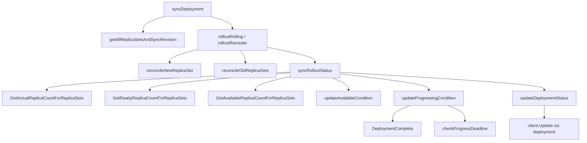

> **生产环境安全提示**
>
> 本文档包含可直接执行的运维命令。执行前请确认：当前目标集群与 Namespace 是否正确；是否具备足够的 RBAC 权限；是否已在非生产环境验证。命令风险等级标注：🔴 高风险（可能造成数据丢失或服务中断）、🟡 中风险（会修改集群状态，但通常可回滚）、🟢 低风险/只读（信息收集，无副作用）。


title: Deployment Status 计算逻辑
category: deployment
tags:
- deployment-status
- availableReplicas
- readyReplicas
- condition
- observedGeneration
- progressDeadline
last_updated: 2026-05-18
description: 深入分析 Kubernetes Deployment Status 字段的计算逻辑，涵盖 syncRolloutStatus、Condition
  计算、Available/Progressing 条件、ObservedGeneration 机制以及 Progress Deadline 超时检测。
difficulty: advanced
intent_queries:
- kubernetes deployment status calculation source
- AvailableReplicas vs ReadyReplicas kubernetes
- DeploymentComplete condition kubernetes
- observedGeneration kubernetes deployment
- progressDeadlineExceeded kubernetes
trigger_keywords:
- syncRolloutStatus
- AvailableReplicas
- ReadyReplicas
- UpdatedReplicas
- UnavailableReplicas
- DeploymentComplete
- ProgressDeadlineExceeded
- ObservedGeneration
- MinimumReplicasAvailable
- NewReplicaSetAvailable
reading_level: advanced
audience:
- platform-engineer
- kubernetes-developer
- sre
estimated_read_time: 5min
related_domains:
- domain-02-workloads-applications
- domain-01-cluster-fundamentals
related_topics:
- deployment-controller
- rolling-update
- revision-history
domain_link: '[Workloads](../domain-02-workloads-applications/README.md)'
topic_link: '[Deployment Create](./README.md)'
authors:
- name: KUDIG Team
  role: contributor
k8s_versions:
- '1.28'
- '1.29'
- '1.30'
- '1.31'
- '1.32'
---

# Deployment Status 计算逻辑

## 概述

Deployment 的 `Status` 字段反映了控制器当前执行的真实状态，包括副本数、可用性、进度和条件。控制器每次同步完成后都会更新 Status，这是用户和外部系统（如 HPA、ArgoCD）判断 Deployment 健康度的核心依据。Status 计算逻辑分布在多个源文件中，涉及 ReplicaSet 状态聚合、Condition 推导、超时检测等多个子系统。本文档从源码层面全面分析 Deployment Status 的计算过程、各字段的语义含义以及与外部系统的集成方式。

---

## 函数签名

```go
func (dc *DeploymentController) syncRolloutStatus(
    ctx context.Context,
    allRSs []*apps.ReplicaSet,
    newRS *apps.ReplicaSet,
    deployment *apps.Deployment,
) error

func (dc *DeploymentController) updateAvailableCondition(
    status *apps.DeploymentStatus,
    d *apps.Deployment,
)

func (dc *DeploymentController) updateProgressingCondition(
    status *apps.DeploymentStatus,
    d *apps.Deployment,
    allRSs []*apps.ReplicaSet,
    newRS *apps.ReplicaSet,
)

func deploymentutil.DeploymentComplete(
    deployment *apps.Deployment,
    newStatus *apps.DeploymentStatus,
) bool

func deploymentutil.GetActualReplicaCountForReplicaSets(
    replicaSets []*apps.ReplicaSet,
) int32

func deploymentutil.GetReadyReplicaCountForReplicaSets(
    replicaSets []*apps.ReplicaSet,
) int32

func deploymentutil.GetAvailableReplicaCountForReplicaSets(
    replicaSets []*apps.ReplicaSet,
    minReadySeconds int32,
) int32
```

---

## 源码位置

| 功能 | 文件路径 |
|------|---------|
| Status 计算 | `pkg/controller/deployment/progress.go` |
| Status 同步 | `pkg/controller/deployment/sync.go` |
| 工具函数 | `pkg/controller/deployment/util/deployment_util.go` |
| 副本计数 | `pkg/controller/deployment/util/replicaset_util.go` |
| Condition 更新 | `pkg/controller/deployment/condition.go` |

---

## 参数说明

| 参数 | 类型 | 说明 |
|------|------|------|
| `allRSs` | `[]*apps.ReplicaSet` | 关联到该 Deployment 的所有 ReplicaSet，包括新旧版本 |
| `newRS` | `*apps.ReplicaSet` | 最新版本的 ReplicaSet，滚动更新的目标 |
| `deployment` | `*apps.Deployment` | 当前 Deployment 对象，包含 Spec 和旧 Status |
| `ctx` | `context.Context` | 上下文，用于取消和超时控制 |
| `newStatus` | `*apps.DeploymentStatus` | 计算出的新 Status，用于与旧 Status 对比 |
| `minReadySeconds` | `int32` | Pod Ready 后必须持续的时间才能视为 Available |

---

## 返回值

| 函数 | 返回值 | 说明 |
|------|--------|------|
| `syncRolloutStatus` | `error` | Status 更新失败时返回错误 |
| `updateAvailableCondition` | 无 | 直接修改传入的 Status 指针 |
| `DeploymentComplete` | `bool` | 四个条件全部满足时返回 true |
| `GetActualReplicaCountForReplicaSets` | `int32` | 所有 RS 的 Status.Replicas 之和 |
| `GetReadyReplicaCountForReplicaSets` | `int32` | 所有 RS 的 Status.ReadyReplicas 之和 |

---

## 调用链



---

## Status 结构

```yaml
apiVersion: apps/v1
kind: Deployment
status:
  observedGeneration: 3
  replicas: 5
  updatedReplicas: 5
  readyReplicas: 5
  availableReplicas: 5
  unavailableReplicas: 0
  conditions:
  - type: Progressing
    status: "True"
    reason: NewReplicaSetAvailable
    message: ReplicaSet "nginx-7c4c8d5d4f" has successfully progressed.
  - type: Available
    status: "True"
    reason: MinimumReplicasAvailable
```

---

## Status 字段计算源码

```go
func (dc *DeploymentController) syncRolloutStatus(ctx context.Context, allRSs []*apps.ReplicaSet, newRS *apps.ReplicaSet, deployment *apps.Deployment) error {
    totalActualReplicas := deploymentutil.GetActualReplicaCountForReplicaSets(allRSs)
    updatedReplicas := deploymentutil.GetActualReplicaCountForReplicaSets([]*apps.ReplicaSet{newRS})
    readyReplicas := deploymentutil.GetReadyReplicaCountForReplicaSets(allRSs)
    availableReplicas := deploymentutil.GetAvailableReplicaCountForReplicaSets(allRSs, deployment.Spec.MinReadySeconds)
    unavailableReplicas := totalActualReplicas - availableReplicas
    if unavailableReplicas < 0 {
        unavailableReplicas = 0
    }
    newStatus := apps.DeploymentStatus{
        ObservedGeneration:     deployment.Generation,
        Replicas:               totalActualReplicas,
        UpdatedReplicas:        updatedReplicas,
        ReadyReplicas:          readyReplicas,
        AvailableReplicas:      availableReplicas,
        UnavailableReplicas:    unavailableReplicas,
    }
    newStatus.Conditions = dc.updateConditions(deployment, newStatus, allRSs, newRS)
    return dc.updateDeploymentStatus(ctx, deployment, &newStatus)
}
```

---

## 各字段计算详解

### 1. Replicas — 总 Pod 数

```go
totalActualReplicas := deploymentutil.GetActualReplicaCountForReplicaSets(allRSs)
```

**注意**：这是所有 RS（新旧）的 Pod 总数，可能大于 `Spec.Replicas`（滚动更新期间受 maxSurge 影响）。

**计算方式**：遍历每个 ReplicaSet，累加 `rs.Status.Replicas`。

### 2. UpdatedReplicas — 已更新副本数

```go
updatedReplicas := deploymentutil.GetActualReplicaCountForReplicaSets([]*apps.ReplicaSet{newRS})
```

**意义**：
- `UpdatedReplicas == Spec.Replicas` 表示所有 Pod 都已更新到最新版本
- 滚动更新完成的核心指标
- 如果 `newRS == nil`（首次创建），则 `UpdatedReplicas == 0`

### 3. ReadyReplicas — Ready 状态副本数

```go
readyReplicas := deploymentutil.GetReadyReplicaCountForReplicaSets(allRSs)
```

**Ready 判断条件**：
- Pod 的所有容器都已启动并通过 readinessProbe
- 或没有配置 readinessProbe 时容器已运行

**源码实现**：

```go
func GetReadyReplicaCountForReplicaSets(replicaSets []*apps.ReplicaSet) int32 {
    var totalReadyReplicas int32
    for _, rs := range replicaSets {
        if rs == nil {
            continue
        }
        totalReadyReplicas += rs.Status.ReadyReplicas
    }
    return totalReadyReplicas
}
```

### 4. AvailableReplicas — 可用副本数

```go
availableReplicas := deploymentutil.GetAvailableReplicaCountForReplicaSets(allRSs, deployment.Spec.MinReadySeconds)
```

**关键区别**：

| 字段 | 条件 | 用途 |
|-----|------|------|
| `ReadyReplicas` | Pod Ready | 反映瞬时状态 |
| `AvailableReplicas` | Pod Ready **且** 持续 `minReadySeconds` | 反映稳定状态，用于可用性保证 |

**`minReadySeconds` 的作用**：
```yaml
spec:
  minReadySeconds: 30
```

- 防止 Pod 刚 Ready 后立即崩溃导致的流量损失
- 给 Pod 一个"稳定期"
- 默认值：`0`（立即视为 Available）

**源码实现**：

```go
func GetAvailableReplicaCountForReplicaSets(replicaSets []*apps.ReplicaSet, minReadySeconds int32) int32 {
    var totalAvailableReplicas int32
    for _, rs := range replicaSets {
        if rs == nil {
            continue
        }
        if rs.Status.AvailableReplicas == 0 {
            continue
        }
        totalAvailableReplicas += rs.Status.AvailableReplicas
    }
    return totalAvailableReplicas
}
```

### 5. UnavailableReplicas — 不可用副本数

```go
unavailableReplicas := totalActualReplicas - availableReplicas
```

**什么时候大于 0**：
- 滚动更新期间，新 Pod 还未 Ready
- Pod 因健康检查失败变成 NotReady
- 节点问题导致 Pod 不可达
- Pod 刚创建但 `minReadySeconds` 尚未到期

---

## Conditions 条件计算

Deployment Status 包含两个核心 Condition：

### 1. Available 条件

```go
func (dc *DeploymentController) updateAvailableCondition(status *apps.DeploymentStatus, d *apps.Deployment) {
    minAvailable := *(d.Spec.Replicas) - maxUnavailable
    if status.AvailableReplicas >= minAvailable {
        SetDeploymentCondition(status, apps.DeploymentAvailable, v1.ConditionTrue,
            "MinimumReplicasAvailable",
            fmt.Sprintf("Deployment has minimum availability."))
    } else {
        SetDeploymentCondition(status, apps.DeploymentAvailable, v1.ConditionFalse,
            "MinimumReplicasUnavailable",
            fmt.Sprintf("Deployment does not have minimum availability."))
    }
}
```

**判断逻辑**：
- 从 Deployment Spec 中获取 `Replicas` 和 `MaxUnavailable`
- 计算 `minAvailable = Replicas - MaxUnavailable`
- 如果 `AvailableReplicas >= minAvailable`，则 `Available = True`

### 2. Progressing 条件

```go
func (dc *DeploymentController) updateProgressingCondition(status *apps.DeploymentStatus, d *apps.Deployment, allRSs []*apps.ReplicaSet, newRS *apps.ReplicaSet) {
    if deploymentutil.DeploymentComplete(d, status) {
        SetDeploymentCondition(status, apps.DeploymentProgressing, v1.ConditionTrue,
            "NewReplicaSetAvailable",
            fmt.Sprintf("ReplicaSet \"%s\" has successfully progressed.", newRS.Name))
        return
    }
    if d.Spec.Paused {
        SetDeploymentCondition(status, apps.DeploymentProgressing, v1.ConditionUnknown,
            "DeploymentPaused", "Deployment is paused")
        return
    }
    if deploymentutil.DeploymentProgressing(d, status) {
        deadline := time.Duration(*d.Spec.ProgressDeadlineSeconds) * time.Second
        if time.Since(getLastProgressTime(d, status)) > deadline {
            SetDeploymentCondition(status, apps.DeploymentProgressing, v1.ConditionFalse,
                "ProgressDeadlineExceeded",
                fmt.Sprintf("ReplicaSet \"%s\" has timed out progressing.", newRS.Name))
        }
    }
}
```

**Progressing Condition 的五种状态**：

| 状态 | Reason | 含义 |
|------|--------|------|
| `True` | `NewReplicaSetAvailable` | 滚动更新已完成 |
| `True` | `ReplicaSetUpdated` | 滚动更新正在进行中 |
| `False` | `ProgressDeadlineExceeded` | 超过 progressDeadlineSeconds 未完成 |
| `Unknown` | `DeploymentPaused` | Deployment 已暂停 |
| `True` | `NewReplicaSetCreated` | 新 RS 刚创建 |

---

## DeploymentComplete 判断逻辑

```go
func DeploymentComplete(deployment *apps.Deployment, newStatus *apps.DeploymentStatus) bool {
    return newStatus.UpdatedReplicas == *(deployment.Spec.Replicas) &&
        newStatus.Replicas == *(deployment.Spec.Replicas) &&
        newStatus.AvailableReplicas == *(deployment.Spec.Replicas) &&
        newStatus.ObservedGeneration >= deployment.Generation
}
```

**完成条件（全部必须满足）**：
1. `UpdatedReplicas == Spec.Replicas` — 所有 Pod 都是最新版本
2. `Replicas == Spec.Replicas` — 总副本数等于期望副本数（没有多余的旧 Pod）
3. `AvailableReplicas == Spec.Replicas` — 所有 Pod 都可用
4. `ObservedGeneration >= Generation` — 已处理最新的 Spec 变更

---

## Progress Deadline 机制

```yaml
spec:
  progressDeadlineSeconds: 600
```

### 超时检测逻辑

```go
func (dc *DeploymentController) checkProgressDeadline(deployment *apps.Deployment, newStatus *apps.DeploymentStatus) {
    if deployment.Spec.ProgressDeadlineSeconds == nil {
        return
    }
    condition := GetDeploymentCondition(newStatus, apps.DeploymentProgressing)
    if condition == nil {
        return
    }
    now := time.Now()
    lastProgressTime := condition.LastTransitionTime.Time
    deadline := time.Duration(*deployment.Spec.ProgressDeadlineSeconds) * time.Second
    if now.Sub(lastProgressTime) > deadline {
        SetDeploymentCondition(newStatus, apps.DeploymentProgressing, v1.ConditionFalse,
            "ProgressDeadlineExceeded",
            "Deployment exceeded its progress deadline")
        dc.eventRecorder.Eventf(deployment, v1.EventTypeWarning, "ProgressDeadlineExceeded",
            "ReplicaSet \"%s\" has timed out progressing.", newRS.Name)
    }
}
```

**常见超时原因**：
- 镜像拉取失败（ImagePullBackOff）
- 资源不足导致 Pod Pending
- 健康检查持续失败（CrashLoopBackOff）
- 节点 NotReady 导致 Pod 无法调度
- Pod 已经 Running 但 readinessProbe 始终不通过
- 镜像仓库网络抖动导致 pull 重试

---

## ObservedGeneration 的作用

```go
status:
  observedGeneration: 3
```

**Generation 机制**：
- `metadata.generation`：每次 `Spec` 变更时自动递增
- `status.observedGeneration`：控制器已处理到的 Generation

**用途**：
``` bash
# 🟢 低风险：只读/信息收集，通常无副作用
kubectl get deployment nginx -o jsonpath='{.metadata.generation} {.status.observedGeneration}'
# 输出: 3 3  → 已同步
# 输出: 4 3  → 新配置尚未处理完成
```
**为什么需要这个字段**：
- 控制器的同步是异步的
- 用户 apply 新配置后，不能立即假设新配置已生效
- `observedGeneration == generation` 表示控制器已完成对新 Spec 的处理
- HPA 和 AroCD 等外部系统使用此字段判断 Deployment 是否稳定

---

## ReplicaNotFound 状态处理

当 Deployment 的 ReplicaSet 被手动删除或异常丢失时，Status 计算需要处理 nil ReplicaSet 的情况：

```go
func GetActualReplicaCountForReplicaSets(replicaSets []*apps.ReplicaSet) int32 {
    var totalReplicas int32
    for _, rs := range replicaSets {
        if rs == nil {
            continue
        }
        totalReplicas += *(rs.Spec.Replicas)
    }
    return totalReplicas
}
```

**注意**：`GetActualReplicaCountForReplicaSets` 使用 `rs.Spec.Replicas`（期望副本数），而不是 `rs.Status.Replicas`（实际副本数）。这意味着 Status 中的 `Replicas` 字段反映的是所有 RS 的**期望副本数之和**，而非集群中实际运行的 Pod 数量。

---

## 执行流程

```
syncDeployment 入口
  │
  ├── 获取所有 ReplicaSet（新 + 旧）
  │     └── getAllReplicaSetsAndSyncRevision
  │
  ├── 判断策略类型
  │     ├── RollingUpdate → rolloutRolling
  │     └── Recreate → rolloutRecreate
  │
  ├── 执行具体更新逻辑
  │     ├── reconcileNewReplicaSet（扩容新 RS）
  │     └── reconcileOldReplicaSets（缩容旧 RS）
  │
  └── syncRolloutStatus（计算并更新 Status）
        ├── 计算各副本数字段
        │     ├── Replicas = Σ(rs.Spec.Replicas)
        │     ├── UpdatedReplicas = newRS.Spec.Replicas
        │     ├── ReadyReplicas = Σ(rs.Status.ReadyReplicas)
        │     ├── AvailableReplicas = Σ(rs.Status.AvailableReplicas)
        │     └── UnavailableReplicas = Replicas - AvailableReplicas
        │
        ├── 更新 Conditions
        │     ├── Available: AvailableReplicas >= Replicas - MaxUnavailable
        │     └── Progressing: 根据 DeploymentComplete/超时/暂停判断
        │
        └── 更新 Deployment Status
              └── client.Update（发送到 API Server）
```

---

## 使用场景

### 场景 1：判断 Deployment 是否健康

``` bash
# 🟢 低风险：只读/信息收集，通常无副作用
kubectl get deployment nginx -o json | jq '
  if (.status.observedGeneration == .metadata.generation)
     and (.status.updatedReplicas == .spec.replicas)
     and (.status.availableReplicas == .spec.replicas)
  then "HEALTHY"
  elif (.status.unavailableReplicas > 0) then "DEGRADED"
  elif (.status.observedGeneration != .metadata.generation) then "SYNCING"
  else "UNKNOWN"
  end
'
```
### 场景 2：HPA 与 Status 的交互

HPA 读取 `Status.AvailableReplicas` 和 `Spec.Replicas` 来计算当前利用率：

```go
utilization = (metricValue / requested) * 100
desiredReplicas = ceil[currentReplicas * (currentMetric / desiredMetric)]
```

### HPA 扩缩容时的 Status 变化

``` bash
# 🟢 低风险：只读/信息收集，通常无副作用
# HPA 基于 CPU 扩缩容场景
kubectl autoscale deployment web-app --cpu-percent=80 --min=3 --max=10

# HPA 计算:
# currentReplicas = 3
# currentMetric = 65% (低于 80% 阈值，不需要扩容)
# desiredReplicas = 3 (保持不变)

# 当负载上升，CPU 达到 85%:
# desiredReplicas = ceil[3 * (85/80)] = ceil[3.1875] = 4

# 扩缩后 Status 变化:
kubectl get deployment web-app -o jsonpath='{.status}'
# {
#   "replicas": 4,
#   "readyReplicas": 4,
#   "availableReplicas": 4,
#   "observedGeneration": 5
# }
```
### 场景 3：ArgoCD Rollout 判断

ArgoCD 使用 `ObservedGeneration` 和 `Conditions` 判断是否完成同步：

```yaml
apiVersion: argoproj.io/v1alpha1
kind: Rollout
status:
  phase: Healthy
  conditions:
    - type: Progressing
      status: "True"
```

---

## 配置示例 YAML

```yaml
apiVersion: apps/v1
kind: Deployment
metadata:
  name: nginx
  labels:
    app: nginx
spec:
  replicas: 5
  minReadySeconds: 30
  progressDeadlineSeconds: 600
  strategy:
    type: RollingUpdate
    rollingUpdate:
      maxSurge: 1
      maxUnavailable: 1
  selector:
    matchLabels:
      app: nginx
  template:
    metadata:
      labels:
        app: nginx
    spec:
      containers:
      - name: nginx
        image: nginx:1.25
        ports:
        - containerPort: 80
        readinessProbe:
          httpGet:
            path: /healthz
            port: 80
          initialDelaySeconds: 5
          periodSeconds: 10
```

---

## 实战示例

### 示例 1：诊断 Deployment 卡在 Progressing

``` bash
# 🟢 低风险：只读/信息收集，通常无副作用
kubectl get deployment nginx -o jsonpath='{
  "replicas": .status.replicas,
  "updated": .status.updatedReplicas,
  "ready": .status.readyReplicas,
  "available": .status.availableReplicas,
  "unavailable": .status.unavailableReplicas,
  "generation": .metadata.generation,
  "observedGen": .status.observedGeneration
}' | jq .
```
### 示例 2：监控 Status 变化

``` bash
# 🟢 低风险：只读/信息收集，通常无副作用
kubectl get deployment nginx -o jsonpath='{.status.conditions}' | jq '.[] | {type, status, reason, message}'
```
### 示例 3：等待 Deployment 完成

``` bash
# 🟢 低风险：只读/信息收集，通常无副作用
kubectl rollout status deployment/nginx --timeout=300s
```
### 示例 4：获取详细的 Condition 时间线

``` bash
# 🟢 低风险：只读/信息收集，通常无副作用
kubectl get deployment nginx -o json | jq '.status.conditions[] | {type, lastTransitionTime, lastUpdateTime, reason}'
```
---

## 常见错误

| 错误 | 现象 | 根因 | 解决 |
|-----|------|------|------|
| `ProgressDeadlineExceeded` | Progressing=False | 镜像拉取失败或健康检查持续失败 | 检查 Pod 事件和日志 |
| `MinimumReplicasUnavailable` | Available=False | 可用副本数低于阈值 | 检查 Pod 状态和节点健康 |
| `ObservedGeneration` 滞后 | generation != observedGeneration | 控制器未处理最新变更 | 检查 controller-manager 日志 |
| `UpdatedReplicas` 停滞不前 | UpdatedReplicas < Spec.Replicas | 新 Pod 无法启动 | 检查镜像、资源、健康检查 |
| `Replicas` 远大于 `Spec.Replicas` | totalPods >> desired | maxSurge 过大或旧 RS 未缩容 | 检查 rollingUpdate 配置 |
| `AvailableReplicas` 长期为 0 | minReadySeconds 过大 | Pod Ready 后不够稳定期 | 减小 minReadySeconds 或修复应用 |
| Condition 反复切换 | Available True/False 交替 | Pod 频繁崩溃恢复 | 检查 readinessProbe 配置 |

---

## 相关函数

| 函数 | 源码位置 | 说明 |
|------|---------|------|
| `syncRolloutStatus` | `pkg/controller/deployment/progress.go` | Status 计算主入口 |
| `DeploymentComplete` | `pkg/controller/deployment/util/deployment_util.go` | 完成判断 |
| `GetActualReplicaCountForReplicaSets` | `pkg/controller/deployment/util/deployment_util.go` | 副本计数 |
| `GetReadyReplicaCountForReplicaSets` | `pkg/controller/deployment/util/deployment_util.go` | Ready 副本计数 |
| `GetAvailableReplicaCountForReplicaSets` | `pkg/controller/deployment/util/deployment_util.go` | Available 副本计数 |
| `SetDeploymentCondition` | `pkg/controller/deployment/util/deployment_util.go` | 设置 Condition |
| `checkProgressDeadline` | `pkg/controller/deployment/progress.go` | 超时检测 |

## Related

- [[reference|#reference Hub]] — tag hub

- [[README|README]]
- [[domain-17-system-foundation/速查卡/go.md|go]]
- [[domain-17-system-foundation/速查卡/k8s.md|k8s]]
- [[entities/argo.md|argo]]
- [[entities/argocd.md|argocd]]


<!-- risk-assessed -->
