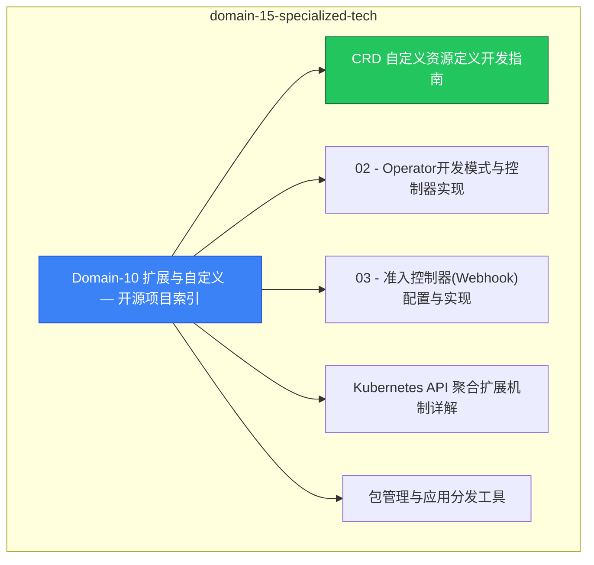

> **生产环境安全提示**
>
> 本文档包含可直接执行的运维命令。执行前请确认：当前目标集群与 Namespace 是否正确；是否具备足够的 RBAC 权限；是否已在非生产环境验证。命令风险等级标注：🔴 高风险（可能造成数据丢失或服务中断）、🟡 中风险（会修改集群状态，但通常可回滚）、🟢 低风险/只读（信息收集，无副作用）。

# domain-15-specialized-tech MOC

> **MOC 版本**: 1.0
> **知识域**: domain-15-specialized-tech
> **文档数量**: 20 篇
> **最后更新**: 2026-05-21
> **用途**: 本知识域的导航入口，汇总所有相关文档、关联领域、和场景入口

---

## 领域概述

扩展 — CRD、Operator、Webhook、API Aggregation

### 知识域定位

| 维度 | 说明 |
|---|---|
| **知识域** | domain-15-specialized-tech |
| **文档数量** | 20 篇 |
| **难度分布** | 入门 0 / 进阶 2 / 高级 1 / 专家 0 |

---

## 文档清单

| # | 文档 | 难度 | 标签 | 估计阅读时间 |
|---|---|---|---|---|
| 1 | Domain-10 扩展与自定义 — 开源项目索引 |  | k8s, crd, operator |  |
| 2 | CRD 自定义资源定义开发指南 | 高级 | k8s, crd, custom-resource | 5min |
| 3 | 02 - Operator开发模式与控制器实现 |  | k8s, crd, operator |  |
| 4 | 03 - 准入控制器(Webhook)配置与实现 |  | k8s, crd, operator |  |
| 5 | Kubernetes API 聚合扩展机制详解 |  | k8s, crd, operator |  |
| 6 | 包管理与应用分发工具 | 进阶 | k8s, helm, kustomize | 5min |
| 7 | 47 - Helm Chart开发与管理 |  | k8s, crd, operator |  |
| 8 | 129 - Helm 高级运维：复杂部署、CI/CD 集成与安全最佳实践 |  | k8s, crd, operator |  |
| 9 | CI/CD 管道 | 进阶 | k8s, cicd, gitops | 5min |
| 10 | 48 - GitOps工作流 |  | k8s, crd, operator |  |
| 11 | 103 - 容器镜像构建工具 (Container Image Build) |  | k8s, crd, operator |  |
| 12 | 20 - 服务网格集成表 |  | k8s, crd, operator |  |
| 13 | 49 - 服务网格进阶配置 |  | k8s, crd, operator |  |
| 14 | 130 - Kubernetes 运维基础技能：日志管理、备份恢复、安全加固与性能调优 |  | k8s, crd, operator |  |
| 15 | 14 - 多集群管理与联邦 (Multi-Cluster Management & Federation) |  | k8s, crd, operator |  |
| 16 | 15 - 监控告警体系 (Monitoring & Alerting System) |  | k8s, crd, operator |  |
| 17 | 16 - 安全合规管理 (Security & Compliance Management) |  | k8s, crd, operator |  |
| 18 | GraalVM Native Image 云原生实践指南 |  | k8s, crd, operator |  |
| 19 | Quarkus / Micronaut 云原生 Java 框架实践指南 |  | k8s, crd, operator |  |
| 20 | K8s Serverless / FaaS 实践指南 |  | k8s, crd, operator |  |

---

## 知识图谱

---

## 关联入口

| 入口 | 说明 |
|---|---|
| FTA 故障树 | domain-15-specialized-tech 相关故障树分析 |
| Skills 技能 | domain-15-specialized-tech 相关操作技能 |
| 深度研究入口 | 语料库索引与向量检索 |

---

## 统计信息

| 指标 | 数值 |
|---|---|
| 文档总数 | 20 |
| 覆盖 K8s 版本 | v1.25 - v1.32 |

---

*本文档由 scripts/generate-mocs.py 自动生成，最后更新 2026-05-21。*

<!-- risk-assessed -->
