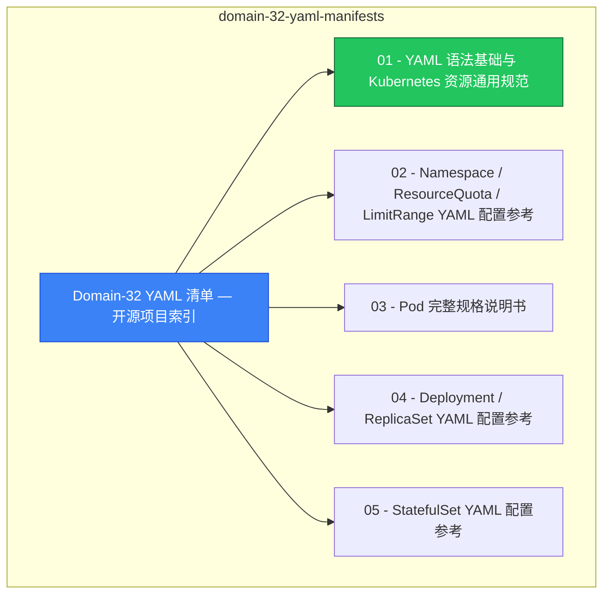

> **生产环境安全提示**
>
> 本文档包含可直接执行的运维命令。执行前请确认：当前目标集群与 Namespace 是否正确；是否具备足够的 RBAC 权限；是否已在非生产环境验证。命令风险等级标注：🔴 高风险（可能造成数据丢失或服务中断）、🟡 中风险（会修改集群状态，但通常可回滚）、🟢 低风险/只读（信息收集，无副作用）。

# domain-32-yaml-manifests MOC

> **MOC 版本**: 1.0
> **知识域**: domain-32-yaml-manifests
> **文档数量**: 37 篇
> **最后更新**: 2026-05-21
> **用途**: 本知识域的导航入口，汇总所有相关文档、关联领域、和场景入口

---

## 领域概述

YAML 清单 — 资源清单编写规范、最佳实践

### 知识域定位

| 维度 | 说明 |
|---|---|
| **知识域** | domain-32-yaml-manifests |
| **文档数量** | 37 篇 |
| **难度分布** | 入门 0 / 进阶 0 / 高级 0 / 专家 0 |

---

## 文档清单

| # | 文档 | 难度 | 标签 | 估计阅读时间 |
|---|---|---|---|---|
| 1 | Domain-32 YAML 清单 — 开源项目索引 |  | yaml, reference |  |
| 2 | 01 - YAML 语法基础与 Kubernetes 资源通用规范 |  | yaml, reference |  |
| 3 | 02 - Namespace / ResourceQuota / LimitRange YAML 配置参考 |  | yaml, reference |  |
| 4 | 03 - Pod 完整规格说明书 |  | yaml, reference |  |
| 5 | 04 - Deployment / ReplicaSet YAML 配置参考 |  | yaml, reference, deployment |  |
| 6 | 05 - StatefulSet YAML 配置参考 |  | yaml, reference |  |
| 7 | 06 - DaemonSet YAML 配置参考 |  | yaml, reference |  |
| 8 | 07 - Job / CronJob YAML 配置参考 |  | yaml, reference |  |
| 9 | 08 - Service 全类型 YAML 配置参考 |  | yaml, reference |  |
| 10 | 09 - Endpoints / EndpointSlice YAML 配置参考 |  | yaml, reference |  |
| 11 | 10 - Ingress / IngressClass YAML 配置参考 |  | yaml, reference |  |
| 12 | 11 - Gateway API 核心资源 YAML 配置参考 |  | yaml, reference |  |
| 13 | 12 - Gateway API 高级路由 YAML 配置参考 |  | yaml, reference |  |
| 14 | 13 - ConfigMap YAML 配置参考 |  | yaml, reference, configuration |  |
| 15 | 14 - Secret 全类型 YAML 配置参考 |  | yaml, reference |  |
| 16 | 15 - PersistentVolume YAML 配置参考 |  | yaml, reference |  |
| 17 | 16 - PersistentVolumeClaim YAML 配置参考 |  | yaml, reference |  |
| 18 | 17 - StorageClass / VolumeSnapshot YAML 配置参考 |  | yaml, reference, storage |  |
| 19 | 18 - CSI 驱动资源 YAML 配置参考 |  | yaml, reference |  |
| 20 | 19 - ServiceAccount / Token 管理 YAML 配置参考 |  | yaml, reference |  |
| 21 | 20 - Role / RoleBinding YAML 配置参考 |  | yaml, reference, rbac |  |
| 22 | 21 - ClusterRole / ClusterRoleBinding YAML 配置参考 |  | yaml, reference, rbac |  |
| 23 | 22 - NetworkPolicy YAML 配置参考 |  | yaml, reference, networking |  |
| 24 | 23 - Pod Security Standards (PSS/PSA) YAML 配置参考 |  | yaml, reference, security |  |
| 25 | 24 - Admission Webhook 配置参考 |  | yaml, reference, configuration |  |
| 26 | 25 - ValidatingAdmissionPolicy YAML 配置参考 |  | yaml, reference |  |
| 27 | 26 - PriorityClass / RuntimeClass YAML 配置参考 |  | yaml, reference |  |
| 28 | 27 - HorizontalPodAutoscaler v2 YAML 配置参考 |  | yaml, reference |  |
| 29 | 28 - PodDisruptionBudget YAML 配置参考 |  | yaml, reference |  |
| 30 | 29 - CustomResourceDefinition (CRD) YAML 配置参考 |  | yaml, reference |  |
| 31 | 30 - APIService YAML 配置参考 |  | yaml, reference |  |
| 32 | 31 - FlowSchema / PriorityLevelConfiguration YAML 配置参考 |  | yaml, reference |  |
| 33 | 32 - Lease / Event / Node YAML 配置参考 |  | yaml, reference |  |
| 34 | 33 - kubeadm 集群引导配置 YAML 参考 |  | yaml, reference |  |
| 35 | 34. Kubernetes 组件配置（Component Configuration） |  | yaml, reference, configuration |  |
| 36 | 35 - 高级 Pod 模式与调度策略 YAML 配置参考 |  | yaml, reference |  |
| 37 | 36 - 生态工具 (Kustomize / Helm / ArgoCD) YAML 配置参考 |  | yaml, reference |  |

---

## 知识图谱

---

## 关联入口

| 入口 | 说明 |
|---|---|
| FTA 故障树 | domain-32-yaml-manifests 相关故障树分析 |
| Skills 技能 | domain-32-yaml-manifests 相关操作技能 |
| 深度研究入口 | 语料库索引与向量检索 |

---

## 统计信息

| 指标 | 数值 |
|---|---|
| 文档总数 | 37 |
| 覆盖 K8s 版本 | v1.25 - v1.32 |

---

*本文档由 scripts/generate-mocs.py 自动生成，最后更新 2026-05-21。*

<!-- risk-assessed -->
