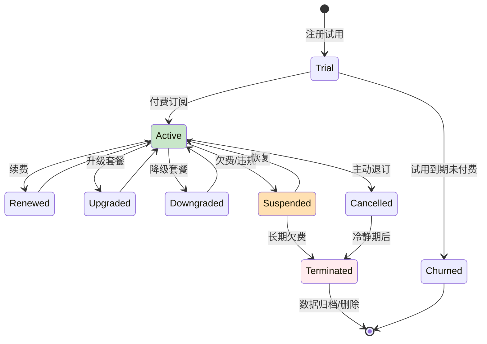

> **生产环境安全提示**
>
> 本文档包含可直接执行的运维命令。执行前请确认：当前目标集群与 Namespace 是否正确；是否具备足够的 RBAC 权限；是否已在非生产环境验证。命令风险等级标注：🔴 高风险（可能造成数据丢失或服务中断）、🟡 中风险（会修改集群状态，但通常可回滚）、🟢 低风险/只读（信息收集，无副作用）。


title: SaaS多租户平台Kubernetes生产架构设计
description: '# SaaS 多租户平台 [[Kubernetes|Kubernetes]] 生产架构设计'
category: application-architecture
tags:
- k8s
- architecture
- industry
- [[Helm|helm]]
- redis
- mysql
- elasticsearch
- [[Ingress|ingress]]
- gateway
- rbac
last_updated: '2026-05-18'
difficulty: expert
reading_level: expert
audience:
- SaaS架构师
- 云平台技术负责人
- 阿里云解决方案架构师
- 数据库开发者
estimated_read_time: 5min
intent_queries:
- SaaS多租户平台架构设计
- ShardingSphere数据库分片
- vCluster虚拟集群隔离
- 租户计费Metering架构
- 多租户数据安全隔离
trigger_keywords:
- SaaS
- 多租户
- vCluster
- ShardingSphere
- 租户隔离
- 计费
- Metering
- RBAC
- 开放平台
- ISV
related_domains:
- domain-01-cluster-fundamentals
- domain-03-networking-traffic
- domain-7-observability
- domain-8-storage
related_topics:
- domain-20-application-patterns/topic-application-architecture/43-enterprise-im
- domain-20-application-patterns/topic-application-architecture/11-smart-retail-architecture
- domain-02-workloads-applications/topic-functions/04-high-concurrency-system
- domain-02-workloads-applications/topic-functions/07-distributed-transaction
authors:
- name: KUDIG Team
  role: contributor
k8s_versions:
- '1.28'
- '1.29'
- '1.30'
- '1.31'
- '1.32'
---

# SaaS 多租户平台 Kubernetes 生产架构设计

> **适用场景**: 企业 SaaS / 行业云 / 低代码平台 / 云原生应用市场 / B2B 服务平台  
> **云厂商**: 阿里云 ACK + 产品体系  
> **适用版本**: Kubernetes v1.29 - v1.33  
> **最后更新**: 2026-04-24  
> **目标读者**: SaaS 架构师、云平台技术负责人、阿里云解决方案架构师

---

<!-- chunk: 📋 目录 -->## 📋 目录

- [一、整体架构全景](#一整体架构全景)
- [二、租户隔离模型对比](#二租户隔离模型对比)
- [三、数据库多租户架构](#三数据库多租户架构)
- [四、租户配置与定制架构](#四租户配置与定制架构)
- [五、计费与用量 metering 架构](#五计费与用量-metering-架构)
- [六、租户生命周期管理架构](#六租户生命周期管理架构)
- [七、开放平台与集成架构](#七开放平台与集成架构)
- [八、ACK 阿里云部署架构](#八ack-阿里云部署架构)

---

<!-- chunk: 一、整体架构全景 -->## 一、整体架构全景

```mermaid
flowchart TB
    subgraph Tenants["租户"]
        T1["租户 A<br/>大型企业"]
        T2["租户 B<br">中型企业"]
        T3["租户 C<br">小微企业"]
        T4["租户 D<br">个人开发者"]
    end

    subgraph Access["接入层"]
        CUSTOM_DOMAIN["自定义域名<br">tenant.example.com"]
        SSO["SSO 登录<br">SAML/OIDC"]
        API_GATE_SAAS["API Gateway<br">限流/路由/鉴权"]
    end

    subgraph Platform["平台层 (ACK)"]
        TENANT_MGMT["租户管理<br">创建/配置/停用"]
        RBAC_SAAS["权限管理<br">角色/资源/数据范围"]
        CONFIG_SAAS["配置中心<br">租户级/用户级"]
        WORKFLOW_SAAS["工作流引擎<br">租户自定义"]
        EXTENSION["扩展中心<br">插件/应用市场"]
    end

    subgraph Shared["共享服务"]
        MSG_SAAS["消息服务<br">通知/站内信"]
        FILE_SAAS["文件服务<br">OSS 隔离"]
        SEARCH_SAAS["搜索服务<br">多租户索引"]
        ANALYTICS_SAAS["数据分析<br">租户级报表"]
    end

    subgraph Infra["基础设施"]
        DB_POOL["数据库池<br">共享/独立"]
        CACHE_POOL["缓存池<br">命名空间隔离"]
        MQ_POOL["消息队列<br">Topic 隔离"]
    end

    Tenants --> Access --> Platform --> Shared --> Infra

    style Platform fill:#e3f2fd
    style Shared fill:#fff8e1
    style Infra fill:#e8f5e9
```

## 阿里云产品映射

| 架构层 | 阿里云方案 | 多租户适配 |
|:---|:---|:---|
| 容器平台 | **ACK Pro** + **vCluster** | 虚拟集群隔离大租户 |
| API 网关 | **MSE 云原生网关** / **API 网关** | 租户级路由/限流 |
| 数据库 | **PolarDB** + **RDS MySQL** | Schema/Row 级隔离 |
| 缓存 | **云数据库 Redis 企业版** (Tair) | Key Prefix / DB 隔离 |
| 搜索 | **OpenSearch** / **Elasticsearch** | Index / Alias 隔离 |
| 对象存储 | **OSS** | Bucket / Prefix 隔离 |
| 消息队列 | **RocketMQ** | Topic / Group 隔离 |
| 监控 | **ARMS** + **SLS** | 租户级日志/指标 |

---

<!-- chunk: 二、租户隔离模型对比 -->## 二、租户隔离模型对比

```mermaid
flowchart TB
    subgraph SharedDB["共享数据库模型"]
        SD_APP["共享应用实例"]
        SD_DB["共享数据库<br">Schema 隔离"]
        SD_ROW["行级隔离<br">tenant_id 字段"]

        SD_APP --> SD_DB --> SD_ROW
    end

    subgraph SchemaDB["Schema 隔离模型"]
        SCH_APP["共享应用实例"]
        SCH_DB["共享数据库<br">多 Schema"]

        SCH_APP --> SCH_DB
    end

    subgraph独立DB["独立数据库模型"]
        IND_APP["共享/独立应用实例"]
        IND_DB["独立数据库<br">每租户一个"]

        IND_APP --> IND_DB
    end

    subgraph独立Cluster["独立集群模型"]
        CL_APP["独立应用集群<br">vCluster"]
        CL_DB["独立数据库集群"]

        CL_APP --> CL_DB
    end

    style SharedDB fill:#c8e6c9
    style SchemaDB fill:#fff8e1
    style 独立DB fill:#ffe0b2
    style 独立Cluster fill:#ffccbc
```

## 隔离模型选型矩阵

| 维度 | 共享数据库 | Schema 隔离 | 独立数据库 | 独立集群 |
|:---|:---|:---|:---|:---|
| **隔离性** | ⭐⭐ | ⭐⭐⭐ | ⭐⭐⭐⭐ | ⭐⭐⭐⭐⭐ |
| **成本** | 低 | 中 | 高 | 极高 |
| **运维复杂度** | 低 | 中 | 高 | 极高 |
| **定制化** | 差 | 中 | 好 | 极好 |
| **适用租户** | SMB | 中型 | 大型 | 超大/政企 |
| **数据量** | < 1TB | < 10TB | > 10TB | 任意 |

---

<!-- chunk: 三、数据库多租户架构 -->## 三、数据库多租户架构

```mermaid
flowchart TB
    subgraph Router["租户路由层"]
        TENANT_CONTEXT["租户上下文<br">ThreadLocal"]
        DS_ROUTER["数据源路由<br">AbstractRoutingDataSource"]
        SHARDING["分片策略<br">ShardingSphere"]
    end

    subgraph Pool["连接池"]
        MASTER["主库连接池"]
        SLAVE["从库连接池"]
    end

    subgraph Storage["存储层"]
        SHARED_TENANT["共享表<br">tenant_id"]
        SCHEMA_TENANT["Schema 隔离<br">tenant_001.*"]
        DB_TENANT["独立库<br">db_tenant_001"]
    end

    Router --> Pool --> Storage

    style Router fill:#e3f2fd
    style Pool fill:#fff8e1
    style Storage fill:#e8f5e9
```

## ShardingSphere 多租户配置

```yaml
# ShardingSphere 多租户数据源配置
apiVersion: v1
kind: ConfigMap
metadata:
  name: sharding-config
  namespace: saas-platform
data:
  server.yaml: |
    mode:
      type: Cluster
      repository:
        type: ZooKeeper
        props:
          namespace: governance_ds
          server-lists: zk-0.zk:2181
          retryIntervalMilliseconds: 500
          timeToLiveSeconds: 60

    authority:
      users:
        - user: root@%
          password: root
      privilege:
        type: ALL_PERMITTED

    transaction:
      defaultType: XA
      providerType: Atomikos

    sqlParser:
      sqlCommentParseEnabled: true
---
# 租户级数据库路由 Deployment
apiVersion: apps/v1
kind: Deployment
metadata:
  name: saas-app-service
  namespace: saas-platform
spec:
  replicas: 10
  selector:
    matchLabels:
      app: saas-app
  template:
    metadata:
      labels:
        app: saas-app
    spec:
      containers:
        - name: app
          image: registry.cn-hangzhou.aliyuncs.com/saas/app-service:v2.0
          ports:
            - containerPort: 8080
          env:
            - name: TENANT_ISOLATION_MODE
              value: "schema"  # row / schema / database / cluster
            - name: SHARDingsphere_CONFIG
              value: "/config/sharding-config.yaml"
            - name: POLARDB_RW_ENDPOINT
              valueFrom:
                secretKeyRef:
                  name: saas-db-secret
                  key: rw-endpoint
            - name: POLARDB_RO_ENDPOINT
              valueFrom:
                secretKeyRef:
                  name: saas-db-secret
                  key: ro-endpoint
          resources:
            requests:
              cpu: "1"
              memory: "2Gi"
            limits:
              cpu: "4"
              memory: "8Gi"
          volumeMounts:
            - name: sharding-config
              mountPath: /config
      volumes:
        - name: sharding-config
          configMap:
            name: sharding-config
```

---

<!-- chunk: 四、租户配置与定制架构 -->## 四、租户配置与定制架构

```mermaid
flowchart TB
    subgraph ConfigLayer["配置分层"]
        PLATFORM_DEFAULT["平台默认<br">全局配置"]
        TENANT_OVERRIDE["租户覆盖<br">自定义"]
        USER_PERSONAL["用户个人<br">偏好"]
    end

    subgraph Customization["定制能力"]
        THEME["主题/皮肤<br">Logo/颜色"]
        FIELD["字段扩展<br">自定义属性"]
        WORKFLOW_CUSTOM["流程定制<br">审批流"]
        REPORT_CUSTOM["报表定制<br">BI 自助"]
    end

    subgraph Extension["扩展机制"]
        PLUGIN["插件系统<br">Hook/Extension Point"]
        SCRIPT["脚本扩展<br">Groovy/JS"]
        API_EXT["API 扩展<br">Webhook"]
    end

    ConfigLayer --> Customization --> Extension

    style ConfigLayer fill:#e3f2fd
    style Customization fill:#fff8e1
    style Extension fill:#e8f5e9
```

---

<!-- chunk: 五、计费与用量 Metering 架构 -->## 五、计费与用量 Metering 架构

```mermaid
flowchart TB
    subgraph UsageData["用量数据采集"]
        API_CALL["API 调用<br">次数/耗时"]
        STORAGE_USED["存储用量<br">容量/流量"]
        COMPUTE_USED["计算用量<br">CPU/内存时长"]
        BANDWIDTH["带宽<br">出网流量"]
        USER_COUNT["用户数<br">MAU/DAU"]
    end

    subgraph Metering["计量引擎"]
        AGGREGATE["聚合计算<br">小时/天/月"]
        PRICING["定价引擎<br">阶梯/包年包月"]
        DISCOUNT["优惠计算<br">折扣/代金券"]
    end

    subgraph Billing["计费出账"]
        BILL["账单生成<br">明细/汇总"]
        INVOICE["发票<br">电子/纸质"]
        PAYMENT_SAAS["收款<br">订阅/按量"]
    end

    UsageData --> Metering --> Billing

    style Metering fill:#e3f2fd
    style Billing fill:#e8f5e9
```

---

<!-- chunk: 六、租户生命周期管理架构 -->## 六、租户生命周期管理架构



---

<!-- chunk: 七、开放平台与集成架构 -->## 七、开放平台与集成架构

```mermaid
flowchart TB
    subgraph ISV["ISV / 开发者"]
        DEV_PORTAL["开发者门户<br">文档/SDK"]
        APP_CREATE["创建应用<br">获取 AppKey"]
        API_TEST["API 测试<br">沙箱环境"]
    end

    subgraph OpenPlatform["开放平台"]
        AUTH_OPEN["OAuth2 授权<br">租户授权"]
        API_OPEN["Open API<br">数据/能力开放"]
        WEBHOOK_OPEN["Webhook<br">事件推送"]
        MARKETPLACE["应用市场<br">上架/审核/分发"]
    end

    subgraph TenantIntegration["租户集成"]
        SSO_INTEGRATION["SSO 集成<br">企业微信/钉钉"]
        DATA_SYNC["数据同步<br">双向同步"]
        BOT["机器人<br">Webhook/消息"]
    end

    ISV --> OpenPlatform --> TenantIntegration

    style OpenPlatform fill:#e3f2fd
    style TenantIntegration fill:#e8f5e9
```

---

<!-- chunk: 八、ACK 阿里云部署架构 -->## 八、ACK 阿里云部署架构

## SaaS 平台 vCluster 隔离架构

```mermaid
flowchart TB
    subgraph HostCluster["ACK 宿主集群"]
        MASTER["托管 Master"]
        SHARED["共享服务<br">监控/日志"]
    end

    subgraph VirtualClusters["虚拟集群 (vCluster)"]
        VC1["vCluster-1<br">租户 A (大客户)"]
        VC2["vCluster-2<br">租户 B (大客户)"]
        VC3["vCluster-3<br">租户 C (大客户)"]
    end

    subgraph SharedNamespace["共享命名空间"]
        SN1["租户 D (SMB)"]
        SN2["租户 E (SMB)"]
        SN3["租户 F (SMB)"]
    end

    HostCluster --> VirtualClusters
    HostCluster --> SharedNamespace

    style HostCluster fill:#e3f2fd
    style VirtualClusters fill:#e8f5e9
    style SharedNamespace fill:#fff8e1
```

## vCluster 大客户隔离配置

```yaml
# 使用 vCluster 为大客户创建独立虚拟集群
apiVersion: v1
kind: Namespace
metadata:
  name: vc-tenant-a
  labels:
    tenant: tenant-a
    plan: enterprise
---
# vCluster Helm 安装 (通过 HelmRelease 或手动)
# helm install tenant-a vcluster --repo https://charts.loft.sh \
#   --namespace vc-tenant-a \
#   --set syncer.resources.requests.cpu=1 \
#   --set syncer.resources.requests.memory=2Gi
---
# 共享命名空间 SMB 租户配置
apiVersion: v1
kind: Namespace
metadata:
  name: tenant-d
  labels:
    tenant: tenant-d
    plan: basic
    pod-security.kubernetes.io/enforce: restricted
---
apiVersion: v1
kind: ResourceQuota
metadata:
  name: tenant-d-quota
  namespace: tenant-d
spec:
  hard:
    requests.cpu: "10"
    requests.memory: 20Gi
    limits.cpu: "20"
    limits.memory: 40Gi
    pods: "50"
    services: "10"
    persistentvolumeclaims: "10"
---
apiVersion: networking.k8s.io/v1
kind: NetworkPolicy
metadata:
  name: tenant-d-isolation
  namespace: tenant-d
spec:
  podSelector: {}
  policyTypes:
    - Ingress
    - Egress
  ingress:
    - from:
        - namespaceSelector:
            matchLabels:
              tenant: tenant-d
  egress:
    - to:
        - namespaceSelector:
            matchLabels:
              tenant: tenant-d
    - to:
        - namespaceSelector:
            matchLabels:
              name: kube-system
```

---

<!-- chunk: 参考链接 -->## 参考链接

- [阿里云 SaaS 上云工具包](https://www.aliyun.com/solution/toolkit/saas)
- [vCluster 文档](https://www.vcluster.com/docs/)
- [ShardingSphere](https://shardingsphere.apache.org/)

---

<!-- chunk: Obsidian 相关文档 -->## Obsidian 相关文档

- topic-application-architecture MOC
- [[domain-20-application-patterns/行业架构/README.md|Topic 应用层架构设计最佳实践]]
- [[domain-20-application-patterns/行业架构/01-ecommerce-architecture.md|电商系统 Kubernetes 生产架构设计]]
- [[domain-20-application-patterns/行业架构/02-mini-program-architecture.md|小程序平台架构设计]]
- [[domain-20-application-patterns/行业架构/03-cms-architecture.md|内容管理系统 CMS 架构设计]]
- [[domain-20-application-patterns/行业架构/04-im-rtc-architecture.md|实时通信 IM/RTC 架构设计]]
- [[domain-20-application-patterns/行业架构/05-online-education-architecture.md|在线教育平台 Kubernetes 生产架构设计]]
- [[domain-20-application-patterns/行业架构/06-fintech-architecture.md|金融科技FinTech Kubernetes生产架构设计]]
- [[domain-20-application-patterns/行业架构/07-iot-platform-architecture.md|物联网 IoT 平台架构设计]]
- [[domain-20-application-patterns/行业架构/08-ai-ml-inference-architecture.md|AI/ML 推理服务 Kubernetes 生产架构设计]]
- [[domain-20-application-patterns/行业架构/09-gaming-backend-architecture.md|游戏后端 Kubernetes 生产架构设计]]
- [[domain-20-application-patterns/行业架构/10-social-media-architecture.md|社交媒体平台Kubernetes生产架构设计]]

## See Also

- 15-energy-power-architecture
- 16-video-shortform-architecture
- 18-data-midplatform-architecture
- 19-cloudnative-devops-architecture


<!-- risk-assessed -->
