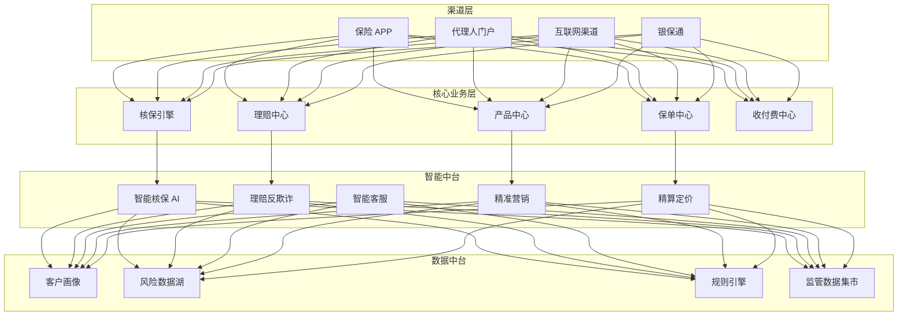
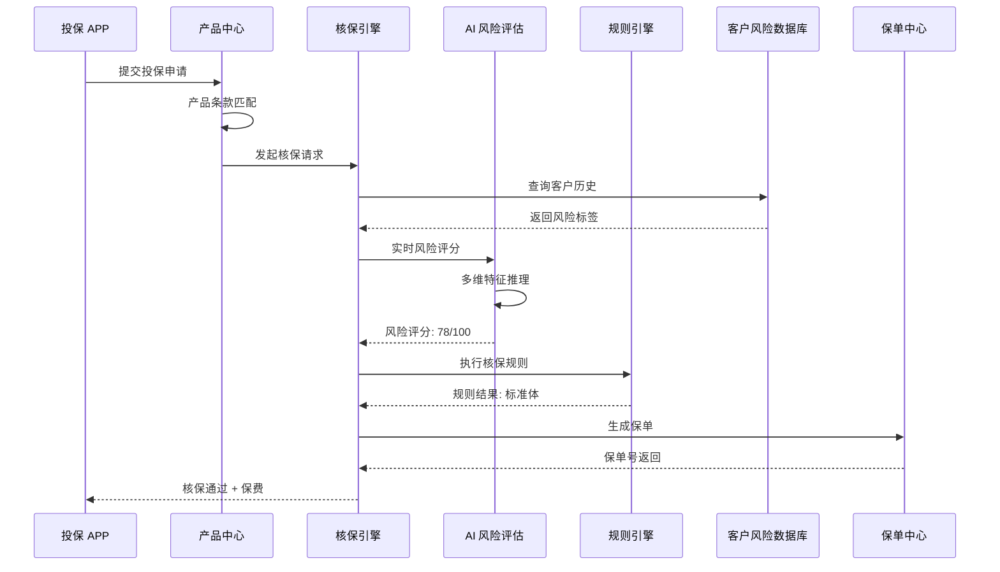
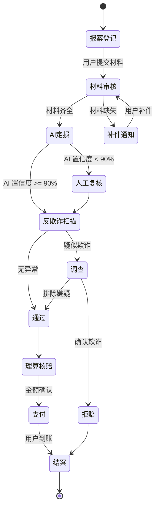
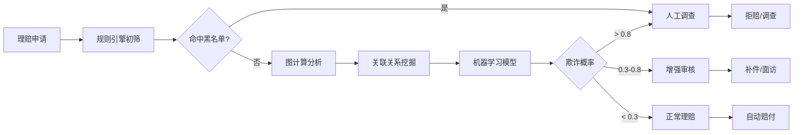

> **生产环境安全提示**
>
> 本文档包含可直接执行的运维命令。执行前请确认：当前目标集群与 Namespace 是否正确；是否具备足够的 RBAC 权限；是否已在非生产环境验证。命令风险等级标注：🔴 高风险（可能造成数据丢失或服务中断）、🟡 中风险（会修改集群状态，但通常可回滚）、🟢 低风险/只读（信息收集，无副作用）。


title: 保险科技架构设计
description: '# 保险科技架构设计 — 阿里云视角'
category: application-architecture
tags:
- k8s
- architecture
- industry
- mysql
- hpa
- operator
- gpu
- nvidia
- rag
last_updated: 2026-05-18
difficulty: advanced
reading_level: advanced
audience:
- 保险科技架构师
- 保险系统开发者
- 阿里云解决方案架构师
- 金融科技工程师
estimated_read_time: 5min
intent_queries:
- 保险科技系统 [[Kubernetes|Kubernetes]] 部署架构
- 智能核保引擎 AI 模型设计
- 保险反欺诈图计算架构
- 理赔自动化 RPA AI 定损
- 偿二代 IFRS17 合规架构
trigger_keywords:
- 保险科技
- 智能核保
- AI理赔
- 反欺诈
- 图计算
- 规则引擎
- 精算定价
- 偿二代
- IFRS17
- 理赔自动化
related_domains:
- domain-03-networking-traffic
- domain-12-observability-comprehensive
- domain-9-security-compliance
- domain-7-ai-ml-platform
related_topics:
- domain-20-application-patterns/topic-application-architecture/06-fintech-architecture
- domain-20-application-patterns/topic-application-architecture/82-legaltech
authors:
- name: KUDIG Team
  role: contributor
k8s_versions:
- '1.28'
- '1.29'
- '1.30'
- '1.31'
- '1.32'
---

# 保险科技架构设计 — 阿里云视角

> **适用版本**: Kubernetes v1.29 - v1.33 | **最后更新**: 2026-05-18
> **作者**: 阿里云解决方案架构师 | **标签**: `#保险科技` `#智能核保` `#理赔` `#精算` `#阿里云`

---

## 目录

1. [行业背景](#1-行业背景)
2. [业务架构](#2-业务架构)
3. [技术架构](#3-技术架构)
4. [核心数据流](#4-核心数据流)
5. [安全与合规](#5-安全与合规)
6. [可观测性](#6-可观测性)
7. [阿里云组件映射](#7-阿里云组件映射)
8. [生产检查清单](#8-生产检查清单)

---

## 1. 行业背景

### 1.1 业务特点

保险科技（InsurTech）正在重塑传统保险价值链：

| 挑战 | 说明 | 架构影响 |
|:---|:---|:---|
| 产品快速迭代 | 场景化保险（退货运费险、航班延误险） | 低代码产品配置 + 规则引擎 |
| 智能核保 | 千人千面的风险评估 | AI 模型实时推理 |
| 反欺诈 | 骗保识别（医疗/车险） | 图计算 + 机器学习 |
| 监管合规 | 偿二代/IFRS17 报送 | 数据血缘 + 审计追踪 |
| 理赔时效 | 用户期望分钟级理赔 | RPA + AI 定损 |

### 1.2 核心场景

- **智能核保**: 基于大数据的实时风险评估
- **AI 理赔**: 图像识别定损、医疗票据 OCR
- **精准营销**: 用户画像驱动的保险产品推荐
- **精算定价**: 大数据驱动的动态保费计算
- **监管报送**: 偿二代/IFRS17 自动化报表

---

## 2. 业务架构

### 2.1 保险科技全景架构



### 2.2 智能核保时序



### 2.3 理赔处理状态机



---

## 3. 技术架构

### 3.1 K8s 部署架构

```yaml
# 核保引擎 Deployment
apiVersion: apps/v1
kind: Deployment
metadata:
  name: underwriting-engine
  namespace: insurtech
spec:
  replicas: 5
  selector:
    matchLabels:
      app: underwriting-engine
  template:
    metadata:
      labels:
        app: underwriting-engine
    spec:
      affinity:
        podAntiAffinity:
          requiredDuringSchedulingIgnoredDuringExecution:
            - labelSelector:
                matchExpressions:
                  - key: app
                    operator: In
                    values: [underwriting-engine]
              topologyKey: topology.kubernetes.io/zone
      containers:
        - name: engine
          image: registry.cn-hangzhou.aliyuncs.com/insurtech/uw-engine:v4.1.0
          ports:
            - containerPort: 8080
          env:
            - name: RULE_ENGINE_URL
              value: "http://rule-engine:8080"
            - name: AI_MODEL_ENDPOINT
              value: "http://ai-risk-service:8501"
            - name: DB_POOL_MAX
              value: "50"
          resources:
            requests:
              memory: "2Gi"
              cpu: "1000m"
            limits:
              memory: "4Gi"
              cpu: "2000m"
          livenessProbe:
            httpGet:
              path: /health
              port: 8080
            initialDelaySeconds: 30
            periodSeconds: 15
```

```yaml
# AI 推理服务 GPU Deployment
apiVersion: apps/v1
kind: Deployment
metadata:
  name: ai-claim-service
  namespace: insurtech
spec:
  replicas: 2
  selector:
    matchLabels:
      app: ai-claim-service
  template:
    metadata:
      labels:
        app: ai-claim-service
    spec:
      nodeSelector:
        accelerator: nvidia-t4
      runtimeClassName: nvidia
      containers:
        - name: tf-serving
          image: registry.cn-hangzhou.aliyuncs.com/insurtech/ai-claim:v2.3.0-gpu
          ports:
            - containerPort: 8501
              name: rest-api
          resources:
            requests:
              nvidia.com/gpu: 1
              memory: "8Gi"
              cpu: "4000m"
            limits:
              nvidia.com/gpu: 1
              memory: "16Gi"
              cpu: "8000m"
          volumeMounts:
            - name: model-volume
              mountPath: /models
      volumes:
        - name: model-volume
          persistentVolumeClaim:
            claimName: ai-model-pvc
```

```yaml
# HPA for 理赔高峰期
apiVersion: autoscaling/v2
kind: HorizontalPodAutoscaler
metadata:
  name: claim-processor-hpa
  namespace: insurtech
spec:
  scaleTargetRef:
    apiVersion: apps/v1
    kind: Deployment
    name: claim-processor
  minReplicas: 5
  maxReplicas: 50
  metrics:
    - type: Pods
      pods:
        metric:
          name: claim_queue_length
        target:
          type: AverageValue
          averageValue: "10"
    - type: Resource
      resource:
        name: cpu
        target:
          type: Utilization
          averageUtilization: 70
```

---

## 4. 核心数据流

### 4.1 反欺诈检测数据流



---

## 5. 安全与合规

- **偿二代合规**: 数据分级、审计日志 10 年保留
- **个人信息保护**: 投保数据加密、最小化采集
- **反洗钱**: 大额交易监控、可疑交易上报

---

## 6. 可观测性

- **核保时效**: P99 < 3s
- **理赔时效**: 简单案件 < 10 分钟
- **反欺诈准确率**: > 95%
- **系统可用性**: 99.99%

---

## 7. 阿里云组件映射

| 功能域 | **阿里云云原生方案** |
|:---|:---|
| 容器平台 | **ACK Pro** |
| 数据库 | **PolarDB MySQL** |
| 大数据 | **MaxCompute + Flink** |
| AI 推理 | **PAI-EAS** |
| 对象存储 | **OSS** |
| 消息队列 | **RocketMQ** |
| 可观测性 | **ARMS + SLS** |
| 安全 | **云盾 + WAF + KMS** |
| OCR | **阿里云视觉智能** |
| 图计算 | **GraphCompute** |

---

## 8. 生产检查清单

- [ ] 核保规则引擎版本一致性
- [ ] AI 模型 A/B 测试验证
- [ ] 反欺诈规则阈值调优
- [ ] 监管报送数据准确性校验
- [ ] 等保三级/偿二代合规审计

---

**维护者**: 阿里云解决方案架构师团队 | **许可证**: MIT

---

## Obsidian 相关文档

- topic-application-architecture KUDIG Database — Global MOC
- [[domain-20-application-patterns/行业架构/README.md|[[Topic 应用层架构设计最佳实践|Topic 应用层架构设计最佳实践]]]]
- [[domain-20-application-patterns/行业架构/01-ecommerce-architecture.md|电商系统 Kubernetes 生产架构设计]]
- [[domain-20-application-patterns/行业架构/02-mini-program-architecture.md|小程序平台架构设计]]
- [[domain-20-application-patterns/行业架构/03-cms-architecture.md|内容管理系统 CMS 架构设计]]
- [[domain-20-application-patterns/行业架构/04-im-rtc-architecture.md|实时通信 IM/RTC 架构设计]]
- [[domain-20-application-patterns/行业架构/05-online-education-architecture.md|在线教育平台 Kubernetes 生产架构设计]]
- [[domain-20-application-patterns/行业架构/06-fintech-architecture.md|金融科技FinTech Kubernetes生产架构设计]]
- [[domain-20-application-patterns/行业架构/07-iot-platform-architecture.md|物联网 IoT 平台架构设计]]
- [[domain-20-application-patterns/行业架构/08-ai-ml-inference-architecture.md|AI/ML 推理服务 Kubernetes 生产架构设计]]
- [[domain-20-application-patterns/行业架构/09-gaming-backend-architecture.md|游戏后端 Kubernetes 生产架构设计]]
- [[domain-20-application-patterns/行业架构/10-social-media-architecture.md|社交媒体平台Kubernetes生产架构设计]]

## See Also

- 22-nev-connected-vehicle
- 23-xinchuang-it-innovation
- 25-quantitative-trading
- 26-aviation-travel


<!-- risk-assessed -->
