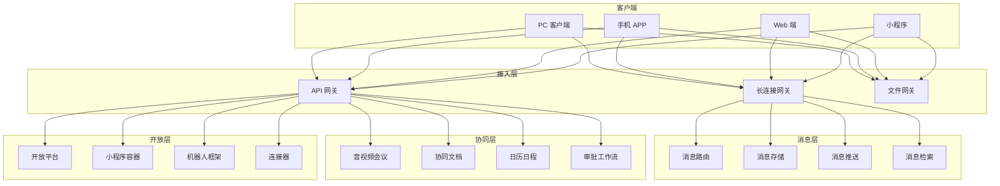
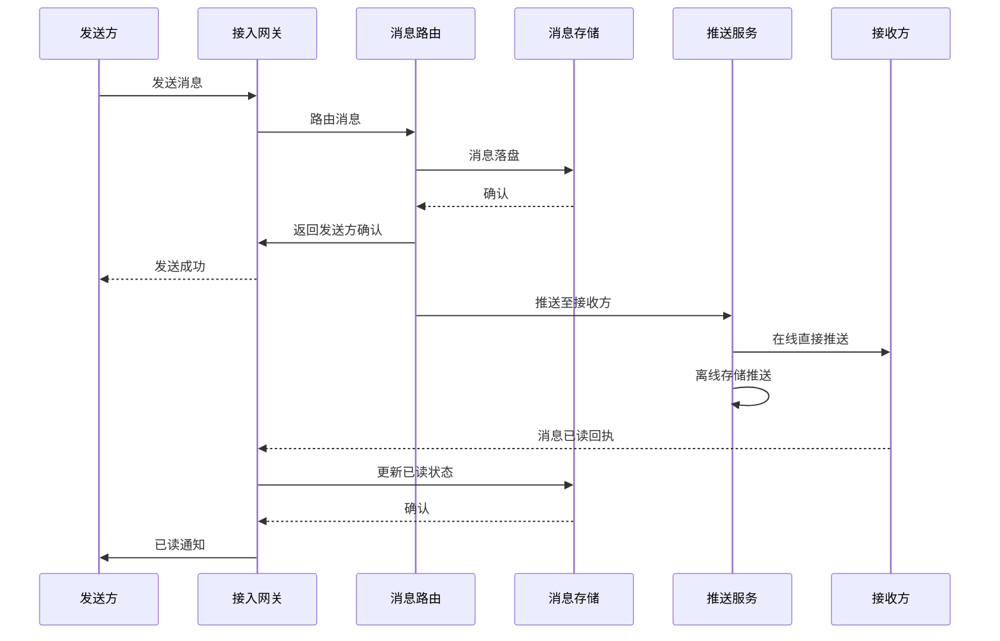
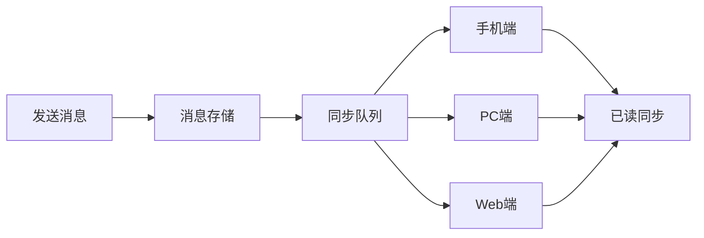

> **生产环境安全提示**
>
> 本文档包含可直接执行的运维命令。执行前请确认：当前目标集群与 Namespace 是否正确；是否具备足够的 RBAC 权限；是否已在非生产环境验证。命令风险等级标注：🔴 高风险（可能造成数据丢失或服务中断）、🟡 中风险（会修改集群状态，但通常可回滚）、🟢 低风险/只读（信息收集，无副作用）。


title: 企业即时通讯架构设计
description: '# 企业即时通讯架构设计 — 阿里云视角'
category: application-architecture
tags:
- k8s
- architecture
- industry
- redis
- [[StatefulSet|statefulset]]
- gateway
- rag
last_updated: '2026-05-18'
difficulty: advanced
reading_level: advanced
audience:
- 协同办公架构师
- 消息系统开发者
- 云原生工程师
- 企业安全工程师
estimated_read_time: 5min
intent_queries:
- 企业IM即时通讯系统架构设计
- 长连接网关Socket集群K8s部署
- 消息可靠传输系统设计
- 企业IM多端消息同步方案
- 企业级IM安全与等保合规
trigger_keywords:
- 企业IM
- 即时通讯
- 长连接网关
- 消息同步
- 协同办公
- 钉钉
- WebSocket
- 消息推送
- 已读未读
- 端到端加密
related_domains:
- domain-01-cluster-fundamentals
- domain-03-networking-traffic
- domain-7-observability
- domain-8-storage
related_topics:
- domain-20-application-patterns/topic-application-architecture/17-saas-multitenant-architecture
- domain-20-application-patterns/topic-application-architecture/11-smart-retail-architecture
- domain-02-workloads-applications/topic-functions/04-high-concurrency-system
- domain-02-workloads-applications/topic-functions/10-message-queue
authors:
- name: KUDIG Team
  role: contributor
k8s_versions:
- '1.28'
- '1.29'
- '1.30'
- '1.31'
- '1.32'
---

# 企业即时通讯架构设计 — 阿里云视角

> **适用版本**: Kubernetes v1.29 - v1.33 | **最后更新**: 2026-04-24
> **作者**: 阿里云解决方案架构师 | **标签**: `#企业IM` `#协同办公` `#钉钉` `#阿里云`

---

## 目录

1. [行业背景](#1-行业背景)
2. [业务架构](#2-业务架构)
3. [技术架构](#3-技术架构)
4. [核心数据流](#4-核心数据流)
5. [安全与合规](#5-安全与合规)
6. [可观测性](#6-可观测性)
7. [阿里云组件映射](#7-阿里云组件映射)
8. [生产检查清单](#8-生产检查清单)

---

## 1. 行业背景

### 1.1 业务特点

企业 IM 是数字化办公核心基础设施，要求高可用、强安全、丰富的集成能力：

| 挑战 | 说明 | 架构影响 |
|:---|:---|:---|
| 海量并发 | 千万级同时在线 | 长连接网关 + 消息队列 |
| 消息可靠 | 消息必达不丢失 | 消息落盘 + 重试机制 |
| 多端同步 | PC/手机/平板消息同步 | 消息同步协议 |
| 数据安全 | 企业敏感信息保护 | 端到端加密 + 审计 |
| 应用集成 | 考勤/审批/日程/文档 | 开放平台 + 小程序 |

### 1.2 核心场景

- **即时消息**: 单聊/群聊/已读未读
- **音视频会议**: 多人会议/屏幕共享/录制
- **协同文档**: 多人实时编辑
- **审批工作流**: 自定义审批流程
- **开放平台**: 第三方应用集成

---

## 2. 业务架构

### 2.1 企业 IM 全景架构



### 2.2 消息收发时序



---

## 3. 技术架构

### 3.1 K8s 部署

```yaml
# 长连接网关 StatefulSet
apiVersion: apps/v1
kind: StatefulSet
metadata:
  name: im-gateway
  namespace: enterprise-im
spec:
  serviceName: im-gateway
  replicas: 10
  selector:
    matchLabels:
      app: im-gateway
  template:
    metadata:
      labels:
        app: im-gateway
    spec:
      hostNetwork: true
      containers:
        - name: gateway
          image: registry.cn-hangzhou.aliyuncs.com/eim/gateway:v5.0.0
          ports:
            - containerPort: 8080
              name: http
            - containerPort: 8883
              name: websocket-tls
          env:
            - name: MAX_CONNECTIONS_PER_POD
              value: "100000"
            - name: HEARTBEAT_INTERVAL_SECONDS
              value: "30"
          resources:
            requests:
              memory: "4Gi"
              cpu: "2000m"
            limits:
              memory: "8Gi"
              cpu: "4000m"
```

```yaml
# 消息存储 StatefulSet
apiVersion: apps/v1
kind: StatefulSet
metadata:
  name: message-store
  namespace: enterprise-im
spec:
  serviceName: message-store
  replicas: 5
  selector:
    matchLabels:
      app: message-store
  template:
    metadata:
      labels:
        app: message-store
    spec:
      containers:
        - name: store
          image: registry.cn-hangzhou.aliyuncs.com/eim/message-store:v4.2.0
          ports:
            - containerPort: 8080
          env:
            - name: STORAGE_BACKEND
              value: "lindorm"
            - name: RETENTION_DAYS
              value: "365"
          resources:
            requests:
              memory: "8Gi"
              cpu: "4000m"
            limits:
              memory: "16Gi"
              cpu: "8000m"
          volumeMounts:
            - name: message-data
              mountPath: /data
  volumeClaimTemplates:
    - metadata:
        name: message-data
      spec:
        accessModes: ["ReadWriteOnce"]
        storageClassName: alicloud-disk-ssd
        resources:
          requests:
            storage: 1Ti
```

---

## 4. 核心数据流

### 4.1 多端消息同步



---

## 5. 安全与合规

- **端到端加密**: 消息内容加密
- **数据主权**: 企业数据本地化存储
- **审计合规**: 消息审计与合规归档
- **等保三级**: 企业通信安全

---

## 6. 可观测性

- **消息到达率**: > 99.99%
- **消息延迟**: P99 < 200ms
- **在线状态**: 实时同步 < 1s

---

## 7. 阿里云组件映射

| 功能域 | **阿里云云原生方案** |
|:---|:---|
| 容器平台 | **ACK Pro** |
| 长连接 | **阿里云 IoT 平台 / 自建网关** |
| 数据库 | **PolarDB + Lindorm** |
| 缓存 | **Redis 企业版** |
| 消息队列 | **RocketMQ** |
| RTC | **阿里云 RTC** |
| 对象存储 | **OSS** |
| 可观测性 | **ARMS + SLS** |

---

## 8. 生产检查清单

- [ ] 长连接网关百万级并发压测
- [ ] 消息不丢失验证
- [ ] 多端消息同步一致性
- [ ] 端到端加密性能测试
- [ ] 等保三级合规审计

---

**维护者**: 阿里云解决方案架构师团队 | **许可证**: MIT

---

## Obsidian 相关文档

- topic-application-architecture MOC
- [[domain-20-application-patterns/行业架构/README.md|Topic 应用层架构设计最佳实践]]
- [[domain-20-application-patterns/行业架构/01-ecommerce-architecture.md|电商系统 Kubernetes 生产架构设计]]
- [[domain-20-application-patterns/行业架构/02-mini-program-architecture.md|小程序平台架构设计]]
- [[domain-20-application-patterns/行业架构/03-cms-architecture.md|内容管理系统 CMS 架构设计]]
- [[domain-20-application-patterns/行业架构/04-im-rtc-architecture.md|实时通信 IM/RTC 架构设计]]
- [[domain-20-application-patterns/行业架构/05-online-education-architecture.md|在线教育平台 Kubernetes 生产架构设计]]
- [[domain-20-application-patterns/行业架构/06-fintech-architecture.md|金融科技FinTech Kubernetes生产架构设计]]
- [[domain-20-application-patterns/行业架构/07-iot-platform-architecture.md|物联网 IoT 平台架构设计]]
- [[domain-20-application-patterns/行业架构/08-ai-ml-inference-architecture.md|AI/ML 推理服务 Kubernetes 生产架构设计]]
- [[domain-20-application-patterns/行业架构/09-gaming-backend-architecture.md|游戏后端 Kubernetes 生产架构设计]]
- [[domain-20-application-patterns/行业架构/10-social-media-architecture.md|社交媒体平台Kubernetes生产架构设计]]

## See Also

- 41-beauty-ecommerce
- 42-secondhand-circular
- 44-martech-adtech
- 45-smart-port-shipping


<!-- risk-assessed -->
