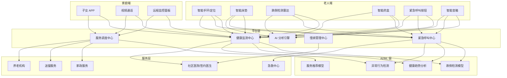
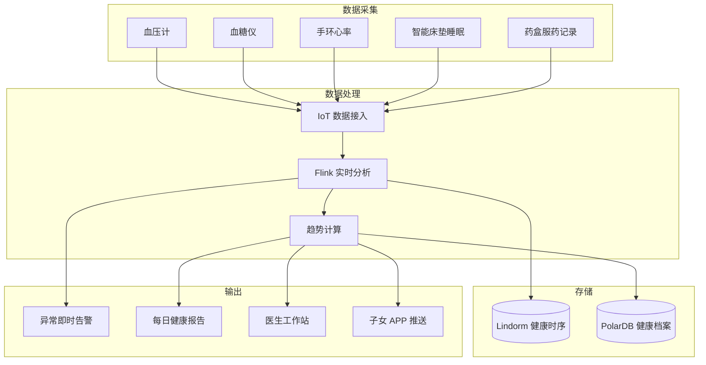

> **生产环境安全提示**
>
> 本文档包含可直接执行的运维命令。执行前请确认：当前目标集群与 Namespace 是否正确；是否具备足够的 RBAC 权限；是否已在非生产环境验证。命令风险等级标注：🔴 高风险（可能造成数据丢失或服务中断）、🟡 中风险（会修改集群状态，但通常可回滚）、🟢 低风险/只读（信息收集，无副作用）。


title: 智慧养老架构设计
description: '# 智慧养老架构设计 — 阿里云视角'
category: application-architecture
tags:
- k8s
- architecture
- industry
- [[Prometheus|prometheus]]
- opa
- redis
- mysql
- operator
- rag
last_updated: 2026-05-18
difficulty: intermediate
reading_level: intermediate
audience:
- 养老科技架构师
- 养老服务平台开发者
- 康养产业IT负责人
- 适老化产品经理
estimated_read_time: 5min
intent_queries:
- smart elderly care [[Kubernetes|kubernetes]] architecture
- 智慧养老K8s部署方案
- 养老平台AI跌倒检测
- 居家养老IoT监测
- 智慧养老服务聚合
trigger_keywords:
- 智慧养老
- 居家养老
- 康养
- 跌倒检测
- 养老平台
- 智能养老
- 智慧养老架构
- 养老IoT
- 适老化
- 健康监测
related_domains:
- domain-01-cluster-fundamentals
- domain-10-troubleshooting-diagnostics
- domain-03-networking-traffic
related_topics:
- brain-computer-interface
- insurtech
- vocational-edtech
authors:
- name: KUDIG Team
  role: contributor
k8s_versions:
- '1.28'
- '1.29'
- '1.30'
- '1.31'
- '1.32'
---

# 智慧养老架构设计 — 阿里云视角

> **适用版本**: Kubernetes v1.29 - v1.33 | **最后更新**: 2026-04-24
> **作者**: 阿里云解决方案架构师 | **标签**: `#智慧养老` `#居家养老` `#康养` `#阿里云`

---

<!-- chunk: 目录 -->## 目录

1. [行业概述](#1-行业概述)
2. [业务场景](#2-业务场景)
3. [架构设计](#3-架构设计)
4. [核心技术栈](#4-核心技术栈)
5. [Kubernetes 部署方案](#5-kubernetes-部署方案)
6. [数据架构](#6-数据架构)
7. [AI/ML 组件](#7-aiml-组件)
8. [安全与合规](#8-安全与合规)
9. [最佳实践](#9-最佳实践)
10. [反模式](#10-反模式)
11. [参考资源](#11-参考资源)

---

<!-- chunk: 1. 行业概述 -->## 1. 行业概述

## 1.1 市场规模与趋势

智慧养老通过科技手段提升老年人生活质量和安全保障，应对人口老龄化挑战。中国 60 岁以上老年人口已达 3 亿，预计 2035 年超过 4 亿。智慧养老市场规模预计从 2024 年的 6000 亿元增长到 2030 年的 2 万亿元。核心技术包括 IoT 可穿戴、AI 跌倒检测、远程医疗、智能家居和社区服务聚合平台。

| 指标 | 2024 年 | 2026 年（预测） | 2030 年（预测） |
|:---|:---|:---|:---|
| 中国老年人口 | 3.0 亿 | 3.3 亿 | 4.0 亿 |
| 智慧养老市场规模 | ¥600B | ¥1000B | ¥2000B |
| 居家养老占比 | 90% | 90% | 90% |
| 跌倒检测准确率 | 90% | 95% | 98% |
| 可穿戴设备渗透率 | 5% | 15% | 40% |

## 1.2 行业痛点

| 痛点 | 说明 | 数字化转型驱动 |
|:---|:---|:---|
| 适老化设计 | 老年人操作习惯特殊 | 大字体/语音交互/简化流程 |
| 紧急救助 | 跌倒/突发疾病响应慢 | 实时监测 + 自动告警 |
| 健康管理 | 慢病管理/用药提醒 | IoT 可穿戴 + AI 分析 |
| 社交孤独 | 独居老人精神关怀 | 视频通话/社区活动/数字人陪伴 |
| 服务整合 | 医疗/家政/送餐分散 | 服务平台聚合 |
| 隐私担忧 | 监控设备侵犯隐私 | 边缘计算 + 数据脱敏 |

## 1.3 数字化转型架构影响

智慧养老架构需要覆盖老人端（可穿戴/智能床垫/跌倒雷达/药盒/呼叫按钮）、家庭端（子女APP/视频通话）、平台层（健康监测/紧急呼叫/服务调度/慢病管理）和服务层（社区医院/家政/送餐/养老机构）。核心挑战是适老化交互和误报率控制。

---

<!-- chunk: 2. 业务场景 -->## 2. 业务场景

## 2.1 居家安全监测

通过毫米波雷达（跌倒检测）、燃气报警器、门窗传感器、水浸传感器等设备，24 小时监测独居老人居家安全。跌倒检测无需摄像头，保护隐私。跌倒发生时 30 秒内自动告警至子女和呼叫中心。

## 2.2 慢性病健康管理

通过智能手环/血压计/血糖仪持续监测老人健康数据，AI 分析趋势并在异常时通知签约医生和家属。支持用药提醒（智能药盒）、复诊提醒和健康报告生成。

## 2.3 紧急呼叫与救援

老人通过一键呼叫按钮或语音呼救触发紧急救援。系统自动定位老人位置，通知子女、社区服务站和急救中心。支持跌倒自动检测触发（无需手动操作）。

## 2.4 智能照护设备

智能床垫监测睡眠质量、呼吸和心率；智能药盒按剂量按时提醒服药；定位手环防止走失（电子围栏）；智能音箱提供语音交互和陪伴。

## 2.5 养老服务聚合平台

整合社区周边的助餐、助洁、助医、助行、助浴等服务资源，老人或子女通过 APP 一键预约。平台统一管理服务质量和费用结算。

---

<!-- chunk: 3. 架构设计 -->## 3. 架构设计

## 3.1 智慧养老全景架构



---

<!-- chunk: 4. 核心技术栈 -->## 4. 核心技术栈

| Component | Purpose | Technology | License |
|:---|:---|:---|:---|
| Container Orchestration | Platform management | ACK Pro | Proprietary |
| IoT Platform | Device management | 阿里云 IoT 平台 | Proprietary |
| AI Vision | Fall detection (camera-based) | PAI + 视觉智能 | Proprietary |
| Radar Processing | mmWave radar fall detection | 专用雷达算法 | Proprietary |
| Time-Series DB | Health data storage | Lindorm TSDB | Proprietary |
| Relational DB | Business data | PolarDB MySQL | Proprietary |
| Message Queue | Alert delivery | RocketMQ 5.x | Apache 2.0 |
| RTC | Video call | 阿里云 RTC | Proprietary |
| Voice | Voice interaction | 阿里云语音服务 | Proprietary |
| Object Storage | Health reports | OSS | Proprietary |
| Cache | Real-time state | Redis Enterprise | Proprietary |
| Monitoring | Observability | ARMS + SLS | Proprietary |

---

<!-- chunk: 5. Kubernetes 部署方案 -->## 5. Kubernetes 部署方案

## 5.1 健康监测服务 Deployment

```yaml
apiVersion: apps/v1
kind: Deployment
metadata:
  name: health-monitor
  namespace: smart-elderly
  labels:
    app: health-monitor
    tier: core-service
spec:
  replicas: 4
  selector:
    matchLabels:
      app: health-monitor
  strategy:
    rollingUpdate:
      maxSurge: 1
      maxUnavailable: 0
  template:
    metadata:
      labels:
        app: health-monitor
      annotations:
        prometheus.io/scrape: "true"
        prometheus.io/port: "9090"
    spec:
      affinity:
        podAntiAffinity:
          preferredDuringSchedulingIgnoredDuringExecution:
            - weight: 100
              podAffinityTerm:
                labelSelector:
                  matchLabels:
                    app: health-monitor
                topologyKey: topology.kubernetes.io/zone
      containers:
        - name: monitor
          image: registry.cn-hangzhou.aliyuncs.com/elderly/health-monitor:v2.0.0
          ports:
            - containerPort: 8080
              name: http
            - containerPort: 9090
              name: metrics
          env:
            - name: ALERT_THRESHOLD_HEART_RATE
              value: "120"
            - name: FALL_DETECTION_ENABLED
              value: "true"
            - name: BLOOD_PRESSURE_ALERT
              value: "160/100"
            - name: BLOOD_SUGAR_ALERT_HIGH
              value: "11.1"
            - name: DB_CONNECTION
              valueFrom:
                secretKeyRef:
                  name: elderly-secrets
                  key: db-connection
            - name: REDIS_URL
              valueFrom:
                secretKeyRef:
                  name: elderly-secrets
                  key: redis-url
          resources:
            requests:
              memory: "2Gi"
              cpu: "1000m"
            limits:
              memory: "4Gi"
              cpu: "2000m"
          readinessProbe:
            httpGet:
              path: /health/ready
              port: 8080
            initialDelaySeconds: 10
            periodSeconds: 5
          livenessProbe:
            httpGet:
              path: /health/live
              port: 8080
            initialDelaySeconds: 20
            periodSeconds: 10
```

## 5.2 紧急呼叫中心 Deployment

```yaml
apiVersion: apps/v1
kind: Deployment
metadata:
  name: emergency-call-center
  namespace: smart-elderly
spec:
  replicas: 3
  selector:
    matchLabels:
      app: emergency-call-center
  template:
    metadata:
      labels:
        app: emergency-call-center
    spec:
      containers:
        - name: call-center
          image: registry.cn-hangzhou.aliyuncs.com/elderly/call-center:v2.0.0
          ports:
            - containerPort: 8080
          env:
            - name: OPERATORS_ONLINE
              value: "10"
            - name: AUTO_ESCALATE_SECONDS
              value: "30"
            - name: AMBULANCE_API_URL
              value: "http://ambulance-service:8080"
          resources:
            requests:
              memory: "2Gi"
              cpu: "1000m"
            limits:
              memory: "4Gi"
              cpu: "2000m"
```

## 5.3 ConfigMap, Service 与 Secret

```yaml
apiVersion: v1
kind: ConfigMap
metadata:
  name: elderly-config
  namespace: smart-elderly
data:
  health-thresholds: |
    {
      "heart_rate": {"low": 50, "high": 120, "critical": 150},
      "blood_pressure": {"systolic_high": 160, "diastolic_high": 100},
      "blood_sugar": {"low": 3.9, "high": 11.1},
      "spo2_low": 90,
      "temperature_high": 38.0
    }
  fall-detection: |
    {
      "radar_enabled": true,
      "camera_enabled": false,
      "confidence_threshold": 0.9,
      "auto_alert_seconds": 30,
      "false_positive_filter": true
    }
  service-types: |
    [
      {"id": "meal", "name": "助餐", "providers": 50},
      {"id": "clean", "name": "助洁", "providers": 30},
      {"id": "medical", "name": "助医", "providers": 20},
      {"id": "transport", "name": "助行", "providers": 15},
      {"id": "bath", "name": "助浴", "providers": 10}
    ]
---
apiVersion: v1
kind: Service
metadata:
  name: health-monitor
  namespace: smart-elderly
spec:
  selector:
    app: health-monitor
  ports:
    - name: http
      port: 8080
      targetPort: 8080
    - name: metrics
      port: 9090
      targetPort: 9090
  type: ClusterIP
---
apiVersion: v1
kind: Secret
metadata:
  name: elderly-secrets
  namespace: smart-elderly
type: Opaque
stringData:
  db-connection: "mysql://elderly@polardb.elderly.rds.aliyuncs.com:3306/elderly_db"
  redis-url: "redis://:password@redis-elderly.rds.aliyuncs.com:6379/0"
  encryption-key: "aes-256-gcm-key-placeholder"
  sms-api-key: "sms-service-key-placeholder"
```

---

<!-- chunk: 6. 数据架构 -->## 6. 数据架构

## 6.1 慢病管理数据流



## 6.2 数据流说明

- **健康数据流**: 可穿戴/家用医疗设备数据通过蓝牙/WiFi 上传，经 IoT 平台接入后写入 Lindorm
- **告警数据流**: 异常数据实时触发分级告警（轻度→家属通知，重度→急救中心）
- **服务数据流**: 服务预约/调度/完成状态实时更新，支持服务质量评价
- **跌倒数据流**: 雷达数据在边缘端预处理，疑似跌倒时上传云端 AI 二次确认

---

<!-- chunk: 7. AI/ML 组件 -->## 7. AI/ML 组件

## 7.1 核心模型

| 模型 | 用途 | 输入 | 输出 | 框架 |
|:---|:---|:---|:---|:---|
| 跌倒检测 | 毫米波雷达跌倒识别 | 雷达信号 | 跌倒概率 + 姿态 | 1D-CNN |
| 健康趋势 | 慢病指标趋势预测 | 历史健康数据 | 异常趋势预警 | LSTM |
| 异常行为 | 日常行为异常检测 | 传感器模式 | 异常标记 | AutoEncoder |
| 用药依从性 | 漏服/错服检测 | 药盒记录/处方 | 依从性评分 | 规则引擎 |
| 走失风险 | 认知障碍走失预测 | 定位/行为模式 | 走失风险等级 | GNN |
| 服务推荐 | 养老服务智能推荐 | 需求评估/历史 | 推荐服务列表 | Collaborative Filtering |

---

<!-- chunk: 8. 安全与合规 -->## 8. 安全与合规

## 8.1 行业法规与标准

| 法规/标准 | 适用范围 | 架构要求 |
|:---|:---|:---|
| 老年人权益保障法 | 老年人权益保护 | 服务质量保障 |
| 个人信息保护法 | 健康数据保护 | 数据加密 + 最小化 |
| 等保三级 | 养老平台安全 | 网络安全 + 审计 |
| 医疗数据管理办法 | 健康数据管理 | 数据分级管理 |
| 智慧健康养老标准 | 行业技术标准 | 设备互联互通 |
| 互联网诊疗管理办法 | 远程医疗合规 | 医疗资质 + 数据安全 |

## 8.2 安全架构要点

- **隐私优先**: 跌倒检测使用毫米波雷达（非摄像头），保护居家隐私
- **数据脱敏**: 健康数据脱敏后存储，原始数据加密
- **多因素认证**: 子女 APP 远程查看需双重认证
- **7×24 呼叫中心**: 紧急呼叫中心全年无休，人工兜底

---

<!-- chunk: 9. 最佳实践 -->## 9. 最佳实践

1. **雷达替代摄像头**: 使用毫米波雷达进行跌倒检测，保护老人居家隐私
2. **边缘预处理**: 雷达/传感器数据在家庭网关预处理，减少云端负载和延迟
3. **误报控制**: 跌倒检测采用多传感器融合（雷达+手环+床垫），将误报率降至 < 5%
4. **分级告警**: 轻度异常推送子女，中度异常通知社区医生，重度异常直拨急救
5. **适老化 UI**: 大字体、高对比度、语音交互、一键操作
6. **设备长续航**: 可穿戴设备续航 > 7 天，减少充电负担
7. **电子围栏**: 认知障碍老人设置地理围栏，越界自动通知
8. **服务质量评价**: 每次服务后子女可评价，建立服务质量闭环
9. **健康档案连续性**: 老人健康档案跨机构共享，避免重复检查
10. **游戏化激励**: 通过积分/勋章激励老人坚持健康管理和康复训练

---

<!-- chunk: 10. 反模式 -->## 10. 反模式

1. **过度依赖摄像头**: 全屋安装摄像头监控老人，严重侵犯隐私。应使用雷达等非视觉传感器
2. **忽视误报率**: 跌倒检测误报率高，狼来了效应导致真实告警被忽视。应多传感器融合降低误报
3. **忽视适老化**: APP 界面复杂字体小，老人无法使用。应大字体+语音+简化流程
4. **缺乏人工兜底**: 紧急情况完全依赖 AI 判断，无人工介入。应 AI + 人工 7×24 呼叫中心
5. **设备续航不足**: 可穿戴设备需每天充电，老人经常忘记。应追求 > 7 天续航

---

<!-- chunk: 11. 参考资源 -->## 11. 参考资源

- [智慧健康养老产业发展行动计划](https://www.miit.gov.cn/)
- [毫米波雷达跌倒检测论文](https://ieeexplore.ieee.org/)
- [阿里云 IoT 平台文档](https://help.aliyun.com/product/30520.html)
- [阿里云 RTC 文档](https://help.aliyun.com/product/61339.html)
- [HDC 华为智慧养老方案](https://developer.huawei.com/)

---

**维护者**: 阿里云解决方案架构师团队 | **许可证**: MIT

---

<!-- chunk: Obsidian 相关文档 -->## Obsidian 相关文档

- topic-application-architecture MOC
- [[domain-20-application-patterns/行业架构/README.md|Topic 应用层架构设计最佳实践]]
- [[domain-20-application-patterns/行业架构/01-ecommerce-architecture.md|电商系统 Kubernetes 生产架构设计]]
- [[domain-20-application-patterns/行业架构/02-mini-program-architecture.md|小程序平台架构设计]]
- [[domain-20-application-patterns/行业架构/03-cms-architecture.md|内容管理系统 CMS 架构设计]]
- [[domain-20-application-patterns/行业架构/04-im-rtc-architecture.md|实时通信 IM/RTC 架构设计]]
- [[domain-20-application-patterns/行业架构/05-online-education-architecture.md|在线教育平台 Kubernetes 生产架构设计]]
- [[domain-20-application-patterns/行业架构/06-fintech-architecture.md|金融科技FinTech Kubernetes生产架构设计]]
- [[domain-20-application-patterns/行业架构/07-iot-platform-architecture.md|物联网 IoT 平台架构设计]]
- [[domain-20-application-patterns/行业架构/08-ai-ml-inference-architecture.md|AI/ML 推理服务 Kubernetes 生产架构设计]]
- [[domain-20-application-patterns/行业架构/09-gaming-backend-architecture.md|游戏后端 Kubernetes 生产架构设计]]
- [[domain-20-application-patterns/行业架构/10-social-media-architecture.md|社交媒体平台Kubernetes生产架构设计]]

## See Also

- 54-social-gaming-metaverse
- 55-crossborder-dtc
- 57-digital-therapeutics
- 58-web3-gamefi

## Related

- topic-application-architecture MOC — Cross-reference


<!-- risk-assessed -->
