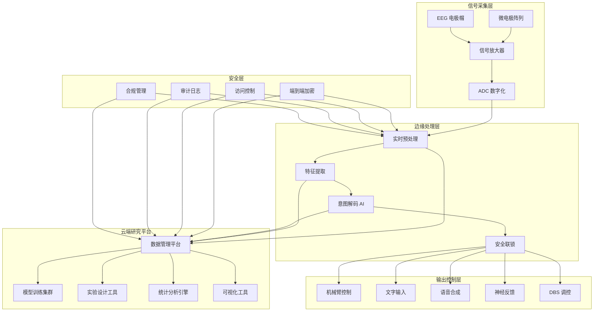
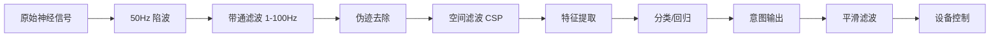
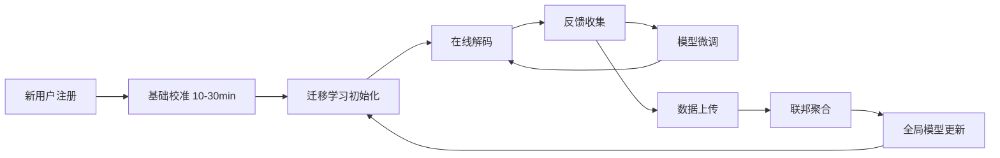

> **生产环境安全提示**
>
> 本文档包含可直接执行的运维命令。执行前请确认：当前目标集群与 Namespace 是否正确；是否具备足够的 RBAC 权限；是否已在非生产环境验证。命令风险等级标注：🔴 高风险（可能造成数据丢失或服务中断）、🟡 中风险（会修改集群状态，但通常可回滚）、🟢 低风险/只读（信息收集，无副作用）。


title: 脑机接口架构设计
description: '# 脑机接口架构设计 — 阿里云视角'
category: application-architecture
tags:
- k8s
- architecture
- industry
- opa
- job
- [[Ingress|ingress]]
- rbac
- [[NetworkPolicy|networkpolicy]]
- gpu
- nvidia
last_updated: 2026-05-18
difficulty: expert
reading_level: expert
audience:
- BCI 系统架构师
- 神经科学计算研究员
- 医疗 AI 开发者
- 阿里云 AI 解决方案架构师
estimated_read_time: 5min
intent_queries:
- 脑机接口 BCI 神经信号处理架构
- 运动想象解码 AI 模型部署
- 神经信号实时处理边缘计算
- BCI 数据加密隐私计算
- 脑机接口医疗康复系统
trigger_keywords:
- 脑机接口
- BCI
- 神经信号
- EEG
- 运动想象
- 神经调控
- 脑电信号
- 意图解码
- 医疗康复
- 认知增强
related_domains:
- domain-7-ai-ml-platform
- domain-9-security-compliance
- domain-03-networking-traffic
related_topics:
- domain-20-application-patterns/topic-application-architecture/90-neuromorphic-computing
- domain-20-application-patterns/topic-application-architecture/56-smart-elderly-care
authors:
- name: KUDIG Team
  role: contributor
k8s_versions:
- '1.28'
- '1.29'
- '1.30'
- '1.31'
- '1.32'
---

# 脑机接口架构设计 — 阿里云视角

> **适用版本**: Kubernetes v1.29 - v1.33 | **最后更新**: 2026-05-18
> **作者**: 阿里云解决方案架构师 | **标签**: `#脑机接口` `#BCI` `#神经信号` `#阿里云`

---

<!-- chunk: 目录 -->## 目录

1. [概述](#1-概述)
2. [设计原则](#2-设计原则)
3. [架构模式](#3-架构模式)
4. [实现示例](#4-实现示例)
5. [在 Kubernetes 上的部署](#5-在-kubernetes-上的部署)
6. [最佳实践](#6-最佳实践)
7. [反模式](#7-反模式)
8. [参考资源](#8-参考资源)

---

<!-- chunk: 1. 概述 -->## 1. 概述

脑机接口（Brain-Computer Interface，BCI）是在大脑与外部设备之间建立直接通信通道的技术。BCI 不依赖外周神经和肌肉系统，直接通过读取大脑神经信号来解读用户意图，或将外部信息直接传递到大脑。BCI 技术在医疗康复、辅助沟通、神经调控、认知增强等领域具有革命性应用前景。

BCI 系统按信号采集方式分为三大类：非侵入式（EEG 脑电图，信号从头皮采集）、半侵入式（ECoG 皮层脑电图，电极放置在硬膜外或硬膜下）、侵入式（微电极阵列植入大脑皮层，如 Neuralink 的 N1 芯片）。信号质量与侵入程度正相关：非侵入式信噪比低但安全，侵入式信号质量高但需手术植入。

BCI 系统的信息处理链路包括：信号采集（微伏级神经信号）、信号放大与数字化（24-bit ADC、20kHz 采样率）、预处理降噪（工频干扰、肌电伪迹去除）、特征提取（频带功率、时域特征、空间滤波）、意图解码（分类/回归模型）、输出控制（机械臂、文字输入、语音合成）。整条链路需要在毫秒级完成，这对系统的实时性和可靠性提出了极高要求。

云原生架构在 BCI 中的应用主要体现在：研究平台（数据管理、模型训练、实验设计）和云端分析（大规模神经数据分析、AI 模型训练）。实时解码部分需要在边缘设备上完成（延迟要求 < 50ms），云端负责离线分析和模型优化。

## 1.1 行业背景

| 挑战 | 说明 | 架构影响 |
|:---|:---|:---|
| 信号采集 | 微伏级神经信号（5-500μV） | 高精度 ADC + 降噪 |
| 实时解码 | 毫秒级意图解码（< 50ms） | 边缘 AI + 专用硬件 |
| 个体差异 | 不同用户信号差异大 | 个性化模型 + 迁移学习 |
| 数据隐私 | 神经数据极度敏感 | 端到端加密 + 联邦学习 |
| 医疗合规 | 植入式器械 III 类 | 临床试验 + 监管审批 |

## 1.2 核心场景

- **医疗康复**: 瘫痪患者通过 BCI 控制机械臂、轮椅、电脑光标
- **辅助沟通**: 渐冻症（ALS）患者通过 BCI 进行文字输入和语音合成
- **神经调控**: 帕金森病深部脑刺激（DBS）、癫痫预测与干预
- **认知增强**: 注意力监测、记忆辅助、情绪调节
- **人机交互**: 意念控制设备、沉浸式 VR/AR 交互

---

<!-- chunk: 2. 设计原则 -->## 2. 设计原则

## 2.1 实时优先原则

BCI 系统的实时性直接关系到用户体验和安全性。运动想象解码延迟必须 < 100ms，否则用户感受到明显的控制延迟。神经调控（如癫痫检测与刺激）延迟要求更低（< 10ms）。系统设计需要将实时解码放在边缘设备上，采用专用硬件（DSP/FPGA/GPU）加速推理。

## 2.2 隐私保护原则

神经信号是人类最私密的数据之一，包含思维活动、情绪状态、潜意识信息等。BCI 系统必须建立严格的隐私保护机制：数据端到端加密传输、本地处理优先、最小化数据上传、用户完全知情同意。采用联邦学习技术，在不共享原始数据的前提下实现跨用户模型优化。

## 2.3 个性化适配原则

每个人的大脑信号模式都是独特的，不存在通用的 BI 解码模型。系统设计需要支持快速的个性化校准：新用户使用 10-30 分钟校准数据即可获得可用的解码模型；使用过程中模型持续学习和适应用户的信号变化；迁移学习技术利用已有用户数据加速新用户校准。

## 2.4 安全可靠原则

侵入式 BCI 植入人体，安全性是生命线。系统设计需要：硬件通过生物相容性认证；植入设备具备无线充电和数据传输能力；设备具备问题安全模式（fail-safe）；软件通过医疗器械软件（SaMD）质量标准。

---

<!-- chunk: 3. 架构模式 -->## 3. 架构模式

## 3.1 BCI 系统全景架构



## 3.2 实时信号处理流水线



## 3.3 个性化模型适配流程



---

<!-- chunk: 4. 实现示例 -->## 4. 实现示例

## 4.1 神经信号预处理与特征提取

```python
import numpy as np
from scipy import signal as sp_signal
from scipy.signal import butter, filtfilt, iirnotch

class NeuralSignalProcessor:
    def __init__(self, sampling_rate: int = 2048,
                 n_channels: int = 256):
        self.fs = sampling_rate
        self.n_channels = n_channels

    def preprocess(self, raw_signal: np.ndarray) -> np.ndarray:
        processed = self._notch_filter(raw_signal, freq=50)
        processed = self._bandpass_filter(processed, low=1.0, high=100.0)
        processed = self._remove_artifacts(processed)
        return processed

    def _notch_filter(self, data: np.ndarray,
                       freq: float = 50.0) -> np.ndarray:
        quality_factor = 30.0
        b, a = iirnotch(freq, quality_factor, self.fs)
        return filtfilt(b, a, data, axis=0)

    def _bandpass_filter(self, data: np.ndarray,
                          low: float, high: float) -> np.ndarray:
        nyq = self.fs / 2.0
        b, a = butter(4, [low / nyq, high / nyq], btype='band')
        return filtfilt(b, a, data, axis=0)

    def _remove_artifacts(self, data: np.ndarray) -> np.ndarray:
        threshold = np.mean(np.abs(data)) + 5 * np.std(data)
        mask = np.abs(data) > threshold
        data[mask] = np.sign(data[mask]) * threshold
        return data

    def extract_features(self, preprocessed: np.ndarray) -> dict:
        bands = {
            'delta': (1, 4),
            'theta': (4, 8),
            'alpha': (8, 13),
            'beta': (13, 30),
            'gamma': (30, 100),
        }

        features = {}
        for band_name, (low, high) in bands.items():
            b, a = butter(4, [low / (self.fs/2), high / (self.fs/2)],
                          btype='band')
            filtered = filtfilt(b, a, preprocessed, axis=0)
            power = np.mean(filtered ** 2, axis=0)
            features[f'{band_name}_power'] = power
            features[f'{band_name}_relative'] = power / (np.sum(
                [np.mean(filtfilt(butter(4, [l/(self.fs/2), h/(self.fs/2)],
                    btype='band'), preprocessed, axis=0)**2, axis=0)
                 for l, h in bands.values()], axis=0) + 1e-10)

        return features

    def compute_csp(self, data_class1: np.ndarray,
                     data_class2: np.ndarray,
                     n_components: int = 6) -> np.ndarray:
        cov1 = self._compute_covariance(data_class1)
        cov2 = self._compute_covariance(data_class2)

        eigenvalues, eigenvectors = np.linalg.eigh(cov1, cov1 + cov2)
        idx = np.argsort(eigenvalues)[::-1]
        eigenvectors = eigenvectors[:, idx]

        selected = np.concatenate([
            eigenvectors[:, :n_components//2],
            eigenvectors[:, -n_components//2:]
        ], axis=1)

        return selected

    def _compute_covariance(self, data: np.ndarray) -> np.ndarray:
        n_trials = data.shape[0]
        cov = np.zeros((self.n_channels, self.n_channels))
        for trial in data:
            cov += np.cov(trial.T)
        return cov / n_trials
```

## 4.2 运动想象解码器

```python
import numpy as np
from sklearn.discriminant_analysis import LinearDiscriminantAnalysis
from sklearn.ensemble import RandomForestClassifier
from typing import Tuple

class MotorImageryDecoder:
    def __init__(self, n_classes: int = 4,
                 sampling_rate: int = 2048):
        self.n_classes = n_classes
        self.fs = sampling_rate
        self.processor = NeuralSignalProcessor(sampling_rate)
        self.classifier = LinearDiscriminantAnalysis()
        self.csp_matrix = None
        self.trained = False

    def calibrate(self, calibration_data: np.ndarray,
                   labels: np.ndarray) -> dict:
        n_trials = calibration_data.shape[0]
        all_features = []

        class_data = {}
        for label in np.unique(labels):
            class_data[label] = calibration_data[labels == label]

        classes = list(class_data.keys())
        if len(classes) >= 2:
            self.csp_matrix = self.processor.compute_csp(
                class_data[classes[0]],
                class_data[classes[1]]
            )

        for i in range(n_trials):
            trial = calibration_data[i]
            features = self._extract_trial_features(trial)
            all_features.append(features)

        X = np.array(all_features)
        self.classifier.fit(X, labels)
        self.trained = True

        train_acc = self.classifier.score(X, labels)
        return {
            'training_accuracy': train_acc,
            'n_trials': n_trials,
            'n_classes': len(np.unique(labels)),
        }

    def decode(self, neural_signal: np.ndarray) -> Tuple[int, float]:
        if not self.trained:
            raise RuntimeError("Decoder not calibrated")

        features = self._extract_trial_features(neural_signal)
        X = features.reshape(1, -1)
        prediction = self.classifier.predict(X)[0]
        probabilities = self.classifier.predict_proba(X)[0]
        confidence = float(np.max(probabilities))

        return int(prediction), confidence

    def _extract_trial_features(self, trial: np.ndarray) -> np.ndarray:
        preprocessed = self.processor.preprocess(trial)
        features = self.processor.extract_features(preprocessed)

        if self.csp_matrix is not None:
            csp_projected = np.dot(preprocessed, self.csp_matrix)
            csp_features = np.log(np.var(csp_projected, axis=0))
        else:
            csp_features = np.array([])

        band_features = np.concatenate([
            features['delta_power'],
            features['theta_power'],
            features['alpha_power'],
            features['beta_power'],
            features['gamma_power'],
        ])

        return np.concatenate([band_features, csp_features])
```

## 4.3 BCI 实验数据管理

```go
package bci

import (
    "crypto/aes"
    "crypto/cipher"
    "crypto/rand"
    "fmt"
    "io"
    "time"
)

type BCIExperiment struct {
    ID           string
    UserID       string
    Paradigm     string
    StartTime    time.Time
    EndTime      time.Time
    N Trials     int
    Channels     int
    SamplingRate int
    EncryptedKey []byte
}

type DataStore struct {
    experiments map[string]*BCIExperiment
    encryptKey  []byte
}

func NewDataStore(key []byte) *DataStore {
    return &DataStore{
        experiments: make(map[string]*BCIExperiment),
        encryptKey:  key,
    }
}

func (ds *DataStore) StoreExperiment(exp *BCIExperiment) error {
    exp.ID = fmt.Sprintf("exp-%s-%d", exp.UserID, time.Now().UnixNano())
    ds.experiments[exp.ID] = exp
    return nil
}

func (ds *DataStore) EncryptData(plaintext []byte) ([]byte, error) {
    block, err := aes.NewCipher(ds.encryptKey)
    if err != nil {
        return nil, err
    }

    gcm, err := cipher.NewGCM(block)
    if err != nil {
        return nil, err
    }

    nonce := make([]byte, gcm.NonceSize())
    if _, err := io.ReadFull(rand.Reader, nonce); err != nil {
        return nil, err
    }

    return gcm.Seal(nonce, nonce, plaintext, nil), nil
}

func (ds *DataStore) DecryptData(ciphertext []byte) ([]byte, error) {
    block, err := aes.NewCipher(ds.encryptKey)
    if err != nil {
        return nil, err
    }

    gcm, err := cipher.NewGCM(block)
    if err != nil {
        return nil, err
    }

    nonceSize := gcm.NonceSize()
    if len(ciphertext) < nonceSize {
        return nil, fmt.Errorf("ciphertext too short")
    }

    nonce, ciphertext := ciphertext[:nonceSize], ciphertext[nonceSize:]
    return gcm.Open(nil, nonce, ciphertext, nil)
}
```

---

<!-- chunk: 5. 在 Kubernetes 上的部署 -->## 5. 在 Kubernetes 上的部署

## 5.1 神经信号处理服务

```yaml
apiVersion: apps/v1
kind: Deployment
metadata:
  name: neural-signal-processor
  namespace: bci
  labels:
    app: neural-signal-processor
    tier: research
spec:
  replicas: 2
  selector:
    matchLabels:
      app: neural-signal-processor
  template:
    metadata:
      labels:
        app: neural-signal-processor
    spec:
      nodeSelector:
        accelerator: nvidia-t4
      runtimeClassName: nvidia
      containers:
        - name: processor
          image: registry.cn-hangzhou.aliyuncs.com/bci/neural-processor:v2.0.0-gpu
          ports:
            - containerPort: 8080
          env:
            - name: SAMPLING_RATE_HZ
              value: "2048"
            - name: CHANNEL_COUNT
              value: "256"
            - name: MODEL_PATH
              value: "/models/decoder-v3"
            - name: ENCRYPTION_ENABLED
              value: "true"
          resources:
            requests:
              nvidia.com/gpu: 1
              memory: "8Gi"
              cpu: "4000m"
            limits:
              nvidia.com/gpu: 1
              memory: "16Gi"
              cpu: "8000m"
          volumeMounts:
            - name: models
              mountPath: /models
      volumes:
        - name: models
          persistentVolumeClaim:
            claimName: bci-models-pvc
```

## 5.2 模型训练集群

```yaml
apiVersion: batch/v1
kind: Job
metadata:
  name: decoder-training
  namespace: bci
spec:
  backoffLimit: 2
  template:
    spec:
      nodeSelector:
        accelerator: nvidia-a100
      runtimeClassName: nvidia
      containers:
        - name: trainer
          image: registry.cn-hangzhou.aliyuncs.com/bci/model-trainer:v2.0.0-gpu
          command: ["python", "train_decoder.py"]
          args:
            - "--epochs=200"
            - "--lr=0.001"
            - "--batch-size=32"
            - "--output=/models/decoder-v4"
          resources:
            requests:
              nvidia.com/gpu: 1
              memory: "32Gi"
              cpu: "8000m"
            limits:
              nvidia.com/gpu: 1
              memory: "64Gi"
              cpu: "16000m"
      restartPolicy: Never
```

## 5.3 安全配置

```yaml
apiVersion: v1
kind: NetworkPolicy
metadata:
  name: bci-data-policy
  namespace: bci
spec:
  podSelector:
    matchLabels:
      app: neural-signal-processor
  policyTypes:
    - Ingress
    - Egress
  ingress:
    - from:
        - namespaceSelector:
            matchLabels:
              name: bci
  egress:
    - to:
        - namespaceSelector:
            matchLabels:
              name: bci
    - to: []
      ports:
        - port: 443
---
apiVersion: v1
kind: Secret
metadata:
  name: bci-encryption-key
  namespace: bci
type: Opaque
data:
  key: CHANGE_ME_32_BYTES_BASE64_ENCODED
```

---

<!-- chunk: 6. 最佳实践 -->## 6. 最佳实践

## 6.1 信号处理

- **高精度 ADC**: 使用 24-bit ADC，采样率 ≥ 20kHz，有效分辨率 ≥ 16 bit
- **参考电极选择**: 根据采集类型选择合适的参考电极方案（共同平均参考 CAR、Linked Mastoid 等）
- **伪迹处理**: 使用 ICA（独立成分分析）自动识别和去除眼电、肌电伪迹
- **在线自适应**: 解码模型定期使用最新数据更新，适应用户信号漂移

## 6.2 模型训练

- **迁移学习**: 利用已有用户数据预训练基础模型，新用户只需少量校准数据即可适配
- **数据增强**: 通过时间抖动、噪声注入、通道 dropout 等方式增强训练数据
- **交叉验证**: 使用留一法（Leave-One-Trial-Out）评估模型性能
- **在线学习**: 部署后持续收集标注数据，定期重新训练模型

## 6.3 安全与隐私

- **数据加密**: 所有神经数据使用 AES-256 加密存储和传输
- **访问控制**: 基于 RBAC 的数据访问控制，研究人员只能访问授权的数据集
- **审计日志**: 记录所有数据访问和模型操作，支持合规审计
- **联邦学习**: 跨机构模型训练使用联邦学习，原始数据不出本地

---

<!-- chunk: 7. 反模式 -->## 7. 反模式

## 7.1 云端实时解码

将实时解码放在云端执行，网络延迟导致控制延迟 > 200ms，用户无法接受。

**解决方案**: 实时解码在边缘设备（植入芯片内部或外部处理器）执行，延迟 < 50ms。云端负责离线分析和模型训练。

## 7.2 通用解码模型

训练一个通用解码模型适用于所有用户，忽视个体差异。

**解决方案**: 每个用户建立个性化模型，通过迁移学习减少校准时间。使用域自适应技术缩小用户间差异。

## 7.3 明文存储神经数据

神经数据以明文形式存储和传输，存在严重的隐私泄露风险。

**解决方案**: 所有数据端到端加密。边缘设备加密后传输，云端加密存储。解密密钥由用户掌控。

## 7.4 忽视临床试验规范

将 BCI 设备作为普通消费品开发，忽视医疗器械的监管要求。

**解决方案**: 从项目初期就建立医疗器械质量管理体系（ISO 13485）。与监管机构（FDA/NMPA）保持沟通，确保临床试验设计符合要求。

## 7.5 过度解读神经信号

将 BCI 解码结果过度解读为"读心术"，声称可以读取用户的思维内容。

**解决方案**: 科学准确地描述 BCI 的能力和局限。BCI 解码的是运动意图等高级信号，而非思维内容。在产品宣传中避免夸大其词。

---

<!-- chunk: 8. 参考资源 -->## 8. 参考资源

## 8.1 阿里云组件映射

| 功能域 | **阿里云云原生方案** |
|:---|:---|
| 容器平台 | **ACK Pro + GPU** |
| AI 平台 | **PAI + DSW** |
| 数据库 | **PolarDB** |
| 对象存储 | **OSS（加密存储）** |
| 可观测性 | **ARMS + SLS** |
| 安全 | **KMS + WAF** |
| 加密计算 | **阿里云加密计算（TEE）** |

## 8.2 生产检查清单

- [ ] 神经信号采集质量验证（SNR > 10dB）
- [ ] 实时解码延迟 < 50ms 端到端
- [ ] 解码准确率 > 90%（4 类运动想象）
- [ ] 神经数据加密传输与存储
- [ ] 植入器械生物相容性认证
- [ ] 伦理审批与知情同意书
- [ ] 数据访问控制与审计日志
- [ ] 临床试验方案获批

## 8.3 外部参考

- FDA Guidance — 植入式 BCI 医疗器械审批指南
- Neuralink — 植入式 BCI 技术白皮书
- BCI Competition — 国际 BCI 竞赛数据集
- MNE-Python — 神经信号分析 Python 库
- OpenVIBE — 开源 BCI 软件
- IEEE P2794 — BCI 系统标准化工作组

---

**维护者**: 阿里云解决方案架构师团队 | **许可证**: MIT

---

<!-- chunk: Obsidian 相关文档 -->## Obsidian 相关文档

- topic-application-architecture MOC
- [[domain-20-application-patterns/行业架构/README.md|Topic 应用层架构设计最佳实践]]
- [[domain-20-application-patterns/行业架构/01-ecommerce-architecture.md|电商系统 Kubernetes 生产架构设计]]
- [[domain-20-application-patterns/行业架构/02-mini-program-architecture.md|小程序平台架构设计]]
- [[domain-20-application-patterns/行业架构/03-cms-architecture.md|内容管理系统 CMS 架构设计]]
- [[domain-20-application-patterns/行业架构/04-im-rtc-architecture.md|实时通信 IM/RTC 架构设计]]
- [[domain-20-application-patterns/行业架构/05-online-education-architecture.md|在线教育平台 Kubernetes 生产架构设计]]
- [[domain-20-application-patterns/行业架构/06-fintech-architecture.md|金融科技FinTech Kubernetes生产架构设计]]
- [[domain-20-application-patterns/行业架构/07-iot-platform-architecture.md|物联网 IoT 平台架构设计]]
- [[domain-20-application-patterns/行业架构/08-ai-ml-inference-architecture.md|AI/ML 推理服务 Kubernetes 生产架构设计]]
- [[domain-20-application-patterns/行业架构/09-gaming-backend-architecture.md|游戏后端 Kubernetes 生产架构设计]]
- [[domain-20-application-patterns/行业架构/10-social-media-architecture.md|社交媒体平台Kubernetes生产架构设计]]

## See Also

- 65-autonomous-driving-sim
- 66-space-internet
- 68-quantum-computing-cloud
- 69-6g-core-network

## Related

- topic-application-architecture MOC — Cross-reference


<!-- risk-assessed -->
