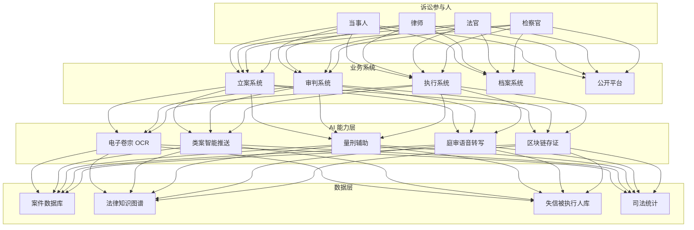

> **生产环境安全提示**
>
> 本文档包含可直接执行的运维命令。执行前请确认：当前目标集群与 Namespace 是否正确；是否具备足够的 RBAC 权限；是否已在非生产环境验证。命令风险等级标注：🔴 高风险（可能造成数据丢失或服务中断）、🟡 中风险（会修改集群状态，但通常可回滚）、🟢 低风险/只读（信息收集，无副作用）。


title: 司法科技架构设计
description: '# 司法科技架构设计 — 阿里云视角'
category: application-architecture
tags:
- k8s
- architecture
- industry
last_updated: 2026-05-18
difficulty: advanced
reading_level: advanced
audience:
- 法律科技架构师
- 智慧法院系统开发者
- 政务云解决方案工程师
- 阿里云政务解决方案架构师
estimated_read_time: 5min
intent_queries:
- 司法科技智慧法院 [[Kubernetes|Kubernetes]] 部署
- 类案推送 NLP 知识图谱架构
- 电子卷宗 OCR 结构化抽取
- 区块链电子证据存证
- 法律 AI 辅助审判系统
trigger_keywords:
- 司法科技
- 智慧法院
- 智能审判
- LegalTech
- 类案推送
- 电子卷宗
- 区块链存证
- 法律知识图谱
- 量刑辅助
- 在线调解
related_domains:
- domain-9-security-compliance
- domain-03-networking-traffic
- domain-7-ai-ml-platform
related_topics:
- domain-20-application-patterns/topic-application-architecture/13-digital-government-architecture
- domain-20-application-patterns/topic-application-architecture/24-insurtech
authors:
- name: KUDIG Team
  role: contributor
k8s_versions:
- '1.28'
- '1.29'
- '1.30'
- '1.31'
- '1.32'
---

# 司法科技架构设计 — 阿里云视角

> **适用版本**: Kubernetes v1.29 - v1.33 | **最后更新**: 2026-05-18
> **作者**: 阿里云解决方案师 | **标签**: `#司法科技` `#智慧法院` `#智能审判` `#LegalTech` `#阿里云`

---

## 目录

1. [概述](#1-概述)
2. [设计原则](#2-设计原则)
3. [架构模式](#3-架构模式)
4. [实现示例](#4-实现示例)
5. [在 Kubernetes 上的部署](#5-在-kubernetes-上的部署)
6. [最佳实践](#6-最佳实践)
7. [反模式](#7-反模式)
8. [参考资源](#8-参考资源)

---

## 1. 概述

司法科技（LegalTech）通过数字化手段提升司法系统的公正性、效率和透明度。在"智慧法院"建设的大背景下，中国法院系统正在全面推进电子卷宗、智能庭审、类案推送、在线调解、区块链存证等技术应用。司法科技的核心目标是将繁琐的人工流程自动化、将隐性的法律知识显性化、将分散的司法数据集中化。

司法科技系统的核心挑战是**安全合规**和**准确性**。司法数据（案件信息、卷宗、裁判文书）具有高度敏感性，需要严格的访问控制和加密保护。AI 辅助功能（类案推送、量刑建议）的准确性直接影响司法公正，需要经过严格验证。

### 1.1 行业背景

| 挑战 | 说明 | 架构影响 |
|:---|:---|:---|
| 卷宗电子化 | 海量纸质卷宗数字化 | OCR + 结构化抽取 |
| 审判智能化 | 类案推送/量刑辅助 | NLP + 知识图谱 |
| 执行难 | 被执行人财产查找 | 大数据联动 |
| 跨域立案 | 异地诉讼便民 | 协同平台 |
| 数据安全 | 司法数据高度敏感 | 加密 + 隔离 + 审计 |

### 1.2 核心场景

- **智慧审判**: 电子卷宗随案同步生成、庭审语音转写、类案智能推送
- **智慧执行**: 网络查控（银行/房产/车辆）、失信惩戒、财产处置
- **智慧服务**: 跨域立案、在线调解、司法公开
- **智慧管理**: 审判管理、质效评估、数据决策
- **区块链存证**: 电子证据时间戳存证、裁判文书防篡改

---

## 2. 设计原则

### 2.1 安全合规原则

司法系统需要满足等保三级和密码应用安全性评估（密评）要求。所有数据传输使用国密算法加密，核心系统部署在政务云或专有云。数据访问采用最小权限原则，所有操作留有审计日志。

### 2.2 AI 辅助而非替代原则

司法科技中的 AI 功能是"辅助"而非"替代"——AI 提供类案参考和量刑建议，最终裁判权归法官所有。系统设计需要明确标注 AI 输出为"参考建议"，保留法官的完整裁量空间。

### 2.3 数据标准原则

司法数据的标准化是实现跨系统协同的基础。案件信息、裁判文书、电子卷宗需要遵循最高人民法院的数据标准（如《人民法院信息化标准》），支持全国法院间的数据共享。

### 2.4 零信任原则

司法系统采用零信任安全架构——不信任任何内部或外部访问请求，所有访问都需要身份认证、权限校验和行为审计。敏感操作（如卷宗调阅、裁判文书签发）需要双人复核。

---

## 3. 架构模式

### 3.1 智慧法院全景架构



---

## 4. 实现示例

### 4.1 类案检索服务

```python
from dataclasses import dataclass
from typing import List

@dataclass
class SimilarCase:
    case_id: str
    title: str
    court: str
    date: str
    similarity: float
    key_factors: List[str]
    verdict: str

class CaseSimilarityEngine:
    def search(self, query_factors: List[str],
               case_type: str = None,
               top_k: int = 10) -> List[SimilarCase]:
        query_embedding = self._encode_factors(query_factors)
        candidates = self._retrieve_candidates(case_type)
        scored = []
        for case in candidates:
            case_embedding = self._encode_factors(case['factors'])
            sim = self._cosine_similarity(query_embedding, case_embedding)
            scored.append((sim, case))

        scored.sort(key=lambda x: x[0], reverse=True)
        results = []
        for sim, case in scored[:top_k]:
            results.append(SimilarCase(
                case_id=case['id'],
                title=case['title'],
                court=case['court'],
                date=case['date'],
                similarity=sim,
                key_factors=case['factors'],
                verdict=case['verdict'],
            ))
        return results

    def _encode_factors(self, factors: List[str]):
        return [hash(f) % 1000 / 1000.0 for f in factors]

    def _retrieve_candidates(self, case_type: str):
        return []

    def _cosine_similarity(self, a, b):
        import numpy as np
        a, b = np.array(a), np.array(b)
        if len(a) != len(b):
            return 0.0
        norm = np.linalg.norm(a) * np.linalg.norm(b)
        if norm == 0:
            return 0.0
        return float(np.dot(a, b) / norm)
```

---

## 5. 在 Kubernetes 上的部署

```yaml
apiVersion: apps/v1
kind: Deployment
metadata:
  name: intelligent-trial
  namespace: legaltech
spec:
  replicas: 3
  selector:
    matchLabels:
      app: intelligent-trial
  template:
    metadata:
      labels:
        app: intelligent-trial
    spec:
      containers:
        - name: trial
          image: registry.cn-hangzhou.aliyuncs.com/legal/intelligent-trial:v2.0.0
          env:
            - name: KNOWLEDGE_GRAPH_URL
              value: "http://legal-kg:8080"
            - name: CASE_SIMILARITY_THRESHOLD
              value: "0.85"
          resources:
            requests:
              memory: "4Gi"
              cpu: "2000m"
            limits:
              memory: "8Gi"
              cpu: "4000m"
```

---

## 6. 最佳实践

- **国密算法**: 使用 SM2/SM3/SM4 国密算法进行加密和签名
- **双人复核**: 敏感操作（卷宗调阅、裁判签发）需要双人复核
- **AI 辅助标注**: AI 推荐结果明确标注为"参考建议"
- **区块链存证**: 电子证据使用区块链存证，确保不可篡改

## 7. 反模式

- **AI 替代法官**: AI 直接做出裁判决定，侵犯法官裁量权。AI 仅提供参考建议
- **数据未加密**: 司法数据明文传输。应使用国密算法端到端加密
- **忽视等保合规**: 系统未通过等保三级评估。应从设计阶段就纳入合规要求

---

## 8. 参考资源

### 8.1 阿里云组件映射

| 功能域 | **阿里云云原生方案** |
|:---|:---|
| 容器平台 | **ACK Pro** |
| AI | **PAI + NLP** |
| 区块链 | **蚂蚁链 BaaS** |
| 数据库 | **PolarDB** |
| 对象存储 | **OSS** |
| 可观测性 | **ARMS + SLS** |

### 8.2 生产检查清单

- [ ] 电子卷宗 OCR 准确率 > 98%
- [ ] 类案推送相关性验证
- [ ] 区块链存证不可篡改验证
- [ ] 司法数据加密传输
- [ ] 等保三级/密评合规

---

**维护者**: 阿里云解决方案架构师团队 | **许可证**: MIT

---

## Obsidian 相关文档

- topic-application-architecture KUDIG Database — Global MOC
- [[domain-20-application-patterns/行业架构/README.md|[[Topic 应用层架构设计最佳实践|Topic 应用层架构设计最佳实践]]]]
- [[domain-20-application-patterns/行业架构/01-ecommerce-architecture.md|电商系统 Kubernetes 生产架构设计]]
- [[domain-20-application-patterns/行业架构/02-mini-program-architecture.md|小程序平台架构设计]]
- [[domain-20-application-patterns/行业架构/03-cms-architecture.md|内容管理系统 CMS 架构设计]]
- [[domain-20-application-patterns/行业架构/04-im-rtc-architecture.md|实时通信 IM/RTC 架构设计]]
- [[domain-20-application-patterns/行业架构/05-online-education-architecture.md|在线教育平台 Kubernetes 生产架构设计]]
- [[domain-20-application-patterns/行业架构/06-fintech-architecture.md|金融科技FinTech Kubernetes生产架构设计]]
- [[domain-20-application-patterns/行业架构/07-iot-platform-architecture.md|物联网 IoT 平台架构设计]]
- [[domain-20-application-patterns/行业架构/08-ai-ml-inference-architecture.md|AI/ML 推理服务 Kubernetes 生产架构设计]]
- [[domain-20-application-patterns/行业架构/09-gaming-backend-architecture.md|游戏后端 Kubernetes 生产架构设计]]
- [[domain-20-application-patterns/行业架构/10-social-media-architecture.md|社交媒体平台Kubernetes生产架构设计]]

## See Also

- 80-tsn-network
- 81-smart-customs
- 83-cultural-digitization
- 84-national-park

## Related

- topic-application-architecture MOC — Cross-reference


<!-- risk-assessed -->
