> **生产环境安全提示**
>
> 本文档包含可直接执行的运维命令。执行前请确认：当前目标集群与 Namespace 是否正确；是否具备足够的 RBAC 权限；是否已在非生产环境验证。命令风险等级标注：🔴 高风险（可能造成数据丢失或服务中断）、🟡 中风险（会修改集群状态，但通常可回滚）、🟢 低风险/只读（信息收集，无副作用）。


# 问题排查决策树 Mermaid 可视化集

> **版本**: v1.0
> **创建日期**: 2026-05-18
> **用途**: 将 63 篇问题排查文档的决策树转换为 Mermaid 图形化格式，便于 on-call 快速扫描
> **覆盖**: 18 个核心 Skill 对应的决策树

---

## 1. Node NotReady 决策树

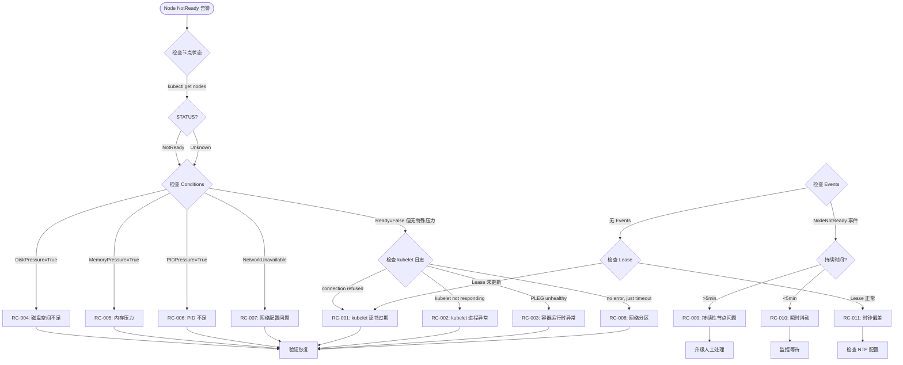

### 关键命令速查

| 步骤 | 命令 | 预期结果 |
|------|------|---------|
| T1 | `kubectl get nodes -o wide` | 查看 STATUS 和 AGE |
| T3 | `kubectl describe node <node>` | 查看 Conditions |
| T4 | `journalctl -u kubelet --since "10m"` | 查看 kubelet 日志 |
| T7 | `kubectl get lease -n kube-node-lease <node>` | 检查 Lease 更新时间 |

---

## 2. Pod CrashLoopBackOff 决策树

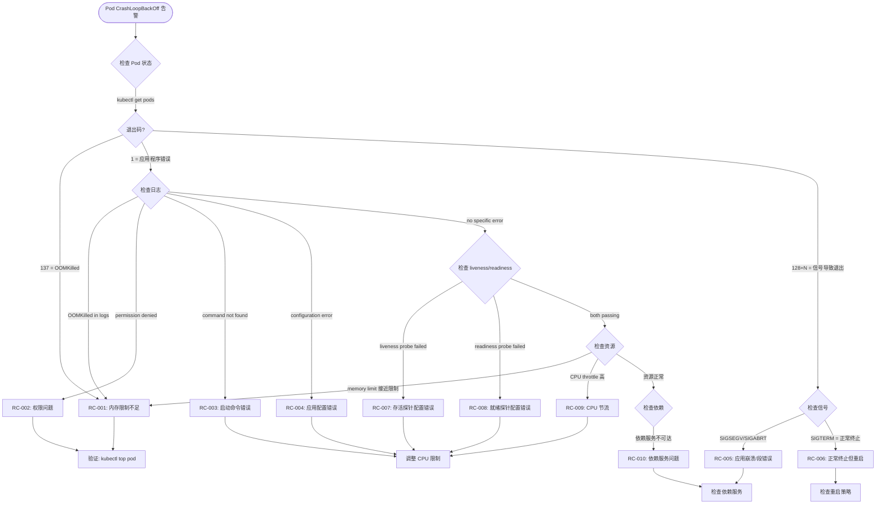

---

## 3. Pod Pending 决策树

```mermaid
flowchart TD
    START(["Pod Pending 告警"]) --> T1{检查 Events}
    T1 -->|FailedScheduling| T2{错误信息?}
    T1 -->|无 Events| T3{检查调度器}
    T2 -->|Insufficient cpu/memory| R1["RC-001: 资源不足"]
    T2 -->|node(s) had taint| R2["RC-002: 节点污点不容忍"]
    T2 -->|node(s) didn't match PodAffinity| R3["RC-003: 亲和性不匹配"]
    T2 -->|pvc not found| R4["RC-004: PVC 不存在"]
    T2 -->|pvc pending| R5["RC-005: PVC 绑定中"]
    T2 -->|no nodes available| T4{检查节点状态}
    T2 -->|max pending pods reached| R6["RC-006: 调度队列满"]
    T3 -->|scheduler 不工作| R7["RC-007: 调度器问题"]
    T4 -->|存在 NotReady 节点| R8["RC-008: 节点不可用"]
    T4 -->|存在 Ready 但无足够资源| R1
    T4 -->|所有节点 Ready 但有 Taint| R2

    R1 --> FIX1["增加资源或缩减工作负载"]
    R2 --> FIX2["添加 tolerations 或移除 taint"]
    R3 --> FIX3["调整 affinity 规则"]
    R4 --> FIX4["检查 PVC 配置"]
    R5 --> FIX5["检查 StorageClass/CSI"]
    R6 --> FIX6["增加 scheduler 并行度"]
    R7 --> ESCALATE["重启调度器"]
    R8 --> FIX8["恢复节点或迁移 Pod"]
```

---

## 4. DNS 解析问题决策树

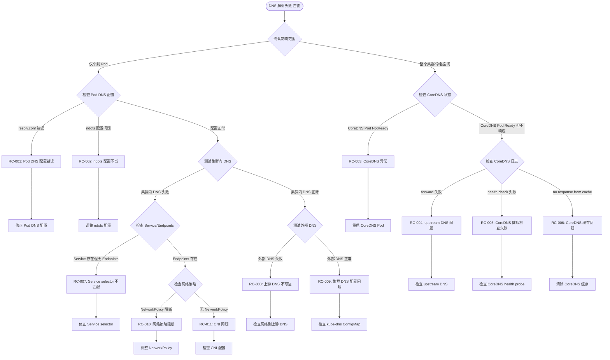

---

## 5. Service 无 Endpoints 决策树

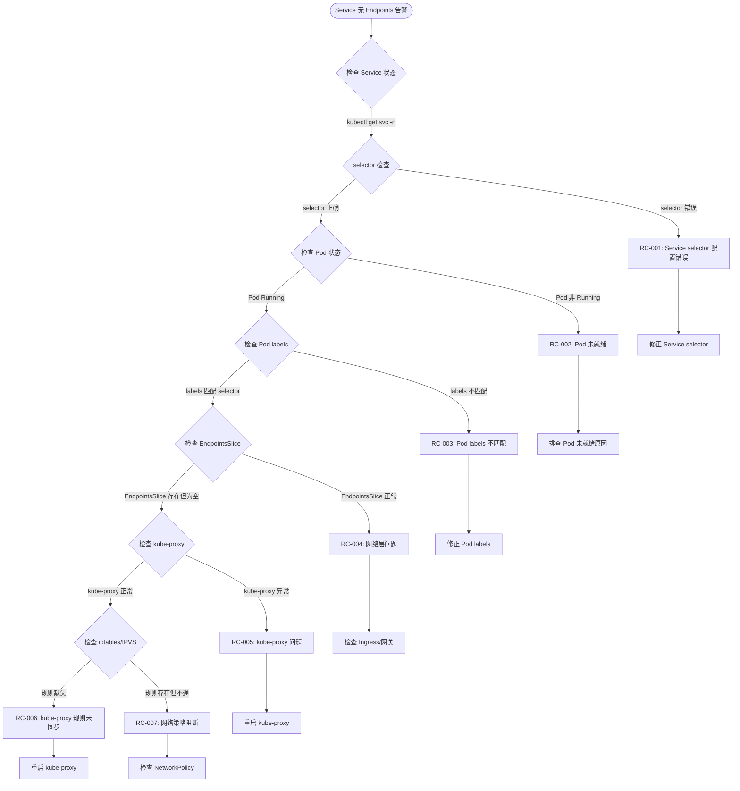

---

## 6. 证书过期决策树

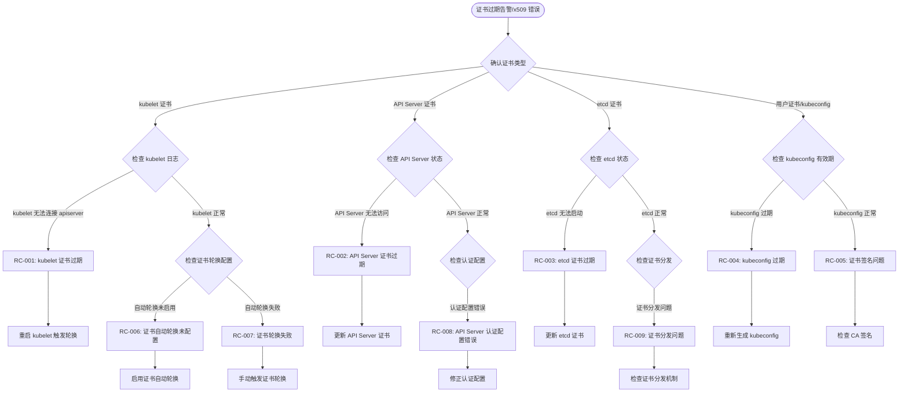

---

## 7. PVC 存储问题决策树

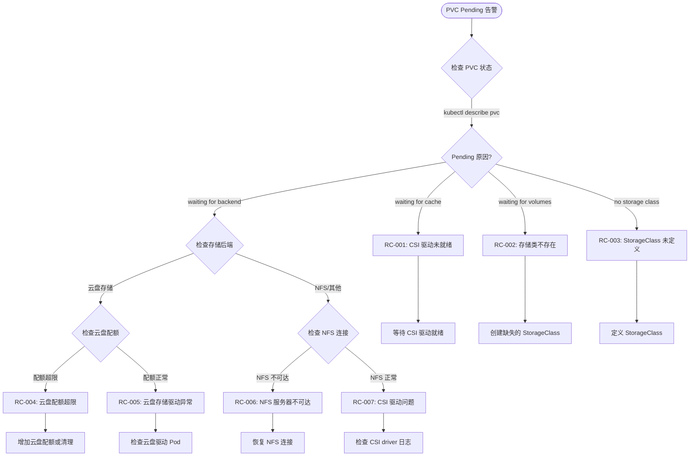

---

## 8. Deployment 滚动更新卡住决策树

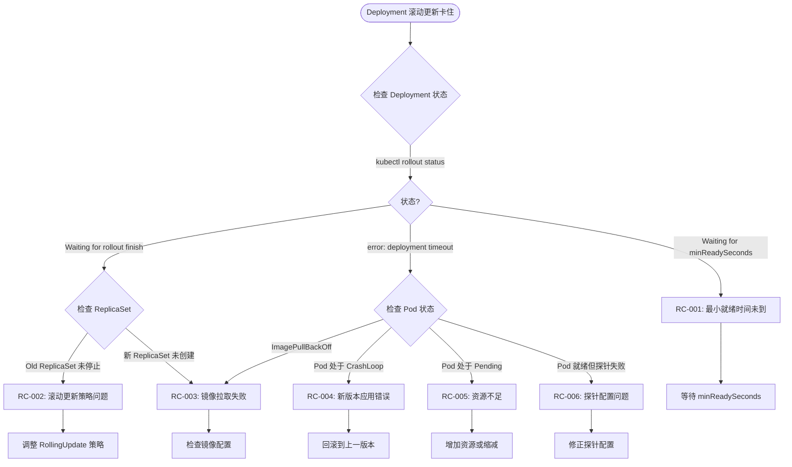

---

## 9. RBAC/Quota 问题决策树

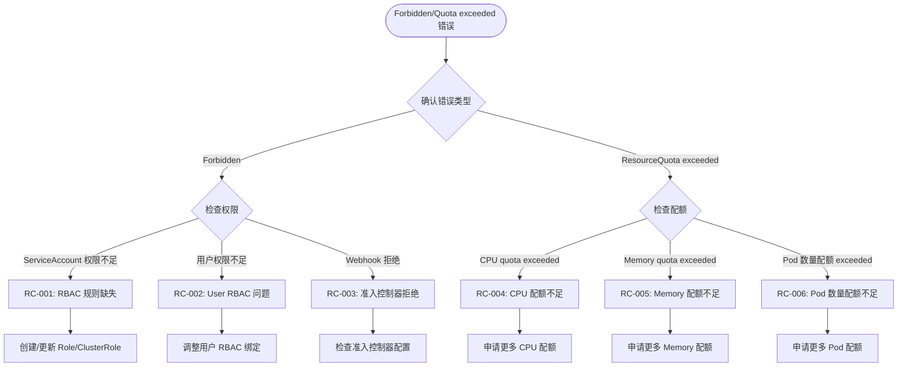

---

## 10. HPA/VPA 弹性伸缩问题决策树

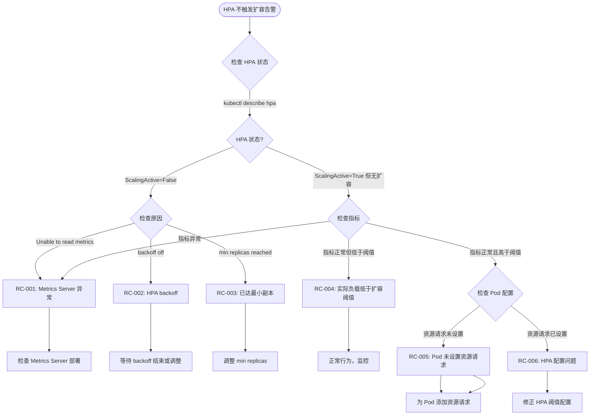

---

## 11. Ingress/Gateway 问题决策树

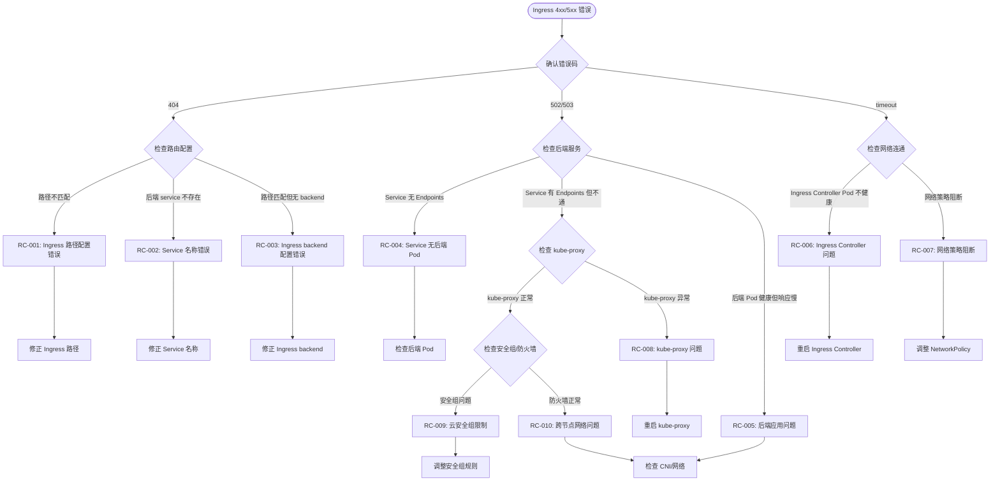

---

## 12. 镜像拉取失败决策树

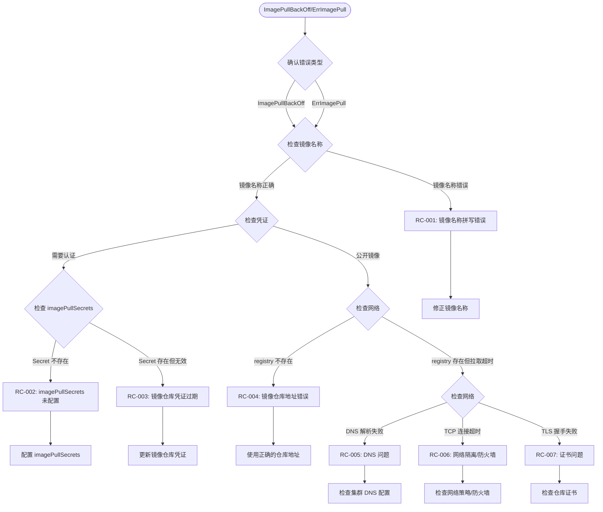

---

## 13. 控制平面问题决策树

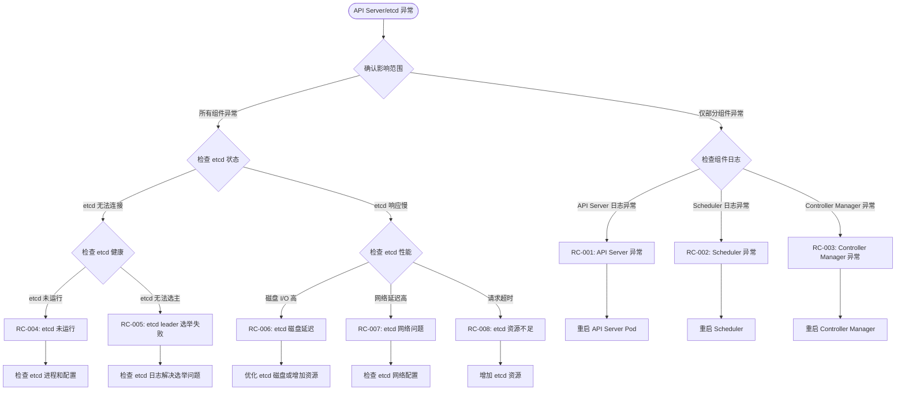

---

## 14. 性能瓶颈决策树

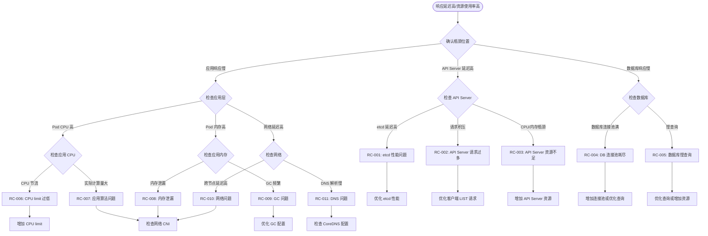

---

## 15. 配置管理问题决策树

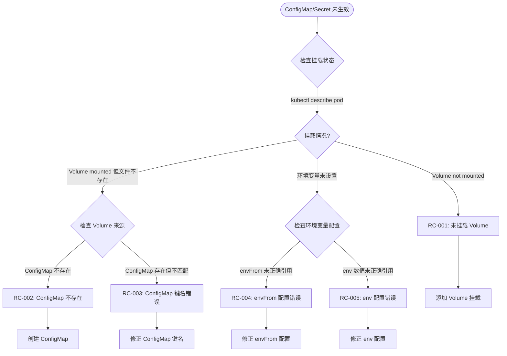

---

## 16. 日志收集问题决策树

```mermaid
flowchart TD
    START(["日志缺失/收集中断"]) --> T1{检查日志收集状态}
    T1 -->|[[fluentd|Fluentd]]/Fluent Bit Pod| T2{Pod 状态?}
    T2 -->|Pod 未运行| R1["RC-001: 日志收集 Pod 未运行"]
    T2 -->|Pod 运行但不发送| T3{检查配置}
    T3 -->|Input 配置错误| R2["RC-002: 日志输入配置错误"]
    T3 -->|Output 无法到达| T4{检查 Output}
    T4 -->|Elasticsearch 不可达| R3["RC-003: 输出端不可达"]
    T4 -->|权限不足| R4["RC-004: 输出端认证失败"]
    T3 -->|Filter 配置错误| R5["RC-005: 日志过滤配置错误"]

    R1 --> FIX1["重启日志收集 Pod"]
    R2 --> FIX2["修正 Input 配置"]
    R3 --> FIX3["检查 Elasticsearch 连接"]
    R4 --> FIX4["更新认证信息"]
    R5 --> FIX5["修正 Filter 配置"]
```

---

## 17. 监控告警问题决策树

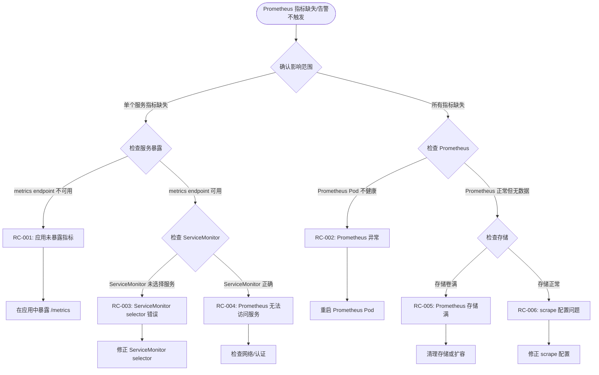

---

## 18. 安全事件决策树

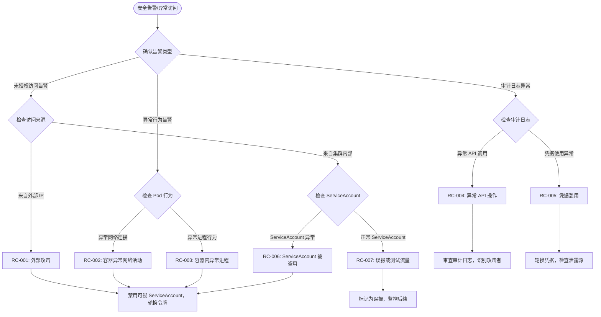

---

## 使用说明

### 如何使用本决策树

1. **定位入口**: 根据告警/症状找到对应的决策树
2. **按图索骥**: 沿决策树路径执行检查
3. **快速定位**: 每个分支对应一个根因 (RC-xxx)
4. **修复验证**: 修复后使用对应命令验证

### 与 Skills 的对应关系

| 决策树 | 主要 Skill | 辅助 Skill |
|--------|-----------|-----------|
| Node NotReady | SKILL-NODE-001 | SKILL-CP-001, SKILL-SEC-001 |
| Pod CrashLoop | SKILL-POD-001 | SKILL-SEC-001 |
| Pod Pending | SKILL-POD-002 | SKILL-NET-001, SKILL-STORE-001 |
| DNS 解析问题 | SKILL-NET-001 | SKILL-NET-002 |
| Service 无 Endpoints | SKILL-NET-002 | SKILL-NET-001 |
| 证书过期 | SKILL-SEC-001 | SKILL-NODE-001 |
| PVC 存储问题 | SKILL-STORE-001 | SKILL-CP-001 |
| Deployment 卡住 | SKILL-WORK-001 | SKILL-POD-001 |
| RBAC/Quota | SKILL-SEC-002 | SKILL-POD-002 |
| HPA/VPA | SKILL-SCALE-001 | SKILL-POD-001 |
| Ingress/Gateway | SKILL-NET-003 | SKILL-SEC-001 |
| 镜像拉取失败 | SKILL-IMAGE-001 | SKILL-POD-002 |
| 控制平面问题 | SKILL-CP-001 | SKILL-SEC-001 |
| 性能瓶颈 | SKILL-PERF-001 | - |
| 配置管理 | SKILL-CONFIG-001 | SKILL-POD-001 |
| 日志收集 | SKILL-LOG-001 | SKILL-MONITOR-001 |
| 监控告警 | SKILL-MONITOR-001 | - |
| 安全事件 | SKILL-SECURITY-001 | SKILL-NODE-001 |

---

**关联文档**:
- [domain-10-troubleshooting-diagnostics/topic-skills/](../domain-10-troubleshooting-diagnostics/技能体系/) — 18 个 GA Skill
- [domain-10-troubleshooting-diagnostics/topic-structural-trouble-shooting/](../domain-10-troubleshooting-diagnostics/高级排障/) — 63 篇问题排查文档
- [P0-1: 工单分类体系](./P0-1-ticket-classification-intent-recognition.md)
- [P0-2: 多技能协同协议](./P0-2-multi-skill-coordination-protocol.md)

<!-- risk-assessed -->
