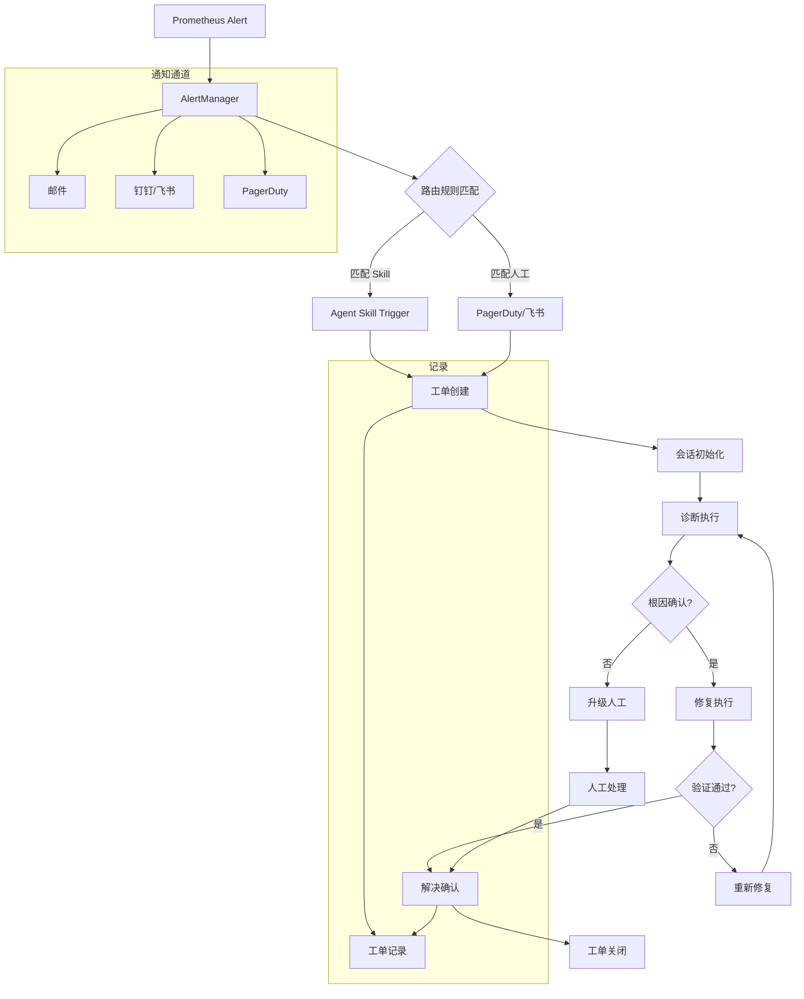

> **生产环境安全提示**
>
> 本文档包含可直接执行的运维命令。执行前请确认：当前目标集群与 Namespace 是否正确；是否具备足够的 RBAC 权限；是否已在非生产环境验证。命令风险等级标注：🔴 高风险（可能造成数据丢失或服务中断）、🟡 中风险（会修改集群状态，但通常可回滚）、🟢 低风险/只读（信息收集，无副作用）。


# 告警→工单→解决 完整闭环文档

> **版本**: v1.0
> **创建日期**: 2026-05-18
> **用途**: 定义 Prometheus 告警→工单创建→状态通知→解决验证的完整闭环
> **关联**: P0-1 工单分类体系, P0-3 会话上下文管理

---

## 1. 闭环流程概述

### 1.1 完整链路图



### 1.2 各阶段职责

| 阶段 | 系统 | 说明 |
|------|------|------|
| 告警触发 | Prometheus/AlertManager | 监控指标触发告警规则 |
| 告警路由 | AlertManager | 根据标签路由到 Agent 或人工 |
| 工单创建 | Agent Gateway | 创建会话，关联 Skill |
| 诊断执行 | Skill Engine | 执行诊断工作流 |
| 修复执行 | Skill Engine | 按风险等级执行修复 |
| 验证确认 | Skill Engine + Monitor | 验证修复效果 |
| 工单关闭 | Agent Gateway | 更新工单状态，同步监控 |

---

## 2. 告警定义与分类

### 2.1 告警分组 (Alert Grouping)

```yaml
# AlertManager 路由配置
route:
  # 按严重性分组
  group_by: ['alertname', 'severity', 'cluster']
  group_wait: 30s
  group_interval: 5m
  repeat_interval: 4h

  # 按服务/组件路由
  routes:
    # P0 告警 - 直接触发 Agent 并通知值班
    - matchers:
      - severity="critical"
      - team="sre"
      receiver: agent-skill-trigger
      group_wait: 0s
      repeat_interval: 1h
    # 安全告警 - 直接触发 Agent 并升级安全团队
    - matchers:
      - alertname="SecurityAlert"
      receiver: agent-security-trigger
      group_wait: 0s
    # P1 告警 - Agent 处理，失败则通知
    - matchers:
      - severity="warning"
      - team="ops"
      receiver: agent-skill-trigger
      group_wait: 2m
    # P2/P3 告警 - Agent 处理，静默
    - matchers:
      - severity="info"
      receiver: agent-skill-trigger
      group_wait: 5m
      repeat_interval: 0s  # 静默重复
```

### 2.2 告警→Category 映射

| Alert Name | Severity | Category | 触发 Skill |
|------------|----------|----------|-----------|
| KubeNodeNotReady | critical | TC-INFRA-NODE | SKILL-NODE-001 |
| KubePodCrashLooping | warning | TC-APP-POD | SKILL-POD-001 |
| KubePodNotScheduled | warning | TC-APP-POD | SKILL-POD-002 |
| DNSResolverError | critical | TC-INFRA-NET | SKILL-NET-001 |
| ServiceEndpointsMissing | warning | TC-INFRA-NET | SKILL-NET-002 |
| KubeCertCertificateExpiry | warning | TC-SEC-CERT | SKILL-SEC-001 |
| KubeRBACError | warning | TC-SEC-RBAC | SKILL-SEC-002 |
| KubePVCPending | warning | TC-INFRA-STORE | SKILL-STORE-001 |
| KubeDeploymentReplicas | warning | TC-APP-WORKLOAD | SKILL-WORK-001 |
| KubeHPANotScaling | warning | TC-INFRA-SCALE | SKILL-SCALE-001 |
| IngressErrorRate | warning | TC-APP-INGRESS | SKILL-NET-003 |
| ImagePullFailure | warning | TC-APP-POD | SKILL-IMAGE-001 |
| KubeAPIServerError | critical | TC-INFRA-CP | SKILL-CP-001 |
| SecurityAnomaly | critical | TC-SEC-INCIDENT | SKILL-SECURITY-001 |

---

## 3. 工单创建

### 3.1 工单数据结构

```yaml
Ticket:
  id: string                    # TKT-YYYYMMDD-NNNN
  source: enum                  # alert | manual | api
  source_alert:                 # 关联的告警
    alertname: string
    labels: map[string]string
    starts_at: timestamp
    severity: string

  # 基本信息
  title: string                 # "Node NotReady: node-01"
  description: string           # 告警详情
  category: string              # TC-INFRA-NODE
  priority: P0 | P1 | P2 | P3   # 来自告警或规则
  cluster: string               # 集群标识
  namespace: string             # 影响的命名空间
  affected_resources:          # 影响的资源
    - kind: Pod
      name: "payment-xxx-xxx"
      namespace: production

  # 时间
  created_at: timestamp
  updated_at: timestamp
  resolved_at: timestamp | null
  sla_deadline: timestamp      # SLA 截止时间

  # 状态
  status: enum                  # CREATED | ROUTING | DIAGNOSING | RESOLVING | VERIFYING | RESOLVED | ESCALATED | CLOSED

  # 处理信息
  assigned_to: string | null    # Agent ID 或人工
  skill_id: string | null       # 关联的 Skill
  resolution: string | null     # 解决方法摘要

  # 元数据
  metadata:
    alert_id: string
    prometheus_url: string
    grafana_dashboard: string
```

### 3.2 自动创建规则

```yaml
# 告警→工单 自动创建规则
alert_to_ticket:
  # 立即创建工单的条件
  immediate_create:
    - condition: "severity == critical"
      priority: P0

    - condition: "alertname matches 'Security*'"
      priority: P0

    - condition: "affected_resources contains 'control-plane'"
      priority: P0

  # 延迟创建工单的条件 (用于聚合)
  delayed_create:
    - condition: "severity == warning"
      delay: 2m
      aggregation: "group_by: [alertname, cluster]"

    - condition: "severity == info"
      delay: 5m
      aggregation: "group_by: [alertname, cluster, namespace]"
      auto_close_if_resolved: true  # 告警解决则不创建工单

  # 不创建工单的条件
  suppress:
    - condition: "alertname contains 'Test'"
      reason: "测试告警"

    - condition: "labels.environment == 'dev'"
      reason: "开发环境告警"
```

---

## 4. 状态通知

### 4.1 状态变更通知规则

```yaml
notification_rules:
  # 工单创建通知
  on_created:
    channels: [slack, pagerduty]
    template: |
      🎫 **工单已创建**: {{ticket_id}}
      **标题**: {{title}}
      **严重性**: {{priority}}
      **集群**: {{cluster}}
      **链接**: {{ticket_url}}

  # 工单升级通知
  on_escalated:
    channels: [slack, pagerduty, sms]
    template: |
      🚨 **工单已升级**: {{ticket_id}}
      **标题**: {{title}}
      **原因**: {{escalation_reason}}
      **等待处理**: {{waiting_time}}
      **链接**: {{ticket_url}}

  # 工单解决通知
  on_resolved:
    channels: [slack]
    template: |
      ✅ **工单已解决**: {{ticket_id}}
      **标题**: {{title}}
      **解决时间**: {{resolution_time}}
      **解决方法**: {{resolution}}
      **验证人**: {{verified_by}}

  # 工单关闭通知
  on_closed:
    channels: []
    template: ""  # 不通知

  # 状态变更通知
  on_status_change:
    # 仅在关键状态变更时通知
    include_statuses: [RESOLVING, VERIFYING, ESCALATED]
    channels: [slack]
    template: |
      📊 **工单状态变更**: {{ticket_id}}
      **新状态**: {{new_status}}
      **变更时间**: {{changed_at}}
```

### 4.2 通知频率控制

```yaml
notification_rate_limit:
  # 同一工单的通知频率
  per_ticket:
    min_interval: 5m           # 同一状态至少间隔 5 分钟
    max_per_hour: 12           # 每小时最多 12 条

  # 升级通知立即发送
  escalation:
    no_rate_limit: true
    priority_channels: [pagerduty, sms]

  # 恢复通知延迟发送 (避免抖动)
  recovery:
    delay: 2m                  # 告警恢复后延迟 2 分钟发送
```

---

## 5. 验证与闭环

### 5.1 验证层级

```yaml
verification_layers:
  # Layer 1: 即时验证 (修复后 1 分钟内)
  immediate:
    - type: "status_check"
      command: "kubectl get pods -n {ns} -l {label} -o jsonpath='{.items[*].status.phase}'"
      expected: "Running Running Running"

    - type: "health_check"
      command: "curl -s http://{service}:{port}/health"
      expected: "200 OK"

  # Layer 2: 短期监控 (修复后 15 分钟内)
  short_term:
    - type: "metric_check"
      metric: "kube_node_status_condition{condition=\"Ready\",status=\"true\"}"
      expected: "value == 1"
      threshold: "for > 5m"

    - type: "error_rate_check"
      metric: "scrape_errors_total"
      expected: "increase == 0"
      threshold: "for > 10m"

  # Layer 3: 回归检测 (24 小时内)
  regression:
    - type: "alert_silence"
      action: "静默相关告警 24 小时"
      auto_expire: true

    - type: "dashboard_check"
      action: "确认 Grafana 仪表盘正常"
      url_template: "https://grafana.example.com/d/{cluster}/overview?var-cluster={cluster}&from=now-15m&to=now"
```

### 5.2 闭环确认条件

```yaml
resolution_criteria:
  # 全部满足才能关闭工单
  all_must_pass:
    - condition: "affected_resources.status == healthy"
      description: "所有受影响资源已恢复"

    - condition: "related_alerts.status == resolved"
      description: "相关告警已解决"

    - condition: "no_new_incidents.within(30m)"
      description: "30 分钟内无新事件"

    - condition: "verification_passed"
      description: "验证步骤全部通过"

  # 任一满足即可升级
  escalation_triggers:
    - condition: "resolution_time > SLA_deadline"
      description: "超过 SLA 截止时间"

    - condition: "same_root_cause.repeated > 3"
      description: "同一根因重复发生超过 3 次"

    - condition: "user_reported_issue"
      description: "用户仍报告问题"
```

---

## 6. 与 Skill 的集成

### 6.1 告警触发 Skill 流程

```yaml
alert_to_skill_integration:
  # AlertManager webhook 配置
  webhook_receiver:
    url: "http://agent-gateway:8080/api/v1/alerts"
    timeout: 10s
    retry:
      max_attempts: 3
      backoff: 5s

  # 告警 payload 格式
  alert_payload:
    alert_id: "{{alert.labels.alertname}}-{{timestamp}}"
    alertname: "{{alert.labels.alertname}}"
    severity: "{{alert.labels.severity}}"
    status: "{{alert.status}}"  # firing | resolved
    starts_at: "{{alert.startsAt}}"
    ends_at: "{{alert.endsAt}}"
    labels: "{{alert.labels}}"
    annotations: "{{alert.annotations}}"
    generator_url: "{{alert.generatorURL}}"

  # Skill 触发
  skill_trigger:
    mapping:
      "KubeNodeNotReady" -> "SKILL-NODE-001"
      "KubePodCrashLooping" -> "SKILL-POD-001"
      "DNSResolverError" -> "SKILL-NET-001"
      # ... 其他映射

    context_injection:
      - field: "alert_id"
        inject_into: "session.metadata.alert_id"

      - field: "severity"
        inject_into: "session.priority"

      - field: "labels.cluster"
        inject_into: "session.cluster"
```

### 6.2 Skill 结果反馈到告警

```yaml
skill_to_alert_feedback:
  # Skill 完成后的动作
  on_skill_complete:
    if resolution == "resolved":
      - action: "silence_alert"
        duration: "24h"
        comment: "Resolved by Agent: {skill_id}"

      - action: "send_notification"
        channel: "slack"
        message: "Resolved: {ticket_id} by {skill_id}"

    if resolution == "escalated":
      - action: "notify"
        channel: "pagerduty"
        message: "Escalated: {ticket_id}, reason: {escalation_reason}"
```

---

## 7. 监控与报表

### 7.1 关键指标

| 指标 | 计算方式 | 目标 |
|------|---------|------|
| 工单创建率 | count(tickets) / period | - |
| 工单解决率 | resolved / created | ≥ 85% |
| 平均解决时间 | avg(resolved_at - created_at) | < 30min (P1) |
| Agent 自动解决率 | auto_resolved / resolved | ≥ 70% |
| 升级率 | escalated / created | < 15% |
| 告警→工单转换率 | tickets / firing_alerts | - |

### 7.2 SLA 监控

```yaml
sla_targets:
  P0:
    response_time: 5m
    resolution_time: 30m
    auto_resolution_target: 80%

  P1:
    response_time: 15m
    resolution_time: 2h
    auto_resolution_target: 70%

  P2:
    response_time: 1h
    resolution_time: 8h
    auto_resolution_target: 60%

  P3:
    response_time: 4h
    resolution_time: 24h
    auto_resolution_target: 50%
```

### 7.3 报表配置

```yaml
reports:
  daily:
    - title: "工单处理日报"
      metrics:
        - tickets_created
        - tickets_resolved
        - auto_resolved_rate
        - avg_resolution_time
        - escalations
      recipients: [sre-team, ops-team]

  weekly:
    - title: "告警与工单周报"
      metrics:
        - alert_volume_by_severity
        - ticket_category_distribution
        - top_root_causes
        - agent_performance
      recipients: [sre-lead, ops-lead]

  monthly:
    - title: "SRE 月度报告"
      metrics:
        - sla_compliance
        - incident_mttr
        - trend_analysis
      recipients: [sre-management]
```

---

## 8. 配置示例

### 8.1 AlertManager 配置

```yaml
# alertmanager.yaml
global:
  resolve_timeout: 5m

receivers:
  - name: 'agent-skill-trigger'
    webhook_configs:
      - url: 'http://agent-gateway:8080/api/v1/alerts'
        send_resolved: true
        http_config:
          timeout: 10s

  - name: 'pagerduty-critical'
    pagerduty_configs:
      - routing_key: '${PAGERDUTY_KEY}'
        severity: critical
        description: '{{ .GroupLabels.alertname }}'
        details:
          cluster: '{{ .Labels.cluster }}'
          severity: '{{ .Labels.severity }}'

  - name: 'slack-notifications'
    slack_configs:
      - channel: '#ops-alerts'
        send_resolved: true
        title: '{{ range .Alerts }}{{ .Annotations.summary }}{{ end }}'
        text: '{{ range .Alerts }}{{ .Annotations.description }}{{ end }}'

route:
  group_by: ['alertname', 'cluster']
  group_wait: 30s
  group_interval: 5m
  repeat_interval: 4h

  routes:
    - matchers:
      - severity="critical"
      receiver: agent-skill-trigger
      continue: true
    - matchers:
      - team="sre"
      receiver: pagerduty-critical
    - matchers:
      - severity="warning"
      receiver: agent-skill-trigger
    - matchers:
      - alertname=~"Security.*"
      receiver: pagerduty-critical
      continue: true
```

### 8.2 Prometheus 告警规则

```yaml
# prometheus-rules.yaml
groups:
  - name: kubernetes-node-alerts
    interval: 30s
    rules:
      - alert: KubeNodeNotReady
        expr: 'kube_node_status_condition{condition="Ready",status="false"} == 1'
        for: 2m
        labels:
          severity: critical
          team: sre
          skill: SKILL-NODE-001
        annotations:
          summary: "Node {{ $labels.node }} is NotReady"
          description: "Node {{ $labels.node }} has been NotReady for more than 2 minutes."
          runbook_url: "https://wiki.example.com/runbooks/kube-node-notready"

      - alert: KubePodCrashLooping
        expr: 'kube_pod_container_status_restarts_total > 5'
        for: 5m
        labels:
          severity: warning
          team: ops
          skill: SKILL-POD-001
        annotations:
          summary: "Pod {{ $labels.namespace }}/{{ $labels.pod }} is CrashLooping"
          description: "Pod {{ $labels.namespace }}/{{ $labels.pod }} has restarted {{ $value }} times in the last 15 minutes."
```

---

## 9. 问题场景处理

### 9.1 告警抖动 (Flapping)

```yaml
flapping_handling:
  # 检测条件
  condition: "same_alert.firing > 3 within 15m"

  # 处理方式
  actions:
    - action: "auto_silence"
      duration: "30m"
      reason: "告警抖动，延迟处理"

    - action: "aggregate_tickets"
      merge: true
      reason: "合并为同一工单"

  # 通知
  notification:
    message: "告警抖动已自动静默 30 分钟。如仍有问题请手动创建工单。"
```

### 9.2 大量告警 (Burst)

```yaml
burst_handling:
  # 检测条件
  condition: "alerts.count > 20 within 5m"

  # 处理方式
  actions:
    - action: "create_incident_ticket"
      type: "incident"
      priority: P0
      reason: "大量告警，可能存在重大问题"

    - action: "page_oncall"
      reason: "重大事件，需要人工介入"

    - action: "suppress_low_severity"
      severity_threshold: warning
      reason: "高优先级告警优先处理"
```

### 9.3 告警风暴 (Storm)

```yaml
storm_handling:
  # 检测条件
  condition: "alerts.count > 100 within 1m"

  # 处理方式
  actions:
    - action: "create_major_incident"
      priority: P0
      title: "Major Incident: Alert Storm"
      reason: "告警风暴，可能影响整个系统"

    - action: "page_sre_lead"
      reason: "重大事件升级"

    - action: "auto_resolve_low_priority"
      severity_threshold: info
      reason: "释放低优先级告警处理能力"
```

---

**关联文档**:
- [P0-1: 工单分类体系与意图识别语料库](./P0-1-ticket-classification-intent-recognition.md)
- [P0-3: 会话上下文管理机制](./P0-3-session-context-management.md)
- [domain-10-troubleshooting-diagnostics/[[domain-04-storage-data/README.md|README]].md](../domain-10-troubleshooting-diagnostics/topic-skills/README.md)
- [domain-06-observability/](../domain-06-observability/) — 监控告警详细文档

<!-- risk-assessed -->
