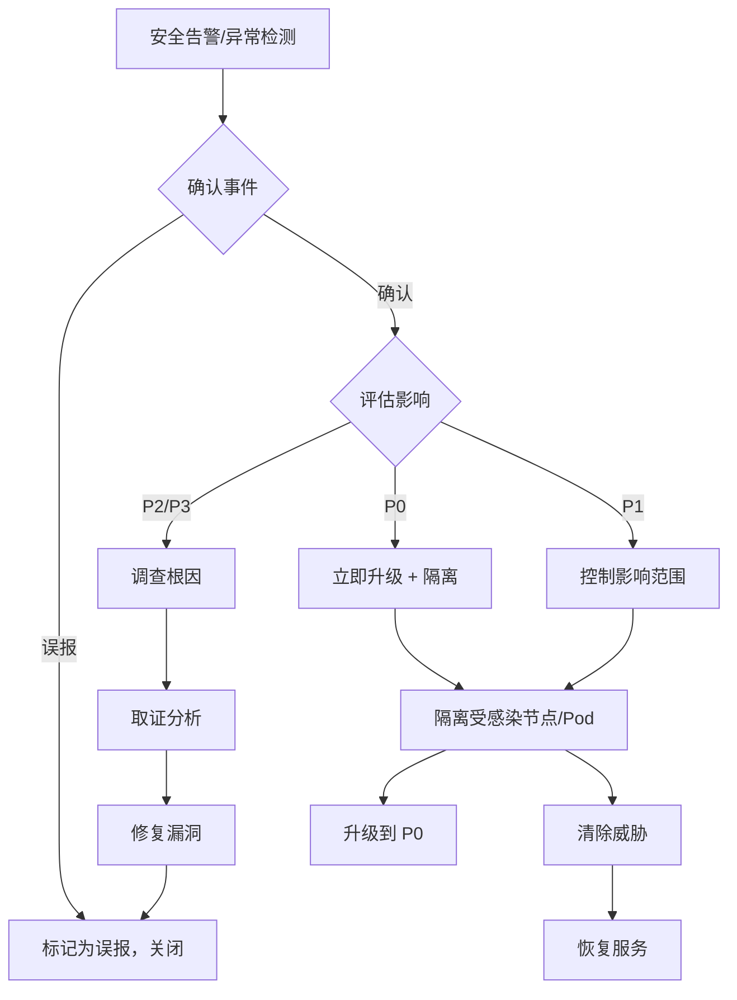

> **生产环境安全提示**
>
> 本文档包含可直接执行的运维命令。执行前请确认：当前目标集群与 Namespace 是否正确；是否具备足够的 RBAC 权限；是否已在非生产环境验证。命令风险等级标注：🔴 高风险（可能造成数据丢失或服务中断）、🟡 中风险（会修改集群状态，但通常可回滚）、🟢 低风险/只读（信息收集，无副作用）。


# 安全事件 SOP 与合规检查清单

> **版本**: v1.0
> **创建日期**: 2026-05-18
> **用途**: 容器逃逸检测、密钥轮换自动化、合规审计检查清单
> **关联**: SKILL-SECURITY-001, domain-25-[[domain-17-system-foundation/知识字典/security/cloud-native-security.md|cloud-native-security]]

---

## 1. 安全事件响应 SOP

### 1.1 安全事件分级

| 级别 | 定义 | 响应时间 | 升级路径 |
|------|------|---------|---------|
| P0 | 确认入侵/数据泄露/横向移动 | 立即 | 安全团队 + SRE + 管理层 |
| P1 | 疑似入侵/异常访问/审计告警 | 15min | 安全团队 + SRE |
| P2 | 安全配置违规/漏洞扫描 | 1h | 安全团队 |
| P3 | 低风险安全告警/异常尝试 | 4h | 安全团队 (异步) |

### 1.2 安全事件响应流程



### 1.3 容器逃逸检测 SOP

#### 阶段 1: 确认逃逸

| 检查项 | 命令 | 说明 |
|--------|------|------|
| 异常进程 | `kubectl exec -it <pod> -- ps aux` | 检查非预期进程 |
| 可疑文件 | `kubectl exec -it <pod> -- ls -la /host` | 逃逸到宿主机 |
| 异常网络 | `kubectl exec -it <pod> -- cat /proc/net/tcp` | 检查网络连接 |
| 特权容器 | `kubectl get pod -o yaml | grep privileged: true` | 特权容器风险 |

#### 阶段 2: 隔离

> ⚠️ **🔴 灾难性操作** — 含不可逆命令，执行前必须满足变更窗口+双人复核+事前备份+回滚方案
> - `kubectl delete pod --force`：强制删除 Pod，跳过优雅终止与数据刷盘
> - `kubectl cordon`：标记节点不可调度
> - `kubectl drain`：驱逐节点所有 Pod，业务流量受影响
> - `kubectl edit/patch`：修改运行中的资源

> **🔴 高风险操作警告**
>
> 下方命令属于不可逆或高影响操作，执行前请确认：
> - 已备份关键数据与配置
> - 处于批准的变更窗口期
> - 已获得相关责任人授权
> - 已准备回滚或恢复方案
> - 目标集群、Namespace、节点/资源名称正确无误

``` bash
# 🔴 高风险：可能造成数据丢失或服务中断，执行前需备份、变更审批与回滚方案
# 隔离可疑 Pod
kubectl label pod <pod> isolation=quarantine --overwrite
kubectl patch pod <pod> -p '{"spec":{"terminationGracePeriodSeconds":0}}'

# 隔离节点
kubectl cordon <node>
kubectl drain <node> --ignore-daemonsets --force

# 删除恶意 Pod
kubectl delete pod <pod> --grace-period=0 --force  # ⚠️ 跳过优雅终止，可能丢数据

# 检查同命名空间其他 Pod
kubectl get pods -n <ns> -o yaml | grep -E "image:|hostNetwork:"
```
#### 阶段 3: 取证

``` bash
# 🟢 低风险：只读/信息收集，通常无副作用
# 收集日志
kubectl logs <pod> --previous > pod-log-<date>.txt
kubectl describe pod <pod> > pod-describe-<date>.txt

# 收集审计日志
kubectl get events --sort-by=.lastTimestamp | grep -i "create|delete|patch"

# 节点取证 (需要 SSH)
journalctl -u kubelet --since "1d" > kubelet-log-<date>.txt
cat /var/log/containers/*.log | grep <pod-name> > container-log-<date>.txt

# 网络取证
tcpdump -i any -w /tmp/network.pcap host <suspicious-ip>
```
---

## 2. 密钥轮换自动化方案

### 2.1 Kubernetes 证书自动轮换

```yaml
# kubelet 证书自动轮换配置
# /var/lib/kubelet/config.yaml
authentication:
  x509:
    clientCA: /etc/kubernetes/pki/ca.crt

authorization:
  mode: Webhook

# kubelet 启动参数 (确保启用自动轮换)
# --certificate-update=true 参数在 v1.24+ 自动处理

# 检查证书过期时间
openssl x509 -in /var/lib/kubelet/pki/kubelet.crt -noout -dates

# 手动触发轮换
kubeadm alpha kubelet phase encode-certs-standalone --out-cert-dir=/var/lib/kubelet/pki --cert-dir=/var/lib/kubelet/pki
systemctl restart kubelet
```

### 2.2 Secret 自动轮换方案

```yaml
# Vault动态Secret + K8s Controller 自动化
# 1. Vault 配置
apiVersion: v1
kind: Secret
metadata:
  name: vault-creds
  namespace: vault
type: Opaque
stringData:
  VAULT_ADDR: "https://vault:8200"
  VAULT_TOKEN: "<token>"

---
# 2. External Secrets Operator 配置
apiVersion: external-secrets.io/v1beta1
kind: ExternalSecret
metadata:
  name: db-credentials
  namespace: production
spec:
  refreshInterval: 1h
  secretStoreRef:
    name: vault-backend
    kind: ClusterSecretStore
  target:
    name: db-creds
  data:
    - secretKey: username
      remoteKey: database/creds/db-username
    - secretKey: password
      remoteKey: database/creds/db-password

---
# 3. 自动轮换触发器
# 通过 CronJob 定期更新
apiVersion: batch/v1
kind: CronJob
metadata:
  name: secret-rotation
  namespace: production
spec:
  schedule: "0 2 * * 0"  # 每周日凌晨 2 点
  jobTemplate:
    spec:
      template:
        spec:
          containers:
          - name: rotate
            image: hashicorp/vault:latest
            command: ["vault", "lease", "renew"]
          restartPolicy: OnFailure
```

### 2.3 常用密钥轮换检查

``` bash
# 🟢 低风险：只读/信息收集，通常无副作用
# 检查所有 ServiceAccount Token 过期时间
kubectl get sa -A -o json | jq -r '.items[] | select(.secrets != null) | .metadata.name + " " + (.secrets[0].name // "none")'

# 检查 kubeconfig 证书
kubectl config view --raw | grep -E "client-certificate-data|client-key-data" | head -2

# 检查 Secret 最后更新时间
kubectl get secrets -A -o json | jq -r '.items[] | "\(.metadata.namespace)/\(.metadata.name): \(.metadata.managedFields[0].time // "unknown")"'

# 轮换 kubeconfig
kubeadm kubeconfig user --org team-a --cn user@example.com > kubeconfig
```
---

## 3. 合规审计检查清单 (PCI-DSS / 等保)

### 3.1 PCI-DSS 合规检查

| 控制项 | 检查内容 | 命令/方法 |
|--------|---------|---------|
| 3.4 | 数据加密 (静态) | 检查 StorageClass encryptionConfig |
| 8.3 | 强认证 | 检查 RBAC 配置 `kubectl auth can-i` |
| 8.5 | 最小权限 | 审计 ServiceAccount 权限 |
| 10.1 | 审计日志 | 检查 kube-apiserver audit policy |
| 10.2 | 日志保护 | 检查日志存储完整性 |

``` bash
# 🟢 低风险：只读/信息收集，通常无副作用
# 检查加密 StorageClass
kubectl get storageclass -o json | jq -r '.items[] | select(.parameters.encrypted == "true") | .metadata.name'

# 检查 RBAC 权限
kubectl auth can-i --list --as=system:serviceaccount:<ns>:<sa>

# 检查审计策略
kubectl get pod -n kube-system kube-apiserver -o json | jq -r '.[].spec.volumes[] | select(.name == "audit")'

# 检查 Pod Security Context
kubectl get pods -A -o json | jq -r '.items[] | select(.spec.securityContext.runAsNonRoot == true)'
```
### 3.2 等保 2.0 合规检查

| 分类 | 检查项 | 方法 |
|------|--------|------|
| 网络安全 | 网络隔离 | 检查 NetworkPolicy 配置 |
| 主机安全 | 最小安装 | 检查 node kubelet 配置 |
| 应用安全 | 安全配置 | 检查 Pod Security Standards |
| 数据安全 | 备份恢复 | 检查 Velero 备份状态 |
| 审计安全 | 审计日志 | 检查 audit log 配置 |

``` bash
# 🟢 低风险：只读/信息收集，通常无副作用
# 等保检查: 网络隔离
kubectl get networkpolicy -A
# 确认关键命名空间有默认 deny 策略

# 等保检查: 特权容器
kubectl get pods -A -o json | jq -r '.items[] | select(.spec.containers[].securityContext.privileged == true) | .metadata.namespace + "/" + .metadata.name'

# 等保检查: 密钥管理
kubectl get secrets -A | wc -l  # 确认敏感信息不在 Secret 中明文存储
# 使用 Sealed Secrets 或 Vault

# 等保检查: 审计日志
kubectl logs -n kube-system kube-apiserver-*.log | grep -E "AUDIT|user"

# 等保检查: 备份验证
velero backup get
velero backup describe <backup> --details
```
### 3.3 合规报告模板

```yaml
# 合规审计报告结构
compliance_audit_report:
  audit_date: "2026-05-18"
  auditor: "SRE Team"
  scope: "Production Kubernetes Cluster"

  findings:
    - control: "PCI-DSS 3.4"
      status: "PASS"  # PASS | FAIL | NOT_APPLICABLE
      evidence: "StorageClass with encryption enabled"
      remediation: null

    - control: "PCI-DSS 8.3"
      status: "FAIL"
      evidence: "ServiceAccount with cluster-admin binding"
      remediation: "Remove cluster-admin binding, use least privilege RBAC"

    - control: "等保 2.0 网络隔离"
      status: "PASS"
      evidence: "NetworkPolicy applied to all namespaces"
      remediation: null

  risk_summary:
    critical: 0
    high: 1
    medium: 2
    low: 0

  next_audit_date: "2026-06-18"

```

---

## 4. 入侵检测与响应

### 4.1 常见入侵指标 (IoC)

| 类型 | 指标 | 检测方法 |
|------|------|---------|
| 异常进程 | /bin/bash 被替换 | `kubectl exec pod -- md5sum /bin/bash` |
| 异常网络 | 外部 IP 连接 | `kubectl exec pod -- cat /proc/net/tcp` |
| 异常计划任务 | 未知 cronjob | `kubectl get cronjob -A` |
| 异常容器 | 特权容器 | `kubectl get pods -A -o yaml | grep privileged` |
| 异常 ServiceAccount | cluster-admin 绑定 | `kubectl get clusterrolebindings | grep cluster-admin` |

### 4.2 快速响应命令

> ⚠️ **🟠 高危操作** — 影响业务流量或节点状态，需变更工单+影响评估+计划回滚
> - `kubectl cordon`：标记节点不可调度
> - `kubectl drain`：驱逐节点所有 Pod，业务流量受影响
> - `kubectl delete`：删除资源（可由声明式清单重建）
> - `kubectl label/annotate`：改元数据可能影响选择器/控制器

> **🔴 高风险操作警告**
>
> 下方命令属于不可逆或高影响操作，执行前请确认：
> - 已备份关键数据与配置
> - 处于批准的变更窗口期
> - 已获得相关责任人授权
> - 已准备回滚或恢复方案
> - 目标集群、Namespace、节点/资源名称正确无误

``` bash
# 🔴 高风险：可能造成数据丢失或服务中断，执行前需备份、变更审批与回滚方案
# 隔离 Pod
kubectl label pod <pod> isolation=quarantine --overwrite
kubectl delete pod <pod> --grace-period=0

# 隔离节点
kubectl cordon <node>
kubectl drain <node> --ignore-daemonsets --force

# 检查异常访问源
kubectl get events --sort-by=.lastTimestamp | grep -i "create|delete|exec"

# 检查 ServiceAccount 异常绑定
kubectl get clusterrolebindings -o json | jq -r '.items[] | select(.subjects[].name == "<sa>")'

# 收集取证证据
kubectl logs <pod> --previous > pod-log.txt
kubectl describe pod <pod> > pod-desc.txt
kubectl get events -A --sort-by=.lastTimestamp > events.txt
```
---

## 5. 安全配置基线

### 5.1 Pod Security Standards 强制检查

```yaml
# 基础安全基线 (namespace annotation)
apiVersion: v1
kind: Namespace
metadata:
  name: production
  annotations:
    pod-security.kubernetes.io/enforce: restricted
    pod-security.kubernetes.io/enforce-version: latest
    pod-security.kubernetes.io/warn: restricted
    pod-security.kubernetes.io/warn-version: latest

---
# 检查命名空间合规
kubectl get ns -o json | jq -r '.items[] | "\(.metadata.name): \(.metadata.annotations."pod-security.kubernetes.io/enforce" // "not set")"'
```

### 5.2 网络策略最小化

```yaml
# 默认拒绝 (基础命名空间)
apiVersion: networking.k8s.io/v1
kind: NetworkPolicy
metadata:
  name: default-deny-all
  namespace: production
spec:
  podSelector: {}

---
# 允许必要流量
apiVersion: networking.k8s.io/v1
kind: NetworkPolicy
metadata:
  name: allow-frontend
  namespace: production
spec:
  podSelector:
    matchLabels:
      app: frontend
  policyTypes:
  - Ingress
  - Egress
  ingress:
  - from:
    - namespaceSelector:
        matchLabels:
          name: ingress
    ports:
    - protocol: TCP
      port: 8080
```

---

**关联文档**:
- [domain-10-troubleshooting-diagnostics/topic-skills/18-security-incident-response.md](32-发布/package/2026-07-02_18-29/corpus/supporting/domain-10-troubleshooting-diagnostics/topic-skills/05-security-incident-response.md) — 安全事件 Skill
- [domain-05-security-compliance/](../domain-05-security-compliance/) — 云原生安全
- [P0-1: 工单分类体系](./P0-1-ticket-classification-intent-recognition.md)
```

<!-- risk-assessed -->
