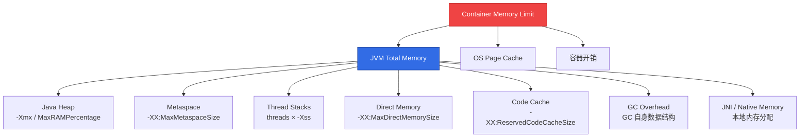

> **生产环境安全提示**
>
> 本文档包含可直接执行的运维命令。执行前请确认：当前目标集群与 Namespace 是否正确；是否具备足够的 RBAC 权限；是否已在非生产环境验证。命令风险等级标注：🔴 高风险（可能造成数据丢失或服务中断）、🟡 中风险（会修改集群状态，但通常可回滚）、🟢 低风险/只读（信息收集，无副作用）。


# JVM GC 容器调优深度指南

> **适用版本**: JDK 21 (LTS) / JDK 17 (LTS) / OpenJDK HotSpot  
> **最后更新**: 2026-04-30  
> **难度**: 高级

---

<!-- chunk: 📋 目录 -->
## 📋 目录

- [一、JVM 内存模型与容器化](#一jvm-内存模型与容器化)
- [二、GC 算法全景对比](#二gc-算法全景对比)
- [三、G1GC 容器调优](#三g1gc-容器调优)
- [四、ZGC 低延迟调优](#四zgc-低延迟调优)
- [五、ShenandoahGC 调优](#五shenandoahgc-调优)
- [六、容器感知参数详解](#六容器感知参数详解)
- [七、GC 日志与监控集成](#七gc-日志与监控集成)
- [八、[[Prometheus|Prometheus]] + JMX Exporter 监控](#八prometheus--jmx-exporter-监控)
- [九、生产级调优案例](#九生产级调优案例)
- [十、GC 问题排查手册](#十gc-问题排查手册)

---

<!-- chunk: 一、JVM 内存模型与容器化 -->
## 一、JVM 内存模型与容器化

### 1.1 JVM 内存组成



### 1.2 容器内存分配公式

```
Container Limit = JVM Heap + Metaspace + Thread Stacks + Direct Memory
                + Code Cache + GC Overhead + Native + Container Overhead

经验公式:
  Container Limit ≈ JVM Heap × 1.5 ~ 2.0

详细计算:
  Container Limit = Heap
                  + 256MB (Metaspace, 默认上限 256MB)
                  + threads × 1MB (Thread Stack, 默认 -Xss=1M)
                  + MaxDirectMemorySize (NIO 应用)
                  + 240MB (Code Cache, 默认)
                  + 50MB (GC Overhead)
                  + 100MB (其他 Native)
                  + 50MB (Container Overhead)

示例: 1Gi Limit, 8 threads
  Heap = 1Gi - 256M - 8M - 240M - 50M - 100M - 50M ≈ 338MB
  使用 MaxRAMPercentage=75.0 → Heap = 768MB (更精确)
```

### 1.3 JDK 版本容器支持

| JDK 版本 | 容器感知 | 说明 |
|----------|---------|------|
| JDK 8u191+ | `+UseContainerSupport` (默认开启) | 基础 cgroup v1 支持 |
| JDK 11+ | 默认开启 | 完善 cgroup v1/v2 支持 |
| JDK 15+ | 完善改进 | 改进内存/CPU 感知精度 |
| JDK 21+ | 最佳支持 | cgroup v2、cgroups ns 优化 |

---

<!-- chunk: 二、GC 算法全景对比 -->
## 二、GC 算法全景对比

### 2.1 GC 算法选择决策树

```mermaid
graph TD
    A[选择 GC 算法] --> B{延迟要求?}
    B -->|< 10ms P99| C[ZGC / Shenandoah]
    B -->|10-100ms P99| D{堆大小?}
    B -->|> 100ms| E[Serial / Parallel]

    D -->|< 4GB| F[G1GC]
    D -->|4-32GB| G[G1GC (调优)]
    D -->|> 32GB| H[ZGC]

    C --> I{JDK 版本?}
    I -->|JDK 21+| J[ZGC Generationed<br/>推荐]
    I -->|JDK 17| K[ZGC / Shenandoah]

    style C fill:#22c55e,stroke:#166534,color:#fff
    style F fill:#326ce5,stroke:#1a3a8f,color:#fff
    style J fill:#a855f7,stroke:#6b21a8,color:#fff
```

### 2.2 GC 算法对比

| 特性 | Serial | Parallel | G1GC | ZGC | Shenandoah |
|------|--------|----------|------|-----|-----------|
| **目标** | 最小内存 | 最大吞吐 | 均衡 | 超低延迟 | 低延迟 |
| **STW 暂停** | 长 (数百ms) | 中 (数十ms) | 短 (~10-200ms) | 极短 (<1ms) | 极短 (<10ms) |
| **适用堆大小** | < 512MB | < 4GB | 4-32GB | 8MB-16TB | 4-64GB |
| **吞吐量** | 低 | 高 | 中-高 | 中-高 | 中-高 |
| **内存开销** | 最小 | 小 | ~10-20% | ~15-20% | ~10-15% |
| **JDK 版本** | 8+ | 8+ | 9+ (11+ 推荐) | 15+ (21+ 推荐) | 12+ |
| **K8s 适用场景** | Init Container | 批处理 | 通用业务 | 在线交易/支付 | 在线服务 |
| **CPU 开销** | 低 | 低 | 中 | 中-高 | 中 |

---

<!-- chunk: 三、G1GC 容器调优 -->
## 三、G1GC 容器调优

### 3.1 G1GC 工作原理

```
G1GC 堆布局:
┌──────┬──────┬──────┬──────┬──────┬──────┬──────┬──────┐
│ Eden │ Eden │ S1   │ Old  │ Old  │ Old  │ Huge │ Free │
│ Region│Region│Region│Region│Region│Region│Region│Region│
├──────┼──────┼──────┼──────┼──────┼──────┼──────┼──────┤
│      │      │      │      │      │      │      │      │
└──────┴──────┴──────┴──────┴──────┴──────┴──────┴──────┘
       ← Young Generation →  ←   Old Generation   →

GC 周期:
1. Young GC: 回收 Eden + Survivor (STW, 快速)
2. Concurrent Mark: 标记存活对象 (并发)
3. Mixed GC: 回收 Old + 部分 Eden (STW, 受控)
4. Full GC: 退化全堆回收 (STW, 应避免)
```

### 3.2 G1GC 推荐参数

```bash
# 通用 Spring Boot 应用 (1Gi Container Limit)
JAVA_OPTS="-XX:+UseContainerSupport \
           -XX:MaxRAMPercentage=75.0 \
           -XX:InitialRAMPercentage=50.0 \
           -XX:+UseG1GC \
           -XX:MaxGCPauseMillis=200 \
           -XX:G1HeapRegionSize=4M \
           -XX:InitiatingHeapOccupancyPercent=45 \
           -XX:G1MixedGCCountTarget=8 \
           -XX:G1MixedGCLiveThresholdPercent=85 \
           -XX:+G1UseAdaptiveIHOP \
           -XX:ParallelGCThreads=4 \
           -XX:ConcGCThreads=1"
```

### 3.3 G1GC 调优参数详解

| 参数 | 默认值 | 说明 | 调优建议 |
|------|-------|------|---------|
| `MaxGCPauseMillis` | 200ms | 目标最大暂停时间 | 根据延迟 SLA 设置 |
| `G1HeapRegionSize` | 自动 | Region 大小 (1/2/4/8/16/32MB) | 堆 4-8GB: 4M; 8-32GB: 8M |
| `InitiatingHeapOccupancyPercent` | 45 | 触发并发标记的堆占用百分比 | 增大可延迟标记, 减小可提前回收 |
| `G1MixedGCCountTarget` | 8 | Mixed GC 轮次数 | 增大可分散回收压力 |
| `G1MixedGCLiveThresholdPercent` | 85 | Region 存活比例阈值 | 降低可回收更多 Region |
| `ParallelGCThreads` | CPU 核数 | STW 阶段并行线程数 | 容器中建议 = CPU limit / 1000m |
| `ConcGCThreads` | ParallelGCThreads/4 | 并发标记线程数 | 建议 = ParallelGCThreads / 4 |

---

<!-- chunk: 四、ZGC 低延迟调优 -->
## 四、ZGC 低延迟调优

### 4.1 ZGC 工作原理

```
ZGC 特点:
- 基于 Region 的内存管理
- 着色指针 (Colored Pointers) + 读屏障 (Load Barrier)
- 几乎完全并发: 标记/转移/重定位均并发执行
- STW 时间与堆大小无关, 仅与根集合大小相关

JDK 21+ Generational ZGC:
┌──────────────────────────────────┐
│           ZGC Heap               │
│  ┌─────────┐  ┌──────────────┐  │
│  │ Young   │  │    Old       │  │
│  │ Regions │  │   Regions    │  │
│  └─────────┘  └──────────────┘  │
│                                  │
│  Young GC: 亚毫秒级 STW          │
│  Full GC:   < 1ms STW           │
└──────────────────────────────────┘
```

### 4.2 ZGC 推荐参数

```bash
# JDK 21+ Generational ZGC (推荐)
JAVA_OPTS="-XX:+UseContainerSupport \
           -XX:MaxRAMPercentage=75.0 \
           -XX:+UseZGC \
           -XX:+ZGenerational \
           -XX:SoftMaxHeapSize=512m \
           -XX:ZAllocationSpikeTolerance=2.0 \
           -XX:ConcGCThreads=2 \
           -XX:ParallelGCThreads=4"

# JDK 17 Single-Generation ZGC
JAVA_OPTS="-XX:+UseContainerSupport \
           -XX:MaxRAMPercentage=75.0 \
           -XX:+UseZGC \
           -XX:ZCollectionInterval=0 \
           -XX:ZAllocationSpikeTolerance=2.0 \
           -XX:SoftMaxHeapSize=512m"
```

### 4.3 ZGC 适用场景

```
✅ 推荐 ZGC:
├── 在线支付/交易 (P99 < 10ms)
├── 实时报价/行情推送
├── 交互式 API 网关
├── 游戏/IM 后端
├── 堆大小 > 16GB 的应用
└── 任何对 STW 敏感的在线服务

⚠️ 注意:
├── 吞吐量可能比 G1GC 低 5-15%
├── 内存开销比 G1GC 高 ~15-20%
├── JDK 21+ 的 Generational ZGC 显著改善
└── CPU 开销略高 (读屏障)
```

---

<!-- chunk: 五、ShenandoahGC 调优 -->
## 五、ShenandoahGC 调优

### 5.1 推荐参数

```bash
JAVA_OPTS="-XX:+UseContainerSupport \
           -XX:MaxRAMPercentage=75.0 \
           -XX:+UseShenandoahGC \
           -XX:ShenandoahGCMode=iu \
           -XX:ShenandoahGuaranteedGCInterval=30000 \
           -XX:ConcGCThreads=2 \
           -XX:ParallelGCThreads=4"
```

### 5.2 Shenandoah vs ZGC

| 特性 | ZGC (JDK 21+) | Shenandoah (JDK 21+) |
|------|---------------|---------------------|
| **最大暂停** | < 1ms | < 10ms |
| **实现方式** | 着色指针 + 读屏障 | Brooks Pointer + 读/写屏障 |
| **分代支持** | Generational (JDK 21+) | Generational (JDK 22+) |
| **最大堆** | 16TB | 4TB |
| **JDK 包含** | Oracle OpenJDK | Red Hat OpenJDK |
| **压缩指针** | 支持 (6TB 限制) | 支持 |
| **推荐场景** | 极低延迟 | 低延迟 + Red Hat 生态 |

---

<!-- chunk: 六、容器感知参数详解 -->
## 六、容器感知参数详解

### 6.1 核心参数

| 参数 | JDK 21 默认值 | 说明 |
|------|-------------|------|
| `+UseContainerSupport` | 开启 | 启用 cgroup 感知 |
| `MaxRAMPercentage` | 25.0 | 最大堆占容器内存百分比 |
| `InitialRAMPercentage` | 25.0 | 初始堆占容器内存百分比 |
| `MinRAMPercentage` | 25.0 | 最小堆占容器内存百分比 |
| `ActiveProcessorCount` | 自动检测 | 覆盖检测到的 CPU 核数 |

### 6.2 MaxRAMPercentage 设置建议

```
容器中仅运行 JVM:
  MaxRAMPercentage = 75.0  (推荐默认)
  Heap = 1Gi × 0.75 = 768MB

容器中运行 JVM + Sidecar:
  MaxRAMPercentage = 60.0
  Heap = 1Gi × 0.60 = 614MB

容器中运行 JVM + 多个辅助进程:
  MaxRAMPercentage = 50.0
  Heap = 1Gi × 0.50 = 512MB
```

### 6.3 ActiveProcessorCount 调整

```yaml
# 当 CPU limit 设置为小数时, JVM 可能检测不准确
# 如 cpu limit=500m, JVM 可能检测为 1 核 (正确)
# 如 cpu limit=200m, GC 线程数过多

env:
  - name: JAVA_OPTS
    value: >-
      -XX:+UseContainerSupport
      -XX:ActiveProcessorCount=2
      -XX:ParallelGCThreads=2
      -XX:ConcGCThreads=1
```

---

<!-- chunk: 七、GC 日志与监控集成 -->
## 七、GC 日志与监控集成

### 7.1 GC 日志配置

```bash
# JDK 11+ 统一日志框架
JAVA_OPTS="$JAVA_OPTS \
  -Xlog:gc*:stdout:time,level,tags \
  -Xlog:gc+heap=debug:stdout \
  -Xlog:gc+phases=debug:stdout"

# 生产级 GC 日志 (输出到 stdout, 被 K8s 日志收集)
JAVA_OPTS="$JAVA_OPTS \
  -Xlog:gc*:stdout:time,uptime,level,tags \
  -Xlog:gc+heap+exit:stdout \
  -Xlog:gc+ergo*=trace:stdout"

# 也可以输出到文件 (需要挂载卷)
JAVA_OPTS="$JAVA_OPTS \
  -Xlog:gc*:file=/tmp/gc.log:time,level,tags:filecount=5,filesize=10M"
```

### 7.2 关键 GC 日志解析

```
# Young GC
[2026-04-30T10:15:30.123+0800][gc,start    ] GC(42) Pause Young (G1 Evacuation Pause)
[2026-04-30T10:15:30.156+0800][gc,heap      ] GC(42) Eden regions: 24->0(24)
[2026-04-30T10:15:30.156+0800][gc,heap      ] GC(42) Survivor regions: 2->3(3)
[2026-04-30T10:15:30.156+0800][gc,heap      ] GC(42) Old regions: 45->45
[2026-04-30T10:15:30.156+0800][gc,cpu       ] GC(42) User=0.08s Sys=0.01s Real=0.03s
[2026-04-30T10:15:30.156+0800][gc           ] GC(42) Pause Young (G1 Evacuation Pause) 256M->128M(768M) 33.456ms

# Full GC (应避免)
[2026-04-30T10:20:00.123+0800][gc,start    ] GC(100) Pause Full (G1 Compaction Pause)
[2026-04-30T10:20:00.456+0800][gc           ] GC(100) Pause Full (G1 Compaction Pause) 700M->200M(768M) 333.123ms
```

---

<!-- chunk: 八、Prometheus + JMX Exporter 监控 -->
## 八、Prometheus + JMX Exporter 监控

### 8.1 JMX Exporter Java Agent 配置

```yaml
# jmx-exporter-config.yaml
lowercaseOutputName: true
lowercaseOutputLabelNames: true
rules:
  - pattern: "java.lang<type=Memory><HeapMemoryUsage>used"
    name: jvm_heap_used_bytes
    type: GAUGE
    labels:
      area: "heap"
  - pattern: "java.lang<type=Memory><HeapMemoryUsage>max"
    name: jvm_heap_max_bytes
    type: GAUGE
  - pattern: "java.lang<type=Memory><NonHeapMemoryUsage>used"
    name: jvm_nonheap_used_bytes
    type: GAUGE
  - pattern: "java.lang<type=GarbageCollector, name=(.*)><>CollectionTime"
    name: jvm_gc_collection_seconds_sum
    type: COUNTER
    labels:
      gc: "$1"
  - pattern: "java.lang<type=GarbageCollector, name=(.*)><>CollectionCount"
    name: jvm_gc_collection_seconds_count
    type: COUNTER
    labels:
      gc: "$1"
  - pattern: "java.lang<type=Threading><>ThreadCount"
    name: jvm_threads_current
    type: GAUGE
  - pattern: "java.lang<type=MemoryPool, name=(.*)><Usage>used"
    name: jvm_memory_pool_used_bytes
    type: GAUGE
    labels:
      pool: "$1"
```

### 8.2 K8s 部署 JMX Exporter

```yaml
apiVersion: apps/v1
kind: Deployment
metadata:
  name: spring-app
spec:
  template:
    spec:
      initContainers:
        - name: download-jmx-exporter
          image: busybox:1.36
          command:
            - sh
            - -c
            - |
              wget -O /jmx/jmx_prometheus_javaagent.jar \
                https://repo1.maven.org/maven2/io/prometheus/jmx/jmx_prometheus_javaagent/0.20.0/jmx_prometheus_javaagent-0.20.0.jar
          volumeMounts:
            - name: jmx-exporter
              mountPath: /jmx
      containers:
        - name: app
          image: registry.example.com/spring-app:v1.0.0
          env:
            - name: JAVA_TOOL_OPTIONS
              value: "-javaagent:/jmx/jmx_prometheus_javaagent.jar=9404:/config/jmx-exporter-config.yaml"
          volumeMounts:
            - name: jmx-exporter
              mountPath: /jmx
            - name: jmx-config
              mountPath: /config
          ports:
            - name: jmx-metrics
              containerPort: 9404
      volumes:
        - name: jmx-exporter
          emptyDir: {}
        - name: jmx-config
          configMap:
            name: jmx-exporter-config
```

### 8.3 关键 GC 告警规则

```yaml
apiVersion: monitoring.coreos.com/v1
kind: PrometheusRule
metadata:
  name: jvm-gc-alerts
spec:
  groups:
    - name: jvm.gc.rules
      rules:
        - alert: JVMGCFrequentFullGC
          expr: rate(jvm_gc_collection_seconds_count{gc=~"G1 Old Generation|ZGC|Shenandoah Cycles"}[5m]) > 0.05
          for: 5m
          labels:
            severity: warning
          annotations:
            summary: "JVM Full GC 频繁 ({{ $labels.pod }})"
            description: "Full GC 频率 {{ $value }} 次/秒，超过阈值 0.05 次/秒"

        - alert: JVMGCPauseTooLong
          expr: rate(jvm_gc_collection_seconds_sum[5m]) / rate(jvm_gc_collection_seconds_count[5m]) > 0.5
          for: 5m
          labels:
            severity: warning
          annotations:
            summary: "JVM GC 平均暂停时间过长 ({{ $labels.pod }})"
            description: "GC 平均暂停时间 {{ $value }}s，超过阈值 0.5s"

        - alert: JVMHeapUsageHigh
          expr: jvm_heap_used_bytes / jvm_heap_max_bytes > 0.85
          for: 10m
          labels:
            severity: warning
          annotations:
            summary: "JVM 堆使用率过高 ({{ $labels.pod }})"
            description: "堆使用率 {{ $value | humanizePercentage }}，超过 85%"
```

---

<!-- chunk: 九、生产级调优案例 -->
## 九、生产级调优案例

### 9.1 案例: Spring Boot API 服务

```
场景: Spring Boot 3.4 REST API 服务
规格: 1Gi Memory Limit / 500m CPU Limit / 8 线程

问题: 偶发性 P99 延迟飙高 (>500ms)

诊断:
  - GC 日志显示 G1 Mixed GC 暂停 80-150ms
  - 堆使用率长期 >75%
  - promotion failure 导致 Full GC

调优方案:
  # Before
  -Xmx768m -XX:+UseG1GC

  # After
  -XX:+UseContainerSupport
  -XX:MaxRAMPercentage=75.0
  -XX:+UseG1GC
  -XX:MaxGCPauseMillis=100
  -XX:G1HeapRegionSize=4M
  -XX:InitiatingHeapOccupancyPercent=40
  -XX:G1MixedGCCountTarget=12
  -XX:G1MixedGCLiveThresholdPercent=80
  -XX:ParallelGCThreads=2
  -XX:ConcGCThreads=1

  # 或切换到 ZGC (延迟要求极高时)
  -XX:+UseContainerSupport
  -XX:MaxRAMPercentage=70.0
  -XX:+UseZGC
  -XX:+ZGenerational

结果: P99 从 500ms → 80ms (G1) / 30ms (ZGC)
```

### 9.2 案例: 批处理任务 (K8s Job)

```
场景: Spring Batch 数据处理 Job
规格: 4Gi Memory / 2000m CPU

需求: 最大吞吐量, 可接受较长 GC 暂停

调优:
  -XX:+UseContainerSupport
  -XX:MaxRAMPercentage=80.0
  -XX:+UseParallelGC
  -XX:ParallelGCThreads=4

  Parallel GC 专注于吞吐量, 不关心暂停时间
  适合批处理等非交互式任务
```

---

<!-- chunk: 十、GC 问题排查手册 -->
## 十、GC 问题排查手册

### 10.1 常见 GC 问题速查

| 症状 | 可能原因 | 诊断命令 | 解决方案 |
|------|---------|---------|---------|
| Full GC 频繁 | 堆不足/内存泄漏 | `jcmd <pid> GC.heap_info` | 增大堆或修复泄漏 |
| GC 暂停长 | 大堆/G1 Mixed GC | 分析 GC 日志 | 切换 ZGC 或调优 G1 |
| CPU 100% | GC 线程过多 | `top -H -p <pid>` | 减少 GC 线程数 |
| Metaspace OOM | 类加载泄漏 | `jcmd <pid> VM.classloader_stats` | 增大 Metaspace |
| 直接内存 OOM | NIO Buffer 泄漏 | `jcmd <pid> VM.native_memory` | 检查 DirectBuffer 使用 |

### 10.2 K8s 中 GC 诊断

> ⚠️ **🟡 中危变更** — 变更集群资源状态，建议先 --dry-run 或 diff 确认
> - `kubectl exec`：进入容器执行命令，可能改变容器状态

``` bash
# 🟡 中风险：会修改集群/资源状态，执行前请确认目标、影响范围与授权
# 查看 GC 概况
kubectl exec deployment/spring-app -- \
  jcmd 1 GC.heap_info

# 查看 GC 统计
kubectl exec deployment/spring-app -- \
  jcmd 1 GC.info

# 生成 Heap Dump
kubectl exec deployment/spring-app -- \
  jcmd 1 GC.heap_dump /tmp/heapdump.hprof

# 复制 Heap Dump 到本地
kubectl cp deployment/spring-app:/tmp/heapdump.hprof ./heapdump.hprof

# 查看 Native Memory (需要 JDK 启动时添加 -XX:NativeMemoryTracking=summary)
kubectl exec deployment/spring-app -- \
  jcmd 1 VM.native_memory summary

# 线程 Dump
kubectl exec deployment/spring-app -- \
  jcmd 1 Thread.print -l
```
---

<!-- chunk: 📊 GC 选型速查卡 -->
## 📊 GC 选型速查卡

| 场景 | 推荐 GC | 关键参数 |
|------|---------|---------|
| 通用 Spring Boot | G1GC | `MaxRAMPercentage=75.0, MaxGCPauseMillis=200` |
| 低延迟 API | ZGC (JDK 21+) | `+UseZGC, +ZGenerational, MaxRAMPercentage=70.0` |
| 批处理 Job | ParallelGC | `MaxRAMPercentage=80.0, ParallelGCThreads=4` |
| 内存敏感 (< 512MB) | SerialGC | `MaxRAMPercentage=75.0` (Init Container) |
| 大堆 (16GB+) | ZGC | `+UseZGC, +ZGenerational` |
| Sidecar 共存 | G1GC | `MaxRAMPercentage=60.0` |

---

<!-- chunk: 🔗 相关文档 -->
## 🔗 相关文档

- [Java 容器化最佳实践](32-发布/package/2026-07-02_18-29/corpus/peripheral/domain-13-container-runtime/01-docker/10-java-containerization-guide.md) — 容器构建
- [Spring Boot on K8s](32-发布/package/2026-07-02_18-29/corpus/supporting/domain-02-workloads-applications/00-core-workloads/08-spring-boot-kubernetes-guide.md) — Spring Boot 部署
- [Java 可观测性](32-发布/package/2026-07-02_18-29/corpus/supporting/domain-06-observability/01-overview/12-java-observability-kubernetes-guide.md) — 监控告警
- [OOM 诊断](32-发布/package/2026-07-02_18-29/profiles/sre/corpus/supporting/domain-10-troubleshooting-diagnostics/00-core-troubleshooting/01-oom-memory-diagnosis.md) — 内存问题诊断
- [性能瓶颈排查](32-发布/package/2026-07-02_18-29/profiles/sre/corpus/core/domain-10-troubleshooting-diagnostics/02-infrastructure-troubleshooting/06-performance-bottleneck-troubleshooting.md) — 性能分析

---

<!-- chunk: Obsidian 相关文档 -->
## Obsidian 相关文档

- domain-10-troubleshooting-diagnostics KUDIG Database — Global MOC
- [[domain-10-troubleshooting-diagnostics/README.md|Domain-12 故障排查 (Troubleshooting)]]
- Domain-12 故障排查 — 开源项目索引
- [[domain-10-troubleshooting-diagnostics/核心排障/01-control-plane-apiserver-troubleshooting.md|API Server 故障排查]]
- [[domain-10-troubleshooting-diagnostics/核心排障/02-control-plane-etcd-troubleshooting.md|etcd 故障排查]]
- [[domain-10-troubleshooting-diagnostics/核心排障/03-networking-cni-troubleshooting.md|CNI 网络插件故障排查]]
- [[domain-10-troubleshooting-diagnostics/核心排障/04-storage-csi-troubleshooting.md|CSI 存储驱动故障排查]]
- [[01-pod-pending-diagnosis|Pod Pending 状态深度诊断]]
- [[domain-10-troubleshooting-diagnostics/核心排障/06-node-notready-diagnosis.md|Node NotReady 状态深度诊断]]
- [[32-发布/package/2026-07-02_18-29/profiles/sre/corpus/supporting/domain-10-troubleshooting-diagnostics/00-core-troubleshooting/01-oom-memory-diagnosis|OOM 和内存问题诊断]]
- [[32-发布/package/2026-07-02_18-29/profiles/sre/corpus/core/domain-10-troubleshooting-diagnostics/00-core-troubleshooting/07-pod-comprehensive-troubleshooting|Pod 全面故障排查]]
- [[32-发布/package/2026-07-02_18-29/profiles/sre/corpus/core/domain-10-troubleshooting-diagnostics/01-resource-troubleshooting/01-node-comprehensive-troubleshooting|Node 全面故障排查]]
- [[domain-10-troubleshooting-diagnostics/FTA故障树/list/apiserver-fta.md|API Server 异常故障树分析]]
- [[domain-10-troubleshooting-diagnostics/FTA故障树/list/backup-restore-fta.md|备份/恢复异常故障树分析]]
- [[domain-10-troubleshooting-diagnostics/FTA故障树/list/calico-fta.md|calico FTA 树：Calico CNI 故障诊断]]

## See Also

- [[32-发布/package/2026-07-02_18-29/profiles/sre/corpus/core/domain-10-troubleshooting-diagnostics/03-advanced-troubleshooting/08-kind-k3s-single-node-troubleshooting|44-kind-k3s-single-node-troubleshooting]]
- [[32-发布/package/2026-07-02_18-29/profiles/sre/corpus/supporting/domain-10-troubleshooting-diagnostics/04-jvm-tuning/02-java-performance-resource-sizing-guide|99-java-performance-resource-sizing-guide]]
- [[domain-10-troubleshooting-diagnostics/SUMMARY.md|SUMMARY]]
- [[domain-10-troubleshooting-diagnostics/核心排障/01-control-plane-apiserver-troubleshooting.md|01-control-plane-apiserver-troubleshooting]]


<!-- risk-assessed -->
