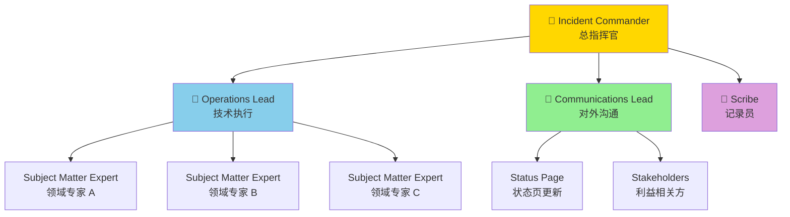
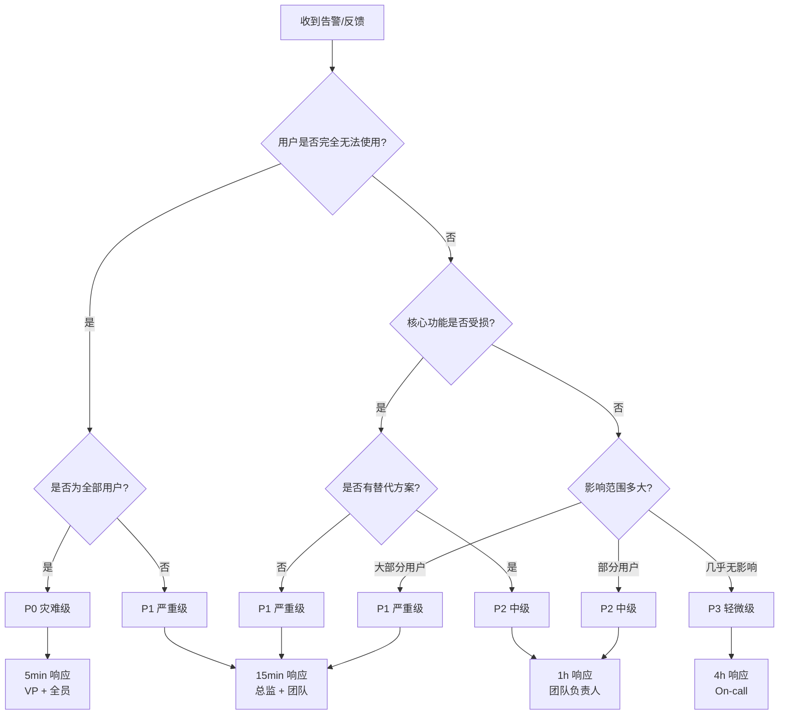
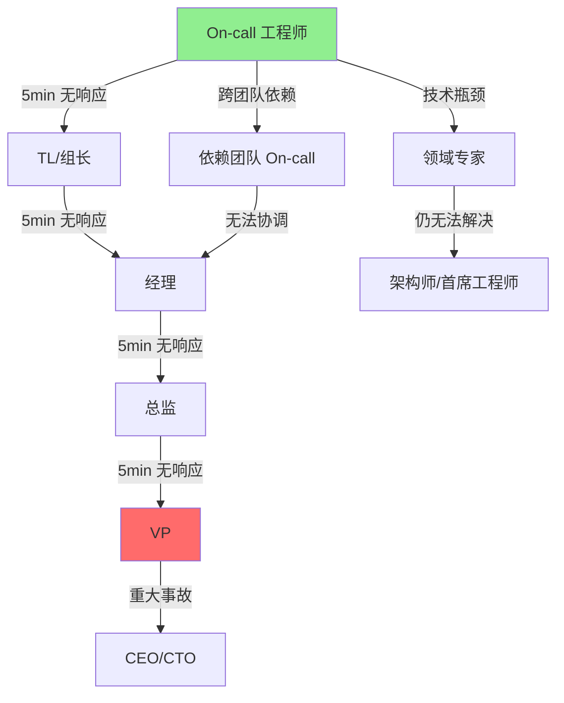

> **生产环境安全提示**
>
> 本文档包含可直接执行的运维命令。执行前请确认：当前目标集群与 Namespace 是否正确；是否具备足够的 RBAC 权限；是否已在非生产环境验证。命令风险等级标注：🔴 高风险（可能造成数据丢失或服务中断）、🟡 中风险（会修改集群状态，但通常可回滚）、🟢 低风险/只读（信息收集，无副作用）。


# 事故指挥系统

> **核心原则**: 事故响应不是比谁技术更强，而是比谁组织得更好。清晰的指挥结构、明确的角色分工、标准化的沟通协议，是将混乱的问题现场转变为有序恢复行动的关键。

## ICS 概述

**ICS (Incident Command System)** 起源于美国野火消防指挥体系，现被 Google、Netflix、AWS 等科技公司广泛应用于 IT 事故响应。

ICS 的核心价值:
- **统一指挥**: 避免多人同时决策的混乱
- **角色清晰**: 每个人知道自己该做什么、不该做什么
- **可扩展**: 从小事故到大规模问题都能适用
- **标准化**: 跨团队、跨公司的一致响应方式

## ICS 核心角色定义和职责

### 角色总览



### Incident Commander (IC) — 事故指挥官

**职责**:
- 掌握事故全局状态，做出关键决策
- 分配资源，协调各角色工作
- 决定是否升级、降级或宣布事故结束
- 对恢复时间和决策负责

**权力**:
- 可以调用任何需要的资源
- 可以中止任何可能加剧事故的操作
- 可以要求任何人员加入或离开事故处理
- 可以决定回滚、切流或启用降级方案

**不适合当 IC 的情况**:
- 深度参与技术排查时 (应转交给他人)
- 情绪不稳定或过度疲劳时
- 对当前系统缺乏基本了解时

**IC 轮换**:
```
IC 工作 > 1 小时后应考虑轮换
IC 同时兼任 Operations Lead > 30 分钟应考虑分离角色
```

### Operations Lead (OL) — 技术执行负责人

**职责**:
- 领导技术排查和修复工作
- 管理所有技术专家的介入
- 向 IC 汇报技术进展和可选方案
- 评估修复方案的风险和影响

**与 IC 的区别**:
| 维度 | IC | OL |
|------|-----|-----|
| 关注点 | 全局决策、资源协调 | 技术细节、修复执行 |
| 汇报方向 | 向上 (管理层、客户) | 向 IC 汇报 |
| 权力 | 做决策 | 提方案 |
| 工作方式 | 听汇报、做判断 | 查日志、执行命令 |

### Communications Lead (CL) — 沟通负责人

**职责**:
- 维护内部沟通渠道 (Slack/钉钉/邮件)
- 更新外部状态页 (Status Page)
- 向利益相关方发送定时更新
- 管理媒体/大客户沟通 (重大事故)

**沟通节奏**:
```
P0 事故: 每 15 分钟更新一次
P1 事故: 每 30 分钟更新一次
P2 事故: 每 1 小时更新一次
P3 事故: 每 4 小时更新一次
```

### Scribe — 记录员

**职责**:
- 实时记录时间线 (Timeline)
- 记录所有关键决策和理由
- 记录尝试过的方案和结果
- 为事后复盘提供完整素材

**记录格式**:
```
[2026-05-21 14:32:00] 告警触发: order-service 错误率 > 5%
[2026-05-21 14:33:15] on-call 工程师 ack 告警，开始排查
[2026-05-21 14:35:00] 发现数据库连接池耗尽
[2026-05-21 14:36:30] IC 决定: 临时扩容连接池
[2026-05-21 14:38:00] 连接池扩容完成，错误率开始下降
[2026-05-21 14:40:00] 错误率恢复正常 (< 0.1%)
```

### Subject Matter Expert (SME) — 领域专家

**职责**:
- 在特定领域提供深度技术支持
- 执行 OL 分配的具体排查任务
- 不参与全局决策，专注技术执行

**常见 SME 类型**:
- 数据库专家
- 网络专家
- K8s 基础设施专家
- 应用开发专家
- 安全专家

### 小型事故的简化角色

```
2 人模式:
  - Person A: IC + CL (负责决策和沟通)
  - Person B: OL + Scribe (负责技术执行和记录)

1 人模式 (仅限 P3 轻微事故):
  - 单人处理，事后补记录
  - 如果 15 分钟内无法解决，立即呼叫支援
```

## 事件严重度分级标准

### P0 — 灾难级 (Critical)

| 项目 | 定义 |
|------|------|
| **影响范围** | 核心服务完全不可用，或全部用户受影响 |
| **业务影响** | 收入直接损失，品牌严重受损 |
| **示例** | 支付系统全挂、全站 500、数据库主库不可用且无备份 |
| **响应时间** | 5 分钟内 |
| **通知范围** | VP + 全员 + 客户通知 |
| **IC 要求** | 必须指定专职 IC |
| **沟通频率** | 每 15 分钟 |
| **升级条件** | 立即升级，无缓冲 |

### P1 — 严重级 (Major)

| 项目 | 定义 |
|------|------|
| **影响范围** | 核心功能严重受损，大部分用户受影响 |
| **业务影响** | 部分收入损失，用户体验严重下降 |
| **示例** | 核心 API 错误率 > 10%、下单功能异常、数据不一致 |
| **响应时间** | 15 分钟内 |
| **通知范围** | 总监 + 相关团队 + 关键客户 |
| **IC 要求** | 建议指定 IC |
| **沟通频率** | 每 30 分钟 |
| **升级条件** | 30 分钟内无进展则升级 |

### P2 — 中级 (Moderate)

| 项目 | 定义 |
|------|------|
| **影响范围** | 非核心功能受损，部分用户受影响 |
| **业务影响** | 用户体验下降，有替代方案 |
| **示例** | 报表生成延迟、非核心功能不可用、单可用区问题 |
| **响应时间** | 1 小时内 |
| **通知范围** | 团队负责人 + 相关工程师 |
| **IC 要求** | OL 可兼任 IC |
| **沟通频率** | 每 1 小时 |
| **升级条件** | 2 小时内无进展则升级 |

### P3 — 轻微级 (Minor)

| 项目 | 定义 |
|------|------|
| **影响范围** | 轻微影响，几乎没有用户感知 |
| **业务影响** | 可延迟处理，无即时业务影响 |
| **示例** | 监控误告警、日志异常、性能轻微下降 |
| **响应时间** | 4 小时内 |
| **通知范围** | On-call 工程师 |
| **IC 要求** | 无需 IC |
| **沟通频率** | 每日一次 |
| **升级条件** | 当天未解决则升级 |

### P4 — 信息级 (Informational)

| 项目 | 定义 |
|------|------|
| **影响范围** | 无直接影响，需关注 |
| **业务影响** | 无 |
| **示例** | 安全公告、容量预警、版本升级提醒 |
| **响应时间** | 下个工作日 |
| **通知范围** | 相关团队邮件列表 |
| **IC 要求** | 无需 |
| **沟通频率** | 无需 |
| **升级条件** | 若演变为实际问题则升级 |

### 严重度快速判断流程



## 事故响应流程

### 阶段 1: 发现与确认 (0-5 分钟)

```
1. 告警触发或用户反馈
2. On-call 工程师确认问题真实性
   - 排除误告警
   - 确认影响范围
3. 评估严重度 (P0-P3)
4. 创建事故频道/群组
5. 如果 P0/P1，立即呼叫 IC
```

### 阶段 2: 响应与组织 (5-15 分钟)

```
1. 指定 IC (P0/P1 必须)
2. IC 确认角色分工
3. OL 开始技术排查
4. Scribe 开始记录时间线
5. CL 发送首次状态更新
6. 建立战时沟通频道
```

### 阶段 3: 排查与修复 (15 分钟至恢复)

```
1. OL 组织 SME 分头排查
2. 每 15-30 分钟向 IC 汇报进展
3. IC 评估修复方案，做出决策
4. 执行修复方案
5. Scribe 记录所有尝试和结果
6. CL 持续更新状态
```

### 阶段 4: 验证与恢复 (修复后)

```
1. 确认系统恢复正常
2. 监控关键指标 15-30 分钟
3. 确认无次生问题
4. IC 宣布事故结束
5. 保留战时频道 (设为只读)
```

### 阶段 5: 事后复盘 (24-72 小时内)

```
1. 整理完整时间线
2. 召开无责复盘会议
3. 输出事后分析报告
4. 制定行动项并跟踪
```

## 通信模板

### Slack / 钉钉 事故频道模板

```
━━━━━━━━━━━━━━━━━━━━━━
🚨 事故通告: INC-2026-0521-001
━━━━━━━━━━━━━━━━━━━━━━

状态: 🔴 进行中
严重度: P1
影响: 订单服务延迟增加，约 30% 用户受影响
开始时间: 2026-05-21 14:32 CST
当前进展: 已定位根因为数据库连接池耗尽，正在扩容
ETA: 15:30 CST

角色:
  IC: @alice
  OL: @bob
  CL: @charlie
  Scribe: @dave

沟通频道: #incident-2026-0521-001
状态页: https://status.company.com/incidents/001

━━━━━━━━━━━━━━━━━━━━━━
```

### 状态更新模板 (每 30 分钟)

```
━━━━━━━━━━━━━━━━━━━━━━
📢 状态更新: INC-2026-0521-001 [14:45]
━━━━━━━━━━━━━━━━━━━━━━

状态: 🟡 缓解中

更新内容:
  - 14:35 确认数据库连接池达到上限 (1000/1000)
  - 14:36 决定将连接池上限临时扩至 2000
  - 14:40 连接池扩容完成，新请求可正常建立连接
  - 14:45 错误率从 15% 降至 2%，持续下降中

下一步:
  - 继续监控至错误率 < 0.1%
  - 分析连接泄漏根因

预计恢复: 15:00 CST
━━━━━━━━━━━━━━━━━━━━━━
```

### 邮件通知模板 (管理层/客户)

```
主题: [状态更新] 订单服务性能异常 - INC-2026-0521-001

各位同事/客户:

我们监测到订单服务于 2026-05-21 14:32 CST 出现延迟增加的情况，
约 30% 的用户受到影响。

【当前状态】
- 问题已定位: 数据库连接池达到上限
- 缓解措施: 已扩容连接池
- 当前错误率: 2% (峰值 15%)
- 预计完全恢复: 15:00 CST

【影响范围】
- 受影响功能: 订单提交、订单查询
- 不受影响功能: 商品浏览、用户登录、支付回调

【我们的行动】
- 已扩充数据库连接池
- 正在分析连接泄漏根因
- 将在完全恢复后发布详细报告

如有疑问请联系: sre@company.com

状态页: https://status.company.com
━━━━━━━━━━━━━━━━━━━━━━
此邮件由系统自动发送
```

### 事故结束通告模板

```
━━━━━━━━━━━━━━━━━━━━━━
✅ 事故结束: INC-2026-0521-001
━━━━━━━━━━━━━━━━━━━━━━

状态: 已解决
持续时间: 14:32 - 15:05 (33 分钟)

总结:
  根因: 数据库连接池配置未随流量增长而调整
  触发: 大促预热流量突增
  影响: 约 30% 用户订单操作延迟或失败
  恢复: 扩容连接池并释放泄漏连接

事后复盘: 2026-05-22 10:00
复盘文档: https://wiki/postmortems/INC-2026-0521-001

感谢所有参与响应的同事！
━━━━━━━━━━━━━━━━━━━━━━
```

## 升级路径和时间要求

### 升级路径图



### 升级时间要求表

| 严重度 | 首次响应 | IC 到位 | 升级 TL | 升级经理 | 升级总监 | 升级 VP |
|--------|---------|---------|---------|---------|---------|---------|
| **P0** | 5 min | 10 min | 10 min | 15 min | 20 min | 30 min |
| **P1** | 15 min | 20 min | 20 min | 30 min | 45 min | 60 min |
| **P2** | 60 min | 90 min | 2 h | 4 h | 8 h | N/A |
| **P3** | 4 h | N/A | 8 h | 24 h | N/A | N/A |

### 升级触发条件

```
自动升级条件:
  - On-call 未 ack 告警 (5 分钟)
  - 事故持续超过严重度对应时间
  - 技术排查遇到无法突破的瓶颈
  - 需要跨团队协调但无法推动
  - 客户/高层主动询问
  - 媒体/社交媒体出现负面报道

升级方式:
  - 电话 > 短信 > 邮件 (优先级)
  - 使用 PagerDuty/OpsGenie 自动升级链
  - 紧急情况下可直接呼叫任何人
```

### 升级通知模板

```
🚨 升级通知

事故: INC-2026-0521-001
当前严重度: P1
已持续时间: 45 分钟

升级原因: 技术排查遇到瓶颈，数据库专家需要协助

当前状态:
  - 数据库连接池已扩容，错误率降至 2%
  - 但发现存在连接泄漏，无法确定泄漏源
  - 需要数据库团队深度介入

请 @db-team-lead 立即加入 #incident-2026-0521-001
```

## 战时会议纪律和沟通协议

### 战时频道规则

```
1. 频道命名: #incident-YYYYMMDD-NNN
2. 只有 IC 可以宣布决定
3. 只有 OL 可以协调技术排查
4. 只有 CL 可以对外发布信息
5. 无关人员禁止发言 (可阅读但保持安静)
6. 所有技术发现使用固定格式汇报
```

### 技术汇报格式

```
【发现汇报】
排查人: @bob
排查方向: 数据库连接池
发现: 当前连接数 1000/1000，等待队列 200+
结论: 连接池耗尽，但原因不明 (泄漏 or 配置过小)
下一步: 查看连接来源分布
需要帮助: 需要数据库专家协助分析连接来源
```

```
【方案建议】
建议人: @alice
方案: 临时将连接池上限从 1000 扩至 2000
风险: 可能掩盖真实根因，需后续跟进
预计效果: 立即缓解，给排查争取时间
回滚方案: 将配置改回 1000

IC 决策: ✅ 同意执行，Scribe 记录
```

```
【状态更新】
汇报人: @bob
时间: 14:45
进展: 连接池扩容完成，错误率从 15% 降至 2%
异常: 无
下一步: 继续监控 15 分钟，同时排查泄漏根因
```

### 沟通禁忌

```
❌ 禁忌:
  - "是谁改的代码？" (追责语气)
  - "这个方案肯定不行" (无建设性否定)
  - "我之前说过会出问题" (事后诸葛亮)
  - 在公共频道争吵技术方案
  - 未经 IC 同意擅自执行变更
  - 在事故未结束前讨论"是谁的责任"
  - 使用 "应该没问题" 这类模糊表述

✅ 正确做法:
  - "我们先做 X，同时排查 Y"
  - "我测试了 A 方案，结果是这样的..."
  - "建议尝试 B 方案，因为..."
  - 所有方案先报 IC 决策
  - 所有操作先声明再执行
  - 使用明确的数据和事实
```

### 战时会议节奏

```
P0/P1 事故同步会 (每 15-30 分钟):
  参与者: IC, OL, 所有 SME
  时长: 2-5 分钟
  议程:
    1. 当前状态 (30 秒)
    2. 各方向进展 (每人 30 秒)
    3. IC 决策下一步 (1 分钟)
    4. 确认无阻塞 (30 秒)

P2 事故同步会 (每 1 小时):
  参与者: IC/OL, 相关 SME
  时长: 5-10 分钟

会议规则:
  - 站着开 (保持简短)
  - 只允许一个人说话
  - 有结论立即散会
  - 不需要的 SME 可以退出
```

### 交接协议

```
IC 交接:
  1. 原 IC 向新 IC 口头同步:
     - 事故背景和影响
     - 已尝试的方案和结果
     - 当前正在进行的排查方向
     - 待决策的事项
  2. 在频道中宣布 IC 变更
  3. 原 IC 保持在线 15 分钟，回答追问

OL 交接:
  1. 技术状态同步 (同 IC)
  2. 移交所有排查中的终端/日志
  3. 确认新 OL 有所有系统的访问权限

Scribe 交接:
  1. 移交时间线文档
  2. 确认记录格式一致
```

## 工具与平台

### 事故管理工具对比

| 工具 | 告警管理 | 事故频道 | 状态页 | 时间线 | 事后复盘 |
|------|---------|---------|--------|--------|---------|
| **PagerDuty** | ⭐⭐⭐ | ⭐⭐ | ⭐⭐⭐ | ⭐⭐ | ⭐⭐ |
| **OpsGenie** | ⭐⭐⭐ | ⭐⭐ | ⭐⭐ | ⭐⭐ | ⭐⭐ |
| **Incident.io** | ⭐⭐ | ⭐⭐⭐ | ⭐⭐⭐ | ⭐⭐⭐ | ⭐⭐⭐ |
| **FireHydrant** | ⭐⭐ | ⭐⭐⭐ | ⭐⭐⭐ | ⭐⭐⭐ | ⭐⭐⭐ |
| **自制方案** | ⭐⭐ | ⭐⭐ | ⭐ | ⭐⭐ | ⭐ |

### Slack 事故机器人配置

```python
# incident-bot.py 示例
from slack_bolt import App

app = App()

@app.command("/incident")
def create_incident(ack, command, client):
    ack()
    
    severity = command["text"].split()[0]
    title = " ".join(command["text"].split()[1:])
    
    # 创建事故频道
    channel_name = f"incident-{datetime.now().strftime('%Y%m%d')}-{get_next_id()}"
    response = client.conversations_create(name=channel_name)
    channel_id = response["channel"]["id"]
    
    # 发送事故通告
    client.chat_postMessage(
        channel=channel_id,
        blocks=[
            {
                "type": "header",
                "text": {"type": "plain_text", "text": f"🚨 事故通告: {channel_name}"}
            },
            {
                "type": "section",
                "fields": [
                    {"type": "mrkdwn", "text": f"*严重度:*\n{severity}"},
                    {"type": "mrkdwn", "text": f"*标题:*\n{title}"},
                    {"type": "mrkdwn", "text": f"*开始时间:*\n{datetime.now().isoformat()}"},
                    {"type": "mrkdwn", "text": f"*状态:*\n🔴 进行中"}
                ]
            }
        ]
    )
    
    # 自动邀请 on-call 人员
    oncall_users = get_oncall_users(severity)
    for user in oncall_users:
        client.conversations_invite(channel=channel_id, users=user)
    
    return f"事故频道已创建: #{channel_name}"
```

## 培训与演练

### 事故演练 (Game Day)

```
演练频率:
  - 桌面推演: 每季度 1 次
  - 实战演练: 每半年 1 次
  - 无预警演练: 每年 1-2 次

演练类型:
  1. 故障注入演练
     - 随机杀 Pod
     - 模拟网络分区
     - 模拟数据库主库问题
     
  2. 决策压力测试
     - 限时内做出回滚/修复决策
     - 信息不完整时做出判断
     
  3. 角色轮换演练
     - 新人担任 IC
     - 跨团队人员担任 OL

演练评估维度:
  - 发现时间 (MTTD)
  - 响应时间
  - IC 到位时间
  - 恢复时间 (MTTR)
  - 沟通质量
  - 记录完整性
```

## 相关

- [[32-发布/package/2026-07-02_18-40/corpus/supporting/domain-09-reliability-engineering/07-postmortem/01-blameless-postmortem-template|01 blameless postmortem template]]


<!-- risk-assessed -->
