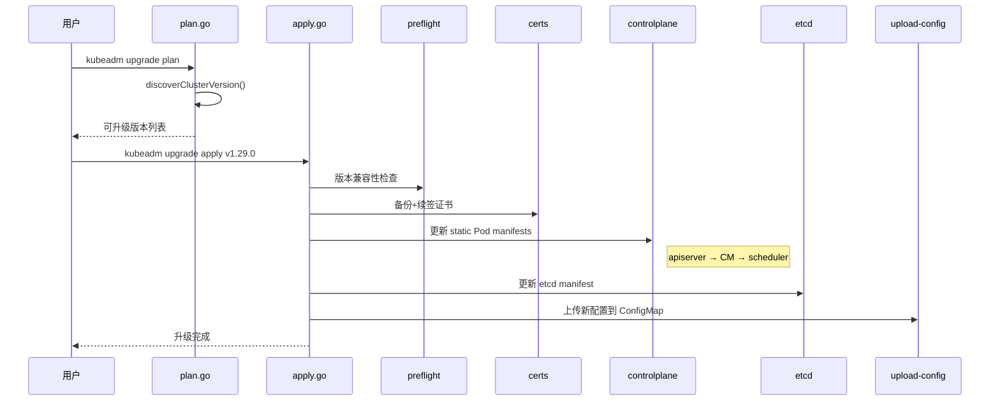

> **生产环境安全提示**
>
> 本文档包含可直接执行的运维命令。执行前请确认：当前目标集群与 Namespace 是否正确；是否具备足够的 RBAC 权限；是否已在非生产环境验证。命令风险等级标注：🔴 高风险（可能造成数据丢失或服务中断）、🟡 中风险（会修改集群状态，但通常可回滚）、🟢 低风险/只读（信息收集，无副作用）。


title: 集群升级流程 kubeadm upgrade
description: 'Apply->>Upload: 上传新配置到 ConfigMap'
category: functions
tags:
- k8s
- operations
- cluster-management
- etcd
- apiserver
- kubelet
- scheduler
- controller-manager
- daemonset
last_updated: 2026-05-18
difficulty: advanced
reading_level: advanced
audience:
- Kubernetes 运维工程师
- 平台工程师
estimated_read_time: 5min
intent_queries:
- kubeadm upgrade apply node
- Kubernetes cluster upgrade step procedure
- kubeadm upgrade plan version skew
- control plane upgrade etcd upgrade
- worker node upgrade drain
trigger_keywords:
- upgrade
- kubeadm
- apply
- node
- plan
- version skew
- control plane
- etcd
- worker
- kubelet
- kube-proxy
- static pod
- upgrade apply
- upgrade node
- upgrade plan
related_domains:
- domain-01-cluster-fundamentals
- domain-10-troubleshooting-diagnostics
related_topics:
- cluster-create/01-overview
- cluster-create/03-certs
- cluster-create/07-etcd
- [[32-发布/package/2026-07-02_18-53/corpus/supporting/domain-02-workloads-applications/topic-functions/cluster-create/13-upgrade-advanced|15-upgrade-advanced]]
authors:
- name: KUDIG Team
  role: contributor
k8s_versions:
- '1.28'
- '1.29'
- '1.30'
- '1.31'
- '1.32'
---

# 集群升级流程 (kubeadm upgrade)

## 函数/流程签名

```go
func RunApply(plan *UpgradePlan, flags *ApplyFlags) error
func RunNode(data *NodeData) error
func RunPlan(flags *PlanFlags) error
func PerformUpgrade(cfg *kubeadmapi.InitConfiguration, waitTimeout time.Duration) error
func UpgradeControlPlane(cfg *kubeadmapi.ClusterConfiguration, patchesDir string) error
func UpgradeEtcd(client clientset.Interface, cfg *kubeadmapi.ClusterConfiguration) error
func UpgradeKubeletConfig(cfg *kubeadmapi.ClusterConfiguration) error
func canUpgradeVersion(current, target *version.Version) bool
func Diff(oldVersion, newVersion string) error
```

## 源码位置

| 文件路径 | 行号范围 | 说明 |
|---------|---------|------|
| `cmd/kubeadm/app/cmd/upgrade/apply.go` | L80-L350 | `RunApply` apply 主入口 |
| `cmd/kubeadm/app/cmd/upgrade/node.go` | L45-L180 | `RunNode` node 入口 |
| `cmd/kubeadm/app/cmd/upgrade/plan.go` | L60-L280 | `RunPlan` 升级计划 |
| `cmd/kubeadm/app/phases/upgrade/controlplane.go` | L35-L200 | 控制面升级 |
| `cmd/kubeadm/app/phases/upgrade/etcd.go` | L30-L150 | etcd 升级 |
| `cmd/kubeadm/app/phases/upgrade/staticpod.go` | L40-L220 | 静态 Pod 更新 |

## 参数说明

### UpgradePlan 参数

| 参数名 | 类型 | 说明 | 验证规则 |
|--------|------|------|---------|
| `oldVersion` | `*version.Version` | 当前版本 | 有效 semver |
| `newVersion` | `*version.Version` | 目标版本 | 比当前高 1 个 minor |
| `etcdUpgrade` | `bool` | 是否升级 etcd | 默认 true |
| `certificateRenewal` | `bool` | 是否续签证书 | 默认 true |
| `patchesDir` | `string` | 补丁目录 | 有效路径 |
| `dryRun` | `bool` | 只打印 | 默认 false |
| `force` | `bool` | 强制升级 | 默认 false |

### ApplyFlags 参数

| 参数名 | 类型 | 说明 | 默认值 |
|--------|------|------|--------|
| `kubeConfigPath` | `string` | kubeconfig | `/etc/kubernetes/admin.conf` |
| `certificateRenewal` | `bool` | 续签证书 | `true` |
| `etcdUpgrade` | `bool` | 升级 etcd | `true` |
| `skipPhases` | `[]string` | 跳过阶段 | 空 |

## 返回值

| 返回值 | 类型 | 说明 |
|--------|------|------|
| `UpgradePlan` | `*struct` | 升级计划 |
| `error` | `error` | 升级错误 |

## 调用链



## 源码分析

### RunApply 主入口

```go
// cmd/kubeadm/app/cmd/upgrade/apply.go
func RunApply(plan *UpgradePlan, flags *ApplyFlags) error {
    // 1. 创建 API 客户端
    client, err := flags.ToClient()

    // 2. 执行预检
    if err := RunApplyPreflights(client, plan); err != nil {
        return fmt.Errorf("preflight failed: %w", err)
    }

    // 3. 备份配置
    backupDir := fmt.Sprintf("/etc/kubernetes/tmp/kubeadm-backup-%d", time.Now().Unix())
    if err := backupConfig(backupDir); err != nil {
        return err
    }

    // 4. 续签证书
    if flags.certificateRenewal {
        if err := UpgradeCerts(plan.NewVersion); err != nil {
            return err
        }
    }

    // 5. 升级控制面
    if err := UpgradeControlPlane(plan, flags.patchesDir); err != nil {
        return err
    }

    // 6. 升级 etcd
    if flags.etcdUpgrade {
        if err := UpgradeEtcd(plan, client); err != nil {
            return err
        }
    }

    // 7. 等待就绪
    if err := WaitForControlPlane(client, 5*time.Minute); err != nil {
        return err
    }

    // 8. 上传配置
    return UploadConfiguration(plan)
}
```

### 版本偏差检查

```go
func canUpgradeVersion(current, target *version.Version) bool {
    if target.LessThan(current) { return false }            // 不允许降级
    if target.Major() != current.Major() { return false }   // 不允许跨 major
    if target.Minor()-current.Minor() > 1 { return false }  // 不允许跨 minor
    return true
}
```

### 控制面升级

```go
// cmd/kubeadm/app/phases/upgrade/controlplane.go
func UpgradeControlPlane(plan *UpgradePlan, patchesDir string) error {
    // 1. 备份 manifests
    backupManifests("/etc/kubernetes/manifests/")

    // 2. 更新 API Server (先更新，等待就绪后再更新其他)
    updateManifest("kube-apiserver", plan.NewVersion)
    waitForAPIServer(5 * time.Minute)

    // 3. 更新 Controller Manager
    updateManifest("kube-controller-manager", plan.NewVersion)

    // 4. 更新 Scheduler
    updateManifest("kube-scheduler", plan.NewVersion)

    return nil
}

func updateManifest(component string, version *version.Version) error {
    // 读取 manifest → 修改 image tag → 写回
    manifestPath := fmt.Sprintf("/etc/kubernetes/manifests/%s.yaml", component)
    pod, err := util.ReadPodFromManifest(manifestPath)

    // 更新镜像版本
    pod.Spec.Containers[0].Image = fmt.Sprintf(
        "registry.k8s.io/%s:%s", component, version)

    // kubelet 检测到文件变化 → 自动重启容器
    return util.WritePodToManifest(manifestPath, pod)
}
```

### Worker 节点升级

```go
// cmd/kubeadm/app/cmd/upgrade/node.go
func RunNode(flags *NodeFlags) error {
    // 1. 从 API Server 获取最新配置
    client, _ := flags.ToClient()
    cfg, _ := downloadKubeadmConfig(client)

    // 2. 备份现有配置
    backupKubeletConfig()

    // 3. 写入新 kubelet 配置
    writeKubeletConfig(cfg)

    // 4. 重启 kubelet
    restartKubelet()
    return nil
}
```

## 执行流程

```
步骤 1:  kubeadm upgrade plan
    → 获取当前版本，计算可升级版本
    ↓
步骤 2:  预检
    → 版本偏差 (不允许跨 minor)
    → 集群健康 (所有节点 Ready)
    → etcd 健康 (所有成员 healthy)
    ↓
步骤 3:  备份
    → /etc/kubernetes/manifests/
    → /etc/kubernetes/pki/
    ↓
步骤 4:  证书续签
    → 续签 apiserver, apiserver-kubelet-client 等
    → CA 不续签 (10 年)
    ↓
步骤 5:  升级 kube-apiserver
    → 更新 manifest image tag
    → kubelet 重启容器
    → 等待 /healthz 200
    ↓
步骤 6:  升级 controller-manager + scheduler
    → 更新 manifests
    ↓
步骤 7:  升级 etcd
    → 更新 etcd manifest
    → 等待 etcd 恢复 healthy
    ↓
步骤 8:  上传新配置
    → 更新 ConfigMap kubeadm-config
```

## 使用场景

### 场景 1: 标准升级 1.28→1.29

> ⚠️ **🟠 高危操作** — 影响业务流量或节点状态，需变更工单+影响评估+计划回滚
> - `kubectl drain`：驱逐节点所有 Pod，业务流量受影响
> - `systemctl stop/restart`：停止/重启系统服务，影响节点上所有容器

> **🔴 高风险操作警告**
>
> 下方命令属于不可逆或高影响操作，执行前请确认：
> - 已备份关键数据与配置
> - 处于批准的变更窗口期
> - 已获得相关责任人授权
> - 已准备回滚或恢复方案
> - 目标集群、Namespace、节点/资源名称正确无误

``` bash
# 🔴 高风险：可能造成数据丢失或服务中断，执行前需备份、变更审批与回滚方案
# 1. 查看升级计划
kubeadm upgrade plan
# Components that must be upgraded manually:
#   kubelet: v1.28.0 → v1.29.0
# Upgrade to the latest version:
#   kube-apiserver: v1.28.0 → v1.29.0

# 2. 拉取镜像
kubeadm config images pull --kubernetes-version=v1.29.0

# 3. 升级控制面
kubeadm upgrade apply v1.29.0

# 4. 升级 kubelet
apt-get install -y kubelet=1.29.0-1.1 kubectl=1.29.0-1.1
systemctl restart kubelet

# 5. Worker 节点
kubectl drain worker-1 --ignore-daemonsets --delete-emptydir-data
ssh worker-1 "kubeadm upgrade node"
ssh worker-1 "apt-get install -y kubelet=1.29.0-1.1"
ssh worker-1 "systemctl restart kubelet"
kubectl uncordon worker-1

# 6. 验证
kubectl get nodes
# NAME      STATUS   VERSION
# master    Ready    v1.29.0
# worker-1  Ready    v1.29.0
```
### 场景 2: HA 滚动升级

> ⚠️ **🟠 高危操作** — 影响业务流量或节点状态，需变更工单+影响评估+计划回滚
> - `kubectl drain`：驱逐节点所有 Pod，业务流量受影响
> - `systemctl stop/restart`：停止/重启系统服务，影响节点上所有容器

> **🔴 高风险操作警告**
>
> 下方命令属于不可逆或高影响操作，执行前请确认：
> - 已备份关键数据与配置
> - 处于批准的变更窗口期
> - 已获得相关责任人授权
> - 已准备回滚或恢复方案
> - 目标集群、Namespace、节点/资源名称正确无误

``` bash
# 🔴 高风险：可能造成数据丢失或服务中断，执行前需备份、变更审批与回滚方案
# 逐个升级 control-plane 节点
for node in master-1 master-2 master-3; do
    echo "Upgrading $node..."
    ssh $node "kubeadm upgrade apply v1.29.0"
    ssh $node "apt-get install -y kubelet=1.29.0-1.1"
    ssh $node "systemctl restart kubelet"
    # 等待节点就绪
    kubectl wait --for=condition=Ready node/$node --timeout=120s
done

# 并行升级 worker 节点
for node in worker-1 worker-2 worker-3; do
    kubectl drain $node --ignore-daemonsets --delete-emptydir-data &
    wait
    ssh $node "kubeadm upgrade node && apt-get install -y kubelet=1.29.0-1.1 && systemctl restart kubelet"
    kubectl uncordon $node
done
```
### 场景 3: 升级失败回滚

> ⚠️ **🔴 灾难性操作** — 含不可逆命令，执行前必须满足变更窗口+双人复核+事前备份+回滚方案
> - `etcdctl snapshot restore`：用快照覆盖 etcd 数据目录，集群状态强制回退
> - `systemctl stop/restart`：停止/重启系统服务，影响节点上所有容器

> **🔴 高风险操作警告**
>
> 下方命令属于不可逆或高影响操作，执行前请确认：
> - 已备份关键数据与配置
> - 处于批准的变更窗口期
> - 已获得相关责任人授权
> - 已准备回滚或恢复方案
> - 目标集群、Namespace、节点/资源名称正确无误

``` bash
# 🔴 高风险：可能造成数据丢失或服务中断，执行前需备份、变更审批与回滚方案
# 查找备份
ls /etc/kubernetes/tmp/
# kubeadm-backup-1704067200

# 恢复 manifests
cp /etc/kubernetes/tmp/kubeadm-backup-*/manifests/*.yaml /etc/kubernetes/manifests/

# 恢复 etcd
ETCDCTL_API=3 etcdctl snapshot restore /backup/etcd-snapshot.db --data-dir=/var/lib/etcd  # ⚠️ 覆盖 etcd 数据，集群状态回退

# 重启 kubelet
systemctl restart kubelet
```
### 场景 4: etcd 备份脚本 (升级前必须)

``` bash
# 🟢 低风险：只读/信息收集，通常无副作用
# etcd 备份
ETCDCTL_API=3 etcdctl snapshot save /backup/etcd-$(date +%Y%m%d).db \
  --endpoints=https://127.0.0.1:2379 \
  --cacert=/etc/kubernetes/pki/etcd/ca.crt \
  --cert=/etc/kubernetes/pki/etcd/healthcheck-client.crt \
  --key=/etc/kubernetes/pki/etcd/healthcheck-client.key

# 验证快照
ETCDCTL_API=3 etcdctl snapshot status /backup/etcd-20240101.db --write-table
```
## 配置示例

### 升级兼容性矩阵

```yaml
# 版本兼容性参考
kubernetes_versions:
  "1.28":
    etcd: "3.5.x"
    kubelet_max_skew: "2 minor versions below API Server"
    kubectl_max_skew: "1 minor version +/-"
  "1.29":
    etcd: "3.5.x"
    kubelet_max_skew: "2 minor versions below API Server"
    kubectl_max_skew: "1 minor version +/-"

# 升级路径 (必须逐版本)
upgrade_paths:
  - from: "1.27" to: "1.28"
  - from: "1.28" to: "1.29"
  - from: "1.29" to: "1.30"
  # 不支持: 1.27 → 1.29 (跨版本)
```

### etcd 升级详解

```go
// cmd/kubeadm/app/phases/upgrade/etcd.go
func UpgradeEtcd(plan *UpgradePlan, client clientset.Interface) error {
    // 1. 获取 etcd 客户端
    etcdClient, err := getEtcdClient(client)

    // 2. 检查所有成员健康
    members, err := etcdClient.MemberList(context.TODO())
    for _, member := range members.Members {
        if err := checkEtcdMemberHealth(member); err != nil {
            return fmt.Errorf("member %s unhealthy: %w", member.Name, err)
        }
    }

    // 3. 更新 etcd manifest 镜像版本
    newImage := fmt.Sprintf("registry.k8s.io/etcd:%s", plan.EtcdVersion)
    if err := updateEtcdManifest(newImage); err != nil {
        return err
    }

    // 4. 等待 etcd 恢复 healthy
    return waitForEtcdHealthy(etcdClient, 5*time.Minute)
}
```

### 静态 Pod 升级机制

```go
// cmd/kubeadm/app/phases/upgrade/staticpod.go
func upgradeStaticPod(component string, newVersion string) error {
    // 1. 读取现有 manifest
    manifestPath := fmt.Sprintf("/etc/kubernetes/manifests/%s.yaml", component)
    data, err := os.ReadFile(manifestPath)

    // 2. 解析为 Pod 对象
    pod := &v1.Pod{}
    if err := yaml.Unmarshal(data, pod); err != nil {
        return err
    }

    // 3. 备份
    backupPath := fmt.Sprintf("/etc/kubernetes/tmp/%s.yaml.bak", component)
    os.WriteFile(backupPath, data, 0600)

    // 4. 更新镜像版本
    for i := range pod.Spec.Containers {
        pod.Spec.Containers[i].Image = fmt.Sprintf(
            "registry.k8s.io/%s:%s", component, newVersion)
    }

    // 5. 写回 manifest (kubelet 自动检测变化)
    newData, _ := yaml.Marshal(pod)
    return os.WriteFile(manifestPath, newData, 0600)
}
```

### 证书续签 (升级时)

```go
// cmd/kubeadm/app/phases/upgrade/certs.go
func UpgradeCertificates(cfg *kubeadmapi.InitConfiguration) error {
    // 1. 备份所有证书
    // cp -r /etc/kubernetes/pki /etc/kubernetes/tmp/pki-backup-*/

    // 2. 续签以下证书 (保留 CA)
    certs := []string{
        "apiserver",                  // API Server TLS
        "apiserver-kubelet-client",   // API Server → kubelet
        "apiserver-etcd-client",      // API Server → etcd
        "front-proxy-client",         // 前端代理
        "etcd/server",               // etcd 服务端
        "etcd/peer",                 // etcd 对等
        "etcd/healthcheck-client",    // etcd 健康检查
    }

    for _, cert := range certs {
        // 加载 CA → 使用 CA 重新签发 → 写入
        if err := renewCertificate(cert); err != nil {
            fmt.Printf("[certs] WARNING: failed to renew %s: %v\n", cert, err)
        }
    }

    // 3. CA 证书不续签 (10 年有效期)
    return nil
}
```

### 升级计划生成

```go
// cmd/kubeadm/app/cmd/upgrade/plan.go
func RunPlan(flags *PlanFlags) error {
    // 1. 获取当前版本
    client, _ := flags.ToClient()
    nodeVersion, _ := getNodeVersion(client)

    // 2. 获取可用版本
    versions, _ := getAvailableVersions(flags.kubeVersion)

    // 3. 过滤不支持的路径
    for _, v := range versions {
        if canUpgradeVersion(nodeVersion, v) {
            fmt.Printf("  %s: %s → %s\n", component, nodeVersion, v)
        }
    }

    // 4. 打印需要手动升级的组件
    fmt.Println("Components that must be upgraded manually:")
    fmt.Println("  kubelet: current → target")
    fmt.Println()
    fmt.Println("Upgrade to the latest version:")
    fmt.Println("  kube-apiserver: current → target")
    fmt.Println("  kube-controller-manager: current → target")
    fmt.Println("  kube-scheduler: current → target")
    fmt.Println("  kube-proxy: current → target")
    fmt.Println("  etcd: current → target")

    return nil
}
```

## 实战示例

### 完整升级输出

```bash
kubeadm upgrade apply v1.29.0
# [upgrade/pre-flight] Running pre-flight checks.
# [upgrade/pre-flight] Pulling images required for setting up the Kubernetes cluster
# [upgrade/pre-flight] This might take a minute or two
# [upgrade/apply] Upgrading your Static Pod-hosted control plane to version "v1.29.0"...
# [upgrade/etcd] Upgrading etcd...
# [upgrade/staticpods] Preparing for "kube-apiserver" upgrade
# [upgrade/staticpods] Renewing certificates for "kube-apiserver"
# [upgrade/staticpods] Moved new manifest to "/etc/kubernetes/manifests/kube-apiserver.yaml"
# [upgrade/staticpods] Waiting for the kubelet to restart the component
# [upgrade/staticpods] Component "kube-apiserver" upgraded successfully
# [upgrade/staticpods] Component "kube-controller-manager" upgraded successfully
# [upgrade/staticpods] Component "kube-scheduler" upgraded successfully
# [upgrade/postupgrade] Applying label changes...
# [upload-config] Storing the configuration used in ConfigMap "kubeadm-config"
# [kubelet] Creating a ConfigMap "kubelet-config" in namespace kube-system
# Done!
```

### 查看升级差异

```bash
kubeadm upgrade diff v1.29.0
# --- /etc/kubernetes/manifests/kube-apiserver.yaml
# +++ /etc/kubernetes/manifests/kube-apiserver.yaml (new)
# -      image: registry.k8s.io/kube-apiserver:v1.28.0
# +      image: registry.k8s.io/kube-apiserver:v1.29.0
```

## 常见错误

| 错误 | 原因 | 解决方案 |
|------|------|---------|
| `[upgrade/health] FATAL: cluster is unhealthy` | etcd 或 API Server 不健康 | 检查 etcd 和组件状态 |
| `unsupported version skew` | 版本差异过大 | 逐版本升级 |
| `static pod update timed out` | 组件重启超时 | 检查 kubelet 日志 |
| `etcd upgrade failed` | etcd 成员不健康 | 修复 etcd 后重试 |
| `failed to pull image` | 镜像拉取失败 | 预先拉取镜像 |
| `certificate renewal failed` | 证书目录权限问题 | 检查 /etc/kubernetes/pki 权限 |
| `ConfigMap "kubeadm-config" not found` | 配置丢失 | 手动创建 ConfigMap |
| `kubelet version skew too large` | kubelet 偏差过大 | 先升级 kubelet |

## 相关函数

- [集群概览](01-overview.md) — kubeadm 整体架构
- [升级进阶](13-upgrade-advanced.md) — 滚动升级和回滚
- [证书管理](03-certs.md) — 升级时证书续签
- [etcd 管理](07-etcd.md) — etcd 备份和升级
- [控制面组件](05-control-plane.md) — static Pod 升级
- [高可用进阶](12-ha-advanced.md) — HA 滚动升级

### 升级预检详细代码

```go
// cmd/kubeadm/app/cmd/upgrade/apply.go
func RunApplyPreflights(client clientset.Interface, plan *UpgradePlan) error {
    // 1. 检查集群健康
    nodes, err := client.CoreV1().Nodes().List(context.TODO(), metav1.ListOptions{})
    for _, node := range nodes.Items {
        for _, condition := range node.Status.Conditions {
            if condition.Type == v1.NodeReady && condition.Status != v1.ConditionTrue {
                return fmt.Errorf("node %s is not Ready", node.Name)
            }
        }
    }

    // 2. 检查 etcd 健康
    etcdClient, _ := getEtcdClient(client)
    members, _ := etcdClient.MemberList(context.TODO())
    for _, member := range members.Members {
        if len(member.Name) == 0 {
            return fmt.Errorf("etcd member %d has no name (not started)", member.ID)
        }
    }

    // 3. 版本偏差检查
    if !canUpgradeVersion(plan.OldVersion, plan.NewVersion) {
        return fmt.Errorf("cannot upgrade from %s to %s", plan.OldVersion, plan.NewVersion)
    }

    return nil
}
```

### kube-proxy 升级 (DaemonSet)

``` bash
# 🟡 中风险：会修改集群/资源状态，执行前请确认目标、影响范围与授权
# kube-proxy 在升级 apply 时自动更新
kubectl get ds kube-proxy -n kube-system -o jsonpath='{.spec.template.spec.containers[0].image}'
# registry.k8s.io/kube-proxy:v1.28.0

# 升级后:
# registry.k8s.io/kube-proxy:v1.29.0

# 手动更新 (如果需要)
kubectl set image daemonset/kube-proxy kube-proxy=registry.k8s.io/kube-proxy:v1.29.0 -n kube-system
```
## Related

- [[reference|#reference Hub]] — tag hub

- [[domain-17-system-foundation/速查卡/go.md|go]]
- [[domain-17-system-foundation/速查卡/k8s.md|k8s]]
- [[entities/kubernetes.md|kubernetes]]
- [[domain-17-system-foundation/知识字典/workloads/daemonset.md|daemonset]]


<!-- risk-assessed -->
