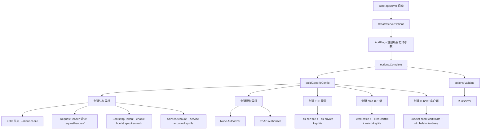
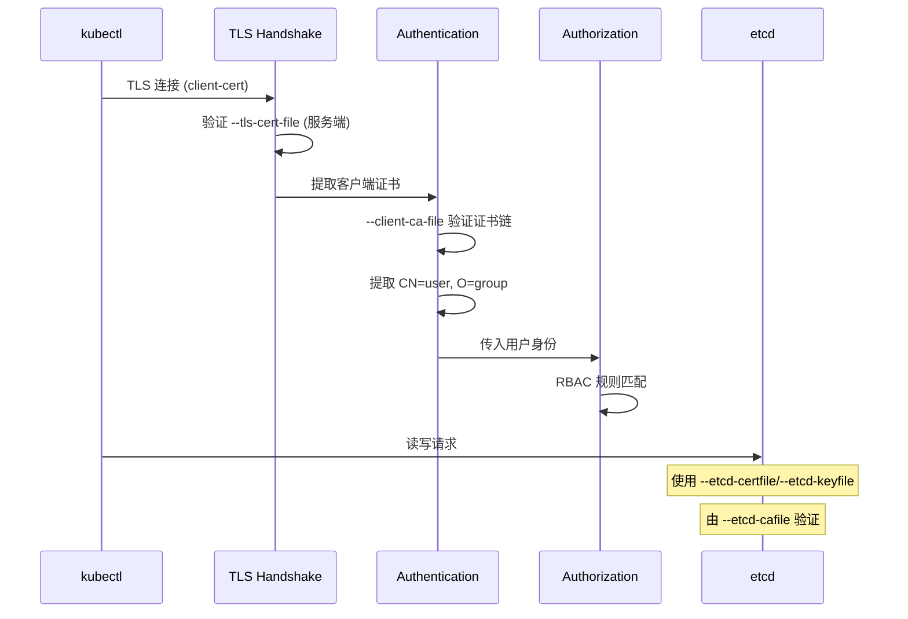

> **生产环境安全提示**
>
> 本文档包含可直接执行的运维命令。执行前请确认：当前目标集群与 Namespace 是否正确；是否具备足够的 RBAC 权限；是否已在非生产环境验证。命令风险等级标注：🔴 高风险（可能造成数据丢失或服务中断）、🟡 中风险（会修改集群状态，但通常可回滚）、🟢 低风险/只读（信息收集，无副作用）。


title: API Server 证书相关启动参数汇总
description: '| TLS 配置 | `staging/src/k8s.io/apiserver/pkg/server/options/serving.go`
  | TLS 证书和密码套件 |'
category: functions
tags:
- k8s
- operations
- cluster-management
- etcd
- apiserver
- kubelet
- rbac
- webhook
- rag
last_updated: '2026-05-18'
difficulty: advanced
reading_level: advanced
audience:
- Kubernetes 管理员
- 集群运维人员
- 安全工程师
estimated_read_time: 5min
intent_queries:
- Kubernetes API Server 证书启动参数 kube-apiserver flags
- API Server 多 CA 信任链 client-ca-file etcd-cafile front-proxy-ca
- API Server TLS 配置 tls-cert-file tls-min-version
- kubelet 客户端连接配置 kubelet-client-certificate
- ServiceAccount Token 验证参数 service-account-key-file
trigger_keywords:
- kube-apiserver
- tls-cert-file
- client-ca-file
- etcd-cafile
- proxy-client-cert-file
- service-account-key-file
- kubelet-client-certificate
- requestheader-client-ca-file
- 多 CA 信任链
- TLS 配置
related_domains:
- domain-01-cluster-fundamentals
related_topics:
- cluster-cert/pki-architecture
- cluster-cert/apiserver-cert
- cluster-cert/rbac-mapping
- cluster-cert/openssl-cookbook
authors:
- name: KUDIG Team
  role: contributor
k8s_versions:
- '1.28'
- '1.29'
- '1.30'
- '1.31'
- '1.32'
---

# API Server 证书相关启动参数汇总

## 函数签名

```go
func CreateServerOptions() (*options.ServerOptions, error)

func (s *ServerOptions) Complete() error
func (s *ServerOptions) Validate() []error
func (s *ServerOptions) RunServer(stopCh <-chan struct{}) error

func buildGenericConfig(s *options.ServerOptions) (*genericapiserver.Config, error)

func createKubeAPIServerConfig(
    s *options.ServerOptions,
    kubeAPIServerStorageConfig *storagebackend.Config,
) (*controlplane.Config, error)
```

## 源码位置

| 组件 | 源码路径 | 说明 |
|------|---------|------|
| API Server 入口 | `cmd/kube-apiserver/app/server.go` | 命令注册、ServerOptions |
| 选项定义 | `cmd/kube-apiserver/app/options/options.go` | 启动参数结构体 |
| TLS 配置 | `staging/src/k8s.io/apiserver/pkg/server/options/serving.go` | TLS 证书和密码套件 |
| X509 认证 | `staging/src/k8s.io/apiserver/pkg/authentication/request/x509/x509.go` | 客户端证书认证 |
| etcd TLS | `staging/src/k8s.io/apiserver/pkg/server/options/etcd.go` | etcd TLS 配置 |
| Front Proxy | `staging/src/k8s.io/apiserver/pkg/server/options/audit.go` | 代理认证配置 |
| SA 验证 | `pkg/kubeapiserver/options/authentication.go` | ServiceAccount 验证 |
| kubelet 客户端 | `pkg/kubeapiserver/options/kubeletclient.go` | kubelet 连接配置 |

## 参数说明

### TLS 服务端证书

| 参数 | 默认值 | 说明 |
|------|--------|------|
| `--tls-cert-file` | `/etc/kubernetes/pki/apiserver.crt` | API Server 服务端证书 |
| `--tls-private-key-file` | `/etc/kubernetes/pki/apiserver.key` | API Server 服务端私钥 |
| `--tls-cipher-suites` | 系统默认 | TLS 密码套件列表 |
| `--tls-min-version` | `VersionTLS12` | 最低 TLS 版本 |
| `--tls-sni-cert-key` | 无 | SNI 证书-密钥对（多域名） |

### 客户端 CA 验证（X509 认证）

| 参数 | 默认值 | 说明 |
|------|--------|------|
| `--client-ca-file` | `/etc/kubernetes/pki/ca.crt` | 验证客户端证书的 CA |
| `--anonymous-auth` | `true` | 允许匿名请求 |
| `--enable-bootstrap-token-auth` | `true` (kubeadm) | 启用 Bootstrap Token 认证 |

### Front Proxy（聚合层）

| 参数 | 默认值 | 说明 |
|------|--------|------|
| `--proxy-client-cert-file` | `/etc/kubernetes/pki/front-proxy-client.crt` | 连接扩展 API Server 的客户端证书 |
| `--proxy-client-key-file` | `/etc/kubernetes/pki/front-proxy-client.key` | 连接扩展 API Server 的客户端私钥 |
| `--requestheader-client-ca-file` | `/etc/kubernetes/pki/front-proxy-ca.crt` | 验证代理客户端的 CA |
| `--requestheader-allowed-names` | `front-proxy-client` | 允许的代理客户端 CN 白名单 |
| `--requestheader-username-headers` | `X-Remote-User` | 用户名 Header |
| `--requestheader-group-headers` | `X-Remote-Group` | 用户组 Header |
| `--requestheader-extra-headers-prefix` | `X-Remote-Extra-` | 额外属性 Header 前缀 |
| `--enable-aggregator-routing` | `false` | 直接路由到扩展 API Server |

### etcd TLS 配置

| 参数 | 默认值 | 说明 |
|------|--------|------|
| `--etcd-cafile` | `/etc/kubernetes/pki/etcd/ca.crt` | 验证 etcd 服务端证书的 CA |
| `--etcd-certfile` | `/etc/kubernetes/pki/apiserver-etcd-client.crt` | 连接 etcd 的客户端证书 |
| `--etcd-keyfile` | `/etc/kubernetes/pki/apiserver-etcd-client.key` | 连接 etcd 的客户端私钥 |
| `--etcd-servers` | `https://127.0.0.1:2379` | etcd 集群地址列表 |
| `--etcd-prefix` | `/registry` | etcd 键前缀 |

### ServiceAccount Token 验证

| 参数 | 默认值 | 说明 |
|------|--------|------|
| `--service-account-key-file` | `/etc/kubernetes/pki/sa.pub` | 验证 SA JWT Token 的公钥 |
| `--service-account-issuer` | 无 | SA Token issuer URL |
| `--service-account-jwks-uri` | 无 | JWKS 公钥集地址 |
| `--service-account-signing-key-file` | 无 | 签名 SA Token 的私钥 |
| `--service-account-extend-token-expiration` | `true` | 扩展 Token 过期时间 |
| `--service-account-max-token-expiration` | 无 | Token 最大有效期 |

### kubelet 证书相关

| 参数 | 默认值 | 说明 |
|------|--------|------|
| `--kubelet-certificate-authority` | 无 | 验证 kubelet 服务端证书的 CA |
| `--kubelet-client-certificate` | `/etc/kubernetes/pki/apiserver-kubelet-client.crt` | 连接 kubelet 的客户端证书 |
| `--kubelet-client-key` | `/etc/kubernetes/pki/apiserver-kubelet-client.key` | 连接 kubelet 的客户端私钥 |
| `--kubelet-https` | `true` | 使用 HTTPS 连接 kubelet |
| `--kubelet-timeout` | `5s` | kubelet 请求超时 |
| `--kubelet-preferred-address-types` | `Hostname,InternalDNS,InternalIP` | kubelet 地址优先级 |

### 审计 Webhook 证书

| 参数 | 默认值 | 说明 |
|------|--------|------|
| `--audit-webhook-config-file` | 无 | 审计 Webhook 配置文件 |
| `--audit-webhook-batch-max-size` | `10000` | 审计批量最大大小 |

## 返回值

| 函数 | 返回值 | 说明 |
|------|--------|------|
| `CreateServerOptions` | `(*options.ServerOptions, error)` | 服务器选项实例 |
| `Complete` | `error` | 选项补全结果 |
| `Validate` | `[]error` | 验证错误列表 |
| `RunServer` | `error` | 服务器运行结果 |

## 调用链



## 源码分析

### 概述

kube-apiserver 是 Kubernetes 的核心组件，所有与证书相关的启动参数控制着 API Server 的 TLS 服务端配置、客户端认证、etcd 连接、Front Proxy 聚合层和 ServiceAccount Token 验证。理解这些参数对于排查 TLS 错误、配置高可用集群和实现安全加固至关重要。

### 多 CA 信任链

API Server 同时使用多个 CA 证书，形成独立的信任域：

```
# 🟢 低风险：只读/信息收集，通常无副作用
                    ┌──────────────────┐
                    │   API Server     │
                    │                  │
┌───────────────────┤  --client-ca     ├───────────────────┐
│                   │   -file          │                   │
│  kubectl/users    │  (kubernetes-ca) │                   │
│  使用 ca.crt      └──────────────────┘                   │
│  验证 API Server                                        │
│                                                         │
│                   ┌──────────────────┐                  │
│                   │   API Server     │                  │
│                   │                  │                  │
└───────────────────┤  --requestheader │                  │
                    │   -client-ca-file│                  │
                    │  (front-proxy-ca)│◄─────────────────┤
                    └──────────────────┘                  │
                         │                                │
                         │                                │
                    ┌────┴────┐                           │
                    │metrics- │                           │
                    │ server  │                           │
                    └─────────┘                           │
                                                          │
                   ┌──────────────────┐                   │
                   │   API Server     │                   │
                   │                  │                   │
                   │  --etcd-cafile   │                   │
                   │  (etcd-ca)       │◄──────────────────┘
                   └──────────────────┘
                         │
                   ┌─────┴─────┐
                   │   etcd    │
                   │  cluster  │
                   └───────────┘
```
### 参数验证检查脚本

```bash
#!/bin/bash
echo "=== API Server Certificate Flags ==="

ARGS=$(ps aux | grep kube-apiserver | grep -v grep | sed 's/.*kube-apiserver //')

check_file() {
    local flag=$1
    local path=$(echo "$ARGS" | grep -oP "$flag=\K[^ ]+")
    if [ -z "$path" ]; then
        echo "[MISSING] $flag not set"
    elif [ -f "$path" ]; then
        echo "[OK] $flag -> $path"
        if "$path" == *.crt; then
            expiry=$(openssl x509 -in "$path" -noout -enddate 2>/dev/null | cut -d= -f2)
            echo "       Expires: $expiry"
        fi
    else
        echo "[ERROR] $flag -> $path (file not found)"
    fi
}

check_file "--tls-cert-file"
check_file "--tls-private-key-file"
check_file "--client-ca-file"
check_file "--etcd-cafile"
check_file "--etcd-certfile"
check_file "--etcd-keyfile"
check_file "--proxy-client-cert-file"
check_file "--proxy-client-key-file"
check_file "--requestheader-client-ca-file"
check_file "--service-account-key-file"
check_file "--kubelet-client-certificate"
check_file "--kubelet-client-key"

echo ""
echo "=== Front Proxy Allowed Names ==="
echo "$ARGS" | grep -oP "--requestheader-allowed-names=\K[^ ]+"

echo ""
echo "=== TLS Min Version ==="
echo "$ARGS" | grep -oP "--tls-min-version=\K[^ ]+" || echo "(default: VersionTLS12)"
```

## 执行流程



## 使用场景

1. **排查 TLS 错误**：通过参数检查证书链完整性
2. **高可用配置**：确保 certSANs 包含负载均衡地址
3. **安全加固**：配置 `--tls-min-version`、`--tls-cipher-suites`
4. **Front Proxy 调试**：排查 metrics-server 401 错误
5. **证书轮换验证**：续期后检查参数指向的证书是否已更新

## 配置示例

```yaml
# kubeadm 生成的 API Server 静态 Pod
apiVersion: v1
kind: Pod
metadata:
  name: kube-apiserver
  namespace: kube-system
spec:
  containers:
  - name: kube-apiserver
    command:
    - kube-apiserver
    - --tls-cert-file=/etc/kubernetes/pki/apiserver.crt
    - --tls-private-key-file=/etc/kubernetes/pki/apiserver.key
    - --client-ca-file=/etc/kubernetes/pki/ca.crt
    - --etcd-cafile=/etc/kubernetes/pki/etcd/ca.crt
    - --etcd-certfile=/etc/kubernetes/pki/apiserver-etcd-client.crt
    - --etcd-keyfile=/etc/kubernetes/pki/apiserver-etcd-client.key
    - --etcd-servers=https://127.0.0.1:2379
    - --proxy-client-cert-file=/etc/kubernetes/pki/front-proxy-client.crt
    - --proxy-client-key-file=/etc/kubernetes/pki/front-proxy-client.key
    - --requestheader-client-ca-file=/etc/kubernetes/pki/front-proxy-ca.crt
    - --requestheader-allowed-names=front-proxy-client
    - --requestheader-username-headers=X-Remote-User
    - --requestheader-group-headers=X-Remote-Group
    - --service-account-key-file=/etc/kubernetes/pki/sa.pub
    - --kubelet-client-certificate=/etc/kubernetes/pki/apiserver-kubelet-client.crt
    - --kubelet-client-key=/etc/kubernetes/pki/apiserver-kubelet-client.key
    - --tls-min-version=VersionTLS13
    volumeMounts:
    - mountPath: /etc/kubernetes/pki
      name: k8s-certs
      readOnly: true
  volumes:
  - hostPath:
      path: /etc/kubernetes/pki
      type: DirectoryOrCreate
    name: k8s-certs
```

## 实战示例

### 证书检查脚本输出

```bash
./check-apiserver-certs.sh
# === API Server Certificate Flags ===
# [OK] --tls-cert-file -> /etc/kubernetes/pki/apiserver.crt
#        Expires: Jan  1 00:00:00 2026 GMT
# [OK] --tls-private-key-file -> /etc/kubernetes/pki/apiserver.key
# [OK] --client-ca-file -> /etc/kubernetes/pki/ca.crt
#        Expires: Jan  1 00:00:00 2035 GMT
# [OK] --etcd-cafile -> /etc/kubernetes/pki/etcd/ca.crt
# [OK] --etcd-certfile -> /etc/kubernetes/pki/apiserver-etcd-client.crt
#        Expires: Jan  1 00:00:00 2026 GMT
# [OK] --proxy-client-cert-file -> /etc/kubernetes/pki/front-proxy-client.crt
# [OK] --requestheader-client-ca-file -> /etc/kubernetes/pki/front-proxy-ca.crt
#
# === Front Proxy Allowed Names ===
# front-proxy-client
#
# === TLS Min Version ===
# VersionTLS13
```

### 常见配置错误排查

``` bash
# 🟢 低风险：只读/信息收集，通常无副作用
# 错误: client-ca-file 指向错误的 CA
# 现象: kubectl 返回 Unauthorized
openssl x509 -in /etc/kubernetes/pki/ca.crt -noout -subject
# subject=CN = kubernetes-ca

# 错误: etcd-cafile 指向 kubernetes-ca
# 现象: API Server 无法连接 etcd
openssl verify -CAfile /etc/kubernetes/pki/etcd/ca.crt /etc/kubernetes/pki/apiserver-etcd-client.crt
# /etc/kubernetes/pki/apiserver-etcd-client.crt: OK

# 错误: SAN 缺失
openssl x509 -in /etc/kubernetes/pki/apiserver.crt -noout -ext subjectAltName
# X509v3 Subject Alternative Name:
#     DNS:master-1, DNS:kubernetes, DNS:kubernetes.default, ...
#     IP Address:192.168.1.10, IP Address:10.96.0.1, IP Address:127.0.0.1
```
## 常见错误

| 错误配置 | 现象 | 修复 |
|---------|------|------|
| `--client-ca-file` 错误 | `Unauthorized` | 确认指向 `kubernetes-ca` 的 ca.crt |
| `--etcd-cafile` 指向 `ca.crt` | 无法连接 etcd | 应指向 `etcd/ca.crt` |
| `--proxy-client-cert-file` CN 不在白名单 | `subject not in allowed list` | 添加到 `--requestheader-allowed-names` |
| `--service-account-key-file` 不匹配 | Pod 无法访问 API | 确保 CM 使用同一密钥对 |
| `--tls-cert-file` SAN 缺失 | 外部访问 TLS 失败 | 更新 certSANs 重新生成 |
| `--kubelet-certificate-authority` 未设置 | API Server 无法验证 kubelet | 设置为 `/etc/kubernetes/pki/ca.crt` |
| `--tls-min-version` 过低 | 安全扫描告警 | 设为 `VersionTLS13` |

## 相关函数

- [`X509 Authenticator`](03-rbac-mapping.md) — 客户端证书认证源码
- [`GetAPIServerAltNames`](05-cert-config.md) — API Server SAN 计算
- [`buildKubeConfigFromSpec`](12-kubeconfig-certs.md) — kubeconfig 证书嵌入
- [`kubeadm init phase certs apiserver`](02-ca-generation.md) — API Server 证书生成

## Related

- [[reference|#reference Hub]] — tag hub

- [[domain-17-system-foundation/速查卡/go.md|go]]
- [[domain-17-system-foundation/速查卡/k8s.md|k8s]]
- [[entities/kubernetes.md|kubernetes]]
- [[32-发布/package/2026-07-02_18-53/corpus/supporting/domain-07-platform-engineering/topic-code-analysis/cluster-cert/03-rbac-mapping|08-rbac-mapping]]
- [[32-发布/package/2026-07-02_18-53/corpus/core/domain-07-platform-engineering/topic-code-analysis/cluster-cert/01-kubeconfig-certs|12-kubeconfig-certs]]


<!-- risk-assessed -->
