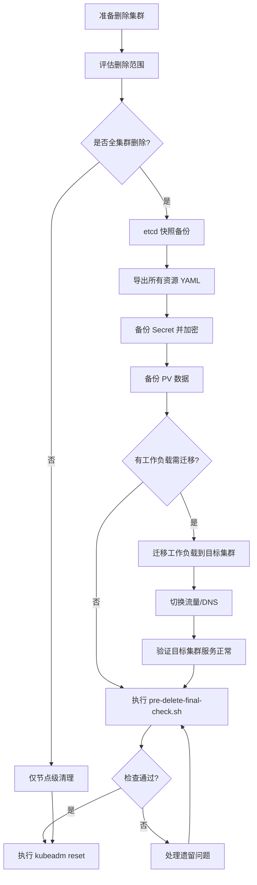

> **生产环境安全提示**
>
> 本文档包含可直接执行的运维命令。执行前请确认：当前目标集群与 Namespace 是否正确；是否具备足够的 RBAC 权限；是否已在非生产环境验证。命令风险等级标注：🔴 高风险（可能造成数据丢失或服务中断）、🟡 中风险（会修改集群状态，但通常可回滚）、🟢 低风险/只读（信息收集，无副作用）。


# 集群删除前的数据备份与迁移检查清单

> **警告**：`kubeadm reset` 和节点清理操作**不可逆**。执行前请确保完成本文档中的所有关键检查项。

## 删除前检查总览

> ⚠️ **🔴 灾难性操作** — 含不可逆命令，执行前必须满足变更窗口+双人复核+事前备份+回滚方案
> - `kubeadm reset`：清理节点所有 K8s 配置/证书/CNI，节点脱离集群

> **🔴 高风险操作警告**
>
> 下方命令属于不可逆或高影响操作，执行前请确认：
> - 已备份关键数据与配置
> - 处于批准的变更窗口期
> - 已获得相关责任人授权
> - 已准备回滚或恢复方案
> - 目标集群、Namespace、节点/资源名称正确无误

```
# 🔴 高风险：可能造成数据丢失或服务中断，执行前需备份、变更审批与回滚方案
┌─────────────────────────────────────────────────────────────────────┐
│                  集群删除前准备流程                                    │
├─────────────────────────────────────────────────────────────────────┤
│                                                                     │
│  第一阶段：评估                                                       │
│  ├── 确认删除范围（单节点/全集群）                                    │
│  ├── 确认是否有下游依赖（其他集群、CI/CD 系统）                       │
│  └── 确认操作窗口和回滚计划                                           │
│                                                                     │
│  第二阶段：备份                                                       │
│  ├── etcd 快照备份                                                   │
│  ├── 关键资源 YAML 导出                                              │
│  ├── Secret / ConfigMap 备份                                        │
│  └── PersistentVolume 数据备份                                       │
│                                                                     │
│  第三阶段：迁移                                                       │
│  ├── 工作负载迁移到目标集群                                           │
│  ├── DNS/Ingress 流量切换                                            │
│  └── 验证目标集群接管完毕                                             │
│                                                                     │
│  第四阶段：执行删除                                                   │
│  └── kubeadm reset / kubectl delete node / 清理网络和存储           │  # ⚠️ 清理节点所有 K8s 配置
└─────────────────────────────────────────────────────────────────────┘
```
## 阶段一：评估检查清单

### 删除范围确认

``` bash
# 🟢 低风险：只读/信息收集，通常无副作用
# 查看集群节点列表
kubectl get nodes -o wide

# 查看集群版本
kubectl version --short

# 查看所有命名空间中运行的工作负载
kubectl get deployments,statefulsets,daemonsets --all-namespaces

# 查看 PersistentVolume 状态（重点关注 Bound 状态）
kubectl get pv --all-namespaces
```
### 下游依赖检查

``` bash
# 🟢 低风险：只读/信息收集，通常无副作用
# 检查是否有外部系统访问该集群的 API
kubectl get ingress --all-namespaces

# 检查 ServiceAccount Token 是否被外部系统使用
kubectl get secrets --all-namespaces | grep kubernetes.io/service-account-token

# 检查是否有跨集群引用（Velero、Federation 等）
kubectl get clusterpolicies --all-namespaces 2>/dev/null || echo "无跨集群策略"
```
## 阶段二：备份操作

### 2.1 etcd 快照备份（最关键）

etcd 存储了集群的全部状态，快照备份是集群删除前的首要操作。

> ⚠️ **🟡 中危变更** — 变更集群资源状态，建议先 --dry-run 或 diff 确认
> - `kubectl exec`：进入容器执行命令，可能改变容器状态

``` bash
# 🟡 中风险：会修改集群/资源状态，执行前请确认目标、影响范围与授权
# 方法一：在 etcd Pod 容器内执行（适用于 kubeadm 集群）
ETCD_POD=$(kubectl get pods -n kube-system -l component=etcd -o jsonpath='{.items[0].metadata.name}')

kubectl exec -n kube-system $ETCD_POD -- \
  etcdctl snapshot save /tmp/etcd-snapshot-$(date +%Y%m%d%H%M%S).db \
  --endpoints=https://127.0.0.1:2379 \
  --cacert=/etc/kubernetes/pki/etcd/ca.crt \
  --cert=/etc/kubernetes/pki/etcd/server.crt \
  --key=/etc/kubernetes/pki/etcd/server.key

# 方法二：直接在控制面节点执行（需安装 etcdctl）
ETCD_SNAPSHOT_FILE="/backup/etcd-snapshot-$(date +%Y%m%d%H%M%S).db"

ETCDCTL_API=3 etcdctl snapshot save $ETCD_SNAPSHOT_FILE \
  --endpoints=https://127.0.0.1:2379 \
  --cacert=/etc/kubernetes/pki/etcd/ca.crt \
  --cert=/etc/kubernetes/pki/etcd/peer.crt \
  --key=/etc/kubernetes/pki/etcd/peer.key

# 验证快照完整性
ETCDCTL_API=3 etcdctl snapshot status $ETCD_SNAPSHOT_FILE --write-out=table
```
### etcdctl snapshot status 输出示例

```
+----------+----------+------------+------------+
|   HASH   | REVISION | TOTAL KEYS | TOTAL SIZE |
+----------+----------+------------+------------+
| fe01cf57 |       10 |          7 | 2.1 MB     |
+----------+----------+------------+------------+
```

### 2.2 关键 Kubernetes 资源导出

``` bash
# 🟢 低风险：只读/信息收集，通常无副作用
# 创建备份目录
BACKUP_DIR="/backup/k8s-$(date +%Y%m%d)"
mkdir -p $BACKUP_DIR

# 导出所有命名空间资源
for ns in $(kubectl get namespaces -o jsonpath='{.items[*].metadata.name}'); do
  mkdir -p $BACKUP_DIR/$ns
  
  # Deployments
  kubectl get deployment -n $ns -o yaml > $BACKUP_DIR/$ns/deployments.yaml 2>/dev/null
  
  # StatefulSets
  kubectl get statefulset -n $ns -o yaml > $BACKUP_DIR/$ns/statefulsets.yaml 2>/dev/null
  
  # Services
  kubectl get service -n $ns -o yaml > $BACKUP_DIR/$ns/services.yaml 2>/dev/null
  
  # ConfigMaps（排除 system ConfigMaps）
  kubectl get configmap -n $ns -o yaml > $BACKUP_DIR/$ns/configmaps.yaml 2>/dev/null
  
  # Ingress
  kubectl get ingress -n $ns -o yaml > $BACKUP_DIR/$ns/ingress.yaml 2>/dev/null
  
  # HPA
  kubectl get hpa -n $ns -o yaml > $BACKUP_DIR/$ns/hpa.yaml 2>/dev/null
  
  echo "已备份命名空间: $ns"
done

# 导出集群级别资源
kubectl get clusterrole -o yaml > $BACKUP_DIR/clusterroles.yaml
kubectl get clusterrolebinding -o yaml > $BACKUP_DIR/clusterrolebindings.yaml
kubectl get storageclass -o yaml > $BACKUP_DIR/storageclasses.yaml
kubectl get pv -o yaml > $BACKUP_DIR/persistentvolumes.yaml
kubectl get namespace -o yaml > $BACKUP_DIR/namespaces.yaml

echo "集群资源备份完成：$BACKUP_DIR"
```
### 2.3 Secret 备份（加密处理）

``` bash
# 🟢 低风险：只读/信息收集，通常无副作用
# 导出所有 Secret（包含 base64 编码的敏感数据）
# 注意：此文件包含敏感信息，务必加密存储

kubectl get secrets --all-namespaces -o yaml > $BACKUP_DIR/all-secrets.yaml

# 推荐：使用 kubeseal / Vault 加密存储
# 或直接加密备份文件
gpg --symmetric --cipher-algo AES256 $BACKUP_DIR/all-secrets.yaml
rm $BACKUP_DIR/all-secrets.yaml  # 删除明文版本

# 特别关注：TLS Secret
kubectl get secrets --all-namespaces \
  --field-selector type=kubernetes.io/tls \
  -o yaml > $BACKUP_DIR/tls-secrets.yaml
```
### 2.4 kubeconfig 和 PKI 证书备份

``` bash
# 🟢 低风险：只读/信息收集，通常无副作用
# 备份 kubeconfig
cp ~/.kube/config $BACKUP_DIR/kubeconfig

# 备份控制面节点上的证书
# （在控制面节点执行）
cp -r /etc/kubernetes/pki $BACKUP_DIR/pki-backup

# 备份 kubeadm 配置
kubectl get configmap kubeadm-config -n kube-system -o yaml > $BACKUP_DIR/kubeadm-config.yaml
```
### 2.5 PersistentVolume 数据备份

``` bash
# 🟢 低风险：只读/信息收集，通常无副作用
# 查看所有 PV 及其对应的存储后端
kubectl get pv -o custom-columns=\
'NAME:.metadata.name,CAPACITY:.spec.capacity.storage,ACCESS:.spec.accessModes,'\
'RECLAIM:.spec.persistentVolumeReclaimPolicy,STATUS:.status.phase,'\
'STORAGECLASS:.spec.storageClassName,VOLUMEMODE:.spec.volumeMode'

# 对于本地 hostPath PV，手动备份数据
# 对于云端 PV（EBS/PD/Azure Disk），使用云厂商快照功能
# AWS EBS 示例
aws ec2 create-snapshot \
  --volume-id vol-xxxxxxxxx \
  --description "Pre-k8s-cluster-delete backup $(date +%Y%m%d)"
```
## 阶段三：迁移验证

### 工作负载迁移确认

``` bash
# 🟢 低风险：只读/信息收集，通常无副作用
# 确认目标集群中工作负载已就绪
kubectl get deployments --all-namespaces --context=target-cluster | grep -v Running

# 确认流量已切换（检查 Ingress 或 LoadBalancer）
kubectl get ingress --all-namespaces --context=target-cluster

# 验证服务健康
kubectl get pods --all-namespaces --context=target-cluster | grep -v Running | grep -v Completed
```
### 删除前最终确认检查

> ⚠️ **🔴 灾难性操作** — 含不可逆命令，执行前必须满足变更窗口+双人复核+事前备份+回滚方案
> - `kubeadm reset`：清理节点所有 K8s 配置/证书/CNI，节点脱离集群

``` bash
# 🟢 低风险：只读/信息收集，通常无副作用
#!/bin/bash
# pre-delete-final-check.sh — 删除前最终确认脚本

echo "=== 集群删除前最终检查 ==="
echo ""

# 1. 检查 etcd 快照
if ls /backup/etcd-snapshot-*.db 2>/dev/null; then
  echo "[OK] etcd 快照存在"
else
  echo "[WARN] 未找到 etcd 快照，建议先执行备份"
fi

# 2. 检查资源备份目录
if [ -d "/backup/k8s-$(date +%Y%m%d)" ]; then
  BACKUP_SIZE=$(du -sh /backup/k8s-$(date +%Y%m%d) | awk '{print $1}')
  echo "[OK] 资源备份目录存在，大小：$BACKUP_SIZE"
else
  echo "[WARN] 未找到今日资源备份目录"
fi

# 3. 检查是否还有运行中的工作负载
RUNNING_PODS=$(kubectl get pods --all-namespaces --field-selector=status.phase=Running 2>/dev/null | grep -c Running)
echo "[INFO] 当前运行中的 Pod 数量：$RUNNING_PODS"

# 4. 检查是否有 Bound 状态的 PVC
BOUND_PVCS=$(kubectl get pvc --all-namespaces 2>/dev/null | grep -c Bound)
if [ "$BOUND_PVCS" -gt "0" ]; then
  echo "[WARN] 仍有 $BOUND_PVCS 个 Bound 状态的 PVC，请确认数据已备份"
else
  echo "[OK] 无 Bound 状态 PVC"
fi

echo ""
echo "请确认以上检查项后，执行: kubeadm reset"  # ⚠️ 清理节点所有 K8s 配置
```
## 执行流程



## 恢复指南（备份后如何恢复）

如果删除后需要恢复，可使用 etcd 快照恢复整个集群状态：

> ⚠️ **🔴 灾难性操作** — 含不可逆命令，执行前必须满足变更窗口+双人复核+事前备份+回滚方案
> - `etcdctl snapshot restore`：用快照覆盖 etcd 数据目录，集群状态强制回退

``` bash
# 🟢 低风险：只读/信息收集，通常无副作用
# 1. 重新初始化集群
kubeadm init --config kubeadm-config.yaml

# 2. 停止 kube-apiserver
# (静态 Pod 方式：移动 manifest 文件)
mv /etc/kubernetes/manifests/kube-apiserver.yaml /tmp/

# 3. 恢复 etcd 数据
ETCDCTL_API=3 etcdctl snapshot restore /backup/etcd-snapshot.db \
  --name=master \
  --initial-cluster=master=https://127.0.0.1:2380 \
  --initial-cluster-token=etcd-cluster-1 \
  --initial-advertise-peer-urls=https://127.0.0.1:2380 \
  --data-dir=/var/lib/etcd-restore

# 4. 更新 etcd manifest 指向新数据目录
# 5. 恢复 kube-apiserver
mv /tmp/kube-apiserver.yaml /etc/kubernetes/manifests/

```
## 常见问题

| 问题 | 预防措施 |
|------|---------|
| etcd 快照过期无法恢复 | 删除前当天重新生成快照 |
| Secret 明文泄露 | 使用 GPG 加密备份文件 |
| PV 数据丢失 | 确认 ReclaimPolicy 为 Retain |
| 目标集群工作负载异常未发现 | 删除前完整运行冒烟测试 |
| DNS 切换后旧流量残留 | 降低 TTL 至 60s 后再切换 |

## 相关函数

- [`kubeadm reset`](02-reset.md) — 集群重置的核心命令详解
- [`etcd 清理`](03-etcd-cleanup.md) — etcd 数据清理与成员移除
- [`HA 集群删除`](04-ha-delete.md) — 高可用集群的删除注意事项

## 版本说明

- etcdctl snapshot 支持 etcd v3.x 及以上
- 基于 Kubernetes v1.28 – v1.32 集群操作实践

## Related

- [[entities/kubernetes.md|kubernetes]]
- [[hot|hot]]
- [[domain-07-platform-engineering/代码分析/cluster-delete/02-reset.md|02-reset]]
- [[32-发布/package/2026-07-02_18-53/corpus/supporting/domain-07-platform-engineering/topic-code-analysis/cluster-delete/04-ha-delete|07-ha-delete]]
- [[32-发布/package/2026-07-02_18-53/corpus/supporting/domain-07-platform-engineering/topic-code-analysis/cluster-delete/03-etcd-cleanup|05-etcd-cleanup]]

```

<!-- risk-assessed -->
