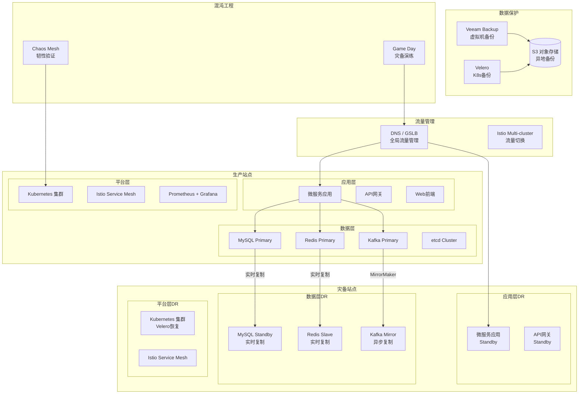

> **生产环境安全提示**
>
> 本文档包含可直接执行的运维命令。执行前请确认：当前目标集群与 Namespace 是否正确；是否具备足够的 RBAC 权限；是否已在非生产环境验证。命令风险等级标注：🔴 高风险（可能造成数据丢失或服务中断）、🟡 中风险（会修改集群状态，但通常可回滚）、🟢 低风险/只读（信息收集，无副作用）。


# Domain 30: 企业级灾备与业务连续性 (Enterprise Disaster Recovery & Business Continuity)

> **领域定位**: 企业级灾备架构与业务连续性管理实践 | **文档数量**: 10 篇 | **更新时间**: 2026-05-18

---

## 概述

企业级灾难恢复（Disaster Recovery, DR）和业务连续性（Business Continuity, BC）是保障企业IT服务持续可用的核心命题。在当今高度数字化的商业环境中，IT服务的停机时间直接转化为经济损失：金融行业每分钟停机成本可达数十万美元，电商平台在大促期间的服务中断可能导致数亿交易损失。本领域专注于从架构设计到技术实施的全链路灾备方案，覆盖虚拟化平台、Kubernetes 云原生环境、应用层和基础设施层的完整灾备技术栈。

灾备体系的核心围绕两大指标构建：**RPO**（Recovery Point Objective，恢复点目标——可容忍的最大数据丢失量，以时间衡量）和 **RTO**（Recovery Time Objective，恢复时间目标——从灾难发生到服务完全恢复的最大允许时间）。所有技术方案的选择、架构设计和流程演练都围绕如何最小化 RPO 和 RTO 而展开。一个成熟的企业灾备体系需要实现 RPO < 15分钟、RTO < 4小时的核心业务恢复能力。

灾备技术经历了从传统磁带备份到磁盘快照、从单机房主备到多活架构、从手动恢复到自动化编排的演进。现代灾备方案融合了存储级复制（同步/异步）、应用级复制（数据库复制、消息队列镜像）、基础设施即代码（Cluster API、Crossplane）和混沌工程（主动验证系统韧性）等多种技术手段，形成多层次的纵深防御体系。本领域的文档体系将帮助读者系统性地掌握这些技术，并在企业中落地实施。

### 核心概念与术语

| 术语 | 全称 | 含义 | 示例 |
|:---|:---|:---|:---|
| **RPO** | Recovery Point Objective | 恢复点目标，允许丢失的最大数据量 | RPO=15分钟表示最多丢失15分钟数据 |
| **RTO** | Recovery Time Objective | 恢复时间目标，服务恢复所需时间 | RTO=4小时表示4小时内恢复服务 |
| **MTTR** | Mean Time To Recovery | 平均恢复时间，衡量灾备效率 | MTTR=2小时 |
| **MTBF** | Mean Time Between Failures | 平均问题间隔时间，衡量可靠性 | MTBF=8760小时(1年) |
| **DR** | Disaster Recovery | 灾难恢复 | 灾备中心切换 |
| **BC** | Business Continuity | 业务连续性 | 完整业务流程连续保障 |
| **BCP** | Business Continuity Plan | 业务连续性计划 | 灾难响应流程文档 |
| **BIA** | Business Impact Analysis | 业务影响分析 | 确定关键业务和RTO/RPO |

---

## DR 策略总览

### 四种灾备架构策略对比

| 策略 | 描述 | RPO | RTO | 相对成本 | 复杂度 | 适用场景 |
|:---|:---|:---|:---|:---|:---|:---|
| **Backup & Restore** | 定时备份数据到异地存储，灾难时从备份恢复 | 小时~天级 | 天级 | 最低 (1x) | 低 | 非关键业务、开发测试环境 |
| **Pilot Light** | 保持核心数据实时复制，灾备环境最小化运行 | 分钟级 | 小时级 | 低 (1.5x) | 中 | 关键数据库、ERP系统 |
| **Warm Standby** | 灾备环境运行完整架构但规模缩减，随时可扩容 | 秒~分钟级 | 分钟级 | 中 (2x) | 中高 | 企业级应用、SaaS平台 |
| **Multi-Active / Hot Standby** | 多站点同时服务，流量负载均衡 | ~0 | ~0 | 高 (2x+) | 高 | 金融交易、核心支付、电商 |

### RPO/RTO 矩阵（按业务等级与技术方案）

| 业务等级 | RPO 目标 | RTO 目标 | 数据复制方案 | 应用恢复方案 | 年度成本估算 |
|:---|:---|:---|:---|:---|:---|
| Tier 1 - 核心交易 | < 1 分钟 | < 5 分钟 | 同步双写 + 存储同步复制 | 多活自动故障转移 | 500-2000 万 |
| Tier 2 - 关键业务 | < 15 分钟 | < 30 分钟 | 异步 CDC + 数据库原生复制 | 主备自动切换 + Velero | 200-500 万 |
| Tier 3 - 重要业务 | < 1 小时 | < 4 小时 | 定时快照 + WAL 归档复制 | Pilot Light + Argo CD 恢复 | 50-200 万 |
| Tier 4 - 一般业务 | < 24 小时 | < 24 小时 | 每日全量备份 + 增量备份 | 冷备恢复 + 手动切换 | 10-50 万 |

### 技术选型指南

| 灾备需求 | 推荐技术方案 | 开源工具 | 商业工具 |
|:---|:---|:---|:---|
| Kubernetes 集群备份 | CSI 快照 + FS 备份 | Velero | Kasten K10、TrilioVault |
| 虚拟机备份与恢复 | CBT 增量 + Instant Recovery | — | Veeam、Commvault、Rubrik |
| 数据库数据保护 | 原生复制 + CDC + 物理备份 | Debezium、pgBackRest | Veeam Plug-in、Rubrik |
| 跨区域存储复制 | 块存储同步/异步复制 | Longhorn、Rook-Ceph | 云原生复制 (EBS/Azure Disk) |
| 全局流量切换 | DNS GSLB + 服务网格故障转移 | external-dns + Istio | Route 53、Azure Front Door |
| 配置与密钥恢复 | GitOps 重新同步 | Argo CD + Flux + ESO | Anthos Config Management |
| 灾备韧性验证 | 混沌工程主动故障注入 | Chaos Mesh、LitmusChaos | Gremlin、Steadybit |
| 灾备自动化编排 | IaC 驱动的灾备环境重建 | Crossplane + Cluster API | CloudFormation + ARM |

---

## 架构设计

### 企业级灾备总体架构



### 灾备等级与方案对照

| 灾备等级 | RPO | RTO | 技术方案 | 成本 | 适用场景 |
|:---|:---|:---|:---|:---|:---|
| Level 1: 数据级 | 小时级 | 天级 | 定时备份 + 异地存储 | 低 | 非关键业务 |
| Level 2: 应用级 | 分钟级 | 小时级 | Velero + 存储复制 | 中 | 一般业务 |
| Level 3: 同城双活 | 秒级 | 分钟级 | 同步复制 + 自动切换 | 高 | 核心业务 |
| Level 4: 异地多活 | 秒级 | 秒级 | 多活架构 + 全局流量管理 | 极高 | 金融交易 |

---

## 合规框架映射

### 灾备相关合规要求对照表

| 合规框架 | 灾备相关条款 | 具体要求 | 推荐技术实现 | 验证方式 |
|:---|:---|:---|:---|:---|
| **ISO 22301** |Clause 8.4.2 | 建立并文档化BCP，定期演练 | BCP 文档 + Game Day 演练记录 | 外部审计 |
| **SOC 2 Type II** | CC7.2 / CC7.3 | 灾备计划、数据备份、业务连续性测试 | Velero Schedule + 自动化演练报告 | SOC 审计师审核 |
| **PCI-DSS v4.0** | Req 12.10 | 灾备计划、定期测试、关键配置备份 | 备份加密 + 密钥管理 + 演练日志 | QSA 评估 |
| **GDPR** | Art 32 | 数据可用性和恢复能力的技术措施 | 跨区域备份 + 加密存储 | DPA 审查 |
| **HIPAA** | §164.308(a)(7) | 灾难恢复和紧急模式运行计划 | EHR 备份 + 快速恢复 + 加密 | OCR 审计 |
| **等保三级** | 8.1.4.7 | 数据备份、异地灾备、恢复演练 | 异地双活 + 定期演练 | 等保测评 |
| **等保四级** | 8.2.4.7 | 实时数据同步、双活或热备 | 同步复制 + 自动切换 | 等保测评 |
| **NIST SP 800-34** | 全文 | 联邦信息系统灾备规划 | BIA + ACP + 测试/演练 | 自评 + 审计 |
| **SOX** | Section 404 | 财务系统灾备和恢复能力 | 财务系统灾备 + 年度演练 | 内审 + 外审 |

---

## DR 成熟度模型

### 灾备能力成熟度评估（5 级模型）

| 成熟度等级 | 名称 | 特征描述 | RPO/RTO 能力 | 关键实践 | 典型工具 |
|:---|:---|:---|:---|:---|:---|
| Level 1 | **初始级** | 无正式灾备计划，依赖个人经验手动恢复 | 无目标 / 天级 | 手动备份、无文档 | 简单脚本、手动拷贝 |
| Level 2 | **可重复级** | 有基本备份策略和简单文档，但未标准化 | 小时~天级 | 定时备份、基础文档 | Velero、pg_dump、mysqldump |
| Level 3 | **已定义级** | 标准化灾备流程、RPO/RTO 目标明确、定期演练 | 分钟~小时级 | 自动化备份、灾备 Runbook、季度演练 | Velero + Veeam + Argo CD |
| Level 4 | **量化管理级** | 灾备指标持续监控、自动化故障转移、数据一致性验证 | 秒~分钟级 | CDC 复制、自动切换、混沌工程 | Karmada + Debezium + Chaos Mesh |
| Level 5 | **持续优化级** | 灾备能力持续改进、预测性运维、灾备演练自动化 | 接近零 RPO/RTO | 多活架构、AI 驱动预测、全自动化 | 全栈自动化 + AI 运维 |

### 成熟度自评检查表

```yaml
disaster_recovery_maturity_checklist:
  level_1_initial:
    - "Have you identified which systems are critical to business operations?"
    - "Do you have any form of data backup, even if manual?"
    - "Can you restore data from a backup if needed?"

  level_2_repeatable:
    - "Do you have automated scheduled backups for all critical systems?"
    - "Is your backup strategy documented in a runbook?"
    - "Have you tested a backup restore in the last 6 months?"
    - "Are backups stored in a geographically separate location?"

  level_3_defined:
    - "Do you have defined RPO and RTO targets for each business tier?"
    - "Do you conduct regular DR drills (at least quarterly)?"
    - "Are DR runbooks kept up-to-date and version-controlled?"
    - "Is there a designated DR team with clear roles and responsibilities?"
    - "Do you use GitOps (Argo CD / Flux) for configuration recovery?"

  level_4_quantitative:
    - "Do you continuously monitor replication lag and RPO compliance?"
    - "Do you have automated failover with manual approval gate?"
    - "Do you run chaos engineering experiments to validate resilience?"
    - "Can you restore a complete K8s cluster in under 1 hour?"
    - "Do you validate data consistency between primary and DR sites?"

  level_5_optimizing:
    - "Do you have fully automated failover with zero human intervention?"
    - "Do you use multi-active architecture for Tier 1 services?"
    - "Are DR drills fully automated with metric collection and reporting?"
    - "Do you use AI/ML for predictive failure detection?"
    - "Can you demonstrate sub-second RPO for all Tier 1 services?"
```

---

## 文档目录

### 核心灾备平台

| 文档 | 主题 | 难度 | 核心技术 |
|:---|:---|:---|:---|
| [00-开源项目索引](./00-open-source-projects-index.md) | 灾备与混沌工程开源项目选型参考 | 入门 | 项目评估、选型矩阵 |
| [01-VMware vSphere 企业级灾备](32-发布/package/2026-07-02_18-53/corpus/peripheral/domain-09-reliability-engineering/01-disaster-recovery/01-vmware-vsphere-enterprise-dr.md) | vSphere 灾备架构、SRM 配置、存储复制 | 高级 | SRM、vSphere Replication、存储策略 |
| [02-Veeam 企业级备份恢复](32-发布/package/2026-07-02_18-53/corpus/peripheral/domain-09-reliability-engineering/01-disaster-recovery/02-veeam-enterprise-backup.md) | Veeam 备份策略、即时恢复、CDP | 高级 | SOBR、CDP、SureBackup、勒索防护 |
| [03-企业级灾备混沌工程](32-发布/package/2026-07-02_18-53/corpus/peripheral/domain-09-reliability-engineering/01-disaster-recovery/03-enterprise-disaster-recovery-chaos-engineering.md) | 容灾架构设计、混沌工程框架 | 专家 | Game Day、稳态假设、故障注入 |
| [05-Commvault 企业级灾备](32-发布/package/2026-07-02_18-53/corpus/peripheral/domain-09-reliability-engineering/01-disaster-recovery/04-commvault-enterprise-disaster-recovery.md) | Commvault 统一数据保护 | 高级 | 分层存储、自动化恢复编排 |
| [06-Rubrik 企业级灾备](32-发布/package/2026-07-02_18-53/corpus/peripheral/domain-09-reliability-engineering/01-disaster-recovery/05-rubrik-enterprise-disaster-recovery.md) | Rubrik 云数据管理 | 高级 | SLA策略、Live Mount、Radar防护 |

### Kubernetes 与云原生灾备

| 文档 | 主题 | 难度 | 核心技术 |
|:---|:---|:---|:---|
| [07-Kubernetes 备份与恢复深度实践](32-发布/package/2026-07-02_18-53/corpus/supporting/domain-09-reliability-engineering/02-disaster-recovery/01-kubernetes-backup-restore-deep-dive.md) | Velero 深度配置、etcd 备份 | 高级 | CSI快照、FS Backup、集群迁移 |
| [08-混沌工程平台实践](32-发布/package/2026-07-02_18-53/corpus/peripheral/domain-09-reliability-engineering/01-disaster-recovery/06-chaos-engineering-platforms.md) | LitmusChaos、Chaos Mesh | 中级→高级 | 稳态假设、问题实验、Game Day |
| [09-应用级灾备架构](32-发布/package/2026-07-02_18-53/corpus/peripheral/domain-09-reliability-engineering/01-disaster-recovery/07-application-level-disaster-recovery.md) | 多区域部署、流量切换 | 专家 | Istio多集群、DNS故障转移、数据复制 |

### 工具指南

| 文档 | 主题 | 难度 |
|:---|:---|:---|
| [99-Velero 备份恢复指南](32-发布/package/2026-07-02_18-53/corpus/supporting/domain-09-reliability-engineering/02-disaster-recovery/02-velero-backup-recovery-guide.md) | Velero 快速上手与生产最佳实践 | 中级 |

---

## 学习路径

### 入门阶段 (1-2周)

```
Step 1: Read this [[README]] to establish core DR concepts (RPO/RTO/MTTR)
Step 2: Read 00-Open Source Projects Index to understand the DR tool ecosystem
Step 3: Read 99-Velero Backup Recovery Guide to master K8s backup basics
Step 4: Practice: Deploy Velero in a test cluster and execute a full backup/restore cycle
```

### 进阶阶段 (3-4周)

```
Step 1: Read 02-Veeam to master enterprise virtualization backup solutions
Step 2: Read 05-Commvault or 06-Rubrik to understand unified data protection platforms
Step 3: Read 07-Kubernetes Backup Restore Deep Dive to master cloud-native DR
Step 4: Read 09-Application Level DR Architecture to design multi-region resilience
Step 5: Practice: Design and implement a complete K8s cluster DR plan
```

### 专家阶段 (持续)

```
Step 1: Read 03-Enterprise DR Chaos Engineering to build a chaos engineering practice
Step 2: Read 08-Chaos Engineering Platforms to implement Chaos Mesh / Litmus
Step 3: Read 01-VMware vSphere DR to master traditional DR architecture
Step 4: Practice: Organize a full Game Day DR drill
Step 5: Establish an enterprise DR governance framework with continuous improvement
```

---

## 技术栈

```yaml
core_disaster_recovery_stack:
  virtualization_dr:
    - "VMware vSphere + SRM: Production-grade virtualization DR"
    - "Veeam Backup & Replication: Backup recovery and CDP"
    - "Commvault Complete Backup: Unified data protection"
    - "Rubrik Cloud Data Management: Cloud-native data management"

  kubernetes_dr:
    - "Velero v1.15: Cluster backup/restore and migration"
    - "etcd-druid: etcd lifecycle management"
    - "Longhorn: Distributed block storage cross-zone replication"
    - "Kasten K10: K8s application-aware backup"

  chaos_engineering:
    - "LitmusChaos v3.12: CNCF Incubating"
    - "Chaos Mesh v2.7: CNCF Incubating"
    - "Chaos Monkey: Netflix random termination"

  application_dr:
    - "Istio v1.25: Multi-cluster traffic management"
    - "external-dns: Automatic DNS management"
    - "Crossplane: Infrastructure orchestration"
    - "ArgoCD/Flux: GitOps configuration recovery"

  data_replication:
    - "MySQL: Semi-sync / Group replication"
    - "PostgreSQL: Sync / Logical replication"
    - "Redis: Sentinel / Cluster replication"
    - "Kafka: MirrorMaker 2"

  monitoring_observability:
    - "Prometheus + Grafana: Metrics monitoring"
    - "Loki: Log aggregation"
    - "Veeam ONE: Backup monitoring"
    - "Rubrik Insight: Data management insights"
```

---

## 灾备策略设计

### 业务影响分析 (BIA) 框架

在进行灾备方案设计之前，需要先完成业务影响分析（BIA），确定各业务系统的重要等级和RPO/RTO目标。以下是参考模板：

```yaml
business_system_classification:
  Tier_1_critical:
    systems:
      - Payment transaction system
      - Core banking system
      - Order management system
    RPO_target: "< 1 minute"
    RTO_target: "< 30 minutes"
    DR_strategy: "Active-Active with synchronous replication"
    data_replication: "Synchronous dual-write + storage sync replication"
    drill_frequency: "Monthly"
    cost_estimate: "5M-20M CNY/year"

  Tier_2_important:
    systems:
      - CRM customer relationship management
      - ERP enterprise resource planning
      - Messaging and notification system
    RPO_target: "< 15 minutes"
    RTO_target: "< 4 hours"
    DR_strategy: "Active-Passive with async replication"
    data_replication: "Async CDC + database native replication"
    drill_frequency: "Quarterly"
    cost_estimate: "2M-5M CNY/year"

  Tier_3_standard:
    systems:
      - Internal OA system
      - Knowledge base / Wiki
      - Development and test environments
    RPO_target: "< 24 hours"
    RTO_target: "< 24 hours"
    DR_strategy: "Scheduled backup + off-site storage"
    data_replication: "Daily full backup + incremental"
    drill_frequency: "Semi-annually"
    cost_estimate: "0.5M-2M CNY/year"
```

### 灾备演练计划

```yaml
disaster_recovery_drill_program:
  Level_1_tabletop:
    frequency: "Monthly"
    participants: "Operations team"
    duration: "1-2 hours"
    activities:
      - "Review DR documentation and contact lists"
      - "Verify backup configurations and schedules"
      - "Confirm communication channels are operational"
      - "Walk through failover runbook step by step"

  Level_2_component:
    frequency: "Quarterly"
    participants: "Operations + Development"
    duration: "2-4 hours"
    activities:
      - "Single component failover test (database, MQ, K8s cluster)"
      - "Velero backup and restore validation"
      - "Database replication failover and data consistency check"
      - "DNS failover verification"

  Level_3_system:
    frequency: "Semi-annually"
    participants: "Operations + Development + Business"
    duration: "4-8 hours"
    activities:
      - "Full system DR switchover and recovery"
      - "Application stack recovery in DR site"
      - "End-to-end smoke test on DR site"
      - "RPO/RTO measurement and reporting"

  Level_4_full:
    frequency: "Annually"
    participants: "Entire organization"
    duration: "1-2 days"
    activities:
      - "Simulate real disaster scenario (entire site failure)"
      - "Full failover to DR site with production traffic"
      - "Business operations validation on DR site"
      - "Failback to primary site"
      - "Post-drill review and improvement plan"
```

---

## 灾备演练自动化脚本

### 自动化 DR 演练编排

``` bash
# 🟢 低风险：只读/信息收集，通常无副作用
#!/bin/bash
set -euo pipefail

echo "=== Automated Disaster Recovery Drill Orchestrator ==="
echo "Drill Start: $(date '+%Y-%m-%d %H:%M:%S UTC')"
echo "Drill Type: ${DRILL_TYPE:-component}"
echo "Target System: ${TARGET_SYSTEM:-all}"
echo ""

DRILL_LOG="dr-drill-$(date +%Y%m%d-%H%M%S).log"
DRILL_RESULT="PASS"

log() {
    echo "$(date '+%H:%M:%S') [$1] $2" | tee -a $DRILL_LOG
}

log "INFO" "Phase 1: Pre-drill health check"
log "INFO" "Primary cluster pods: $(kubectl get pods -n production --no-headers 2>/dev/null | wc -l)"
log "INFO" "DR cluster pods: $(kubectl --kubeconfig /etc/k8s/dr-cluster.config get pods -n production --no-headers 2>/dev/null | wc -l)"
log "INFO" "Velero last backup: $(velero backup get --sort-by=.metadata.creationTimestamp -o json 2>/dev/null | jq -r '.items | last | .metadata.name')"
log "INFO" "Database replication lag: $(curl -s 'http://prometheus:9090/api/v1/query?query=mysql_slave_seconds_behind_master' 2>/dev/null | jq -r '.data.result[0].value[1]')s"

RPO_START=$(date +%s)
FAILOVER_START=$(date +%s)

if "$DRILL_TYPE" == "component"; then
    log "INFO" "Phase 2: Component-level failover test"
    log "INFO" "Simulating $TARGET_SYSTEM failure..."
    case "$TARGET_SYSTEM" in
        database)
            log "INFO" "Promoting database replica to primary..."
            kubectl --kubeconfig /etc/k8s/dr-cluster.config exec -n data mysql-replica-0 -- \
                mysql -u root -e "STOP SLAVE; RESET SLAVE ALL; SET GLOBAL read_only=OFF;"
            ;;
        kubernetes)
            log "INFO" "Restoring K8s resources from Velero backup..."
            velero restore create drill-restore --from-backup $(velero backup get --sort-by=.metadata.creationTimestamp -o json | jq -r '.items | last | .metadata.name') --wait
            ;;
        dns)
            log "INFO" "Testing DNS failover..."
            aws route53 test-answer --hosted-zone-id $ZONE_ID --record-name api.example.com --record-type A
            ;;
        all)
            log "INFO" "Full component test..."
            ;;
    esac
elif "$DRILL_TYPE" == "full"; then
    log "INFO" "Phase 2: Full site failover"
    log "INFO" "Redirecting all traffic to DR site..."
    aws route53 change-resource-record-sets \
        --hosted-zone-id $ZONE_ID \
        --change-batch '{"Changes":[{"Action":"UPSERT","ResourceRecordSet":{"Name":"api.example.com","Type":"A","SetIdentifier":"dr","Weight":100}}]}'
fi

log "INFO" "Phase 3: Wait for recovery"
sleep 120

log "INFO" "Phase 4: Validate service recovery"
SERVICE_OK=false
for i in $(seq 1 20); do
    HTTP_CODE=$(curl -s -o /dev/null -w "%{http_code}" https://api.example.com/healthz 2>/dev/null || echo "000")
    if "$HTTP_CODE" == "200"; then
        SERVICE_OK=true
        FAILOVER_END=$(date +%s)
        log "INFO" "Service recovered (attempt $i/20)"
        break
    fi
    log "WARN" "Waiting for recovery... (HTTP $HTTP_CODE, attempt $i/20)"
    sleep 10
done

FAILOVER_END=${FAILOVER_END:-$(date +%s)}
RPO_END=$(date +%s)

if "$SERVICE_OK" != "true"; then
    DRILL_RESULT="FAIL"
fi

log "INFO" "Phase 5: Calculate drill metrics"
RTO=$((FAILOVER_END - FAILOVER_START))
RPO=$((RPO_END - RPO_START))

log "INFO" "Phase 6: Restore original state"
if "$DRILL_TYPE" == "full"; then
    log "INFO" "Restoring traffic to primary site..."
    aws route53 change-resource-record-sets \
        --hosted-zone-id $ZONE_ID \
        --change-batch '{"Changes":[{"Action":"UPSERT","ResourceRecordSet":{"Name":"api.example.com","Type":"A","SetIdentifier":"primary","Weight":100}}]}'
fi

echo ""
echo "========================================="
echo "       DRILL REPORT SUMMARY"
echo "========================================="
echo "Drill Type:      $DRILL_TYPE"
echo "Target System:   $TARGET_SYSTEM"
echo "Result:          $DRILL_RESULT"
echo "RTO:             ${RTO} seconds ($(( RTO / 60 )) minutes)"
echo "RPO:             ${RPO} seconds ($(( RPO / 60 )) minutes)"
echo "Service OK:      $SERVICE_OK"
echo "Full Log:        $DRILL_LOG"
echo "========================================="

if "$DRILL_RESULT" == "FAIL"; then
    exit 1
fi
```
---

## 最佳实践

### 灾备实施检查清单

```yaml
infrastructure_readiness:
  - "Confirm DR site is deployed and running"
  - "Verify network connectivity and bandwidth between sites"
  - "Confirm storage replication is active and healthy"
  - "Verify DNS/GSLB configuration and TTL settings"
  - "Validate load balancer health checks are configured"

data_protection:
  - "Confirm backup schedules are configured for all critical namespaces"
  - "Verify backup recoverability (date of last successful restore test)"
  - "Confirm data replication lag is within acceptable RPO target"
  - "Verify backup encryption at rest and in transit"
  - "Validate backup integrity with checksums"

application_readiness:
  - "Confirm application can start successfully on DR site"
  - "Verify configuration management is GitOps-driven (Argo CD / Flux)"
  - "Confirm secrets management is synced (Vault / External Secrets Operator)"
  - "Verify monitoring and alerting are functional on DR site"
  - "Validate database connection strings point to correct DR endpoints"

organizational_readiness:
  - "Confirm DR team contact list is up-to-date"
  - "Confirm DR runbooks are reviewed and updated within last 90 days"
  - "Confirm management approval process for failover is documented"
  - "Confirm communication channels (Slack/phone/email) are tested"
  - "Confirm escalation matrix is current and tested"
```

### Kubernetes 灾备核心配置

```yaml
apiVersion: velero.io/v1
kind: Schedule
metadata:
  name: production-daily-backup
  namespace: velero
spec:
  schedule: "0 2 * * *"
  template:
    includedNamespaces:
    - production
    - monitoring
    - ingress-nginx
    excludedResources:
    - events
    - podmetrics
    snapshotVolumes: true
    defaultVolumesToFsBackup: true
    ttl: 168h
    storageLocation: default
---
apiVersion: batch/v1
kind: CronJob
metadata:
  name: etcd-backup
  namespace: kube-system
spec:
  schedule: "0 */4 * * *"
  concurrencyPolicy: Forbid
  jobTemplate:
    spec:
      template:
        spec:
          nodeSelector:
            node-role.kubernetes.io/control-plane: ""
          tolerations:
            - key: node-role.kubernetes.io/control-plane
              effect: NoSchedule
          containers:
            - name: etcd-backup
              image: bitnami/etcd:3.5
              command:
                - /bin/bash
                - -c
                - |
                  ETCDCTL_API=3 etcdctl snapshot save /backup/etcd-$(date +%Y%m%d_%H%M%S).db \
                    --endpoints=https://127.0.0.1:2379 \
                    --cacert=/etc/kubernetes/pki/etcd/ca.crt \
                    --cert=/etc/kubernetes/pki/etcd/healthcheck-client.crt \
                    --key=/etc/kubernetes/pki/etcd/healthcheck-client.key
                  aws s3 cp /backup/ s3://etcd-backups/$(hostname)/ --recursive
          restartPolicy: OnFailure
```

---

## 监控与告警

### Prometheus 灾备监控告警规则

```yaml
groups:
  - name: velero.rules
    rules:
      - alert: VeleroBackupFailed
        expr: increase(velero_backup_failure_total[24h]) > 0
        for: 5m
        labels:
          severity: critical
        annotations:
          summary: "Velero backup {{ $labels.schedule_name }} has failed"

      - alert: VeleroBackupTooOld
        expr: time() - velero_backup_last_successful_timestamp > 86400
        for: 1h
        labels:
          severity: warning
        annotations:
          summary: "No successful Velero backup in the last 24 hours"

      - alert: VeleroBSLUnavailable
        expr: velero_backup_storage_location_status == 0
        for: 5m
        labels:
          severity: critical
        annotations:
          summary: "Velero backup storage location is unavailable"

  - name: replication.rules
    rules:
      - alert: MySQLReplicationLag
        expr: mysql_slave_seconds_behind_master > 30
        for: 5m
        labels:
          severity: warning
        annotations:
          summary: "MySQL replication lag exceeds 30 seconds"

      - alert: MySQLReplicationStopped
        expr: mysql_slave_running == 0
        for: 2m
        labels:
          severity: critical
        annotations:
          summary: "MySQL replication has stopped"

      - alert: PostgreSQLReplicationLag
        expr: pg_replication_lag_seconds > 30
        for: 5m
        labels:
          severity: warning
        annotations:
          summary: "PostgreSQL replication lag exceeds 30 seconds"

      - alert: RPOViolation
        expr: cdc_replication_lag_seconds > on(service) group_left max(rpo_target_seconds) by (service)
        for: 1m
        labels:
          severity: critical
        annotations:
          summary: "RPO violation: replication lag {{ $value }}s exceeds target"

  - name: dr_site.rules
    rules:
      - alert: DRSiteUnreachable
        expr: up{job="dr-site-health"} == 0
        for: 5m
        labels:
          severity: critical
        annotations:
          summary: "DR site is unreachable"

      - alert: DRConfigDrift
        expr: dr_config_diff_count > 0
        for: 30m
        labels:
          severity: warning
        annotations:
          summary: "Configuration drift detected between primary and DR sites"
```

### 灾备监控核心指标

```yaml
velero_backup_monitoring:
  Critical:
    - "Backup has failed consecutively more than 2 times"
    - "No successful backup in the last 24 hours"
    - "Backup storage location is unavailable"
  
  Warning:
    - "Backup duration has increased abnormally"
    - "Backup storage usage exceeds 80%"
    - "Restore test has not been executed in 30+ days"

data_replication_monitoring:
  Critical:
    - "Replication interrupted for more than 5 minutes"
    - "Replication lag exceeds RPO target"
  
  Warning:
    - "Replication lag trending upward"
    - "Replication channel error rate increasing"

dr_site_monitoring:
  Critical:
    - "DR site is unreachable"
    - "DR application fails to start"
  
  Warning:
    - "DR site resource usage is abnormal"
    - "Configuration drift between primary and DR sites"
```

---

## 故障排查

### 灾备常见问题速查

| 问题现象 | 可能原因 | 排查方法 | 解决方案 |
|:---|:---|:---|:---|
| 备份失败 | 存储桶不可达 | 检查BSL状态和S3连通性 | 修复凭证或网络 |
| 恢复超时 | 数据量过大 | 查看Velero恢复日志 | 增加超时参数 |
| 数据丢失超RPO | 复制延迟过大 | 检查复制状态和延迟 | 优化网络或切换同步复制 |
| 灾备切换失败 | DNS未更新 | 检查DNS记录和TTL | 手动更新DNS |
| etcd恢复失败 | 快照损坏 | 验证快照完整性 | 使用更早的快照 |
| 应用启动失败 | 配置不一致 | 对比生产和灾备配置 | 通过GitOps确保一致性 |
| 数据库恢复后数据不一致 | 复制中断 | 检查复制状态和错误日志 | 重新全量同步 |
| Velero恢复CRD冲突 | CRD版本不兼容 | 检查源和目标集群CRD版本 | 预先安装兼容的CRD |

### 灾备切换Runbook模板

> ⚠️ **🟡 中危变更** — 变更集群资源状态，建议先 --dry-run 或 diff 确认
> - `kubectl apply/create/replace`：创建/变更集群资源

``` bash
# 🟡 中风险：会修改集群/资源状态，执行前请确认目标、影响范围与授权
#!/bin/bash
set -euo pipefail

echo "=== Disaster Recovery Failover Initiated ==="
echo "Failover Start Time: $(date '+%Y-%m-%d %H:%M:%S UTC')"
echo "Operator: ${OPERATOR:-manual}"
echo "Reason: ${FAILOVER_REASON:-unplanned outage}"

echo "[1/7] Notify all stakeholders"
echo "  Notifying operations, development, and business teams of DR failover"

echo "[2/7] Stop writes to primary site"
echo "  Updating DNS weights: primary 0% / DR 100%"

echo "[3/7] Wait for data replication to complete"
REPL_LAG=$(mysql -h dr-db -e "SHOW SLAVE STATUS\G" 2>/dev/null | grep "Seconds_Behind_Master" | awk '{print $2}')
echo "  Current MySQL replication lag: ${REPL_LAG}s"
echo "  Checking Kafka MirrorMaker lag..."

echo "[4/7] Validate DR data integrity"
echo "  Executing data consistency validation scripts"

echo "[5/7] Start DR site applications"
echo "  kubectl apply -f dr-applications/"
echo "  Waiting for all pods to become ready..."

echo "[6/7] Switch traffic to DR site"
echo "  Updating GSLB/DNS to point to DR site"
echo "  Verifying external access is functional"

echo "[7/7] Verify service availability"
echo "  Executing smoke tests against DR site"
echo "  Checking monitoring dashboards"

echo "=== DR Failover Complete ==="
echo "Total failover duration: $SECONDS seconds"
```
---

## 参考资源

- [Velero Documentation](https://velero.io/docs/)
- [Veeam Best Practices Guide](https://helpcenter.veeam.com/)
- [NIST SP 800-34 Contingency Planning Guide](https://csrc.nist.gov/publications/detail/sp/800-34/rev-1/final)
- [ISO 22301 Business Continuity Management](https://www.iso.org/standard/75106.html)
- [Litmus Documentation](https://docs.litmuschaos.io/)
- [Chaos Mesh Documentation](https://chaos-mesh.org/docs/)
- [Longhorn Documentation](https://longhorn.io/docs/)
- [Istio Multi-Cluster Deployment](https://istio.io/latest/docs/setup/install/multicluster/)

---

*持续更新最新灾备技术和业务连续性实践*

## Related

- [[README]]
- [[README]]

- [[32-发布/package/2026-07-02_18-53/corpus/supporting/domain-07-platform-engineering/topic-code-analysis/cluster-delete/07-pre-delete-backup-checklist|集群删除前的数据备份与迁移检查清单]]

<!-- risk-assessed -->
