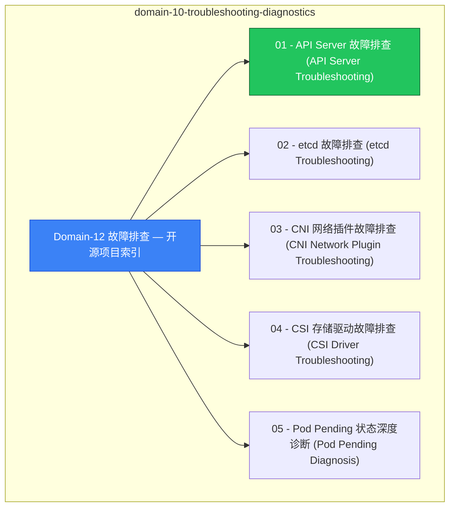

> **生产环境安全提示**
>
> 本文档包含可直接执行的运维命令。执行前请确认：当前目标集群与 Namespace 是否正确；是否具备足够的 RBAC 权限；是否已在非生产环境验证。命令风险等级标注：🔴 高风险（可能造成数据丢失或服务中断）、🟡 中风险（会修改集群状态，但通常可回滚）、🟢 低风险/只读（信息收集，无副作用）。

# domain-10-troubleshooting-diagnostics MOC

> **MOC 版本**: 1.0
> **知识域**: domain-10-troubleshooting-diagnostics
> **文档数量**: 48 篇
> **最后更新**: 2026-05-21
> **用途**: 本知识域的导航入口，汇总所有相关文档、关联领域、和场景入口

---

## 领域概述

故障排查 — 通用方法论、常见故障模式、诊断工具链

### 知识域定位

| 维度 | 说明 |
|---|---|
| **知识域** | domain-10-troubleshooting-diagnostics |
| **文档数量** | 48 篇 |
| **难度分布** | 入门 0 / 进阶 0 / 高级 0 / 专家 0 |

---

## 文档清单

| # | 文档 | 难度 | 标签 | 估计阅读时间 |
|---|---|---|---|---|
| 1 | index.md|Domain-12 故障排查 — 开源项目索引]] |  | k8s, troubleshooting, guide |  |
| 2 | [[domain-10-troubleshooting-diagnostics/核心排障/01-control-plane-apiserver-troubleshooting.md|01 - [[API Server 故障排查|API Server 故障排查]] (API Server Troubleshooting)]] |  | k8s, troubleshooting, guide |  |
| 3 | [[domain-10-troubleshooting-diagnostics/核心排障/02-control-plane-etcd-troubleshooting.md|02 - etcd 故障排查 (etcd Troubleshooting)]] |  | k8s, troubleshooting, guide |  |
| 4 | [[domain-10-troubleshooting-diagnostics/核心排障/03-networking-cni-troubleshooting.md|03 - CNI 网络插件故障排查 (CNI Network Plugin Troubleshooting)]] |  | k8s, troubleshooting, guide |  |
| 5 | [[domain-10-troubleshooting-diagnostics/核心排障/04-storage-csi-troubleshooting.md|04 - CSI 存储驱动故障排查 (CSI Driver Troubleshooting)]] |  | k8s, troubleshooting, guide |  |
| 6 | [[01-pod-pending-diagnosis|05 - Pod Pending 状态深度诊断 (Pod Pending Diagnosis)]] |  | k8s, troubleshooting, guide |  |
| 7 | [[domain-10-troubleshooting-diagnostics/核心排障/06-node-notready-diagnosis.md|06 - Node NotReady 状态深度诊断 (Node NotReady Diagnosis)]] |  | k8s, troubleshooting, guide |  |
| 8 | [[32-发布/package/2026-07-02_18-53/corpus/supporting/domain-10-troubleshooting-diagnostics/00-core-troubleshooting/01-oom-memory-diagnosis|07 - OOM和内存问题诊断]] |  | k8s, troubleshooting, guide |  |
| 9 | [[32-发布/package/2026-07-02_18-53/corpus/core/domain-10-troubleshooting-diagnostics/00-core-troubleshooting/07-pod-comprehensive-troubleshooting|08 - Pod 全面故障排查 (Pod Comprehensive Troubleshooting)]] |  | k8s, troubleshooting, guide |  |
| 10 | [[32-发布/package/2026-07-02_18-53/corpus/core/domain-10-troubleshooting-diagnostics/01-resource-troubleshooting/01-node-comprehensive-troubleshooting|09 - Node 全面故障排查 (Node Comprehensive Troubleshooting)]] |  | k8s, troubleshooting, guide |  |
| 11 | [[32-发布/package/2026-07-02_18-53/corpus/core/domain-10-troubleshooting-diagnostics/01-resource-troubleshooting/02-service-comprehensive-troubleshooting|10 - Service 全面故障排查 (Service Comprehensive Troubleshooting)]] |  | k8s, troubleshooting, guide |  |
| 12 | [[32-发布/package/2026-07-02_18-53/corpus/core/domain-10-troubleshooting-diagnostics/01-resource-troubleshooting/03-deployment-comprehensive-troubleshooting|11 - Deployment 全面故障排查 (Deployment Comprehensive Troubleshooting)]] |  | k8s, troubleshooting, guide |  |
| 13 | [[32-发布/package/2026-07-02_18-53/corpus/core/domain-10-troubleshooting-diagnostics/01-resource-troubleshooting/04-rbac-quota-troubleshooting|12 - RBAC与ResourceQuota 故障排查 (RBAC & Quota Troubleshooting)]] |  | k8s, troubleshooting, guide |  |
| 14 | [[32-发布/package/2026-07-02_18-53/corpus/core/domain-10-troubleshooting-diagnostics/01-resource-troubleshooting/05-certificate-troubleshooting|13 - 证书故障排查 (Certificate Troubleshooting)]] |  | k8s, troubleshooting, guide |  |
| 15 | [[32-发布/package/2026-07-02_18-53/corpus/core/domain-10-troubleshooting-diagnostics/01-resource-troubleshooting/06-pvc-storage-troubleshooting|14 - PVC与存储全面故障排查 (PVC & Storage Comprehensive Troubleshooting)]] |  | k8s, troubleshooting, guide |  |
| 16 | [[32-发布/package/2026-07-02_18-53/corpus/core/domain-10-troubleshooting-diagnostics/01-resource-troubleshooting/07-ingress-troubleshooting|15 - Ingress 故障排查 (Ingress Troubleshooting)]] |  | k8s, troubleshooting, guide |  |
| 17 | [[32-发布/package/2026-07-02_18-53/corpus/supporting/domain-10-troubleshooting-diagnostics/01-resource-troubleshooting/01-networkpolicy-troubleshooting|16 - NetworkPolicy 故障排查 (NetworkPolicy Troubleshooting)]] |  | k8s, troubleshooting, guide |  |
| 18 | [[32-发布/package/2026-07-02_18-53/corpus/supporting/domain-10-troubleshooting-diagnostics/01-resource-troubleshooting/02-hpa-vpa-troubleshooting|17 - HPA/VPA 故障排查 (HPA/VPA Troubleshooting)]] |  | k8s, troubleshooting, guide |  |
| 19 | [[32-发布/package/2026-07-02_18-53/corpus/supporting/domain-10-troubleshooting-diagnostics/01-resource-troubleshooting/03-cronjob-troubleshooting|18 - CronJob 故障排查 (CronJob Troubleshooting)]] |  | k8s, troubleshooting, guide |  |
| 20 | [[32-发布/package/2026-07-02_18-53/corpus/supporting/domain-10-troubleshooting-diagnostics/01-resource-troubleshooting/04-configmap-secret-troubleshooting|19 - ConfigMap/Secret 故障排查 (ConfigMap/Secret Troubleshooting)]] |  | k8s, troubleshooting, guide |  |
| 21 | [[32-发布/package/2026-07-02_18-53/corpus/supporting/domain-10-troubleshooting-diagnostics/01-resource-troubleshooting/05-daemonset-troubleshooting|20 - DaemonSet 故障排查 (DaemonSet Troubleshooting)]] |  | k8s, troubleshooting, guide |  |
| 22 | [[32-发布/package/2026-07-02_18-53/corpus/core/domain-10-troubleshooting-diagnostics/01-resource-troubleshooting/08-statefulset-troubleshooting|21 - StatefulSet 故障排查 (StatefulSet Troubleshooting)]] |  | k8s, troubleshooting, guide |  |
| 23 | [[32-发布/package/2026-07-02_18-53/corpus/supporting/domain-10-troubleshooting-diagnostics/01-resource-troubleshooting/06-job-troubleshooting|22 - Job 故障排查 (Job Troubleshooting)]] |  | k8s, troubleshooting, guide |  |
| 24 | [[32-发布/package/2026-07-02_18-53/corpus/core/domain-10-troubleshooting-diagnostics/01-resource-troubleshooting/09-namespace-troubleshooting|23 - Namespace 故障排查 (Namespace Troubleshooting)]] |  | k8s, troubleshooting, guide |  |
| 25 | [[32-发布/package/2026-07-02_18-53/corpus/core/domain-10-troubleshooting-diagnostics/01-resource-troubleshooting/10-quota-limitrange-troubleshooting|24 - Quota/LimitRange 故障排查 (Quota/LimitRange Troubleshooting)]] |  | k8s, troubleshooting, guide |  |
| 26 | [[32-发布/package/2026-07-02_18-53/corpus/supporting/domain-10-troubleshooting-diagnostics/02-infrastructure-troubleshooting/01-network-connectivity-troubleshooting|25 - 网络连通性故障排查 (Network Connectivity Troubleshooting)]] |  | k8s, troubleshooting, guide |  |
| 27 | [[32-发布/package/2026-07-02_18-53/corpus/core/domain-10-troubleshooting-diagnostics/02-infrastructure-troubleshooting/01-dns-troubleshooting|26 - DNS 故障排查 (DNS Troubleshooting)]] |  | k8s, troubleshooting, guide |  |
| 28 | [[32-发布/package/2026-07-02_18-53/corpus/supporting/domain-10-troubleshooting-diagnostics/02-infrastructure-troubleshooting/02-image-registry-troubleshooting|27 - 镜像仓库故障排查 (Image Registry Troubleshooting)]] |  | k8s, troubleshooting, guide |  |
| 29 | [[32-发布/package/2026-07-02_18-53/corpus/core/domain-10-troubleshooting-diagnostics/02-infrastructure-troubleshooting/02-cluster-autoscaler-troubleshooting|28 - 集群自动扩缩容故障排查 (Cluster Autoscaler Troubleshooting)]] |  | k8s, troubleshooting, guide |  |
| 30 | [[32-发布/package/2026-07-02_18-53/corpus/core/domain-10-troubleshooting-diagnostics/02-infrastructure-troubleshooting/03-cloud-provider-troubleshooting|29 - 云提供商集成故障排查 (Cloud Provider Integration Troubleshooting)]] |  | k8s, troubleshooting, guide |  |
| 31 | [[32-发布/package/2026-07-02_18-53/corpus/core/domain-10-troubleshooting-diagnostics/02-infrastructure-troubleshooting/04-monitoring-alerting-troubleshooting|30 - 监控告警故障排查 (Monitoring and Alerting Troubleshooting)]] |  | k8s, troubleshooting, guide |  |
| 32 | [[32-发布/package/2026-07-02_18-53/corpus/core/domain-10-troubleshooting-diagnostics/02-infrastructure-troubleshooting/05-backup-restore-troubleshooting|31 - 备份恢复故障排查 (Backup and Restore Troubleshooting)]] |  | k8s, troubleshooting, guide |  |
| 33 | [[32-发布/package/2026-07-02_18-53/corpus/supporting/domain-10-troubleshooting-diagnostics/02-infrastructure-troubleshooting/03-security-troubleshooting|32 - 安全相关故障排查 (Security Troubleshooting)]] |  | k8s, troubleshooting, guide |  |
| 34 | [[32-发布/package/2026-07-02_18-53/corpus/core/domain-10-troubleshooting-diagnostics/02-infrastructure-troubleshooting/06-performance-bottleneck-troubleshooting|33 - 性能瓶颈故障排查 (Performance Bottleneck Troubleshooting)]] |  | k8s, troubleshooting, guide |  |
| 35 | [[32-发布/package/2026-07-02_18-53/corpus/core/domain-10-troubleshooting-diagnostics/02-infrastructure-troubleshooting/07-upgrade-migration-troubleshooting|34 - 升级迁移故障排查 (Upgrade and Migration Troubleshooting)]] |  | k8s, troubleshooting, guide |  |
| 36 | [[32-发布/package/2026-07-02_18-53/corpus/supporting/domain-10-troubleshooting-diagnostics/03-advanced-troubleshooting/01-node-component-troubleshooting|35 - 节点组件故障排查 (Node Component Troubleshooting)]] |  | k8s, troubleshooting, guide |  |
| 37 | [[32-发布/package/2026-07-02_18-53/corpus/core/domain-10-troubleshooting-diagnostics/03-advanced-troubleshooting/01-helm-chart-troubleshooting|36 - Helm Chart 故障排查 (Helm Chart Troubleshooting)]] |  | k8s, troubleshooting, guide |  |
| 38 | [[32-发布/package/2026-07-02_18-53/corpus/core/domain-10-troubleshooting-diagnostics/03-advanced-troubleshooting/02-multi-cluster-management-troubleshooting|37 - 多集群管理故障排查 (Multi-Cluster Management Troubleshooting)]] |  | k8s, troubleshooting, guide |  |
| 39 | [[32-发布/package/2026-07-02_18-53/corpus/core/domain-10-troubleshooting-diagnostics/03-advanced-troubleshooting/03-gitops-argocd-troubleshooting|38 - GitOps和ArgoCD故障排查 (GitOps and ArgoCD Troubleshooting)]] |  | k8s, troubleshooting, guide |  |
| 40 | [[32-发布/package/2026-07-02_18-53/corpus/core/domain-10-troubleshooting-diagnostics/03-advanced-troubleshooting/04-enterprise-monitoring-alerting-system|39 - 企业级监控告警体系 (Enterprise Monitoring and Alerting System)]] |  | k8s, troubleshooting, guide |  |
| 41 | [[32-发布/package/2026-07-02_18-53/corpus/supporting/domain-10-troubleshooting-diagnostics/03-advanced-troubleshooting/02-large-scale-cluster-operations|40 - 大规模集群运维 (Large Scale Cluster Operations)]] |  | k8s, troubleshooting, guide |  |
| 42 | [[32-发布/package/2026-07-02_18-53/corpus/core/domain-10-troubleshooting-diagnostics/03-advanced-troubleshooting/05-event-driven-architecture-troubleshooting|41 - 事件驱动架构故障排查 (Event-Driven Architecture Troubleshooting)]] |  | k8s, troubleshooting, guide |  |
| 43 | [[32-发布/package/2026-07-02_18-53/corpus/core/domain-10-troubleshooting-diagnostics/03-advanced-troubleshooting/06-chaos-engineering-fault-injection-testing|42 - 混沌工程和故障注入测试 (Chaos Engineering and Fault Injection Testing)]] |  | k8s, troubleshooting, guide |  |
| 44 | [[32-发布/package/2026-07-02_18-53/corpus/core/domain-10-troubleshooting-diagnostics/03-advanced-troubleshooting/07-symptom-sop-mapping|症状 → SOP 映射手册]] |  | k8s, troubleshooting, guide |  |
| 45 | [[32-发布/package/2026-07-02_18-53/corpus/core/domain-10-troubleshooting-diagnostics/03-advanced-troubleshooting/08-kind-k3s-single-node-troubleshooting|Kind / K3s 单机集群故障排查]] |  | k8s, troubleshooting, guide |  |
| 46 | [[32-发布/package/2026-07-02_18-53/corpus/supporting/domain-10-troubleshooting-diagnostics/04-jvm-tuning/02-java-performance-resource-sizing-guide|Java 应用性能调优与资源 Sizing 指南]] |  | k8s, troubleshooting, guide |  |
| 47 | [[32-发布/package/2026-07-02_18-53/corpus/supporting/domain-10-troubleshooting-diagnostics/04-jvm-tuning/03-jvm-gc-container-tuning-guide|JVM GC 容器调优深度指南]] |  | k8s, troubleshooting, guide |  |
| 48 | [[domain-10-troubleshooting-diagnostics/SUMMARY.md|Domain-12 故障排查文档体系完整总结报告]] |  | k8s, troubleshooting, guide |  |

---

## 知识图谱

---

## 关联入口

| 入口 | 说明 |
|---|---|
| FTA 故障树 | domain-10-troubleshooting-diagnostics 相关故障树分析 |
| Skills 技能 | domain-10-troubleshooting-diagnostics 相关操作技能 |
| 深度研究入口 | 语料库索引与向量检索 |

---

## 统计信息

| 指标 | 数值 |
|---|---|
| 文档总数 | 48 |
| 覆盖 K8s 版本 | v1.25 - v1.32 |

---

*本文档由 scripts/generate-mocs.py 自动生成，最后更新 2026-05-21。*

<!-- risk-assessed -->
