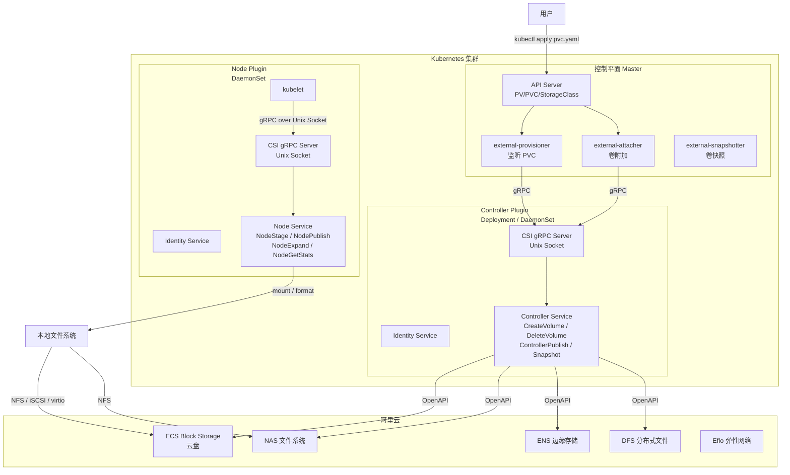
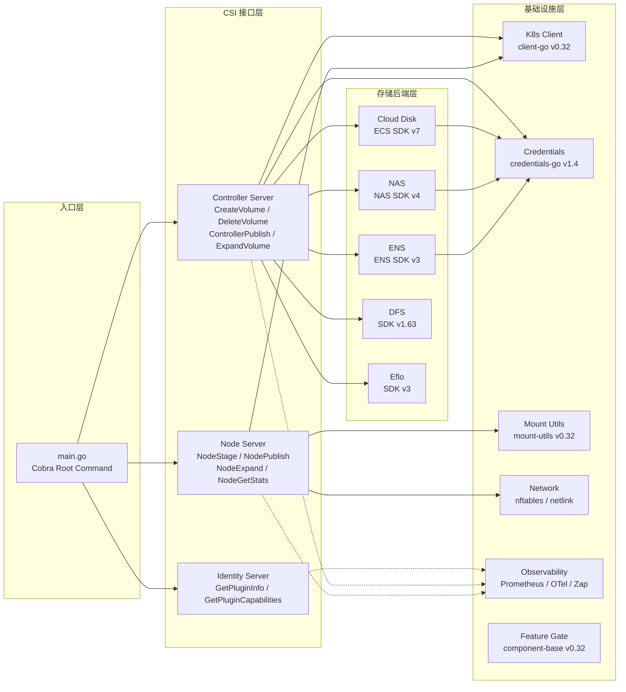

阿里云 CSI 驱动（Alibaba Cloud CSI Driver）是连接 Kubernetes 集群与阿里云存储生态的关键桥梁。它基于**容器存储接口**（Container Storage Interface，CSI）规范实现，将阿里云的云盘、NAS 文件系统、边缘存储等多种存储服务以标准化的方式暴露给 Kubernetes，使容器化应用能够像使用本地磁盘一样动态创建、挂载和管理云端存储卷。本文档面向初学者，从项目定位、核心价值、技术栈构成到架构概览，帮助你建立对该项目的整体认知。

## 什么是 CSI：存储标准化的基石

在 Kubernetes 的存储体系中，历史上每增加一种新的存储后端，就需要向 Kubernetes 核心代码库贡献一段 in-tree 卷插件代码。这导致 Kubernetes 核心日益臃肿、新存储后端的接入周期极长。**CSI 规范**应运而生——它是一个跨容器编排系统的**标准接口**，定义了存储插件必须实现的三组 gRPC 服务：**Identity**（身份与能力声明）、**Controller**（卷生命周期管理）和 **Node**（节点级挂载与卸载）。CSI 使得存储驱动可以完全独立于 Kubernetes 核心代码进行开发、部署和升级。

本项目严格遵循 CSI 规范 **v1.10.0**，通过 gRPC 协议与 kubelet 通信，将阿里云的存储能力转化为标准的 Kubernetes 存储资源（PV/PVC），用户只需定义 StorageClass 和 PVC，驱动便会自动完成从云 API 调用到磁盘格式化、文件系统挂载的全流程操作。

Sources: [modules.txt](vendor/modules.txt#L85-L87)

## 核心价值：五大存储服务的统一接入

阿里云 CSI 驱动的核心价值在于将阿里云**多元化的存储产品线**统一接入 Kubernetes 体系。通过分析项目的 vendor 依赖清单，我们可以精确识别出驱动支持的五大存储服务及其对应的阿里云 SDK 版本：

| 存储服务 | 阿里云产品 | Vendor 依赖 | SDK 版本 | 典型场景 |
|---------|-----------|-------------|---------|---------|
| **块存储** | ECS Block Storage（云盘） | `alibabacloud-go/ecs-20140526/v7` | v7.8.0 | 数据库、高性能 I/O 工作负载 |
| **文件存储** | NAS（网络附加存储） | `alibabacloud-go/nas-20170626/v4` | v4.2.0 | 多 Pod 共享读写、Web 静态资源 |
| **边缘存储** | ENS（边缘节点服务） | `alibabacloud-go/ens-20171110/v3` | v3.0.2 | 边缘计算场景的低延迟存储 |
| **分布式文件** | DFS（分布式文件系统） | `alibaba-cloud-sdk-go/services/dfs` | v1.63.107 | 大规模并行文件访问 |
| **弹性网络** | Eflo（弹性数据中心网络） | `alibabacloud-go/eflo-controller-20221215/v3` | v3.0.0 | 弹性裸金属网络适配 |

此外，驱动还集成了 **STS**（Security Token Service，安全令牌服务）和 **credentials-go** 凭证管理库，支持多种认证方式——从 AK/SK 密钥对到 RAM 角色assume，再到 STS 临时令牌，覆盖了从开发测试到生产环境的全部安全需求。

Sources: [modules.txt](vendor/modules.txt#L1-L72)

## 技术栈全景：从依赖版本看工程成熟度

从 `vendor/modules.txt` 的 890 行依赖清单中，我们可以清晰地梳理出项目的技术栈分层架构。该清单是 Go Modules 机制生成的 vendor 清单文件，精确记录了每一个引入的依赖及其版本。

### 核心依赖版本矩阵

| 技术层次 | 依赖 | 版本 | 用途 |
|---------|------|------|------|
| **CSI 协议** | `container-storage-interface/spec` | v1.10.0 | CSI gRPC 接口规范定义 |
| **gRPC 通信** | `google.golang.org/grpc` | v1.79.3 | Unix Socket 上的 gRPC 服务端/客户端 |
| **序列化** | `google.golang.org/protobuf` | v1.36.10 | Protocol Buffers 消息编解码 |
| **CSI 工具库** | `kubernetes-csi/csi-lib-utils` | v0.7.1 | gRPC 消息脱敏（protosanitizer） |
| **快照客户端** | `kubernetes-csi/external-snapshotter/client/v8` | v8.4.0 | VolumeSnapshot CRD 操作 |
| **K8s API** | `k8s.io/api` `k8s.io/client-go` `k8s.io/apimachinery` | v0.32.6 | Kubernetes API 类型与客户端 |
| **挂载工具** | `k8s.io/mount-utils` | v0.32.6 | 文件系统挂载/格式化/扩容 |
| **Kubelet 统计** | `k8s.io/kubelet` | v0.32.6 | Volume Stats 容量上报 |
| **特性开关** | `k8s.io/component-base/featuregate` | v0.32.6 | Feature Gate 灰度控制 |
| **CLI 框架** | `github.com/spf13/cobra` | v1.8.1 | 多子命令架构（plugin / controller / node） |
| **指标采集** | `github.com/prometheus/client_golang` | v1.19.1 | Prometheus 指标暴露 |
| **结构化日志** | `go.uber.org/zap` | v1.27.0 | 高性能结构化日志 |
| **K8s 日志** | `k8s.io/klog/v2` | v2.130.1 | Kubernetes 风格日志输出 |
| **链路追踪** | `go.opentelemetry.io/otel` | v1.41.0 | 分布式链路追踪 |
| **网络配置** | `github.com/google/nftables` | v0.3.0 | nftables 防火墙规则管理 |
| **网络通信** | `github.com/mdlayher/netlink` | v1.7.3 | Linux Netlink 内核通信 |
| **国密算法** | `github.com/tjfoc/gmsm` | v1.4.1 | SM3 国密哈希算法 |
| **测试框架** | `github.com/stretchr/testify` | v1.11.1 | 断言式单元测试 |
| **Mock 框架** | `github.com/golang/mock` | v1.6.0 | 接口 Mock 与代码生成 |

从 Go 版本要求来看，多个核心依赖（如 `go.opentelemetry.io/otel`、`golang.org/x/sys`、`github.com/prometheus/procfs`）的最低版本为 **Go 1.24.0**，表明本项目采用了较新的 Go 工具链，充分利用了最新语言特性与运行时优化。

Sources: [modules.txt](vendor/modules.txt#L85-L88), [modules.txt](vendor/modules.txt#L242-L260), [modules.txt](vendor/modules.txt#L285-L301), [modules.txt](vendor/modules.txt#L493-L494), [modules.txt](vendor/modules.txt#L830-L859)

## 架构总览：三层架构模型

在深入了解细节之前，我们先从宏观层面理解阿里云 CSI 驱动的整体架构。驱动采用 Kubernetes CSI 的经典**双组件模型**——Controller Plugin 和 Node Plugin，分别运行在集群的不同节点上，通过 gRPC 协议与外部组件交互。

**Controller Plugin** 运行在集群的特定节点上（通常通过 Deployment 或 StatefulSet 部署），负责与阿里云 OpenAPI 交互，完成卷的**创建、删除、扩容、快照**等生命周期操作。它实现了 CSI 的 Identity 和 Controller 两组 gRPC 服务。

**Node Plugin** 以 DaemonSet 方式运行在集群的**每一个工作节点**上，接收来自 kubelet 的 gRPC 调用，负责在节点本地完成**磁盘格式化、文件系统挂载/卸载、卷扩容、容量统计**等操作。它实现了 CSI 的 Identity 和 Node 两组 gRPC 服务。

两个组件之间的通信通过 **gRPC over Unix Domain Socket** 完成——kubelet 作为 gRPC 客户端，通过本地 Unix Socket 文件（通常位于 `/var/lib/kubelet/plugins/<driver-name>/csi.sock`）与 Node Plugin 通信。这种通信方式无需网络栈开销，且天然具备本地安全隔离。

Sources: [modules.txt](vendor/modules.txt#L85-L88), [modules.txt](vendor/modules.txt#L374-L375), [mount.go](vendor/k8s.io/mount-utils/mount.go#L38-L89)

## Mount-Utils：文件系统操作的核心抽象

驱动在节点级别的文件系统操作完全依赖于 Kubernetes 官方的 **mount-utils** 库（v0.32.6）。该库定义了 `mount.Interface` 接口，抽象了所有与操作系统交互的挂载/卸载逻辑。对于初学者而言，理解这个接口至关重要——它是 Node Plugin 实现 `NodeStageVolume` 和 `NodePublishVolume` 等 CSI 方法的基础。

接口的核心方法包括：

| 方法 | 功能 | 典型 CSI 方法 |
|------|------|-------------|
| `Mount(source, target, fstype, options)` | 将源设备挂载到目标路径 | NodePublishVolume |
| `MountSensitive(...)` | 支持敏感挂载参数（如密码）的挂载 | NAS 凭证挂载 |
| `Unmount(target)` | 卸载目标路径 | NodeUnpublishVolume |
| `IsLikelyNotMountPoint(file)` | 快速判断目录是否为挂载点 | 挂载前状态检查 |
| `IsMountPoint(file)` | 精确判断挂载点（包含 bind mount） | 幂等性保障 |
| `List()` | 列出系统所有挂载点 | 状态同步 |
| `GetMountRefs(pathname)` | 获取路径的所有挂载引用 | 安全卸载判定 |

此外，`resizefs_linux.go` 提供了文件系统在线扩容能力，支撑 CSI 的 `NodeExpandVolume` 接口实现。

Sources: [mount.go](vendor/k8s.io/mount-utils/mount.go#L38-L89), [modules.txt](vendor/modules.txt#L857-L859)

## 可观测性体系：三层监控与日志

生产级存储驱动必须具备完善的可观测性。阿里云 CSI 驱动构建了**指标采集（Metrics）、日志输出（Logging）、链路追踪（Tracing）**三位一体的可观测性体系：

**指标层**采用 Prometheus 客户端库（`prometheus/client_golang v1.19.1`），暴露 gRPC 请求延迟、卷操作计数、错误率等关键指标。同时利用 `k8s.io/component-base/metrics`（v0.32.6）提供与 Kubernetes 核心组件一致的指标注册和暴露机制。

**日志层**同时集成了三套日志系统——**klog/v2**（v2.130.1）提供 Kubernetes 原生的结构化日志输出，支持 `InfoS`/`ErrorS` 等语义化日志接口；**Zap**（v1.27.0）提供超高性能的结构化 JSON 日志，适用于高吞吐场景；**logrus**（v1.9.4）作为部分第三方库的日志依赖。

**追踪层**引入 OpenTelemetry（v1.41.0），为跨组件的 gRPC 调用链提供分布式追踪能力。当 kubelet 调用 CSI 驱动、驱动再调用阿里云 OpenAPI 时，完整的调用链路可以被追踪和可视化。

Sources: [modules.txt](vendor/modules.txt#L242-L248), [modules.txt](vendor/modules.txt#L265-L267), [modules.txt](vendor/modules.txt#L285-L296), [modules.txt](vendor/modules.txt#L300-L301), [modules.txt](vendor/modules.txt#L825-L841)

## 安全与认证：多维度凭证管理

存储驱动需要同时与 Kubernetes API Server 和阿里云 OpenAPI 进行认证通信。项目通过以下依赖构建了完整的安全体系：

**阿里云凭证管理**依赖 `credentials-go`（v1.4.10），支持 AK/SK 静态密钥、STS 临时令牌、RAM 角色扮演（RAM Role Assume）、实例元数据（ECS Metadata Service）等多种凭证获取方式。这使得驱动既能安全地运行在阿里云 ECS 实例上（通过实例 RAM 角色），也能在混合云环境中使用显式凭证。

**STS 临时令牌**依赖 `sts-20150401/v2`（v2.0.4），用于动态获取短期有效的访问凭证，减少凭证泄露风险。

**国密支持**通过 `tjfoc/gmsm`（v1.4.1）引入 SM3 国密哈希算法，满足中国金融、政务等行业的合规要求。

Sources: [modules.txt](vendor/modules.txt#L33-L35), [modules.txt](vendor/modules.txt#L63-L72), [modules.txt](vendor/modules.txt#L279-L281)

## 工程实践：CLI 框架与测试体系

**命令行架构**采用 Cobra（v1.8.1）框架，将不同存储类型的 CSI 驱动组织为子命令（如 `csi-plugin`、`controller-server`、`node-server` 等）。Cobra 提供了命令树管理、自动补全、帮助文档生成等能力，使单一二进制文件能够根据运行参数切换为不同角色的 CSI 插件。

**测试体系**结合了 `testify`（v1.11.1）断言库和 `gomock`（v1.6.0）Mock 框架。testify 提供了丰富的断言函数（`assert.Equal`、`require.NoError` 等），gomock 则用于生成阿里云 SDK 接口和 Kubernetes 客户端的 Mock 实现，确保单元测试不依赖真实云资源。此外，`httpmock`（v1.3.1）用于 Mock HTTP 请求，使 OpenAPI 调用可以被精确控制。

Sources: [modules.txt](vendor/modules.txt#L125-L129), [modules.txt](vendor/modules.txt#L173-L176), [modules.txt](vendor/modules.txt#L268-L278), [cobra.go](vendor/github.com/spf13/cobra/cobra.go#L1-L1)

## 项目结构概览

以下是通过 vendor 依赖清单反推出的项目核心模块组织结构：

从上至下，项目分为**入口层**（Cobra 命令路由）、**CSI 接口层**（三组 gRPC 服务实现）、**存储后端层**（各阿里云存储服务的业务逻辑）、**基础设施层**（Kubernetes 客户端、凭证管理、挂载工具、网络配置、可观测性等通用能力）四个层次。每一层都通过接口抽象与上层解耦，使得新增存储后端或替换底层组件时不需要修改 CSI 接口层代码。

## 关键版本兼容性说明

| 维度 | 版本 | 说明 |
|------|------|------|
| CSI 规范 | v1.10.0 | 支持 Volume Group Snapshot（v1beta1/v1beta2） |
| Kubernetes API | v0.32.6（K8s 1.32） | 与 Kubernetes 1.32+ 版本兼容 |
| Go 工具链 | ≥ 1.24.0 | 基于 Go 1.24 编译，支持最新语言特性 |
| gRPC | v1.79.3 | 最新 gRPC-Go 实现，支持 Unix Socket 通信 |
| VolumeSnapshot CRD | v8.4.0 | 对应 external-snapshotter v8 系列 |

CSI v1.10.0 规范相比早期版本增加了**卷组快照**（Volume Group Snapshot）等高级功能的支持。Kubernetes v1.32 是 2024 年末发布的稳定版本，带来了增强的存储容量追踪和改进的卷扩容机制。

Sources: [modules.txt](vendor/modules.txt#L85-L87), [modules.txt](vendor/modules.txt#L189-L202), [modules.txt](vendor/modules.txt#L374-L375), [modules.txt](vendor/modules.txt#L493-L494)

## 阅读路线建议

作为入门指南的第一篇，本文档帮助你建立了对阿里云 CSI 驱动的整体认知。建议按照以下路线继续学习：

**第一步：动手实践** —— 阅读 [快速开始：编译构建与容器化部署](2-kuai-su-kai-shi-bian-yi-gou-jian-yu-rong-qi-hua-bu-shu)，了解如何从源码编译驱动二进制文件并构建容器镜像，在本地或测试集群中进行部署验证。随后参考 [开发环境搭建与依赖管理（Go Modules / Vendor）](3-kai-fa-huan-jing-da-jian-yu-yi-lai-guan-li-go-modules-vendor) 配置 Go 开发环境。

**第二步：理解架构** —— 阅读 [项目整体架构总览与核心组件关系](4-xiang-mu-zheng-ti-jia-gou-zong-lan-yu-he-xin-zu-jian-guan-xi)，深入理解 Controller Plugin 与 Node Plugin 的协作关系、gRPC 通信链路和各存储后端的实现差异。

**第三步：深入协议** —— 从 [CSI 接口规范详解（Identity / Controller / Node 三组服务）](5-csi-jie-kou-gui-fan-xiang-jie-identity-controller-node-san-zu-fu-wu) 开始，逐步深入 gRPC 通信机制和各存储服务的集成实现。