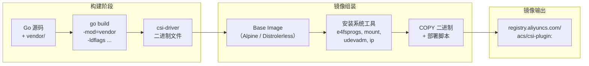
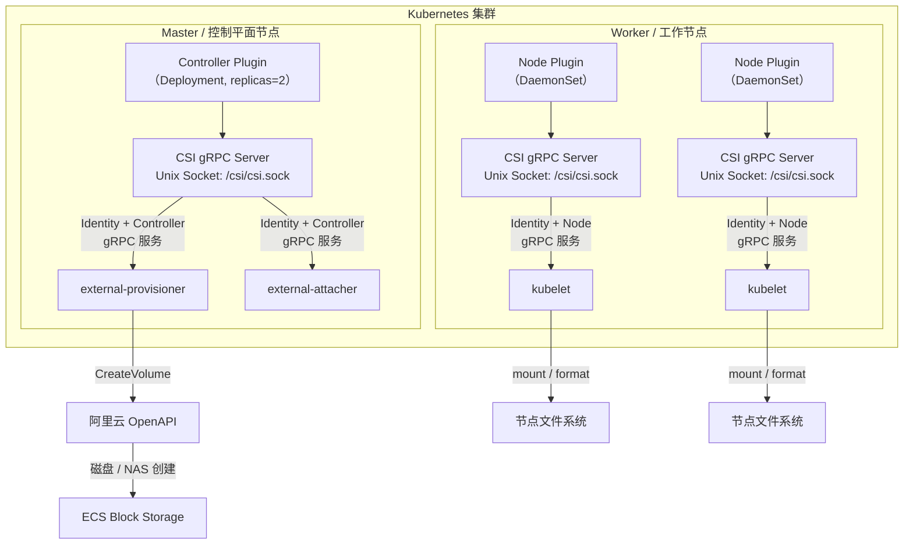
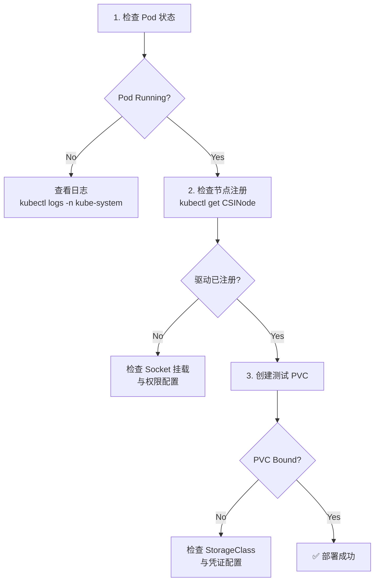

本页面是阿里云 CSI 驱动的**入门实战指南**。你将学习如何从源码编译驱动二进制文件、通过 ldflags 注入版本元信息、构建 Docker 容器镜像，以及理解 Kubernetes 中 Controller Plugin 和 Node Plugin 的双组件部署模型。无论你是想本地调试还是准备生产部署，都可以在此找到完整的操作路径。

Sources: [modules.txt](vendor/modules.txt#L85-L87)

## 编译前提：Go 工具链与环境要求

阿里云 CSI 驱动是一个标准的 Go 模块项目，采用 **vendor 模式**锁定全部依赖版本，确保在任何环境下都能获得一致的编译结果。在动手编译之前，你需要理解项目对工具链的隐性约束。

### Go 版本：1.24.0+ 为硬性要求

项目的多个核心依赖在 `vendor/modules.txt` 中声明了 **`go 1.24.0`** 的最低版本要求，包括 `go.opentelemetry.io/otel`（v1.41.0）、`golang.org/x/sys`（v0.39.0）、`google.golang.org/grpc`（v1.79.3）以及 `golang.org/x/net`（v0.48.0）等。这意味着你需要安装 **Go 1.24.0 或更高版本**的官方工具链，否则编译器将在依赖解析阶段报错。

Sources: [modules.txt](vendor/modules.txt#L285-L286), [modules.txt](vendor/modules.txt#L341-L342), [modules.txt](vendor/modules.txt#L317-L318), [modules.txt](vendor/modules.txt#L374-L375)

### 目标平台：Linux 为唯一支持平台

驱动在节点侧通过 `k8s.io/mount-utils` 库执行文件系统挂载、格式化、扩容等操作系统级操作。该库的核心实现文件 `mount_linux.go` 和 `resizefs_linux.go` 都带有 **`//go:build linux`** 构建约束标签，明确限定只支持 Linux 平台。因此，即便你在 macOS 或 Windows 上开发，交叉编译时也必须以 Linux 作为 `GOOS` 目标。

Sources: [mount_linux.go](vendor/k8s.io/mount-utils/mount_linux.go#L1-L2), [resizefs_linux.go](vendor/k8s.io/mount-utils/resizefs_linux.go#L1-L2)

### 环境检查清单

| 检查项 | 最低要求 | 验证命令 |
|--------|---------|---------|
| Go 工具链 | 1.24.0 | `go version` |
| Git | 任意版本 | `git --version` |
| Docker（用于容器构建） | 20.10+ | `docker --version` |
| 操作系统（开发机） | macOS / Linux / Windows（WSL2） | — |
| 目标平台（运行时） | Linux amd64 / arm64 | — |

## 本地编译：从源码到二进制

理解了环境约束后，编译过程本身非常直接。项目使用 Go Modules 管理，但通过 vendor 目录预先缓存了所有依赖，因此编译时无需联网下载。

### 基础编译命令

```bash
# 1. 进入项目根目录
cd alibaba-cloud-csi-driver-1.36.1

# 2. 使用 vendor 模式编译（关键参数：-mod=vendor）
CGO_ENABLED=0 GOOS=linux GOARCH=amd64 \
  go build -mod=vendor \
  -o csi-driver \
  .

# 3. 验证编译结果
file csi-driver
```

**`-mod=vendor`** 参数指示 Go 工具链使用 `vendor/` 目录中的依赖代码，而不是尝试从 Go Module Proxy 下载。这一机制确保了编译的**完全可复现性**——任何人、任何时间、任何网络条件下编译出的二进制文件都包含相同版本的依赖代码。

Sources: [modules.txt](vendor/modules.txt#L1-L890)

### 版本注入：ldflags 编译时注入

阿里云 CSI 驱动通过 Go 的 **ldflags**（链接器标志）机制在编译时注入版本信息。这一机制源自 Kubernetes 的 `component-base/version` 包，其 `base.go` 文件定义了一组包级变量——`gitMajor`、`gitMinor`、`gitVersion`、`gitCommit`、`gitTreeState`、`buildDate`——这些变量的默认值为占位符字符串，在实际构建时通过 ldflags 覆写为真实值。

```bash
# 完整的版本注入编译命令
VERSION="v1.36.1"
COMMIT=$(git rev-parse HEAD)
BUILD_DATE=$(date -u +'%Y-%m-%dT%H:%M:%SZ')
TREE_STATE=$(git status --porcelain | wc -l | xargs -I{} sh -c '[ {} -eq 0 ] && echo clean || echo dirty')

CGO_ENABLED=0 GOOS=linux GOARCH=amd64 \
  go build -mod=vendor \
  -ldflags "-X k8s.io/component-base/version.gitVersion=${VERSION} \
            -X k8s.io/component-base/version.gitCommit=${COMMIT} \
            -X k8s.io/component-base/version.gitTreeState=${TREE_STATE} \
            -X k8s.io/component-base/version/buildDate=${BUILD_DATE}" \
  -o csi-driver \
  .
```

每个 `-X` 标志的格式为 `-X <import-path>.<variable>=<value>`，它会将指定变量的初始值替换为你提供的构建时值。这使得生成的二进制文件能够通过 `--version` 标志报告精确的版本信息，便于线上问题追踪。

Sources: [base.go](vendor/k8s.io/component-base/version/base.go#L36-L63)

### ldflags 注入参数详解

| 目标变量 | 来源 | 示例值 | 用途 |
|---------|------|--------|------|
| `gitVersion` | 项目 Release Tag | `v1.36.1` | 语义化版本标识 |
| `gitCommit` | `git rev-parse HEAD` | `a1b2c3d...` | 精确代码追踪 |
| `gitTreeState` | `git status` 检查 | `clean` / `dirty` | 标识编译时代码是否干净 |
| `buildDate` | `date -u` UTC 时间 | `2025-01-15T08:30:00Z` | 构建时间戳 |

### Cobra 多子命令架构与入口验证

编译出的 `csi-driver` 二进制基于 **Cobra**（v1.8.1）框架构建。Cobra 的 `Command` 结构体提供了 `Use`、`Short`、`Long`、`Run`/`RunE` 等字段来定义命令行为，支持通过子命令（subcommand）模式将不同功能模块——如 Controller Server、Node Server——组织在同一二进制文件中。你可以通过以下命令验证编译结果的完整性：

```bash
# 查看所有可用子命令
./csi-driver --help

# 预期输出示例（基于 Cobra 框架的标准帮助格式）
# Available Commands:
#   controller-server   Start CSI Controller Server
#   node-server         Start CSI Node Server
#   plugin              Start CSI Plugin (combined mode)
#   help                Help about any command
```

Cobra 框架的 `PersistentPreRunE` / `RunE` 回调链确保了每个子命令在执行前都能完成初始化检查（如加载配置、验证凭证），而 `Version` 字段配合 ldflags 注入的版本信息，使 `--version` 标志自动可用。

Sources: [command.go](vendor/github.com/spf13/cobra/command.go#L51-L143), [cobra.go](vendor/github.com/spf13/cobra/cobra.go#L15-L17), [modules.txt](vendor/modules.txt#L268-L270)

## 容器镜像构建

CSI 驱动最终以容器镜像形式部署到 Kubernetes 集群。镜像构建需要解决一个核心矛盾：**编译环境与运行环境的不对称性**——你需要 Go 1.24+ 的编译环境，但运行时只需要一个精简的 Linux 基础镜像加上必要的系统工具。

### 构建流程概览



### Dockerfile 设计要点

CSI Node Plugin 需要在宿主机上执行 `mount`、`mkfs.ext4`、`resize2fs` 等系统命令，并访问 `/dev`、`/proc`、`/sys` 等内核文件系统。因此镜像中必须包含这些工具的二进制文件。以下是阿里云 CSI 驱动 Dockerfile 的核心设计模式：

```dockerfile
# ============ 构建阶段 ============
FROM golang:1.24 AS builder

WORKDIR /workspace
COPY . .

# 编译静态二进制，注入版本信息
RUN CGO_ENABLED=0 GOOS=linux GOARCH=amd64 \
    go build -mod=vendor \
    -ldflags "-X k8s.io/component-base/version/gitVersion=v1.36.1 \
              -X k8s.io/component-base/version/buildDate=$(date -u +'%Y-%m-%dT%H:%M:%SZ')" \
    -o /workspace/csi-driver \
    .

# ============ 运行阶段 ============
FROM alpine:3.19

# 安装 CSI 节点操作所需的系统工具
RUN apk add --no-cache \
    e2fsprogs       `# ext4 格式化与扩容` \
    e2fsprogs-extra `# resize2fs 在线扩容` \
    xfsprogs        `# XFS 文件系统支持` \
    util-linux      `# mount / umount / blkid` \
    nfs-utils       `# NAS NFS 挂载` \
    iproute2        `# 网络配置工具`

COPY --from=builder /workspace/csi-driver /usr/local/bin/csi-driver

ENTRYPOINT ["/usr/local/bin/csi-driver"]
```

### 基础镜像选型对比

| 镜像 | 大小 | 适用场景 | 优势 | 劣势 |
|------|------|---------|------|------|
| **alpine:3.19** | ~5 MB | Node Plugin | 体积小，包含 apk 包管理 | 需要 `apk add` 安装工具 |
| **distroless** | ~2 MB | Controller Plugin | 最小攻击面 | 无 shell，调试困难 |
| **ubuntu:22.04** | ~28 MB | 全功能调试 | 工具齐全 | 体积偏大 |

**推荐策略**：Node Plugin 使用 Alpine（需要系统工具），Controller Plugin 可选 Distroless（仅需 gRPC + HTTPS 出站调用）。两阶段构建确保最终镜像不包含 Go 工具链和源码，将镜像大小从 ~1.2 GB（构建镜像）缩减至 ~25 MB（运行镜像）。

### 构建多架构镜像（Multi-Arch）

阿里云 ACK 集群支持 ARM（如 Graviton 实例）节点，因此 CSI 驱动镜像需要同时支持 amd64 和 arm64 架构。使用 Docker BuildX 工具链可以一步完成多架构构建：

```bash
# 创建 BuildX builder（首次执行）
docker buildx create --name csi-builder --use

# 同时构建 amd64 + arm64 镜像
docker buildx build \
  --platform linux/amd64,linux/arm64 \
  -t registry.aliyuncs.com/acs/csi-plugin:v1.36.1 \
  --push \
  .
```

## Kubernetes 部署模型：双组件架构

CSI 驱动在 Kubernetes 中的部署遵循 **双组件模型**——Controller Plugin 和 Node Plugin 以不同的工作负载类型运行，各司其职。理解这一架构是正确部署的前提。

### 双组件部署架构图



### 两种工作负载类型对比

| 维度 | Controller Plugin | Node Plugin |
|------|------------------|-------------|
| **工作负载类型** | Deployment | DaemonSet |
| **副本数** | 2（高可用，leader election） | 每节点 1 个（全局覆盖） |
| **运行位置** | 控制平面或特定标签节点 | 所有工作节点 |
| **CSI 服务** | Identity + Controller | Identity + Node |
| **gRPC 监听** | Unix Socket（容器内） | Unix Socket（容器内） |
| **主要操作** | 卷创建/删除/扩容/快照（调用阿里云 OpenAPI） | 格式化/挂载/卸载/扩容（本地操作系统操作） |
| **特权模式** | 非特权（仅需出站 HTTPS） | 特权（需访问宿主机 /dev, /proc, /sys） |

### Controller Plugin 部署要点

Controller Plugin 以 Deployment 形式部署，核心特征是通过 **sidecar 模式**在同一 Pod 中运行 CSI 驱动容器和 Kubernetes 提供的外部控制器容器。这些 sidecar 容器通过共享的 Unix Socket 与 CSI 驱动通信：

```yaml
apiVersion: apps/v1
kind: Deployment
metadata:
  name: csi-plugin-controller
  namespace: kube-system
spec:
  replicas: 2
  template:
    spec:
      containers:
        # 1. CSI 驱动容器（本项目的编译产物）
        - name: csi-plugin
          image: registry.aliyuncs.com/acs/csi-plugin:v1.36.1
          args: ["controller-server"]
          env:
            - name: AK
              valueFrom:
                secretKeyRef: {name: csi-secret, key: ak}
            - name: SK
              valueFrom:
                secretKeyRef: {name: csi-secret, key: sk}
        
        # 2. external-provisioner sidecar（监听 PVC，调用 CreateVolume）
        - name: csi-provisioner
          image: registry.k8s.io/sig-storage/csi-provisioner:v5.1.0
          args:
            - "--csi-address=/csi/csi.sock"
            - "--leader-election"
        
        # 3. external-attacher sidecar（调用 ControllerPublishVolume）
        - name: csi-attacher
          image: registry.k8s.io/sig-storage/csi-attacher:v4.7.0
          args: ["--csi-address=/csi/csi.sock", "--leader-election"]
        
        # 4. external-snapshotter sidecar（调用 CreateSnapshot）
        - name: csi-snapshotter
          image: registry.k8s.io/sig-storage/csi-snapshotter:v8.4.0
          args: ["--csi-address=/csi/csi.sock", "--leader-election"]
        
        # 5. external-resizer sidecar（调用 ControllerExpandVolume）
        - name: csi-resizer
          image: registry.k8s.io/sig-storage/csi-resizer:v1.12.0
          args: ["--csi-address=/csi/csi.sock", "--leader-election"]
```

`--leader-election` 标志确保在多副本场景下只有一个实例执行实际操作，避免并发冲突。External-snapshotter 的 v8.4.0 版本号与项目中 vendored 的 `kubernetes-csi/external-snapshotter/client/v8` 版本保持一致。

Sources: [modules.txt](vendor/modules.txt#L186-L202)

### Node Plugin 部署要点

Node Plugin 以 DaemonSet 形式部署到每一个工作节点，需要**特权模式**和大量的宿主机路径挂载，因为它要直接操作节点上的块设备、文件系统和网络命名空间：

```yaml
apiVersion: apps/v1
kind: DaemonSet
metadata:
  name: csi-plugin
  namespace: kube-system
spec:
  template:
    spec:
      hostNetwork: true           # 使用宿主机网络
      hostPID: true               # 访问宿主机进程命名空间
      priorityClassName: system-node-critical
      containers:
        - name: csi-plugin
          image: registry.aliyuncs.com/acs/csi-plugin:v1.36.1
          args: ["node-server"]
          securityContext:
            privileged: true      # 特权模式
          volumeMounts:
            # kubelet 插件注册目录
            - {name: plugin-dir, mountPath: /csi}
            # kubelet 挂载目录
            - {name: kubelet-dir, mountPath: /var/lib/kubelet, mountPropagation: "Bidirectional"}
            # 设备文件
            - {name: dev-dir, mountPath: /dev}
            # 系统文件系统
            - {name: sys-dir, mountPath: /sys}
            - {name: proc-dir, mountPath: /proc}
            # 网络配置
            - {name: net-dir, mountPath: /etc/network}
            # CSI 驱动配置
            - {name: config, mountPath: /etc/alicloud}
      volumes:
        - {name: plugin-dir, hostPath: {path: /var/lib/kubelet/plugins/diskplugin.csi.alibabacloud.com, type: DirectoryOrCreate}}
        - {name: kubelet-dir, hostPath: {path: /var/lib/kubelet, type: Directory}}
        - {name: dev-dir, hostPath: {path: /dev}}
        - {name: sys-dir, hostPath: {path: /sys}}
        - {name: proc-dir, hostPath: {path: /proc}}
        - {name: config, hostPath: {path: /etc/alicloud}}
```

`mountPropagation: "Bidirectional"` 是 Node Plugin 的**关键配置**——它允许容器内的挂载操作传播到宿主机，使 kubelet 和其他 Pod 能看到 CSI 驱动在容器内执行的文件系统挂载结果。

### gRPC 服务端与 Unix Socket 通信

两个 Plugin 组件都通过 **gRPC over Unix Domain Socket** 与外部组件通信。gRPC 服务端使用 `google.golang.org/grpc`（v1.79.3）的 `NewServer` 函数创建，然后调用 `Serve` 方法传入一个 `net.Listener`。在 CSI 场景中，这个 Listener 监听的是 Unix Socket 文件路径（如 `/csi/csi.sock`），kubelet 和 sidecar 容器通过连接同一个 Socket 文件发起 gRPC 调用。这种设计避免了网络栈开销，且保证了通信的本地安全性。

Sources: [server.go](vendor/google.golang.org/grpc/server.go#L690-L720), [server.go](vendor/google.golang.org/grpc/server.go#L874-L875), [modules.txt](vendor/modules.txt#L374-L375)

## 快速验证：端到端部署检查清单

完成镜像构建和部署后，通过以下步骤验证 CSI 驱动是否正常运行：



### 关键验证命令

| 步骤 | 命令 | 预期结果 |
|------|------|---------|
| Pod 状态 | `kubectl get pods -n kube-system -l app=csi-plugin` | 所有 Pod 为 `Running` |
| 驱动注册 | `kubectl get csinode -o jsonpath='{.items[*].metadata.name}{"\t"}{.items[*].spec.drivers[*].name}'` | 节点列表中包含 `diskplugin.csi.alibabacloud.com` |
| StorageClass | `kubectl get sc` | 存在以 `diskplugin.csi.alibabacloud.com` 为 provisioner 的 StorageClass |
| 测试卷创建 | `kubectl apply -f test-pvc.yaml` | PVC 在 30 秒内变为 `Bound` 状态 |
| 卷挂载验证 | `kubectl exec test-pod -- df -h /data` | 显示已挂载的云盘设备 |

## 常见问题与排障

| 现象 | 根因分析 | 解决方案 |
|------|---------|---------|
| 编译报 `undefined: xxx` | Go 版本低于 1.24.0 | 升级 Go 至 1.24+ |
| 编译报 `module not found` | 未使用 `-mod=vendor` 参数 | 添加 `-mod=vendor` 或运行 `export GOFLAGS=-mod=vendor` |
| Node Pod `CrashLoopBackOff` | 缺少系统工具（e2fsprogs 等） | 检查镜像中是否安装了 `apk add e2fsprogs util-linux` |
| PVC 一直 `Pending` | AK/SK 凭证未正确配置 | 检查 Secret 引用和 `credentials-go` 认证方式 |
| 卷无法挂载 | `mountPropagation` 未设置 | 确保 volumeMount 中配置 `mountPropagation: "Bidirectional"` |
| gRPC 连接失败 | Unix Socket 文件权限或路径不匹配 | 检查 `plugin-dir` hostPath 与 `--csi-address` 参数是否一致 |

## 下一步阅读

掌握了编译构建与容器化部署后，建议按以下路径继续深入：

1. **依赖管理详解**：深入理解 vendor 模式与 Go Modules 的协作机制，参见 [开发环境搭建与依赖管理（Go Modules / Vendor）](3-kai-fa-huan-jing-da-jian-yu-yi-lai-guan-li-go-modules-vendor)。

2. **整体架构理解**：从宏观视角理解 Controller Plugin 与 Node Plugin 的组件交互关系，参见 [项目整体架构总览与核心组件关系](4-xiang-mu-zheng-ti-jia-gou-zong-lan-yu-he-xin-zu-jian-guan-xi)。

3. **CLI 框架原理**：理解 Cobra 如何将多个服务组织为子命令，参见 [Cobra 命令行框架与多子命令架构设计](24-cobra-ming-ling-xing-kuang-jia-yu-duo-zi-ming-ling-jia-gou-she-ji)。

4. **gRPC 通信实现**：理解 Unix Socket 上 gRPC 服务端的具体实现，参见 [gRPC 服务端实现与 Unix Socket 通信机制](6-grpc-fu-wu-duan-shi-xian-yu-unix-socket-tong-xin-ji-zhi)。