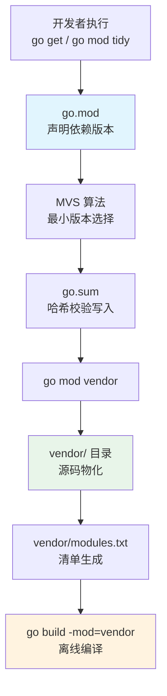
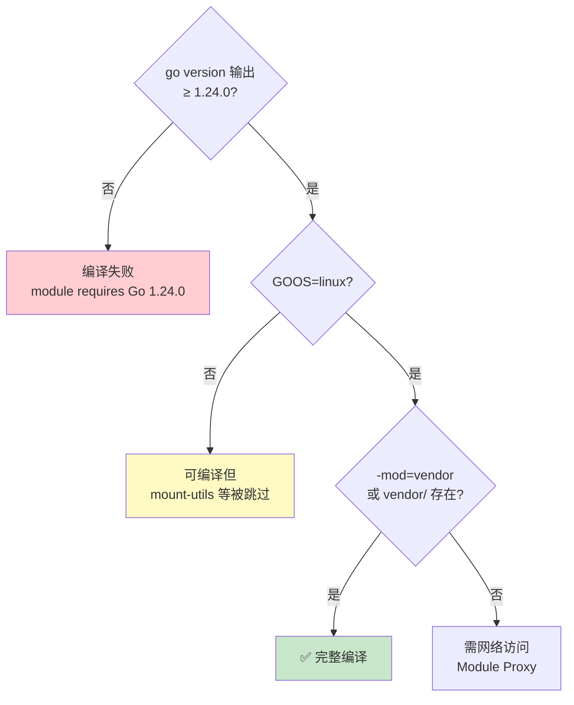

本页面是阿里云 CSI 驱动开发者环境搭建的**实操指南**。你将理解项目如何通过 Go Modules + Vendor 双重机制锁定 100 个依赖模块，学会解读 `vendor/modules.txt` 清单的结构语义，掌握从零搭建开发环境到执行依赖增删审计的完整工作流。本文聚焦**依赖管理层**，编译构建流程详见 [快速开始：编译构建与容器化部署](2-kuai-su-kai-shi-bian-yi-gou-jian-yu-rong-qi-hua-bu-shu)，版本兼容性深度策略详见 [vendor 依赖锁定与 Go 版本兼容性策略](26-vendor-yi-lai-suo-ding-yu-go-ban-ben-jian-rong-xing-ce-lue)。

## Go Modules 与 Vendor：双重锁定范式

阿里云 CSI 驱动采用 **Go Modules 作为依赖声明层、Vendor 目录作为依赖物化层**的双重架构。这一设计并非冗余——它解决的是 Go 生态中两个正交的问题：可复现性与离线可用性。

**Go Modules** 通过项目根目录的 `go.mod` 文件声明模块路径和所有依赖的语义化版本。当执行 `go mod tidy` 时，Go 工具链会解析依赖图、计算 MVS（Minimal Version Selection）选择的最小兼容版本，并将结果写入 `go.sum` 文件进行哈希校验。然而，Modules 模式依赖**网络可达的 Module Proxy**（如 `proxy.golang.org` 或阿里云 `goproxy.cn`），在离线或受限网络环境下无法工作。

**Vendor 模式**通过 `go mod vendor` 命令将所有依赖源码物理拷贝到项目内的 `vendor/` 目录，彻底消除运行时对网络的依赖。阿里云 CSI 驱动的 `vendor/` 目录包含 3675 个 Go 源文件，总计约 51 MB，覆盖了从阿里云 SDK 到 Kubernetes 客户端库的全部依赖代码。编译时只需指定 `-mod=vendor` 参数，Go 工具链便会直接使用 `vendor/` 中的代码，不再查询 Module Proxy。

Sources: [modules.txt](vendor/modules.txt#L1-L890)

### 依赖解析流程



整个工作流的核心枢纽是 `vendor/modules.txt`——这份 890 行的清单文件由 `go mod vendor` 自动生成，是 vendor 目录的**权威索引**。它记录了每个依赖模块的导入路径、锁定版本、Go 版本要求以及从该模块导入的具体包列表。

Sources: [modules.txt](vendor/modules.txt#L1-L890)

## vendor/modules.txt 清单解析

理解 `modules.txt` 的结构是掌握项目依赖关系的关键。每个模块在文件中遵循严格的四段式格式：

```
# github.com/container-storage-interface/spec v1.10.0          ← 模块路径 + 锁定版本
## explicit; go 1.18                                           ← 导入标记 + Go 版本要求
github.com/container-storage-interface/spec/lib/go/csi         ← 项目导入的包路径
```

**第一行**以 `#` 开头，声明模块的导入路径和语义化版本号。版本号可以是正式 Tag（如 `v1.10.0`）或伪版本（pseudo-version，如 `v0.0.0-20251202230838-ff82c1b0f217`，格式为 `v0.0.0-UTC时间戳-Commit前12位`）。

**第二行**以 `##` 开头，包含两类信息。`explicit` 关键字表示该模块被主模块（即 CSI 驱动本身）**直接导入**——Go 1.17+ 引入此标记以区分直接依赖与间接依赖。`go X.Y.Z` 表示该模块自身声明的最低 Go 版本要求，Go 工具链据此进行兼容性校验。

**后续行**是项目实际导入的包路径列表。例如 `csi-lib-utils` 模块只导入了 `protosanitizer` 这一个包，意味着项目仅使用了该库的 gRPC 消息脱敏功能。

Sources: [modules.txt](vendor/modules.txt#L85-L88), [modules.txt](vendor/modules.txt#L186-L188)

### 项目依赖全景：100 个模块的分层架构

从 `modules.txt` 的 100 个模块中，我们可以清晰地识别出项目的七层技术栈架构。以下是按功能域分类的完整依赖矩阵：

| 技术层次 | 模块 | 版本 | Go 要求 | 用途 |
|---------|------|------|---------|------|
| **CSI 协议** | `container-storage-interface/spec` | v1.10.0 | 1.18 | CSI gRPC 接口定义 |
| | `kubernetes-csi/csi-lib-utils` | v0.7.1 | 1.12 | gRPC 消息脱敏工具 |
| | `kubernetes-csi/external-snapshotter/client/v8` | v8.4.0 | 1.22 | VolumeSnapshot CRD 客户端 |
| **阿里云 SDK** | `alibabacloud-go/ecs-20140526/v7` | v7.8.0 | 1.14 | ECS 云盘 API |
| | `alibabacloud-go/nas-20170626/v4` | v4.2.0 | 1.14 | NAS 文件系统 API |
| | `alibabacloud-go/ens-20171110/v3` | v3.0.2 | 1.15 | ENS 边缘存储 API |
| | `alibabacloud-go/eflo-controller-20221215/v3` | v3.0.0 | 1.14 | Eflo 弹性网络 API |
| | `alibabacloud-go/sts-20150401/v2` | v2.0.4 | 1.14 | STS 临时令牌 API |
| | `aliyun/credentials-go` | v1.4.10 | 1.14 | 多种凭证认证 |
| | `aliyun/alibaba-cloud-sdk-go` | v1.63.107 | 1.13 | DFS 分布式文件 SDK |
| **Kubernetes** | `k8s.io/api` | v0.32.6 | 1.23 | K8s API 类型定义 |
| | `k8s.io/client-go` | v0.32.6 | 1.23 | K8s API 客户端 |
| | `k8s.io/apimachinery` | v0.32.6 | 1.23 | 序列化与运行时工具 |
| | `k8s.io/mount-utils` | v0.32.6 | 1.23 | 文件系统挂载/格式化 |
| | `k8s.io/kubelet` | v0.32.6 | 1.23 | Volume Stats 上报 |
| | `k8s.io/component-base` | v0.32.6 | 1.23 | Feature Gate / 版本 / 指标 |
| | `k8s.io/klog/v2` | v2.130.1 | 1.18 | 结构化日志 |
| **gRPC/Protobuf** | `google.golang.org/grpc` | v1.79.3 | 1.24 | gRPC 服务端/客户端 |
| | `google.golang.org/protobuf` | v1.36.10 | 1.23 | Protobuf 编解码 |
| | `golang/protobuf` | v1.5.4 | 1.17 | 旧版 Protobuf 兼容 |
| | `gogo/protobuf` | v1.3.2 | 1.15 | K8s 序列化优化 |
| **CLI/命令行** | `spf13/cobra` | v1.8.1 | 1.15 | 子命令框架 |
| | `spf13/pflag` | v1.0.5 | 1.12 | POSIX 风格命令行标志 |
| **可观测性** | `prometheus/client_golang` | v1.19.1 | 1.20 | Prometheus 指标采集 |
| | `go.opentelemetry.io/otel` | v1.41.0 | 1.24 | 分布式链路追踪 |
| | `go.uber.org/zap` | v1.27.0 | 1.19 | 高性能结构化日志 |
| | `sirupsen/logrus` | v1.9.4 | 1.17 | 兼容性日志库 |
| **测试** | `stretchr/testify` | v1.11.1 | 1.17 | 断言式单元测试 |
| | `golang/mock` | v1.6.0 | 1.11 | 接口 Mock 与代码生成 |
| | `jarcoal/httpmock` | v1.3.1 | 1.18 | HTTP 请求 Mock |
| **网络/系统** | `google/nftables` | v0.3.0 | 1.21 | nftables 防火墙规则 |
| | `mdlayher/netlink` | v1.7.3 | 1.21 | Linux Netlink 内核通信 |
| | `go-ping/ping` | v0.0.0-* | 1.14 | ICMP 网络连通性检测 |

值得注意的是，全部 100 个模块在 `modules.txt` 中均标记为 `## explicit`，这意味着每一个模块都被 CSI 驱动源码直接导入。这一特征在 Go 1.17+ 的 module graph pruning 机制下，意味着项目的间接依赖已经被裁剪——`go mod tidy` 已经将所有传递依赖提升为显式声明，消除了隐式版本漂移风险。

Sources: [modules.txt](vendor/modules.txt#L1-L890)

## 开发环境搭建：从零到可编译

### 前置条件

搭建开发环境前，需要准备以下工具链。项目的 Go 版本下限由依赖图中的最高版本要求决定——14 个显式依赖声明了 `go 1.24.0` 的最低版本要求，因此你的本地 Go 工具链必须不低于此版本。

| 工具 | 最低版本 | 安装方式 | 验证命令 |
|------|---------|---------|---------|
| Go 工具链 | **1.24.0** | [go.dev/dl](https://go.dev/dl/) 或 `gvm install go1.24` | `go version` |
| Git | 任意 | 系统包管理器 | `git --version` |
| Make（可选） | 任意 | 系统包管理器 | `make --version` |
| Docker（可选） | 20.10+ | [docker.com](https://docker.com) | `docker --version` |

对 Go 1.24.0 的硬性要求来自 `golang.org/x/sys`（v0.39.0）、`golang.org/x/net`（v0.48.0）、`google.golang.org/grpc`（v1.79.3）、`go.opentelemetry.io/otel`（v1.41.0）等核心依赖。低于此版本将触发编译时错误 `module requires Go 1.24.0`。

Sources: [modules.txt](vendor/modules.txt#L317-L318), [modules.txt](vendor/modules.txt#L341-L342), [modules.txt](vendor/modules.txt#L374-L375), [modules.txt](vendor/modules.txt#L285-L286)

### 环境搭建步骤

```bash
# 1. 克隆仓库
git clone <repo-url> alibaba-cloud-csi-driver
cd alibaba-cloud-csi-driver

# 2. 配置 Go Module Proxy（中国大陆开发者推荐）
export GOPROXY=https://goproxy.cn,direct
export GONOSUMCHECK=*

# 3. 设置 GOFLAGS 默认使用 vendor 模式（可选，简化日常命令）
export GOFLAGS=-mod=vendor

# 4. 验证 vendor 完整性
go mod verify

# 5. 交叉编译验证（目标平台为 Linux）
CGO_ENABLED=0 GOOS=linux GOARCH=amd64 go build -mod=vendor -o /dev/null .
```

**`GOFLAGS=-mod=vendor`** 是一个关键的环境变量配置。设置后，所有 `go build`、`go test`、`go vet` 命令自动使用 vendor 目录，无需每次手动传入 `-mod=vendor` 参数。如果不设置此变量且项目根目录存在 `vendor/` 目录，Go 1.14+ 默认行为也会自动启用 vendor 模式——但显式设置可以消除歧义。

Sources: [modules.txt](vendor/modules.txt#L1-L890)

### Vendor 目录物理结构

项目的 `vendor/` 目录按照 Go 模块路径的层级结构组织源码。以下是顶层目录布局：

```
vendor/
├── modules.txt              # 依赖清单（890 行，100 个模块的索引）
├── github.com/              # GitHub 托管的依赖（7 个模块目录）
│   ├── spf13/               # cobra + pflag（CLI 框架）
│   ├── stretchr/            # testify（测试断言）
│   ├── prometheus/          # procfs（系统指标采集）
│   ├── sirupsen/            # logrus（日志库）
│   ├── tjfoc/               # gmsm（国密算法 SM3）
│   └── x448/                # float16（浮点数处理）
├── k8s.io/                  # Kubernetes 生态（10 个模块）
│   ├── api/                 # API 类型定义
│   ├── apimachinery/        # 序列化与运行时
│   ├── client-go/           # API 客户端
│   ├── component-base/      # Feature Gate / 版本 / 指标
│   ├── klog/v2/             # 结构化日志
│   ├── kube-openapi/        # OpenAPI 规范
│   ├── kubelet/             # Volume Stats 接口
│   ├── mount-utils/         # 文件系统挂载工具
│   └── utils/               # 通用工具函数
├── google.golang.org/       # Google 托管的依赖
│   ├── grpc/                # gRPC 框架（53 个子包）
│   ├── protobuf/            # Protocol Buffers 运行时
│   └── genproto/            # 生成的 RPC 类型
├── go.opentelemetry.io/     # OpenTelemetry 链路追踪
├── go.uber.org/             # Zap 日志 + multierr
├── golang.org/x/            # Go 扩展库（8 个模块）
├── gopkg.in/                # 第三方包（4 个模块）
└── sigs.k8s.io/             # Kubernetes SIG 工具库
```

`vendor/` 目录中的每个模块保留了原始仓库的 `LICENSE` 文件（项目中共有 41 个 LICENSE 文件），满足开源许可证的分发要求。这是 vendor 模式相比 Module Cache 的一个额外优势——依赖的许可证文件随项目源码一起分发，便于法务审计。

Sources: [modules.txt](vendor/modules.txt#L1-L890)

## 依赖版本管理：语义化版本与伪版本

### 版本类型识别

项目 100 个依赖模块使用了三种版本标识模式。理解这些模式对于依赖升级决策至关重要：

| 版本模式 | 格式 | 示例 | 含义 | 数量 |
|---------|------|------|------|------|
| **正式 Tag** | `vMAJOR.MINOR.PATCH` | `v1.10.0` | 正式发布版本，遵循 SemVer | ~85 |
| **伪版本** | `v0.0.0-YYYYMMDD-XXXXXXXXXXXX` | `v0.0.0-20251202230838-ff82c1b0f217` | 未发布 Tag 的 Commit 快照 | ~7 |
| **预发布 Tag** | `vX.Y.Z-pre` | `v1.2.1-0.20220228012449-10b1cf09e00b` | 预发布版本 + 后续 Commit | ~3 |
| **无版本** | `## explicit`（无 `go` 声明） | `github.com/davecgh/go-spew` | 模块未声明 Go 版本 | ~8 |

**伪版本**（pseudo-version）是 Go Modules 的独特机制。当一个模块的最新 Commit 尚未打 Tag 时，`go get` 会生成一个伪版本号，将 UTC 时间戳和 Commit SHA 嵌入版本字符串。项目中的 7 个伪版本依赖包括 `k8s.io/kube-openapi`、`k8s.io/utils`、`sigs.k8s.io/json`、`google.golang.org/genproto/googleapis/rpc` 等——这些库是 Kubernetes/Google 生态中持续迭代但发布节奏较慢的基础设施库。

Sources: [modules.txt](vendor/modules.txt#L843-L844), [modules.txt](vendor/modules.txt#L860-L861), [modules.txt](vendor/modules.txt#L371-L372)

### Kubernetes 生态版本对齐策略

项目中的 Kubernetes 生态模块严格对齐到 **v0.32.6** 版本线：

| 模块 | 版本 | 对应 K8s 版本 |
|------|------|-------------|
| `k8s.io/api` | v0.32.6 | Kubernetes 1.32.6 |
| `k8s.io/apimachinery` | v0.32.6 | Kubernetes 1.32.6 |
| `k8s.io/client-go` | v0.32.6 | Kubernetes 1.32.6 |
| `k8s.io/component-base` | v0.32.6 | Kubernetes 1.32.6 |
| `k8s.io/kubelet` | v0.32.6 | Kubernetes 1.32.6 |
| `k8s.io/mount-utils` | v0.32.6 | Kubernetes 1.32.6 |

这种严格对齐是 Kubernetes 生态的**强制约束**——`k8s.io/*` 模块在同一 minor 版本内保持 API 兼容性，但跨 minor 版本可能引入 breaking change。将所有 K8s 模块锁定在同一 patch 版本，确保了类型系统的一致性（例如 `client-go` 的 `Clientset` 必须与 `api` 的类型定义匹配）。

Sources: [modules.txt](vendor/modules.txt#L493-L494), [modules.txt](vendor/modules.txt#L552-L553), [modules.txt](vendor/modules.txt#L608-L609), [modules.txt](vendor/modules.txt#L814-L815), [modules.txt](vendor/modules.txt#L854-L855), [modules.txt](vendor/modules.txt#L857-L858)

## 日常依赖管理操作

### 添加新依赖

在 vendor 模式下，添加新依赖需要两步操作——先通过 Module Proxy 解析版本，再将源码同步到 vendor 目录：

```bash
# 步骤 1：获取依赖（需网络访问 Module Proxy）
# 临时切换到 mod 模式以执行 go get
GOFLAGS=-mod=mod go get github.com/example/newlib@v1.2.0

# 步骤 2：同步到 vendor 目录
go mod vendor

# 步骤 3：验证 vendor 一致性
go mod verify
```

**关键点**：`go get` 命令在 vendor 模式下会被跳过（Go 1.14+ 行为）。因此必须通过 `GOFLAGS=-mod=mod` 临时切换到 Module 模式执行版本解析，然后通过 `go mod vendor` 将结果物化到 vendor 目录。

### 升级依赖版本

```bash
# 升级单个依赖到指定版本
GOFLAGS=-mod=mod go get k8s.io/client-go@v0.33.0
go mod vendor

# 升级到最新 patch 版本（保持 minor 不变）
GOFLAGS=-mod=mod go get k8s.io/api@v0.32.7
go mod vendor

# 批量升级所有 Kubernetes 模块（必须保持版本一致）
GOFLAGS=-mod=mod go get \
  k8s.io/api@v0.33.0 \
  k8s.io/apimachinery@v0.33.0 \
  k8s.io/client-go@v0.33.0 \
  k8s.io/component-base@v0.33.0 \
  k8s.io/kubelet@v0.33.0 \
  k8s.io/mount-utils@v0.33.0
go mod vendor
```

**升级 Kubernetes 模块时必须批量操作**——单独升级 `k8s.io/api` 而不升级 `k8s.io/client-go` 会导致 API 类型与客户端方法不匹配的编译错误。建议使用一条 `go get` 命令同时指定所有 `k8s.io/*` 模块的相同版本。

Sources: [modules.txt](vendor/modules.txt#L493-L613), [modules.txt](vendor/modules.txt#L857-L859)

### 依赖审计与清理

```bash
# 检查是否有未使用的依赖（需要临时切换到 mod 模式）
GOFLAGS=-mod=mod go mod tidy
go mod vendor

# 查看依赖图（可视化传递依赖关系）
GOFLAGS=-mod=mod go mod graph

# 检查已知安全漏洞
GOFLAGS=-mod=mod go vuln check ./...

# 验证 vendor 完整性与哈希
go mod verify
```

`go mod tidy` 是依赖清理的核心命令。它会扫描所有 Go 源文件（包括测试文件），移除 `go.mod` 中声明但未被任何代码导入的依赖，同时添加代码中已使用但未在 `go.mod` 中声明的依赖。执行 `tidy` 后必须重新执行 `go mod vendor` 以同步 vendor 目录。

Sources: [modules.txt](vendor/modules.txt#L1-L890)

### 依赖操作速查表

| 操作场景 | 命令序列 | 前置条件 | 对 vendor 的影响 |
|---------|---------|---------|----------------|
| 添加新依赖 | `GOFLAGS=-mod=mod go get <pkg>@<ver>` → `go mod vendor` | 网络可达 Module Proxy | vendor 新增模块目录 |
| 升级依赖版本 | `GOFLAGS=-mod=mod go get <pkg>@<new-ver>` → `go mod vendor` | 网络可达 Module Proxy | vendor 更新对应目录 |
| 降级依赖版本 | `GOFLAGS=-mod=mod go get <pkg>@<old-ver>` → `go mod vendor` | 网络可达 Module Proxy | vendor 回退对应目录 |
| 清理未使用依赖 | `GOFLAGS=-mod=mod go mod tidy` → `go mod vendor` | 网络可达 Module Proxy | vendor 移除多余目录 |
| 验证完整性 | `go mod verify` | 无 | 不修改 vendor |
| 查看依赖图 | `GOFLAGS=-mod=mod go mod graph` | 无 | 不修改 vendor |

Sources: [modules.txt](vendor/modules.txt#L1-L890)

## Go 版本兼容性约束

### 依赖图中的版本要求分布

`modules.txt` 中每个模块的 `## explicit; go X.Y.Z` 标记揭示了项目依赖图中的 Go 版本约束分布。以下是 100 个显式依赖的 Go 版本要求统计：

| Go 版本要求 | 模块数量 | 典型模块 |
|------------|---------|---------|
| **go 1.24.0** | **14** | `grpc`, `golang.org/x/sys`, `otel`, `golang.org/x/net`, `prometheus/procfs` |
| go 1.23 / 1.23.0 | 8 | `k8s.io/api`, `client-go`, `protobuf` v1.36.10 |
| go 1.21 | 6 | `nftables`, `netlink`, `rogpeppe/go-internal` |
| go 1.20 | 5 | `prometheus/client_golang`, `go-openapi/*` |
| go 1.19 | 4 | `zap`, `multierr`, `containerd/ttrpc` |
| go 1.18 | 9 | `CSI spec`, `klog/v2`, `credentials-go`, `logr` |
| go 1.14-1.17 | 30 | 阿里云 SDK 系列, `cobra`, `testify` |
| go 1.11-1.13 | 16 | `alibaba-cloud-sdk-go`, `pflag`, `json-iterator` |
| 无声明 | 8 | `go-spew`, `endpoint-util` 等 |

**最高版本要求 `go 1.24.0`** 决定了项目的 Go 工具链下限。Go 的 MVS 算法在编译时会检查所有依赖的 `go` 指令，如果当前工具链版本低于任何依赖的要求，编译将被拒绝并报告具体的冲突模块。

Sources: [modules.txt](vendor/modules.txt#L285-L286), [modules.txt](vendor/modules.txt#L311-L312), [modules.txt](vendor/modules.txt#L317-L318), [modules.txt](vendor/modules.txt#L341-L342), [modules.txt](vendor/modules.txt#L358-L359), [modules.txt](vendor/modules.txt#L374-L375)

### 版本兼容性决策树



项目的 mount-utils 库包含 `mount_linux.go` 和 `resizefs_linux.go` 等带有 `//go:build linux` 构建约束的文件。在非 Linux 平台上编译时，这些文件会被跳过，不会导致编译失败，但与挂载相关的代码路径无法在开发机上测试。开发者应在 macOS/Windows 上编写代码，在 Linux 环境（或 Docker 容器）中进行集成测试。

Sources: [modules.txt](vendor/modules.txt#L857-L859)

## IDE 与工具链配置

### GoLand / IntelliJ IDEA

| 配置项 | 推荐值 | 路径 |
|--------|-------|------|
| Go 版本 | 1.24.0 | Preferences → Languages → Go → GOROOT |
| Module 模式 | Vendor | Preferences → Languages → Go → Go Modules → Vendor |
| Index 排除 | `vendor/` 可选排除以加速索引 | Preferences → Directories → Excluded |
| 代码补全 | 启用 vendor 感知 | 默认开启 |

### VS Code

```jsonc
// .vscode/settings.json
{
    "go.goroot": "/usr/local/go",           // Go 1.24.0 安装路径
    "go.buildFlags": ["-mod=vendor"],        // 强制 vendor 模式
    "go.testFlags": ["-mod=vendor"],
    "go.vetFlags": ["-mod=vendor"],
    "go.useLanguageServer": true,
    "gopls.env": {
        "GOFLAGS": "-mod=vendor"
    }
}
```

将 `GOFLAGS=-mod=vendor` 传递给 `gopls` 语言服务器至关重要——否则 IDE 的自动补全和类型检查可能会尝试从 Module Cache 解析依赖，导致与 vendor 目录中实际代码不一致的提示。

Sources: [modules.txt](vendor/modules.txt#L1-L890)

### Module Proxy 配置

对于中国大陆开发者，配置阿里云 Module Proxy 可显著提升依赖下载速度：

```bash
# ~/.bashrc 或 ~/.zshrc
export GOPROXY=https://goproxy.cn,direct
export GOSUMDB=sum.golang.google.cn
```

`GOPROXY` 的 `direct` 回退值表示：当 Module Proxy 上不存在某模块时，Go 工具链会尝试直接从源仓库（如 `github.com`）拉取。这在访问私有模块或 Proxy 尚未同步最新版本时很有用。

## 常见问题与排障

### 问题 1：编译报错 `module requires Go 1.24.0`

**原因**：本地 Go 版本低于 1.24.0，不满足 `golang.org/x/sys`、`google.golang.org/grpc` 等核心依赖的版本要求。

**解决**：升级 Go 工具链至 1.24.0+。

```bash
# 使用 gvm 管理多版本
gvm install go1.24.0
gvm use go1.24.0 --default

# 或使用官方安装器
# macOS: brew install go@1.24
# Linux: 从 https://go.dev/dl/ 下载
```

Sources: [modules.txt](vendor/modules.txt#L341-L342), [modules.txt](vendor/modules.txt#L374-L375)

### 问题 2：`go build` 报错 `no required module provides package`

**原因**：vendor 目录不完整或与 `go.mod` 不同步。

**解决**：重新执行 `go mod vendor`。

```bash
GOFLAGS=-mod=mod go mod tidy
go mod vendor
go mod verify
```

### 问题 3：升级 K8s 模块后编译报错类型不匹配

**原因**：单独升级了部分 `k8s.io/*` 模块，导致 API 类型与客户端版本不一致。

**解决**：将所有 `k8s.io/*` 模块统一升级到相同版本。

```bash
GOFLAGS=-mod=mod go get \
  k8s.io/api@v0.33.0 \
  k8s.io/apimachinery@v0.33.0 \
  k8s.io/client-go@v0.33.0 \
  k8s.io/component-base@v0.33.0 \
  k8s.io/kubelet@v0.33.0 \
  k8s.io/mount-utils@v0.33.0
go mod vendor
```

Sources: [modules.txt](vendor/modules.txt#L493-L613)

### 问题 4：`go mod vendor` 后 vendor 目录体积过大

**原因**：部分依赖包含了测试数据、文档或示例代码。

**解决**：`go mod vendor` 默认会裁剪测试文件和无关包。如果仍需进一步优化，可考虑使用 `.gitignore` 或 `vendor-exclude` 策略，但这可能影响 `go test` 的执行。

### 排障速查表

| 症状 | 可能原因 | 诊断命令 | 解决方案 |
|------|---------|---------|---------|
| `module requires Go X.Y` | Go 版本过低 | `go version` | 升级 Go 工具链 |
| `no required module provides` | vendor 不完整 | `go mod verify` | `go mod vendor` |
| `inconsistent versions` | go.sum 与 go.mod 冲突 | `GOFLAGS=-mod=mod go mod tidy` | 重新 tidy + vendor |
| `checksum mismatch` | 依赖被篡改或 Proxy 缓存错误 | `go mod verify` | 清除 `GOMODCACHE` 并重新拉取 |
| `build constraints exclude all files` | 平台不匹配（非 Linux） | `GOOS=linux go build` | 交叉编译为目标平台 |

Sources: [modules.txt](vendor/modules.txt#L1-L890)

## 延伸阅读

掌握了开发环境搭建与依赖管理后，建议按以下顺序继续深入：

- **编译与部署**：[快速开始：编译构建与容器化部署](2-kuai-su-kai-shi-bian-yi-gou-jian-yu-rong-qi-hua-bu-shu)——学习 ldflags 版本注入、Docker 镜像构建和 Kubernetes 双组件部署
- **架构总览**：[项目整体架构总览与核心组件关系](4-xiang-mu-zheng-ti-jia-gou-zong-lan-yu-he-xin-zu-jian-guan-xi)——理解 Controller/Node 双组件架构与 gRPC 通信模型
- **版本策略**：[vendor 依赖锁定与 Go 版本兼容性策略](26-vendor-yi-lai-suo-ding-yu-go-ban-ben-jian-rong-xing-ce-lue)——深入理解 MVS 算法、版本对齐策略与长期维护方案
- **测试体系**：[测试体系：testify 断言与 gomock 模拟框架](25-ce-shi-ti-xi-testify-duan-yan-yu-gomock-mo-ni-kuang-jia)——基于 testify（v1.11.1）和 gomock（v1.6.0）的单元测试实践