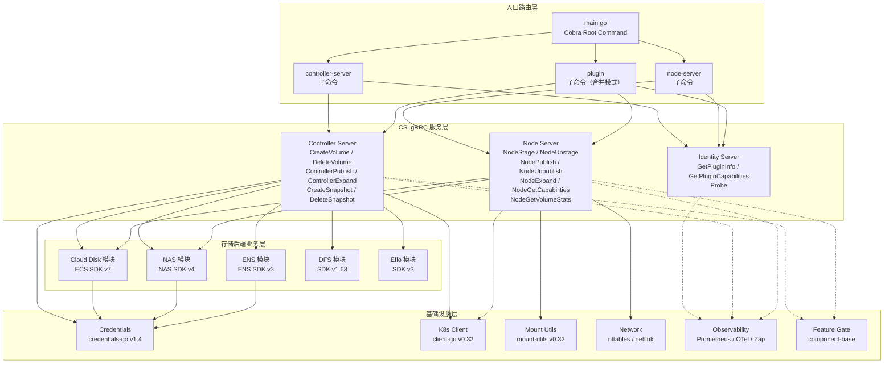
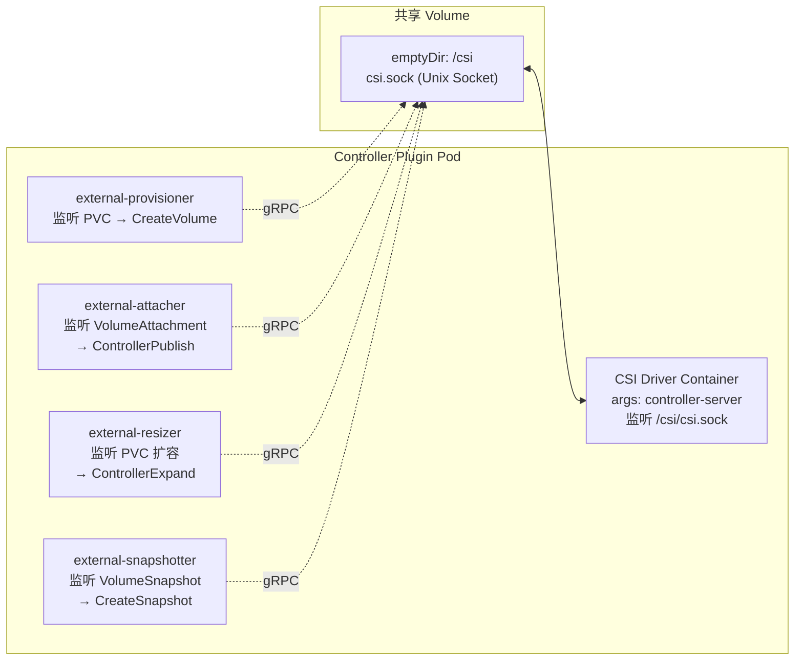
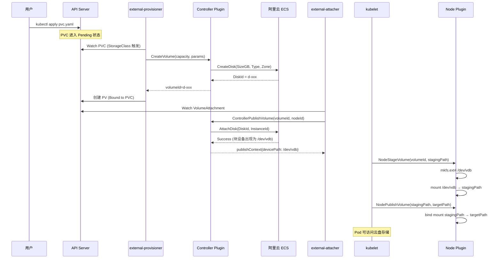

本页面从**架构设计哲学**出发，深入剖析阿里云 CSI 驱动的内部分层结构、组件间交互机制以及卷操作的全链路数据流。如果你已阅读 [项目概览](1-xiang-mu-gai-lan-a-li-yun-csi-qu-dong-he-xin-jie-zhi-yu-ding-wei) 中的技术栈全景和 [快速开始](2-kuai-su-kai-shi-bian-yi-gou-jian-yu-rong-qi-hua-bu-shu) 中的双组件部署模型，那么本页将带你深入理解这些组件**如何在代码层面协同工作**——从一个 PVC 的创建请求到云盘被挂载到 Pod 中，中间经历了哪些组件、通过什么协议通信、各自承担什么职责。

## 架构设计哲学：关注点分离与插件化

阿里云 CSI 驱动的架构核心在于**严格的关注点分离**（Separation of Concerns）。整个项目遵循四个关键设计原则，这些原则直接决定了代码的组织方式和组件间的边界划分：

**第一，协议与实现解耦。** CSI 规范（v1.10.0）定义了一组标准的 gRPC 接口——Identity、Controller、Node 三组服务——而驱动的所有业务逻辑都隐藏在这些接口的实现背后。这意味着无论底层是 ECS 云盘、NAS 文件系统还是 ENS 边缘存储，对外暴露的调用契约完全一致。gRPC 的 `ServiceDesc` 结构体充当了协议与实现之间的桥梁：它通过 `HandlerType` 字段做接口类型检查，确保注册的实现体满足 CSI 规范定义的方法签名，同时将具体方法处理器（`MethodHandler`）映射到对应的服务实现。这种设计使得 kubelet 和 sidecar 容器完全不需要知道驱动的内部存储后端类型。

Sources: [server.go](vendor/google.golang.org/grpc/server.go#L105-L124), [server.go](vendor/google.golang.org/grpc/server.go#L752-L792)

**第二，控制面与数据面隔离。** Controller Plugin 负责与阿里云 OpenAPI 交互——执行卷的创建、删除、扩容、快照等"管理类"操作；Node Plugin 负责在节点本地执行文件系统格式化、挂载/卸载、容量统计等"运行时"操作。这两个组件之间**没有任何直接通信**——它们各自独立监听 gRPC 请求，由 Kubernetes 的外部控制器（external-provisioner、external-attacher 等）作为中介协调。这种隔离确保了数据面操作（如 `mount`）的故障不会影响控制面的决策逻辑，反之亦然。

**第三，存储后端可插拔。** 五种存储服务（ECS、NAS、ENS、DFS、Eflo）各自拥有独立的业务逻辑模块，但共享同一套 CSI 接口契约和基础设施层（凭证管理、Kubernetes 客户端、可观测性）。Cobra 的子命令架构使得不同存储类型可以在同一个二进制文件中按需启动，而不需要为每种存储构建独立的镜像。

**第四，跨切面关注点统一注入。** 日志（klog/Zap）、指标（Prometheus）、链路追踪（OpenTelemetry）、特性开关（FeatureGate）等横切关注点不是散落在各处，而是通过 gRPC 拦截器（Interceptor）和 FeatureGate 接口统一注入到所有 CSI 服务调用链中。gRPC 的 `serverOptions` 结构体提供了 `chainUnaryInts`（链式一元拦截器）和 `chainStreamInts`（链式流拦截器）字段，使得指标采集和日志记录可以在请求处理前/后自动执行。

Sources: [server.go](vendor/google.golang.org/grpc/server.go#L157-L175), [feature_gate.go](vendor/k8s.io/component-base/featuregate/feature_gate.go#L108-L150)

## 分层架构模型：四层纵深

基于以上设计哲学，阿里云 CSI 驱动在代码组织上形成了清晰的四层纵深架构。每一层都有明确的职责边界，上层依赖下层提供的抽象，下层对上层保持无感知。

### 第一层：入口路由层（Cobra 子命令分发）

入口路由层由 **Cobra**（v1.8.1）命令行框架驱动。`Command` 结构体的 `Use`、`RunE`、`PersistentPreRunE` 等字段定义了每个子命令的行为和初始化回调链。当用户执行 `csi-driver controller-server` 或 `csi-driver node-server` 时，Cobra 解析子命令名称，执行对应的 `RunE` 回调，该回调负责创建 gRPC Server、注册 CSI 服务实现并启动 Unix Socket 监听。

Cobra 的 `Command` 结构体支持命令树嵌套——父命令的 `PersistentPreRunE` 会在子命令执行前自动调用，这意味着全局初始化逻辑（如加载 FeatureGate 配置、初始化日志系统、验证凭证环境变量）可以集中定义在根命令上，所有子命令自动继承。同时，`Version` 字段配合编译时 ldflags 注入的版本信息，使 `--version` 标志自动可用。

Sources: [command.go](vendor/github.com/spf13/cobra/command.go#L47-L143), [cobra.go](vendor/github.com/spf13/cobra/cobra.go#L42-L50)

### 第二层：CSI gRPC 服务层

这一层实现了 CSI 规范定义的三组 gRPC 服务。gRPC 的 `RegisterService` 方法是注册的核心入口——它接收一个 `ServiceDesc` 描述符和一个实现体（`impl`），通过 `reflect.TypeOf(sd.HandlerType).Elem()` 检查实现体是否满足接口契约，然后将方法名到处理器的映射存入内部的 `serviceInfo` 结构体。当 gRPC 客户端（kubelet 或 sidecar）发起调用时，Server 根据 ServiceName 和 MethodName 查找对应的处理器并执行。

三个子服务的职责分工如下：

| 服务 | CSI 方法 | 调用方 | 运行位置 |
|------|---------|--------|---------|
| **Identity** | `GetPluginInfo`、`GetPluginCapabilities`、`Probe` | kubelet / 所有 sidecar | Controller + Node |
| **Controller** | `CreateVolume`、`DeleteVolume`、`ControllerPublishVolume`、`ControllerUnpublishVolume`、`ControllerExpandVolume`、`CreateSnapshot`、`DeleteSnapshot`、`ListVolumes`、`GetCapacity` | external-provisioner / attacher / resizer / snapshotter | 仅 Controller |
| **Node** | `NodeStageVolume`、`NodeUnstageVolume`、`NodePublishVolume`、`NodeUnpublishVolume`、`NodeExpandVolume`、`NodeGetCapabilities`、`NodeGetInfo`、`NodeGetVolumeStats` | kubelet | 仅 Node |

Identity 服务是**必选服务**——无论 Controller 还是 Node Plugin 都必须实现它，因为 kubelet 和 sidecar 需要通过 `GetPluginInfo` 获取驱动名称和版本，通过 `GetPluginCapabilities` 声明支持的功能集（如是否支持 Controller 服务、是否支持卷组快照等）。

Sources: [server.go](vendor/google.golang.org/grpc/server.go#L752-L792), [server.go](vendor/google.golang.org/grpc/server.go#L126-L155), [modules.txt](vendor/modules.txt#L85-L87)

### 第三层：存储后端业务层

Controller Server 收到 `CreateVolume` 请求后，需要决定调用哪个存储后端的 API。这一层封装了五种阿里云存储服务的业务逻辑，每种服务对应一个独立的阿里云 SDK：

| 后端模块 | SDK 模块 | Controller 侧操作 | Node 侧操作 |
|---------|---------|------------------|------------|
| **Cloud Disk** | `alibabacloud-go/ecs-20140526/v7` | 创建/删除云盘、挂载/卸载到 ECS 实例、云盘扩容、磁盘快照 | iSCSI/virtio 识别块设备、ext4/xfs 格式化、`mount` 挂载 |
| **NAS** | `alibabacloud-go/nas-20170626/v4` | 创建/删除文件系统、创建/删除挂载点 | NFS 协议挂载（`mount -t nfs`） |
| **ENS** | `alibabacloud-go/ens-20171110/v3` | 创建/删除边缘存储卷 | 边缘节点本地挂载 |
| **DFS** | `alibaba-cloud-sdk-go/services/dfs` | 创建/删除 DFS 文件系统、快照管理 | DFS 客户端挂载 |
| **Eflo** | `alibabacloud-go/eflo-controller-20221215/v3` | 弹性网络适配器创建/配置 | 节点网络配置（nftables/netlink） |

值得注意的是，Node 侧的操作路径与 Controller 侧截然不同。Controller 侧通过阿里云 SDK 发送 HTTPS OpenAPI 请求到云端，而 Node 侧则通过 `mount-utils` 库调用操作系统级别的命令（`mount`、`mkfs.ext4`、`resize2fs`、`xfs_growfs`）在本地完成文件系统操作。两种路径共享凭证管理模块但不共享操作逻辑。

Sources: [modules.txt](vendor/modules.txt#L15-L20), [modules.txt](vendor/modules.txt#L27-L29), [modules.txt](vendor/modules.txt#L24-L26), [modules.txt](vendor/modules.txt#L18-L20), [mount.go](vendor/k8s.io/mount-utils/mount.go#L38-L89), [resizefs_linux.go](vendor/k8s.io/mount-utils/resizefs_linux.go#L45-L68)

### 第四层：基础设施层

基础设施层为上层提供通用的跨切面能力，所有存储后端模块和 CSI 服务都依赖这些能力：

**凭证管理**（`credentials-go` v1.4.10）是所有阿里云 SDK 调用的前提。它支持 AK/SK 静态密钥、STS 临时令牌、RAM 角色扮演、ECS 实例元数据等多种凭证获取方式，使得驱动能适配从开发环境到生产环境的不同安全模型。

**Kubernetes 客户端**（`client-go` v0.32.6）提供与 API Server 的交互能力。Controller Plugin 通过它查询 PV/PVC 对象状态、更新卷注解、与 StorageClass 交互；Node Plugin 通过它获取节点信息和 Pod 级别的存储配置。

**挂载工具**（`mount-utils` v0.32.6）封装了所有与 Linux 文件系统交互的系统调用。`mount.Interface` 接口定义了 `Mount`、`Unmount`、`IsMountPoint`、`GetMountRefs` 等核心方法，`ResizeFs` 结构体提供了在线扩容能力，支持 ext3/ext4（`resize2fs`）、XFS（`xfs_growfs`）、Btrfs（`btrfs filesystem resize`）三种文件系统的扩展操作。

**可观测性栈**横切所有层——Prometheus 采集 gRPC 请求延迟和卷操作指标，klog/Zap 输出结构化日志，OpenTelemetry 追踪跨组件调用链。这些能力的注入依赖于 gRPC Server 的拦截器链机制。

Sources: [modules.txt](vendor/modules.txt#L63-L72), [modules.txt](vendor/modules.txt#L608-L609), [mount.go](vendor/k8s.io/mount-utils/mount.go#L38-L89), [resizefs_linux.go](vendor/k8s.io/mount-utils/resizefs_linux.go#L45-L106), [feature_gate.go](vendor/k8s.io/component-base/featuregate/feature_gate.go#L108-L150)

## gRPC 通信机制：Unix Socket 与 Sidecar 模式

理解 CSI 驱动的架构，必须理解其 gRPC 通信的两种截然不同的模式。

### Node Plugin 侧：kubelet 直连模式

Node Plugin 在每个工作节点上以 DaemonSet 方式运行，暴露一个 Unix Domain Socket 文件（通常位于 `/var/lib/kubelet/plugins/<driver-name>/csi.sock`）。kubelet 作为 gRPC 客户端，通过这个本地 Socket 文件与 Node Plugin 通信。gRPC Server 的 `Serve` 方法接受一个 `net.Listener`，对于 Unix Socket 场景，这个 Listener 通过 `net.Listen("unix", socketPath)` 创建。

这种通信模式的**核心优势**在于完全避免了网络栈开销——所有通信在本地内核中完成，没有 TCP 连接建立、TLS 握手、网络路由等开销。同时，Unix Socket 的文件权限控制天然提供了安全隔离——只有拥有 Socket 文件访问权限的进程（即 kubelet）才能发起 gRPC 调用。

### Controller Plugin 侧：Sidecar 容器模式

Controller Plugin 采用了 Kubernetes CSI 生态的**标准 Sidecar 模式**。CSI 驱动容器与多个外部控制器容器（external-provisioner、external-attacher、external-resizer、external-snapshotter）运行在同一个 Pod 中，通过共享的 `emptyDir` 卷暴露 Unix Socket 文件。Sidecar 容器作为 gRPC 客户端，连接到同一 Pod 内 CSI 驱动容器的 Socket。

每个 Sidecar 容器监听特定的 Kubernetes API 资源，当资源状态变化时，将对应的 CSI gRPC 调用转发给 CSI 驱动。这种模式的精妙之处在于：**CSI 驱动本身不需要感知 Kubernetes 的控制器逻辑**——它只需要实现 CSI gRPC 接口，所有与 API Server 的交互逻辑由 Sidecar 容器承担。

Sources: [server.go](vendor/google.golang.org/grpc/server.go#L874-L916), [modules.txt](vendor/modules.txt#L189-L202)

## 卷生命周期全链路：从 PVC 到 Pod 挂载

为了将上述架构组件串联起来，让我们追踪一个**云盘卷从创建到挂载**的完整数据流。这个流程横跨 Controller Plugin、API Server、Node Plugin 三方，涉及 CSI 三组服务的多个方法调用。

### 第一阶段：卷创建（Controller 侧）

当用户提交 PVC 后，external-provisioner 通过 `client-go` 的 Watch 机制检测到 Pending 状态的 PVC，读取其关联的 StorageClass 参数（如云盘类型 `cloud_essd`、可用区 `cn-hangzhou-a`），然后通过 gRPC 调用 CSI 驱动的 `CreateVolume` 方法。Controller Plugin 内部的 Cloud Disk 模块接收到请求后，使用 `credentials-go` 获取阿里云凭证，通过 ECS SDK（`ecs-20140526/v7`）调用 `CreateDisk` API 创建云盘，返回磁盘 ID 作为 CSI Volume ID。

### 第二阶段：卷附加（Controller 侧 → Node 侧衔接）

Pod 调度到某节点后，VolumeAttachment 对象被创建。external-attacher 监听到此事件，调用 `ControllerPublishVolume`，Controller Plugin 通过 ECS API 将云盘挂载到目标 ECS 实例。此时，块设备以 `/dev/vdb`（或类似路径）出现在目标节点的 `/dev` 目录中。这是控制面与数据面的**衔接点**——此后所有操作都在节点本地完成。

### 第三阶段：卷挂载（Node 侧）

kubelet 检测到 Pod 需要存储卷，分两步调用 Node Plugin：

1. **`NodeStageVolume`**——将块设备格式化（`mkfs.ext4` 或 `mkfs.xfs`）并挂载到全局 staging 路径（`/var/lib/kubelet/plugins/kubernetes.io/csi/pv-xxx/globalmount`）。这一步通过 `mount-utils` 的 `Mount` 方法执行。staging 路径是**节点级**的——同一卷在该节点上无论被多少 Pod 引用，只会被 stage 一次。

2. **`NodePublishVolume`**——将 staging 路径以 bind mount 方式挂载到 Pod 的容器挂载路径（`/var/lib/kubelet/pods/xxx/volumes/kubernetes.io~csi/pv-xxx/mount`）。多个 Pod 引用同一卷时，每个 Pod 都有自己的 publish 路径，但共享同一个 staging 路径。

这种两阶段挂载机制（Stage + Publish）是 CSI 规范的核心设计——它优化了多 Pod 共享同一卷的场景，避免了重复的格式化和挂载操作。

Sources: [mount.go](vendor/k8s.io/mount-utils/mount.go#L38-L89), [resizefs_linux.go](vendor/k8s.io/mount-utils/resizefs_linux.go#L45-L68), [modules.txt](vendor/modules.txt#L15-L17)

## 卷扩容与快照：扩展操作路径

除了基本的创建-挂载-卸载-删除流程外，CSI 驱动还支持两个高级操作路径，它们各有独特的架构特征。

### 卷扩容（Volume Expansion）

扩容操作分为两个阶段，横跨 Controller 和 Node Plugin。用户修改 PVC 的 `spec.resources.requests.storage` 字段触发扩容流程后：

**Controller 阶段**：external-resizer 调用 `ControllerExpandVolume`，Controller Plugin 通过 ECS API 扩展云盘的存储容量（如从 100GB 扩展到 200GB）。注意，此阶段只是扩展了**云端块设备的逻辑容量**，节点上的文件系统尚未感知到变化。

**Node 阶段**：当 Pod 所在节点的 kubelet 检测到卷需要扩容时，调用 `NodeExpandVolume`。Node Plugin 使用 `mount-utils` 的 `ResizeFs` 结构体执行文件系统在线扩容。`Resize` 方法首先通过 `blkid` 检测文件系统格式，然后根据格式选择不同的工具——ext3/ext4 调用 `resize2fs`，XFS 调用 `xfs_growfs`，Btrfs 调用 `btrfs filesystem resize max`。`NeedResize` 方法通过比较设备大小与文件系统大小来决定是否需要执行扩容，容忍一个 block 的误差以避免浮点舍入问题。

Sources: [resizefs_linux.go](vendor/k8s.io/mount-utils/resizefs_linux.go#L45-L161)

### 卷快照（Volume Snapshot）

快照操作完全在 Controller 侧完成。external-snapshotter（v8.4.0）监听 `VolumeSnapshot` CRD 对象，当用户创建快照请求时，调用 CSI 的 `CreateSnapshot` 方法。Controller Plugin 通过对应存储服务的 API（ECS 的 `CreateSnapshot`、NAS 的 `CreateSnapshot` 等）创建快照。

项目引入了 `kubernetes-csi/external-snapshotter/client/v8`（v8.4.0）作为 VolumeSnapshot CRD 的客户端库，支持 `volumesnapshot/v1`、`volumegroupsnapshot/v1beta1` 和 `volumegroupsnapshot/v1beta2` 三种 API 版本。其中卷组快照（Volume Group Snapshot）是 CSI v1.10.0 规范引入的高级功能，允许对一组卷同时创建一致性快照。

Sources: [modules.txt](vendor/modules.txt#L189-L202)

## 跨切面组件：FeatureGate 与可观测性

### FeatureGate 特性开关

阿里云 CSI 驱动通过 `k8s.io/component-base/featuregate`（v0.32.6）实现了特性开关机制。`FeatureGate` 接口定义了 `Enabled(key Feature) bool` 方法，使得代码可以根据特性是否启用来走不同的逻辑分支。特性按照成熟度分为 `PreAlpha`、`Alpha`、`Beta`、`GA` 四个等级，其中 Alpha 和 Beta 特性可以通过 `--feature-gates` 命令行标志动态开启或关闭。

FeatureGate 通过 Cobra 的 `AddFlag(fs *pflag.FlagSet)` 方法注册到命令行标志系统，配合 pflag（v1.0.5）的 POSIX 风格参数解析，用户可以通过 `--feature-gates=FeatureA=true,FeatureB=false` 的形式精确控制特性开关。这一机制使得驱动可以在不重新编译的情况下灰度启用新功能。

Sources: [feature_gate.go](vendor/k8s.io/component-base/featuregate/feature_gate.go#L97-L150), [modules.txt](vendor/modules.txt#L814-L828)

### 可观测性注入机制

可观测性栈通过 gRPC 的**链式拦截器**（Chain Interceptor）机制注入到所有 CSI 方法调用中。`serverOptions` 结构体中的 `chainUnaryInts []UnaryServerInterceptor` 字段存储了有序的拦截器列表——每个一元 RPC 请求在到达实际方法处理器之前，会依次通过所有注册的拦截器。这种设计使得 Prometheus 指标采集、OpenTelemetry 链路追踪和 klog 日志记录可以在不修改 CSI 业务逻辑代码的前提下，统一为所有 CSI 方法添加观测能力。

### Kubelet Volume Stats 上报

Node Plugin 还实现了 CSI 的 `NodeGetVolumeStats` 方法，用于向 kubelet 上报卷的容量使用情况。kubelet 定义了 `stats/v1alpha1` API，其中 `VolumeStats` 结构体包含 `FsStats`（文件系统使用量）、`InodeStats`（inode 使用量）等信息。Node Plugin 通过读取挂载点的 `du`/`df` 信息或访问 `/proc/mounts` 和 `/sys/fs/` 来收集这些统计数据。

Sources: [server.go](vendor/google.golang.org/grpc/server.go#L157-L175), [types.go](vendor/k8s.io/kubelet/pkg/apis/stats/v1alpha1/types.go#L23-L29), [types.go](vendor/k8s.io/kubelet/pkg/apis/stats/v1alpha1/types.go#L114-L148), [modules.txt](vendor/modules.txt#L854-L856)

## 组件关系矩阵

以下是各核心组件之间的依赖关系总览，帮助你快速定位"修改某个功能需要影响哪些组件"：

| 组件 | 主要依赖 | 被谁调用 | 修改影响范围 |
|------|---------|---------|------------|
| **Cobra 入口** | pflag、component-base | 操作系统命令行 | 启动参数、子命令注册 |
| **Identity Server** | 无（纯返回驱动信息） | kubelet、所有 sidecar | 驱动名称、能力声明 |
| **Controller Server** | 阿里云 SDK、credentials-go、client-go | external-provisioner/attacher/resizer/snapshotter | 卷创建/删除/扩容/快照逻辑 |
| **Node Server** | mount-utils、nftables、netlink | kubelet | 格式化/挂载/卸载/扩容/统计 |
| **Cloud Disk 模块** | ECS SDK v7、credentials-go | Controller/Node Server | 云盘相关 API 调用 |
| **NAS 模块** | NAS SDK v4、credentials-go | Controller/Node Server | NAS 文件系统 API 调用 |
| **Credentials** | credentials-go、STS SDK | 所有存储后端模块 | 凭证获取方式变更 |
| **Mount Utils** | k8s.io/utils/exec | Node Server | 文件系统操作逻辑 |
| **FeatureGate** | component-base、pflag | Controller/Node Server | 特性开关增删 |
| **Observability** | Prometheus、OTel、Zap、klog | 所有 CSI 服务（通过拦截器） | 指标/日志/追踪格式 |

## 阅读路线建议

理解了整体架构之后，建议按以下路线深入各个组件：

**深入 CSI 协议层** —— 从 [CSI 接口规范详解（Identity / Controller / Node 三组服务）](5-csi-jie-kou-gui-fan-xiang-jie-identity-controller-node-san-zu-fu-wu) 开始，了解三组服务的每个方法签名、请求/响应结构和能力声明机制，随后阅读 [gRPC 服务端实现与 Unix Socket 通信机制](6-grpc-fu-wu-duan-shi-xian-yu-unix-socket-tong-xin-ji-zhi) 理解底层通信细节。

**深入存储后端** —— 从最常用的 [云盘存储（ECS Block Storage）卷生命周期管理](8-yun-pan-cun-chu-ecs-block-storage-juan-sheng-ming-zhou-qi-guan-li) 开始，理解 CreateVolume 到 NodePublishVolume 的完整代码路径，然后扩展到 [NAS 文件系统存储集成与挂载](9-nas-wen-jian-xi-tong-cun-chu-ji-cheng-yu-gua-zai) 等其他存储类型。

**深入存储操作** —— 阅读 [mount-utils 文件系统挂载与卸载机制](16-mount-utils-wen-jian-xi-tong-gua-zai-yu-xie-zai-ji-zhi) 和 [卷扩容（Volume Expansion）与文件系统调整](17-juan-kuo-rong-volume-expansion-yu-wen-jian-xi-tong-diao-zheng)，掌握 Node Plugin 底层的操作系统级操作实现。