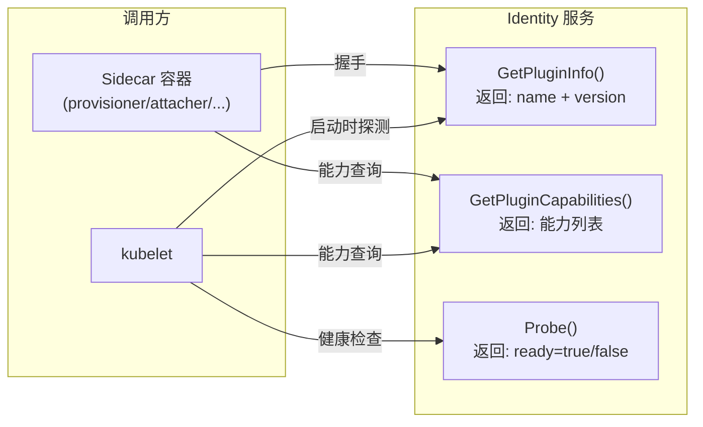
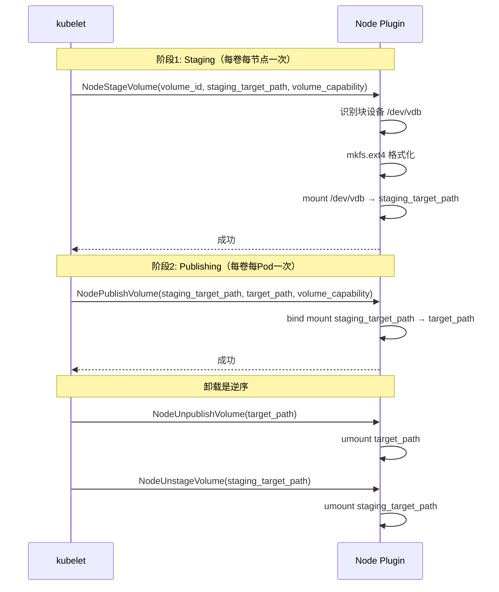

CSI（Container Storage Interface）规范是整个阿里云 CSI 驱动的协议基石。本文深入剖析 CSI v1.10.0 规范定义的三组 gRPC 服务——Identity、Controller、Node——的接口契约、方法签名语义、能力声明机制，以及它们如何映射到 Kubernetes 存储 API 对象（CSIDriver、CSINode、VolumeAttachment）。如果你已阅读 [项目整体架构总览与核心组件关系](4-xiang-mu-zheng-ti-jia-gou-zong-lan-yu-he-xin-zu-jian-guan-xi) 中对三层架构的宏观介绍，本文将带你进入接口层面的精确细节。

## CSI 规范的核心设计：三组服务的职责切分

CSI 规范（v1.10.0）将所有存储操作严格划分为**三组 gRPC 服务**，每组服务于不同的调用方和执行上下文。这种切分的本质是将"**谁在调用**"和"**在哪执行**"两个正交维度编码到协议本身。

| 服务组 | 必选性 | 调用方 | 执行上下文 | 核心职责 |
|--------|--------|--------|-----------|---------|
| **Identity** | 必选 | kubelet + 所有 sidecar | Controller + Node | 驱动身份声明与能力广播 |
| **Controller** | 可选 | external-provisioner/attacher/resizer/snapshotter | 仅 Controller Pod | 云端卷资源生命周期管理 |
| **Node** | 可选 | kubelet | 仅 Node DaemonSet | 节点本地文件系统操作 |

**Identity 是唯一必选的服务组**。无论一个 CSI 驱动以 Controller 模式、Node 模式还是合并模式运行，都必须实现 Identity 服务——因为 kubelet 和所有 sidecar 容器在启动后，第一步就是通过 `GetPluginInfo` 和 `GetPluginCapabilities` 探测驱动是否存活以及它支持哪些功能。

Sources: [modules.txt](vendor/modules.txt#L85-L87), [server.go](vendor/google.golang.org/grpc/server.go#L752-L792)

## gRPC 服务注册机制：ServiceDesc 与接口校验

三组 CSI 服务在 gRPC 层面通过 `ServiceDesc` 描述符注册到 gRPC Server。`ServiceDesc` 是 gRPC 的核心注册单元，它定义了服务名称（`ServiceName`）、接口类型指针（`HandlerType`）、方法列表（`Methods`）和流式方法列表（`Streams`）。

```go
type ServiceDesc struct {
    ServiceName string
    HandlerType any
    Methods     []MethodDesc
    Streams     []StreamDesc
    Metadata    any
}
```

注册时，`RegisterService` 方法通过 Go 反射机制执行**编译期之外的安全性校验**：它提取 `HandlerType` 的接口类型（`reflect.TypeOf(sd.HandlerType).Elem()`），然后检查传入的实现体 `ss` 是否满足该接口（`st.Implements(ht)`）。这意味着即使 CSI 定义的 Protobuf 接口在编译时没有被显式约束，gRPC 在运行时仍然能拦截不完整的服务实现——如果某个 CSI 驱动声称实现了 Controller 服务但缺少 `CreateVolume` 方法，注册阶段会直接 Fatal 退出。

Sources: [server.go](vendor/google.golang.org/grpc/server.go#L100-L114), [server.go](vendor/google.golang.org/grpc/server.go#L756-L792)

注册完成后，每个方法被存入 `serviceInfo.methods` 映射表。当 gRPC 请求到达时，`handleStream` 方法解析请求路径（格式为 `/package.service/method`），从映射表中查找对应的 `MethodDesc`，然后交给 `processUnaryRPC` 执行。整个分发链路中，**方法查找是 O(1) 的 map 查找**，没有任何反射开销。

Sources: [server.go](vendor/google.golang.org/grpc/server.go#L767-L792), [server.go](vendor/google.golang.org/grpc/server.go#L1786-L1888)

## Identity 服务：驱动身份与能力广播

Identity 服务包含三个方法，它们是 CSI 驱动与外部世界握手的"名片"。



### GetPluginInfo —— 驱动身份声明

`GetPluginInfo` 返回驱动的**名称**和**版本**。驱动名称是一个反向域名格式的字符串（如 `diskplugin.csi.alibabacloud.com`），它必须与 Kubernetes 集群中 `CSIDriver` 对象的 `metadata.name` 字段完全一致。Kubernetes 通过这个名称将 CSI 驱动与 StorageClass 中的 `provisioner` 字段匹配，从而决定哪个 PVC 由哪个驱动处理。

Sources: [types.go](vendor/k8s.io/api/storage/v1/types.go#L236-L256), [types.go](vendor/k8s.io/api/storage/v1/types.go#L158-L168)

### GetPluginCapabilities —— 能力广播

`GetPluginCapabilities` 是 Identity 服务中最关键的方法。它返回一个**能力列表**，精确声明该驱动支持哪些 CSI 功能。CSI v1.10.0 规范定义了以下几类 Plugin Capability：

| 能力类型 | 能力值 | 语义 |
|---------|--------|------|
| `CONTROLLER_SERVICE` | `plugin.v1.ControllerService` | 驱动实现了 Controller 服务组 |
| `VOLUME_ACCESSIBILITY_CONSTRAINTS` | `plugin.v1.VolumeAccessibilityConstraints` | 驱动支持拓扑感知调度 |
| `VOLUME_EXPANSION_ONLINE` | `plugin.v1.VolumeExpansionOnline` | 支持卷在线扩容 |
| `VOLUME_EXPANSION_OFFLINE` | `plugin.v1.VolumeExpansionOffline` | 支持卷离线扩容 |
| `GROUP_CONTROLLER_SERVICE` | `plugin.v1.GroupControllerService` | 驱动实现了卷组控制器服务 |

能力声明是**静态且确定性**的——同一个驱动实例在每次调用时必须返回一致的结果。sidecar 容器（如 external-attacher）在启动时查询此能力列表，如果发现 `CONTROLLER_SERVICE` 未声明，它会直接跳过所有 Controller 相关操作。

### Probe —— 健康探测

`Probe` 方法供 kubelet 和 sidecar 定期检查驱动是否就绪。返回的 `ready` 字段为 `false` 时，kubelet 会暂停该驱动上的所有卷操作。对于阿里云 CSI 驱动，Probe 通常检查内部组件初始化状态——如凭证加载是否完成、阿里云 SDK 客户端是否建立成功、Kubernetes API 连接是否可用。

## Controller 服务：云端卷资源管理

Controller 服务对应 CSI 规范中的 `Controller` gRPC 服务，所有方法都在 **Controller Plugin** 中执行。这些方法的共同特征是：它们与**阿里云 OpenAPI** 交互，管理的是云端存储资源的元数据（创建、删除、查询），而非节点本地的文件系统。

### 方法矩阵

| 方法 | 触发方 | 操作语义 | 对应阿里云 API |
|------|--------|---------|--------------|
| `CreateVolume` | external-provisioner | 从 StorageClass 参数创建存储资源 | ECS `CreateDisk` / NAS `CreateFileSystem` |
| `DeleteVolume` | external-provisioner | 删除存储资源 | ECS `DeleteDisk` / NAS `DeleteFileSystem` |
| `ControllerPublishVolume` | external-attacher | 将卷挂载到目标节点 | ECS `AttachDisk` |
| `ControllerUnpublishVolume` | external-attacher | 将卷从节点卸载 | ECS `DetachDisk` |
| `ControllerExpandVolume` | external-resizer | 扩展卷的存储容量 | ECS `ResizeDisk` |
| `CreateSnapshot` | external-snapshotter | 创建卷快照 | ECS `CreateSnapshot` |
| `DeleteSnapshot` | external-snapshotter | 删除卷快照 | ECS `DeleteSnapshot` |
| `ListVolumes` | external-provisioner | 列出已创建的卷 | ECS `DescribeDisks` |
| `GetCapacity` | CSIStorageCapacity controller | 查询可用存储容量 | 按后端实现而定 |

Sources: [types.go](vendor/k8s.io/api/storage/v1/types.go#L119-L228), [modules.txt](vendor/modules.txt#L189-L202)

### ControllerPublishVolume 与 VolumeAttachment 的关系

`ControllerPublishVolume` 是 Controller 侧最关键的方法之一，它与 Kubernetes 的 `VolumeAttachment` API 对象直接关联。当 Pod 被调度到某节点后，Kubernetes 创建 `VolumeAttachment` 对象，其 `Spec` 包含三个核心字段：

- **`attacher`**：驱动名称，必须匹配 `GetPluginInfo` 返回的 name
- **`source.persistentVolumeName`**：要附加的 PV 名称
- **`nodeName`**：目标节点名称

external-attacher sidecar 监听 `VolumeAttachment` 对象的变化，将其转化为 `ControllerPublishVolume(volume_id, node_id, volume_capability)` gRPC 调用。Controller Plugin 执行成功后，返回的 `publish_context`（如 `{"devicePath": "/dev/vdb"}`）被写入 `VolumeAttachment.Status.AttachmentMetadata`，供后续 Node 侧操作使用。

Sources: [types.go](vendor/k8s.io/api/storage/v1/types.go#L158-L203)

### Controller 能力声明：ControllerGetCapabilities

与 Identity 服务类似，Controller 服务也有自己的能力声明方法 `ControllerGetCapabilities`。它精确告知调用方该驱动支持哪些 Controller 方法。例如，如果驱动不支持快照功能，`CreateSnapshot` 和 `DeleteSnapshot` 的能力不会被声明，external-snapshotter 在探测到缺失后不会发起相关调用。

| 能力类别 | 代表能力 | 影响 |
|---------|---------|------|
| `RPC` 类 | `CREATE_DELETE_VOLUME` | 是否支持卷的创建和删除 |
| `RPC` 类 | `PUBLISH_UNPUBLISH_VOLUME` | 是否支持 ControllerPublish/Unpublish |
| `RPC` 类 | `CREATE_DELETE_SNAPSHOT` | 是否支持快照创建和删除 |
| `RPC` 类 | `EXPAND_VOLUME` | 是否支持卷扩容 |
| `RPC` 类 | `GET_VOLUME` / `LIST_VOLUMES` | 是否支持卷查询 |
| `RPC` 类 | `CLONE_VOLUME` | 是否支持从快照克隆卷 |

### 幂等性与 gRPC 错误码

CSI 规范要求所有 Controller 方法必须**幂等**——同一个请求被重复调用不应导致错误。例如，`DeleteVolume` 对一个已删除的卷应返回成功而非 `NotFound`。阿里云 CSI 驱动通过检查阿里云 API 返回的错误码来实现幂等语义，将"资源不存在"错误转换为 CSI 成功响应。

gRPC 状态码在 CSI 语义中有明确的映射规则：

| gRPC Code | CSI 语义 | 处理建议 |
|-----------|---------|---------|
| `OK (0)` | 操作成功 | 正常流程 |
| `NotFound (5)` | 资源不存在 | 通常视为已删除（幂等） |
| `AlreadyExists (6)` | 资源已存在 | 幂等场景下应返回成功 |
| `FailedPrecondition (9)` | 前置条件不满足 | 如卷未格式化就扩容 |
| `Aborted (10)` | 并发冲突 | 调用方应重试 |
| `Unavailable (14)` | 服务暂时不可用 | 调用方应指数退避重试 |
| `Out Of Range (11)` | 请求超出限制 | 如扩容超过最大容量 |

Sources: [codes.go](vendor/google.golang.org/grpc/codes/codes.go#L37-L160)

## Node 服务：节点本地文件系统操作

Node 服务在**每个工作节点**上由 kubelet 直接调用。与 Controller 服务通过 sidecar 容器间接调用不同，Node 服务的调用者是 kubelet 本身，通信通过 Unix Domain Socket 完成。

### 方法矩阵与两阶段挂载



这种两阶段设计（Stage → Publish）是 CSI 规范的核心架构决策。**staging 路径**是节点级别的全局路径（`/var/lib/kubelet/plugins/kubernetes.io/csi/pv-xxx/globalmount`），同一卷在同一节点上只 Stage 一次。**publish 路径**是 Pod 级别的路径（`/var/lib/kubelet/pods/xxx/volumes/kubernetes.io~csi/pv-xxx/mount`），每个 Pod 有独立的 publish 路径，但共享同一个 staging 路径。

| 方法 | 调用时机 | 操作内容 |
|------|---------|---------|
| `NodeStageVolume` | 卷首次到达节点 | 块设备格式化 + 挂载到 staging 路径 |
| `NodeUnstageVolume` | 最后一个 Pod 释放卷 | 卸载 staging 路径 |
| `NodePublishVolume` | 每个 Pod 使用卷 | bind mount staging → publish 路径 |
| `NodeUnpublishVolume` | Pod 释放卷 | 卸载 publish 路径 |
| `NodeExpandVolume` | 卷扩容的 Node 阶段 | 文件系统在线扩展（resize2fs/xfs_growfs） |
| `NodeGetCapabilities` | kubelet 启动探测 | 声明 Node 侧能力 |
| `NodeGetInfo` | node-driver-registrar 注册 | 返回 node_id 和拓扑信息 |
| `NodeGetVolumeStats` | kubelet 定期采集 | 返回卷容量使用统计 |

Sources: [mount.go](vendor/k8s.io/mount-utils/mount.go#L38-L89)

### NodeGetInfo 与 CSINode 注册

`NodeGetInfo` 方法在 CSI 驱动注册到 kubelet 时被调用。它返回三个关键信息：

- **`node_id`**：存储系统视角的节点标识（如阿里云 ECS 实例 ID `i-xxx`），与 Kubernetes 的节点名称可能不同
- **`max_volumes_per_node`**：该节点支持的最大卷数量
- **`accessible_topology`**：该节点的拓扑标签（如 `{"topology.kubernetes.io/zone": "cn-hangzhou-a"}`）

这些信息通过 **node-driver-registrar** sidecar 容器写入 Kubernetes 的 `CSINode` API 对象。`CSINode` 对象的 `Spec.Drivers` 数组中，每个 `CSINodeDriver` 条目记录了驱动名称、`NodeID`、拓扑键（`TopologyKeys`）和可分配卷数（`Allocatable.Count`）。

Sources: [types.go](vendor/k8s.io/api/storage/v1/types.go#L502-L579)

### Node 能力声明：NodeGetCapabilities

`NodeGetCapabilities` 声明 Node Plugin 支持的具体操作。常见的 Node 能力包括：

| 能力 | 语义 |
|------|------|
| `STAGE_UNSTAGE_VOLUME` | 支持两阶段挂载（Stage/Unstage） |
| `EXPAND_VOLUME` | 支持 NodeExpandVolume（文件系统扩容） |
| `GET_VOLUME_STATS` | 支持 NodeGetVolumeStats（容量统计） |
| `VOLUME_MOUNT_GROUP` | 支持 fsGroup 权限修改 |

如果驱动未声明 `STAGE_UNSTAGE_VOLUME` 能力，kubelet 会跳过 `NodeStageVolume` 调用，直接执行 `NodePublishVolume`——但此时驱动必须在 `NodePublishVolume` 中自行处理格式化和挂载。阿里云 CSI 驱动支持完整的 Stage/Publish 两阶段流程。

### NodeGetVolumeStats 与 kubelet 容量上报

`NodeGetVolumeStats` 向 kubelet 返回卷的使用情况，数据最终汇入 kubelet 的 `stats/v1alpha1` API。`VolumeStats` 结构体包含 `FsStats`（文件系统总量/已用量/可用量）、`InodeStats`（inode 使用情况）等信息。kubelet 将这些统计通过 `/stats/summary` 端点暴露给监控系统。

Sources: [types.go](vendor/k8s.io/kubelet/pkg/apis/stats/v1alpha1/types.go#L114-L148)

## CSIDriver 对象：Kubernetes 对 CSI 能力的补充声明

虽然 CSI 驱动通过 `GetPluginCapabilities` 和 `ControllerGetCapabilities` 声明了协议级能力，但 Kubernetes 还需要知道一些**CSI 规范之外**的集群级行为配置。这就是 `CSIDriver` API 对象的作用。

`CSIDriverSpec` 的关键字段直接映射到 CSI 服务的调用行为：

| CSIDriverSpec 字段 | 影响 CSI 调用 | 默认值 |
|-------------------|-------------|--------|
| `attachRequired` | 若为 `false`，跳过 `ControllerPublishVolume`，VolumeAttachment 不会创建 | `true` |
| `podInfoOnMount` | 若为 `true`，kubelet 在 `NodePublishVolume` 的 `volume_context` 中注入 Pod 信息 | `false` |
| `fsGroupPolicy` | 控制 kubelet 是否在 `NodeStageVolume` 前修改卷的 fsGroup | `ReadWriteOnceWithFSType` |
| `volumeLifecycleModes` | 声明支持 `Persistent` 和/或 `Ephemeral` 卷模式 | `[Persistent]` |
| `storageCapacity` | 若为 `true`，kube-scheduler 根据 `CSIStorageCapacity` 对象做容量感知调度 | `false` |
| `requiresRepublish` | 若为 `true`，kubelet 周期性重新调用 `NodePublishVolume` | `false` |
| `seLinuxMount` | 若为 `true`，kubelet 在 mount 选项中传递 SELinux context | `false` |

`podInfoOnMount` 为 `true` 时，kubelet 注入的 VolumeContext 键值对遵循固定前缀 `csi.storage.k8s.io/`：

```
csi.storage.k8s.io/pod.name:       <pod 名称>
csi.storage.k8s.io/pod.namespace:  <pod 命名空间>
csi.storage.k8s.io/pod.uid:        <pod UID>
csi.storage.k8s.io/ephemeral:      "true" 或 "false"
```

CSI 驱动可以在 `NodePublishVolume` 的实现中解析这些键，实现 Pod 级别的存储策略。

Sources: [types.go](vendor/k8s.io/api/storage/v1/types.go#L275-L425)

## 拦截器链：跨切面关注点的注入点

所有 CSI gRPC 方法在到达实际处理器之前，都会经过 gRPC 的**链式拦截器**（Chain Interceptor）。`UnaryServerInterceptor` 的签名为 `func(ctx, req, info, handler) (resp, err)`——它在方法处理器之前执行，可以选择修改请求、记录指标、注入追踪 span，然后通过调用 `handler` 将控制权传递给下一层。

gRPC Server 在 `NewServer` 阶段自动调用 `chainUnaryServerInterceptors`，将配置中的 `chainUnaryInts` 和 `unaryInt` 合并为一个有序的拦截器链。拦截器的执行顺序由链的顺序决定——第一个拦截器最先执行，最后一个拦截器的 `handler` 参数就是实际的 CSI 方法处理器。

阿里云 CSI 驱动利用拦截器链注入以下跨切面关注点：
- **日志记录**：记录每个 CSI 方法调用的入参摘要和耗时
- **Prometheus 指标**：采集 gRPC 请求计数和延迟直方图
- **OpenTelemetry 追踪**：为每个 CSI 调用创建 span
- **消息脱敏**：通过 csi-lib-utils 的 protosanitizer 过滤敏感字段

Sources: [interceptor.go](vendor/google.golang.org/grpc/interceptor.go#L65-L87), [server.go](vendor/google.golang.org/grpc/server.go#L1210-L1228), [modules.txt](vendor/modules.txt#L186-L188)

## 三组服务的部署模式

阿里云 CSI 驱动通过 Cobra 子命令架构支持三种部署模式，决定了三组服务如何组合在同一进程中：

| 模式 | 命令 | 注册的服务 | 部署形态 |
|------|------|-----------|---------|
| **Controller 模式** | `controller-server` | Identity + Controller | Deployment（单副本或主备） |
| **Node 模式** | `node-server` | Identity + Node | DaemonSet（每节点一副本） |
| **合并模式** | `plugin` | Identity + Controller + Node | 单进程（开发/测试用） |

无论哪种模式，**Identity 服务始终注册**。Controller 模式下，Node 服务不被注册，kubelet 也不会在该 Pod 上调度存储操作；Node 模式下，sidecar 容器不存在，Controller 服务没有调用方。合并模式主要用于开发环境，将控制面和数据面功能集中在一个进程中便于调试。

Sources: [server.go](vendor/google.golang.org/grpc/server.go#L756-L764), [modules.txt](vendor/modules.txt#L85-L87)

## 阅读路线建议

理解了 CSI 三组服务的接口规范后，建议按以下路线深入：

**深入 gRPC 通信实现** —— 阅读 [gRPC 服务端实现与 Unix Socket 通信机制](6-grpc-fu-wu-duan-shi-xian-yu-unix-socket-tong-xin-ji-zhi)，了解 gRPC Server 如何在 Unix Socket 上监听、sidecar 如何建立连接，以及拦截器链的具体实现细节。随后阅读 [csi-lib-utils 工具库与 Protobuf 消息处理](7-csi-lib-utils-gong-ju-ku-yu-protobuf-xiao-xi-chu-li) 了解消息脱敏机制。

**深入存储操作链路** —— 从 [云盘存储（ECS Block Storage）卷生命周期管理](8-yun-pan-cun-chu-ecs-block-storage-juan-sheng-ming-zhou-qi-guan-li) 开始，追踪 `CreateVolume` 到 `NodePublishVolume` 的完整代码路径，理解三组服务如何在实际存储后端中协作。然后阅读 [mount-utils 文件系统挂载与卸载机制](16-mount-utils-wen-jian-xi-tong-gua-zai-yu-xie-zai-ji-zhi) 了解 Node 侧的文件系统操作实现。

**深入 Kubernetes 交互** —— 阅读 [StorageClass、PV / PVC 控制器工作流](13-storageclass-pv-pvc-kong-zhi-qi-gong-zuo-liu) 了解 sidecar 容器如何将 Kubernetes API 事件转化为 CSI gRPC 调用，以及 [VolumeSnapshot 卷快照控制器与 CRD 客户端](14-volumesnapshot-juan-kuai-zhao-kong-zhi-qi-yu-crd-ke-hu-duan) 了解快照功能的完整链路。