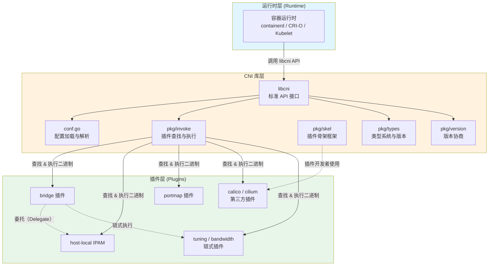
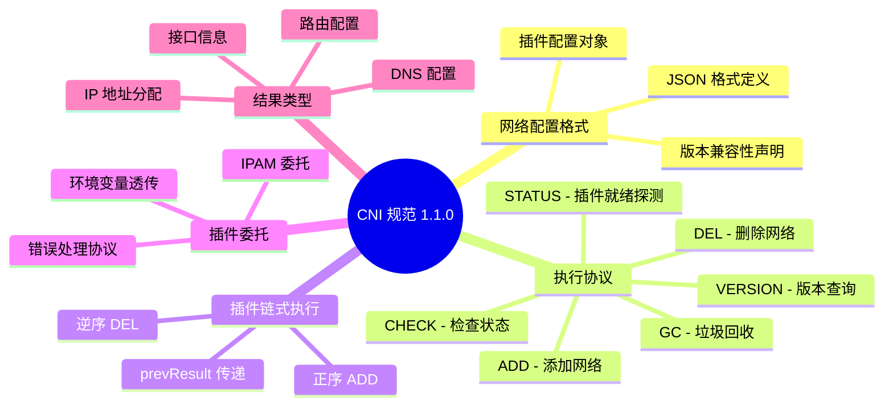
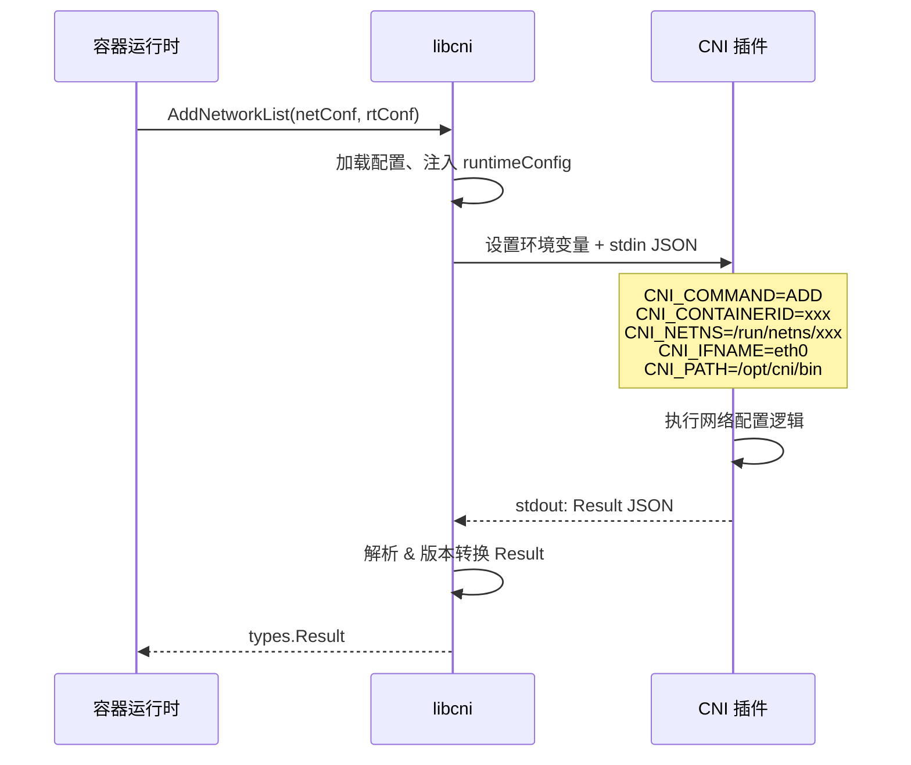

CNI（Container Network Interface，容器网络接口）是一个由 **Cloud Native Computing Foundation（CNCF）** 托管的开源项目，它为 Linux 容器提供了一套**基于插件的通用网络解决方案**。如果你曾经在 Kubernetes 集群中配置过 Pod 网络，或者在 Docker 中尝试过自定义网络方案，那么你已经间接使用了 CNI。本文将带你从第一性原理出发，理解 CNI 的设计动机、核心架构与生态价值，为后续深入学习打下坚实基础。

Sources: [README.md](README.md#L5-L13), [SPEC.md](SPEC.md#L68-L78)

---

## 为什么需要 CNI？

在容器化技术飞速发展的背景下，**网络配置始终是最具环境差异性的难题之一**。不同的云厂商、数据中心、安全策略和性能需求，意味着"一刀切"的网络方案注定行不通。各种容器运行时（runtime）和编排系统（orchestrator）都需要解决同一个问题：**让网络层可插拔**。

如果没有统一的接口标准，每个容器运行时都要各自实现与不同网络方案的对接，这将导致大量的重复劳动和生态碎片化。CNI 的核心使命正是定义一个**运行时与网络插件之间的通用接口**，从而避免重复造轮子。它通过以下三个交付物实现这一目标：

1. **一份语言无关的规范（SPEC）**：明确定义配置格式、执行协议和结果类型
2. **一套 Go 语言库（libcni）**：供运行时和插件开发者直接集成
3. **一组参考插件和工具**：展示规范的实际实现

Sources: [README.md](README.md#L34-L39), [SPEC.md](SPEC.md#L85-L94)

---

## CNI 的核心设计哲学

CNI 之所以被广泛采纳，源于它极度克制的**职责边界**——它**只关心两件事**：为容器建立网络连接，以及在容器删除时释放已分配的资源。这种"少即是多"的设计哲学带来了两个直接好处：

- **广泛的生态支持**：几乎所有主流容器运行时都兼容 CNI
- **规范的简洁性**：实现一个 CNI 插件的门槛极低

规范定义了四个核心术语，它们是理解整个 CNI 体系的基石：

| 术语 | 含义 | 示例 |
|------|------|------|
| **容器（Container）** | 网络隔离域，不限定具体隔离技术 | Linux 网络命名空间、虚拟机 |
| **网络（Network）** | 一组可唯一寻址且能互相通信的端点集合 | bridge 网络、overlay 网络 |
| **运行时（Runtime）** | 负责执行 CNI 插件的程序 | containerd、CRI-O、Kubernetes kubelet |
| **插件（Plugin）** | 应用特定网络配置的可执行程序 | bridge、calico、cilium |

Sources: [SPEC.md](SPEC.md#L70-L78), [README.md](README.md#L10-L14)

---

## 整体架构概览

CNI 的架构可以用一个简洁的三层模型来描述：**运行时层**负责编排调度，**libcni 库层**提供标准化 API，**插件层**执行具体的网络操作。下面的架构图展示了它们之间的关系：

**运行时**（如 containerd）通过调用 libcni 的 `AddNetworkList`、`DelNetworkList` 等 API 发起网络操作请求。libcni 库负责加载 JSON 网络配置、查找对应的插件二进制文件、以正确的环境变量和 stdin 数据执行插件，并将结果返回给运行时。插件本身是独立的可执行文件，它们通过 `pkg/skel` 骨架包解析环境变量和 stdin 数据，执行具体的网络配置逻辑（如创建 veth pair、分配 IP 地址等）。

Sources: [libcni/api.go](libcni/api.go#L17-L21), [pkg/invoke/exec.go](pkg/invoke/exec.go#L28-L35), [pkg/skel/skel.go](pkg/skel/skel.go#L15-L17)

---

## 仓库结构一览

本仓库（`containernetworking/cni`）是 CNI 项目的**规范和库仓库**，而非插件仓库。参考插件维护在独立的 [containernetworking/plugins](https://github.com/containernetworking/plugins) 仓库中。理解仓库结构有助于你快速定位需要的内容：

| 目录/文件 | 作用 | 适合的读者 |
|-----------|------|-----------|
| `SPEC.md` | CNI 规范的完整定义 | 所有读者（必读） |
| `libcni/` | Go 运行时集成库，提供 `CNI` 接口 | 运行时开发者 |
| `pkg/skel/` | 插件骨架包，简化插件开发 | 插件开发者 |
| `pkg/invoke/` | 插件查找、执行与结果处理 | 运行时开发者 |
| `pkg/types/` | 多版本结果类型定义 | 所有开发者 |
| `pkg/version/` | 版本协商与兼容性校验 | 所有开发者 |
| `pkg/ns/` | 网络命名空间管理（平台相关） | 插件开发者 |
| `cnitool/` | 命令行工具，用于手动执行 CNI 插件 | 学习和调试 |
| `CONVENTIONS.md` | 扩展约定（Capabilities、args 等） | 插件开发者 |
| `plugins/debug/` | 调试插件，记录 CNI 调用参数 | 学习和调试 |

Sources: [README.md](README.md#L16-L18), [go.mod](go.mod#L1-L4)

---

## 规范的五大支柱

CNI 规范（当前版本 **1.1.0**）由五个紧密关联的部分组成，每一部分解决一个特定的工程问题：

| 支柱 | 核心问题 | 关键机制 |
|------|----------|----------|
| **网络配置格式** | 管理员如何声明网络？ | JSON 配置文件，含 `plugins` 列表 |
| **执行协议** | 运行时如何与插件通信？ | 环境变量 + stdin JSON，stdout 返回结果 |
| **插件链式执行** | 多个插件如何协同工作？ | 按序 ADD、逆序 DEL，通过 `prevResult` 传递中间结果 |
| **插件委托** | 插件如何复用通用能力？ | 插件内部调用 IPAM 等委托插件 |
| **结果类型** | 插件如何汇报执行结果？ | 结构化 JSON，包含接口、IP、路由、DNS |

Sources: [SPEC.md](SPEC.md#L85-L94), [pkg/version/version.go](pkg/version/version.go#L26-L28)

---

## 核心操作一览

CNI 定义了六种操作（Command），它们构成了容器网络生命周期的完整闭环。每种操作通过环境变量 `CNI_COMMAND` 传递给插件：

| 操作 | 用途 | 触发时机 |
|------|------|----------|
| **ADD** | 将容器加入网络，创建或配置网络接口 | 容器启动时 |
| **DEL** | 将容器从网络中移除，释放资源 | 容器停止时 |
| **CHECK** | 验证容器网络是否处于预期状态 | 运行时定期健康检查 |
| **GC** | 清理残留的陈旧资源 | 运行时检测到孤儿附件时 |
| **STATUS** | 探测插件是否准备好处理 ADD 请求 | 运行时启动或网络就绪检查 |
| **VERSION** | 查询插件支持的 CNI 规范版本 | 版本协商阶段 |

其中，**ADD** 和 **DEL** 是最基础的操作对——ADD 创建资源，DEL 释放资源，且规范要求 ADD 最终必须被 DEL 跟随。**CHECK** 和 **GC** 是规范 0.4.0 和 1.1.0 分别引入的增强操作，用于提升运行时的运维能力。

Sources: [SPEC.md](SPEC.md#L237-L238), [SPEC.md](SPEC.md#L239-L276), [pkg/skel/skel.go](pkg/skel/skel.go#L59-L77)

---

## 通信协议：环境变量 + stdin

CNI 采用了一种极其轻量的进程间通信协议。运行时将操作指令通过**环境变量**传递，将网络配置通过 **stdin（JSON）** 传递，插件则将执行结果以 **JSON 格式输出到 stdout**，错误信息输出到 **stderr**：

环境变量中最重要的参数包括 `CNI_COMMAND`（操作类型）、`CNI_CONTAINERID`（容器标识）、`CNI_NETNS`（网络命名空间路径）、`CNI_IFNAME`（容器内接口名称）和 `CNI_PATH`（插件搜索路径）。这套协议的设计使得任何语言实现的插件都能通过简单的命令行参数解析来参与 CNI 体系。

Sources: [SPEC.md](SPEC.md#L206-L231), [pkg/invoke/args.go](pkg/invoke/args.go#L1-L1), [libcni/api.go](libcni/api.go#L50-L68)

---

## CNI 的生态版图

CNI 已成为容器网络领域的事实标准，其生态覆盖了从容器运行时到网络方案的全栈：

**主流容器运行时支持：**

| 运行时 | 说明 |
|--------|------|
| Kubernetes | 通过 kubelet 的 CRI 接口调用 CNI |
| OpenShift | Kubernetes 企业版，内置 CNI 支持 |
| Cloud Foundry | 云应用平台 |
| Apache Mesos | 分布式系统内核 |
| Amazon ECS | AWS 容器管理服务 |
| Singularity | HPC/AI 场景的容器平台 |

**主流第三方 CNI 插件：**

| 插件 | 类型 | 特点 |
|------|------|------|
| **Calico** | L3 虚拟网络 | BGP 路由，网络策略 |
| **Cilium** | eBPF/XDP | 内核级可观测性与安全 |
| **Multus** | 多网络 | 支持为 Pod 挂载多张网卡 |
| **Antrea** | OVS | VMware 开源，支持 Windows |
| **AWS VPC CNI** | 原生 VPC | 直接使用 AWS ENI |
| **Azure CNI** | 原生 VNet | Azure 虚拟网络直通 |
| **Kube-OVN** | OVN/OVS | 子网管理、ACL、QoS |
| **Terway** | 阿里云 VPC | 基于 VPC/ECS 网络 |
| **Spiderpool** | IPAM | 静态 IP 管理 |

Sources: [README.md](README.md#L42-L78)

---

## CNI 的核心价值主张

总结来看，CNI 为容器网络领域带来了三个不可替代的价值：

**1. 标准化接口，消除碎片化。** CNI 定义了运行时与网络插件之间的清晰边界，使得任何符合规范的插件都能在任何符合规范的运行时上运行。Kubernetes 用户可以从 Calico 一键切换到 Cilium，无需修改运行时代码。

**2. 极致简洁，易于实现。** 整个协议基于"环境变量 + stdin JSON → stdout JSON"的简单模型，不依赖任何复杂的 RPC 框架或共享库。一个最简 CNI 插件只需几十行代码即可完成。这种简洁性大幅降低了网络方案的接入门槛。

**3. 可组合的插件架构。** 通过链式执行（Chaining）和委托（Delegation）两种机制，CNI 允许将复杂的网络配置拆解为多个专注的单功能插件。例如，bridge 插件负责创建接口，host-local IPAM 负责分配 IP，portmap 插件负责端口映射——它们通过 `prevResult` 机制串联，各司其职。

Sources: [SPEC.md](SPEC.md#L535-L563), [README.md](README.md#L12-L19)

---

## 阅读路线指引

根据你的学习目标，建议按以下路线继续深入：

- **如果你想立即动手实践**：阅读 [快速上手：环境搭建与运行第一个 CNI 配置](2-kuai-su-shang-shou-huan-jing-da-jian-yu-yun-xing-di-ge-cni-pei-zhi)，学习如何安装和运行 CNI 插件
- **如果你想了解规范演进**：阅读 [CNI 规范演进历史与版本差异一览](4-cni-gui-fan-yan-jin-li-shi-yu-ban-ben-chai-yi-lan)，掌握从 0.1.0 到 1.1.0 的变化脉络
- **如果你想深入规范细节**：阅读 [CNI 规范全景：网络配置格式详解](5-cni-gui-fan-quan-jing-wang-luo-pei-zhi-ge-shi-xiang-jie)，系统学习配置格式的每一个字段
- **如果你想开发自己的插件**：阅读 [从零开发一个 CNI 插件](18-cong-ling-kai-fa-ge-cni-cha-jian) 和 [skel 骨架包：构建 CNI 插件的起点](13-skel-gu-jia-bao-gou-jian-cni-cha-jian-de-qi-dian)
- **如果你想将 CNI 集成到运行时**：阅读 [libcni 库：运行时集成的完整 API 接口](10-libcni-ku-yun-xing-shi-ji-cheng-de-wan-zheng-api-jie-kou)，理解 `CNI` 接口的全貌