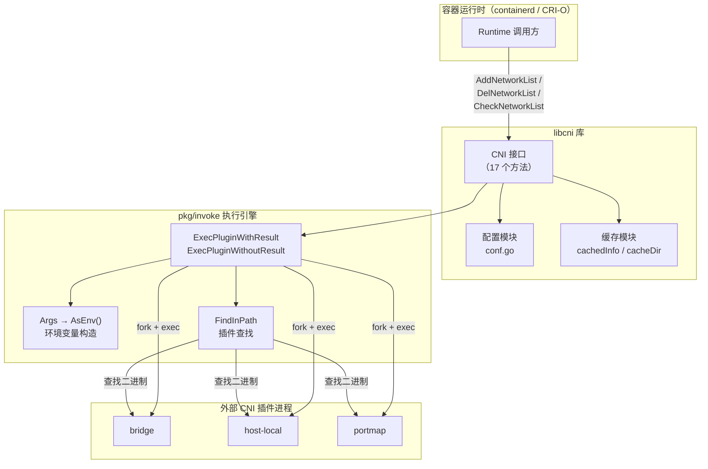
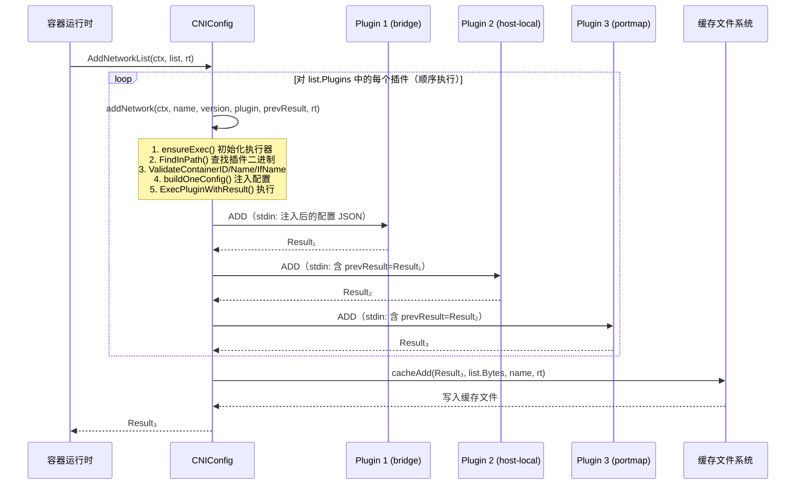
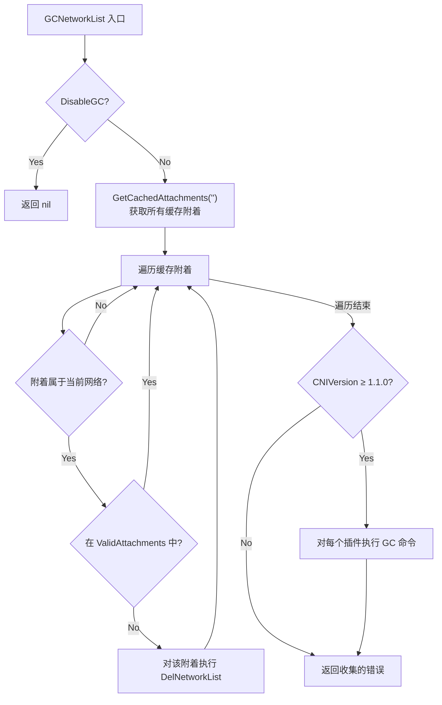

**libcni** 是容器运行时（如 containerd、CRI-O）集成 CNI 网络功能的核心入口库。它将 CNI 规范中定义的操作协议封装为一套类型安全的 Go API，屏蔽了插件查找、配置注入、结果缓存、版本协商等底层细节，使运行时只需关注"为哪个容器配置哪个网络"这一核心问题。本文将从架构全景出发，逐层剖析 libcni 的接口定义、数据模型、执行流程和缓存机制，帮助你建立对 CNI 运行时集成的系统性认知。

Sources: [api.go](libcni/api.go#L15-L22)

## 架构定位：libcni 在 CNI 生态中的角色

libcni 位于**容器运行时**与**CNI 插件二进制**之间，充当协议翻译和编排调度的中间层。它不实现任何网络逻辑本身，而是负责：加载网络配置文件、按序调度插件链、向每个插件注入标准化的运行时参数、管理结果的持久化缓存，以及提供 GC/STATUS 等生命周期管理能力。

下面的架构图展示了 libcni 的核心依赖关系和内部模块划分：



Sources: [api.go](libcni/api.go#L23-L38), [exec.go](pkg/invoke/exec.go#L28-L35)

## 核心数据模型

libcni 定义了四个关键结构体，它们分别对应 CNI 规范中不同层次的配置和运行时概念。理解这些数据模型是掌握整个 API 的前提。

### RuntimeConf：单次调用的运行时参数

`RuntimeConf` 封装了每次调用 CNI 插件时所需的运行时上下文——容器 ID、网络命名空间路径、接口名称、额外参数键值对，以及能力参数（CapabilityArgs）。其中 CapabilityArgs 是运行时传递给插件的**能力特定数据**，libcni 会自动过滤：只有当插件配置中声明了对应的能力（Capabilities）为 `true` 时，该数据才会通过 `runtimeConfig` 注入到插件的 stdin JSON 中。

| 字段 | 类型 | 说明 |
|---|---|---|
| `ContainerID` | `string` | 容器唯一标识，用于缓存文件命名和 GC 追踪 |
| `NetNS` | `string` | 网络命名空间路径（如 `/var/run/netns/ns1`） |
| `IfName` | `string` | 容器内网络接口名（如 `eth0`），最大 15 字符 |
| `Args` | `[][2]string` | 额外的键值对参数，通过 `CNI_ARGS` 环境变量传递 |
| `CapabilityArgs` | `map[string]interface{}` | 能力特定数据，按插件声明的能力过滤后注入 `runtimeConfig` |
| `CacheDir` | `string` | **已废弃**，将在未来版本移除 |

Sources: [api.go](libcni/api.go#L50-L68)

### PluginConfig 与 NetworkConfigList：网络配置的两层抽象

libcni 用 **两层配置模型** 来匹配 CNI 规范中的两种配置格式：

- **PluginConfig**（别名为 `NetworkConfig`）对应**单插件配置**，包含一个 `types.PluginConf` 的解析结果和原始 JSON 字节。它是插件链中单个插件的配置单元。
- **NetworkConfigList** 对应**插件链配置**（`.conflist` 格式），包含网络名称、CNI 版本、控制标志（`DisableCheck`、`DisableGC`、`LoadOnlyInlinedPlugins`），以及一个有序的 `[]*PluginConfig` 列表。

```go
type PluginConfig struct {
    Network *types.PluginConf   // 解析后的结构化配置
    Bytes   []byte              // 原始 JSON 字节（注入运行时参数后会被更新）
}

type NetworkConfigList struct {
    Name                   string
    CNIVersion             string
    DisableCheck           bool
    DisableGC              bool
    LoadOnlyInlinedPlugins bool
    Plugins                []*PluginConfig
    Bytes                  []byte
}
```

Sources: [api.go](libcni/api.go#L70-L87)

### NetworkAttachment 与 GCArgs：生命周期管理

`NetworkAttachment` 是缓存中保存的**网络附着记录**，记录了某个容器与某个网络的绑定关系（容器 ID、网络名、接口名、配置、命名空间等）。它是 GC 操作的核心数据来源。

`GCArgs` 携带一组 `ValidAttachments`，告诉 GC 操作哪些附着仍然有效——不在该列表中的缓存附着将被清理。

Sources: [api.go](libcni/api.go#L89-L101)

## CNI 接口：17 个方法的完整契约

libcni 的核心抽象是 `CNI` 接口，它定义了运行时需要的全部操作。`CNIConfig` 结构体是该接口的唯一实现。按照功能职责，这 17 个方法可以划分为**五大类**：

| 类别 | 方法 | 说明 |
|---|---|---|
| **网络生命周期** | `AddNetworkList` / `AddNetwork` | 创建网络接口，返回 Result |
| | `CheckNetworkList` / `CheckNetwork` | 检查网络配置是否仍然正确 |
| | `DelNetworkList` / `DelNetwork` | 删除网络接口并清理缓存 |
| **缓存读取** | `GetNetworkListCachedResult` / `GetNetworkCachedResult` | 获取上次 ADD 的缓存结果 |
| | `GetNetworkListCachedConfig` / `GetNetworkCachedConfig` | 获取缓存中的配置和 RuntimeConf |
| | `GetCachedAttachments` | 获取指定容器的所有缓存附着 |
| **验证** | `ValidateNetworkList` / `ValidateNetwork` | 验证插件存在且支持配置的版本 |
| **GC/STATUS** | `GCNetworkList` | 垃圾回收无效的网络附着 |
| | `GetStatusNetworkList` | 查询插件状态 |
| **版本信息** | `GetVersionInfo` | 查询插件支持的 CNI 版本 |

每一对 `*NetworkList` / `*Network` 方法分别操作插件链和单个插件。在实际使用中，运行时几乎总是使用 `*NetworkList` 变体，因为生产环境的网络配置通常是多插件链式结构。

Sources: [api.go](libcni/api.go#L103-L125)

## CNIConfig 的构造与初始化

`CNIConfig` 是 `CNI` 接口的唯一实现，通过两个构造函数创建：

- **`NewCNIConfig(path []string, exec invoke.Exec)`**：指定插件搜索路径和自定义执行器。若 `exec` 为 `nil`，会在首次使用时自动创建默认的 `DefaultExec`（包含 `RawExec` 和 `PluginDecoder`）。
- **`NewCNIConfigWithCacheDir(path []string, cacheDir string, exec invoke.Exec)`**：额外指定缓存目录，用于持久化 ADD 结果和附着信息。

```go
// cnitool 中的典型用法
cninet := libcni.NewCNIConfig(filepath.SplitList(os.Getenv("CNI_PATH")), nil)
```

`CNIConfig` 的内部有三个关键字段：`Path`（插件搜索路径列表）、`exec`（插件执行器接口，可被测试 mock）、`cacheDir`（缓存根目录）。缓存目录的解析遵循**三级回退**策略：优先使用构造时传入的全局 `cacheDir`，其次回退到已废弃的 `RuntimeConf.CacheDir`，最后使用默认值 `/var/lib/cni`。

Sources: [api.go](libcni/api.go#L127-L153), [cnitool/cmd/root.go](cnitool/cmd/root.go#L153-L155)

## 插件链的执行流程：以 AddNetworkList 为例

`AddNetworkList` 是理解 libcni 执行模型的典型入口。它的核心逻辑可以概括为：**顺序执行 → 前向传递 → 结果缓存**。



### 配置注入机制：buildOneConfig

在每次调用单个插件之前，`buildOneConfig` 函数会执行关键的**配置注入**操作，确保每个插件接收到标准化且正确的输入：

1. **注入网络名称和版本**：将 `name` 和 `cniVersion` 写入插件配置，确保插件链中所有配置统一使用网络级别（而非插件级别）的名称和版本。
2. **注入前序结果**：对于链中的第 2 个及之后的插件，将前一个插件的返回结果作为 `prevResult` 注入，实现插件间的数据传递。
3. **注入运行时配置**：`injectRuntimeConfig` 函数将 `RuntimeConf.CapabilityArgs` 中与插件声明的能力匹配的条目提取出来，组装为 `runtimeConfig` 字典注入到配置 JSON 中。

这套注入机制确保了**配置文件中的静态配置**和**运行时动态参数**的正确合并。

Sources: [api.go](libcni/api.go#L155-L212), [api.go](libcni/api.go#L515-L530)

## 删除流程：逆序执行与缓存感知

`DelNetworkList` 展现了与 ADD 对称但关键不同的行为模式：

1. **逆序执行**：插件按 `list.Plugins` 的**逆序**删除（`for i := len(list.Plugins) - 1; i >= 0`），确保依赖关系正确的清理顺序——例如先删除 portmap 规则，再释放 IP 地址，最后删除网桥接口。
2. **缓存结果传递**：对于 CNI 0.4.0+ 版本，DEL 操作会先读取缓存的 ADD 结果，并将其作为 `prevResult` 传递给每个插件，使插件知道需要清理什么。
3. **缓存清理**：无论 DEL 是否成功，都会尝试删除缓存文件。

如果缓存结果读取失败，libcni 会删除缓存文件但将 `prevResult` 设为 `nil`，然后继续执行 DEL——这是一种**优雅降级**策略，确保即使缓存丢失，清理操作仍能进行。

Sources: [api.go](libcni/api.go#L589-L613)

## CHECK 操作：幂等性验证

`CheckNetworkList` 用于验证当前网络配置是否与上次 ADD 的结果一致，是实现**网络配置一致性检查**的关键操作：

- **版本守卫**：CHECK 仅在 CNI 0.4.0+ 版本中可用，低于此版本的配置会返回 `ErrorCheckNotSupp` 错误。
- **DisableCheck 短路**：如果 `NetworkConfigList.DisableCheck` 为 `true`，立即返回 `nil`（成功），跳过所有检查。
- **缓存依赖**：CHECK 必须读取缓存的 ADD 结果，将其作为 `prevResult` 传递给每个插件，供插件对比期望状态与实际状态。

Sources: [api.go](libcni/api.go#L548-L572)

## GC 操作：垃圾回收无效附着

`GCNetworkList` 是 CNI 1.1.0 引入的两阶段垃圾回收机制，解决的核心问题是：**当容器被异常终止时，其网络配置可能残留在系统中**。



第一阶段**清理孤立附着**：遍历所有缓存附着，将不属于 `ValidAttachments` 的附着通过 `DelNetworkList` 删除。第二阶段**插件级 GC**：对于支持 CNI 1.1.0+ 的配置，将有效附着列表注入配置后，向每个插件发送 `GC` 命令，让插件自行清理内部状态。

Sources: [api.go](libcni/api.go#L767-L842)

## STATUS 操作：插件健康探测

`GetStatusNetworkList` 向链中的每个插件发送 `STATUS` 命令，用于探测插件是否处于健康状态。它仅在 CNI 1.1.0+ 版本中有效，低于此版本时静默返回 `nil`。与 GC 不同，STATUS 在遇到第一个错误时**立即返回**（不收集错误），以便调用方获得干净的错误码。

Sources: [api.go](libcni/api.go#L855-L888)

## 缓存机制：Result 持久化与附着追踪

libcni 的缓存系统是支持 CHECK、DEL、GC 等操作的**基础设施**，其核心数据结构是 `cachedInfo`：

```go
type cachedInfo struct {
    Kind           string                 `json:"kind"`           // 固定为 "cniCacheV1"
    ContainerID    string                 `json:"containerId"`
    Config         []byte                 `json:"config"`          // 原始网络配置
    IfName         string                 `json:"ifName"`
    NetworkName    string                 `json:"networkName"`
    NetNS          string                 `json:"netns,omitempty"`
    CniArgs        [][2]string            `json:"cniArgs,omitempty"`
    CapabilityArgs map[string]interface{} `json:"capabilityArgs,omitempty"`
    RawResult      map[string]interface{} `json:"result,omitempty"`
}
```

缓存文件的命名规则为 `{networkName}-{containerID}-{ifName}`，存储在 `{cacheDir}/results/` 目录下。这套命名规则确保了**同一个容器的不同网络附着**（不同网络名或不同接口名）互不冲突。

缓存系统提供四个核心操作：

| 操作 | 方法 | 说明 |
|---|---|---|
| 写入 | `cacheAdd` | ADD 成功后序列化 result 并写入文件 |
| 删除 | `cacheDel` | DEL 成功后删除缓存文件 |
| 读取结果 | `getCachedResult` | 读取缓存中的 Result，支持旧格式自动回退 |
| 读取配置 | `getCachedConfig` | 读取缓存中的 Config 和 RuntimeConf |

`getCachedResult` 内部实现了**双格式兼容**：先尝试按 `cniCacheV1` 格式解析（提取 `RawResult`），如果格式不匹配则回退到 `getLegacyCachedResult`（直接从整个文件创建 Result），确保与旧版本 libcni 创建的缓存兼容。读取后的 Result 会通过 `GetAsVersion()` 转换为配置文件指定的 CNI 版本。

Sources: [api.go](libcni/api.go#L225-L402)

## 输入验证：安全防线

在每次调用插件之前，`addNetwork` 内部会执行三项输入验证（来自 `pkg/utils` 包），这是防止恶意或错误输入的**安全防线**：

1. **ValidateContainerID**：确保容器 ID 非空且仅包含合法字符（`[a-zA-Z0-9][a-zA-Z0-9_.\-]`）。
2. **ValidateNetworkName**：确保网络名非空且仅包含合法字符。
3. **ValidateInterfaceName**：确保接口名非空、长度不超过 15 字符、不是 `.` 或 `..`、不包含 `/`、`:` 或空白字符——这些规则直接对齐 Linux 内核的网络设备命名约束。

Sources: [api.go](libcni/api.go#L490-L512), [utils.go](pkg/utils/utils.go#L38-L82)

## 环境变量构造：args 方法

libcni 通过 `args()` 方法将 `RuntimeConf` 转换为 `invoke.Args`，后者通过 `AsEnv()` 方法构造传递给插件进程的环境变量：

| 环境变量 | 来源 | 示例值 |
|---|---|---|
| `CNI_COMMAND` | action 参数 | `ADD` / `DEL` / `CHECK` / `GC` / `STATUS` |
| `CNI_CONTAINERID` | `rt.ContainerID` | `cnitool-abc123` |
| `CNI_NETNS` | `rt.NetNS` | `/var/run/netns/ns1` |
| `CNI_IFNAME` | `rt.IfName` | `eth0` |
| `CNI_ARGS` | `rt.Args` 序列化 | `KEY1=val1;KEY2=val2` |
| `CNI_PATH` | `c.Path` 拼接 | `/opt/cni/bin` |

Sources: [api.go](libcni/api.go#L891-L900), [args.go](pkg/invoke/args.go#L56-L74)

## 验证接口：ValidateNetworkList

`ValidateNetworkList` 和 `ValidateNetwork` 提供了**预检查**能力，在网络操作执行前验证配置的有效性：

1. 遍历所有插件，通过 `FindInPath` 确认插件二进制存在于搜索路径中。
2. 通过 `GetVersionInfo` 查询插件支持的版本列表，确认包含配置中指定的 CNI 版本。
3. 收集所有插件声明为 `true` 的 Capabilities，返回去重后的列表。

`ValidateNetworkList` 返回的 Capabilities 列表可以帮助运行时判断当前配置支持哪些能力参数。

Sources: [api.go](libcni/api.go#L679-L753)

## 实战集成：cnitool 中的 libcni 使用模式

[cnitool](cnitool/cmd/root.go) 是 libcni 集成的**最简参考实现**，展示了完整的调用流程：

```go
// 1. 加载网络配置
netconf, err := libcni.LoadNetworkConf(netdir, netName)

// 2. 构造运行时配置
rt := &libcni.RuntimeConf{
    ContainerID:    containerID,
    NetNS:          netNS,
    IfName:         ifName,
    Args:           cniArgs,
    CapabilityArgs: capabilityArgs,
}

// 3. 创建 CNIConfig
cninet := libcni.NewCNIConfig(filepath.SplitList(os.Getenv("CNI_PATH")), nil)

// 4. 执行操作
result, err := cninet.AddNetworkList(context.TODO(), netconf, rt)
```

cnitool 的每个子命令（add、del、check、gc、status）都遵循相同的模式：`setupRuntimeConfig` 加载配置 → `getCNIConfig` 创建 CNIConfig → 调用对应的 CNI 接口方法。

Sources: [cnitool/cmd/root.go](cnitool/cmd/root.go#L82-L155), [cnitool/cmd/add.go](cnitool/cmd/add.go#L30-L46)

## 设计精要：libcni 的核心设计决策

| 设计决策 | 体现 | 好处 |
|---|---|---|
| **接口抽象** | `CNI` 接口与 `CNIConfig` 实现分离 | 测试时可注入 mock（`invoke.Exec` 接口） |
| **两层配置模型** | `PluginConfig` + `NetworkConfigList` | 同时支持单插件和多插件链两种配置格式 |
| **前向结果传递** | `prevResult` 在插件链中逐级传递 | 后续插件可基于前序结果做决策 |
| **逆序删除** | DEL 按插件链逆序执行 | 确保依赖关系的正确清理 |
| **配置注入** | `buildOneConfig` 统一注入 name/version/runtimeConfig | 配置文件保持简洁，运行时参数动态注入 |
| **三级缓存回退** | 全局 cacheDir → RuntimeConf.CacheDir → 默认值 | 兼容不同部署场景 |
| **能力过滤** | CapabilityArgs 按插件声明过滤后才注入 | 避免插件收到不认识的数据 |

Sources: [api.go](libcni/api.go#L103-L134)

## 延伸阅读

libcni 是一个承上启下的中间层——向下它依赖配置加载模块解析网络配置文件，依赖插件执行引擎调度插件二进制；向上它为容器运行时提供简洁的 API。要深入理解 libcni 的运作机制，建议按以下顺序继续阅读：

- **[网络配置加载与解析（conf.go）](11-wang-luo-pei-zhi-jia-zai-yu-jie-xi-conf-go)**：理解 `LoadNetworkConf`、`NetworkConfFromBytes` 等函数如何从磁盘和字节流构建 `NetworkConfigList`
- **[插件执行引擎：查找、调用与结果处理](12-cha-jian-zhi-xing-yin-qing-cha-zhao-diao-yong-yu-jie-guo-chu-li)**：深入 `pkg/invoke` 包，了解 `Exec` 接口、`RawExec`、环境变量构造和结果版本修正
- **[缓存机制：Result 持久化与 Attachment 追踪](17-huan-cun-ji-zhi-result-chi-jiu-hua-yu-attachment-zhui-zong)**：专题探讨缓存文件格式、GC 中的附着追踪、以及新旧缓存格式兼容性