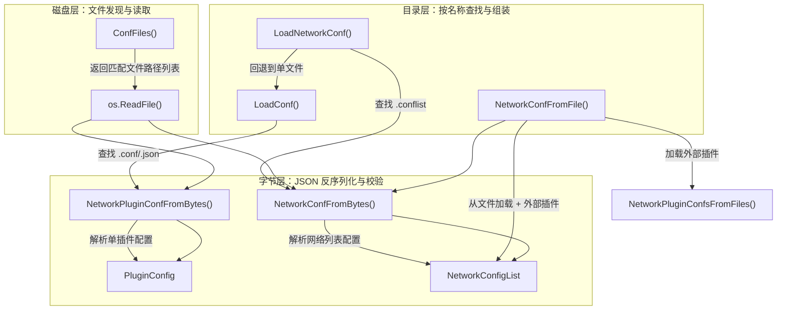
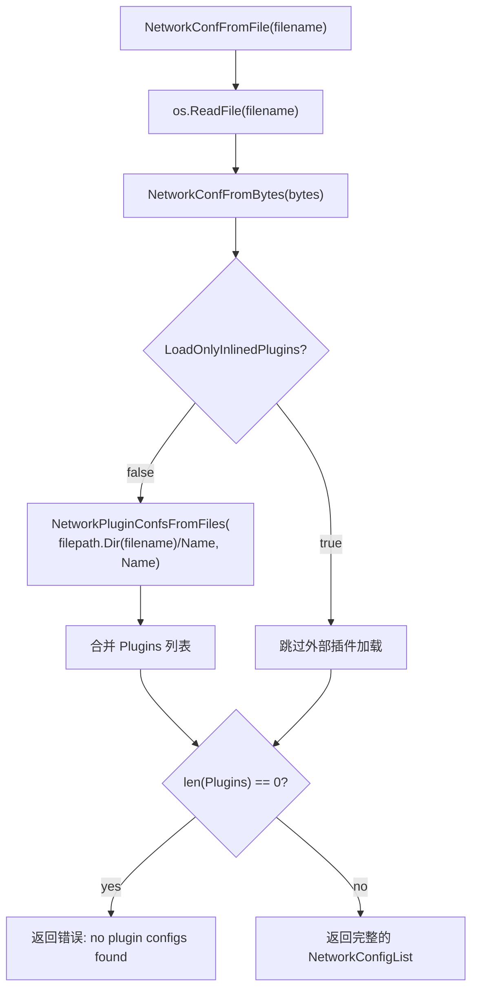

`conf.go` 是 libcni 库中负责**从磁盘文件和原始字节流中加载、解析、注入 CNI 网络配置**的核心模块。它将 JSON 格式的配置文件转化为 Go 运行时结构体（`PluginConfig` 和 `NetworkConfigList`），为后续的插件执行引擎提供类型安全的数据输入。理解这个模块是掌握 libcni 整体工作流的关键一步——它是"配置即数据"理念在 CNI 中的直接体现。

Sources: [conf.go](libcni/conf.go#L1-L29)

---

## 核心数据结构：PluginConfig 与 NetworkConfigList

在深入加载逻辑之前，必须先理解两个承载配置的核心结构体，它们均定义在 [api.go](libcni/api.go#L74-L87) 中：

| 结构体 | 字段 | 用途 |
|---|---|---|
| **`PluginConfig`** | `Network *types.PluginConf` | 反序列化后的插件配置对象 |
| | `Bytes []byte` | 原始 JSON 字节（保留用于注入和序列化） |
| **`NetworkConfigList`** | `Name string` | 网络名称（全局唯一标识符） |
| | `CNIVersion string` | 解析后确定的 CNI 规范版本 |
| | `DisableCheck bool` | 是否跳过 CHECK 操作 |
| | `DisableGC bool` | 是否跳过 GC 操作 |
| | `LoadOnlyInlinedPlugins bool` | 是否仅使用内联插件（忽略外部插件目录） |
| | `Plugins []*PluginConfig` | 有序的插件配置列表 |
| | `Bytes []byte` | 原始 conflist JSON 字节 |

**`PluginConfig`** 的设计哲学值得注意：它同时持有反序列化后的结构化对象（`Network`）和原始字节（`Bytes`）。这种"双持"模式使得配置可以在被解析后，仍然能够被修改（通过 `InjectConf`）并重新序列化为精确的 JSON，避免了 Go 默认值污染输出的问题。`types.PluginConf` 的关键字段包括 `Name`、`Type`（必需）、`Capabilities`、`IPAM` 和 `DNS` 等。

Sources: [api.go](libcni/api.go#L70-L87), [types.go](pkg/types/types.go#L64-L78)

---

## 错误类型体系

`conf.go` 定义了两种专用错误类型，为调用方提供了精确的错误匹配能力：

- **`NotFoundError`**：当配置目录中找不到指定名称的网络配置时返回，包含 `Dir`（搜索目录）和 `Name`（期望的网络名称）。
- **`NoConfigsFoundError`**：当配置目录中没有任何配置文件时返回，仅包含 `Dir`。

它们都是具名结构体类型（而非简单的 `errors.New()`），这意味着调用方可以使用 `errors.As()` 进行类型断言，实现精细化的错误处理分支。

Sources: [conf.go](libcni/conf.go#L31-L46)

---

## 整体架构：三层加载模型

`conf.go` 的函数设计遵循一个清晰的三层抽象，每一层解决不同粒度的配置加载需求：



Sources: [conf.go](libcni/conf.go#L53-L394)

---

## 字节层解析：从 JSON 到结构体

### 单插件配置解析：NetworkPluginConfFromBytes

这是最基础的解析函数，接收原始 JSON 字节，返回一个 `PluginConfig`：

```go
func NetworkPluginConfFromBytes(pluginConfBytes []byte) (*PluginConfig, error)
```

其处理流程非常直接：将字节反序列化为 `types.PluginConf`，然后校验 `type` 字段必须存在。如果 `type` 缺失，将返回 `"error parsing configuration: missing 'type'"` 错误。**注意**：此函数不会校验插件配置是否真正"属于"某个网络配置——这种关联性由调用方（如 `NetworkPluginConfsFromFiles`）通过目录命名约定来保证。

Sources: [conf.go](libcni/conf.go#L53-L64)

### 网络列表配置解析：NetworkConfFromBytes

这是整个模块中最复杂的函数，承担了 conflist 格式的完整解析任务。其处理流程可以用如下步骤分解：

**第一步：基础字段提取**

使用 `map[string]interface{}` 进行原始 JSON 反序列化（而非直接映射到结构体），这为后续灵活的类型检查和版本处理提供了基础。立即提取并校验 `name`（必需，字符串类型）和 `cniVersion`（可选，字符串类型）。

**第二步：版本选择算法**

这是理解 `NetworkConfFromBytes` 的关键。CNI 支持两种版本声明方式：

| 字段 | 类型 | 说明 |
|---|---|---|
| `cniVersion` | `string` | 单一版本声明（传统方式） |
| `cniVersions` | `[]string` | 多版本声明列表（新方式） |

当两者同时存在时，解析器会将它们合并，过滤掉高于当前库实现版本（`version.Current()`，当前为 `"1.1.0"`）的版本，然后按版本号排序后选择**最高兼容版本**作为最终 `CNIVersion`。这确保了向前兼容性——即使配置文件声明了未来的版本号，库也能优雅地回退到它实际支持的最高版本。

版本比较使用 `version.GreaterThan()` 实现，该函数按 major.minor.micro 三段式进行比较。

**第三步：布尔字段解析**

通过内部 `readBool` 闭包函数解析 `disableCheck`、`disableGC` 和 `loadOnlyInlinedPlugins` 三个布尔字段。该函数的一个精妙之处在于它同时接受 JSON 布尔值（`true`/`false`）和字符串值（`"true"`/`"false"`），大小写不敏感。这种宽容的解析策略在实际部署中非常有用，因为某些配置管理工具可能将所有值序列化为字符串。

**第四步：插件列表解析**

如果配置中存在 `plugins` 键，解析器会遍历数组中的每个插件对象，将其重新序列化为 JSON 字节后调用 `ConfFromBytes`（即 `NetworkPluginConfFromBytes` 的别名）逐个解析。这里有一个关键的交互约束：

| `plugins` 存在？ | `loadOnlyInlinedPlugins` | 行为 |
|---|---|---|
| ✅ | `true` | 仅使用内联插件，忽略外部插件目录 |
| ✅ | `false` | 合并内联插件 + 外部插件目录 |
| ❌ | `true` | **返回错误**：必须同时提供 `plugins` |
| ❌ | `false`（默认） | 仅使用外部插件目录（或回退到单文件格式） |

Sources: [conf.go](libcni/conf.go#L92-L245)

---

## 文件与目录层：从磁盘到内存

### ConfFiles：文件发现工具函数

`ConfFiles(dir string, extensions []string)` 是整个加载体系的基石工具函数。它扫描指定目录，返回文件扩展名匹配指定集合的所有文件路径（跳过子目录）。一个值得注意的设计决策是：当目录不存在时，它返回空切片而非错误——这使得调用方可以灵活地处理"可选目录"的场景，而无需额外的存在性检查。

Sources: [conf.go](libcni/conf.go#L298-L324)

### 外部插件加载：NetworkPluginConfsFromFiles

这个函数实现了 CNI 的**外部插件发现**机制。给定一个网络配置路径和网络名称，它会扫描 `networkConfPath/networkName/*.conf` 目录下的所有 `.conf` 文件，将其解析为 `PluginConfig` 列表。

例如，如果 conflist 文件位于 `/etc/cni/net.d/50-mynet.conflist`，且网络名称为 `"mynet"`，那么外部插件配置应放在 `/etc/cni/net.d/mynet/*.conf` 目录下。这种约定通过目录名隐式地将插件配置与网络关联起来。

Sources: [conf.go](libcni/conf.go#L68-L90)

### NetworkConfFromFile：文件级加载与组装

`NetworkConfFromFile` 是连接字节层和磁盘层的桥梁函数。它不仅从文件读取 conflist 并解析，还负责根据 `LoadOnlyInlinedPlugins` 标志决定是否加载外部插件：



最后的零插件检查是一个安全兜底——如果经过内联解析和外部加载后仍然没有任何插件，函数会返回明确的错误信息，避免下游出现空指针异常。

Sources: [conf.go](libcni/conf.go#L247-L272)

### LoadNetworkConf：目录级查找与兼容回退

`LoadNetworkConf(dir, name)` 是面向上层 API 的主入口函数。它首先在目录中搜索 `.conflist` 文件并按文件名排序，遍历查找匹配 `name` 的配置。如果未找到 conflist 文件，它会**向后兼容地回退**到 `LoadConf`，尝试加载单文件格式（`.conf` 或 `.json`），并通过 `ConfListFromConf` 将其"提升"为列表格式。

这种分层查找策略体现了 CNI 项目对向后兼容的重视：旧的 `.conf` 单文件格式仍然可以被加载，只是会被自动包装成一个只含一个插件的 `NetworkConfigList`。

Sources: [conf.go](libcni/conf.go#L356-L389)

---

## 版本选择机制详解

版本选择是 `NetworkConfFromBytes` 中最精细的逻辑。以下通过具体场景说明其行为：

| 配置内容 | 当前库版本 | 解析结果 CNIVersion | 说明 |
|---|---|---|---|
| `"cniVersion": "0.4.0"` | `1.1.0` | `"0.4.0"` | 传统单版本声明，直接使用 |
| `"cniVersions": ["0.4.0", "1.0.0", "1.1.0"]` | `1.1.0` | `"1.1.0"` | 选最高兼容版本 |
| `"cniVersions": ["0.4.0", "99.0.0"]` | `1.1.0` | `"0.4.0"` | 过滤掉超出当前库的版本 |
| `"cniVersion": "1.0.0", "cniVersions": ["0.4.0"]` | `1.1.0` | `"1.0.0"` | 合并后选最高：`1.0.0` > `0.4.0` |
| `"cniVersions": []` | `1.1.0` | `""` | 空数组，无版本可用 |

排序使用 `slices.SortFunc` 配合 `version.GreaterThan` 进行自定义比较，而非简单的字典序排序——这确保了 `"1.10.0"` 正确地大于 `"1.9.0"`。

Sources: [conf.go](libcni/conf.go#L107-L160), [version.go](pkg/version/version.go#L26-L28), [plugin.go](pkg/version/plugin.go#L147-L168)

---

## 配置注入：InjectConf

`InjectConf` 函数提供了一种运行时修改已加载配置的机制。这在插件链式执行场景中至关重要——每个插件在执行前都需要被注入网络名称、CNI 版本和前一个插件的执行结果。

```go
func InjectConf(original *PluginConfig, newValues map[string]interface{}) (*PluginConfig, error)
```

其工作原理是：将 `original.Bytes` 反序列化为 `map[string]interface{}`，用 `newValues` 中的键值对覆盖或追加，然后重新序列化并调用 `NetworkPluginConfFromBytes` 返回全新的 `PluginConfig`。这种"反序列化 → 修改 → 重新序列化"的管道确保了注入值会被完整地校验和类型检查。

该函数有两个显式的校验规则：键不能为空字符串，值不能为 `nil`。这防止了意外地向配置中注入无效数据。

Sources: [conf.go](libcni/conf.go#L392-L417)

---

## 已弃用函数与向后兼容别名

`conf.go` 中包含多个已弃用但保留的函数，它们构成了完整的向后兼容层：

| 弃用函数 | 推荐替代 | 说明 |
|---|---|---|
| `ConfFromBytes` | `NetworkPluginConfFromBytes` | 单插件配置解析 |
| `ConfFromFile` | （直接读取文件后使用 `NetworkPluginConfFromBytes`） | 从文件加载单插件配置 |
| `LoadConf` | `LoadNetworkConf` | 按名称加载单插件配置 |
| `LoadConfList` | `LoadNetworkConf` | 按名称加载网络列表配置 |
| `ConfListFromConf` | 使用 conflist 格式替代 | 将单插件配置"提升"为列表 |

`ConfListFromConf` 的"提升"逻辑尤其值得理解：它将一个 `PluginConfig` 的原始字节重新反序列化为通用 map，然后构造一个包含 `name`、`cniVersion` 和 `plugins`（单元素数组）的新 map，最终序列化后通过 `ConfListFromBytes` 解析为完整的 `NetworkConfigList`。这种间接的方式（而非直接构造结构体）确保了生成的 JSON 字节表示是干净的——不会包含 Go 的零值默认字段。

Sources: [conf.go](libcni/conf.go#L274-L294), [conf.go](libcni/conf.go#L419-L445)

---

## loadOnlyInlinedPlugins 行为全景

`loadOnlyInlinedPlugins` 字段控制了外部插件目录的加载行为，是 conflist 格式中一个重要的架构特性。以下表格总结了所有组合场景及其对应的测试覆盖：

| 场景 | conflist 中有 `plugins`? | `loadOnlyInlinedPlugins` | 外部插件目录存在? | 最终插件数 | 测试位置 |
|---|---|---|---|---|---|
| 标准链式配置 | ✅ | `false`（默认） | ✅ | 内联 + 外部合并 | 合并测试 |
| 仅内联模式 | ✅ | `true` | ✅ | 仅内联（忽略外部） | 忽略测试 |
| 无 plugins + 无外部 | ❌ | `false`（默认） | ❌ | 0 → 报错 | 错误测试 |
| 无 plugins + 有内联声明 | ❌ | `true` | - | 报错（逻辑矛盾） | 矛盾测试 |
| 无 plugins + 有外部 | ❌ | `false`（默认） | ✅ | 仅外部 | 外部加载测试 |

这种设计为 CNI 配置管理提供了灵活性：你可以将所有插件定义都写在单个 conflist 文件中（适合简单场景），也可以将部分插件放在外部目录中独立管理（适合复杂的多插件组合场景），还可以通过 `loadOnlyInlinedPlugins: true` 明确声明"这个网络只使用文件中列出的插件"。

Sources: [conf.go](libcni/conf.go#L209-L244), [conf.go](libcni/conf.go#L256-L271), [conf_test.go](libcni/conf_test.go#L393-L598)

---

## 函数调用关系总览

下表整理了 `conf.go` 中所有公开函数的签名、职责和调用关系：

| 函数 | 签名 | 入站调用者 | 出站依赖 |
|---|---|---|---|
| `ConfFiles` | `(dir, exts) → ([]string, error)` | `LoadConf`, `NetworkPluginConfsFromFiles`, `LoadNetworkConf` | `os.ReadDir` |
| `NetworkPluginConfFromBytes` | `([]byte) → (*PluginConfig, error)` | `NetworkPluginConfsFromFiles`, `InjectConf`, `ConfFromBytes` | `json.Unmarshal` |
| `NetworkPluginConfsFromFiles` | `(path, name) → ([]*PluginConfig, error)` | `NetworkConfFromFile` | `ConfFiles`, `NetworkPluginConfFromBytes` |
| `NetworkConfFromBytes` | `([]byte) → (*NetworkConfigList, error)` | `NetworkConfFromFile`, `ConfListFromBytes` | `version.GreaterThan`, `ConfFromBytes` |
| `NetworkConfFromFile` | `(filename) → (*NetworkConfigList, error)` | `LoadNetworkConf`, `ConfListFromFile` | `NetworkConfFromBytes`, `NetworkPluginConfsFromFiles` |
| `LoadNetworkConf` | `(dir, name) → (*NetworkConfigList, error)` | 外部 API 调用者 | `ConfFiles`, `NetworkConfFromFile`, `LoadConf` |
| `InjectConf` | `(orig, newVals) → (*PluginConfig, error)` | `buildOneConfig` (api.go) | `json.Unmarshal`, `NetworkPluginConfFromBytes` |

Sources: [conf.go](libcni/conf.go#L1-L446)

---

## 与其他模块的协作关系

`conf.go` 并非孤立运作——它是 libcni 库配置管道的核心节点。了解它与上下游模块的关系有助于形成完整的心智模型：

- **上游**：[libcni 库：运行时集成的完整 API 接口](10-libcni-ku-yun-xing-shi-ji-cheng-de-wan-zheng-api-jie-kou) 中的 `CNIConfig` 通过 `LoadNetworkConf` 获取 `NetworkConfigList`，然后传递给插件执行引擎。
- **下游**：[插件执行引擎：查找、调用与结果处理](12-cha-jian-zhi-xing-yin-qing-cha-zhao-diao-yong-yu-jie-guo-chu-li) 接收 `conf.go` 产出的 `PluginConfig`，将其序列化后通过 stdin 传递给插件二进制。
- **类型支撑**：[类型系统：多版本类型定义与自动转换](14-lei-xing-xi-tong-duo-ban-ben-lei-xing-ding-yi-yu-zi-dong-zhuan-huan) 中的 `types.PluginConf` 是配置反序列化的目标类型。
- **版本协商**：[版本协商与兼容性校验机制](15-ban-ben-xie-shang-yu-jian-rong-xing-xiao-yan-ji-zhi) 中的 `version.GreaterThan` 和 `version.Current()` 为版本选择算法提供比较基础。

建议阅读顺序：先理解本文的配置加载流程，再阅读 [插件执行引擎：查找、调用与结果处理](12-cha-jian-zhi-xing-yin-qing-cha-zhao-diao-yong-yu-jie-guo-chu-li) 了解这些配置如何被实际传递给插件进程。